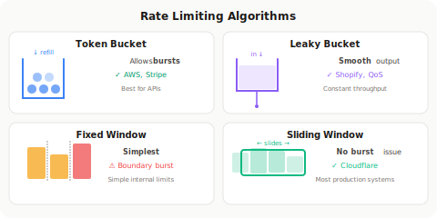

# Rate Limiting

!!! danger "Real Incident: Twitter, 2022"
    Elon's first week: bots scraped Twitter at 10x normal rate. No effective rate limiting on the read path. Result: **$100K+/day in excess infra costs**, emergency "you are rate limited" pages for real users. Rate limiting isn't optional — it's survival.

---

## The 30-Second Explanation

**Rate limiting = controlling how many requests a user/service can make in a given time window.**

🛡️

<h4 style="margin: 0 0 0.5rem; color: #92400e;">Why Rate Limit?</h4>

Prevent abuse, protect downstream services, ensure fair usage, control costs

💥

<h4 style="margin: 0 0 0.5rem; color: #dc2626;">Without It?</h4>

One bad actor takes down your entire service. DDoS, scraping bots, buggy client retries.

> **The key insight:** Rate limiting is NOT just about security. It's about **service stability** and **fair resource allocation** across tenants.

---

## The Nightclub Analogy

You're a bouncer at a club with a 200-person capacity.

| Strategy | What the bouncer does | Real-world equivalent |
|:---:|---|---|
| **Fixed Window** | "200 people per hour. At :00, counter resets." | GitHub: 5000 req/hr |
| **Sliding Window** | "200 people in ANY rolling 60-min window." | Stripe API |
| **Token Bucket** | "Here's 200 tokens. You get 5 back per minute. Spend them however." | AWS API Gateway |
| **Leaky Bucket** | "Queue at the door. Let 3 in per minute, no matter what." | Network traffic shaping |

---

## Algorithms at a Glance

## Algorithms — What FAANG Actually Asks

### Fixed Window Counter

| Aspect | Detail |
|---|---|
| **How** | Count requests in fixed time windows (e.g., 12:00-12:01) |
| **Pro** | Dead simple. One counter per window. |
| **Con** | Burst at boundary — 100 reqs at 12:00:59 + 100 at 12:01:00 = 200 in 2 seconds |
| **Used by** | Basic API rate limiters, simple internal services |

### Sliding Window Log

| Aspect | Detail |
|---|---|
| **How** | Store timestamp of every request. Count within window. |
| **Pro** | Perfectly accurate. No boundary burst. |
| **Con** | Memory-expensive. Storing every timestamp doesn't scale. |
| **Used by** | Low-volume, high-accuracy needs (fraud detection) |

### Sliding Window Counter

| Aspect | Detail |
|---|---|
| **How** | Weighted average of current + previous window counts |
| **Pro** | Accurate enough, memory-efficient (just 2 counters) |
| **Con** | Approximation — not exact |
| **Used by** | Cloudflare, most production systems |

### Token Bucket

| Aspect | Detail |
|---|---|
| **How** | Bucket holds tokens. Each request costs 1. Tokens refill at fixed rate. |
| **Pro** | Allows bursts (up to bucket size). Smooth average rate. |
| **Con** | Slightly more complex state (tokens + last_refill_time) |
| **Used by** | AWS, Stripe, most FAANG internal services |

### Leaky Bucket

| Aspect | Detail |
|---|---|
| **How** | Requests enter a queue. Processed at fixed rate. Queue full = reject. |
| **Pro** | Perfectly smooth output rate. |
| **Con** | No bursts allowed. Queue adds latency. |
| **Used by** | Network traffic shaping, Shopify |

---

## Where to Rate Limit

<table style="width: 100%; border-collapse: collapse;">
<thead>
<tr style="background: linear-gradient(135deg, #f8fafc, #f1f5f9);">
<th style="padding: 0.8rem; border-bottom: 2px solid #e2e8f0; text-align: left;">Layer</th>
<th style="padding: 0.8rem; border-bottom: 2px solid #e2e8f0; text-align: left;">What</th>
<th style="padding: 0.8rem; border-bottom: 2px solid #e2e8f0; text-align: left;">Example</th>
</tr>
</thead>
<tbody>
<tr><td style="padding: 0.7rem; border-bottom: 1px solid #f1f5f9;"><strong>Client-side</strong></td><td style="padding: 0.7rem; border-bottom: 1px solid #f1f5f9;">Debounce, local throttle</td><td style="padding: 0.7rem; border-bottom: 1px solid #f1f5f9;">Search autocomplete — wait 300ms before hitting API</td></tr>
<tr><td style="padding: 0.7rem; border-bottom: 1px solid #f1f5f9;"><strong>Load Balancer / CDN</strong></td><td style="padding: 0.7rem; border-bottom: 1px solid #f1f5f9;">IP-based, geo-based</td><td style="padding: 0.7rem; border-bottom: 1px solid #f1f5f9;">Cloudflare blocking IPs with 1000+ req/min</td></tr>
<tr><td style="padding: 0.7rem; border-bottom: 1px solid #f1f5f9;"><strong>API Gateway</strong></td><td style="padding: 0.7rem; border-bottom: 1px solid #f1f5f9;">Per-user, per-API-key</td><td style="padding: 0.7rem; border-bottom: 1px solid #f1f5f9;">Kong/Apigee enforcing 1000 req/min per key</td></tr>
<tr><td style="padding: 0.7rem; border-bottom: 1px solid #f1f5f9;"><strong>Application</strong></td><td style="padding: 0.7rem; border-bottom: 1px solid #f1f5f9;">Business logic limits</td><td style="padding: 0.7rem; border-bottom: 1px solid #f1f5f9;">Max 5 password attempts, max 3 OTP sends</td></tr>
<tr><td style="padding: 0.7rem;"><strong>Database</strong></td><td style="padding: 0.7rem;">Connection pooling, query limits</td><td style="padding: 0.7rem;">Max 100 concurrent connections per service</td></tr>
</tbody>
</table>

---

## Distributed Rate Limiting — The Hard Part

**Single server?** Easy. In-memory counter.

**100 servers behind a load balancer?** Now you need shared state.

| Approach | Trade-off |
|---|---|
| **Centralized (Redis)** | Accurate but adds latency (1 network hop per request). Single point of failure. |
| **Local + Sync** | Each server counts locally, syncs periodically. Fast but can overshoot by N × local_limit. |
| **Sticky Sessions** | Route same user to same server. Simple but kills load balancing. |
| **Cell-based** | Partition users across cells. Each cell has its own limiter. Used at Uber scale. |

!!! tip "Interview Gold"
    "I'd use Redis with token bucket. Each request does an atomic EVAL script — check tokens, decrement, return allow/deny. Redis handles 100K+ ops/sec single-threaded, so it won't be the bottleneck. For fault tolerance, I'd fail-open briefly if Redis is down — better to let extra traffic through than reject everyone."

---

## HTTP Response: What to Return

| Scenario | Response |
|---|---|
| Allowed | `200 OK` with rate limit headers |
| Rate limited | `429 Too Many Requests` |
| Headers to include | `X-RateLimit-Limit`, `X-RateLimit-Remaining`, `X-RateLimit-Reset` |
| Retry guidance | `Retry-After: 30` (seconds until reset) |

---

## Real Systems

| Company | Strategy | Details |
|---|---|---|
| **GitHub** | 5000 req/hr per token | Fixed window, returns headers |
| **Stripe** | Token bucket | 100 req/sec burst, 25/sec sustained |
| **Twitter/X** | Sliding window | 300 tweets/3hr, 900 reads/15min |
| **Google Maps** | Per-day + per-second | 28,500/day AND 50/sec |
| **Cloudflare** | Multi-layer | IP → ASN → Account → Rule-based |

---

## The 3 Mistakes That Get You Rejected

!!! danger "Don't Say These"
    1. **"Just reject with 403"** — Rate limiting returns `429`, not `403`. You MUST include `Retry-After` header. Basic HTTP knowledge.
    2. **"Use a local counter on each server"** — With 50 servers, that's 50x your intended limit. You need centralized or synchronized counting.
    3. **"Rate limit everyone the same"** — Differentiate between free/paid tiers, internal/external traffic, read/write operations.

---

## Interview Answer Template

> "For [system], I'd implement rate limiting at [layer] using [algorithm] because [reason]. For distributed enforcement, I'd use [Redis/local+sync] with [token bucket/sliding window]. Key decisions: fail-open vs fail-closed on limiter failure, per-user vs per-IP vs per-API-key granularity, and returning proper `429` with `Retry-After` headers for good client behavior."

---

## Quick Recall Card

| Question | Answer |
|---|---|
| Best algorithm for bursts? | Token Bucket (allows burst up to bucket size) |
| Best for smooth rate? | Leaky Bucket (fixed output rate) |
| Best accuracy/memory trade-off? | Sliding Window Counter |
| Where to store state (distributed)? | Redis (atomic operations, fast, shared) |
| What HTTP code? | 429 Too Many Requests |
| Fail-open or fail-closed? | Usually fail-open (let traffic through if limiter is down) |
| Per what? | Depends: per-user, per-IP, per-API-key, per-endpoint |
