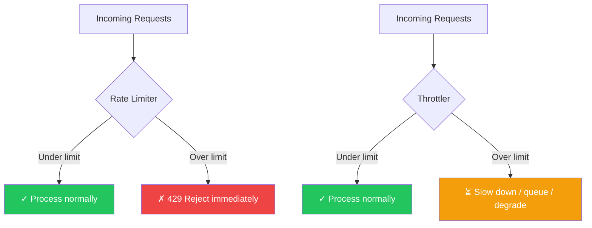
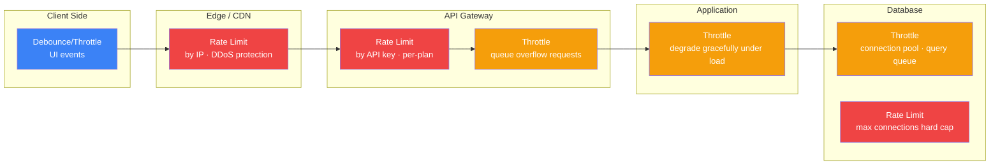
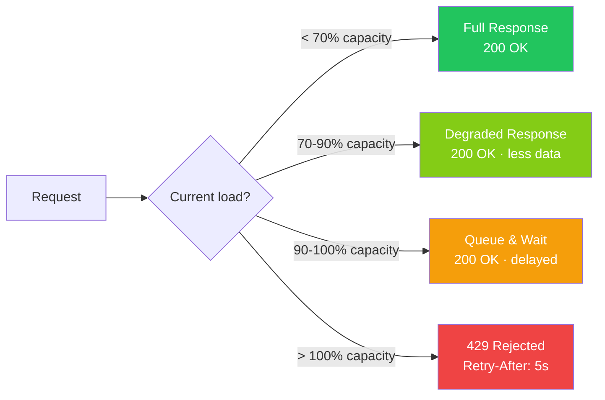

# Rate Limiting

!!! danger "Real Incident: Twitter, 2022"
    Elon's first week: bots scraped Twitter at 10x normal rate. No effective rate limiting on the read path. Result: **$100K+/day in excess infra costs**, emergency "you are rate limited" pages for real users. Rate limiting isn't optional — it's survival.

---

## The 30-Second Explanation

**Rate limiting = controlling how many requests a user/service can make in a given time window.**

<div style="display: grid; grid-template-columns: 1fr 1fr; gap: 1.5rem; margin: 2rem 0;">
<div style="background: linear-gradient(135deg, #fef3c7, #fffbeb); border: 2px solid #f59e0b; border-radius: 12px; padding: 1.5rem; text-align: center;">
<div style="font-size: 2.5rem; margin-bottom: 0.5rem;">🛡️</div>
<h4 style="margin: 0 0 0.5rem; color: #92400e;">Why Rate Limit?</h4>
<p style="margin: 0; font-size: 0.9rem; color: #78350f;">Prevent abuse, protect downstream services, ensure fair usage, control costs</p>
</div>
<div style="background: linear-gradient(135deg, #fee2e2, #fef2f2); border: 2px solid #f87171; border-radius: 12px; padding: 1.5rem; text-align: center;">
<div style="font-size: 2.5rem; margin-bottom: 0.5rem;">💥</div>
<h4 style="margin: 0 0 0.5rem; color: #dc2626;">Without It?</h4>
<p style="margin: 0; font-size: 0.9rem; color: #7f1d1d;">One bad actor takes down your entire service. DDoS, scraping bots, buggy client retries.</p>
</div>
</div>

> **The key insight:** Rate limiting is NOT just about security. It's about **service stability** and **fair resource allocation** across tenants.

---

## The Nightclub Analogy

You're a bouncer at a club with a 200-person capacity.

| Strategy | What the bouncer does | Real-world equivalent |
|:---:|---|---|
| **Fixed Window** | "200 people per hour. At :00, counter resets." | GitHub: 5000 req/hr |
| **Sliding Window** | "200 people in ANY rolling 60-min window." | Stripe API |
| **Token Bucket** | "Here's 200 tokens. You get 5 back per minute. Spend them however." | AWS API Gateway |
| **Leaky Bucket** | "Queue at the door. Let 3 in per minute, no matter what." | Network traffic shaping |

---

## Algorithms at a Glance


## Algorithms — What FAANG Actually Asks

### Fixed Window Counter

| Aspect | Detail |
|---|---|
| **How** | Count requests in fixed time windows (e.g., 12:00-12:01) |
| **Pro** | Dead simple. One counter per window. |
| **Con** | Burst at boundary — 100 reqs at 12:00:59 + 100 at 12:01:00 = 200 in 2 seconds |
| **Used by** | Basic API rate limiters, simple internal services |

### Sliding Window Log

| Aspect | Detail |
|---|---|
| **How** | Store timestamp of every request. Count within window. |
| **Pro** | Perfectly accurate. No boundary burst. |
| **Con** | Memory-expensive. Storing every timestamp doesn't scale. |
| **Used by** | Low-volume, high-accuracy needs (fraud detection) |

### Sliding Window Counter

| Aspect | Detail |
|---|---|
| **How** | Weighted average of current + previous window counts |
| **Pro** | Accurate enough, memory-efficient (just 2 counters) |
| **Con** | Approximation — not exact |
| **Used by** | Cloudflare, most production systems |

### Token Bucket

| Aspect | Detail |
|---|---|
| **How** | Bucket holds tokens. Each request costs 1. Tokens refill at fixed rate. |
| **Pro** | Allows bursts (up to bucket size). Smooth average rate. |
| **Con** | Slightly more complex state (tokens + last_refill_time) |
| **Used by** | AWS, Stripe, most FAANG internal services |

### Leaky Bucket

| Aspect | Detail |
|---|---|
| **How** | Requests enter a queue. Processed at fixed rate. Queue full = reject. |
| **Pro** | Perfectly smooth output rate. |
| **Con** | No bursts allowed. Queue adds latency. |
| **Used by** | Network traffic shaping, Shopify |

---

## Where to Rate Limit

<div style="overflow-x: auto; margin: 1.5rem 0;">
<table style="width: 100%; border-collapse: collapse;">
<thead>
<tr style="background: linear-gradient(135deg, #f8fafc, #f1f5f9);">
<th style="padding: 0.8rem; border-bottom: 2px solid #e2e8f0; text-align: left;">Layer</th>
<th style="padding: 0.8rem; border-bottom: 2px solid #e2e8f0; text-align: left;">What</th>
<th style="padding: 0.8rem; border-bottom: 2px solid #e2e8f0; text-align: left;">Example</th>
</tr>
</thead>
<tbody>
<tr><td style="padding: 0.7rem; border-bottom: 1px solid #f1f5f9;"><strong>Client-side</strong></td><td style="padding: 0.7rem; border-bottom: 1px solid #f1f5f9;">Debounce, local throttle</td><td style="padding: 0.7rem; border-bottom: 1px solid #f1f5f9;">Search autocomplete — wait 300ms before hitting API</td></tr>
<tr><td style="padding: 0.7rem; border-bottom: 1px solid #f1f5f9;"><strong>Load Balancer / CDN</strong></td><td style="padding: 0.7rem; border-bottom: 1px solid #f1f5f9;">IP-based, geo-based</td><td style="padding: 0.7rem; border-bottom: 1px solid #f1f5f9;">Cloudflare blocking IPs with 1000+ req/min</td></tr>
<tr><td style="padding: 0.7rem; border-bottom: 1px solid #f1f5f9;"><strong>API Gateway</strong></td><td style="padding: 0.7rem; border-bottom: 1px solid #f1f5f9;">Per-user, per-API-key</td><td style="padding: 0.7rem; border-bottom: 1px solid #f1f5f9;">Kong/Apigee enforcing 1000 req/min per key</td></tr>
<tr><td style="padding: 0.7rem; border-bottom: 1px solid #f1f5f9;"><strong>Application</strong></td><td style="padding: 0.7rem; border-bottom: 1px solid #f1f5f9;">Business logic limits</td><td style="padding: 0.7rem; border-bottom: 1px solid #f1f5f9;">Max 5 password attempts, max 3 OTP sends</td></tr>
<tr><td style="padding: 0.7rem;"><strong>Database</strong></td><td style="padding: 0.7rem;">Connection pooling, query limits</td><td style="padding: 0.7rem;">Max 100 concurrent connections per service</td></tr>
</tbody>
</table>
</div>

---

## Distributed Rate Limiting — The Hard Part

**Single server?** Easy. In-memory counter.

**100 servers behind a load balancer?** Now you need shared state.

| Approach | Trade-off |
|---|---|
| **Centralized (Redis)** | Accurate but adds latency (1 network hop per request). Single point of failure. |
| **Local + Sync** | Each server counts locally, syncs periodically. Fast but can overshoot by N × local_limit. |
| **Sticky Sessions** | Route same user to same server. Simple but kills load balancing. |
| **Cell-based** | Partition users across cells. Each cell has its own limiter. Used at Uber scale. |

!!! tip "Interview Gold"
    "I'd use Redis with token bucket. Each request does an atomic EVAL script — check tokens, decrement, return allow/deny. Redis handles 100K+ ops/sec single-threaded, so it won't be the bottleneck. For fault tolerance, I'd fail-open briefly if Redis is down — better to let extra traffic through than reject everyone."

---

## HTTP Response: What to Return

| Scenario | Response |
|---|---|
| Allowed | `200 OK` with rate limit headers |
| Rate limited | `429 Too Many Requests` |
| Headers to include | `X-RateLimit-Limit`, `X-RateLimit-Remaining`, `X-RateLimit-Reset` |
| Retry guidance | `Retry-After: 30` (seconds until reset) |

---

## Real Systems

| Company | Strategy | Details |
|---|---|---|
| **GitHub** | 5000 req/hr per token | Fixed window, returns headers |
| **Stripe** | Token bucket | 100 req/sec burst, 25/sec sustained |
| **Twitter/X** | Sliding window | 300 tweets/3hr, 900 reads/15min |
| **Google Maps** | Per-day + per-second | 28,500/day AND 50/sec |
| **Cloudflare** | Multi-layer | IP → ASN → Account → Rule-based |

---

## The 3 Mistakes That Get You Rejected

!!! danger "Don't Say These"
    1. **"Just reject with 403"** — Rate limiting returns `429`, not `403`. You MUST include `Retry-After` header. Basic HTTP knowledge.
    2. **"Use a local counter on each server"** — With 50 servers, that's 50x your intended limit. You need centralized or synchronized counting.
    3. **"Rate limit everyone the same"** — Differentiate between free/paid tiers, internal/external traffic, read/write operations.

---

## Interview Answer Template

> "For [system], I'd implement rate limiting at [layer] using [algorithm] because [reason]. For distributed enforcement, I'd use [Redis/local+sync] with [token bucket/sliding window]. Key decisions: fail-open vs fail-closed on limiter failure, per-user vs per-IP vs per-API-key granularity, and returning proper `429` with `Retry-After` headers for good client behavior."

---

## Rate Limiting vs Throttling — The Difference That Trips Up Seniors

!!! warning "Why This Matters"
    In interviews at Stripe, Salesforce, and Amazon, interviewers specifically ask: "What's the difference between rate limiting and throttling?" Most candidates use them interchangeably — **that's wrong**, and it signals you haven't built these systems in production.

---

### The Core Distinction


```mermaid
flowchart TD
    REQ[Incoming Requests] --> RL{Rate Limiter}
    RL -->|Under limit| PASS[✓ Process normally]
    RL -->|Over limit| REJECT[✗ 429 Reject immediately]

    REQ2[Incoming Requests] --> TH{Throttler}
    TH -->|Under limit| PASS2[✓ Process normally]
    TH -->|Over limit| SLOW[⏳ Slow down / queue / degrade]

    style REJECT fill:#ef4444,color:#fff
    style SLOW fill:#f59e0b,color:#fff
    style PASS fill:#22c55e,color:#fff
    style PASS2 fill:#22c55e,color:#fff
```

| Aspect | Rate Limiting | Throttling |
|---|---|---|
| **Action when exceeded** | **Hard reject** (429 / drop) | **Slow down** (queue, delay, degrade) |
| **Philosophy** | "No. Come back later." | "OK but slower / less." |
| **Who controls the pace** | Server enforces on client | Can be client-side or server-side |
| **User experience** | Error message, must retry | Degraded but still working |
| **Analogy** | Bouncer: "Club's full, go away" | Speed bump: "Slow down but keep driving" |
| **Response** | Immediate rejection | Delayed processing or reduced quality |
| **Data loss risk** | Client must retry (may lose if no retry logic) | No loss — just slower |

---

### Real-World Examples (All Levels)

#### For Junior Engineers: The Highway Analogy

```
Rate Limiting = Toll booth closes. Cars turned away. "Road full, take another route."
Throttling    = Speed limit drops from 100km/h to 60km/h. Everyone still moves, just slower.
```

#### For Senior Engineers: Production Patterns

| Scenario | Rate Limiting Approach | Throttling Approach |
|---|---|---|
| **API overload** | Return `429`, client retries with backoff | Queue requests, process at sustainable rate |
| **Database pressure** | Reject new queries beyond connection pool | Reduce query concurrency, increase batch intervals |
| **Microservice cascade** | Circuit breaker opens → reject fast | Shed load gracefully: serve cached/stale data |
| **User uploads** | "Max 10 uploads/minute" → reject 11th | "Max 5MB/s upload speed" → slow transfer |
| **Email sending** | "Max 500 emails/day" → block email #501 | "Send at 10 emails/second" → queue the rest |
| **Search API** | "100 queries/minute per user" → reject | "Return top-5 results instead of top-50 when busy" |

#### For Architects: System-Level Patterns

**Pattern 1: Adaptive Throttling (Netflix)**
```
Normal load:     Full quality 4K stream (25 Mbps)
High load:       Downgrade to 1080p (5 Mbps)      ← Throttling (quality reduction)
Extreme load:    Downgrade to 720p (3 Mbps)       ← More throttling
Beyond capacity: "Service unavailable, try later"  ← Rate limiting kicks in
```

**Pattern 2: Tiered Throttling (AWS)**
```
Free tier:       Throttled to 1 req/sec sustained (burst to 5)
Standard tier:   Throttled to 10 req/sec sustained (burst to 100)
Enterprise tier: Throttled to 1000 req/sec sustained (burst to 5000)
Exceeded tier:   429 Too Many Requests             ← Rate limited
```

**Pattern 3: Backpressure Throttling (Kafka Consumers)**
```
Consumer lag < 1000:   Process at full speed
Consumer lag > 10000:  Throttle producer (slow accepts)
Consumer lag > 100000: Rate limit producer (reject new messages)
```

---

### Where Each Applies in a Typical Architecture


```mermaid
flowchart LR
    subgraph "Client Side"
        DEB[Debounce/Throttle<br/>UI events]
    end

    subgraph "Edge / CDN"
        RL1[Rate Limit<br/>by IP · DDoS protection]
    end

    subgraph "API Gateway"
        RL2[Rate Limit<br/>by API key · per-plan]
        TH1[Throttle<br/>queue overflow requests]
    end

    subgraph "Application"
        TH2[Throttle<br/>degrade gracefully under load]
    end

    subgraph "Database"
        TH3[Throttle<br/>connection pool · query queue]
        RL3[Rate Limit<br/>max connections hard cap]
    end

    DEB --> RL1 --> RL2 --> TH1 --> TH2 --> TH3

    style RL1 fill:#ef4444,color:#fff
    style RL2 fill:#ef4444,color:#fff
    style RL3 fill:#ef4444,color:#fff
    style TH1 fill:#f59e0b,color:#fff
    style TH2 fill:#f59e0b,color:#fff
    style TH3 fill:#f59e0b,color:#fff
    style DEB fill:#3b82f6,color:#fff
```

---

### Client-Side Throttling Patterns (JavaScript/Java)

=== "JavaScript — Debounce vs Throttle"

    ```javascript
    // THROTTLE: Execute at most once per interval (steady rate)
    // Use for: scroll events, resize, real-time search-as-you-type
    function throttle(fn, limit) {
      let lastCall = 0;
      return (...args) => {
        const now = Date.now();
        if (now - lastCall >= limit) {
          lastCall = now;
          fn(...args);
        }
      };
    }

    // DEBOUNCE: Execute only after user STOPS for N ms
    // Use for: search input (wait until user finishes typing)
    function debounce(fn, delay) {
      let timer;
      return (...args) => {
        clearTimeout(timer);
        timer = setTimeout(() => fn(...args), delay);
      };
    }

    // Usage
    searchInput.addEventListener('input', throttle(callAPI, 300));  // Max 1 call per 300ms
    searchInput.addEventListener('input', debounce(callAPI, 500));  // Wait 500ms of silence
    ```

=== "Java — Server-Side Throttle with Resilience4j"

    ```java
    // RATE LIMITER: Hard reject after limit
    RateLimiter rateLimiter = RateLimiter.of("api",
        RateLimiterConfig.custom()
            .limitForPeriod(100)           // 100 requests
            .limitRefreshPeriod(Duration.ofSeconds(1))  // per second
            .timeoutDuration(Duration.ZERO) // reject immediately (no waiting)
            .build());

    // BULKHEAD (Throttle): Queue overflow, process at capacity
    Bulkhead bulkhead = Bulkhead.of("db",
        BulkheadConfig.custom()
            .maxConcurrentCalls(25)         // only 25 concurrent DB calls
            .maxWaitDuration(Duration.ofMillis(500)) // queue for up to 500ms
            .build());

    // RATE LIMITER: returns 429 immediately when exceeded
    // BULKHEAD: queues up to 500ms, then rejects — this IS throttling
    ```

=== "Java — Guava RateLimiter (Token Bucket Throttle)"

    ```java
    // Guava RateLimiter is actually a THROTTLER, not a rate limiter
    // It blocks (slows down) callers instead of rejecting them
    RateLimiter limiter = RateLimiter.create(10.0); // 10 permits per second

    // This BLOCKS until a permit is available — throttling behavior
    limiter.acquire(); // Waits if necessary (does not reject)
    processRequest();

    // vs. tryAcquire — this is rate limiting (reject if unavailable)
    if (!limiter.tryAcquire()) {
        return ResponseEntity.status(429).body("Too many requests");
    }
    processRequest();
    ```

=== "Spring Boot — Custom Throttle Filter"

    ```java
    @Component
    public class AdaptiveThrottleFilter extends OncePerRequestFilter {

        private final AtomicInteger activeRequests = new AtomicInteger(0);
        private static final int THROTTLE_THRESHOLD = 500;
        private static final int REJECT_THRESHOLD = 1000;

        @Override
        protected void doFilterInternal(HttpServletRequest request,
                HttpServletResponse response, FilterChain chain)
                throws ServletException, IOException {

            int current = activeRequests.incrementAndGet();
            try {
                if (current > REJECT_THRESHOLD) {
                    // RATE LIMIT: hard reject
                    response.setStatus(429);
                    response.setHeader("Retry-After", "5");
                    response.getWriter().write("Service overloaded");
                    return;
                }
                if (current > THROTTLE_THRESHOLD) {
                    // THROTTLE: degrade response
                    request.setAttribute("degraded", true); // signal to return less data
                }
                chain.doFilter(request, response);
            } finally {
                activeRequests.decrementAndGet();
            }
        }
    }
    ```

---

### Throttling Strategies for Architects

| Strategy | How It Works | When to Use | Example |
|---|---|---|---|
| **Request queuing** | Excess requests wait in a queue | Acceptable latency increase | SQS between services |
| **Adaptive concurrency** | Dynamically reduce parallelism as latency rises | Protect downstream dependencies | Netflix concurrency limiter |
| **Quality degradation** | Serve cheaper/smaller responses under load | User-facing services | Return 10 results instead of 50 |
| **Priority-based** | Throttle low-priority traffic first | Multi-tenant platforms | Free-tier throttled before paid |
| **Backpressure** | Signal upstream to slow down | Stream processing | Kafka consumer lag → producer slowdown |
| **Circuit breaker** | Stop calling failed dependency entirely | Cascading failure prevention | Hystrix/Resilience4j |

---

### The Combined Pattern: Rate Limit + Throttle Together

Most production systems use **both** — throttling first, rate limiting as the hard backstop:


```mermaid
flowchart LR
    R[Request] --> T{Current load?}
    T -->|"< 70% capacity"| FULL[Full Response<br/>200 OK]
    T -->|"70-90% capacity"| DEGRADE[Degraded Response<br/>200 OK · less data]
    T -->|"90-100% capacity"| QUEUE[Queue & Wait<br/>200 OK · delayed]
    T -->|"> 100% capacity"| REJECT[429 Rejected<br/>Retry-After: 5s]

    style FULL fill:#22c55e,color:#fff
    style DEGRADE fill:#84cc16,color:#fff
    style QUEUE fill:#f59e0b,color:#fff
    style REJECT fill:#ef4444,color:#fff
```

**Real example — Salesforce API Governor Limits:**

| Load Level | Response | What Happens |
|---|---|---|
| Normal | Full query results, all fields | Standard processing |
| Approaching limit | Warn via `Sforce-Limit-Info` header | Throttle signal to client |
| At daily limit | `REQUEST_LIMIT_EXCEEDED` | Rate limited for 24 hours |
| Concurrent limit | Queue for up to 5 minutes | Throttled (queued) |
| Beyond concurrent + patience | `UNABLE_TO_LOCK_ROW` / timeout | Hard rejection |

**Real example — Stripe API:**

| Behavior | Type | Detail |
|---|---|---|
| 25 req/sec sustained rate | Throttling | Requests above this are queued briefly |
| 100 req/sec burst | Rate Limit trigger | Beyond burst → immediate `429` |
| `Retry-After` header | Recovery signal | "Try again in N seconds" |
| Exponential backoff expected | Client-side throttle | Good clients slow themselves down |

---

### Interview Answer: Rate Limiting vs Throttling

!!! tip "The Answer That Impresses"
    > "Rate limiting and throttling are complementary but different. **Rate limiting** is a hard boundary — exceed it and you get rejected with `429`. **Throttling** is graceful degradation — the system slows down, queues, or reduces quality instead of rejecting outright.
    >
    > In practice, I use both in layers:
    >
    > 1. **Client-side throttle** (debounce/throttle) reduces unnecessary requests
    > 2. **API Gateway rate limit** (token bucket in Redis) enforces per-customer plans
    > 3. **Application-level throttle** (adaptive concurrency) degrades gracefully under load
    > 4. **Database rate limit** (connection pool hard cap) prevents resource exhaustion
    >
    > The key insight: throttling is about **service quality trade-offs** (serve slower/less), while rate limiting is about **hard protection** (stop serving entirely). Netflix throttles video quality from 4K to 720p before ever showing an error page."

---

### Common Mistakes in Interviews

| Mistake | Why It's Wrong | Correct Answer |
|---|---|---|
| "Rate limiting and throttling are the same" | They have different behaviors (reject vs slow) | "Rate limiting rejects; throttling degrades gracefully" |
| "Always rate limit at the gateway" | Ignores client-side and application-level strategies | "Defense in depth — throttle at client, rate limit at gateway, throttle at app" |
| "Use fixed window everywhere" | Burst at boundaries allows 2x limit | "Token bucket for APIs (allows controlled bursts)" |
| "Fail-closed when limiter is down" | Self-inflicted outage — all traffic rejected | "Fail-open with local fallback counter" |
| "Same limits for all users" | Punishes paying customers equally | "Tiered limits: free < standard < enterprise" |
| "Throttle by IP address" | Corporate NATs share one IP → blocks entire companies | "Prefer API key or user_id for authenticated traffic" |

---

### Debounce vs Throttle vs Rate Limit — Final Comparison

| Technique | Where | Action | Behavior |
|---|---|---|---|
| **Debounce** | Client-side | Wait until activity stops | Execute once after N ms of silence |
| **Throttle** | Client or Server | Limit execution frequency | Execute at most once per N ms (steady drip) |
| **Rate Limit** | Server-side | Hard cap on requests | Reject with `429` when count exceeds limit |

```
Timeline (X = event, O = execution):

Events:    X X X X X - - - X X X X X - - - - -

Debounce:  - - - - - - - O - - - - - - - - O  (fires AFTER silence)
Throttle:  O - - - O - - - O - - - O - - - -  (fires every N ms)
Rate Limit: O O O O O ✗ ✗ ✗ O O O O O ✗ ✗ ✗  (allows N, rejects rest)
```

---

## Quick Recall Card

| Question | Answer |
|---|---|
| Best algorithm for bursts? | Token Bucket (allows burst up to bucket size) |
| Best for smooth rate? | Leaky Bucket (fixed output rate) |
| Best accuracy/memory trade-off? | Sliding Window Counter |
| Where to store state (distributed)? | Redis (atomic operations, fast, shared) |
| What HTTP code? | 429 Too Many Requests |
| Fail-open or fail-closed? | Usually fail-open (let traffic through if limiter is down) |
| Per what? | Depends: per-user, per-IP, per-API-key, per-endpoint |
