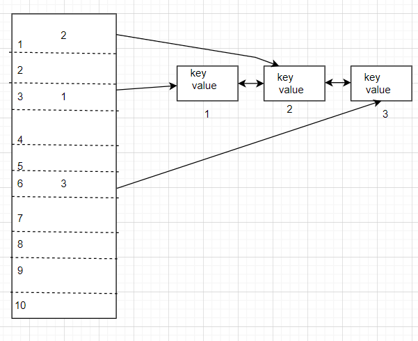
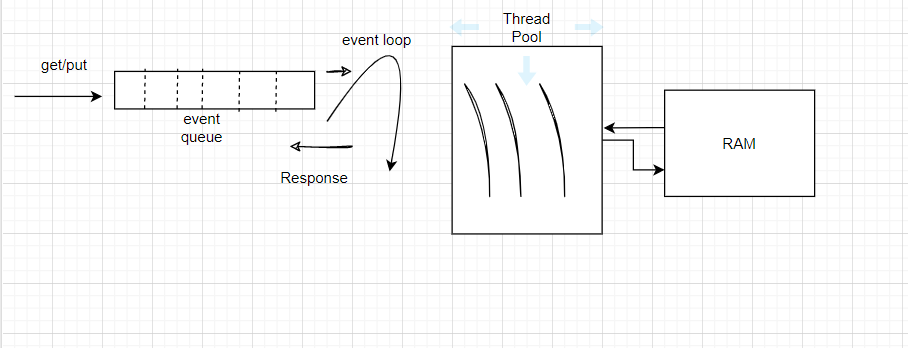
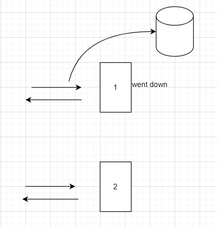

* Caching is high speed data storage system which saves the transient data so that the further request will not hit 
  the main memory /database. or will not compute the actual computation. All the data will be served from the cached system.
* All the computation results will be reused using the cache.
* The data in the caching system is usually stored in faster access hardware like RAM.

**Caching Best Practices**

* Before you cache something you need to understand the **validity** of the data or  when you understand 
  how long I can save this particular data so that's when we get **high hit rate**
* Otherwise it will cause **cache miss**. So, we need to properly set **TTL**.

**Features/Estimation**

* Tera Byte 
* 50K to 1M QPS(Query Per Second)
* == 1ms latency
* LRU (Least Recently Used) eviction
* 100% Availability
* Scalable

Caching Strategies:

**Cache data structure**

* When we say we have to design a caching system with less latency or it should perform get and put operation faster , we can HashTable as the data structure.

**LRU**

* When we have to Evict the cache?
* Eviction is removing the key and value from the cache memory , we need to do this because cache / RAM is expensive and also all the keys and values are not used all the time.
* We have to identify the key-value pair which is not used recently and remove them, so that we can space for the new key value pairs and that is called as Cache Eviction Policy.

* We should use a Bi-Directional Linked List 
* Create a node in the list and then store the key-value pair.
* And then store the address of the node in the bucket of the hash table.

* So, the most recently used key value will be at the last of the linked list.
* The complexity is O(1).

**Internals of Caching System**

* We need to have a service which accepts the requests like get, put, delete and then update the data into hash table.
* Since we are using RAM even though it is faster it is kind of blocking call.
* So, we need a efficient way of serving these requests, we can spawn N no. of threads as we get the request or a Bigger Thread pool which can handle.
* But these (Threads) will not scale and will cause a lot of problems.
* The easiest we can handle it is Event-Driven logic.

**Fault Tolerance of Cache**

* What if our restarts for some reason and then the data is lost?
* Our cache system should be Persistent. We have to do something to make it persistent so that we can retrieve the data.
* There are 2 approaches.
* a) Regular interval snapshot
     * we take the copy of the original data.
     * Store the data in the regular interval of time in a dump file.
* b) Log ReConstruction
     * while saving the key-value pair in the hash table it will log the requests/operations and key-value pairs into a log file.
     * This log file will be in hard disk and also make this logging as async call which will be keep on updating into the file.
     * If the machine goes down then we can reconstruct the whole data by executing each and every instruction in the time sorted order.
  
**Availability**

* Suppose if the server -1 went down then there will be a cache miss and the requests to the db will be more.
* we can have replication of these servers. For example the replication factor is 2 that means that we'll have to replicate every data 
  into 2 copies.
* The request now will be shared to the copy of server-1 so that we can get less latency and the performance is lot better.
* But the problem is we need to keep seeking the updates from which happens between master and slave. There will be some latency and inconsistency of data.
* Let's make the copy server as Slave server.
* The reads and writes always happens from master server until the master goes down.