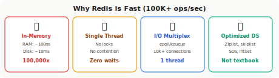
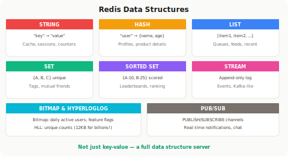
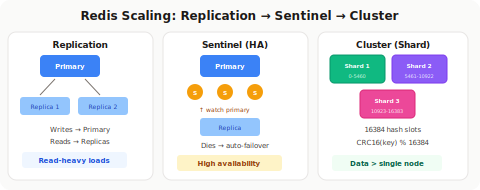

# Redis

!!! danger "Real Incident: Twitter, 2013"
    Twitter's timeline was backed by MySQL. Every home timeline load = fan-out query across millions of rows. Latency: 800ms. Users leaving. They moved timelines to Redis. Latency dropped to **5ms**. Redis now serves 300 billion operations/day at Twitter.

---

## The 30-Second Explanation

**Redis = an in-memory data structure store. Not just key-value — it supports lists, sets, sorted sets, hashes, streams, and more. Think of it as a "Swiss Army knife" database that lives in RAM.**

⚡

<h4 style="margin: 0 0 0.5rem; color: #92400e;">Why Redis?</h4>

Sub-millisecond latency. 100K+ ops/sec on a single node. Rich data structures.

⚠️

<h4 style="margin: 0 0 0.5rem; color: #dc2626;">The Trade-off</h4>

Data size limited by RAM. Not a primary database (usually).

---

## Why Single-Threaded and Still Fast?

| Myth | Reality |
|---|---|
| "Single-threaded = slow" | No disk I/O, no context switching, no lock contention |
| "Can't use multiple cores" | I/O threads (Redis 6+) handle network, main thread handles commands |
| "Bottleneck is CPU" | Bottleneck is almost always network, not CPU |

**Redis is fast because:** Everything in RAM (100ns access) + single-threaded command execution (no locks) + efficient data structures (not your textbook implementations) + I/O multiplexing (epoll).

---

## Data Structures & Use Cases

| Structure | Operations | Real Use Case |
|---|---|---|
| **String** | GET, SET, INCR, TTL | Cache, sessions, counters, rate limiting |
| **Hash** | HGET, HSET, HGETALL | User profiles, product details (fields without full serialization) |
| **List** | LPUSH, RPOP, LRANGE | Message queues, activity feeds, recent items |
| **Set** | SADD, SISMEMBER, SINTER | Tags, unique visitors, mutual friends |
| **Sorted Set** | ZADD, ZRANGE, ZRANK | Leaderboards, priority queues, time-series |
| **Stream** | XADD, XREAD, XGROUP | Event sourcing, log aggregation, Kafka-lite |
| **Bitmap** | SETBIT, BITCOUNT | Daily active users, feature flags |
| **HyperLogLog** | PFADD, PFCOUNT | Unique count approximation (0.81% error, 12KB fixed) |

---

## Redis as Cache vs. Redis as Database

| Aspect | As Cache | As Primary DB |
|---|---|---|
| Data loss OK? | Yes (repopulate from DB) | No (need persistence) |
| Persistence | Disabled or RDB snapshots | AOF (every write logged) |
| Eviction | LRU/LFU when full | No eviction (must have enough RAM) |
| Replication | Nice-to-have | Must-have (failover) |
| Use case | Session, query cache, rate limit | Leaderboards, real-time counters, queues |

---

## Persistence Options

| Mode | How | Trade-off |
|---|---|---|
| **RDB (Snapshots)** | Point-in-time dump every N seconds | Fast restart, but lose data since last snapshot |
| **AOF (Append-Only File)** | Log every write operation | Durable (lose at most 1 second), larger files |
| **RDB + AOF** | Both together | Best durability + fast restart |
| **None** | Pure cache, no disk | Fastest, data gone on restart |

---

## Scaling Redis

| Approach | How | When |
|---|---|---|
| **Replication** | Primary → Replica(s). Reads from replicas. | Read-heavy workloads |
| **Sentinel** | Monitors primary. Auto-failover to replica if primary dies. | High availability |
| **Redis Cluster** | Data sharded across 3+ masters (hash slots 0-16383) | Data > single node RAM |

**Redis Cluster key facts:**

- 16384 hash slots, distributed across masters
- Each key → CRC16(key) % 16384 → specific master
- Automatic resharding when adding/removing nodes
- Client must be cluster-aware (follows MOVED redirects)

---

## Common Patterns at FAANG

| Pattern | How | Who |
|---|---|---|
| **Cache-aside** | Check Redis → miss → read DB → write Redis | Everyone |
| **Rate limiter** | INCR + EXPIRE per user/IP key | Stripe, Cloudflare |
| **Distributed lock** | SET key NX EX 30 (SETNX with TTL) | Uber, DoorDash |
| **Leaderboard** | ZADD + ZREVRANGE (sorted set) | Gaming, Spotify Wrapped |
| **Pub/Sub** | PUBLISH + SUBSCRIBE channels | Chat, real-time notifications |
| **Session store** | Hash per session, TTL for expiry | All web apps |
| **Idempotency** | SET request_id NX EX 300 (dedup) | Payment systems |

---

## Redis vs. Memcached

| Aspect | Redis | Memcached |
|---|---|---|
| Data types | Rich (strings, lists, sets, hashes...) | Strings only |
| Persistence | Optional | None |
| Clustering | Built-in | Client-side |
| Memory efficiency | Higher overhead | More efficient per key |
| Pub/Sub | Yes | No |
| Lua scripting | Yes (atomic operations) | No |
| **Choose when** | Need data structures, atomicity, persistence | Pure KV cache at max throughput |

---

## The 3 Mistakes That Get You Rejected

!!! danger "Don't Say These"
    1. **"Redis is just a cache"** — It's a data structure store. Leaderboards, queues, rate limiters, pub/sub, streams. Calling it "just a cache" shows you've only used GET/SET.
    2. **"Redis is single-threaded so it's slow"** — It handles 100K+ ops/sec. Network is the bottleneck, not CPU. Single-threaded means zero lock contention.
    3. **"Use Redis as your primary database"** — For most use cases, no. RAM is expensive and data that exceeds RAM = trouble. Use it alongside a durable primary DB.

---

## Interview Answer Template

> "For [use case], I'd use Redis with [data structure] because [reason]. For persistence, [RDB/AOF/none]. For HA, [Sentinel/Cluster] depending on data size. Key concern: [memory management / hot key / thundering herd] which I'd address with [eviction policy / client-side cache / lock on miss]."

---

## Quick Recall Card

| Question | Answer |
|---|---|
| Why is Redis fast? | In-memory, single-threaded (no locks), efficient data structures |
| Best for leaderboard? | Sorted Set (ZADD, ZREVRANGE) |
| Best for rate limit? | String + INCR + EXPIRE |
| Persistence options? | RDB (snapshots), AOF (write log), both, or none |
| Cluster sharding? | 16384 hash slots, CRC16(key) % 16384 |
| Redis vs Memcached? | Redis = rich types + persistence. Memcached = simple KV, more memory-efficient |
| HA without cluster? | Redis Sentinel (auto-failover of primary) |
