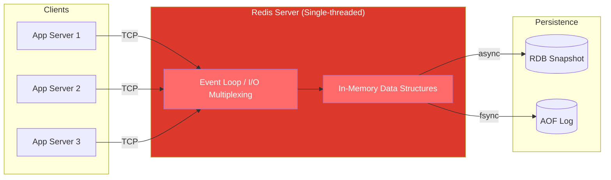
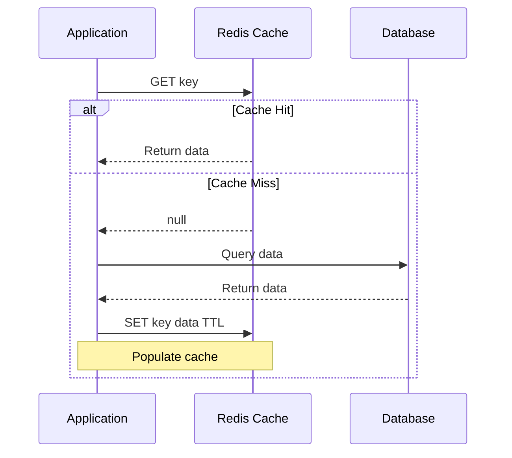
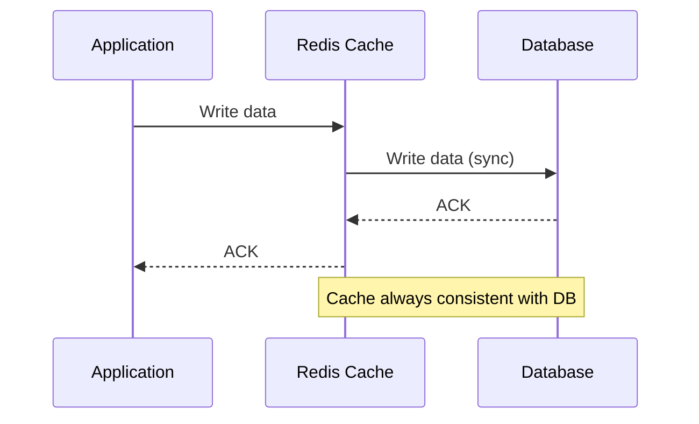
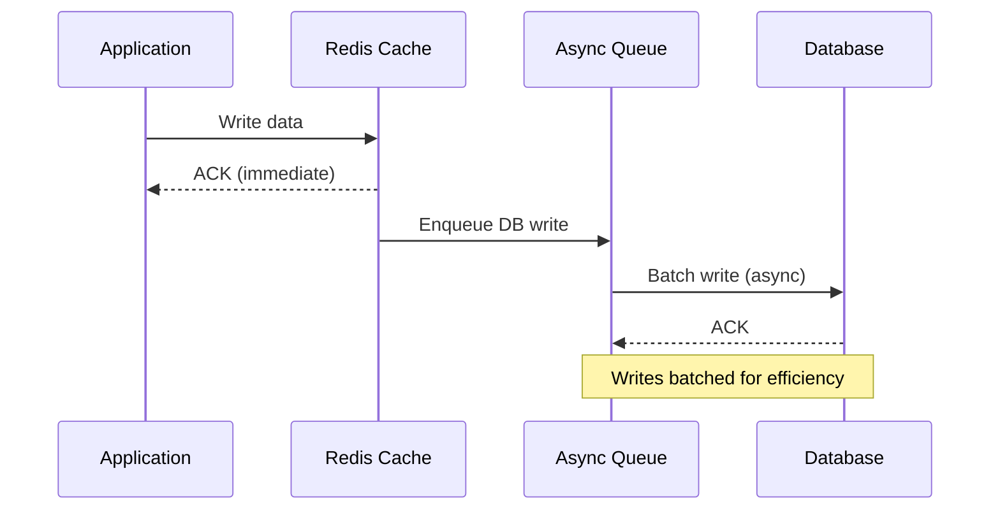
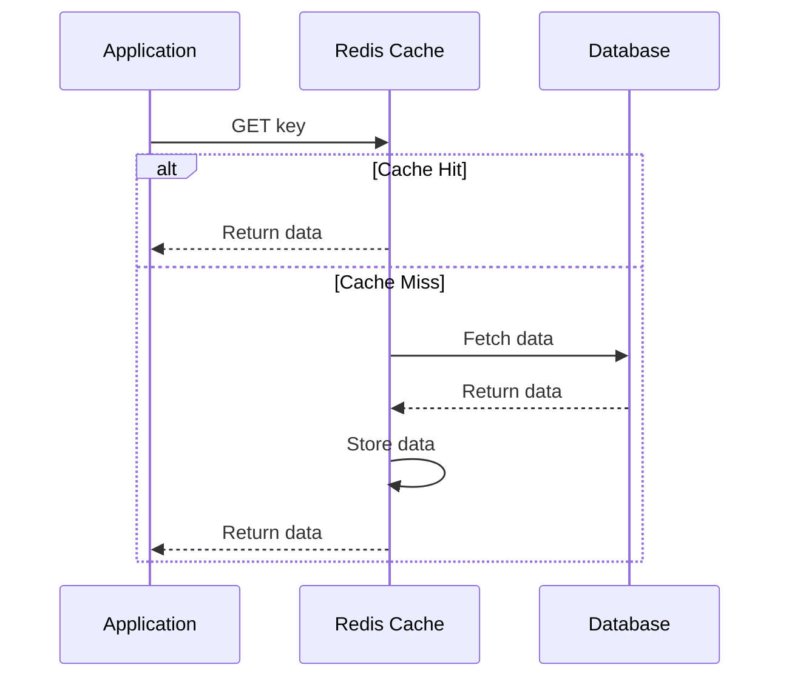
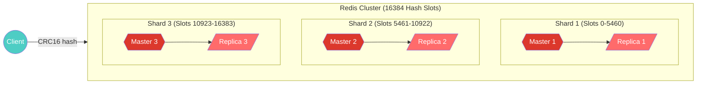
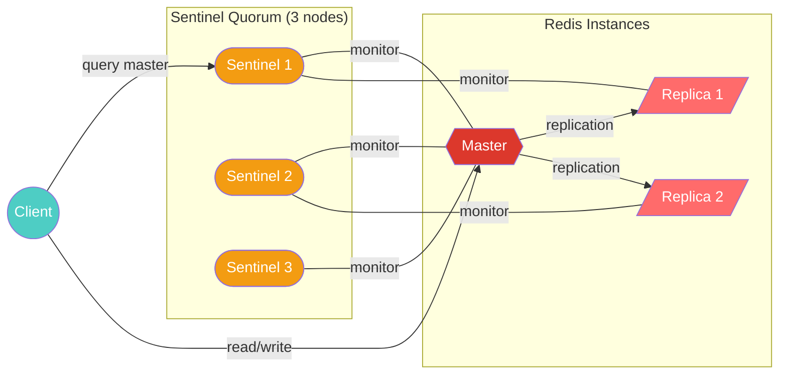
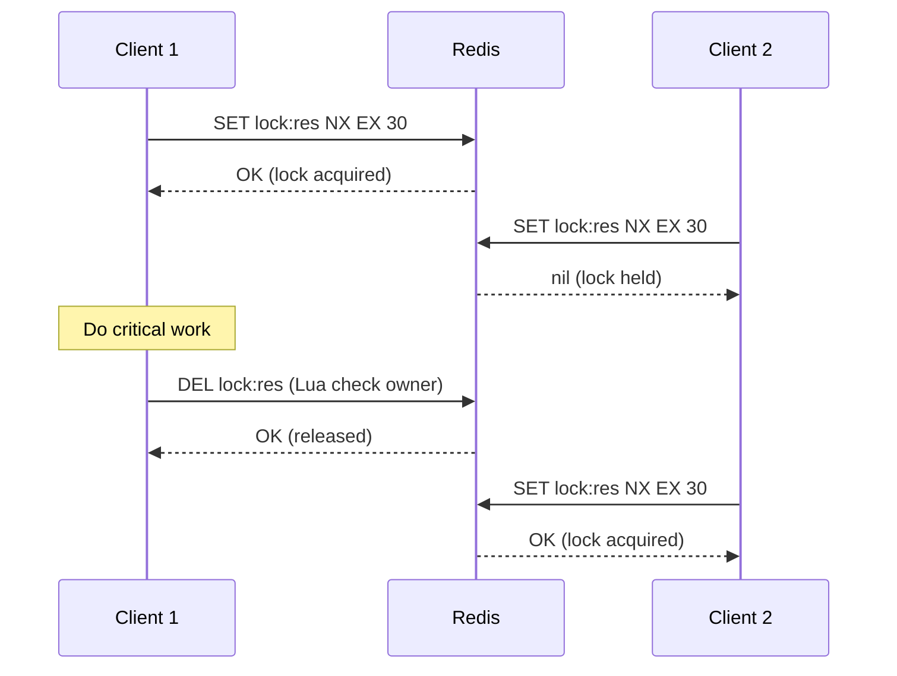
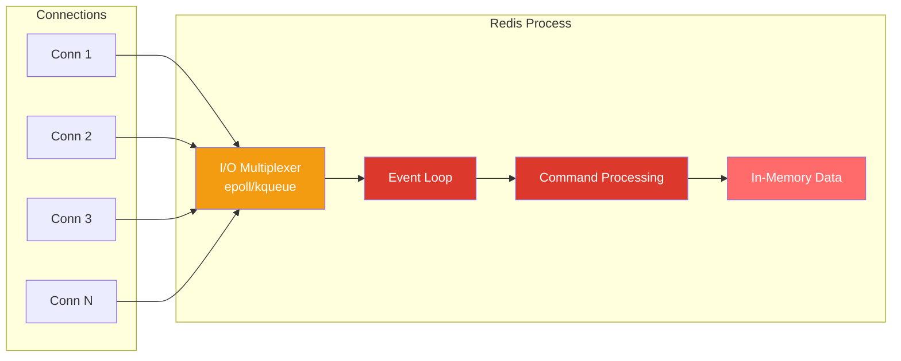

# Redis

!!! tip "Why Redis in Interviews?"
    Redis appears in virtually every system design interview at FAANG companies. Whether you are designing a URL shortener, chat system, leaderboard, rate limiter, or session store — Redis is the go-to answer for low-latency, high-throughput data access. Understanding its internals, data structures, and operational patterns is essential.

---

## What is Redis?

Redis (Remote Dictionary Server) is an open-source, **in-memory data structure store** used as a database, cache, message broker, and streaming engine. It supports rich data structures beyond simple key-value pairs and delivers sub-millisecond latency.


```mermaid
graph LR
    subgraph Clients
        C1[App Server 1]
        C2[App Server 2]
        C3[App Server 3]
    end

    subgraph Redis["Redis Server (Single-threaded)"]
        direction LR
        EP[Event Loop / I/O Multiplexing]
        DS[In-Memory Data Structures]
        EP --> DS
    end

    subgraph Persistence
        RDB[(RDB Snapshot)]
        AOF[(AOF Log)]
    end

    C1 -->|TCP| EP
    C2 -->|TCP| EP
    C3 -->|TCP| EP
    DS -->|async| RDB
    DS -->|fsync| AOF

    style Redis fill:#dc382c,color:#fff
    style EP fill:#ff6b6b,color:#fff
    style DS fill:#ff6b6b,color:#fff
```

**Key characteristics:**

| Property | Detail |
|----------|--------|
| Latency | Sub-millisecond (typically < 1ms) |
| Throughput | 100K - 1M+ ops/sec per node |
| Model | Single-threaded event loop (I/O multiplexed) |
| Storage | In-memory with optional persistence |
| Protocol | RESP (Redis Serialization Protocol) over TCP |

---

## Data Structures & Use Cases

### Strings

The simplest Redis type — binary-safe strings up to 512 MB.

```bash
SET user:1001:name "Alice"
GET user:1001:name

# Atomic counter
INCR page:views:homepage
INCRBY user:1001:credits 50

# Expiring key (rate limiting)
SET api:rate:192.168.1.1 1 EX 60 NX
```

**Use cases:** Caching, counters, rate limiting tokens, session IDs.

---

### Lists

Doubly-linked lists of strings — O(1) push/pop at head and tail.

```bash
LPUSH queue:emails "msg1" "msg2" "msg3"
RPOP queue:emails            # Consumer picks from tail
LRANGE recent:posts 0 9     # Last 10 posts
LTRIM recent:posts 0 99     # Keep only 100 items
```

**Use cases:** Message queues, recent items feed, activity logs.

---

### Sets

Unordered collections of unique strings.

```bash
SADD user:1001:tags "python" "redis" "golang"
SADD user:1002:tags "redis" "java" "kafka"
SINTER user:1001:tags user:1002:tags   # Common interests
SCARD online:users                      # Count online users
```

**Use cases:** Unique items tracking, mutual friends, tag systems, deduplication.

---

### Sorted Sets (ZSets)

Sets where each member has a floating-point score — sorted by score.

```bash
ZADD leaderboard 1500 "player:alice"
ZADD leaderboard 1800 "player:bob"
ZREVRANGE leaderboard 0 9 WITHSCORES   # Top 10
ZRANK leaderboard "player:alice"        # Rank of player
ZINCRBY leaderboard 50 "player:alice"   # Update score
```

**Use cases:** Leaderboards, priority queues, scheduling (score = timestamp), range queries.

---

### Hashes

Maps of field-value pairs — ideal for representing objects.

```bash
HSET user:1001 name "Alice" email "alice@example.com" age 30
HGET user:1001 name
HGETALL user:1001
HINCRBY user:1001 age 1
```

**Use cases:** Object storage, user profiles, shopping carts, configuration.

---

### Streams

Append-only log data structure (introduced in Redis 5.0) with consumer groups.

```bash
XADD orders * product "laptop" qty 1 user "alice"
XREAD COUNT 10 STREAMS orders 0          # Read from beginning
XREADGROUP GROUP g1 consumer1 COUNT 1 STREAMS orders >
XACK orders g1 "1234567890-0"
```

**Use cases:** Event sourcing, message broker, activity feeds, audit logs.

---

### HyperLogLog

Probabilistic data structure for cardinality estimation with 0.81% standard error using only 12 KB memory.

```bash
PFADD unique:visitors:2024-01-15 "user1" "user2" "user3"
PFCOUNT unique:visitors:2024-01-15       # Approximate count
PFMERGE unique:visitors:week unique:visitors:2024-01-15 unique:visitors:2024-01-16
```

**Use cases:** Unique visitor counting, cardinality estimation at scale, distinct event counting.

---

### Bitmaps

String type treated as a bit array — extremely memory-efficient for boolean state.

```bash
SETBIT feature:dark-mode 1001 1       # User 1001 has dark mode enabled
GETBIT feature:dark-mode 1001         # Check flag
BITCOUNT feature:dark-mode            # How many users enabled it
BITOP AND active:both online:today online:yesterday
```

**Use cases:** Feature flags, user presence/activity tracking, bloom filters, daily active users.

---

## Caching Patterns

### Cache-Aside (Lazy Loading)

Application manages both cache and database. Most common pattern.


```mermaid
sequenceDiagram
    participant App as Application
    participant Cache as Redis Cache
    participant DB as Database

    App->>Cache: GET key
    alt Cache Hit
        Cache-->>App: Return data
    else Cache Miss
        Cache-->>App: null
        App->>DB: Query data
        DB-->>App: Return data
        App->>Cache: SET key data TTL
        Note over App,Cache: Populate cache
    end

```

**Pros:** Only requested data is cached; resilient to cache failures.
**Cons:** Cache miss penalty (3 round trips); data can become stale.

---

### Write-Through

Data is written to cache and database synchronously.


```mermaid
sequenceDiagram
    participant App as Application
    participant Cache as Redis Cache
    participant DB as Database

    App->>Cache: Write data
    Cache->>DB: Write data (sync)
    DB-->>Cache: ACK
    Cache-->>App: ACK

    Note over Cache,DB: Cache always consistent with DB

```

**Pros:** Cache is always consistent; no stale data.
**Cons:** Write latency (two writes on every update); unused data may fill cache.

---

### Write-Behind (Write-Back)

Data is written to cache immediately; database write is deferred asynchronously.


```mermaid
sequenceDiagram
    participant App as Application
    participant Cache as Redis Cache
    participant Queue as Async Queue
    participant DB as Database

    App->>Cache: Write data
    Cache-->>App: ACK (immediate)
    Cache->>Queue: Enqueue DB write
    Queue->>DB: Batch write (async)
    DB-->>Queue: ACK

    Note over Queue,DB: Writes batched for efficiency

```

**Pros:** Low write latency; batching improves DB throughput.
**Cons:** Risk of data loss if cache fails before DB write; complexity.

---

### Read-Through

Cache sits between application and database; cache itself loads data on miss.


```mermaid
sequenceDiagram
    participant App as Application
    participant Cache as Redis Cache
    participant DB as Database

    App->>Cache: GET key
    alt Cache Hit
        Cache-->>App: Return data
    else Cache Miss
        Cache->>DB: Fetch data
        DB-->>Cache: Return data
        Cache->>Cache: Store data
        Cache-->>App: Return data
    end

```

**Pros:** Application code is simpler; cache manages data loading.
**Cons:** Requires cache library/proxy support; initial miss latency.

---

## Eviction Policies

When Redis reaches `maxmemory`, it must evict keys to make room. The policy determines which keys are removed.

| Policy | Scope | Description | Best For |
|--------|-------|-------------|----------|
| `noeviction` | — | Return error on write when memory full | Data must never be lost |
| `allkeys-lru` | All keys | Evict least recently used key | General caching |
| `allkeys-lfu` | All keys | Evict least frequently used key | Power-law access patterns |
| `allkeys-random` | All keys | Evict a random key | Uniform access patterns |
| `volatile-lru` | Keys with TTL | LRU among keys with expiry set | Mixed persistent + cache keys |
| `volatile-lfu` | Keys with TTL | LFU among keys with expiry set | Mixed with frequency bias |
| `volatile-random` | Keys with TTL | Random among keys with expiry | Simplicity with TTL keys |
| `volatile-ttl` | Keys with TTL | Evict keys with shortest TTL | Time-sensitive data |

!!! note "LRU vs LFU"
    - **LRU** (Least Recently Used): Evicts keys not accessed for the longest time. Good default.
    - **LFU** (Least Frequently Used): Evicts keys accessed least often. Better for hot/cold patterns where a rarely accessed key was just touched once.

---

## Persistence: RDB vs AOF

Redis offers two persistence mechanisms that can be used independently or together.

### Comparison Table

| Feature | RDB (Snapshots) | AOF (Append-Only File) |
|---------|-----------------|------------------------|
| **Mechanism** | Point-in-time binary snapshot | Log of every write operation |
| **File size** | Compact | Larger (can be rewritten) |
| **Recovery speed** | Fast (load binary) | Slower (replay operations) |
| **Data loss risk** | Up to last snapshot interval | Depends on `fsync` policy |
| **Performance impact** | Fork + copy-on-write | Continuous (varies by fsync) |
| **Durability** | Minutes of data loss possible | `everysec`: max 1s loss; `always`: zero loss |
| **Use case** | Backups, disaster recovery | High durability requirements |

### RDB Configuration

```
save 900 1      # Snapshot if 1 key changed in 900s
save 300 10     # Snapshot if 10 keys changed in 300s
save 60 10000   # Snapshot if 10000 keys changed in 60s
```

### AOF fsync Policies

| Policy | Durability | Performance |
|--------|-----------|-------------|
| `always` | No data loss | Slowest |
| `everysec` | Max 1 second loss | Good balance (recommended) |
| `no` | OS decides | Fastest |

!!! tip "Production Recommendation"
    Use **both** RDB + AOF together. AOF provides durability; RDB provides fast restarts and backups.

---

## Redis Cluster

Redis Cluster provides horizontal scaling through automatic data sharding across multiple nodes.


```mermaid
flowchart LR
    subgraph Cluster["Redis Cluster (16384 Hash Slots)"]
        subgraph S1["Shard 1 (Slots 0-5460)"]
            M1{{"Master 1"}}
            R1[/"Replica 1"/]
            M1 --> R1
        end
        subgraph S2["Shard 2 (Slots 5461-10922)"]
            M2{{"Master 2"}}
            R2[/"Replica 2"/]
            M2 --> R2
        end
        subgraph S3["Shard 3 (Slots 10923-16383)"]
            M3{{"Master 3"}}
            R3[/"Replica 3"/]
            M3 --> R3
        end
    end

    Client(("Client")) -->|CRC16 hash| Cluster

    style M1 fill:#dc382c,color:#fff
    style M2 fill:#dc382c,color:#fff
    style M3 fill:#dc382c,color:#fff
    style R1 fill:#ff6b6b,color:#fff
    style R2 fill:#ff6b6b,color:#fff
    style R3 fill:#ff6b6b,color:#fff
    style Client fill:#4ecdc4,color:#fff
```

**Key concepts:**

- **Hash Slots:** Key space divided into 16384 slots. Slot = `CRC16(key) mod 16384`.
- **Sharding:** Each master owns a subset of hash slots.
- **Replication:** Each master has one or more replicas for failover.
- **Gossip Protocol:** Nodes communicate cluster state via gossip.
- **MOVED redirect:** Client is redirected if it hits the wrong node for a key.
- **Multi-key operations:** Only supported when all keys map to the same slot (use hash tags `{tag}`).

---

## Redis Sentinel

Redis Sentinel provides high availability for non-clustered Redis deployments.


```mermaid
flowchart LR
    subgraph Sentinels["Sentinel Quorum (3 nodes)"]
        S1(["Sentinel 1"])
        S2(["Sentinel 2"])
        S3(["Sentinel 3"])
    end

    subgraph Redis["Redis Instances"]
        M{{"Master"}}
        R1[/"Replica 1"/]
        R2[/"Replica 2"/]
        M -->|replication| R1
        M -->|replication| R2
    end

    S1 ---|monitor| M
    S2 ---|monitor| M
    S3 ---|monitor| M
    S1 ---|monitor| R1
    S2 ---|monitor| R2

    Client(("Client")) -->|query master| S1
    Client -->|read/write| M

    style M fill:#dc382c,color:#fff
    style R1 fill:#ff6b6b,color:#fff
    style R2 fill:#ff6b6b,color:#fff
    style S1 fill:#f39c12,color:#fff
    style S2 fill:#f39c12,color:#fff
    style S3 fill:#f39c12,color:#fff
    style Client fill:#4ecdc4,color:#fff
```

**Sentinel responsibilities:**

1. **Monitoring:** Continuously checks if master and replicas are working as expected.
2. **Notification:** Alerts system administrators or other programs via API when something is wrong.
3. **Automatic failover:** Promotes a replica to master if the master fails (requires quorum).
4. **Configuration provider:** Clients connect to Sentinel to discover the current master address.

**Failover process:**

1. Sentinel detects master is unreachable (subjective down: `SDOWN`).
2. Quorum agrees master is down (objective down: `ODOWN`).
3. Sentinel leader is elected via Raft-like consensus.
4. Leader promotes best replica to master.
5. Other replicas are reconfigured to replicate from new master.

---

## Pub/Sub vs Streams

| Feature | Pub/Sub | Streams |
|---------|---------|---------|
| **Delivery** | Fire-and-forget | Persistent, replayable |
| **Persistence** | Messages lost if no subscriber | Messages stored until deleted |
| **Consumer groups** | No | Yes (with acknowledgment) |
| **Message ordering** | Per-channel order | Strictly ordered by ID |
| **Backpressure** | None (subscriber must keep up) | Consumer controls read pace |
| **History** | No history | Full history with XRANGE |
| **Use case** | Real-time notifications, chat | Event sourcing, task queues, logs |
| **At-least-once** | No | Yes (with XACK) |
| **Fan-out** | Natural (all subscribers get msg) | Via multiple consumer groups |

!!! warning "When to choose what"
    - Use **Pub/Sub** for real-time, ephemeral notifications where message loss is acceptable.
    - Use **Streams** when you need persistence, consumer groups, acknowledgment, or replay.

---

## Common Patterns

### Distributed Lock (Redlock)

Using `SET` with `NX` and `EX` for mutual exclusion.

```bash
# Acquire lock
SET lock:resource1 "owner-uuid" NX EX 30

# Release lock (only if owner matches - use Lua script)
if redis.call("get", KEYS[1]) == ARGV[1] then
    return redis.call("del", KEYS[1])
else
    return 0
end
```


```mermaid
sequenceDiagram
    participant C1 as Client 1
    participant R as Redis
    participant C2 as Client 2

    C1->>R: SET lock:res NX EX 30
    R-->>C1: OK (lock acquired)
    C2->>R: SET lock:res NX EX 30
    R-->>C2: nil (lock held)
    Note over C1: Do critical work
    C1->>R: DEL lock:res (Lua check owner)
    R-->>C1: OK (released)
    C2->>R: SET lock:res NX EX 30
    R-->>C2: OK (lock acquired)

```

**Important considerations:**

- Always set an expiry to prevent deadlocks.
- Use a unique owner identifier to prevent releasing someone else's lock.
- For distributed environments, consider the **Redlock** algorithm across multiple independent Redis instances.

---

### Rate Limiter (Sliding Window)

Using sorted sets for a precise sliding window rate limiter.

```bash
# Allow 100 requests per 60 seconds per user
local key = "rate:" .. user_id
local now = tonumber(redis.call("TIME")[1])
local window = 60

-- Remove entries outside the window
redis.call("ZREMRANGEBYSCORE", key, 0, now - window)

-- Count current requests
local count = redis.call("ZCARD", key)

if count < 100 then
    redis.call("ZADD", key, now, now .. ":" .. math.random())
    redis.call("EXPIRE", key, window)
    return 1  -- allowed
else
    return 0  -- rate limited
end
```

**Alternative approaches:**

| Algorithm | Data Structure | Precision | Memory |
|-----------|---------------|-----------|--------|
| Fixed window | String + INCR | Low (boundary burst) | Very low |
| Sliding window log | Sorted Set | High | Higher |
| Sliding window counter | Hash | Medium | Low |
| Token bucket | String + Lua | High | Low |

---

### Session Store

Redis excels as a centralized session store for stateless application servers.

```bash
# Create session
SET session:abc123 '{"user_id":1001,"role":"admin"}' EX 3600

# Read session
GET session:abc123

# Refresh TTL on activity
EXPIRE session:abc123 3600

# Destroy session (logout)
DEL session:abc123
```

**Why Redis for sessions:**

- Sub-millisecond reads for every HTTP request.
- Built-in TTL for automatic session expiry.
- Shared across all app server instances.
- Atomic operations prevent race conditions.

---

## Performance: Why Redis is Fast

### Single-Threaded Model

Redis processes commands in a **single thread** using an event-driven architecture. This eliminates:

- Context switching overhead
- Lock contention
- Race conditions on data structures

### I/O Multiplexing

Redis uses `epoll` (Linux) / `kqueue` (macOS) to handle thousands of concurrent connections with a single thread.


```mermaid
graph LR
    subgraph Connections
        C1[Conn 1]
        C2[Conn 2]
        C3[Conn 3]
        CN[Conn N]
    end

    subgraph Redis["Redis Process"]
        MUX[I/O Multiplexer<br/>epoll/kqueue]
        EL[Event Loop]
        CMD[Command Processing]
        MEM[In-Memory Data]
        MUX --> EL
        EL --> CMD
        CMD --> MEM
    end

    C1 --> MUX
    C2 --> MUX
    C3 --> MUX
    CN --> MUX

    style MUX fill:#f39c12,color:#fff
    style EL fill:#dc382c,color:#fff
    style CMD fill:#dc382c,color:#fff
    style MEM fill:#ff6b6b,color:#fff
```

### Why Single-Threaded is Still Fast

| Factor | Explanation |
|--------|-------------|
| **In-memory** | No disk I/O for reads; RAM access is ~100ns |
| **Efficient data structures** | Hash tables, skip lists, ziplist encodings |
| **No context switching** | Single thread avoids CPU cache thrashing |
| **Non-blocking I/O** | Handles 10K+ connections without threads |
| **Simple protocol** | RESP is lightweight to parse |
| **Pipelining** | Clients batch commands, reducing round trips |
| **Zero-copy** | Kernel-level optimizations for network I/O |

!!! note "Redis 6.0+ Threading"
    Redis 6.0 introduced **I/O threads** for reading/writing to sockets, but command execution remains single-threaded. This improves throughput for network-bound workloads without sacrificing the simplicity of single-threaded command processing.

---

## Interview Questions

??? question "How would you design a distributed rate limiter using Redis?"
    Use a **sliding window log** with sorted sets. Each request adds a timestamped entry. Before allowing a request, remove entries outside the window and count remaining entries. Use Lua scripting for atomicity. For distributed systems, either use a single Redis instance (simpler) or implement token bucket per-node with periodic sync. Consider edge cases: clock skew (use Redis TIME), burst handling, and graceful degradation when Redis is down (fail open vs fail closed).

??? question "Redis is single-threaded. How does it achieve high throughput?"
    Redis achieves high throughput through: (1) **In-memory operations** - RAM access is orders of magnitude faster than disk; (2) **I/O multiplexing** (epoll/kqueue) - handles thousands of connections without thread-per-connection overhead; (3) **Efficient data structures** - optimized C implementations with encoding tricks (ziplist, intset); (4) **No locking** - single thread means zero contention; (5) **Pipelining** - clients batch multiple commands in one round trip; (6) **Minimal protocol overhead** - RESP is simple to parse. Typical throughput: 100K-1M ops/sec per core.

??? question "Explain the difference between Redis Cluster and Redis Sentinel. When would you use each?"
    **Sentinel** provides high availability for a single master setup — it monitors, detects failures, and performs automatic failover. Data capacity is limited to a single machine. Use Sentinel when your dataset fits in one node's memory and you need HA. **Cluster** provides both HA and horizontal scaling — data is sharded across multiple masters (16384 hash slots), each with replicas. Use Cluster when your dataset exceeds single-node memory or you need higher write throughput. Trade-off: Cluster has restrictions on multi-key operations (keys must be in the same slot).

??? question "How would you handle cache invalidation in a microservices architecture?"
    Strategies: (1) **TTL-based** - set reasonable expiry; simplest but allows staleness. (2) **Event-driven invalidation** - services publish events (via Kafka/Streams) when data changes; consumers invalidate/update cache. (3) **Write-through** - update cache on every write. (4) **Cache-aside with versioning** - include version in cache key; increment version on change. For consistency, use a **pub/sub invalidation channel** where the service owning the data publishes invalidation messages. Consider the "thundering herd" problem — use **probabilistic early expiration** or **lock-based cache rebuilding** (SETNX a lock, one client rebuilds, others wait or serve stale).

??? question "What are the trade-offs between RDB and AOF persistence? What would you recommend for production?"
    **RDB**: Compact binary snapshots at intervals. Pros: fast recovery, small files, good for backups. Cons: data loss up to last snapshot (minutes). Fork + COW can cause latency spikes with large datasets. **AOF**: Logs every write. Pros: minimal data loss (1s with `everysec`), human-readable. Cons: larger files, slower recovery. **Production recommendation**: Use both. AOF (`everysec`) for durability; RDB for fast restarts, backups, and disaster recovery. Enable AOF rewrite to keep file sizes manageable. Monitor `fork()` latency and memory usage (COW can temporarily double memory).

??? question "Design a real-time leaderboard for a game with millions of players."
    Use **Sorted Sets** with player scores. `ZADD leaderboard score player_id` for updates, `ZREVRANGE leaderboard 0 9 WITHSCORES` for top-10, `ZREVRANK leaderboard player_id` for individual rank. This gives O(log N) updates and O(log N + M) range queries. For millions of players: shard by region or tier. For time-windowed leaderboards (daily/weekly), use key-per-period: `leaderboard:2024:week:03`. Use `ZUNIONSTORE` to merge. For "friends leaderboard," maintain per-user sorted sets or compute on-read using `ZSCORE` across friend IDs.

??? question "How does the Redlock algorithm work, and what are its criticisms?"
    **Redlock** acquires locks across N independent Redis masters (typically 5). Steps: (1) Get current time; (2) Try to acquire lock on each instance with short timeout; (3) Lock is acquired if majority (N/2 + 1) succeed within validity time; (4) Effective TTL = initial TTL - elapsed time. Release by deleting lock on all instances. **Criticisms** (Martin Kleppmann): (1) Clock jumps can cause two clients to hold the "same" lock; (2) GC pauses or network delays can make a client believe it holds an expired lock; (3) No fencing token mechanism. **Counter**: For most practical purposes with reasonable clock sync, Redlock works. For strict correctness, use ZooKeeper or etcd with fencing tokens.

??? question "How would you implement a message queue with exactly-once processing using Redis Streams?"
    Use **consumer groups** with acknowledgment: `XREADGROUP GROUP mygroup consumer1 COUNT 1 STREAMS mystream >` to read pending messages. After processing, `XACK mystream mygroup message_id` to acknowledge. For exactly-once semantics: (1) Process message and ACK atomically — if processing involves an external system, make the consumer idempotent (use message ID as deduplication key); (2) Use `XPENDING` to find unacknowledged messages and `XCLAIM` to reassign after timeout; (3) Store processing state with the message ID to detect duplicates. True exactly-once is impossible in distributed systems — implement effectively-once via idempotency.

---

## Quick Reference Cheat Sheet

| Operation | Command | Time Complexity |
|-----------|---------|----------------|
| Set a key | `SET key value` | O(1) |
| Get a key | `GET key` | O(1) |
| Delete a key | `DEL key` | O(1) |
| Set with expiry | `SET key value EX seconds` | O(1) |
| Increment | `INCR key` | O(1) |
| List push | `LPUSH key value` | O(1) |
| List range | `LRANGE key start stop` | O(S+N) |
| Set add | `SADD key member` | O(1) |
| Sorted set add | `ZADD key score member` | O(log N) |
| Sorted set rank | `ZRANK key member` | O(log N) |
| Hash set | `HSET key field value` | O(1) |
| Pub/Sub publish | `PUBLISH channel message` | O(N+M) |
| Stream add | `XADD stream * field value` | O(1) |
| HyperLogLog add | `PFADD key element` | O(1) |
| Key expiry | `EXPIRE key seconds` | O(1) |
