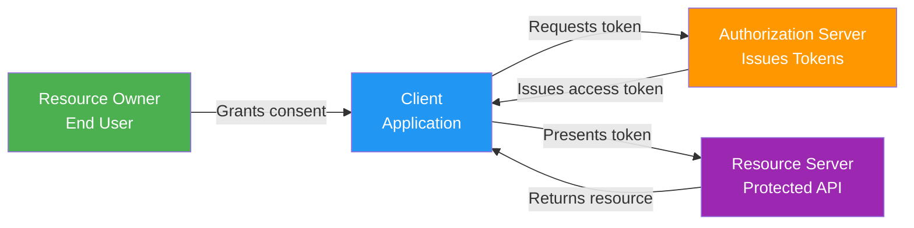
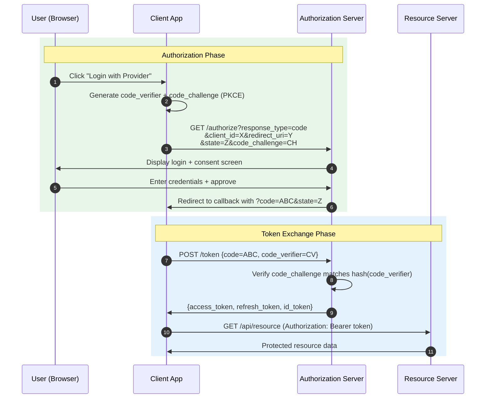
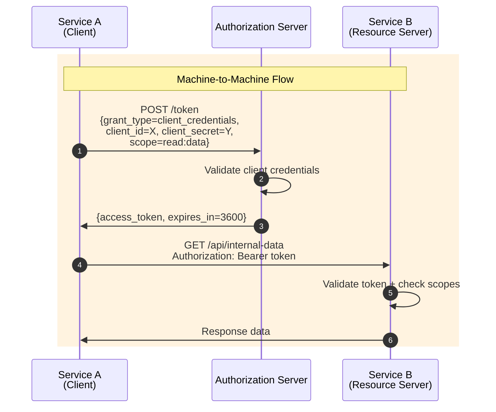
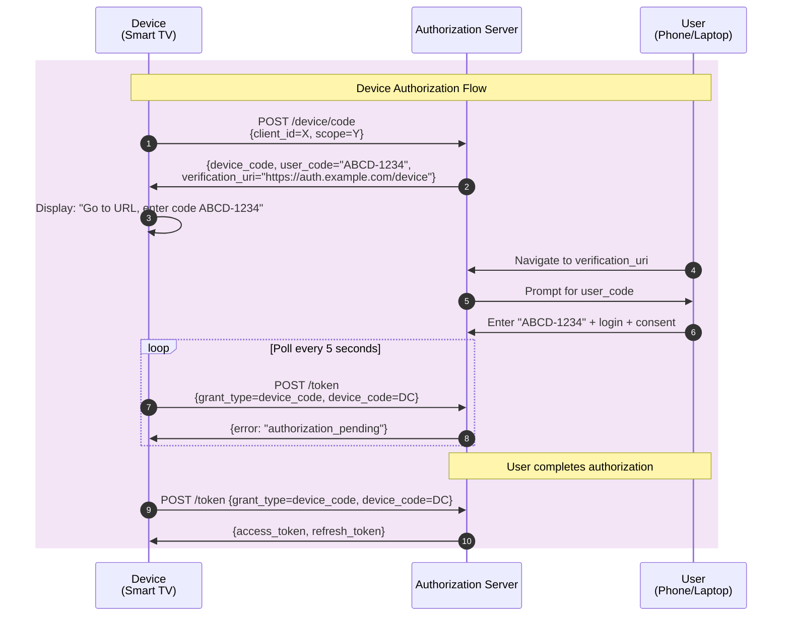
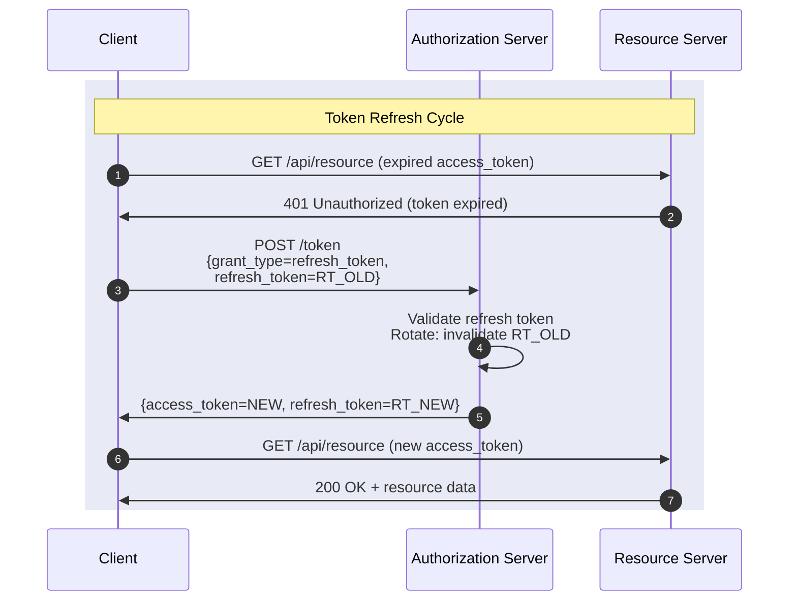
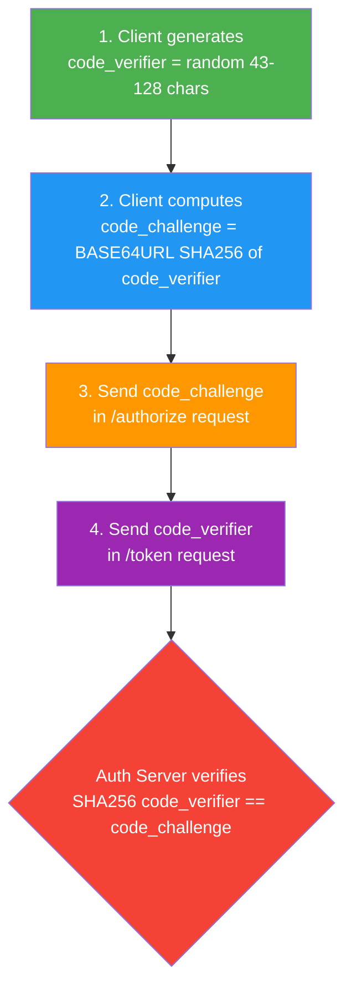
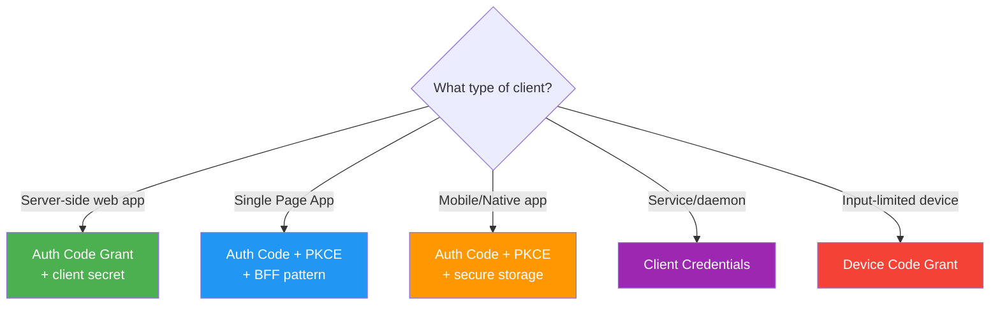

# OAuth 2.0 & OpenID Connect

!!! abstract "Why Auth Matters in System Design"
    Authentication and authorization are foundational to every distributed system. In FAANG interviews, you are expected to explain how services securely delegate access, how tokens flow between microservices, and how to prevent common attack vectors like token theft, CSRF, and privilege escalation. OAuth 2.0 is the industry standard framework powering Google, Facebook, GitHub, and virtually every modern API.

---

## OAuth 2.0 Roles

OAuth 2.0 defines four distinct roles:

| Role | Description | Example |
|------|-------------|---------|
| **Resource Owner** | The user who owns the data and grants access | End user with a Google account |
| **Client** | The application requesting access on behalf of the user | A third-party calendar app |
| **Authorization Server** | Issues tokens after authenticating the resource owner | Google's OAuth server |
| **Resource Server** | Hosts the protected resources, validates access tokens | Google Calendar API |



---

## Grant Types

### Authorization Code Grant (+ PKCE)

The most secure and recommended grant for web apps, SPAs, and mobile applications. PKCE (Proof Key for Code Exchange) prevents authorization code interception attacks.



**Key points:**

- The `state` parameter prevents CSRF attacks
- PKCE replaces the need for a client secret in public clients (SPAs, mobile)
- The authorization code is short-lived and single-use
- Tokens are never exposed in the browser URL

---

### Client Credentials Grant

Used for **service-to-service** communication where no user context is needed (machine-to-machine).



**Use cases:** Microservice communication, batch jobs, cron tasks, CI/CD pipelines.

---

### Device Code Grant

Designed for devices with limited input capability (smart TVs, IoT, CLI tools).



---

### Refresh Token Flow

Allows obtaining a new access token without re-authenticating the user.



!!! warning "Refresh Token Rotation"
    Always implement refresh token rotation. When a refresh token is used, issue a new one and invalidate the old one. If a stolen refresh token is replayed, detect the reuse and revoke the entire token family.

---

## OAuth 2.0 vs OpenID Connect

OAuth 2.0 is an **authorization** framework. OpenID Connect (OIDC) is an **identity layer** built on top of OAuth 2.0 that adds **authentication**.

| Feature | OAuth 2.0 | OpenID Connect |
|---------|-----------|----------------|
| Purpose | Authorization (access delegation) | Authentication (identity verification) |
| Token issued | Access token + Refresh token | Access token + **ID token** + Refresh token |
| User identity | Not standardized | Standardized via ID token claims |
| UserInfo endpoint | Not defined | `/userinfo` endpoint standardized |
| Discovery | Not defined | `.well-known/openid-configuration` |
| Scope | Custom scopes | `openid`, `profile`, `email`, `address`, `phone` |

**What OIDC adds:**

- **ID Token** — A JWT containing authenticated user identity claims (`sub`, `name`, `email`, `iat`, `exp`)
- **UserInfo Endpoint** — Standardized API to fetch user profile data
- **Discovery Document** — Auto-configuration via `.well-known/openid-configuration`
- **Session Management** — Standardized logout and session monitoring

---

## Tokens Deep Dive

### Access Token

The credential used to access protected resources.

| Property | Opaque Token | JWT (Self-contained) |
|----------|-------------|---------------------|
| Format | Random string (e.g., `a1b2c3d4...`) | Base64-encoded JSON with signature |
| Validation | Requires introspection call to Auth Server | Validated locally using public key |
| Revocation | Immediate (check against store) | Difficult until expiry (use short TTL) |
| Size | Small (~40 bytes) | Larger (~800+ bytes) |
| Performance | Extra network hop for validation | No network hop needed |
| Use case | High-security, revocable tokens | Microservices, stateless validation |

**JWT Access Token Structure:**

```json
{
  "header": { "alg": "RS256", "typ": "JWT", "kid": "key-id-1" },
  "payload": {
    "iss": "https://auth.example.com",
    "sub": "user-123",
    "aud": "https://api.example.com",
    "exp": 1700000000,
    "iat": 1699996400,
    "scope": "read:profile write:posts",
    "client_id": "app-456"
  },
  "signature": "base64(RSASHA256(header.payload, privateKey))"
}
```

### Refresh Token

| Property | Best Practice |
|----------|--------------|
| Lifetime | 7-90 days (depends on risk tolerance) |
| Storage | Server-side encrypted store; never in browser localStorage |
| Rotation | Issue new refresh token on each use; invalidate previous |
| Binding | Bind to client_id; optionally bind to device fingerprint |
| Revocation | Must support immediate revocation (logout, password change) |
| Family tracking | Detect reuse of old tokens to identify theft |

### ID Token (OIDC)

A JWT that contains claims about the authenticated user.

```json
{
  "iss": "https://accounts.google.com",
  "sub": "110169484474386276334",
  "aud": "app-client-id",
  "exp": 1700003600,
  "iat": 1700000000,
  "nonce": "random-nonce-value",
  "name": "Jane Doe",
  "email": "jane@example.com",
  "email_verified": true,
  "picture": "https://lh3.googleusercontent.com/..."
}
```

**Verification steps:** Check `iss` matches expected issuer, `aud` matches your client_id, `exp` is in the future, signature is valid using the provider's public key (from JWKS endpoint), and `nonce` matches what you sent.

---

## Token Storage Best Practices

### Browser Applications (SPA)

| Method | Security | Notes |
|--------|----------|-------|
| **HttpOnly Secure Cookie** | Best | Not accessible via JS; immune to XSS; requires CSRF protection |
| **In-memory variable** | Good | Lost on refresh; safe from XSS; use with silent refresh |
| **Web Worker** | Good | Isolated from main thread; not accessible via XSS |
| **sessionStorage** | Moderate | Vulnerable to XSS; cleared on tab close |
| **localStorage** | Poor | Vulnerable to XSS; persists indefinitely; avoid for tokens |

!!! tip "Recommended Pattern for SPAs"
    Use the **Backend-for-Frontend (BFF)** pattern: keep tokens on the server side, issue an HttpOnly session cookie to the browser. The BFF proxies API calls with the access token attached server-side.

### Mobile Applications

| Platform | Recommended Storage |
|----------|-------------------|
| iOS | Keychain Services (with `kSecAttrAccessibleAfterFirstUnlockThisDeviceOnly`) |
| Android | EncryptedSharedPreferences or Android Keystore |
| React Native | `react-native-keychain` (wraps platform secure storage) |

### Server-Side Applications

- Store tokens encrypted at rest in a database
- Use envelope encryption (encrypt token with DEK, encrypt DEK with KEK)
- Implement token caching with TTL slightly less than token expiry

---

## Scopes and Consent

Scopes define the **boundaries of access** granted to a client.

```
GET /authorize?scope=openid profile email read:repos write:repos
```

| Scope | Access Granted |
|-------|---------------|
| `openid` | Triggers OIDC; returns ID token |
| `profile` | User's name, picture, locale |
| `email` | User's email address |
| `read:repos` | Read access to repositories |
| `write:repos` | Write access to repositories |
| `offline_access` | Issues a refresh token |

**Consent screen best practices:**

- Show human-readable descriptions of each scope
- Allow granular consent (user can deny specific scopes)
- Remember consent decisions to avoid repeated prompts
- Support scope downgrade (request fewer scopes than previously granted)

---

## Security Considerations

### CSRF Protection (State Parameter)

```
state = base64(random_bytes(32))
```

- Generated by client before authorization request
- Stored in session/cookie
- Validated when the authorization code callback arrives
- Prevents attackers from injecting their own authorization codes

### Redirect URI Validation

- **Exact match only** — no wildcards, no partial matching
- Register all valid redirect URIs ahead of time
- Never allow open redirects (e.g., `redirect_uri=https://evil.com`)
- Use HTTPS for all redirect URIs (except localhost for development)

### Token Leakage Prevention

| Threat | Mitigation |
|--------|-----------|
| Token in URL fragment | Use Authorization Code flow, not Implicit |
| Token in browser history | Never pass tokens in query parameters |
| Token in server logs | Strip Authorization headers from access logs |
| Token in referrer header | Use `Referrer-Policy: no-referrer` for auth pages |
| Stolen access token | Short expiry (5-15 min), audience restriction |
| Stolen refresh token | Rotation, device binding, family revocation |

### PKCE Explained

PKCE (Proof Key for Code Exchange, pronounced "pixy") prevents authorization code interception:



Even if an attacker intercepts the authorization code, they cannot exchange it without the `code_verifier` that never left the client.

---

## Spring Boot Implementation

### Resource Server Configuration

```java
@Configuration
@EnableWebSecurity
public class ResourceServerConfig {

    @Bean
    public SecurityFilterChain filterChain(HttpSecurity http) throws Exception {
        http
            .authorizeHttpRequests(auth -> auth
                .requestMatchers("/api/public/**").permitAll()
                .requestMatchers("/api/admin/**").hasAuthority("SCOPE_admin")
                .requestMatchers("/api/**").authenticated()
            )
            .oauth2ResourceServer(oauth2 -> oauth2
                .jwt(jwt -> jwt
                    .jwtAuthenticationConverter(jwtAuthConverter())
                )
            );
        return http.build();
    }

    @Bean
    public JwtAuthenticationConverter jwtAuthConverter() {
        JwtGrantedAuthoritiesConverter grantedAuthorities = new JwtGrantedAuthoritiesConverter();
        grantedAuthorities.setAuthoritiesClaimName("roles");
        grantedAuthorities.setAuthorityPrefix("ROLE_");

        JwtAuthenticationConverter converter = new JwtAuthenticationConverter();
        converter.setJwtGrantedAuthoritiesConverter(grantedAuthorities);
        return converter;
    }
}
```

**application.yml:**

```yaml
spring:
  security:
    oauth2:
      resourceserver:
        jwt:
          issuer-uri: https://auth.example.com
          jwk-set-uri: https://auth.example.com/.well-known/jwks.json
```

### Authorization Server (Spring Authorization Server)

```java
@Configuration
public class AuthServerConfig {

    @Bean
    public RegisteredClientRepository registeredClientRepository() {
        RegisteredClient webClient = RegisteredClient.withId(UUID.randomUUID().toString())
            .clientId("web-app")
            .clientSecret("{noop}secret")
            .clientAuthenticationMethod(ClientAuthenticationMethod.CLIENT_SECRET_BASIC)
            .authorizationGrantType(AuthorizationGrantType.AUTHORIZATION_CODE)
            .authorizationGrantType(AuthorizationGrantType.REFRESH_TOKEN)
            .redirectUri("http://localhost:3000/callback")
            .scope(OidcScopes.OPENID)
            .scope(OidcScopes.PROFILE)
            .scope("read:data")
            .clientSettings(ClientSettings.builder()
                .requireProofKey(true)  // Enforce PKCE
                .build())
            .tokenSettings(TokenSettings.builder()
                .accessTokenTimeToLive(Duration.ofMinutes(15))
                .refreshTokenTimeToLive(Duration.ofDays(7))
                .reuseRefreshTokens(false)  // Enable rotation
                .build())
            .build();

        return new InMemoryRegisteredClientRepository(webClient);
    }

    @Bean
    public JWKSource<SecurityContext> jwkSource() {
        RSAKey rsaKey = generateRsaKey();
        JWKSet jwkSet = new JWKSet(rsaKey);
        return (selector, context) -> selector.select(jwkSet);
    }
}
```

---

## OAuth 2.0 vs SAML vs API Keys

| Feature | OAuth 2.0 / OIDC | SAML 2.0 | API Keys |
|---------|-------------------|-----------|----------|
| **Primary use** | API authorization + SSO | Enterprise SSO | Simple API access |
| **Token format** | JWT / opaque | XML assertions | Static string |
| **Transport** | HTTP REST + JSON | HTTP POST + XML | HTTP header/query param |
| **Mobile friendly** | Yes | No (XML-heavy) | Yes |
| **Delegation** | Yes (scoped access) | No | No |
| **User context** | Yes (via OIDC) | Yes | No |
| **Revocation** | Token expiry + revocation endpoint | Session-based | Manual rotation |
| **Complexity** | Medium | High | Low |
| **Standards body** | IETF (RFC 6749, 6750, 7636) | OASIS | None |
| **Best for** | Modern apps, APIs, mobile | Legacy enterprise, intranet | Internal tools, server-to-server |

!!! info "When to Use What"
    - **OAuth 2.0 + OIDC**: Default choice for modern applications needing both authN and authZ
    - **SAML**: When integrating with enterprise identity providers (Okta, AD FS) that mandate it
    - **API Keys**: Internal services with low security requirements or as an additional layer alongside OAuth

---

## Interview Questions

??? question "Why was the Implicit Grant removed in OAuth 2.1, and what replaces it?"
    The Implicit Grant returned access tokens directly in the URL fragment, exposing them to browser history, referrer headers, and malicious scripts. OAuth 2.1 removes it entirely. The replacement is the **Authorization Code Grant with PKCE**, which keeps tokens out of the browser URL and adds cryptographic proof that the client initiating the flow is the same one exchanging the code. Even for SPAs, the authorization code flow with PKCE is now the standard.

??? question "How would you design token management for a microservices architecture?"
    Use an **API Gateway** as the single point of token validation. The gateway verifies JWT access tokens using the Authorization Server's public keys (JWKS). Internal service-to-service calls use the **Client Credentials** grant with short-lived tokens. Implement token caching at the gateway with TTL < token expiry. For user context propagation, pass validated claims (not the raw token) in internal headers. Use **token exchange** (RFC 8693) when a downstream service needs to act on behalf of the user with reduced scope.

??? question "Explain the difference between access tokens and ID tokens. Can you use an ID token to call an API?"
    An **access token** is meant for the Resource Server — it authorizes API access. An **ID token** is meant for the Client — it proves the user's identity. You should never send an ID token to an API because: (1) its audience (`aud`) is the client, not the API; (2) the Resource Server should not trust a token not intended for it; (3) ID tokens may contain sensitive PII. Always use access tokens for API authorization and ID tokens only for establishing user sessions in the client.

??? question "How does PKCE prevent authorization code interception attacks?"
    The client generates a cryptographically random `code_verifier` and derives a `code_challenge` (SHA256 hash). The `code_challenge` is sent with the authorization request. When exchanging the code for tokens, the client sends the original `code_verifier`. The server hashes it and compares with the stored challenge. A malicious app that intercepts the authorization code cannot exchange it because it never had access to the `code_verifier` — it was generated and stored only in the legitimate client's memory.

??? question "How would you handle token storage securely in a single-page application?"
    The most secure approach is the **Backend-for-Frontend (BFF) pattern**: a thin server-side component holds the tokens and issues an HttpOnly, Secure, SameSite cookie to the browser. The SPA sends requests to the BFF, which attaches the access token server-side before forwarding to APIs. This eliminates XSS-based token theft entirely. If a BFF is not feasible, store tokens in memory (JavaScript closure or Web Worker) and use silent refresh (hidden iframe or refresh token rotation) to reacquire tokens after page reload.

??? question "What happens if a refresh token is stolen? How do you detect and mitigate this?"
    Implement **refresh token rotation**: each time a refresh token is used, a new one is issued and the old one is invalidated. Track token families (all tokens descended from the same initial grant). If a revoked refresh token is presented (reuse detection), immediately revoke the entire token family, forcing re-authentication. Additional mitigations include binding refresh tokens to client fingerprints (device ID, IP range), requiring step-up authentication for sensitive operations, and setting absolute expiry on refresh token families.

??? question "Compare OAuth 2.0 scopes vs RBAC. When would you use each?"
    **Scopes** define what an application (client) is allowed to do — they represent delegated permissions. **RBAC** defines what a user is allowed to do based on their role. In practice, combine both: scopes limit the maximum access a client can request, and RBAC further constrains what the specific user can do within those scopes. Example: a scope `write:documents` allows the app to write documents, but RBAC ensures user A can only write to their own workspace, not user B's.

??? question "Design a secure logout mechanism for an OIDC-based system with multiple relying parties."
    Implement **front-channel logout** or **back-channel logout**. Front-channel: the Authorization Server renders hidden iframes to each relying party's logout endpoint, clearing their sessions. Back-channel (preferred): the AS sends a signed Logout Token (JWT) via HTTP POST to each registered relying party's back-channel logout URI. Each RP validates the token and terminates the corresponding session. Additionally: revoke refresh tokens at the AS, clear the AS session cookie, and clear the client-side session. Use `post_logout_redirect_uri` to redirect the user after logout completes.

---

## Summary Cheat Sheet



!!! success "Key Takeaways for Interviews"
    1. OAuth 2.0 = authorization; OIDC = authentication layer on top
    2. Always use Authorization Code + PKCE (even for SPAs and mobile)
    3. Access tokens should be short-lived (5-15 min); use refresh tokens for longevity
    4. Never store tokens in localStorage; prefer HttpOnly cookies or BFF pattern
    5. Implement refresh token rotation and reuse detection
    6. The `state` parameter prevents CSRF; PKCE prevents code interception
    7. For microservices: validate JWTs at the gateway, use client credentials internally
