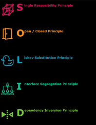

# SOLID PRINCIPLES




**Single Responsibility Principle**

It states that every java class must perform a single Functionality. Implementation of multiple Functionalities in a single class will mashup the code.

**Open and Close Principle**

It states that according to the new requirements the module should be open for extension but closed for new modification.


```java

    class CashPayment{

    public void acceptPayment(){

        System.out.println("cash");

    }

    }

    class CreditCardPayment{

    public void acceptPayment(){

        System.out.println("card");
    }

    }

    public interface IPay{

    void acceptPayment();

    }

    public class PaymentProcessor{

    void processPayment(IPay pay){

    pay.acceptPayment();

    }

    

    Main method(){

    PaymentProcessor processor=new PaymentProcessor();

    processor.processPayment(new CashPayment());

    }
    }
```    

**Leskov's Substitution Principle**

It applies to inheritance in such a way that the derived classes must be completely substitutable for this base classes. In other words Class A is a sub type of class B, then we should be able to replace B with A without interrupting the behaviour of the program.

``` JAVA

    abstract class Employee{

    id,

    name,

    setters and getters

    public abstract double calculateBonus(float Salary):

    public abstract boolean IsEligibleForInsurance();

    }

    public class PermanentEmployee extends Employee{

    @Override

    public boolean IsEligibleForInsurance(){

    return true;

    }

    @Override

    public double calcualteBonus(flaot Salary){

    return salary*0.1;

    }

    }

    public class TemporaryEmployee extends Employee{

    @Override

    public boolean IsEligibleForInsurance(){

    return false;

    }

    @Override

    public double calcualteBonus(flaot Salary){

    return salary*0.5;

    }

    }

    Main method:

    List<Employee> employee=new ArrayList<>();

    employee.add(new PermanentEmployee(1,”Sai”));

    employee.add(new TemporaryEmployee(2,”Krishna”));
```

**Interface Segregation Principle**

It states that the larger interfaces split into smaller ones. Because the implementation classes use only the methods thar are required. We should not force the client to use the methods that they do not want to use the methods that they do not want to use.

**Dependency Inversion Principle**

It states that we must use abstraction (abstract classes and interfaces) instead of concrete implementations. High level modules should not depend on the low level module but should not depend on the abstraction.

    public class Book{

    void seeReviews(){

    }

    void readSamples(){

    }

    }

    public class DVD{

    void seeReviews(){

    }

    void watchSamples(){

    }

    }

    public class Shelf{

    Book book;

    void addBook(Book book){

    }

    }

    - ------------creating an interface-----

    public interface Product{

    void seeReviews();

    void getSamples();

    }

    Book and DVD class implements Product interface

    public class Shelf{

    Product product

    void addProduct(Product product){

    }

    }