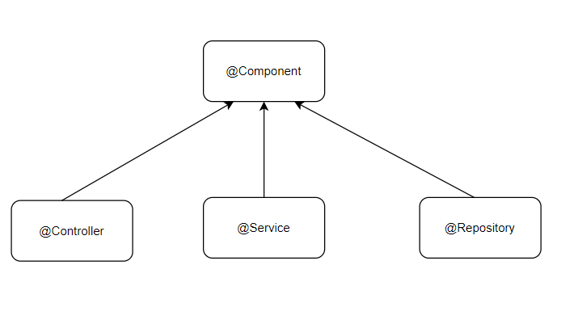

## Spring Boot Main annotations

**@SpringBootApplication**

@SpringBootApplication = @SpringBootConfiguration (@Configuration) + @EnableAutoConfiguration + @ComponentScan
                         

**@Component**

* The component annotation indicates that an annotated class is a "spring bean/component".
* The @Component annotation tells Spring container to automatically create Spring bean.

## Spring Core related Annotations:

**@Autowired**

* The @Autowired annotation is used to inject the bean automatically.
* The @Autowired annotation is used in constructor injection,setter injection and field injection.

**@Qualifier**

* This annotation is used in conjunction with Autowired annotation to avaoid confusion when we have two or more beans configured for the same type.

**@Primary**

* This annotation is used to give higher prefernce to a bean when there are multiple beans of the same type.

**@Bean**

* @Bean annotation indicates that a method produces a bean to be managed by a spring container.
* The @Bean annotation is usually declared in Configuration class to create Spring Bean definitions.
* By default, the bean name is same as method name. We can sp*ecify bean name using @Bean(name = "beanName")
* @Bean annotation provides initMethod and destroyMethod attributes to perform certain actions after bean initialization or before bean destruction by the container.

## StereoType Annotations
* These annotations are used to create Spring beans automatically in the application context (Spring IOC container)
* The main stereotype annotation is @Component.
* By using this annotation, Spring provides more Stereotype meta annotations such as **@Service ,@Repository and @Controller**
* **@Service** annotation is used to create Spring beans at the Service layer.
* **@Repository** is used to create Spring beans for the Repositories at the DAO layer.
* **@Controller** is used to create Spring beans at the controller layer.

**@Lazy**

* By default, Spring creates all singleton beans eagerly at the startup/bootstrapping of the application context.
* You can load the Spring beans lazily (on-demand) using @Lazy annotation.
* @Lazy annotation can be used with @Configutation, @Component and @Bean annotations.
* Eager initialization is recommended to avoid and detect all possible errors immediately rather than at runtime.

**@Scope**

* It is used to define a scope of the bean.
* We use @Scope to define the scope of a @Component class or a @Bean annotation.

* The latest version of the Spring framework defines 6 types of scopes.
   * Singleton
   * prtototype
   * request
   * session
   * application
   * websocket
*The last four scopes are only available in a web-aware application.

**@Value**

* Spring @Value annotation is used to assign default values to variables and method arguments.
* Value annotations is mostly used to get value for a specific property from the properties/yml file.

**@PropertySource and @PropertySources**

* Spring @Property annotation is used to provide properties file to Spring Environment.
* Spring @PropertySources annotation is used to provide multiple properties files to Spring Environment.
* These annotation is used with @Configuration classes.
* Spring @PropertySource annotation is repeatable, means you can have multiple PropertySource on a Configuration class.

## REST API related Annotations:
**@Controller**

* Spring provides @Controller annotation to make a Java class as a Spring MVC Controller. The @Controller annotation indicates that a particular class serves the role of a controller.
* Controller in Spring MVC web application is a component that handles incoming HTTP requests.
* @Controller annotation is simply a specialization of the component class, which allows us to auto-detect implementation classes through the classpath scanning.
* We typically use @Controller in combination with a @RequestMapping annotation for request handling methods.

**@RestController**

* In order to develop a RESTFUL Webservices using spring MVC, we need to use @Controller and @ResponseBody annotations.
* Spring 4.0 introduced @RestController, a specialized version of the @Controller which is a convenience annotation that does nothing more than the @Controller and @ResponseBody annotations.
* Inorder to create Restful webservices using Spring MVC, you need to annotate a Java class with @RestController annotation.
* When using @RestController, the response is typically in the form of JSON or XML, but it can also handle other media types by specifying the produces attribute in @RequestMapping or specific media type annotations like @GetMapping or @PostMapping.

**@RequestMapping**

* @RequestMapping annotation is used to map webrequests to Spring Controller methods.
* @RequestMapping can be applied to the controller class as well as handler methods.

HTTP Methods:

PUT Vs Post:

1. To update each and every detail of a record the go for Put Request. To create a new record go for Post Request.
2. Post is not idempotent. Whereas Put is idempotent.
3. When we hit the same data for multiple times using Post Request , multiple records are inserted in Db. Whereas using Put the record is updated , new record is not created.

Get vs Post :

| GET                                                                                                         | POST |
|-------------------------------------------------------------------------------------------------------------| --- |
| We can use GET method to Get info from the server                                                           | We Can use Post method to post information to the server. |
| Usually GET Requests are Read -only                                                                         | Usually Post requests are write or update operations. |
| End-user provided information will be appended to the URL as the part of Query String and send to the user. | Information will be encapsulated in the request body and send to the server. |
| By Using Get Request we can send only Character data but not images/files.                                  | By Using Post request we can send both Binary and Character data to the server. |
| By using Get request we can send only limited amount of information , depends on browser.                   | By using Post request we can send huge amount of information to the server. |
| Security is less , hence sensitive info like user names or passwords cannot be send.                        | Security is more. |
| Caching of Get is possible                                                                                  | Caching is not possible. |

Put vs Patch:

1. To Update a single or some parameters in a record then go For Patch , To update a all values in a record go for Put request.
2. If we use Put request for updating some parameters then remaining parameters will be updated as null.

**@GetMapping**

* The GET HTTP request is uesd to get a single or multiple resources and @GetMapping annotation for mapping HTTP GET requests onto specific handler methods.
* Specifically, @GetMapping is a composed annotation that acts as a shortcut for @RequestMapping(method=RequestMethod.GET)

**@PostMapping and @RequestBody**

* The POST HTTP method is used to create a resource and @PostMapping annotation for mapping HTTP POST requests onto specific handler method.
* Specifically ,@PostMapping is a composed annotation that acts as a shortcut for @RequestMapping(method =RequestMethod.POST)
* The @RequestBody annotation is responsible for retrieving the HTTP request body and automatically converting it to the Java Object

**PutMapping**

* The PUT HTTP method is used to update the resource and @PutMapping annotation for mapping HTTP PUT request onto specific handler method.
* Specifically, @PutMapping is a composed annotation that acts as a shortcut for @RequestMapping(method=RequestMethod.PUT)

**@DeleteMapping**

* The DELETE HTTP method is used to update the resource and @DeleteMapping annotation for mapping HTTP DELETE request onto specific handler method.
* Specifically, @DeleteMapping is a composed annotation that acts as a shortcut for @RequestMapping(method=RequestMethod.DELETE)

**@PathVariable**

* @PathVariable annotation used on a method argument to bind the value of a URI template variable to a method argument.

**RequestParam**

* We can use @RequestParam to extract query parameters from the request.

Difference between @RequestMapping & @GetMapping

@RequestMapping is a general-purpose annotation used to map methods to various HTTP methods and URL patterns, while @GetMapping is a specialized annotation specifically used for mapping HTTP GET requests to methods.

@RequestMapping can be used with any HTTP method, whereas @GetMapping is exclusively used for mapping HTTP GET requests.

@RequestMapping requires explicit specification of the HTTP method(s) using the method attribute, while @GetMapping implicitly maps to the HTTP GET method.

