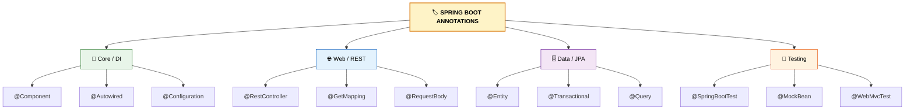
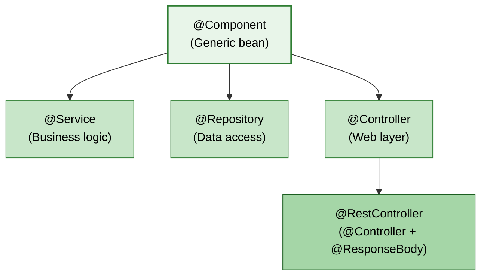

# 🏷️ Spring Boot Annotations

> **Annotations are metadata that provide data about a program — Spring Boot uses them to configure beans, map requests, inject dependencies, and more.**

---


```mermaid
flowchart TD
    SB["🏷️ <b>SPRING BOOT ANNOTATIONS</b>"]
    SB --> Core["🧩 Core / DI"]
    SB --> Web["🌐 Web / REST"]
    SB --> Data["🗄️ Data / JPA"]
    SB --> Test["🧪 Testing"]
    
    Core --> C1["@Component"]
    Core --> C2["@Autowired"]
    Core --> C3["@Configuration"]
    
    Web --> W1["@RestController"]
    Web --> W2["@GetMapping"]
    Web --> W3["@RequestBody"]
    
    Data --> D1["@Entity"]
    Data --> D2["@Transactional"]
    Data --> D3["@Query"]
    
    Test --> T1["@SpringBootTest"]
    Test --> T2["@MockBean"]
    Test --> T3["@WebMvcTest"]

    style SB fill:#FEF3C7,stroke:#D97706,stroke-width:2px,color:#000
    style Core fill:#E8F5E9,stroke:#2E7D32,color:#000
    style Web fill:#E3F2FD,stroke:#1565C0,color:#000
    style Data fill:#F3E5F5,stroke:#6A1B9A,color:#000
    style Test fill:#FFF3E0,stroke:#E65100,color:#000
```

---

## 🎯 The Master Annotation

```java
@SpringBootApplication  // = @Configuration + @EnableAutoConfiguration + @ComponentScan
public class MyApplication {
    public static void main(String[] args) {
        SpringApplication.run(MyApplication.class, args);
    }
}
```

!!! abstract "What @SpringBootApplication does"
    It combines three annotations:
    
    - **@Configuration** — marks class as a source of bean definitions
    - **@EnableAutoConfiguration** — tells Spring Boot to auto-configure based on classpath
    - **@ComponentScan** — scans current package and sub-packages for components

---

## 🧩 Core / DI Annotations

### Stereotype Annotations


```mermaid
flowchart TD
    C["@Component<br/>(Generic bean)"]
    C --> S["@Service<br/>(Business logic)"]
    C --> R["@Repository<br/>(Data access)"]
    C --> Ctrl["@Controller<br/>(Web layer)"]
    Ctrl --> RC["@RestController<br/>(@Controller + @ResponseBody)"]

    style C fill:#E8F5E9,stroke:#2E7D32,stroke-width:2px,color:#000
    style S fill:#C8E6C9,stroke:#2E7D32,color:#000
    style R fill:#C8E6C9,stroke:#2E7D32,color:#000
    style Ctrl fill:#C8E6C9,stroke:#2E7D32,color:#000
    style RC fill:#A5D6A7,stroke:#1B5E20,color:#000
```

| Annotation | Layer | Purpose |
|------------|-------|---------|
| `@Component` | Any | Generic Spring-managed bean |
| `@Service` | Business | Business logic (no special behavior, semantic) |
| `@Repository` | Data | DAO — translates DB exceptions to Spring exceptions |
| `@Controller` | Web | Handles HTTP requests, returns views |
| `@RestController` | Web | `@Controller` + `@ResponseBody` (returns JSON) |

### Dependency Injection

```java
// ✅ Constructor Injection (RECOMMENDED)
@Service
public class OrderService {
    private final PaymentService paymentService;
    private final InventoryService inventoryService;

    @Autowired // optional for single constructor
    public OrderService(PaymentService paymentService, InventoryService inventoryService) {
        this.paymentService = paymentService;
        this.inventoryService = inventoryService;
    }
}
```

| Annotation | Purpose | Example |
|-----------|---------|---------|
| `@Autowired` | Auto-inject dependency | Field, constructor, or setter |
| `@Qualifier("name")` | Choose specific bean when multiple exist | `@Qualifier("emailService")` |
| `@Primary` | Mark bean as default choice | When multiple implementations exist |
| `@Value("${key}")` | Inject property value | `@Value("${server.port}")` |

### Configuration Annotations

```java
@Configuration
public class AppConfig {

    @Bean
    @Scope("prototype")
    public RestTemplate restTemplate() {
        return new RestTemplate();
    }

    @Bean(initMethod = "init", destroyMethod = "cleanup")
    @Lazy
    public ExpensiveService expensiveService() {
        return new ExpensiveService();
    }
}
```

| Annotation | Purpose |
|-----------|---------|
| `@Configuration` | Declares a class as bean definition source |
| `@Bean` | Method-level — registers return value as Spring bean |
| `@Scope("prototype")` | New instance per request (default is singleton) |
| `@Lazy` | Initialize bean on first use, not at startup |
| `@Profile("dev")` | Bean only active in specific profile |
| `@Conditional*` | Conditional bean registration |

---

## 🌐 Web / REST Annotations

### Request Mapping

```java
@RestController
@RequestMapping("/api/v1/users")
public class UserController {

    @GetMapping                    // GET /api/v1/users
    public List<User> getAll() { ... }

    @GetMapping("/{id}")           // GET /api/v1/users/123
    public User getById(@PathVariable Long id) { ... }

    @GetMapping("/search")         // GET /api/v1/users/search?name=John&age=25
    public List<User> search(
        @RequestParam String name,
        @RequestParam(defaultValue = "0") int age) { ... }

    @PostMapping                   // POST /api/v1/users
    @ResponseStatus(HttpStatus.CREATED)
    public User create(@Valid @RequestBody CreateUserRequest request) { ... }

    @PutMapping("/{id}")           // PUT /api/v1/users/123
    public User update(@PathVariable Long id, @Valid @RequestBody UpdateUserRequest request) { ... }

    @DeleteMapping("/{id}")        // DELETE /api/v1/users/123
    @ResponseStatus(HttpStatus.NO_CONTENT)
    public void delete(@PathVariable Long id) { ... }
}
```

| Annotation | Purpose |
|-----------|---------|
| `@RequestMapping` | Base URL for all methods in controller |
| `@GetMapping` | Handle GET requests |
| `@PostMapping` | Handle POST requests |
| `@PutMapping` | Handle PUT requests |
| `@PatchMapping` | Handle PATCH requests |
| `@DeleteMapping` | Handle DELETE requests |
| `@PathVariable` | Extract value from URL path |
| `@RequestParam` | Extract query parameter |
| `@RequestBody` | Deserialize request body to object |
| `@ResponseBody` | Serialize return value to response body |
| `@ResponseStatus` | Set HTTP response status code |
| `@CrossOrigin` | Enable CORS for controller/method |
| `@Valid` | Trigger bean validation |

### Validation Annotations

```java
public class CreateUserRequest {
    @NotBlank(message = "Name is required")
    private String name;

    @Email(message = "Invalid email format")
    @NotNull
    private String email;

    @Min(18) @Max(120)
    private int age;

    @Size(min = 8, message = "Password must be at least 8 characters")
    private String password;
}
```

---

## 🗄️ Data / JPA Annotations

### Entity Mapping

```java
@Entity
@Table(name = "users", indexes = {
    @Index(name = "idx_email", columnList = "email", unique = true)
})
public class User {

    @Id
    @GeneratedValue(strategy = GenerationType.IDENTITY)
    private Long id;

    @Column(nullable = false, length = 100)
    private String name;

    @Column(unique = true, nullable = false)
    private String email;

    @Enumerated(EnumType.STRING)
    private UserStatus status;

    @CreatedDate
    private LocalDateTime createdAt;

    @OneToMany(mappedBy = "user", cascade = CascadeType.ALL, fetch = FetchType.LAZY)
    private List<Order> orders;
}
```

| Annotation | Purpose |
|-----------|---------|
| `@Entity` | Marks class as JPA entity |
| `@Table` | Customize table name, indexes |
| `@Id` | Primary key field |
| `@GeneratedValue` | Auto-generate ID (IDENTITY, SEQUENCE, UUID) |
| `@Column` | Customize column (nullable, length, unique) |
| `@OneToMany` / `@ManyToOne` | Relationship mapping |
| `@Enumerated` | Map enum to DB (STRING or ORDINAL) |
| `@Transient` | Field not persisted to DB |

### Repository & Transactions

```java
@Repository
public interface UserRepository extends JpaRepository<User, Long> {

    Optional<User> findByEmail(String email);

    @Query("SELECT u FROM User u WHERE u.status = :status AND u.createdAt > :since")
    List<User> findActiveUsersSince(@Param("status") UserStatus status,
                                    @Param("since") LocalDateTime since);

    @Modifying
    @Query("UPDATE User u SET u.status = :status WHERE u.id = :id")
    int updateStatus(@Param("id") Long id, @Param("status") UserStatus status);
}

@Service
public class UserService {

    @Transactional
    public User createUser(CreateUserRequest request) {
        // all DB operations here are atomic — rolls back on exception
    }

    @Transactional(readOnly = true)
    public List<User> getAllUsers() { ... }
}
```

---

## 🧪 Testing Annotations

```java
// Full integration test — loads entire application context
@SpringBootTest
class UserServiceIntegrationTest {

    @Autowired
    private UserService userService;

    @MockBean
    private EmailService emailService;

    @Test
    void shouldCreateUser() { ... }
}

// Web layer only — doesn't load full context
@WebMvcTest(UserController.class)
class UserControllerTest {

    @Autowired
    private MockMvc mockMvc;

    @MockBean
    private UserService userService;

    @Test
    void shouldReturnUser() throws Exception {
        mockMvc.perform(get("/api/v1/users/1"))
            .andExpect(status().isOk())
            .andExpect(jsonPath("$.name").value("John"));
    }
}

// Database layer only
@DataJpaTest
class UserRepositoryTest {

    @Autowired
    private UserRepository userRepository;

    @Autowired
    private TestEntityManager entityManager;
}
```

| Annotation | What it loads | Use for |
|-----------|--------------|---------|
| `@SpringBootTest` | Full application context | Integration tests |
| `@WebMvcTest` | Web layer only | Controller tests |
| `@DataJpaTest` | JPA layer only | Repository tests |
| `@MockBean` | Mock a Spring bean | Replace dependencies |

---

## 🎯 Interview Questions

??? question "1. What is the difference between @Component, @Service, @Repository, and @Controller?"
    They are all stereotype annotations that register beans. Functionally identical except:
    
    - `@Repository` adds **exception translation** (converts DB exceptions to Spring's DataAccessException)
    - `@Controller` enables **request mapping** and view resolution
    - `@Service` is purely **semantic** — indicates business logic layer
    - `@Component` is the generic parent

??? question "2. What's the difference between @Bean and @Component?"
    - `@Component`: class-level, auto-detected via component scanning
    - `@Bean`: method-level inside `@Configuration`, manually defines a bean
    
    Use `@Bean` when you need to configure third-party classes you can't annotate (e.g., RestTemplate, ObjectMapper).

??? question "3. What does @Transactional do? Where should it be placed?"
    Wraps the method in a database transaction. On failure, all changes are **rolled back**. Place on:
    
    - Service methods (recommended) — not controllers or repositories
    - Class level (applies to all public methods)
    
    Only works on **public** methods when using proxy-based AOP.

??? question "4. What is @Qualifier used for?"
    When multiple beans implement the same interface, `@Qualifier` specifies which one to inject:
    ```java
    @Autowired
    @Qualifier("smsNotification")
    private NotificationService notificationService;
    ```

??? question "5. Difference between @RequestParam and @PathVariable?"
    - `@PathVariable`: extracts from URL path → `GET /users/123` → `@PathVariable Long id`
    - `@RequestParam`: extracts from query string → `GET /users?name=John` → `@RequestParam String name`

??? question "6. What is @SpringBootApplication equivalent to?"
    `@SpringBootApplication` = `@Configuration` + `@EnableAutoConfiguration` + `@ComponentScan`

??? question "7. What is the difference between @Controller and @RestController?"
    `@RestController` = `@Controller` + `@ResponseBody`. Every method in `@RestController` returns data directly (JSON/XML), not a view name.

??? question "8. What does @MockBean do in tests?"
    Creates a Mockito mock and adds it to the Spring ApplicationContext, replacing any existing bean of the same type. Used in integration tests to isolate dependencies.

---

!!! tip "Key Principle"
    Annotations don't add magic — they're instructions to the Spring container. Understanding **what** they configure behind the scenes makes debugging much easier.
