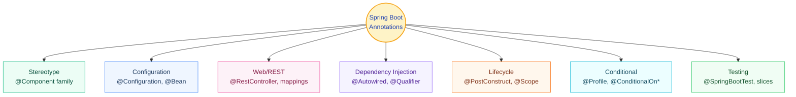
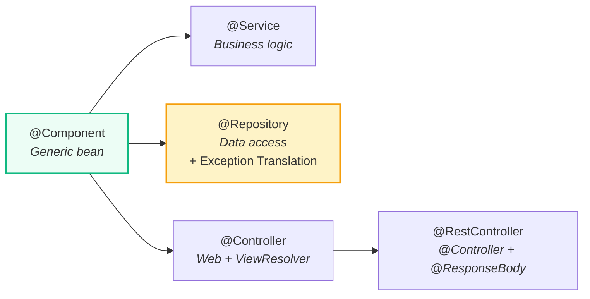
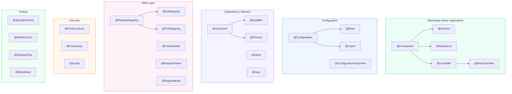

# Spring Boot Annotations — Interview Deep Dive

Spring has 50+ annotations. In interviews, you'll be asked about maybe 15 of them — but you need to know them **DEEPLY**. Not just "what does @Service do" but "why does @Service exist when @Component does the same thing?" Let me break it down with real code from an e-commerce application.

---


```mermaid
flowchart TB
    SB(("Spring Boot<br/>Annotations"))
    
    SB --> Stereo["Stereotype<br/>@Component family"]
    SB --> Config["Configuration<br/>@Configuration, @Bean"]
    SB --> Web["Web/REST<br/>@RestController, mappings"]
    SB --> DI["Dependency Injection<br/>@Autowired, @Qualifier"]
    SB --> Life["Lifecycle<br/>@PostConstruct, @Scope"]
    SB --> Cond["Conditional<br/>@Profile, @ConditionalOn*"]
    SB --> Test["Testing<br/>@SpringBootTest, slices"]
    
    style SB fill:#FEF3C7,stroke:#F59E0B,stroke-width:2px,color:#1E40AF
    style Stereo fill:#ECFDF5,stroke:#10B981,color:#064E3B
    style Config fill:#EFF6FF,stroke:#3B82F6,color:#1E3A5F
    style Web fill:#FDF2F8,stroke:#EC4899,color:#831843
    style DI fill:#F5F3FF,stroke:#8B5CF6,color:#4C1D95
    style Life fill:#FFF7ED,stroke:#F97316,color:#7C2D12
    style Cond fill:#ECFEFF,stroke:#06B6D4,color:#164E63
    style Test fill:#F0FDF4,stroke:#22C55E,color:#14532D
```

---

## The Master Annotation

Before we dive into categories, every Spring Boot app starts here:

```java
@SpringBootApplication  // = @Configuration + @EnableAutoConfiguration + @ComponentScan
public class ShopifyCloneApplication {
    public static void main(String[] args) {
        SpringApplication.run(ShopifyCloneApplication.class, args);
    }
}
```

!!! tip "One-liner for interviews"
    "@SpringBootApplication is a composed annotation that combines @Configuration (this class defines beans), @EnableAutoConfiguration (configure beans based on classpath), and @ComponentScan (find all @Component classes in this package and below)."

!!! danger "What breaks"
    Placing `@SpringBootApplication` in `com.shop.config` means `com.shop.service`, `com.shop.controller`, etc. are **never scanned**. Always put it in the root package.

---

## Stereotype Annotations

These annotations register your classes as Spring beans. They all extend `@Component` — the differences are **semantic** and, in one case, **behavioral**.


```mermaid
flowchart LR
    C["@Component<br/><i>Generic bean</i>"]
    C --> S["@Service<br/><i>Business logic</i>"]
    C --> R["@Repository<br/><i>Data access</i><br/>+ Exception Translation"]
    C --> Ctrl["@Controller<br/><i>Web + ViewResolver</i>"]
    Ctrl --> RC["@RestController<br/><i>@Controller + @ResponseBody</i>"]

    style C fill:#ECFDF5,stroke:#10B981,stroke-width:2px
    style R fill:#FEF3C7,stroke:#F59E0B,stroke-width:2px
```

---

### @Component

**What it does:** Registers a class as a Spring-managed bean via component scanning.

**Why it exists:** Without it, you'd have to declare every single bean in XML or @Configuration. Component scanning automates bean discovery.

**When to use:** Utility classes, adapters, mappers, event listeners — anything that doesn't fit neatly into service/repository/controller.

**How it works internally:** `ClassPathBeanDefinitionScanner` scans packages, finds classes annotated with `@Component` (or its specializations), creates `BeanDefinition` objects, and registers them with the `BeanFactory`.

```java
@Component
public class OrderMapper {
    
    public OrderDto toDto(Order order) {
        return OrderDto.builder()
            .id(order.getId())
            .status(order.getStatus().name())
            .total(order.getTotal())
            .itemCount(order.getLineItems().size())
            .createdAt(order.getCreatedAt())
            .build();
    }
    
    public Order toEntity(CreateOrderRequest request) {
        Order order = new Order();
        order.setCustomerId(request.getCustomerId());
        order.setShippingAddress(request.getShippingAddress());
        request.getItems().forEach(item -> order.addLineItem(
            new OrderLineItem(item.getProductId(), item.getQuantity(), item.getPrice())
        ));
        return order;
    }
}
```

!!! question "Counter-question: Why not just use @Component for everything?"
    You *could*. It would compile and run. But:
    
    1. **Readability** — scanning a codebase, `@Service` tells you "this is business logic" instantly
    2. **AOP targeting** — you can write pointcuts like `@within(org.springframework.stereotype.Service)` to apply cross-cutting concerns only to services
    3. **Future enhancements** — Spring may add behavior to `@Service` in future versions (like they did with `@Repository`)
    4. **Exception translation** — `@Repository` already has extra behavior you'd lose

---

### @Service

**What it does:** Marks a class as a business logic component. Registers it as a bean.

**Why it exists:** Semantic clarity. There is NO extra behavior today — it is functionally identical to `@Component`. But it signals intent.

**When to use:** Business logic, orchestration, use-case implementations.

**How it works internally:** Exactly like `@Component`. The `@Service` annotation is itself annotated with `@Component`:

```java
// Inside Spring Framework source:
@Target(ElementType.TYPE)
@Retention(RetentionPolicy.RUNTIME)
@Documented
@Component  // <-- this is why it works
public @interface Service { }
```

```java
@Service
public class PaymentService {
    
    private final PaymentGatewayClient gatewayClient;
    private final OrderRepository orderRepository;
    private final NotificationService notificationService;
    
    public PaymentService(PaymentGatewayClient gatewayClient,
                          OrderRepository orderRepository,
                          NotificationService notificationService) {
        this.gatewayClient = gatewayClient;
        this.orderRepository = orderRepository;
        this.notificationService = notificationService;
    }
    
    @Transactional
    public PaymentResult processPayment(UUID orderId, PaymentMethod method) {
        Order order = orderRepository.findById(orderId)
            .orElseThrow(() -> new OrderNotFoundException(orderId));
        
        ChargeResult charge = gatewayClient.charge(
            order.getCustomerId(), order.getTotal(), method);
        
        if (charge.isSuccessful()) {
            order.setStatus(OrderStatus.PAID);
            order.setPaymentReference(charge.getTransactionId());
            orderRepository.save(order);
            notificationService.sendPaymentConfirmation(order);
        }
        
        return PaymentResult.from(charge);
    }
}
```

!!! tip "One-liner for interviews"
    "@Service is semantically identical to @Component but signals that the class holds business logic. It exists for readability, AOP pointcut targeting, and potential future Spring enhancements."

!!! example "Interview Tip"
    When asked "what's the difference between @Component and @Service?" — don't just say "nothing." Say: "Functionally identical today, but @Service communicates architectural intent, enables targeted AOP advice, and follows the layered architecture convention. The Spring team reserves the right to add service-specific behavior in future versions."

---

### @Repository

**What it does:** Marks a class as a data access component AND enables **automatic exception translation**.

**Why it exists:** This is the one stereotype that actually DOES something extra. It converts persistence-technology-specific exceptions into Spring's `DataAccessException` hierarchy.

**When to use:** DAOs, repository implementations, any class that directly talks to a database.

**How it works internally:** `PersistenceExceptionTranslationPostProcessor` is a `BeanPostProcessor` that wraps all `@Repository` beans in an AOP proxy. This proxy catches `PersistenceException`, `SQLException`, `MongoException`, etc. and translates them into the appropriate `DataAccessException` subclass.

```java
@Repository
public class OrderRepositoryImpl implements CustomOrderRepository {
    
    @PersistenceContext
    private EntityManager entityManager;
    
    @Override
    public List<Order> findStaleOrders(Duration olderThan) {
        Instant cutoff = Instant.now().minus(olderThan);
        
        // If this throws a PersistenceException (e.g., connection lost),
        // Spring translates it to DataAccessResourceFailureException
        return entityManager.createQuery(
            "SELECT o FROM Order o WHERE o.status = :status AND o.createdAt < :cutoff",
            Order.class)
            .setParameter("status", OrderStatus.PENDING)
            .setParameter("cutoff", cutoff)
            .getResultList();
    }
}
```

!!! danger "What breaks"
    Without `@Repository`:
    
    ```java
    @Component  // NO exception translation!
    public class OrderRepositoryImpl implements CustomOrderRepository {
        // A Hibernate-specific ConstraintViolationException leaks into your service layer
        // Your service now has a compile-time dependency on Hibernate
    }
    ```
    
    With `@Repository`, that same exception becomes `DataIntegrityViolationException` — a Spring class your service already knows about.

!!! question "Counter-question: Do Spring Data JPA interfaces need @Repository?"
    No! Spring Data JPA interfaces (`extends JpaRepository`) are **automatically** detected and proxied by `JpaRepositoriesRegistrar`. They already get exception translation. Adding `@Repository` is harmless but redundant. However, custom repository **implementations** (classes) should be annotated.

---

### @Controller

**What it does:** Marks a class as a web controller that works with `ViewResolver` for server-side rendering (Thymeleaf, JSP, FreeMarker).

**Why it exists:** Enables Spring MVC's handler mapping mechanism. Methods return **view names** (strings), not response bodies.

**When to use:** Server-side rendered pages, Thymeleaf templates, returning HTML.

```java
@Controller
@RequestMapping("/shop")
public class ShopController {
    
    private final ProductService productService;
    
    public ShopController(ProductService productService) {
        this.productService = productService;
    }
    
    @GetMapping("/products")
    public String listProducts(Model model,
                               @RequestParam(defaultValue = "0") int page) {
        Page<Product> products = productService.findAll(PageRequest.of(page, 20));
        model.addAttribute("products", products);
        return "products/list";  // resolves to templates/products/list.html
    }
    
    @GetMapping("/products/{id}")
    public String productDetail(@PathVariable Long id, Model model) {
        Product product = productService.findById(id)
            .orElseThrow(() -> new ProductNotFoundException(id));
        model.addAttribute("product", product);
        return "products/detail";  // NOT a JSON response — it's a view name
    }
}
```

---

### @RestController

**What it does:** Combines `@Controller` + `@ResponseBody` on every method. Return values are serialized directly to the HTTP response body (JSON by default via Jackson).

**Why it exists:** Before Spring 4.0, you had to put `@ResponseBody` on every single method in a REST controller. `@RestController` eliminates that boilerplate.

**When to use:** REST APIs that return JSON/XML. 99% of modern Spring Boot APIs.

```java
@RestController
@RequestMapping("/api/v1/orders")
public class OrderController {
    
    private final PaymentService paymentService;
    private final OrderRepository orderRepository;
    private final OrderMapper orderMapper;
    
    public OrderController(PaymentService paymentService,
                           OrderRepository orderRepository,
                           OrderMapper orderMapper) {
        this.paymentService = paymentService;
        this.orderRepository = orderRepository;
        this.orderMapper = orderMapper;
    }
    
    @GetMapping("/{orderId}")
    public ResponseEntity<OrderDto> getOrder(@PathVariable UUID orderId) {
        return orderRepository.findById(orderId)
            .map(orderMapper::toDto)
            .map(ResponseEntity::ok)
            .orElseThrow(() -> new OrderNotFoundException(orderId));
    }
}
```

!!! example "Interview Tip"
    "The key difference: @Controller methods return view names (strings resolved by ViewResolver). @RestController methods return objects that get serialized to JSON via Jackson's ObjectMapper. If you accidentally use @Controller for a REST API, you get a 404 because Spring looks for a template named after your return value."

---

## Configuration Annotations

### @Configuration — The CGLIB Trap

**What it does:** Declares a class as a source of bean definitions. **Critically**, it enables CGLIB proxying so that inter-`@Bean` method calls return the same singleton instance.

**Why it exists:** Replaces XML configuration. The CGLIB proxy ensures that `@Bean` methods behave like singleton factories even when called as normal Java methods.

**How it works internally:** Spring creates a CGLIB subclass of your `@Configuration` class. When you call a `@Bean` method from within the same class, the CGLIB proxy intercepts the call, checks if that bean already exists in the container, and returns the existing instance instead of creating a new one.

=== "Full Mode (@Configuration) — CORRECT"

    ```java
    @Configuration
    public class NotificationConfig {
        
        @Bean
        public JavaMailSender mailSender() {
            JavaMailSenderImpl sender = new JavaMailSenderImpl();
            sender.setHost("smtp.company.com");
            sender.setPort(587);
            return sender;
        }
        
        @Bean
        public NotificationService notificationService() {
            // This calls mailSender() — but CGLIB intercepts it!
            // Returns the SAME singleton instance, not a new JavaMailSenderImpl
            return new NotificationService(mailSender());
        }
        
        @Bean
        public AlertService alertService() {
            // Also calls mailSender() — still the SAME instance
            return new AlertService(mailSender());
        }
    }
    ```

=== "Lite Mode (@Component) — DANGEROUS"

    ```java
    @Component  // NOT @Configuration — no CGLIB proxy!
    public class NotificationConfig {
        
        @Bean
        public JavaMailSender mailSender() {
            JavaMailSenderImpl sender = new JavaMailSenderImpl();
            sender.setHost("smtp.company.com");
            sender.setPort(587);
            return sender;
        }
        
        @Bean
        public NotificationService notificationService() {
            // This is a PLAIN JAVA METHOD CALL — creates a NEW instance!
            // NotificationService and AlertService get DIFFERENT mail senders!
            return new NotificationService(mailSender());
        }
        
        @Bean
        public AlertService alertService() {
            // Another NEW instance — you now have 3 JavaMailSender objects
            return new AlertService(mailSender());
        }
    }
    ```

!!! danger "What breaks"
    In "lite mode" (`@Component` with `@Bean` methods), every call to `mailSender()` creates a **new** `JavaMailSenderImpl`. You end up with multiple SMTP connections, potential resource leaks, and objects that aren't managed by Spring's lifecycle. This is one of the most common subtle bugs in Spring applications.

!!! tip "One-liner for interviews"
    "@Configuration enables CGLIB proxying so that inter-@Bean method calls return the same singleton. Without it, you get a new instance every time — breaking singleton semantics."

!!! question "Counter-question: When would you intentionally use lite mode?"
    When you genuinely don't need inter-@Bean references. If each @Bean method is independent and doesn't call other @Bean methods, lite mode is slightly faster (no CGLIB proxy overhead). Spring Boot's own auto-configurations use `proxyBeanMethods = false` for this reason:
    
    ```java
    @Configuration(proxyBeanMethods = false)  // explicit lite mode since Spring 5.2
    public class MyAutoConfiguration { ... }
    ```

---

### @Bean

**What it does:** Registers the method's return value as a Spring-managed bean.

**Why it exists:** For classes you cannot annotate — third-party libraries. You can't slap `@Component` on `RestTemplate` or `HikariDataSource` because you don't own the source code.

**When to use:** Third-party class configuration, conditional bean creation, multiple instances of the same type.

```java
@Configuration
public class InfraConfig {
    
    @Bean
    public RestTemplate restTemplate() {
        RestTemplate template = new RestTemplate();
        template.setRequestFactory(new HttpComponentsClientHttpRequestFactory());
        template.setInterceptors(List.of(new LoggingInterceptor()));
        return template;
    }
    
    @Bean
    @Primary  // default when multiple ObjectMapper beans exist
    public ObjectMapper objectMapper() {
        return JsonMapper.builder()
            .addModule(new JavaTimeModule())
            .disable(SerializationFeature.WRITE_DATES_AS_TIMESTAMPS)
            .enable(DeserializationFeature.FAIL_ON_UNKNOWN_PROPERTIES)
            .build();
    }
    
    @Bean("relaxedMapper")
    public ObjectMapper relaxedObjectMapper() {
        return JsonMapper.builder()
            .addModule(new JavaTimeModule())
            .disable(DeserializationFeature.FAIL_ON_UNKNOWN_PROPERTIES)
            .build();
    }
    
    @Bean(destroyMethod = "close")
    public HikariDataSource dataSource(
            @Value("${spring.datasource.url}") String url,
            @Value("${spring.datasource.username}") String username,
            @Value("${spring.datasource.password}") String password) {
        HikariDataSource ds = new HikariDataSource();
        ds.setJdbcUrl(url);
        ds.setUsername(username);
        ds.setPassword(password);
        ds.setMaximumPoolSize(20);
        ds.setMinimumIdle(5);
        return ds;
    }
}
```

---

### @Import

**What it does:** Pulls additional configuration classes into the application context.

**Why it exists:** Modular configuration. Instead of component scanning everything, you explicitly import specific config classes. Used heavily in Spring Boot auto-configuration.

```java
@Configuration
@Import({SecurityConfig.class, CachingConfig.class, MetricsConfig.class})
public class AppConfig {
    // These configs are loaded even if they're not in a scanned package
}
```

---

### @PropertySource

**What it does:** Loads a custom `.properties` file into the Spring Environment.

**Gotcha:** Does NOT work with `.yml` files! Only `.properties` format.

```java
@Configuration
@PropertySource("classpath:payment-gateway.properties")
@PropertySource("classpath:notification-${spring.profiles.active}.properties")
public class ExternalConfig { }
```

---

### @ConfigurationProperties — Type-Safe Config

**What it does:** Binds an entire prefix of properties to a strongly-typed Java object with validation, nested objects, and lists.

**Why it exists:** `@Value` is fine for one or two properties. For 10+ related properties, `@ConfigurationProperties` gives you type safety, IDE completion, validation, and immutability.

```java
@ConfigurationProperties(prefix = "app.payment")
@Validated
public class PaymentProperties {
    
    @NotBlank
    private String gatewayUrl;
    
    @NotBlank
    private String apiKey;
    
    @Min(1000) @Max(30000)
    private int timeoutMs = 5000;
    
    @Min(1) @Max(5)
    private int maxRetries = 3;
    
    private Retry retry = new Retry();
    
    private List<String> allowedCurrencies = List.of("USD", "EUR", "GBP");
    
    // Nested object binding
    public static class Retry {
        private int maxAttempts = 3;
        private Duration initialDelay = Duration.ofMillis(500);
        private double multiplier = 2.0;
        
        // getters and setters
    }
    
    // getters and setters
}
```

```yaml
# application.yml
app:
  payment:
    gateway-url: https://api.stripe.com/v1
    api-key: ${STRIPE_API_KEY}
    timeout-ms: 10000
    max-retries: 3
    retry:
      max-attempts: 4
      initial-delay: 1s
      multiplier: 2.5
    allowed-currencies:
      - USD
      - EUR
      - GBP
      - CAD
```

!!! question "Counter-question: @EnableConfigurationProperties vs @ConfigurationPropertiesScan?"
    - `@EnableConfigurationProperties(PaymentProperties.class)` — explicit, lists specific classes. Use in auto-configurations.
    - `@ConfigurationPropertiesScan` — scans for `@ConfigurationProperties` classes like component scanning. Simpler for application code.
    
    Since Spring Boot 2.2, you can also annotate the properties class with `@Component` to register it directly — but this mixes concerns.

---

## Web Annotations — Full CRUD Example

Here's a complete e-commerce `OrderController` using every web annotation you'll be asked about in interviews.

### @RequestMapping

**What it does:** Maps HTTP requests to handler methods. The base annotation that all shortcut mappings extend.

```java
@RestController
@RequestMapping(
    path = "/api/v1/orders",
    produces = MediaType.APPLICATION_JSON_VALUE
)
public class OrderController {

    private final OrderService orderService;
    private final OrderMapper orderMapper;

    public OrderController(OrderService orderService, OrderMapper orderMapper) {
        this.orderService = orderService;
        this.orderMapper = orderMapper;
    }
```

### @GetMapping + @RequestParam

**What it does:** `@GetMapping` maps HTTP GET. `@RequestParam` binds query string parameters.

**Gotchas:** `required = true` by default — missing param throws `MissingServletRequestParameterException`. Use `defaultValue` or `required = false`.

```java
    // GET /api/v1/orders?page=0&size=20&status=PENDING
    @GetMapping
    public ResponseEntity<Page<OrderDto>> listOrders(
            @RequestParam(defaultValue = "0") int page,
            @RequestParam(defaultValue = "20") int size,
            @RequestParam(required = false) OrderStatus status) {
        
        Pageable pageable = PageRequest.of(page, size, Sort.by("createdAt").descending());
        Page<OrderDto> orders = orderService.findAll(status, pageable)
            .map(orderMapper::toDto);
        return ResponseEntity.ok(orders);
    }
```

### @GetMapping + @PathVariable

**What it does:** `@PathVariable` extracts values from URI template variables.

**Gotcha:** If the parameter name doesn't match the path variable name, you must specify it explicitly: `@PathVariable("orderId") UUID id`. Since Java 8+ with `-parameters` compiler flag, matching names work without explicit naming.

```java
    // GET /api/v1/orders/550e8400-e29b-41d4-a716-446655440000
    @GetMapping("/{orderId}")
    public ResponseEntity<OrderDto> getOrder(@PathVariable UUID orderId) {
        return orderService.findById(orderId)
            .map(orderMapper::toDto)
            .map(ResponseEntity::ok)
            .orElseThrow(() -> new OrderNotFoundException(orderId));
    }
```

### @PostMapping + @RequestBody + @Valid

**What it does:** `@RequestBody` deserializes the JSON request body into a Java object using Jackson. `@Valid` triggers Bean Validation (JSR-380).

**How @RequestBody works internally:** `RequestResponseBodyMethodProcessor` reads the request body's `InputStream`, determines the content type, selects the appropriate `HttpMessageConverter` (usually `MappingJackson2HttpMessageConverter`), and deserializes the JSON.

```java
    // POST /api/v1/orders
    // Body: {"customerId": "...", "items": [...], "shippingAddress": {...}}
    @PostMapping
    @ResponseStatus(HttpStatus.CREATED)
    public OrderDto createOrder(
            @Valid @RequestBody CreateOrderRequest request,
            @AuthenticationPrincipal UserPrincipal principal) {
        
        Order order = orderService.create(request, principal.getUserId());
        return orderMapper.toDto(order);
    }
```

### @PutMapping + @DeleteMapping + @ResponseStatus

**What it does:** `@ResponseStatus` sets the HTTP status code for successful responses.

```java
    // PUT /api/v1/orders/550e8400.../status
    @PutMapping("/{orderId}/status")
    public OrderDto updateStatus(
            @PathVariable UUID orderId,
            @Valid @RequestBody UpdateStatusRequest request) {
        
        Order order = orderService.updateStatus(orderId, request.getStatus());
        return orderMapper.toDto(order);
    }
    
    // DELETE /api/v1/orders/550e8400...
    @DeleteMapping("/{orderId}")
    @ResponseStatus(HttpStatus.NO_CONTENT)  // 204 — no body returned
    public void cancelOrder(@PathVariable UUID orderId) {
        orderService.cancel(orderId);
    }
}
```

### @ResponseBody — The Hidden Annotation

**What it does:** Tells Spring to serialize the method's return value directly into the HTTP response body instead of resolving it as a view name.

**Why you rarely see it:** `@RestController` applies `@ResponseBody` to every method automatically. You only need it explicitly on individual methods inside a `@Controller` class.

```java
@Controller
public class HybridController {
    
    @GetMapping("/dashboard")
    public String dashboard(Model model) {
        return "dashboard";  // returns a VIEW (Thymeleaf template)
    }
    
    @GetMapping("/api/stats")
    @ResponseBody  // THIS method returns JSON, not a view
    public DashboardStats getStats() {
        return statsService.calculate();
    }
}
```

!!! tip "One-liner for interviews"
    "@RestController = @Controller + @ResponseBody on every method. The difference is whether return values are treated as view names or serialized objects."

---

## Dependency Injection Annotations

### @Autowired

**What it does:** Marks an injection point — constructor, field, or setter — where Spring should inject a matching bean.

**Why it exists:** Tells `AutowiredAnnotationBeanPostProcessor` to resolve and inject dependencies.

**Resolution order:** By type first, then by qualifier, then by name.

=== "Constructor Injection (Recommended)"

    ```java
    @Service
    public class OrderService {
        
        private final OrderRepository orderRepository;
        private final PaymentService paymentService;
        private final NotificationService notificationService;
        
        // @Autowired is OPTIONAL when there's only one constructor (since Spring 4.3)
        public OrderService(OrderRepository orderRepository,
                            PaymentService paymentService,
                            NotificationService notificationService) {
            this.orderRepository = orderRepository;
            this.paymentService = paymentService;
            this.notificationService = notificationService;
        }
    }
    ```

=== "Field Injection (Avoid)"

    ```java
    @Service
    public class OrderService {
        
        @Autowired private OrderRepository orderRepository;       // cannot be final
        @Autowired private PaymentService paymentService;         // untestable without Spring
        @Autowired private NotificationService notificationService; // hidden dependencies
    }
    ```

=== "Setter Injection (Optional dependencies)"

    ```java
    @Service
    public class OrderService {
        
        private CacheManager cacheManager;
        
        @Autowired(required = false)  // won't fail if no CacheManager bean
        public void setCacheManager(CacheManager cacheManager) {
            this.cacheManager = cacheManager;
        }
    }
    ```

!!! example "Interview Tip"
    "Constructor injection is preferred because: (1) dependencies are **final** — immutable, (2) impossible to create an object in an invalid state, (3) makes dependencies **explicit** — you see them in the constructor signature, (4) easy to test — just pass mocks via constructor, no reflection needed."

---

### @Qualifier

**What it does:** Disambiguates when multiple beans of the same type exist.

**When to use:** When you have two `DataSource` beans, two `ObjectMapper` beans, etc.

```java
@Configuration
public class DataSourceConfig {
    
    @Bean("primaryDs")
    public DataSource primaryDataSource() {
        return createDataSource("jdbc:postgresql://primary:5432/shop");
    }
    
    @Bean("replicaDs")
    public DataSource replicaDataSource() {
        return createDataSource("jdbc:postgresql://replica:5432/shop");
    }
}

@Service
public class ReportService {
    
    private final DataSource readOnlyDataSource;
    
    public ReportService(@Qualifier("replicaDs") DataSource readOnlyDataSource) {
        this.readOnlyDataSource = readOnlyDataSource;  // injects the replica
    }
}
```

You can also create **custom qualifier annotations** for type safety:

```java
@Target({ElementType.FIELD, ElementType.PARAMETER, ElementType.METHOD})
@Retention(RetentionPolicy.RUNTIME)
@Qualifier
public @interface ReadOnly { }

@Bean
@ReadOnly
public DataSource replicaDataSource() { ... }

// Usage:
public ReportService(@ReadOnly DataSource dataSource) { ... }
```

---

### @Primary

**What it does:** Marks one bean as the default when multiple candidates exist and no `@Qualifier` is specified.

**When to use vs @Qualifier:** Use `@Primary` for the "most common" choice. Use `@Qualifier` when you need the specific non-default.

```java
@Configuration
public class ObjectMapperConfig {
    
    @Bean
    @Primary  // injected by default everywhere
    public ObjectMapper strictMapper() {
        return JsonMapper.builder()
            .enable(DeserializationFeature.FAIL_ON_UNKNOWN_PROPERTIES)
            .build();
    }
    
    @Bean("lenientMapper")
    public ObjectMapper lenientMapper() {
        return JsonMapper.builder()
            .disable(DeserializationFeature.FAIL_ON_UNKNOWN_PROPERTIES)
            .build();
    }
}

// Gets the @Primary strictMapper automatically:
@Service
public class OrderService {
    public OrderService(ObjectMapper mapper) { ... }
}

// Explicitly requests the lenient one:
@Service  
public class LegacyIntegrationService {
    public LegacyIntegrationService(@Qualifier("lenientMapper") ObjectMapper mapper) { ... }
}
```

---

### @Value

**What it does:** Injects property values or SpEL expressions into fields or constructor parameters.

**Gotchas:**

1. Does NOT work on `static` fields (Spring injects via instance, not class)
2. Missing property with no default = startup failure
3. SpEL expressions can be powerful but unreadable — prefer `@ConfigurationProperties` for complex cases

```java
@Service
public class NotificationService {
    
    @Value("${app.notification.from-email}")
    private String fromEmail;
    
    @Value("${app.notification.max-retries:3}")  // default value after colon
    private int maxRetries;
    
    @Value("${app.notification.enabled:true}")
    private boolean enabled;
    
    @Value("#{${app.notification.max-retries:3} * 2}")  // SpEL expression
    private int maxTotalAttempts;
    
    @Value("${STRIPE_API_KEY}")  // from environment variable
    private String stripeApiKey;
    
    // BROKEN: static field — Spring cannot inject
    // @Value("${app.version}")
    // private static String appVersion;
}
```

!!! danger "What breaks"
    ```java
    @Value("${api.secret.key}")  // No default, property not in any .properties file
    private String secretKey;    // BeanCreationException at startup!
    ```
    Always provide a default for optional properties: `${api.secret.key:}`

---

### @Lazy

**What it does:** Defers bean initialization until the first time it's actually used.

**Why it exists:** Some beans are expensive to create (connection pools, caches, ML models). If they're not always needed, lazy initialization speeds up startup.

**How it works:** Spring injects a **proxy** that delegates to the real bean on first method call.

```java
@Service
@Lazy  // entire bean is lazy — only created when first injected AND used
public class RecommendationEngine {
    
    public RecommendationEngine() {
        // Loads ML model — takes 5 seconds
        loadModel();
    }
}

@Service
public class ProductService {
    
    private final RecommendationEngine engine;
    
    // @Lazy on parameter — injects a proxy, engine not created until first use
    public ProductService(@Lazy RecommendationEngine engine) {
        this.engine = engine;
    }
    
    public List<Product> getRecommendations(UUID userId) {
        return engine.recommend(userId);  // NOW the real bean is created
    }
}
```

---

## Lifecycle Annotations

### @PostConstruct

**What it does:** Called once after dependency injection is complete. The bean is fully constructed and all dependencies are injected.

**Why it exists:** Constructors run before injection (for field/setter injection). You need a hook that fires after the object is fully wired.

**When to use:** Validate configuration, warm caches, initialize resources, register callbacks.

```java
@Service
public class OrderService {
    
    private final PaymentProperties paymentProperties;
    private PaymentGatewayClient client;
    
    public OrderService(PaymentProperties paymentProperties) {
        this.paymentProperties = paymentProperties;
    }
    
    @PostConstruct
    public void init() {
        // Validate config early — fail fast
        if (paymentProperties.getGatewayUrl() == null) {
            throw new IllegalStateException("Payment gateway URL not configured!");
        }
        
        // Initialize expensive resource
        this.client = PaymentGatewayClient.builder()
            .url(paymentProperties.getGatewayUrl())
            .timeout(paymentProperties.getTimeoutMs())
            .build();
        
        log.info("OrderService initialized with gateway: {}", 
                 paymentProperties.getGatewayUrl());
    }
}
```

---

### @PreDestroy

**What it does:** Called before the bean is removed from the container (application shutdown).

**When to use:** Close connections, flush buffers, deregister listeners, release resources.

```java
@Service
public class OrderEventPublisher {
    
    private final ExecutorService executor = Executors.newFixedThreadPool(4);
    private final BlockingQueue<OrderEvent> buffer = new LinkedBlockingQueue<>(1000);
    
    @PreDestroy
    public void shutdown() {
        log.info("Shutting down OrderEventPublisher — flushing {} buffered events", buffer.size());
        
        // Flush remaining events
        List<OrderEvent> remaining = new ArrayList<>();
        buffer.drainTo(remaining);
        remaining.forEach(this::publishSync);
        
        // Graceful executor shutdown
        executor.shutdown();
        try {
            if (!executor.awaitTermination(10, TimeUnit.SECONDS)) {
                executor.shutdownNow();
            }
        } catch (InterruptedException e) {
            executor.shutdownNow();
            Thread.currentThread().interrupt();
        }
    }
}
```

---

### @Scope

**What it does:** Controls the lifecycle scope of a bean — how many instances exist and when they're created/destroyed.

| Scope | Instances | Created | Destroyed |
|-------|-----------|---------|-----------|
| `singleton` (default) | 1 per container | At startup | At shutdown |
| `prototype` | New instance per injection/request | On demand | Never (you manage it) |
| `request` | 1 per HTTP request | Request start | Request end |
| `session` | 1 per HTTP session | Session start | Session timeout |

```java
@Component
@Scope("prototype")
public class ShoppingCart {
    private List<CartItem> items = new ArrayList<>();
    
    public void addItem(CartItem item) { items.add(item); }
}

@Service
public class CheckoutService {
    
    // BROKEN: prototype injected into singleton = same cart forever!
    // private final ShoppingCart cart;
    
    // CORRECT: use ObjectProvider to get fresh instance each time
    private final ObjectProvider<ShoppingCart> cartProvider;
    
    public CheckoutService(ObjectProvider<ShoppingCart> cartProvider) {
        this.cartProvider = cartProvider;
    }
    
    public ShoppingCart getNewCart() {
        return cartProvider.getObject();  // fresh instance each time
    }
}
```

!!! danger "What breaks"
    Injecting a `prototype` bean into a `singleton` — you get the SAME prototype instance forever. The singleton is created once, its dependencies are injected once, done. Use `ObjectProvider<T>`, `@Lookup`, or `Provider<T>` to get fresh prototype instances.

---

## Conditional Annotations

### @Profile

**What it does:** Activates a bean only when the specified Spring profile is active.

**When to use:** Different DataSource per environment, mock services in dev, extra logging in test.

```java
@Configuration
public class DataSourceConfig {
    
    @Bean
    @Profile("dev")
    public DataSource devDataSource() {
        return new EmbeddedDatabaseBuilder()
            .setType(EmbeddedDatabaseType.H2)
            .addScript("schema.sql")
            .addScript("dev-data.sql")
            .build();
    }
    
    @Bean
    @Profile("prod")
    public DataSource prodDataSource(
            @Value("${DB_URL}") String url,
            @Value("${DB_USER}") String user,
            @Value("${DB_PASS}") String password) {
        HikariDataSource ds = new HikariDataSource();
        ds.setJdbcUrl(url);
        ds.setUsername(user);
        ds.setPassword(password);
        ds.setMaximumPoolSize(30);
        return ds;
    }
    
    @Bean
    @Profile("test")
    public DataSource testDataSource() {
        // Testcontainers PostgreSQL for realistic testing
        return DataSourceBuilder.create()
            .url(postgreSQLContainer.getJdbcUrl())
            .username(postgreSQLContainer.getUsername())
            .password(postgreSQLContainer.getPassword())
            .build();
    }
}
```

!!! tip "One-liner for interviews"
    "@Profile controls which beans are active per environment. Set via `spring.profiles.active=dev` in properties, command-line, or environment variable. Supports negation: `@Profile(\"!prod\")` means 'active everywhere except production.'"

---

### @Conditional Family

Spring Boot's auto-configuration is built entirely on these:

| Annotation | Registers Bean When... |
|---|---|
| `@ConditionalOnProperty(name="x", havingValue="true")` | Property has specific value |
| `@ConditionalOnClass(DataSource.class)` | Class is on classpath |
| `@ConditionalOnMissingBean(CacheManager.class)` | No other bean of that type exists |
| `@ConditionalOnBean(DataSource.class)` | Another bean of that type already exists |
| `@ConditionalOnExpression("${feature.enabled:false}")` | SpEL expression is true |
| `@ConditionalOnWebApplication` | Running in a web context |

```java
@Configuration
public class CacheConfig {
    
    @Bean
    @ConditionalOnProperty(name = "app.cache.type", havingValue = "redis")
    public CacheManager redisCacheManager(RedisConnectionFactory factory) {
        return RedisCacheManager.builder(factory)
            .cacheDefaults(RedisCacheConfiguration.defaultCacheConfig()
                .entryTtl(Duration.ofMinutes(30)))
            .build();
    }
    
    @Bean
    @ConditionalOnMissingBean(CacheManager.class)  // fallback
    public CacheManager noOpCacheManager() {
        return new NoOpCacheManager();
    }
}
```

For a deep dive into how auto-configuration uses these, see the Auto-Configuration page.

---

## Transaction & AOP (Brief)

### @Transactional

**One-liner:** Wraps the method in a database transaction (begin before, commit after, rollback on exception). Implemented via AOP proxy — private methods and self-invocation are silently ignored.

```java
@Service
public class OrderService {
    
    @Transactional
    public Order placeOrder(CreateOrderRequest request) {
        // Everything here runs in a single transaction
        // RuntimeException = automatic rollback
        // Checked exception = NO rollback (unless you configure rollbackFor)
    }
    
    @Transactional(readOnly = true)  // optimization: no dirty checking, manual flush mode
    public Page<Order> findAll(Pageable pageable) { ... }
    
    @Transactional(
        propagation = Propagation.REQUIRES_NEW,  // new independent transaction
        timeout = 5,                              // seconds
        rollbackFor = PaymentException.class      // rollback on this checked exception
    )
    public void processRefund(UUID orderId) { ... }
}
```

!!! danger "What breaks"
    ```java
    @Service
    public class BrokenService {
        
        @Transactional
        private void doWork() { }  // SILENTLY IGNORED — private can't be proxied
        
        public void caller() {
            this.doWork();  // ALSO no transaction — self-invocation bypasses proxy
        }
    }
    ```

---

### @Aspect, @Before, @After, @Around

**One-liner each:**

- `@Aspect` — declares a class as an AOP aspect (cross-cutting concern)
- `@Before` — runs before the target method
- `@After` — runs after the target method (regardless of outcome)
- `@Around` — wraps the target method, controls if/when it executes

For full AOP coverage, see the dedicated AOP page.

---

## Testing Annotations

### @SpringBootTest

**What it does:** Loads the FULL application context. All beans, all auto-configurations.

**When to use:** Integration tests that need the complete application wired together.

**Trade-off:** Slow (2-15 seconds to start) but tests the real wiring.

```java
@SpringBootTest(webEnvironment = SpringBootTest.WebEnvironment.RANDOM_PORT)
@Testcontainers
class OrderIntegrationTest {
    
    @Container
    static PostgreSQLContainer<?> postgres = new PostgreSQLContainer<>("postgres:15");
    
    @DynamicPropertySource
    static void configureDatabase(DynamicPropertyRegistry registry) {
        registry.add("spring.datasource.url", postgres::getJdbcUrl);
        registry.add("spring.datasource.username", postgres::getUsername);
        registry.add("spring.datasource.password", postgres::getPassword);
    }
    
    @Autowired
    private TestRestTemplate restTemplate;
    
    @MockBean
    private PaymentGatewayClient paymentGateway;
    
    @Test
    void shouldCreateAndRetrieveOrder() {
        when(paymentGateway.charge(any(), any(), any()))
            .thenReturn(ChargeResult.success("txn_123"));
        
        // Create
        CreateOrderRequest request = new CreateOrderRequest(/*...*/);
        ResponseEntity<OrderDto> createResponse = restTemplate.postForEntity(
            "/api/v1/orders", request, OrderDto.class);
        
        assertThat(createResponse.getStatusCode()).isEqualTo(HttpStatus.CREATED);
        UUID orderId = createResponse.getBody().getId();
        
        // Retrieve
        ResponseEntity<OrderDto> getResponse = restTemplate.getForEntity(
            "/api/v1/orders/" + orderId, OrderDto.class);
        
        assertThat(getResponse.getBody().getStatus()).isEqualTo("PAID");
    }
}
```

---

### @WebMvcTest

**What it does:** Loads ONLY the web layer — controllers, filters, exception handlers, `@ControllerAdvice`. No services, no repositories, no database.

**When to use:** Testing controller logic in isolation. Fast (< 1 second).

```java
@WebMvcTest(OrderController.class)
class OrderControllerTest {
    
    @Autowired
    private MockMvc mockMvc;
    
    @MockBean
    private OrderService orderService;
    
    @MockBean
    private OrderMapper orderMapper;
    
    @Test
    void shouldReturn404WhenOrderNotFound() throws Exception {
        when(orderService.findById(any())).thenReturn(Optional.empty());
        
        mockMvc.perform(get("/api/v1/orders/{id}", UUID.randomUUID())
                .contentType(MediaType.APPLICATION_JSON))
            .andExpect(status().isNotFound())
            .andExpect(jsonPath("$.message").value("Order not found"));
    }
    
    @Test
    void shouldReturn400OnInvalidRequest() throws Exception {
        String invalidBody = """
            {"customerId": null, "items": []}
            """;
        
        mockMvc.perform(post("/api/v1/orders")
                .contentType(MediaType.APPLICATION_JSON)
                .content(invalidBody))
            .andExpect(status().isBadRequest())
            .andExpect(jsonPath("$.errors").isArray());
    }
}
```

---

### @DataJpaTest

**What it does:** Loads ONLY the JPA layer — entities, repositories, Flyway/Liquibase, embedded DB. Transactional with automatic rollback.

**When to use:** Testing custom queries, derived queries, repository logic.

```java
@DataJpaTest
@AutoConfigureTestDatabase(replace = AutoConfigureTestDatabase.Replace.NONE)
class OrderRepositoryTest {
    
    @Autowired
    private TestEntityManager em;
    
    @Autowired
    private OrderRepository orderRepository;
    
    @Test
    void shouldFindPendingOrdersOlderThan24Hours() {
        Order staleOrder = createOrder(OrderStatus.PENDING, Instant.now().minus(Duration.ofHours(25)));
        Order freshOrder = createOrder(OrderStatus.PENDING, Instant.now().minus(Duration.ofHours(1)));
        em.persist(staleOrder);
        em.persist(freshOrder);
        em.flush();
        
        List<Order> stale = orderRepository.findStaleOrders(Duration.ofHours(24));
        
        assertThat(stale).containsExactly(staleOrder);
    }
}
```

---

### @MockBean

**What it does:** Replaces a real bean in the application context with a Mockito mock.

**Gotcha:** Every unique combination of `@MockBean` annotations creates a new ApplicationContext (cache miss). If Test A mocks `ServiceX` and Test B mocks `ServiceY`, Spring creates two separate contexts.

```java
@SpringBootTest
class PaymentFlowTest {
    
    @MockBean  // replaces the REAL PaymentGatewayClient with a mock
    private PaymentGatewayClient paymentGateway;
    
    @Autowired
    private OrderService orderService;  // gets the mock injected
    
    @Test
    void shouldHandlePaymentFailure() {
        when(paymentGateway.charge(any(), any(), any()))
            .thenThrow(new PaymentDeclinedException("Insufficient funds"));
        
        assertThrows(PaymentDeclinedException.class, () ->
            orderService.placeOrder(createRequest()));
    }
}
```

---

### @TestConfiguration

**What it does:** Defines beans that exist ONLY during testing. Does not interfere with the main application context.

```java
@TestConfiguration
public class TestNotificationConfig {
    
    @Bean
    public NotificationService notificationService() {
        // In-memory implementation that captures sent notifications
        return new InMemoryNotificationService();
    }
}

@SpringBootTest
@Import(TestNotificationConfig.class)
class OrderFlowTest {
    
    @Autowired
    private InMemoryNotificationService notifications;
    
    @Test
    void shouldSendConfirmationAfterOrder() {
        orderService.placeOrder(createRequest());
        
        assertThat(notifications.getSentEmails())
            .hasSize(1)
            .first()
            .extracting("subject")
            .isEqualTo("Order Confirmed");
    }
}
```

---

## The "Hidden Behavior" Table

Every senior engineer should know what these annotations do **behind the scenes**:

| Annotation | Hidden behavior you might not know |
|---|---|
| `@Repository` | Exception translation via `PersistenceExceptionTranslationPostProcessor` — wraps bean in AOP proxy that catches persistence exceptions |
| `@Configuration` | CGLIB subclass proxy — inter-`@Bean` method calls return the same singleton instance |
| `@Transactional` | Creates JDK dynamic proxy (interface) or CGLIB proxy (class) that intercepts method calls to manage tx lifecycle |
| `@Async` | Wraps method invocation in a `Callable` submitted to `TaskExecutor` via proxy — self-invocation runs synchronously |
| `@Scheduled` | Registered with `ScheduledTaskRegistrar` via `ScheduledAnnotationBeanPostProcessor` — runs on separate `TaskScheduler` thread |
| `@EventListener` | Registered as `ApplicationListener` via `EventListenerMethodProcessor` at startup — not at runtime |
| `@ConfigurationProperties` | Bound via `ConfigurationPropertiesBindingPostProcessor` using relaxed binding (kebab-case, camelCase, UPPER_CASE all work) |
| `@Value` | Resolved by `PropertySourcesPlaceholderConfigurer` during bean creation — evaluated ONCE, not re-evaluated if property changes |
| `@Cacheable` | AOP proxy checks cache before method execution — self-invocation bypasses cache entirely |
| `@Valid` (on @RequestBody) | Triggers `MethodValidationPostProcessor` which uses Hibernate Validator under the hood |

---

## Interview Q&A — 10 Questions with Follow-up Chains

---

??? question "1. What's the difference between @Component, @Service, @Repository, and @Controller?"
    **Base answer:** They're all specializations of `@Component` — they all register beans via component scanning. The differences:
    
    - `@Service` — purely semantic. Signals business logic. No extra behavior.
    - `@Repository` — adds exception translation. Persistence exceptions become `DataAccessException`.
    - `@Controller` — enables handler method detection + view resolution.
    - `@RestController` — `@Controller` + `@ResponseBody` on all methods.
    
    **Follow-up: "If @Service has no extra behavior, why use it?"**
    
    Three reasons: (1) Code readability — you instantly know the class's role. (2) AOP targeting — you can write pointcuts like `@within(Service)` to apply logging/metrics only to service classes. (3) Convention — Spring may add service-specific behavior in future versions.
    
    **Follow-up: "How does @Repository exception translation actually work?"**
    
    `PersistenceExceptionTranslationPostProcessor` is a `BeanPostProcessor`. At context startup, it finds all beans annotated with `@Repository`, wraps them in an AOP proxy, and adds a `PersistenceExceptionTranslationAdvisor` that catches technology-specific exceptions and rethrows them as Spring's `DataAccessException` subclasses.

---

??? question "2. Explain @Configuration CGLIB proxying. What happens without it?"
    **Answer:** `@Configuration` creates a CGLIB subclass of your config class. When you call one `@Bean` method from another, the proxy intercepts the call, looks up the bean in the container, and returns the existing singleton.
    
    Without `@Configuration` (using `@Component` instead), `@Bean` methods are plain Java methods. Calling one from another creates a NEW instance every time.
    
    ```java
    @Configuration
    public class Config {
        @Bean public A a() { return new A(b()); }  // gets singleton B
        @Bean public B b() { return new B(); }     
    }
    
    @Component  // BROKEN for inter-bean references
    public class Config {
        @Bean public A a() { return new A(b()); }  // creates NEW B
        @Bean public B b() { return new B(); }     // container's B is different!
    }
    ```
    
    **Follow-up: "What is proxyBeanMethods = false?"**
    
    Since Spring 5.2, you can explicitly opt out: `@Configuration(proxyBeanMethods = false)`. This is "lite mode" — faster startup (no CGLIB proxy), but no singleton guarantee on inter-bean calls. Spring Boot's auto-configurations use this extensively because they rarely call other @Bean methods internally.

---

??? question "3. @Bean vs @Component — when do you use which?"
    **Answer:**
    
    - `@Component` — class-level. You own the class. The class itself IS the bean.
    - `@Bean` — method-level in `@Configuration`. You DON'T own the class (third-party), or you need conditional/programmatic construction.
    
    Use `@Bean` when:
    
    - Third-party library class (`RestTemplate`, `ObjectMapper`, `HikariDataSource`)
    - You need different configurations of the same class (two `DataSource` beans)
    - Construction requires runtime logic (reading properties, conditional setup)
    
    **Follow-up: "Can you put @Bean in a @Component class?"**
    
    Yes, but it runs in "lite mode" — no CGLIB proxy. Inter-method calls create new instances. This is rarely what you want. Always prefer `@Configuration` for `@Bean` methods.

---

??? question "4. How does @Transactional work? What are the common traps?"
    **Answer:** Spring creates a proxy (JDK dynamic proxy for interfaces, CGLIB for classes) around your bean. When a `@Transactional` method is called through the proxy:
    
    1. Proxy opens transaction (via `PlatformTransactionManager`)
    2. Delegates to real method
    3. If method completes normally → commit
    4. If RuntimeException → rollback
    5. If checked exception → NO rollback (unless `rollbackFor` specified)
    
    **Traps:**
    
    - **Private methods** — cannot be proxied. Annotation silently ignored.
    - **Self-invocation** — `this.method()` bypasses the proxy. No transaction.
    - **Checked exceptions** — don't trigger rollback by default!
    - **readOnly = true** — doesn't prevent writes! It's a hint to the JDBC driver/Hibernate for optimization.
    
    **Follow-up: "How do you fix the self-invocation problem?"**
    
    Options: (1) Extract the transactional method to a separate bean. (2) Inject the bean into itself (`@Autowired private MyService self;`). (3) Use `TransactionTemplate` for programmatic transaction management. (4) Use AspectJ load-time weaving (rarely worth the complexity).

---

??? question "5. Constructor injection vs field injection — what's the real argument?"
    **Answer:** Constructor injection wins on every axis that matters in production:
    
    | Criterion | Constructor | Field |
    |---|---|---|
    | Immutability | Fields can be `final` | Cannot be final |
    | Testability | Just pass mocks to constructor | Need reflection or Spring context |
    | Explicit dependencies | Visible in constructor signature | Hidden inside class |
    | Circular dependency detection | Fails fast at startup | Fails late or silently |
    | Required vs optional | All constructor params are required | Must set `required = false` explicitly |
    
    **Follow-up: "When is field injection acceptable?"**
    
    Test classes (`@Autowired` in `@SpringBootTest`) — because tests are already Spring-managed and you never construct them manually. In production code, never.
    
    **Follow-up: "What about Lombok's @RequiredArgsConstructor?"**
    
    Perfect. It generates a constructor for all `final` fields. Combined with Spring 4.3+'s implicit `@Autowired` on single constructors, you get zero boilerplate:
    
    ```java
    @Service
    @RequiredArgsConstructor
    public class OrderService {
        private final OrderRepository orderRepository;  // injected
        private final PaymentService paymentService;    // injected
    }
    ```

---

??? question "6. @Valid vs @Validated — what's the actual difference?"
    **Answer:**
    
    | Feature | `@Valid` (Jakarta) | `@Validated` (Spring) |
    |---|---|---|
    | Package | `jakarta.validation` | `org.springframework.validation.annotation` |
    | Validation groups | No | Yes — `@Validated(OnCreate.class)` |
    | Cascading (nested objects) | Yes | No |
    | Method-level validation | No | Yes |
    | Where to use | On `@RequestBody`, nested fields | On class (to enable method-level) |
    
    **The key insight:** To validate `@PathVariable` or `@RequestParam` with constraints like `@Min(1)`, you need `@Validated` on the **controller class**, not on the parameter.
    
    ```java
    @RestController
    @Validated  // enables method-level validation
    public class OrderController {
        
        @GetMapping("/orders/{id}")
        public Order getOrder(@PathVariable @Min(1) Long id) { ... }
    }
    ```
    
    Without `@Validated` on the class, `@Min(1)` is silently ignored.

---

??? question "7. How does @SpringBootTest differ from @WebMvcTest and @DataJpaTest?"
    **Answer:**
    
    | Annotation | What it loads | Speed | Use for |
    |---|---|---|---|
    | `@SpringBootTest` | Everything | Slow (2-15s) | Integration tests, E2E flows |
    | `@WebMvcTest(X.class)` | Web layer only | Fast (<1s) | Controller logic, request/response format |
    | `@DataJpaTest` | JPA layer only | Medium (1-3s) | Custom queries, repository logic |
    
    **Rule of thumb:** Use the narrowest slice that covers your test scenario. Don't use `@SpringBootTest` to test that a controller returns 400 on invalid input.
    
    **Follow-up: "What about @MockBean's performance impact?"**
    
    Spring caches application contexts by their configuration fingerprint. Each unique combination of `@MockBean` annotations is a different fingerprint = a different context. If you have 50 test classes each mocking different beans, you get 50 separate context creations. Fix: standardize which beans you mock across all test classes, or use `@TestConfiguration`.

---

??? question "8. What does @Async do and what are the pitfalls?"
    **Answer:** Spring creates a proxy around the bean. When an `@Async` method is called through the proxy, it submits the method to a `TaskExecutor` thread pool instead of running it on the caller's thread.
    
    **Requirements:**
    
    - `@EnableAsync` on a `@Configuration` class
    - Method must be `public`
    - Return `void` or `CompletableFuture<T>`
    
    **Pitfalls:**
    
    1. **No @EnableAsync** — runs synchronously. No error, no warning.
    2. **Self-invocation** — `this.asyncMethod()` runs synchronously (proxy bypassed).
    3. **Exception handling** — exceptions in `void` async methods are LOST unless you configure an `AsyncUncaughtExceptionHandler`.
    4. **Default executor** — without a custom `TaskExecutor` bean, Spring uses `SimpleAsyncTaskExecutor` which creates a new thread per invocation (no pooling!). Always define your own.
    
    **Follow-up: "How do you propagate security context to async threads?"**
    
    Configure `SecurityContextHolder.setStrategyName(MODE_INHERITABLETHREADLOCAL)` or use `DelegatingSecurityContextExecutor` to wrap your `TaskExecutor`.

---

??? question "9. Explain @Profile. How do you handle multiple environments?"
    **Answer:** `@Profile("dev")` means the bean is only registered when the "dev" profile is active. Set via:
    
    - `spring.profiles.active=dev` in `application.properties`
    - `SPRING_PROFILES_ACTIVE=dev` environment variable
    - `--spring.profiles.active=dev` command-line argument
    - `@ActiveProfiles("test")` in tests
    
    Supports: negation (`!prod`), multiple profiles (`{"dev", "local"}`), profile expressions (`(dev & us-east) | staging`).
    
    **Follow-up: "What's the difference between @Profile and @ConditionalOnProperty?"**
    
    - `@Profile` is binary: bean exists or doesn't based on active profile
    - `@ConditionalOnProperty` is granular: checks a specific property value
    
    Use `@Profile` for environment-wide differences (dev/prod). Use `@ConditionalOnProperty` for feature flags (`app.feature.x.enabled=true`).

---

??? question "10. What's the difference between @Configuration CGLIB proxy, @Transactional proxy, and @Async proxy?"
    **Answer:** All three use proxies but for different purposes:
    
    | Proxy type | Created by | Purpose | Mechanism |
    |---|---|---|---|
    | `@Configuration` CGLIB | `ConfigurationClassPostProcessor` | Singleton @Bean semantics | Subclass that intercepts @Bean method calls |
    | `@Transactional` | `AbstractAutoProxyCreator` + `TransactionInterceptor` | Transaction management | JDK proxy (interface) or CGLIB (class) wrapping every public method |
    | `@Async` | `AsyncAnnotationBeanPostProcessor` | Thread pool delegation | JDK/CGLIB proxy that submits to TaskExecutor |
    
    **The common thread:** All three are implemented via Spring AOP, all three are bypassed by self-invocation (`this.method()`), all three require the method to be public, and all three are transparent to the caller.
    
    **Follow-up: "If a bean has both @Transactional and @Async methods, how many proxies are created?"**
    
    One. Spring merges multiple advisors into a single proxy. The proxy chains advisors in order: `@Async` → `@Transactional` → actual method. So the call is: submit to thread pool → open transaction → execute method.

---

## Quick Reference — Annotation Cheat Sheet


```mermaid
flowchart TB
    subgraph Stereotype ["Stereotype (bean registration)"]
        direction LR
        comp["@Component"] --> svc["@Service"]
        comp --> repo["@Repository"]
        comp --> ctrl["@Controller"]
        ctrl --> rest["@RestController"]
    end
    
    subgraph Config ["Configuration"]
        direction LR
        cfg["@Configuration"] --> bean["@Bean"]
        cfg --> imp["@Import"]
        cp["@ConfigurationProperties"]
    end
    
    subgraph DI ["Dependency Injection"]
        direction LR
        aw["@Autowired"] --> qual["@Qualifier"]
        aw --> prim["@Primary"]
        val["@Value"]
        lazy["@Lazy"]
    end
    
    subgraph Web ["Web Layer"]
        direction LR
        rm["@RequestMapping"]
        rm --> gm["@GetMapping"]
        rm --> pm["@PostMapping"]
        pv["@PathVariable"]
        rp["@RequestParam"]
        rb["@RequestBody"]
    end
    
    subgraph Lifecycle ["Lifecycle"]
        direction LR
        pc["@PostConstruct"]
        pd["@PreDestroy"]
        sc["@Scope"]
    end
    
    subgraph Testing ["Testing"]
        direction LR
        sbt["@SpringBootTest"]
        wmt["@WebMvcTest"]
        djt["@DataJpaTest"]
        mb["@MockBean"]
    end

    style Stereotype fill:#ECFDF5,stroke:#10B981
    style Config fill:#EFF6FF,stroke:#3B82F6
    style DI fill:#F5F3FF,stroke:#8B5CF6
    style Web fill:#FDF2F8,stroke:#EC4899
    style Lifecycle fill:#FFF7ED,stroke:#F97316
    style Testing fill:#F0FDF4,stroke:#22C55E
```

---

## The Golden Rule

!!! tip "One-liner for interviews"
    "Annotations are not magic. They are metadata that Spring reads via reflection at startup. The real work is done by **BeanPostProcessors** (for DI, proxies, validation) and **BeanFactoryPostProcessors** (for configuration, property resolution). When something 'silently doesn't work,' the answer is almost always: **the proxy was bypassed** (private method, self-invocation, or wrong annotation context)."

---

## Further Reading

| Topic | What to study |
|---|---|
| Auto-Configuration | How `@Conditional*` powers Spring Boot starters |
| AOP Deep Dive | Pointcuts, advice types, proxy mechanisms |
| Transaction Management | Propagation levels, isolation, distributed transactions |
| Spring Security | `@PreAuthorize`, method-level security, OAuth2 annotations |
| Reactive Stack | `@EnableWebFlux`, `@RestController` with `Mono`/`Flux` |
