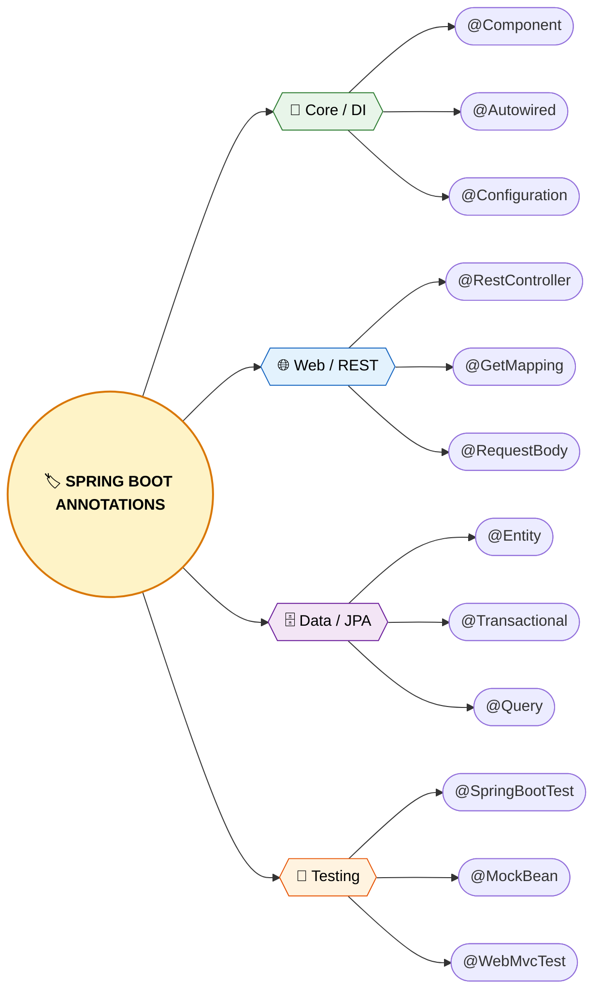
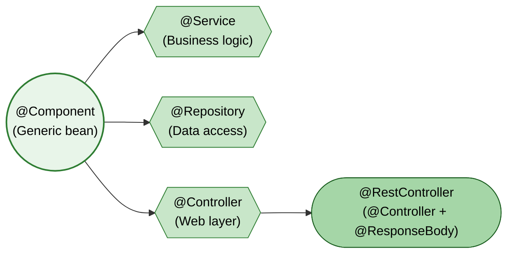

# Spring Boot Annotations

> **Think of annotations as sticky notes you slap onto classes and methods. At startup, Spring reads every sticky note, follows the instructions, and wires your application together. No XML. No manual plumbing. Just metadata-driven configuration.**

---


```mermaid
flowchart LR
    SB(("🏷️ <b>SPRING BOOT ANNOTATIONS</b>"))
    SB --> Core{{"🧩 Core / DI"}}
    SB --> Web{{"🌐 Web / REST"}}
    SB --> Data{{"🗄️ Data / JPA"}}
    SB --> Test{{"🧪 Testing"}}
    
    Core --> C1(["@Component"])
    Core --> C2(["@Autowired"])
    Core --> C3(["@Configuration"])
    
    Web --> W1(["@RestController"])
    Web --> W2(["@GetMapping"])
    Web --> W3(["@RequestBody"])
    
    Data --> D1(["@Entity"])
    Data --> D2(["@Transactional"])
    Data --> D3(["@Query"])
    
    Test --> T1(["@SpringBootTest"])
    Test --> T2(["@MockBean"])
    Test --> T3(["@WebMvcTest"])

    style SB fill:#FEF3C7,stroke:#D97706,stroke-width:2px,color:#000
    style Core fill:#E8F5E9,stroke:#2E7D32,color:#000
    style Web fill:#E3F2FD,stroke:#1565C0,color:#000
    style Data fill:#F3E5F5,stroke:#6A1B9A,color:#000
    style Test fill:#FFF3E0,stroke:#E65100,color:#000
```

---

## The Master Annotation

```java
@SpringBootApplication  // = @Configuration + @EnableAutoConfiguration + @ComponentScan
public class PaymentGatewayApplication {
    public static void main(String[] args) {
        SpringApplication.run(PaymentGatewayApplication.class, args);
    }
}
```

!!! abstract "What @SpringBootApplication does internally"
    It is a composed annotation combining three:
    
    - **@Configuration** — marks the class as a bean definition source (replaces XML config)
    - **@EnableAutoConfiguration** — triggers `spring.factories` / `AutoConfiguration.imports`; Spring scans classpath JARs, finds auto-config classes, registers beans conditionally
    - **@ComponentScan** — recursively scans the package of this class and all sub-packages for `@Component`-family annotations

!!! warning "Common mistake"
    Placing `@SpringBootApplication` in the root package (`com.company`) is fine. Placing it in a sub-package (`com.company.config`) means sibling packages like `com.company.service` are **never scanned**.

---

## Core / DI Annotations

### Stereotype Annotations


```mermaid
flowchart LR
    C(("@Component<br/>(Generic bean)"))
    C --> S{{"@Service<br/>(Business logic)"}}
    C --> R{{"@Repository<br/>(Data access)"}}
    C --> Ctrl{{"@Controller<br/>(Web layer)"}}
    Ctrl --> RC(["@RestController<br/>(@Controller + @ResponseBody)"])

    style C fill:#E8F5E9,stroke:#2E7D32,stroke-width:2px,color:#000
    style S fill:#C8E6C9,stroke:#2E7D32,color:#000
    style R fill:#C8E6C9,stroke:#2E7D32,color:#000
    style Ctrl fill:#C8E6C9,stroke:#2E7D32,color:#000
    style RC fill:#A5D6A7,stroke:#1B5E20,color:#000
```

#### Comparison: @Component vs @Service vs @Repository vs @Controller

| Annotation | Layer | Special Behavior | Use When |
|------------|-------|------------------|----------|
| `@Component` | Any | None. Generic bean. | Utility classes, adapters, mappers |
| `@Service` | Business | None. Purely semantic. | Business logic, orchestration |
| `@Repository` | Data | Enables **exception translation** — JDBC/JPA exceptions become `DataAccessException` | DAOs, repository implementations |
| `@Controller` | Web | Enables handler method detection + view resolution | MVC controllers returning Thymeleaf views |
| `@RestController` | Web | `@Controller` + `@ResponseBody` on every method | REST APIs returning JSON/XML |

!!! info "Why @Repository translates exceptions"
    Spring wraps the repository proxy in a `PersistenceExceptionTranslationPostProcessor`. Any `SQLException` or JPA `PersistenceException` thrown inside a `@Repository` bean gets caught and re-thrown as a Spring `DataAccessException` subclass. This decouples your service layer from the persistence technology.

### Dependency Injection

=== "Constructor Injection (Recommended)"

    ```java
    @Service
    public class OrderFulfillmentService {
        private final PaymentGateway paymentGateway;
        private final InventoryClient inventoryClient;
        private final NotificationService notificationService;

        // @Autowired is optional when there's a single constructor (Spring 4.3+)
        public OrderFulfillmentService(PaymentGateway paymentGateway,
                                       InventoryClient inventoryClient,
                                       NotificationService notificationService) {
            this.paymentGateway = paymentGateway;
            this.inventoryClient = inventoryClient;
            this.notificationService = notificationService;
        }
    }
    ```

=== "Field Injection (Avoid in production)"

    ```java
    @Service
    public class OrderFulfillmentService {
        @Autowired private PaymentGateway paymentGateway;      // untestable without Spring
        @Autowired private InventoryClient inventoryClient;    // cannot be final
        @Autowired private NotificationService notificationService;
    }
    ```

=== "Setter Injection (Optional dependencies)"

    ```java
    @Service
    public class ReportService {
        private CacheManager cacheManager;

        @Autowired(required = false)  // won't fail if no CacheManager bean exists
        public void setCacheManager(CacheManager cacheManager) {
            this.cacheManager = cacheManager;
        }
    }
    ```

| Annotation | What It Does | Where To Use | Internal Mechanism |
|-----------|--------------|--------------|-------------------|
| `@Autowired` | Injects a matching bean by type | Constructor, field, setter | `AutowiredAnnotationBeanPostProcessor` resolves candidates |
| `@Qualifier("name")` | Disambiguates when multiple beans match | Alongside `@Autowired` | Narrows candidate list by bean name |
| `@Primary` | Marks one bean as the default | On bean definition | Used when no `@Qualifier` is specified |
| `@Value("${key}")` | Injects properties / SpEL expressions | Fields, parameters | Resolved by `PropertySourcesPlaceholderConfigurer` |

!!! danger "Gotcha: @Value default syntax"
    ```java
    // WRONG — fails at startup if property missing
    @Value("${api.timeout}")
    private int timeout;

    // CORRECT — provides default value
    @Value("${api.timeout:5000}")
    private int timeout;

    // SpEL expression
    @Value("#{${api.retry-count:3} * 2}")
    private int maxAttempts;
    ```

### Configuration and Bean Definitions

```java
@Configuration
public class HttpClientConfig {

    @Bean
    @Scope("prototype")  // new instance every time it's injected
    public CloseableHttpClient httpClient() {
        return HttpClients.custom()
            .setMaxConnTotal(200)
            .setMaxConnPerRoute(50)
            .build();
    }

    @Bean(initMethod = "start", destroyMethod = "shutdown")
    @Lazy  // created on first access, not at startup
    public ScheduledExecutorService scheduler() {
        return Executors.newScheduledThreadPool(4);
    }

    @Bean
    @Profile("!production")  // only in non-prod environments
    public DataSource h2DataSource() {
        return new EmbeddedDatabaseBuilder()
            .setType(EmbeddedDatabaseType.H2)
            .addScript("schema.sql")
            .build();
    }
}
```

| Annotation | What It Does | Common Mistake |
|-----------|--------------|----------------|
| `@Configuration` | Full configuration class; `@Bean` methods are proxied via CGLIB | Using `@Component` instead — loses CGLIB proxying, `@Bean` method calls create new instances |
| `@Bean` | Registers the method return value as a bean | Forgetting it returns a **singleton** by default — calling the method directly still returns the same instance (CGLIB magic) |
| `@Scope("prototype")` | New instance per injection point | Injecting prototype into singleton — you always get the same instance. Use `ObjectProvider<T>` or `@Lookup`. |
| `@Lazy` | Defer initialization until first access | Does not work on `@Bean` methods inside `@Component` (only `@Configuration`) |
| `@Profile("dev")` | Bean active only in given profile | Forgetting to set `spring.profiles.active` — bean never loads |

---

## Conditional Annotations

Conditionals let Spring decide at startup whether to register a bean.

```java
@Configuration
public class CacheConfig {

    @Bean
    @ConditionalOnProperty(name = "app.cache.enabled", havingValue = "true")
    public CacheManager redisCacheManager(RedisConnectionFactory factory) {
        return RedisCacheManager.builder(factory).build();
    }

    @Bean
    @ConditionalOnMissingBean(CacheManager.class)
    public CacheManager noOpCacheManager() {
        return new NoOpCacheManager();  // fallback when Redis is disabled
    }
}

@Service
@ConditionalOnClass(name = "com.amazonaws.services.s3.AmazonS3")
public class S3StorageService implements StorageService {
    // only registered if AWS SDK is on the classpath
}
```

| Annotation | Registers Bean When... |
|-----------|----------------------|
| `@ConditionalOnProperty` | A config property has a specific value |
| `@ConditionalOnClass` | A class is on the classpath |
| `@ConditionalOnMissingBean` | No other bean of that type exists |
| `@ConditionalOnBean` | Another bean of that type already exists |
| `@ConditionalOnExpression` | A SpEL expression evaluates to `true` |
| `@ConditionalOnWebApplication` | Running in a web context (servlet or reactive) |

!!! tip "How Auto-Configuration works"
    Every Spring Boot starter uses `@Conditional*` annotations heavily. Example: `DataSourceAutoConfiguration` has `@ConditionalOnClass(DataSource.class)`. If you don't have a JDBC driver on the classpath, the entire config is skipped.

---

## Web / REST Annotations

### Request Mapping

#### Comparison: @RequestMapping vs @GetMapping

| Feature | `@RequestMapping` | `@GetMapping` / `@PostMapping` etc. |
|---------|-------------------|--------------------------------------|
| HTTP method | Must specify `method = RequestMethod.GET` | Implicit |
| Readability | Verbose | Concise |
| Class-level | Yes (base path) | No (method-level only) |
| Spring version | 2.5+ | 4.3+ |

```java
@RestController
@RequestMapping("/api/v1/orders")
public class OrderController {

    private final OrderService orderService;

    public OrderController(OrderService orderService) {
        this.orderService = orderService;
    }

    @GetMapping
    public ResponseEntity<Page<OrderDto>> listOrders(
            @RequestParam(defaultValue = "0") int page,
            @RequestParam(defaultValue = "20") int size,
            @RequestParam(required = false) OrderStatus status) {
        Pageable pageable = PageRequest.of(page, size, Sort.by("createdAt").descending());
        return ResponseEntity.ok(orderService.findAll(status, pageable));
    }

    @GetMapping("/{orderId}")
    public ResponseEntity<OrderDto> getOrder(@PathVariable UUID orderId) {
        return orderService.findById(orderId)
            .map(ResponseEntity::ok)
            .orElseThrow(() -> new OrderNotFoundException(orderId));
    }

    @PostMapping
    @ResponseStatus(HttpStatus.CREATED)
    public OrderDto createOrder(@Valid @RequestBody CreateOrderRequest request,
                                @AuthenticationPrincipal UserPrincipal principal) {
        return orderService.create(request, principal.getUserId());
    }

    @PatchMapping("/{orderId}/status")
    public OrderDto updateStatus(@PathVariable UUID orderId,
                                 @Valid @RequestBody UpdateStatusRequest request) {
        return orderService.updateStatus(orderId, request.getStatus());
    }

    @DeleteMapping("/{orderId}")
    @ResponseStatus(HttpStatus.NO_CONTENT)
    public void cancelOrder(@PathVariable UUID orderId) {
        orderService.cancel(orderId);
    }
}
```

### @RequestBody vs @ModelAttribute

| Feature | `@RequestBody` | `@ModelAttribute` |
|---------|---------------|-------------------|
| Content type | `application/json`, `application/xml` | `application/x-www-form-urlencoded`, `multipart/form-data` |
| Deserialization | Jackson `ObjectMapper` | Data binding via setters |
| Use case | REST APIs | Form submissions, file uploads |
| Validation | `@Valid` triggers JSR-380 | `@Valid` triggers JSR-380 |

### Validation Annotations

```java
public class CreateOrderRequest {

    @NotNull(message = "Customer ID is required")
    private UUID customerId;

    @NotEmpty(message = "Order must contain at least one item")
    @Size(max = 50, message = "Maximum 50 items per order")
    private List<@Valid OrderItem> items;

    @FutureOrPresent(message = "Delivery date cannot be in the past")
    private LocalDate requestedDeliveryDate;
}

public class OrderItem {

    @NotNull
    private UUID productId;

    @Min(value = 1, message = "Quantity must be at least 1")
    @Max(value = 10000)
    private int quantity;
}
```

!!! info "@Valid vs @Validated"
    | Feature | `@Valid` (JSR-380) | `@Validated` (Spring) |
    |---------|-------------------|----------------------|
    | Package | `jakarta.validation` | `org.springframework.validation.annotation` |
    | Group support | No | Yes — `@Validated(OnCreate.class)` |
    | Method-level | No | Yes — enables method parameter validation |
    | Nested | Cascades into nested objects | Does not cascade |

---

## Data / JPA Annotations

### Entity Mapping

```java
@Entity
@Table(name = "orders", indexes = {
    @Index(name = "idx_customer_id", columnList = "customer_id"),
    @Index(name = "idx_status_created", columnList = "status, created_at")
})
@EntityListeners(AuditingEntityListener.class)
public class Order {

    @Id
    @GeneratedValue(strategy = GenerationType.UUID)
    private UUID id;

    @Column(name = "customer_id", nullable = false)
    private UUID customerId;

    @Enumerated(EnumType.STRING)
    @Column(nullable = false, length = 20)
    private OrderStatus status;

    @OneToMany(mappedBy = "order", cascade = CascadeType.ALL, orphanRemoval = true)
    private List<OrderLineItem> lineItems = new ArrayList<>();

    @Embedded
    private Address shippingAddress;

    @CreatedDate
    @Column(name = "created_at", updatable = false)
    private Instant createdAt;

    @LastModifiedDate
    @Column(name = "updated_at")
    private Instant updatedAt;

    @Version  // optimistic locking
    private Long version;

    @Transient  // not persisted
    private transient BigDecimal calculatedTotal;
}
```

| Annotation | What It Does | Internal Behavior | Common Mistake |
|-----------|--------------|-------------------|----------------|
| `@Entity` | Marks class as JPA entity | Hibernate creates metadata, maps to table | Missing no-arg constructor (JPA requires it) |
| `@Table` | Customizes table name, indexes, constraints | DDL generation uses this | Forgetting index on FK columns |
| `@Id` + `@GeneratedValue` | Primary key + generation strategy | IDENTITY = DB auto-increment; SEQUENCE = pre-allocated batch | Using IDENTITY with batch inserts (disables batching) |
| `@Column` | Column constraints | Reflected in DDL and validation | `nullable = false` is DDL-only; add `@NotNull` for app-level validation |
| `@Enumerated(STRING)` | Stores enum as text | ORDINAL stores index (fragile if enum reordered) | Using default ORDINAL — adding an enum value breaks all existing data |
| `@Version` | Optimistic locking | Hibernate increments on each update; throws `OptimisticLockException` on conflict | Not handling the exception in service layer |

### Repository and Transactions

```java
@Repository
public interface OrderRepository extends JpaRepository<Order, UUID> {

    // Derived query — Spring Data generates JPQL from method name
    List<Order> findByCustomerIdAndStatusOrderByCreatedAtDesc(UUID customerId, OrderStatus status);

    // Custom JPQL
    @Query("""
        SELECT o FROM Order o
        JOIN FETCH o.lineItems
        WHERE o.status = :status AND o.createdAt > :since
        """)
    List<Order> findRecentOrdersWithItems(@Param("status") OrderStatus status,
                                          @Param("since") Instant since);

    // Native SQL for complex queries
    @Query(value = "SELECT customer_id, COUNT(*) as cnt FROM orders GROUP BY customer_id HAVING COUNT(*) > :min",
           nativeQuery = true)
    List<Object[]> findFrequentCustomers(@Param("min") int minOrders);

    // Modifying query
    @Modifying(clearAutomatically = true)
    @Query("UPDATE Order o SET o.status = :status WHERE o.id IN :ids")
    int bulkUpdateStatus(@Param("ids") List<UUID> ids, @Param("status") OrderStatus status);
}
```

```java
@Service
@RequiredArgsConstructor
public class OrderService {

    private final OrderRepository orderRepository;
    private final PaymentGateway paymentGateway;
    private final ApplicationEventPublisher eventPublisher;

    @Transactional
    public Order placeOrder(CreateOrderRequest request) {
        Order order = mapToEntity(request);
        order.setStatus(OrderStatus.PENDING);
        order = orderRepository.save(order);

        paymentGateway.charge(order.getCustomerId(), order.getTotal());
        order.setStatus(OrderStatus.CONFIRMED);

        // published after transaction commits (see @TransactionalEventListener)
        eventPublisher.publishEvent(new OrderPlacedEvent(order.getId()));
        return order;
    }

    @Transactional(readOnly = true)  // no dirty checking, flushMode=MANUAL — faster reads
    public Page<Order> findAll(OrderStatus status, Pageable pageable) {
        return orderRepository.findAll(pageable);
    }

    @Transactional(propagation = Propagation.REQUIRES_NEW, timeout = 5)
    public void processRefund(UUID orderId) {
        // runs in a NEW transaction, independent of caller's transaction
    }
}
```

!!! danger "Gotcha: @Transactional on private methods"
    ```java
    @Service
    public class BrokenService {

        @Transactional
        private void doWork() {
            // SILENTLY IGNORED. No transaction is created.
            // Spring AOP uses proxies — private methods bypass the proxy.
        }

        public void caller() {
            doWork();  // also no transaction — self-invocation skips proxy
        }
    }
    ```
    **Fix:** Make the method `public`, or inject the bean into itself, or use `TransactionTemplate` programmatically.

---

## Scheduling Annotations

```java
@Configuration
@EnableScheduling
@EnableAsync
public class SchedulingConfig {

    @Bean
    public TaskScheduler taskScheduler() {
        ThreadPoolTaskScheduler scheduler = new ThreadPoolTaskScheduler();
        scheduler.setPoolSize(5);
        scheduler.setThreadNamePrefix("scheduled-");
        return scheduler;
    }
}

@Service
@Slf4j
public class DataSyncService {

    @Scheduled(fixedRate = 60_000)  // every 60 seconds, measured from start of previous
    public void syncInventory() {
        log.info("Syncing inventory...");
    }

    @Scheduled(fixedDelay = 30_000)  // 30s after previous execution COMPLETES
    public void processQueue() {
        log.info("Processing message queue...");
    }

    @Scheduled(cron = "0 0 2 * * MON-FRI")  // 2 AM on weekdays
    public void generateDailyReport() {
        log.info("Generating report...");
    }

    @Async  // runs in a separate thread
    @Retryable(value = RemoteServiceException.class, maxAttempts = 3,
               backoff = @Backoff(delay = 1000, multiplier = 2))
    public CompletableFuture<SyncResult> syncExternalSystem() {
        // retries up to 3 times with exponential backoff: 1s, 2s, 4s
        return CompletableFuture.completedFuture(doSync());
    }
}
```

!!! danger "Gotcha: @Async without @EnableAsync"
    If you forget `@EnableAsync` on a `@Configuration` class, `@Async` methods run **synchronously** on the calling thread. No error. No warning. Just blocking behavior.

| Annotation | What It Does | Requires |
|-----------|--------------|----------|
| `@EnableScheduling` | Activates `@Scheduled` processing | On a `@Configuration` class |
| `@Scheduled` | Marks method to run periodically | `@EnableScheduling`; method must be `void`, no args |
| `@EnableAsync` | Activates `@Async` processing | On a `@Configuration` class |
| `@Async` | Executes method in a separate thread pool | `@EnableAsync`; return `void` or `CompletableFuture` |
| `@Retryable` | Retries on specified exceptions | `spring-retry` dependency + `@EnableRetry` |
| `@Recover` | Fallback when all retries exhausted | Method signature must match `@Retryable` return type |

---

## Event Listener Annotations

```java
@Component
@Slf4j
public class OrderEventHandler {

    // Runs synchronously within the calling thread
    @EventListener
    public void handleOrderPlaced(OrderPlacedEvent event) {
        log.info("Order placed: {}", event.getOrderId());
    }

    // Runs AFTER the transaction that published the event commits successfully
    @TransactionalEventListener(phase = TransactionPhase.AFTER_COMMIT)
    public void sendConfirmationEmail(OrderPlacedEvent event) {
        // safe to send email — we KNOW the order is persisted
        emailService.sendOrderConfirmation(event.getOrderId());
    }

    // Runs if the transaction rolls back
    @TransactionalEventListener(phase = TransactionPhase.AFTER_ROLLBACK)
    public void handleOrderFailure(OrderPlacedEvent event) {
        log.error("Order failed: {}", event.getOrderId());
    }
}
```

!!! warning "@TransactionalEventListener gotcha"
    If no transaction is active when the event is published, the listener **never fires** (by default). Set `fallbackExecution = true` to run it regardless.

---

## Security Annotations

```java
@Configuration
@EnableMethodSecurity  // enables @PreAuthorize, @PostAuthorize
public class SecurityConfig {
    // ...
}

@RestController
@RequestMapping("/api/v1/admin")
public class AdminController {

    @GetMapping("/users")
    @PreAuthorize("hasRole('ADMIN')")
    public List<User> listUsers() { ... }

    @DeleteMapping("/users/{id}")
    @PreAuthorize("hasRole('ADMIN') and #id != authentication.principal.id")
    public void deleteUser(@PathVariable Long id) {
        // cannot delete yourself
    }

    @GetMapping("/reports/{reportId}")
    @PostAuthorize("returnObject.ownerId == authentication.principal.id or hasRole('ADMIN')")
    public Report getReport(@PathVariable Long reportId) {
        // checked AFTER method returns — filters unauthorized access to result
    }

    @PutMapping("/config")
    @Secured("ROLE_SUPER_ADMIN")  // simpler, no SpEL
    public void updateConfig(@RequestBody ConfigUpdate update) { ... }
}
```

| Annotation | When Evaluated | Supports SpEL | Use Case |
|-----------|---------------|---------------|----------|
| `@PreAuthorize` | Before method | Yes | Role checks, parameter-based rules |
| `@PostAuthorize` | After method | Yes | Filter by return value |
| `@Secured` | Before method | No | Simple role checks |
| `@RolesAllowed` | Before method | No | JSR-250 standard (portable) |

---

## Testing Annotations

```java
// Full integration test — loads entire context
@SpringBootTest(webEnvironment = SpringBootTest.WebEnvironment.RANDOM_PORT)
@Testcontainers
class OrderServiceIntegrationTest {

    @Container
    static PostgreSQLContainer<?> postgres = new PostgreSQLContainer<>("postgres:15");

    @DynamicPropertySource
    static void configureDatabase(DynamicPropertyRegistry registry) {
        registry.add("spring.datasource.url", postgres::getJdbcUrl);
        registry.add("spring.datasource.username", postgres::getUsername);
        registry.add("spring.datasource.password", postgres::getPassword);
    }

    @Autowired
    private OrderService orderService;

    @MockBean  // replaces real bean with Mockito mock in the context
    private PaymentGateway paymentGateway;

    @Test
    void shouldPlaceOrder() {
        when(paymentGateway.charge(any(), any())).thenReturn(PaymentResult.success());
        Order order = orderService.placeOrder(createRequest());
        assertThat(order.getStatus()).isEqualTo(OrderStatus.CONFIRMED);
    }
}
```

```java
// Web layer ONLY — fast, no DB, no service beans
@WebMvcTest(OrderController.class)
class OrderControllerTest {

    @Autowired
    private MockMvc mockMvc;

    @MockBean
    private OrderService orderService;

    @Test
    void shouldReturn404WhenOrderNotFound() throws Exception {
        when(orderService.findById(any())).thenReturn(Optional.empty());

        mockMvc.perform(get("/api/v1/orders/{id}", UUID.randomUUID())
                .contentType(MediaType.APPLICATION_JSON))
            .andExpect(status().isNotFound())
            .andExpect(jsonPath("$.error").value("Order not found"));
    }
}
```

```java
// JPA layer only — auto-configures embedded DB, Flyway, entity scanning
@DataJpaTest
@AutoConfigureTestDatabase(replace = AutoConfigureTestDatabase.Replace.NONE)
@DirtiesContext(classMode = DirtiesContext.ClassMode.AFTER_EACH_TEST_METHOD)
class OrderRepositoryTest {

    @Autowired
    private TestEntityManager em;

    @Autowired
    private OrderRepository orderRepository;

    @Test
    void shouldFindByCustomerAndStatus() {
        Order order = new Order(UUID.randomUUID(), OrderStatus.CONFIRMED);
        em.persistAndFlush(order);

        List<Order> results = orderRepository
            .findByCustomerIdAndStatusOrderByCreatedAtDesc(order.getCustomerId(), OrderStatus.CONFIRMED);

        assertThat(results).hasSize(1);
    }
}
```

| Annotation | What It Loads | Use For | Common Mistake |
|-----------|--------------|---------|----------------|
| `@SpringBootTest` | Full application context | End-to-end integration | Slow tests — use sliced tests when possible |
| `@WebMvcTest` | Web layer only (controllers, filters, advice) | Controller tests | Forgetting to `@MockBean` service dependencies |
| `@DataJpaTest` | JPA layer (entities, repositories, Flyway) | Repository tests | Using H2 when prod uses Postgres — behavior differs |
| `@MockBean` | Replaces a bean with Mockito mock | Isolating dependencies | Overusing it — every unique `@MockBean` combo creates a new context (slow) |
| `@DirtiesContext` | Destroys and recreates context after test | Tests that mutate shared state | Using it everywhere — extremely expensive |
| `@DynamicPropertySource` | Injects runtime properties (e.g., Testcontainers port) | Container-based tests | Making it non-static (must be `static`) |

---

## Lesser-Known but Useful Annotations

### @Retryable

```java
@Service
@EnableRetry
public class ExternalApiClient {

    @Retryable(
        retryFor = {HttpServerErrorException.class, SocketTimeoutException.class},
        noRetryFor = {HttpClientErrorException.class},  // don't retry 4xx
        maxAttempts = 4,
        backoff = @Backoff(delay = 500, multiplier = 2, maxDelay = 8000)
    )
    public ApiResponse fetchData(String endpoint) {
        return restTemplate.getForObject(endpoint, ApiResponse.class);
    }

    @Recover
    public ApiResponse fallback(HttpServerErrorException ex, String endpoint) {
        log.error("All retries failed for {}: {}", endpoint, ex.getMessage());
        return ApiResponse.empty();
    }
}
```

### @EventListener and @TransactionalEventListener

See the [Event Listener Annotations](#event-listener-annotations) section above.

### @DirtiesContext

Forces Spring to destroy and recreate the application context. Use sparingly.

```java
@SpringBootTest
@DirtiesContext(classMode = DirtiesContext.ClassMode.AFTER_EACH_TEST_METHOD)
class StatefulServiceTest {
    // Each test gets a fresh context — necessary when tests modify singleton state
}
```

---

## Interview Questions

??? question "1. What is the difference between @Bean and @Component?"
    - `@Component` is **class-level** — the class itself is the bean, discovered via classpath scanning.
    - `@Bean` is **method-level** inside `@Configuration` — the method's return value is registered as a bean.
    
    Use `@Bean` when:
    
    - You cannot annotate the class (third-party library: `RestTemplate`, `ObjectMapper`, `AmazonS3Client`)
    - You need conditional logic or constructor arguments not available via DI
    - You want multiple beans of the same type with different configurations

??? question "2. Why does @Repository translate exceptions?"
    Spring wraps `@Repository` beans with a `PersistenceExceptionTranslationPostProcessor`. This AOP advisor catches technology-specific exceptions (JDBC `SQLException`, JPA `PersistenceException`, MongoDB `MongoException`) and converts them to Spring's `DataAccessException` hierarchy.
    
    **Why?** Your service layer depends on a `DataAccessException`, not a Hibernate-specific exception. If you swap Hibernate for JDBC Template, your service code doesn't change.

??? question "3. @RequestBody vs @ModelAttribute — when to use which?"
    | | `@RequestBody` | `@ModelAttribute` |
    |--|--|--|
    | Content-Type | `application/json` | `form-urlencoded`, `multipart/form-data` |
    | Binding | Jackson deserialization | Servlet data binding (setters) |
    | File uploads | No | Yes |
    | Use case | REST APIs | HTML form submissions |

??? question "4. What happens when @Transactional is on a private method?"
    **Nothing.** Spring's default AOP mechanism uses JDK dynamic proxies or CGLIB proxies. Both only intercept calls coming through the proxy object. Private methods cannot be proxied.
    
    The annotation is **silently ignored** — no error, no warning, no transaction.
    
    Same issue with self-invocation: calling `this.transactionalMethod()` bypasses the proxy.

??? question "5. Difference between @Autowired and @Resource?"
    - `@Autowired` (Spring): resolves **by type** first, then by qualifier/name
    - `@Resource` (JSR-250): resolves **by name** first, then by type
    - `@Inject` (JSR-330): identical to `@Autowired` but no `required` attribute

??? question "6. How does @Conditional* work in auto-configuration?"
    Auto-configuration classes (in `META-INF/spring/AutoConfiguration.imports`) are loaded but only **activated** if their conditions pass. Spring evaluates `@Conditional*` annotations before instantiating any beans from that class.
    
    Order of evaluation: `@ConditionalOnClass` → `@ConditionalOnProperty` → `@ConditionalOnMissingBean`.

??? question "7. @Valid vs @Validated — what's the real difference?"
    - `@Valid` (JSR-380): triggers cascading validation on nested objects. Works on method parameters and fields.
    - `@Validated` (Spring): adds **validation group** support and enables **method-level** validation (e.g., validating `@PathVariable` or `@RequestParam`).
    
    To validate a `@PathVariable Long id` with `@Min(1)`, you need `@Validated` on the **class**.

??? question "8. What is the proxy mechanism behind @Async?"
    Spring creates a proxy around the bean. When an `@Async` method is called, the proxy submits the method to a `TaskExecutor` thread pool instead of executing it on the caller's thread.
    
    Requires `@EnableAsync`. Fails silently without it. Self-invocation (`this.asyncMethod()`) runs synchronously.

??? question "9. @SpringBootTest vs @WebMvcTest vs @DataJpaTest — when to use which?"
    - `@SpringBootTest`: loads everything. Use for integration/E2E tests.
    - `@WebMvcTest(Controller.class)`: loads only web layer (controller, filters, exception handlers). Fast. Mock services.
    - `@DataJpaTest`: loads JPA layer (entities, repos, Flyway). Uses transactional rollback by default.
    
    Rule: use the **narrowest** slice that covers your test scenario.

??? question "10. Why does @Configuration use CGLIB proxying?"
    Without CGLIB, calling one `@Bean` method from another creates a **new instance** every time (normal Java method call). With CGLIB, Spring intercepts the call and returns the existing singleton bean.
    
    ```java
    @Configuration
    public class Config {
        @Bean
        public A a() { return new A(b()); }  // calls b()
        @Bean
        public B b() { return new B(); }     // same instance returned!
    }
    ```
    Using `@Component` instead of `@Configuration` disables this — `b()` call creates a second `B` instance.

??? question "11. What does @DirtiesContext do and why avoid it?"
    It marks the ApplicationContext as dirty — Spring destroys it and creates a fresh one for subsequent tests. Necessary when a test modifies singleton state (e.g., changes a cache, pushes to an in-memory queue).
    
    **Why avoid:** context creation is expensive (1-10 seconds). Use it surgically, not as a default.

??? question "12. How does @Retryable work internally?"
    Spring AOP wraps the method in a `RetryTemplate`. On exception:
    
    1. Check if exception matches `retryFor` and not `noRetryFor`
    2. Wait according to `@Backoff` policy
    3. Re-invoke the method
    4. After `maxAttempts`, call `@Recover` method (if present) or rethrow
    
    Requires `spring-retry` on classpath and `@EnableRetry` on a config class.

??? question "13. @EventListener vs @TransactionalEventListener?"
    - `@EventListener`: fires **immediately** when `publishEvent()` is called (synchronously, same thread)
    - `@TransactionalEventListener`: fires **after the transaction** reaches the specified phase (default: `AFTER_COMMIT`)
    
    Use `@TransactionalEventListener` for side effects (emails, notifications) that should only happen if the data is actually persisted.

??? question "14. What is @MockBean's impact on test performance?"
    Each unique combination of `@MockBean` annotations creates a **separate** ApplicationContext. Spring caches contexts by their configuration fingerprint. If Test A mocks `ServiceX` and Test B mocks `ServiceY`, they cannot share a context.
    
    **Fix:** standardize mocks across test classes, or use `@TestConfiguration` with manual mock beans.

---

!!! tip "Key Principle"
    Annotations are not magic. They are instructions Spring reads at startup (or at request time for web annotations). Understanding the proxy mechanism, bean post-processors, and condition evaluation makes debugging trivial. When something "silently doesn't work," the answer is almost always: the proxy was bypassed.
