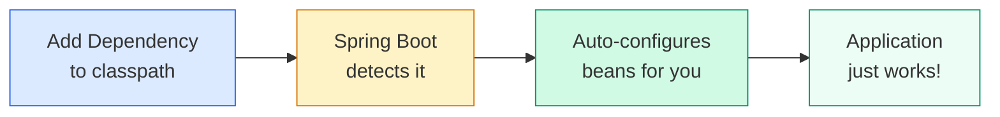
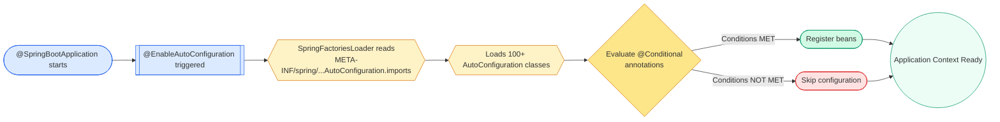
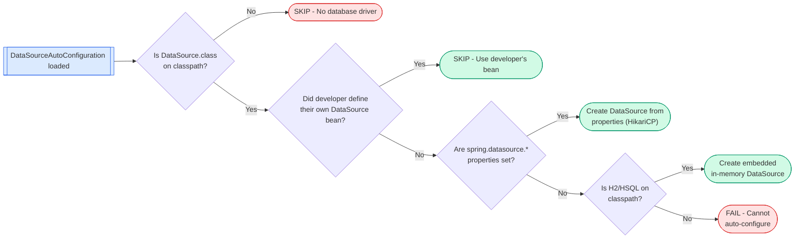

# Auto-Configuration

> How Spring Boot configures your application automatically — and how to take control when it gets it wrong.



---

## What is Auto-Configuration?

Auto-configuration creates beans based on classpath contents and property values. No XML. No boilerplate. Convention over Configuration.

You add `spring-boot-starter-data-jpa`. Spring Boot sees Hibernate on the classpath, finds `spring.datasource.url`, and wires up an `EntityManagerFactory`, a `DataSource`, and transaction management. You write zero config.

!!! info "Core Guarantee"
    Your explicit `@Bean` definitions always win. Auto-configuration backs off via `@ConditionalOnMissingBean`.

---

## The Annotation Chain

| Annotation | Role |
|---|---|
| `@SpringBootApplication` | Composite: includes `@EnableAutoConfiguration` |
| `@EnableAutoConfiguration` | Triggers the auto-configuration import mechanism |
| `@AutoConfiguration` | Marks a class as an auto-configuration (Spring Boot 3+) |
| `@Conditional*` family | Guards that decide if a config activates |

`@SpringBootApplication` = `@Configuration` + `@EnableAutoConfiguration` + `@ComponentScan`.

---

## How Auto-Configuration Works Internally



### Step-by-Step

1. `@EnableAutoConfiguration` imports `AutoConfigurationImportSelector`
2. The selector reads `META-INF/spring/org.springframework.boot.autoconfigure.AutoConfiguration.imports`
3. Each listed FQCN is a candidate auto-configuration class
4. Spring evaluates all `@Conditional*` annotations on each class
5. Only classes with **all conditions satisfied** register their beans
6. Ordering is resolved via `@AutoConfigureBefore`, `@AutoConfigureAfter`, `@AutoConfigureOrder`

### The Imports File (Spring Boot 3.x)

Location: `src/main/resources/META-INF/spring/org.springframework.boot.autoconfigure.AutoConfiguration.imports`

```text
com.example.autoconfigure.GreetingAutoConfiguration
com.example.autoconfigure.MetricsAutoConfiguration
```

One fully-qualified class name per line. No key-value format. Replaces the old `spring.factories` approach.

!!! warning "Spring Boot 2.x vs 3.x"
    In 2.x, auto-configurations were registered in `META-INF/spring.factories` under the key `org.springframework.boot.autoconfigure.EnableAutoConfiguration`. This still works in 3.x for backward compatibility but is deprecated.

---

## The @Conditional Family

These annotations are the gatekeepers. They decide if a configuration activates.

| Annotation | Fires When |
|---|---|
| `@ConditionalOnClass` | Class exists on classpath |
| `@ConditionalOnMissingClass` | Class absent from classpath |
| `@ConditionalOnBean` | Bean of type/name exists in context |
| `@ConditionalOnMissingBean` | Bean does NOT exist — **the most critical one** |
| `@ConditionalOnProperty` | Property matches a value (or is present) |
| `@ConditionalOnExpression` | SpEL expression is true |
| `@ConditionalOnWebApplication` | App is a servlet or reactive web app |
| `@ConditionalOnNotWebApplication` | App is NOT a web app |
| `@ConditionalOnResource` | Classpath resource exists |
| `@ConditionalOnSingleCandidate` | Exactly one bean (or one primary) of type exists |
| `@ConditionalOnJava` | JVM version matches |
| `@ConditionalOnCloudPlatform` | Running on specific cloud (Kubernetes, Cloud Foundry) |

!!! danger "Common Mistake: @ConditionalOnBean on user configs"
    `@ConditionalOnBean` evaluates against beans already registered at evaluation time. If the bean you depend on hasn't been created yet (ordering issue), the condition fails silently. Use `@AutoConfigureAfter` to fix ordering.

---

## Case Study: DataSource Auto-Configuration



Simplified source:

```java
@AutoConfiguration
@ConditionalOnClass(DataSource.class)
@EnableConfigurationProperties(DataSourceProperties.class)
public class DataSourceAutoConfiguration {

    @Configuration
    @ConditionalOnMissingBean(DataSource.class)
    @ConditionalOnProperty(name = "spring.datasource.url")
    static class PooledDataSourceConfiguration {

        @Bean
        public DataSource dataSource(DataSourceProperties properties) {
            return properties.initializeDataSourceBuilder()
                .type(HikariDataSource.class)
                .build();
        }
    }
}
```

---

## Debugging Auto-Configuration

### The --debug Flag

```bash
java -jar myapp.jar --debug
```

Or in `application.properties`:

```properties
debug=true
```

Produces a **CONDITIONS EVALUATION REPORT**:

=== "Positive Matches (Configured)"

    ```text
    ============================
    CONDITIONS EVALUATION REPORT
    ============================

    Positive matches:
    -----------------
    DataSourceAutoConfiguration matched:
      - @ConditionalOnClass found required class 'javax.sql.DataSource'
      
    DataSourceAutoConfiguration.PooledDataSourceConfiguration matched:
      - @ConditionalOnMissingBean (types: javax.sql.DataSource) did not find any beans
    ```

=== "Negative Matches (Skipped)"

    ```text
    Negative matches:
    -----------------
    MongoAutoConfiguration:
      Did not match:
        - @ConditionalOnClass did not find required class 'com.mongodb.client.MongoClient'

    RedisAutoConfiguration:
      Did not match:
        - @ConditionalOnClass did not find required class 'org.springframework.data.redis.core.RedisOperations'
    ```

### ConditionEvaluationReport (Programmatic Access)

```java
@Component
public class AutoConfigDebugger implements CommandLineRunner {

    @Autowired
    private ApplicationContext context;

    @Override
    public void run(String... args) {
        ConditionEvaluationReport report = ConditionEvaluationReport
            .get((ConfigurableApplicationContext) context).getBeanFactory());
        
        report.getConditionAndOutcomesBySource().forEach((source, outcomes) -> {
            System.out.println("Source: " + source);
            outcomes.forEach(o -> System.out.println("  " + o.getMessage()));
        });
    }
}
```

### Actuator Endpoint

```properties
management.endpoints.web.exposure.include=conditions
```

Visit: `GET http://localhost:8080/actuator/conditions`

Returns JSON with `positiveMatches`, `negativeMatches`, and `unconditionalClasses`.

!!! tip "Quick Debug Checklist"
    1. Run with `--debug` — check the conditions report
    2. Is the class on the classpath? Check your dependencies
    3. Did you accidentally define a conflicting bean?
    4. Is a property missing or misspelled?
    5. Check ordering — is another auto-config supposed to run first?

---

## Excluding Auto-Configurations

=== "Annotation-based"

    ```java
    @SpringBootApplication(exclude = {
        DataSourceAutoConfiguration.class,
        SecurityAutoConfiguration.class
    })
    public class MyApplication { }
    ```

=== "Property-based"

    ```properties
    spring.autoconfigure.exclude=\
      org.springframework.boot.autoconfigure.jdbc.DataSourceAutoConfiguration,\
      org.springframework.boot.autoconfigure.security.servlet.SecurityAutoConfiguration
    ```

=== "By class name (no compile dependency)"

    ```java
    @SpringBootApplication(excludeName = {
        "org.springframework.boot.autoconfigure.jdbc.DataSourceAutoConfiguration"
    })
    public class MyApplication { }
    ```

!!! info "When to Exclude"
    - You have a library on classpath but don't want its auto-config (e.g., `spring-security` pulled transitively)
    - Two auto-configs conflict and you want manual control
    - Testing: exclude heavy configs to speed up context loading

---

## Auto-Configuration Order

!!! warning "Order Matters — and Gets People"
    Auto-configurations are loaded in an undefined order unless you explicitly control it. `@ConditionalOnBean` can fail if the bean it checks hasn't been registered yet.

| Annotation | Purpose |
|---|---|
| `@AutoConfigureBefore(X.class)` | This config runs before X |
| `@AutoConfigureAfter(X.class)` | This config runs after X |
| `@AutoConfigureOrder(value)` | Absolute ordering (lower = earlier, default = 0) |

```java
@AutoConfiguration
@AutoConfigureAfter(DataSourceAutoConfiguration.class)
public class JpaAutoConfiguration { }
```

!!! danger "Ordering Only Works Between Auto-Configurations"
    These annotations have NO effect on regular `@Configuration` classes. They only order auto-configuration classes relative to each other.

---

## What Happens When Two Auto-Configs Conflict?

Real scenario: you have two starters that both try to create a `RestTemplate` bean.

**Resolution rules:**

1. If both use `@ConditionalOnMissingBean` — the one that loads first wins, the second backs off
2. If one does NOT use `@ConditionalOnMissingBean` — you get a `BeanDefinitionOverrideException` (Spring Boot 2.1+ disables bean overriding by default)
3. You can re-enable overriding with `spring.main.allow-bean-definition-overriding=true` — but don't. Fix the root cause.

!!! danger "Don't Enable Bean Overriding in Production"
    `spring.main.allow-bean-definition-overriding=true` hides real conflicts. It makes debugging a nightmare. Fix the conflict instead.

---

## Build a Custom Starter: Greeting Service

A complete example of writing your own auto-configuration for a custom library.

### Project Structure

```
greeting-spring-boot-starter/
├── src/main/java/com/example/greeting/
│   ├── GreetingService.java
│   ├── GreetingProperties.java
│   └── GreetingAutoConfiguration.java
├── src/main/resources/
│   └── META-INF/spring/
│       └── org.springframework.boot.autoconfigure.AutoConfiguration.imports
└── pom.xml
```

### Step 1: The Service

```java
public class GreetingService {

    private final String prefix;
    private final String suffix;

    public GreetingService(String prefix, String suffix) {
        this.prefix = prefix;
        this.suffix = suffix;
    }

    public String greet(String name) {
        return prefix + " " + name + suffix;
    }
}
```

### Step 2: Configuration Properties

```java
@ConfigurationProperties(prefix = "greeting")
public class GreetingProperties {

    /** Prefix before the name */
    private String prefix = "Hello";

    /** Suffix after the name */
    private String suffix = "!";

    /** Enable/disable the greeting service */
    private boolean enabled = true;

    // getters and setters
    public String getPrefix() { return prefix; }
    public void setPrefix(String prefix) { this.prefix = prefix; }
    public String getSuffix() { return suffix; }
    public void setSuffix(String suffix) { this.suffix = suffix; }
    public boolean isEnabled() { return enabled; }
    public void setEnabled(boolean enabled) { this.enabled = enabled; }
}
```

### Step 3: Auto-Configuration Class

```java
@AutoConfiguration
@ConditionalOnClass(GreetingService.class)
@ConditionalOnProperty(prefix = "greeting", name = "enabled", havingValue = "true", matchIfMissing = true)
@EnableConfigurationProperties(GreetingProperties.class)
public class GreetingAutoConfiguration {

    @Bean
    @ConditionalOnMissingBean
    public GreetingService greetingService(GreetingProperties properties) {
        return new GreetingService(properties.getPrefix(), properties.getSuffix());
    }
}
```

### Step 4: Register the Auto-Configuration

`src/main/resources/META-INF/spring/org.springframework.boot.autoconfigure.AutoConfiguration.imports`:

```text
com.example.greeting.GreetingAutoConfiguration
```

### Step 5: User's Application

```yaml
# application.yml
greeting:
  prefix: "Howdy"
  suffix: ", welcome aboard!"
```

```java
@RestController
public class HelloController {

    private final GreetingService greetingService;

    public HelloController(GreetingService greetingService) {
        this.greetingService = greetingService;
    }

    @GetMapping("/hello/{name}")
    public String hello(@PathVariable String name) {
        return greetingService.greet(name);
        // Returns: "Howdy John, welcome aboard!"
    }
}
```

### Step 6: User Overrides (Optional)

If the user wants their own implementation:

```java
@Configuration
public class CustomGreetingConfig {

    @Bean
    public GreetingService greetingService() {
        // Custom logic — auto-config backs off
        return new GreetingService("Dear", " - Regards, System");
    }
}
```

The auto-configured bean disappears because of `@ConditionalOnMissingBean`.

---

## Gotchas and Common Mistakes

| Mistake | Consequence | Fix |
|---|---|---|
| Forgetting `@ConditionalOnMissingBean` in your auto-config | Users can't override your bean | Always add it |
| Using `@ComponentScan` in a starter | Scans user's packages, causes chaos | Never component-scan in a starter |
| Wrong file name for imports | Auto-config silently ignored | Must be exactly `org.springframework.boot.autoconfigure.AutoConfiguration.imports` |
| Putting auto-config in the same package as user's app | Gets component-scanned AND auto-configured = duplicate beans | Use a separate package |
| `@ConditionalOnBean` without `@AutoConfigureAfter` | Condition evaluates before the target bean exists, always false | Declare ordering explicitly |
| Using `@AutoConfigureOrder` expecting it to order relative to user configs | It only orders auto-configs relative to each other | Use `@Order` for regular configs |

---

## Interview Questions and Answers

??? question "1. What is auto-configuration and why does Spring Boot need it?"
    Auto-configuration automatically creates and wires beans based on classpath contents and properties. Without it, every Spring Boot app would need explicit configuration for Tomcat, Jackson, DataSource, JPA, Security — dozens of classes. It implements Convention over Configuration: sensible defaults that you override only when needed.

??? question "2. What order do auto-configurations load in?"
    Undefined by default. You control it with `@AutoConfigureBefore`, `@AutoConfigureAfter`, and `@AutoConfigureOrder`. Internally, Spring sorts candidates using these annotations before evaluating conditions. Without explicit ordering, the load order depends on classpath scanning order — which is non-deterministic across environments.

??? question "3. What if my bean conflicts with an auto-configured one?"
    If the auto-config uses `@ConditionalOnMissingBean` (most do), your bean wins — the auto-config backs off. If it doesn't use that annotation, you get a `BeanDefinitionOverrideException` in Spring Boot 2.1+. Fix: exclude the auto-config or file a bug against the starter.

??? question "4. @ConditionalOnMissingBean — what if defined in wrong order?"
    This is a classic trap. `@ConditionalOnMissingBean` checks the context **at evaluation time**. If your bean hasn't been registered yet (because your `@Configuration` class loads later), the auto-config thinks the bean is missing and creates its own. Then your bean also registers, causing a conflict. Solution: auto-configs should always use `@AutoConfigureAfter` to ensure correct ordering.

??? question "5. What is the difference between @Configuration and @AutoConfiguration?"
    `@AutoConfiguration` (Boot 3+) is for classes loaded via the imports file. It supports `@AutoConfigureBefore/After` ordering. It's NOT component-scanned. `@Configuration` is for app-level config that IS component-scanned. Never put `@AutoConfiguration` classes in a package that gets component-scanned.

??? question "6. How does @EnableAutoConfiguration actually trigger auto-configuration?"
    It imports `AutoConfigurationImportSelector`, which implements `DeferredImportSelector`. This selector reads the imports file, filters candidates by `AutoConfigurationImportFilter` (fast classpath checks), then the remaining candidates have their `@Conditional` annotations evaluated. Deferred import selectors run AFTER all regular `@Configuration` classes are processed.

??? question "7. How do you debug why an auto-configuration didn't activate?"
    Three approaches: (1) `--debug` flag prints the CONDITIONS EVALUATION REPORT, (2) `/actuator/conditions` endpoint shows matches/mismatches as JSON, (3) programmatically access `ConditionEvaluationReport` from the `BeanFactory`. The report tells you exactly which condition failed and why.

??? question "8. Can auto-configurations conflict with each other? How is it resolved?"
    Yes. Two auto-configs might both try to create a `WebClient` bean. Resolution: if both use `@ConditionalOnMissingBean`, ordering determines the winner (first one evaluated creates the bean, second backs off). If ordering is wrong, you get unexpected behavior. Use `spring.autoconfigure.exclude` to remove the unwanted one.

??? question "9. What is the difference between spring.factories and the AutoConfiguration.imports file?"
    `spring.factories` (Boot 2.x) is a properties file — multiple auto-configs listed comma-separated under a key. The imports file (Boot 3.x) has one FQCN per line, no key. The imports file is faster to parse and specific to auto-configuration. `spring.factories` is still used for other extension points (ApplicationListener, EnvironmentPostProcessor).

??? question "10. Why should you never use @ComponentScan in an auto-configuration?"
    Auto-configuration jars are on the classpath of the consuming application. `@ComponentScan` in a starter would scan the user's packages, potentially picking up their internal `@Component` classes and creating conflicts. Starters should only use explicit `@Bean` methods inside their auto-configuration class.

??? question "11. How does @ConditionalOnProperty work with matchIfMissing?"
    `@ConditionalOnProperty(name = "feature.enabled", havingValue = "true", matchIfMissing = true)` means: activate if the property is `true` OR if the property is not defined at all. This is the pattern for "enabled by default" features. Without `matchIfMissing = true`, a missing property means the condition FAILS.

??? question "12. You wrote a custom starter but it's not being picked up. What do you check?"
    Checklist: (1) Is the imports file in the correct path? Must be `META-INF/spring/org.springframework.boot.autoconfigure.AutoConfiguration.imports` — exact name. (2) Is the FQCN in the file correct? (3) Is the jar on the classpath? (4) Is `@ConditionalOnClass` referencing a class that IS on the classpath? (5) Run with `--debug` and search for your class in the negative matches section.

??? question "13. What happens if you put @AutoConfiguration on a class AND it gets component-scanned?"
    Double registration. The class registers once through auto-configuration and once through component scanning. This causes `BeanDefinitionOverrideException` or duplicate bean issues. Auto-configuration classes must live in packages NOT scanned by the application's `@ComponentScan`.

??? question "14. How do AutoConfigurationImportFilters differ from @Conditional annotations?"
    `AutoConfigurationImportFilter` (e.g., `OnClassCondition` used as a filter) runs BEFORE loading the class bytecode. It reads annotations from metadata without triggering class loading. This is a performance optimization — eliminates candidates early without the cost of loading and evaluating the full class. `@Conditional` annotations run later during full bean registration.

---

## Quick Reference

| Task | How |
|---|---|
| Exclude an auto-config | `@SpringBootApplication(exclude = X.class)` or `spring.autoconfigure.exclude` |
| Debug which configs activated | `--debug` flag or `/actuator/conditions` |
| Control ordering | `@AutoConfigureAfter`, `@AutoConfigureBefore`, `@AutoConfigureOrder` |
| Let users override your bean | `@ConditionalOnMissingBean` on your `@Bean` method |
| Register your auto-config | Add FQCN to `META-INF/spring/org.springframework.boot.autoconfigure.AutoConfiguration.imports` |
| Conditionally enable a feature | `@ConditionalOnProperty(prefix, name, havingValue, matchIfMissing)` |
| Check programmatically | Inject `ConditionEvaluationReport` |
