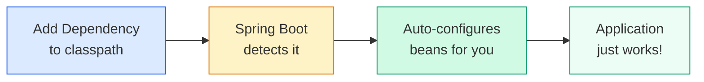
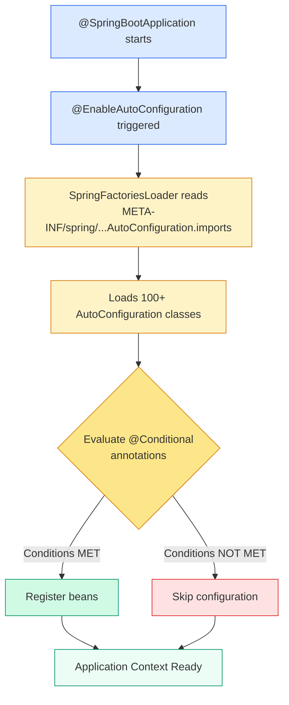
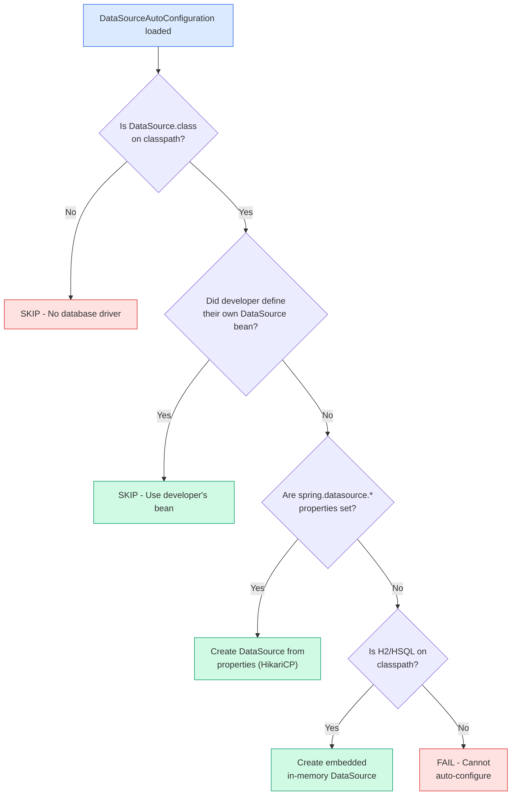

# ⚙️ Auto-Configuration

> **How Spring Boot magically configures your application — and how to control it.**



---

## 🧠 What is Auto-Configuration?

!!! abstract "In Simple Words"
    Auto-configuration is Spring Boot's ability to **automatically configure beans** based on what's on your classpath and what properties you've set — following the principle of **Convention over Configuration**.

Instead of writing dozens of XML files or `@Bean` definitions, Spring Boot says:

> "I see you added `spring-boot-starter-web` — you probably want an embedded Tomcat, a DispatcherServlet, and Jackson for JSON. Let me set all that up for you."

---

## 🔄 How Auto-Configuration Works Internally



### Step-by-Step Process

1. **`@EnableAutoConfiguration`** (part of `@SpringBootApplication`) kicks off the process
2. **`SpringFactoriesLoader`** reads the file `META-INF/spring/org.springframework.boot.autoconfigure.AutoConfiguration.imports`
3. Each listed class is a potential auto-configuration
4. Spring evaluates **`@Conditional`** annotations on each class
5. Only classes whose conditions are **all satisfied** get registered

---

## 🎯 The @Conditional Family

These annotations are the **gatekeepers** of auto-configuration. They decide whether a configuration class should be activated.

| Annotation | Condition |
|-----------|-----------|
| `@ConditionalOnClass` | Class exists on the classpath |
| `@ConditionalOnMissingClass` | Class does NOT exist on the classpath |
| `@ConditionalOnBean` | A specific bean already exists in context |
| `@ConditionalOnMissingBean` | A specific bean does NOT exist (most important!) |
| `@ConditionalOnProperty` | A property has a specific value |
| `@ConditionalOnExpression` | A SpEL expression evaluates to true |
| `@ConditionalOnWebApplication` | App is a web application |
| `@ConditionalOnNotWebApplication` | App is NOT a web application |
| `@ConditionalOnResource` | A specific resource exists on classpath |

---

## 📖 Case Study: DataSource Auto-Configuration

Let's trace how Spring Boot decides to configure a `DataSource`:



!!! tip "Key Principle: Your Beans Always Win"
    `@ConditionalOnMissingBean` ensures that if YOU define a bean, Spring Boot's auto-configuration **backs off**. Your explicit configuration always takes priority.

---

## 🔍 The Actual Source Code

Here's a simplified version of what `DataSourceAutoConfiguration` looks like:

```java
@AutoConfiguration
@ConditionalOnClass(DataSource.class)
@EnableConfigurationProperties(DataSourceProperties.class)
public class DataSourceAutoConfiguration {

    @Configuration
    @ConditionalOnMissingBean(DataSource.class) // Back off if user defined one
    @ConditionalOnProperty(name = "spring.datasource.url")
    static class PooledDataSourceConfiguration {

        @Bean
        public DataSource dataSource(DataSourceProperties properties) {
            return properties.initializeDataSourceBuilder()
                .type(HikariDataSource.class)
                .build();
        }
    }
}
```

---

## 🛠️ Creating Custom Auto-Configuration

### Step 1: Create the Configuration Class

```java
@AutoConfiguration
@ConditionalOnClass(MyLibrary.class)
@EnableConfigurationProperties(MyLibraryProperties.class)
public class MyLibraryAutoConfiguration {

    @Bean
    @ConditionalOnMissingBean
    public MyLibraryClient myLibraryClient(MyLibraryProperties properties) {
        return new MyLibraryClient(properties.getApiKey(), properties.getBaseUrl());
    }
}
```

### Step 2: Define Properties

```java
@ConfigurationProperties(prefix = "mylibrary")
public class MyLibraryProperties {
    private String apiKey;
    private String baseUrl = "https://api.mylibrary.com";

    // getters and setters
}
```

### Step 3: Register It

Create the file `src/main/resources/META-INF/spring/org.springframework.boot.autoconfigure.AutoConfiguration.imports`:

```text
com.example.MyLibraryAutoConfiguration
```

### Step 4: Users Just Add Properties

```yaml
mylibrary:
  api-key: my-secret-key
  base-url: https://custom.api.com
```

---

## 🐛 Debugging Auto-Configuration

### Using the --debug Flag

```bash
java -jar myapp.jar --debug
```

Or add to `application.properties`:

```properties
debug=true
```

This produces a **CONDITIONS EVALUATION REPORT** showing:

=== "Positive Matches (Configured)"

    ```text
    ============================
    CONDITIONS EVALUATION REPORT
    ============================

    Positive matches:
    -----------------
    DataSourceAutoConfiguration matched:
      - @ConditionalOnClass found required class 'javax.sql.DataSource'
      
    DataSourceAutoConfiguration.PooledDataSourceConfiguration matched:
      - @ConditionalOnMissingBean (types: javax.sql.DataSource) did not find any beans
    ```

=== "Negative Matches (Skipped)"

    ```text
    Negative matches:
    -----------------
    MongoAutoConfiguration:
      Did not match:
        - @ConditionalOnClass did not find required class 'com.mongodb.client.MongoClient'

    RedisAutoConfiguration:
      Did not match:
        - @ConditionalOnClass did not find required class 'org.springframework.data.redis.core.RedisOperations'
    ```

---

### Using Actuator Endpoint

```properties
management.endpoints.web.exposure.include=conditions
```

Then visit: `http://localhost:8080/actuator/conditions`

---

### Excluding Auto-Configurations

=== "Annotation-based"

    ```java
    @SpringBootApplication(exclude = {
        DataSourceAutoConfiguration.class,
        SecurityAutoConfiguration.class
    })
    public class MyApplication { }
    ```

=== "Property-based"

    ```properties
    spring.autoconfigure.exclude=\
      org.springframework.boot.autoconfigure.jdbc.DataSourceAutoConfiguration,\
      org.springframework.boot.autoconfigure.security.servlet.SecurityAutoConfiguration
    ```

---

## 📊 Auto-Configuration Order

!!! warning "Order Matters"
    Some auto-configurations depend on others. Use these annotations to control ordering:

| Annotation | Purpose |
|-----------|---------|
| `@AutoConfigureBefore` | Run before another auto-configuration |
| `@AutoConfigureAfter` | Run after another auto-configuration |
| `@AutoConfigureOrder` | Numeric ordering (lower = earlier) |

```java
@AutoConfiguration
@AutoConfigureAfter(DataSourceAutoConfiguration.class)
public class JpaAutoConfiguration { }
```

---

## 🎯 Interview Questions & Answers

??? question "1. What is Spring Boot Auto-Configuration?"
    Auto-configuration automatically configures Spring beans based on the dependencies on the classpath and properties you've set. It follows the Convention over Configuration principle — add a dependency, and Spring Boot configures it with sensible defaults.

??? question "2. How does @ConditionalOnMissingBean work?"
    It checks whether a bean of the specified type already exists in the application context. If it does, the auto-configured bean is **not** created. This ensures user-defined beans always take priority over auto-configured ones.

??? question "3. Where are auto-configuration classes registered?"
    In Spring Boot 3.x, they are listed in `META-INF/spring/org.springframework.boot.autoconfigure.AutoConfiguration.imports`. In older versions (2.x), they were in `META-INF/spring.factories` under the `EnableAutoConfiguration` key.

??? question "4. How can you disable a specific auto-configuration?"
    Use `@SpringBootApplication(exclude = {SomeAutoConfiguration.class})` or set `spring.autoconfigure.exclude` in `application.properties`.

??? question "5. How do you debug auto-configuration issues?"
    Run the app with `--debug` flag or set `debug=true` in properties. This prints a CONDITIONS EVALUATION REPORT showing which auto-configurations matched (and why) and which were skipped.

??? question "6. What is the difference between @Configuration and @AutoConfiguration?"
    `@AutoConfiguration` (Spring Boot 3+) is specifically for auto-configuration classes that are loaded via the imports file. It supports ordering annotations (`@AutoConfigureBefore/After`). `@Configuration` is for regular application configuration that is component-scanned.

??? question "7. Can you create your own auto-configuration?"
    Yes! Create a `@AutoConfiguration` class with `@Conditional` annotations, define your beans, and register the class in the `AutoConfiguration.imports` file. Package it as a library for others to use.
