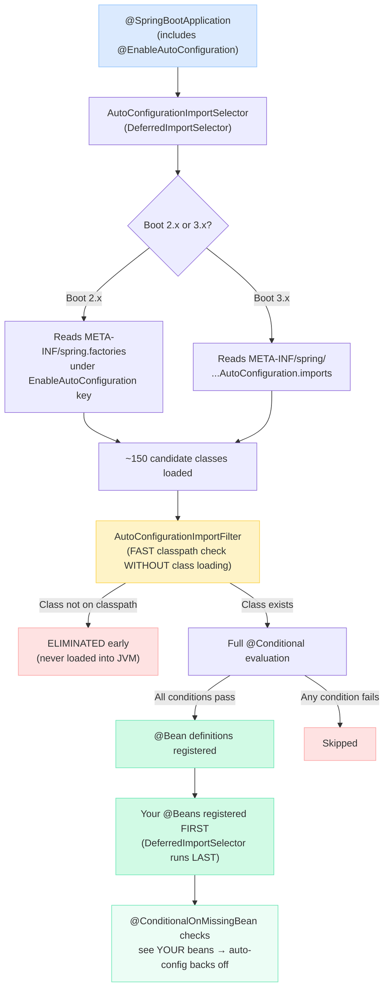
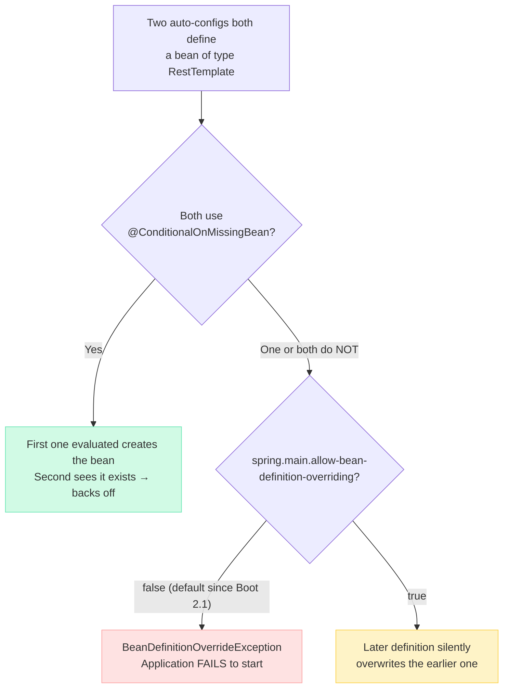

# Spring Boot Auto-Configuration

You add `spring-boot-starter-data-jpa` to your `pom.xml`, and suddenly you have a `DataSource`, an `EntityManagerFactory`, and transaction management — all without writing a single line of config. Magic? No. Here's exactly what happens under the hood, why it exists, and how to master it for interviews and production systems.

---

## The Problem Auto-Configuration Solves

!!! tip "💡 One-liner for interviews"
    Auto-configuration eliminates manual bean wiring by registering beans automatically based on what's on your classpath and what properties you've set — Convention over Configuration.

### BEFORE: The XML Dark Ages

This is what configuring JPA looked like in Spring 3.x. Every. Single. Microservice.

```xml
<!-- 50+ lines PER SERVICE just for database access -->
<bean id="dataSource" class="com.zaxxer.hikari.HikariDataSource">
    <property name="driverClassName" value="org.postgresql.Driver"/>
    <property name="jdbcUrl" value="jdbc:postgresql://localhost:5432/orders"/>
    <property name="username" value="admin"/>
    <property name="password" value="secret"/>
    <property name="maximumPoolSize" value="20"/>
    <property name="minimumIdle" value="5"/>
    <property name="connectionTimeout" value="30000"/>
</bean>

<bean id="entityManagerFactory"
      class="org.springframework.orm.jpa.LocalContainerEntityManagerFactoryBean">
    <property name="dataSource" ref="dataSource"/>
    <property name="packagesToScan" value="com.company.orders.entity"/>
    <property name="jpaVendorAdapter">
        <bean class="org.springframework.orm.jpa.vendor.HibernateJpaVendorAdapter">
            <property name="showSql" value="true"/>
            <property name="generateDdl" value="false"/>
            <property name="database" value="POSTGRESQL"/>
        </bean>
    </property>
    <property name="jpaProperties">
        <props>
            <prop key="hibernate.dialect">org.hibernate.dialect.PostgreSQLDialect</prop>
            <prop key="hibernate.hbm2ddl.auto">validate</prop>
            <prop key="hibernate.format_sql">true</prop>
            <prop key="hibernate.use_sql_comments">true</prop>
            <prop key="hibernate.jdbc.batch_size">25</prop>
        </props>
    </property>
</bean>

<bean id="transactionManager"
      class="org.springframework.orm.jpa.JpaTransactionManager">
    <property name="entityManagerFactory" ref="entityManagerFactory"/>
</bean>

<tx:annotation-driven transaction-manager="transactionManager"/>

<bean class="org.springframework.dao.annotation.PersistenceExceptionTranslationPostProcessor"/>
```

Multiply this by DataSource + JPA + Security + Web MVC + Jackson + Validation across 30 microservices. Teams spent days just on configuration.

### AFTER: Spring Boot Auto-Configuration

```yaml
# application.yml — that's it
spring:
  datasource:
    url: jdbc:postgresql://localhost:5432/orders
    username: admin
    password: secret
```

```java
@SpringBootApplication
public class OrderServiceApplication {
    public static void main(String[] args) {
        SpringApplication.run(OrderServiceApplication.class, args);
    }
}
```

Zero XML. Zero explicit bean definitions. Spring Boot sees Hibernate + PostgreSQL driver on the classpath, finds your `spring.datasource.*` properties, and wires up HikariCP DataSource + EntityManagerFactory + JpaTransactionManager + exception translation. Done.

!!! example "🎯 Interview Tip"
    When asked "What is auto-configuration?", don't just say "automatic bean creation." Say: "It's the mechanism that reads the classpath and property sources to conditionally register beans using the `@Conditional` family — implementing Convention over Configuration while guaranteeing that developer-defined beans always take priority via `@ConditionalOnMissingBean`."

---

## How It Works Internally — The Full Pipeline



### Step-by-Step Breakdown

#### Step 1: `@SpringBootApplication` includes `@EnableAutoConfiguration`

```java
@SpringBootApplication  // This is a composite annotation
// Equivalent to:
@SpringBootConfiguration
@EnableAutoConfiguration   // <-- THIS triggers auto-configuration
@ComponentScan(excludeFilters = { ... })
```

#### Step 2: `AutoConfigurationImportSelector` is triggered

`@EnableAutoConfiguration` imports `AutoConfigurationImportSelector`, which implements `DeferredImportSelector`. The "deferred" part is critical — it runs AFTER all your regular `@Configuration` classes have been processed. This is why your beans always win.

#### Step 3: Reading candidate class names

=== "Boot 3.x (Current)"

    File: `META-INF/spring/org.springframework.boot.autoconfigure.AutoConfiguration.imports`

    ```text
    org.springframework.boot.autoconfigure.jdbc.DataSourceAutoConfiguration
    org.springframework.boot.autoconfigure.orm.jpa.HibernateJpaAutoConfiguration
    org.springframework.boot.autoconfigure.jackson.JacksonAutoConfiguration
    org.springframework.boot.autoconfigure.web.servlet.WebMvcAutoConfiguration
    ```

    One fully-qualified class name per line. Clean, fast to parse.

=== "Boot 2.x (Legacy)"

    File: `META-INF/spring.factories`

    ```properties
    org.springframework.boot.autoconfigure.EnableAutoConfiguration=\
    org.springframework.boot.autoconfigure.jdbc.DataSourceAutoConfiguration,\
    org.springframework.boot.autoconfigure.orm.jpa.HibernateJpaAutoConfiguration,\
    org.springframework.boot.autoconfigure.jackson.JacksonAutoConfiguration
    ```

    Still works in Boot 3.x for backward compatibility, but deprecated.

#### Step 4: `AutoConfigurationImportFilter` FILTERS candidates WITHOUT loading classes

!!! danger "⚠️ What breaks"
    Without this filtering step, Spring Boot would load ~150 auto-configuration classes into the JVM on every startup — even classes for MongoDB, Cassandra, Elasticsearch, etc. that you'll never use. That means loading their bytecode, resolving their annotations, potentially triggering `ClassNotFoundException` for missing dependencies. Startup time would explode from 2 seconds to 15+ seconds.

The `AutoConfigurationImportFilter` interface has three implementations that run BEFORE class loading:

- `OnBeanCondition` — checks bean metadata
- `OnClassCondition` — checks if required classes exist on classpath using `ClassLoader.getResource()` (NOT `Class.forName()`)
- `OnWebApplicationCondition` — checks application type

These read annotation metadata from the class file without loading it into the JVM. Candidates that obviously won't match (e.g., `MongoAutoConfiguration` when MongoDB driver isn't present) get eliminated immediately.

**Performance impact**: In a typical web app with JPA, this step eliminates 80-100 candidates. That's 80-100 classes that never get loaded, never get their conditions evaluated, never consume memory.

#### Step 5: Remaining candidates have `@Conditional` annotations evaluated

For candidates that survived the filter, Spring now fully loads the class and evaluates every `@Conditional` annotation:

```java
@AutoConfiguration
@ConditionalOnClass(DataSource.class)                    // ✅ HikariCP is on classpath
@ConditionalOnProperty(name = "spring.datasource.url")   // ✅ Property exists
@EnableConfigurationProperties(DataSourceProperties.class)
public class DataSourceAutoConfiguration {

    @Bean
    @ConditionalOnMissingBean                            // ✅ No user-defined DataSource
    public DataSource dataSource(DataSourceProperties props) { ... }
}
```

#### Step 6: Passing configs register their `@Bean` definitions

Beans from auto-configurations that pass all conditions are registered in the `ApplicationContext`.

#### Step 7: Your beans take priority (`@ConditionalOnMissingBean`)

Because `AutoConfigurationImportSelector` is a `DeferredImportSelector`, all your `@Configuration` classes process first. By the time auto-configuration evaluates `@ConditionalOnMissingBean(DataSource.class)`, your custom `DataSource` bean is already in the registry. Auto-configuration sees it and backs off.

!!! question "❓ Counter-questions interviewers ask"
    **Q: "What if I define my bean in a `@Configuration` class but it still doesn't override the auto-configured one?"**
    
    A: Two common causes:  
    1. Your `@Configuration` class isn't being component-scanned (wrong package, not under the `@SpringBootApplication` class's package).  
    2. You're defining the bean with a different type. If auto-config checks `@ConditionalOnMissingBean(DataSource.class)` but you defined a `HikariDataSource` bean — it might still match because `HikariDataSource extends DataSource`, but check the exact type being checked.
    
    **Q: "Is the ordering of auto-configurations deterministic?"**
    
    A: No, not by default. The order candidates are read from the imports file is not guaranteed across JVM implementations. That's why `@AutoConfigureBefore`/`@AutoConfigureAfter` exist. Without them, you cannot rely on evaluation order.

---

## The @Conditional Family — With Real Scenarios

These annotations are the gatekeepers that make auto-configuration intelligent.

### Complete Reference with Production Scenarios

| Annotation | Real Scenario | What It Checks Internally |
|---|---|---|
| `@ConditionalOnClass` | `DataSourceAutoConfiguration` only activates if `javax.sql.DataSource` is on classpath | `ClassLoader.getResource()` — does NOT trigger class initialization |
| `@ConditionalOnMissingBean` | Only creates default `ObjectMapper` if you haven't defined your own | Scans `BeanFactory` registry for matching type/name |
| `@ConditionalOnProperty` | Enable scheduling only if `app.scheduling.enabled=true` | Checks `Environment` (properties, YAML, env vars) |
| `@ConditionalOnWebApplication` | `WebMvcAutoConfiguration` only for servlet-based apps, not CLI tools | Checks for `WebApplicationContext` or `ReactiveWebApplicationContext` |
| `@ConditionalOnBean` | `JpaRepositoriesAutoConfiguration` only if `EntityManagerFactory` exists | Scans `BeanFactory` — ORDER MATTERS |
| `@ConditionalOnMissingClass` | Fall back to simple connection pool if HikariCP is NOT on classpath | Inverse of `OnClassCondition` |
| `@ConditionalOnResource` | Load i18n config only if `messages.properties` exists | `ClassLoader.getResource()` for resource path |
| `@ConditionalOnSingleCandidate` | Configure JPA only if exactly one `DataSource` bean (or one `@Primary`) exists | Counts beans of type in registry |
| `@ConditionalOnExpression` | Enable feature if SpEL `#{${feature.enabled} && ${env} != 'test'}` is true | SpEL evaluation against Environment |

### Deep Dive: How Spring Boot Source Actually Uses Them

#### `@ConditionalOnClass` — DataSourceAutoConfiguration

From the actual Spring Boot source:

```java
// org.springframework.boot.autoconfigure.jdbc.DataSourceAutoConfiguration
@AutoConfiguration(before = SqlInitializationAutoConfiguration.class)
@ConditionalOnClass({ DataSource.class, EmbeddedDatabaseType.class })
@ConditionalOnMissingBean(type = "io.r2dbc.spi.ConnectionFactory")
@EnableConfigurationProperties(DataSourceProperties.class)
@Import({ DataSourcePoolMetadataProvidersConfiguration.class,
          DataSourceCheckpointRestoreConfiguration.class })
public class DataSourceAutoConfiguration {
    // Only runs if javax.sql.DataSource AND spring-jdbc are on classpath
    // AND no reactive R2DBC ConnectionFactory is defined
}
```

#### `@ConditionalOnMissingBean` — JacksonAutoConfiguration

```java
// org.springframework.boot.autoconfigure.jackson.JacksonAutoConfiguration
@AutoConfiguration
@ConditionalOnClass(ObjectMapper.class)
public class JacksonAutoConfiguration {

    @Bean
    @Primary
    @ConditionalOnMissingBean
    public ObjectMapper jacksonObjectMapper(Jackson2ObjectMapperBuilder builder) {
        return builder.createXmlMapper(false).build();
    }
    // If YOU define an ObjectMapper @Bean, this backs off completely
}
```

#### `@ConditionalOnProperty` — SchedulingAutoConfiguration

```java
// Scheduling only activates if explicitly enabled
@AutoConfiguration
@ConditionalOnClass({ EnableScheduling.class, ScheduledAnnotationBeanPostProcessor.class })
@ConditionalOnProperty(prefix = "spring.task.scheduling", name = "enabled",
                       havingValue = "true", matchIfMissing = true)
public class TaskSchedulingAutoConfiguration {
    // matchIfMissing = true means: enabled by default unless you set it to false
}
```

#### `@ConditionalOnWebApplication` — WebMvcAutoConfiguration

```java
@AutoConfiguration(after = { DispatcherServletAutoConfiguration.class,
                             TaskExecutionAutoConfiguration.class,
                             ValidationAutoConfiguration.class })
@ConditionalOnWebApplication(type = Type.SERVLET)
@ConditionalOnClass({ Servlet.class, DispatcherServlet.class, WebMvcConfigurer.class })
@ConditionalOnMissingBean(WebMvcConfigurationSupport.class)
public class WebMvcAutoConfiguration {
    // Only for servlet web apps — NOT reactive, NOT CLI
}
```

#### `@ConditionalOnBean` — JpaRepositoriesAutoConfiguration

```java
@AutoConfiguration
@ConditionalOnBean(DataSource.class)
@ConditionalOnClass(JpaRepository.class)
@ConditionalOnMissingBean({ JpaRepositoryFactoryBean.class,
                            JpaRepositoryConfigExtension.class })
@AutoConfigureAfter(HibernateJpaAutoConfiguration.class)  // <-- ORDER IS CRITICAL
public class JpaRepositoriesAutoConfiguration {
    // Without @AutoConfigureAfter, this might evaluate BEFORE DataSource exists
    // Then @ConditionalOnBean(DataSource.class) would FAIL silently
}
```

!!! danger "⚠️ What breaks"
    If you write `@ConditionalOnBean(SomeBean.class)` in your auto-configuration but forget `@AutoConfigureAfter(SomeBeanAutoConfiguration.class)`, your condition evaluates BEFORE `SomeBean` is registered. The condition fails silently. Your auto-configuration never activates. You spend 3 hours debugging why your beans don't exist. Always pair `@ConditionalOnBean` with explicit ordering.

---

## Building a Custom Starter — Full Production Example

**Scenario**: Your e-commerce company has an internal audit logging library. Every microservice needs to log who did what, when, to which entity. Instead of each team copy-pasting configuration, you build a starter.

### Project Structure

```
audit-spring-boot-starter/
├── audit-spring-boot-autoconfigure/
│   ├── src/main/java/com/company/audit/autoconfigure/
│   │   ├── AuditAutoConfiguration.java
│   │   ├── AuditProperties.java
│   │   ├── AuditService.java
│   │   ├── AuditEvent.java
│   │   └── AuditEventRepository.java
│   ├── src/main/resources/
│   │   └── META-INF/spring/
│   │       └── org.springframework.boot.autoconfigure.AutoConfiguration.imports
│   └── pom.xml
└── audit-spring-boot-starter/
    └── pom.xml  (just pulls in autoconfigure + audit-core library)
```

!!! example "🎯 Interview Tip"
    The two-module pattern (`-autoconfigure` + `-starter`) is the Spring Boot convention. The `-autoconfigure` module contains the actual logic. The `-starter` module is an empty POM that aggregates dependencies — making it easy for consumers: one dependency, everything works.

### AuditEvent — The Domain Object

```java
package com.company.audit.autoconfigure;

import java.time.Instant;
import java.util.Map;

public class AuditEvent {

    private final String principal;
    private final String action;
    private final String entityType;
    private final String entityId;
    private final Instant timestamp;
    private final Map<String, Object> metadata;

    private AuditEvent(Builder builder) {
        this.principal = builder.principal;
        this.action = builder.action;
        this.entityType = builder.entityType;
        this.entityId = builder.entityId;
        this.timestamp = builder.timestamp != null ? builder.timestamp : Instant.now();
        this.metadata = builder.metadata != null ? Map.copyOf(builder.metadata) : Map.of();
    }

    public static Builder builder() { return new Builder(); }

    // Getters
    public String getPrincipal() { return principal; }
    public String getAction() { return action; }
    public String getEntityType() { return entityType; }
    public String getEntityId() { return entityId; }
    public Instant getTimestamp() { return timestamp; }
    public Map<String, Object> getMetadata() { return metadata; }

    public static class Builder {
        private String principal;
        private String action;
        private String entityType;
        private String entityId;
        private Instant timestamp;
        private Map<String, Object> metadata;

        public Builder principal(String principal) { this.principal = principal; return this; }
        public Builder action(String action) { this.action = action; return this; }
        public Builder entityType(String entityType) { this.entityType = entityType; return this; }
        public Builder entityId(String entityId) { this.entityId = entityId; return this; }
        public Builder timestamp(Instant timestamp) { this.timestamp = timestamp; return this; }
        public Builder metadata(Map<String, Object> metadata) { this.metadata = metadata; return this; }
        public AuditEvent build() { return new AuditEvent(this); }
    }
}
```

### AuditEventRepository — Storage Abstraction

```java
package com.company.audit.autoconfigure;

import java.util.List;

public interface AuditEventRepository {

    void save(AuditEvent event);

    List<AuditEvent> findByPrincipal(String principal);

    List<AuditEvent> findByEntityTypeAndEntityId(String entityType, String entityId);
}
```

### AuditProperties — Externalized Configuration

```java
package com.company.audit.autoconfigure;

import org.springframework.boot.context.properties.ConfigurationProperties;

@ConfigurationProperties(prefix = "company.audit")
public class AuditProperties {

    /**
     * Enable or disable audit logging globally.
     */
    private boolean enabled = true;

    /**
     * Where to send audit events: "kafka", "database", "log"
     */
    private String destination = "kafka";

    /**
     * Kafka topic name when destination=kafka
     */
    private String kafkaTopic = "audit-events";

    /**
     * Include request metadata (IP, user-agent) in audit events
     */
    private boolean includeRequestMetadata = true;

    /**
     * Async processing — events are queued and sent in background
     */
    private boolean async = true;

    /**
     * Queue capacity for async processing
     */
    private int asyncQueueCapacity = 10_000;

    // Getters and Setters
    public boolean isEnabled() { return enabled; }
    public void setEnabled(boolean enabled) { this.enabled = enabled; }
    public String getDestination() { return destination; }
    public void setDestination(String destination) { this.destination = destination; }
    public String getKafkaTopic() { return kafkaTopic; }
    public void setKafkaTopic(String kafkaTopic) { this.kafkaTopic = kafkaTopic; }
    public boolean isIncludeRequestMetadata() { return includeRequestMetadata; }
    public void setIncludeRequestMetadata(boolean includeRequestMetadata) {
        this.includeRequestMetadata = includeRequestMetadata;
    }
    public boolean isAsync() { return async; }
    public void setAsync(boolean async) { this.async = async; }
    public int getAsyncQueueCapacity() { return asyncQueueCapacity; }
    public void setAsyncQueueCapacity(int asyncQueueCapacity) {
        this.asyncQueueCapacity = asyncQueueCapacity;
    }
}
```

### AuditService — The Core Service

```java
package com.company.audit.autoconfigure;

import org.slf4j.Logger;
import org.slf4j.LoggerFactory;

import java.util.concurrent.BlockingQueue;
import java.util.concurrent.LinkedBlockingQueue;
import java.util.concurrent.ExecutorService;
import java.util.concurrent.Executors;

public class AuditService {

    private static final Logger log = LoggerFactory.getLogger(AuditService.class);

    private final AuditEventRepository repository;
    private final AuditProperties properties;
    private final BlockingQueue<AuditEvent> eventQueue;
    private final ExecutorService executor;

    public AuditService(AuditEventRepository repository, AuditProperties properties) {
        this.repository = repository;
        this.properties = properties;

        if (properties.isAsync()) {
            this.eventQueue = new LinkedBlockingQueue<>(properties.getAsyncQueueCapacity());
            this.executor = Executors.newSingleThreadExecutor(r -> {
                Thread t = new Thread(r, "audit-worker");
                t.setDaemon(true);
                return t;
            });
            this.executor.submit(this::processQueue);
        } else {
            this.eventQueue = null;
            this.executor = null;
        }
    }

    public void audit(AuditEvent event) {
        if (!properties.isEnabled()) {
            return;
        }

        if (properties.isAsync()) {
            if (!eventQueue.offer(event)) {
                log.warn("Audit queue full, dropping event: {} {} {}",
                    event.getPrincipal(), event.getAction(), event.getEntityType());
            }
        } else {
            repository.save(event);
        }
    }

    private void processQueue() {
        while (!Thread.currentThread().isInterrupted()) {
            try {
                AuditEvent event = eventQueue.take();
                repository.save(event);
            } catch (InterruptedException e) {
                Thread.currentThread().interrupt();
                break;
            } catch (Exception e) {
                log.error("Failed to persist audit event", e);
            }
        }
    }

    public void shutdown() {
        if (executor != null) {
            executor.shutdownNow();
        }
    }
}
```

### AuditAutoConfiguration — The Auto-Configuration Class

```java
package com.company.audit.autoconfigure;

import org.springframework.boot.autoconfigure.AutoConfiguration;
import org.springframework.boot.autoconfigure.condition.ConditionalOnClass;
import org.springframework.boot.autoconfigure.condition.ConditionalOnMissingBean;
import org.springframework.boot.autoconfigure.condition.ConditionalOnProperty;
import org.springframework.boot.autoconfigure.condition.ConditionalOnBean;
import org.springframework.boot.context.properties.EnableConfigurationProperties;
import org.springframework.context.annotation.Bean;
import org.springframework.kafka.core.KafkaTemplate;

@AutoConfiguration
@ConditionalOnClass(AuditService.class)
@ConditionalOnProperty(prefix = "company.audit", name = "enabled",
                       havingValue = "true", matchIfMissing = true)
@EnableConfigurationProperties(AuditProperties.class)
public class AuditAutoConfiguration {

    /**
     * Default: Kafka-based repository when KafkaTemplate is available.
     */
    @Bean
    @ConditionalOnMissingBean(AuditEventRepository.class)
    @ConditionalOnBean(KafkaTemplate.class)
    @ConditionalOnProperty(prefix = "company.audit", name = "destination",
                           havingValue = "kafka", matchIfMissing = true)
    public AuditEventRepository kafkaAuditEventRepository(
            KafkaTemplate<String, Object> kafkaTemplate,
            AuditProperties properties) {
        return new KafkaAuditEventRepository(kafkaTemplate, properties.getKafkaTopic());
    }

    /**
     * Fallback: Log-based repository when Kafka is not available.
     */
    @Bean
    @ConditionalOnMissingBean(AuditEventRepository.class)
    public AuditEventRepository loggingAuditEventRepository() {
        return new LoggingAuditEventRepository();
    }

    /**
     * The main AuditService bean — backs off if user defines their own.
     */
    @Bean
    @ConditionalOnMissingBean
    public AuditService auditService(AuditEventRepository repository,
                                     AuditProperties properties) {
        return new AuditService(repository, properties);
    }
}
```

### The Imports File

`src/main/resources/META-INF/spring/org.springframework.boot.autoconfigure.AutoConfiguration.imports`:

```text
com.company.audit.autoconfigure.AuditAutoConfiguration
```

### Consumer Usage — Zero Configuration

```yaml
# application.yml in any microservice
company:
  audit:
    destination: kafka
    kafka-topic: order-audit-events
    async: true
    async-queue-capacity: 50000
```

```java
@RestController
@RequestMapping("/api/orders")
public class OrderController {

    private final OrderService orderService;
    private final AuditService auditService;  // Auto-injected from starter!

    public OrderController(OrderService orderService, AuditService auditService) {
        this.orderService = orderService;
        this.auditService = auditService;
    }

    @PostMapping
    public ResponseEntity<Order> createOrder(@RequestBody CreateOrderRequest request,
                                             @AuthenticationPrincipal UserDetails user) {
        Order order = orderService.create(request);

        auditService.audit(AuditEvent.builder()
            .principal(user.getUsername())
            .action("ORDER_CREATED")
            .entityType("Order")
            .entityId(order.getId().toString())
            .metadata(Map.of("amount", order.getTotalAmount(),
                             "items", order.getItems().size()))
            .build());

        return ResponseEntity.status(HttpStatus.CREATED).body(order);
    }
}
```

### Consumer Overrides Their Own AuditService

```java
@Configuration
public class CustomAuditConfig {

    @Bean
    public AuditService auditService(AuditEventRepository repository,
                                     AuditProperties properties) {
        // Custom implementation with encryption, PII masking, etc.
        return new EncryptedAuditService(repository, properties, encryptionKey());
    }
}
// Auto-configured AuditService backs off — @ConditionalOnMissingBean sees this bean
```

---

## Debugging Auto-Configuration

### The `--debug` Flag

```bash
java -jar myapp.jar --debug
# Or in application.properties: debug=true
```

Produces the **CONDITIONS EVALUATION REPORT**:

=== "Positive Matches (Activated)"

    ```text
    ============================
    CONDITIONS EVALUATION REPORT
    ============================

    Positive matches:
    -----------------

       DataSourceAutoConfiguration matched:
          - @ConditionalOnClass found required classes 'javax.sql.DataSource',
            'org.springframework.jdbc.datasource.embedded.EmbeddedDatabaseType'
            (OnClassCondition)
          - @ConditionalOnMissingBean (types: io.r2dbc.spi.ConnectionFactory;
            SearchStrategy: all) did not find any beans (OnBeanCondition)

       DataSourceAutoConfiguration.PooledDataSourceConfiguration matched:
          - AnyNestedCondition 1 matched 1 did not; NestedCondition on
            DataSourceAutoConfiguration.PooledDataSourceCondition.PooledDataSourceAvailable
            found required class (OnClassCondition)
          - @ConditionalOnMissingBean (types: javax.sql.DataSource,
            javax.sql.XADataSource) did not find any beans (OnBeanCondition)
    ```

=== "Negative Matches (Skipped)"

    ```text
    Negative matches:
    -----------------

       MongoAutoConfiguration:
          Did not match:
             - @ConditionalOnClass did not find required class
               'com.mongodb.client.MongoClient' (OnClassCondition)

       RedisAutoConfiguration:
          Did not match:
             - @ConditionalOnClass did not find required class
               'org.springframework.data.redis.core.RedisOperations' (OnClassCondition)

       CassandraAutoConfiguration:
          Did not match:
             - @ConditionalOnClass did not find required class
               'com.datastax.oss.driver.api.core.CqlSession' (OnClassCondition)
    ```

=== "Exclusions"

    ```text
    Exclusions:
    -----------

       org.springframework.boot.autoconfigure.security.servlet.SecurityAutoConfiguration

    Unconditional classes:
    ----------------------

       org.springframework.boot.autoconfigure.context.ConfigurationPropertiesAutoConfiguration
       org.springframework.boot.autoconfigure.context.LifecycleAutoConfiguration
    ```

### ConditionEvaluationReport — Programmatic Access

```java
@Component
public class AutoConfigDebugger implements ApplicationRunner {

    private final ConfigurableApplicationContext context;

    public AutoConfigDebugger(ConfigurableApplicationContext context) {
        this.context = context;
    }

    @Override
    public void run(ApplicationArguments args) {
        ConditionEvaluationReport report = ConditionEvaluationReport
            .get(context.getBeanFactory());

        // Find why a specific auto-configuration was skipped
        report.getConditionAndOutcomesBySource().forEach((source, outcomes) -> {
            if (source.contains("AuditAutoConfiguration")) {
                System.out.println("=== " + source + " ===");
                outcomes.forEach(conditionAndOutcome ->
                    System.out.println("  " + conditionAndOutcome.getCondition().getClass().getSimpleName()
                        + ": " + conditionAndOutcome.getOutcome().getMessage())
                );
            }
        });
    }
}
```

### Actuator `/conditions` Endpoint

```properties
management.endpoints.web.exposure.include=conditions
```

```bash
curl http://localhost:8080/actuator/conditions | jq '.contexts.application.positiveMatches'
```

Returns structured JSON — great for automated health checks in CI/CD.

### Real Debugging Scenario: "My custom ObjectMapper isn't being used"

!!! danger "⚠️ What breaks"
    **Symptom**: You defined a custom `ObjectMapper` with snake_case naming, but the API still returns camelCase.

    **Investigation**:
    ```bash
    java -jar myapp.jar --debug 2>&1 | grep -A5 "JacksonAutoConfiguration"
    ```

    **Root cause**: Your `ObjectMapper` bean is defined in `com.company.config.JacksonConfig` but your `@SpringBootApplication` is in `com.company.api`. The config class is NOT under the application's package, so it's never component-scanned. The auto-configured `ObjectMapper` wins.

    **Fix**: Move `JacksonConfig` under `com.company.api.config`, or add `@ComponentScan("com.company.config")`.

---

## Auto-Configuration Ordering

### Why Ordering Matters

Auto-configurations don't run in a predictable order by default. If `SecurityAutoConfiguration` evaluates before `DataSourceAutoConfiguration`, and your security config needs a DataSource (for JDBC-backed user storage), `@ConditionalOnBean(DataSource.class)` fails silently.

### The Ordering Annotations

| Annotation | Purpose | Example |
|---|---|---|
| `@AutoConfigureBefore(X.class)` | Run this BEFORE X | Your custom DataSource config before JPA |
| `@AutoConfigureAfter(X.class)` | Run this AFTER X | Security after DataSource |
| `@AutoConfigureOrder(int)` | Absolute ordering (lower = earlier) | Infrastructure configs get low values |

### Boot 3.x: The `@AutoConfiguration` Attribute

```java
// Old way (Boot 2.x)
@AutoConfiguration
@AutoConfigureAfter(DataSourceAutoConfiguration.class)
@AutoConfigureBefore(FlywayAutoConfiguration.class)
public class JpaAutoConfiguration { }

// New way (Boot 3.x) — cleaner, all in one annotation
@AutoConfiguration(
    after = DataSourceAutoConfiguration.class,
    before = FlywayAutoConfiguration.class
)
public class JpaAutoConfiguration { }
```

### Real Scenario: Security Config Must Run After DataSource

```java
@AutoConfiguration(after = DataSourceAutoConfiguration.class)
@ConditionalOnClass({ DataSource.class, AuthenticationManager.class })
@ConditionalOnBean(DataSource.class)
public class JdbcSecurityAutoConfiguration {

    @Bean
    @ConditionalOnMissingBean
    public UserDetailsService jdbcUserDetailsService(DataSource dataSource) {
        JdbcUserDetailsManager manager = new JdbcUserDetailsManager(dataSource);
        manager.setUsersByUsernameQuery(
            "SELECT username, password, enabled FROM users WHERE username = ?");
        return manager;
    }
}
```

Without `after = DataSourceAutoConfiguration.class`, the `@ConditionalOnBean(DataSource.class)` check might evaluate before the DataSource bean exists, and the entire security auto-configuration silently disappears.

!!! tip "💡 One-liner for interviews"
    "Ordering annotations only work between auto-configuration classes. They have NO effect on regular `@Configuration` classes. Use `@DependsOn` or `@Order` for those."

---

## Excluding Auto-Configurations

### When to Exclude

- A transitive dependency pulled in `spring-security-web` but you don't want Security auto-configured
- You need a different DataSource implementation (e.g., JNDI lookup in app server)
- Integration tests that should skip heavy auto-configs for speed
- Conflicting auto-configurations from two starters

### Three Ways to Exclude

=== "Annotation (compile-time safety)"

    ```java
    @SpringBootApplication(exclude = {
        DataSourceAutoConfiguration.class,
        SecurityAutoConfiguration.class,
        UserDetailsServiceAutoConfiguration.class
    })
    public class MyApplication {
        public static void main(String[] args) {
            SpringApplication.run(MyApplication.class, args);
        }
    }
    ```

=== "Property (no compile dependency needed)"

    ```properties
    # application.properties
    spring.autoconfigure.exclude=\
      org.springframework.boot.autoconfigure.jdbc.DataSourceAutoConfiguration,\
      org.springframework.boot.autoconfigure.security.servlet.SecurityAutoConfiguration
    ```

    Best for environment-specific exclusions (via profiles).

=== "By class name string (no import needed)"

    ```java
    @SpringBootApplication(excludeName = {
        "org.springframework.boot.autoconfigure.jdbc.DataSourceAutoConfiguration"
    })
    public class MyApplication { }
    ```

    Useful when you don't have a compile-time dependency on the auto-config class.

!!! question "❓ Counter-questions interviewers ask"
    **Q: "What happens if you exclude an auto-configuration that another auto-configuration depends on?"**
    
    A: Spring Boot doesn't enforce dependencies between auto-configurations. If you exclude `DataSourceAutoConfiguration`, then `JpaAutoConfiguration` will fail its `@ConditionalOnBean(DataSource.class)` check and silently skip. No error — but JPA won't work. The `--debug` report will show why.

---

## What Happens When Two Auto-Configs Define the Same Bean?



!!! danger "⚠️ What breaks"
    **Production failure**: Team A adds `company-metrics-starter` and Team B adds `company-tracing-starter`. Both define a `RestTemplate` bean without `@ConditionalOnMissingBean`. Application fails with `BeanDefinitionOverrideException` on deploy.  
    
    **Fix**: File a bug against the starter that's missing `@ConditionalOnMissingBean`. As a workaround, exclude one: `spring.autoconfigure.exclude=com.company.tracing.TracingAutoConfiguration`.  
    
    **Never** set `spring.main.allow-bean-definition-overriding=true` in production. It hides real conflicts and makes debugging a nightmare.

---

## `@Configuration` vs `@AutoConfiguration` — A Critical Distinction

| Aspect | `@Configuration` | `@AutoConfiguration` |
|---|---|---|
| How it's discovered | Component scanning | Imports file (META-INF/spring/...) |
| When it's processed | During initial context refresh | AFTER all `@Configuration` classes (deferred) |
| Supports `@AutoConfigureBefore/After` | No | Yes |
| Should be component-scanned | Yes | Never — causes duplicate registration |
| Use case | Application-level config | Library/starter config |
| Introduced in | Spring Framework 1.0 | Spring Boot 2.7 / 3.0 |

!!! tip "💡 One-liner for interviews"
    "`@AutoConfiguration` runs in a separate, later phase after all user `@Configuration` classes. This guarantees user beans are registered first, so `@ConditionalOnMissingBean` can see them."

---

## Interview Questions and Answers — 12 Deep Questions with Follow-up Chains

??? question "1. What is auto-configuration and what problem does it solve?"
    **Answer**: Auto-configuration automatically registers beans based on classpath contents and property values. It implements Convention over Configuration.

    **The problem**: Without it, every Spring app needed 50-100 lines of explicit configuration for each infrastructure concern (DataSource, JPA, Security, MVC, Jackson, etc.). Across 30 microservices, that's thousands of lines of boilerplate XML/Java config that's identical across services.

    **Follow-up: "How does it differ from @ComponentScan?"**  
    `@ComponentScan` finds YOUR classes annotated with `@Component/@Service/@Repository`. Auto-configuration creates beans from LIBRARY code that you didn't write, based on classpath detection.

    **Follow-up: "Can auto-configuration create beans that @ComponentScan already found?"**  
    No — the standard pattern is `@ConditionalOnMissingBean`. If component scanning already registered a bean of that type, auto-configuration sees it and backs off. Your beans always win.

??? question "2. Walk me through the entire auto-configuration lifecycle from app startup."
    **Answer** (step by step):

    1. `SpringApplication.run()` creates an `ApplicationContext`
    2. `@SpringBootApplication` includes `@EnableAutoConfiguration`
    3. `@EnableAutoConfiguration` imports `AutoConfigurationImportSelector`
    4. The selector implements `DeferredImportSelector` — meaning it runs LAST, after all regular configs
    5. It reads candidate class names from `META-INF/spring/org.springframework.boot.autoconfigure.AutoConfiguration.imports`
    6. `AutoConfigurationImportFilter` does a FAST pre-filter: checks if required classes exist on classpath WITHOUT loading the auto-config class (performance optimization)
    7. Surviving candidates are fully loaded and their `@Conditional` annotations are evaluated
    8. Only classes where ALL conditions pass register their `@Bean` definitions
    9. `@AutoConfigureBefore/After` controls the evaluation order among auto-configs

    **Follow-up: "Why is DeferredImportSelector important?"**  
    Because it guarantees all user `@Configuration` classes process first. When auto-configuration evaluates `@ConditionalOnMissingBean`, your beans are already in the registry. Without deferral, ordering would be non-deterministic and your overrides might not work.

    **Follow-up: "What's the performance impact of 150+ candidates?"**  
    The `AutoConfigurationImportFilter` step eliminates ~80% of candidates without class loading. A typical Spring Boot web+JPA app evaluates only 30-40 auto-configurations, not 150. This is why startup time is 2-3 seconds, not 15.

??? question "3. What is @ConditionalOnMissingBean and why is it the most important annotation?"
    **Answer**: It means "only create this bean if no bean of this type already exists in the ApplicationContext." It's what makes auto-configuration NON-invasive — your explicit `@Bean` definitions always take priority.

    **Example**:
    ```java
    @Bean
    @ConditionalOnMissingBean
    public ObjectMapper objectMapper() { ... }
    ```
    If you define your own `ObjectMapper` anywhere in your app, this auto-configured one disappears.

    **Follow-up: "What happens if @ConditionalOnMissingBean evaluates too early?"**  
    If evaluated before your `@Configuration` class is processed, it won't see your bean. It creates the auto-configured one. Then your bean also registers. If bean overriding is disabled (default since Boot 2.1), you get `BeanDefinitionOverrideException`. This is why `DeferredImportSelector` exists — to ensure user beans register first.

    **Follow-up: "Can you use @ConditionalOnMissingBean with a name instead of type?"**  
    Yes: `@ConditionalOnMissingBean(name = "customDataSource")`. But type-based is preferred because it's refactoring-safe.

??? question "4. Difference between @Configuration and @AutoConfiguration?"
    **Answer**:

    - `@Configuration`: discovered by `@ComponentScan`, processed in the initial phase, for YOUR application's beans
    - `@AutoConfiguration`: discovered by the imports file, processed in a DEFERRED phase (after all `@Configuration`), for LIBRARY beans, supports `@AutoConfigureBefore/After` ordering

    **Follow-up: "What happens if you put @AutoConfiguration in a package that gets component-scanned?"**  
    Double registration. The class is processed once by component scanning (in the initial phase) AND once by the auto-configuration mechanism (in the deferred phase). This causes `BeanDefinitionOverrideException` or duplicate bean definitions. Auto-configuration classes must live in packages NOT scanned by the consumer's `@ComponentScan`.

    **Follow-up: "Is @AutoConfiguration annotated with @Configuration?"**  
    Yes — `@AutoConfiguration` is meta-annotated with `@Configuration(proxyBeanMethods = false)`. The `proxyBeanMethods = false` is a performance optimization for auto-configurations (no CGLIB proxy needed).

??? question "5. How do AutoConfigurationImportFilters differ from @Conditional annotations?"
    **Answer**: Filters are a PERFORMANCE OPTIMIZATION that eliminates candidates BEFORE loading their class bytecode.

    - `AutoConfigurationImportFilter`: reads annotation metadata from the class file (using ASM bytecode reading) WITHOUT calling `Class.forName()`. Runs before the class is loaded into the JVM. Only three conditions can be checked this way: `OnClassCondition`, `OnBeanCondition`, `OnWebApplicationCondition`.
    - `@Conditional` annotations: evaluated AFTER the class is fully loaded into the JVM. Can check anything (properties, expressions, SpEL, custom conditions).

    **Follow-up: "Why not do ALL conditions as filters?"**  
    Filters can only check things that are knowable from metadata alone (class existence, annotation attributes). They can't evaluate SpEL expressions, check property values with complex logic, or inspect the bean factory state. The two-phase approach (fast filter + full evaluation) is a trade-off between speed and expressiveness.

    **Follow-up: "What's the actual performance impact?"**  
    In a typical app, the filter phase eliminates 80-100 of ~150 candidates in <10ms. Without filtering, loading those 80-100 classes and evaluating their conditions would add 500ms-2s to startup.

??? question "6. How do you debug why an auto-configuration didn't activate?"
    **Answer** (priority order):

    1. **`--debug` flag**: prints CONDITIONS EVALUATION REPORT showing exactly which condition failed and why
    2. **`/actuator/conditions`**: JSON endpoint — great for running applications
    3. **`ConditionEvaluationReport`**: programmatic access in tests
    4. **IDE**: IntelliJ shows "Spring Boot auto-configuration" annotations in the gutter

    **Real debugging scenario**:
    ```
    Problem: Added spring-boot-starter-data-redis but RedisTemplate bean doesn't exist.
    Step 1: --debug shows "RedisAutoConfiguration matched" ✓
    Step 2: But "RedisAutoConfiguration.RedisConfiguration" shows negative match:
            "@ConditionalOnMissingBean did not find any beans of type RedisConnectionFactory"
    Step 3: Wait — RedisConnectionFactory is created by LettuceConnectionConfiguration
    Step 4: LettuceConnectionConfiguration has @ConditionalOnClass(RedisClient.class)
    Step 5: Check dependencies — missing io.lettuce:lettuce-core!
    Fix: Add lettuce-core dependency (or use spring-boot-starter-data-redis which includes it)
    ```

    **Follow-up: "How would you debug this in a test?"**  
    ```java
    @SpringBootTest
    class RedisConfigTest {
        @Autowired
        private ApplicationContext context;

        @Test
        void redisAutoConfigShouldActivate() {
            ConditionEvaluationReport report = ConditionEvaluationReport
                .get(((ConfigurableApplicationContext) context).getBeanFactory());
            // Assert specific conditions matched
        }
    }
    ```

??? question "7. You wrote a custom starter but it's not being picked up. What do you check?"
    **Answer** (debugging checklist):

    1. **File path**: Must be exactly `META-INF/spring/org.springframework.boot.autoconfigure.AutoConfiguration.imports` — one wrong character and it's silently ignored
    2. **FQCN in the file**: Full package + class name, no typos. Verify with `jar tf my-starter.jar | grep AutoConfiguration`
    3. **JAR on classpath**: Is the dependency actually resolved? Check `mvn dependency:tree`
    4. **`@ConditionalOnClass` references**: Is the class it checks actually on the classpath of the CONSUMING app?
    5. **`@ConditionalOnProperty`**: Is the required property set? Check `matchIfMissing` attribute
    6. **Run with `--debug`**: Search for your class name in both Positive and Negative matches. If it's not in either section, the file wasn't found
    7. **Package conflict**: Is your auto-configuration class in a package that the consumer's `@ComponentScan` covers? If yes, it might be getting processed as a regular config, not an auto-config

    **Follow-up: "What if it's in negative matches?"**  
    The report tells you exactly which condition failed. Common: `@ConditionalOnClass did not find required class 'X'` means X isn't on the classpath. Or `@ConditionalOnProperty(company.audit.enabled) did not find property` means the property is missing and `matchIfMissing` is false.

??? question "8. What is the two-module starter convention and why does it exist?"
    **Answer**: The convention is:

    - `my-spring-boot-autoconfigure`: Contains auto-configuration classes, properties, conditions
    - `my-spring-boot-starter`: An empty POM that depends on `autoconfigure` + the actual library

    **Why two modules?**

    1. **Optional dependencies**: The autoconfigure module can declare dependencies as `<optional>true</optional>`. This means users only pull in what they need.
    2. **Clean consumer experience**: Users add ONE dependency (the starter), and everything works. They don't need to know about autoconfigure internals.
    3. **Testability**: The autoconfigure module can be tested independently of the library it configures.

    **Follow-up: "Can I just use one module?"**  
    Yes, for company-internal starters, a single module is fine. The two-module pattern is the Spring Boot team's convention for open-source starters where optional dependencies matter. For your internal audit starter, one module that's both starter and autoconfigure works.

??? question "9. Explain @ConditionalOnProperty with matchIfMissing."
    **Answer**:
    ```java
    @ConditionalOnProperty(prefix = "company.audit", name = "enabled",
                           havingValue = "true", matchIfMissing = true)
    ```

    This means:
    - If `company.audit.enabled=true` in any property source → activate
    - If `company.audit.enabled` is NOT defined anywhere → activate (matchIfMissing = true)
    - If `company.audit.enabled=false` → do NOT activate

    **Pattern**: Use `matchIfMissing = true` for "enabled by default" features. Use `matchIfMissing = false` (default) for opt-in features.

    **Follow-up: "What property sources does it check?"**  
    All of them in priority order: command-line args > system properties > environment variables > application.properties/yml > default properties. The `Environment` abstraction handles this.

    **Follow-up: "Can you use @ConditionalOnProperty without havingValue?"**  
    Yes — without `havingValue`, it just checks if the property EXISTS and is not "false". `@ConditionalOnProperty(name = "feature.x")` activates if `feature.x` is set to any value except "false".

??? question "10. How does bean definition overriding work since Spring Boot 2.1?"
    **Answer**:

    - **Before 2.1**: Bean overriding was allowed by default. If two beans of the same name were defined, the later one silently replaced the first. This caused subtle, hard-to-debug issues.
    - **Since 2.1**: `spring.main.allow-bean-definition-overriding=false` is the default. Attempting to register two beans with the same name throws `BeanDefinitionOverrideException`.

    **Why this matters for auto-configuration**:
    If an auto-configuration defines a bean WITHOUT `@ConditionalOnMissingBean`, and you also define the same bean, you get an exception. This is actually a GOOD thing — it forces the auto-configuration author to fix their code.

    **Follow-up: "Should I ever set allow-bean-definition-overriding=true?"**  
    Almost never in production. The only legitimate use case: you're using a third-party starter with a bug (missing `@ConditionalOnMissingBean`), you've filed the bug, and you need a temporary workaround. Always add a comment explaining WHY and a TODO to remove it.

??? question "11. What's the difference between spring.factories and the AutoConfiguration.imports file?"
    **Answer**:

    | Aspect | `spring.factories` (Boot 2.x) | `.imports` file (Boot 3.x) |
    |---|---|---|
    | Format | Properties file (key=value,value) | One FQCN per line |
    | Scope | Multi-purpose (listeners, initializers, etc.) | Auto-configuration only |
    | Parsing speed | Slower (parse all keys, find ours, split commas) | Faster (line-by-line read) |
    | Backward compat | Still works in Boot 3.x | N/A in Boot 2.x |

    `spring.factories` is still used in Boot 3.x for NON-auto-configuration extension points: `ApplicationListener`, `EnvironmentPostProcessor`, `AutoConfigurationImportFilter`. Only the auto-configuration registration moved to the new file.

    **Follow-up: "What happens if both files declare the same auto-configuration?"**  
    It's deduplicated. The class is registered once. But you should only use one mechanism — the imports file for Boot 3.x.

??? question "12. How would you design an auto-configuration that supports multiple implementations?"
    **Answer**: Use conditional cascading — multiple `@Bean` methods with different conditions, most specific first.

    **Example**: An auto-configuration for caching that supports Redis, Caffeine, or simple Map-based cache:

    ```java
    @AutoConfiguration
    @ConditionalOnClass(CacheManager.class)
    @ConditionalOnProperty(prefix = "app.cache", name = "enabled",
                           havingValue = "true", matchIfMissing = true)
    public class CacheAutoConfiguration {

        @Bean
        @ConditionalOnMissingBean(CacheManager.class)
        @ConditionalOnClass(name = "org.springframework.data.redis.cache.RedisCacheManager")
        @ConditionalOnBean(RedisConnectionFactory.class)
        public CacheManager redisCacheManager(RedisConnectionFactory cf) {
            return RedisCacheManager.builder(cf).build();
        }

        @Bean
        @ConditionalOnMissingBean(CacheManager.class)
        @ConditionalOnClass(name = "com.github.benmanes.caffeine.cache.Caffeine")
        public CacheManager caffeineCacheManager() {
            return new CaffeineCacheManager();
        }

        @Bean
        @ConditionalOnMissingBean(CacheManager.class)
        public CacheManager simpleCacheManager() {
            return new ConcurrentMapCacheManager();
        }
    }
    ```

    **Key design principles**:
    1. Most specific/performant option first (Redis)
    2. Each `@Bean` has `@ConditionalOnMissingBean` so the first match wins
    3. A fallback with no special conditions catches the "nothing else available" case
    4. User can always define their own `CacheManager` and everything backs off

    **Follow-up: "What if the user wants Redis AND Caffeine (multi-level cache)?"**  
    They define their own `CacheManager` bean (e.g., `CompositeCacheManager`). All auto-configured options back off due to `@ConditionalOnMissingBean(CacheManager.class)`.

---

## Common Interview Traps and Production Failures

!!! danger "⚠️ What breaks"
    **Trap 1: "Two auto-configs define the same bean type"**

    Since Boot 2.1, bean definition overriding is disabled by default. If two starters both define a `RestTemplate` bean without `@ConditionalOnMissingBean`, your app fails to start with `BeanDefinitionOverrideException`. 
    
    Fix: Exclude one auto-configuration, or file a bug against the starter missing `@ConditionalOnMissingBean`.

    ---

    **Trap 2: "My bean is being ignored even though I defined it"**

    Your `@Configuration` class is in `com.company.util`, but `@SpringBootApplication` is in `com.company.api`. Component scanning only covers `com.company.api` and sub-packages. Your config is never found. The auto-configured bean wins.

    ---

    **Trap 3: "I set a property but auto-config doesn't see it"**

    Your `application.yml` has a typo: `spring.datasource.ur1` (number 1, not letter l). Auto-config looks for `spring.datasource.url`, doesn't find it, and falls back to embedded H2 (or fails entirely). YAML doesn't validate property names.

    ---

    **Trap 4: "Test context loads the full auto-configuration even with @MockBean"**

    `@MockBean` replaces a bean AFTER auto-configuration has already evaluated conditions. If auto-config's condition was `@ConditionalOnBean(UserRepository.class)` and you mock it, the condition might have already been evaluated. Use `@TestConfiguration` + explicit bean definitions, or `@ImportAutoConfiguration` to control which auto-configs load.

    ---

    **Trap 5: "@ComponentScan in a starter causes chaos"**

    A third-party starter has `@ComponentScan("com.thirdparty")` in their auto-config. But their package structure overlaps with yours (`com.thirdparty.util` finds your classes). Suddenly their starter creates beans from YOUR internal classes. Never use `@ComponentScan` in a starter.

---

## Gotchas Quick Reference

| Mistake | Consequence | Fix |
|---|---|---|
| Missing `@ConditionalOnMissingBean` in starter | Users cannot override your beans | Always add it to every `@Bean` method |
| `@ComponentScan` in auto-configuration | Scans consumer's packages, creates unexpected beans | Use explicit `@Bean` methods only |
| Wrong imports file name | Auto-config silently ignored — no error, no warning | Must be exactly `org.springframework.boot.autoconfigure.AutoConfiguration.imports` |
| Auto-config class in consumer's scanned package | Double registration → duplicate beans or override exception | Use a separate, non-scanned package |
| `@ConditionalOnBean` without `@AutoConfigureAfter` | Condition evaluates before target bean exists, always false | Always pair with ordering |
| `@AutoConfigureOrder` on regular `@Configuration` | No effect — only orders auto-configs relative to each other | Use `@Order` for regular configs |
| `matchIfMissing = false` on opt-out feature | Feature never activates unless user explicitly sets the property | Use `matchIfMissing = true` for defaults |
| Testing with `@SpringBootTest` + many starters | Full auto-configuration loads, test is slow | Use `@ImportAutoConfiguration` or slice tests (`@WebMvcTest`, `@DataJpaTest`) |

---

## Quick Reference Card

| Task | How |
|---|---|
| Exclude an auto-config | `@SpringBootApplication(exclude = X.class)` or `spring.autoconfigure.exclude` |
| Debug which configs activated | `--debug` flag or `GET /actuator/conditions` |
| Control ordering between auto-configs | `@AutoConfiguration(after = X.class, before = Y.class)` |
| Let users override your bean | `@ConditionalOnMissingBean` on your `@Bean` method |
| Register your auto-config (Boot 3.x) | Add FQCN to `META-INF/spring/org.springframework.boot.autoconfigure.AutoConfiguration.imports` |
| Enable feature by default, allow opt-out | `@ConditionalOnProperty(name = "x", havingValue = "true", matchIfMissing = true)` |
| Check why a condition failed programmatically | `ConditionEvaluationReport.get(beanFactory)` |
| Only activate for web apps | `@ConditionalOnWebApplication(type = Type.SERVLET)` |
| Only activate if specific bean exists | `@ConditionalOnBean(X.class)` + `@AutoConfigureAfter(XAutoConfig.class)` |
| Create a two-module starter | `-autoconfigure` (logic) + `-starter` (dependency aggregation POM) |
