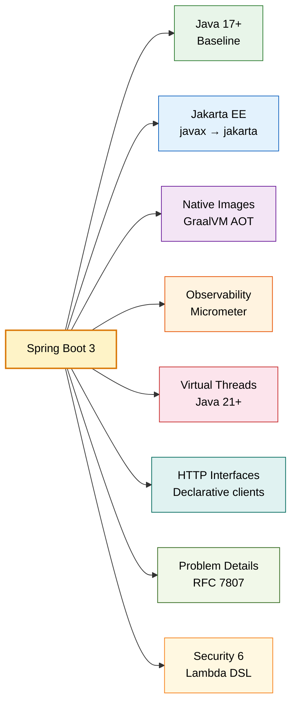
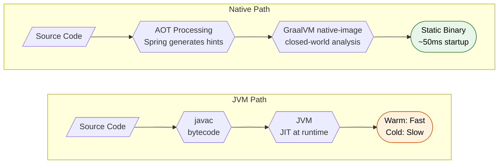
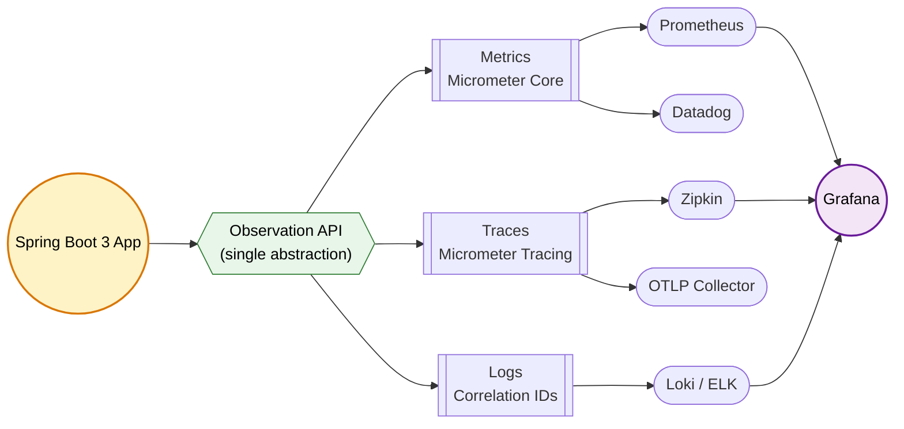
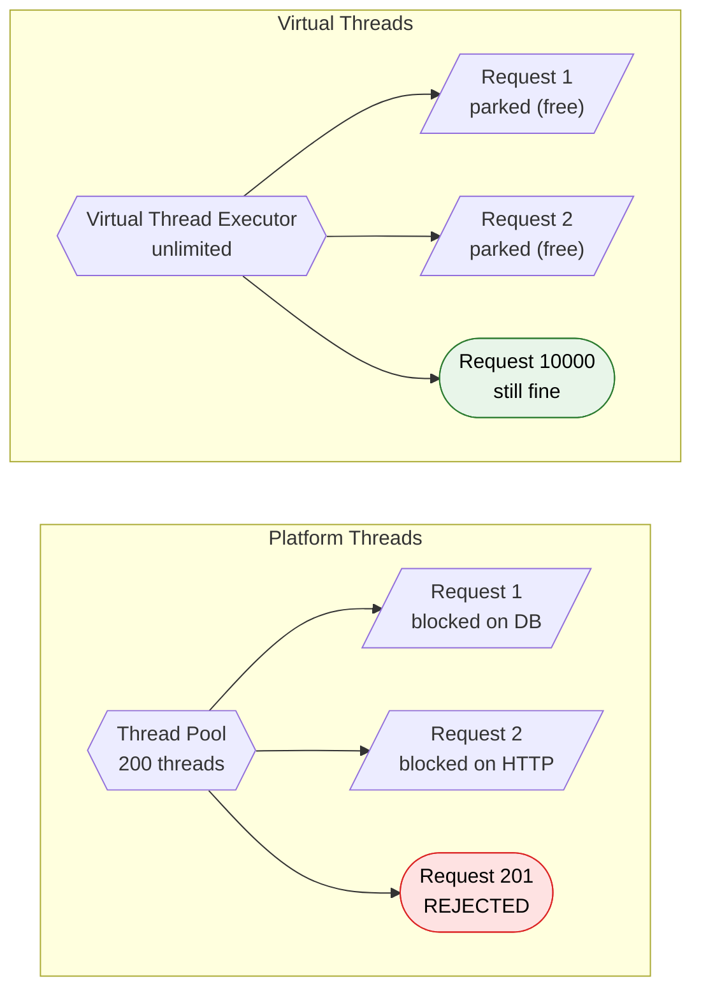

# Spring Boot 3 & Spring Framework 6

> The biggest Spring upgrade in a decade. Java 17 minimum, Jakarta EE namespace, native images, observability baked in, virtual threads.

---



---

## Java 17 Baseline

Spring Boot 3 requires Java 17 minimum. No negotiation. This unlocks language features that Spring itself now uses internally.

### Records as DTOs

```java
// Immutable, concise, works with Jackson out of the box
public record CreateOrderRequest(
    @NotBlank String customerId,
    @NotEmpty List<LineItem> items,
    @Positive BigDecimal total
) {}

// Spring MVC binds directly to records
@PostMapping("/orders")
public ResponseEntity<Order> create(@Valid @RequestBody CreateOrderRequest req) {
    return ResponseEntity.ok(orderService.create(req));
}
```

Records also work with Spring Data projections:

```java
public interface OrderRepository extends JpaRepository<Order, Long> {
    // Spring Data creates the record for you
    List<OrderSummary> findByCustomerId(String customerId);
}

public record OrderSummary(Long id, BigDecimal total, LocalDateTime createdAt) {}
```

### Sealed Classes for Domain Modeling

```java
public sealed interface PaymentResult permits PaymentSuccess, PaymentFailed, PaymentPending {
}

public record PaymentSuccess(String transactionId, Instant settledAt) implements PaymentResult {}
public record PaymentFailed(String errorCode, String reason) implements PaymentResult {}
public record PaymentPending(String redirectUrl) implements PaymentResult {}

// Pattern matching in service layer (Java 21)
public String describeResult(PaymentResult result) {
    return switch (result) {
        case PaymentSuccess s -> "Settled: " + s.transactionId();
        case PaymentFailed f -> "Failed: " + f.reason();
        case PaymentPending p -> "Redirect to: " + p.redirectUrl();
    };
}
```

### Pattern Matching instanceof

```java
// Old way — cast after check
if (event instanceof OrderCreatedEvent) {
    OrderCreatedEvent oce = (OrderCreatedEvent) event;
    process(oce.orderId());
}

// Java 17+ — binding variable in one shot
if (event instanceof OrderCreatedEvent oce) {
    process(oce.orderId());
}
```

### Text Blocks in Spring

```java
@Query("""
    SELECT o FROM Order o
    JOIN FETCH o.items i
    WHERE o.status = :status
      AND o.createdAt > :since
    ORDER BY o.createdAt DESC
    """)
List<Order> findRecentByStatus(@Param("status") OrderStatus status,
                               @Param("since") LocalDateTime since);
```

!!! warning "No more Java 8 or 11"
    Your CI, Docker base images, and all transitive dependencies must support Java 17+. Libraries like Lombok, MapStruct, and Liquibase had breaking changes during this transition.

---

## Jakarta EE Migration (javax to jakarta)

The single biggest breaking change. Oracle transferred Java EE to Eclipse Foundation. Eclipse cannot use the `javax` trademark. Every `javax.*` EE package became `jakarta.*`.

### What Moved

| Old (javax) | New (jakarta) | Impact |
|-------------|---------------|--------|
| `javax.persistence.*` | `jakarta.persistence.*` | Every JPA entity, repository |
| `javax.servlet.*` | `jakarta.servlet.*` | Filters, listeners, request/response |
| `javax.validation.*` | `jakarta.validation.*` | All bean validation annotations |
| `javax.annotation.*` | `jakarta.annotation.*` | `@PostConstruct`, `@PreDestroy` |
| `javax.transaction.*` | `jakarta.transaction.*` | `@Transactional` from JTA |
| `javax.websocket.*` | `jakarta.websocket.*` | WebSocket endpoints |
| `javax.mail.*` | `jakarta.mail.*` | Email sending |

### What Did NOT Move

These stay as `javax.*` because they are part of Java SE, not Java EE:

- `javax.crypto.*` (JCE — part of JDK)
- `javax.net.ssl.*` (JSSE — part of JDK)
- `javax.sql.DataSource` (part of JDK)
- `javax.swing.*` (part of JDK)

!!! danger "The Sneaky Breakages"
    - Third-party libraries shipping old `javax` APIs (older Hibernate, older Flyway, older Swagger/SpringFox)
    - XML configs with `javax.persistence` property names
    - `persistence.xml` referencing old package names
    - Serialized objects with `javax` class names (deserialization fails silently)

### Migration Tools

```bash
# IntelliJ: Refactor → Migrate Packages and Classes → Jakarta EE
# OpenRewrite (automated, handles edge cases)
./mvnw -U org.openrewrite.maven:rewrite-maven-plugin:run \
  -Drewrite.recipeArtifactCoordinates=org.openrewrite.recipe:rewrite-migrate-java:LATEST \
  -Drewrite.activeRecipes=org.openrewrite.java.migrate.jakarta.JavaxMigrationToJakarta
```

!!! tip "OpenRewrite over sed"
    Don't use `sed` for this migration. OpenRewrite understands AST, handles import organization, and catches things like string literals referencing old packages.

---

## GraalVM Native Images

Spring Boot 3 supports ahead-of-time (AOT) compilation to produce standalone native executables via GraalVM.



### How Spring AOT Works

1. **Build-time bean processing** — Spring resolves the entire `ApplicationContext` at build time
2. **Code generation** — Generates Java source for bean definitions (no reflection at runtime)
3. **Hint generation** — Creates `reflect-config.json`, `resource-config.json`, etc. for GraalVM
4. **Closed-world assumption** — Everything reachable must be known at compile time

### Comparison

| | JVM | Native Image |
|---|---|---|
| Startup | 2-5 seconds | 30-100 ms |
| Memory (RSS) | 200-500 MB | 50-100 MB |
| Peak throughput | Higher (JIT optimizes hot paths) | ~15-20% lower |
| Build time | Seconds | 3-10 minutes |
| Debugging | Full support | Limited |
| Best for | Long-running services, complex apps | Serverless, CLIs, sidecar containers |

### Building

```bash
# Maven
./mvnw -Pnative native:compile

# Gradle
./gradlew nativeCompile

# Buildpacks (no local GraalVM needed)
./mvnw spring-boot:build-image -Pnative
```

### Limitations and Gotchas

!!! danger "What Breaks in Native"
    - **Reflection** — Must be declared in hints. `@ConditionalOnClass` won't work dynamically.
    - **Dynamic proxies** — Must be pre-declared. CGLIB proxies not supported (interface-based only).
    - **Classpath scanning at runtime** — Impossible. Everything resolved at build time.
    - **`@Profile` changes at runtime** — Profiles are baked in at compile time.
    - **Serialization** — Classes must be registered.
    - **Resource loading** — Only pre-declared resources are included in the binary.

```java
// Register reflection hints for classes GraalVM can't discover
@RegisterReflectionForBinding({Order.class, OrderLineItem.class})
@Configuration
public class NativeHints {}

// Or use RuntimeHintsRegistrar for complex cases
public class MyHints implements RuntimeHintsRegistrar {
    @Override
    public void registerHints(RuntimeHints hints, ClassLoader classLoader) {
        hints.reflection().registerType(MyEntity.class, MemberCategory.values());
        hints.resources().registerPattern("templates/*.html");
    }
}
```

---

## Observability (Micrometer + Tracing)

Spring Boot 3 unifies metrics, tracing, and logging under the Micrometer Observation API. No more separate Spring Cloud Sleuth dependency.



### Dependencies

```xml
<!-- Core observation + tracing with OpenTelemetry bridge -->
<dependency>
    <groupId>io.micrometer</groupId>
    <artifactId>micrometer-tracing-bridge-otel</artifactId>
</dependency>
<dependency>
    <groupId>io.opentelemetry</groupId>
    <artifactId>opentelemetry-exporter-otlp</artifactId>
</dependency>
```

### Configuration

```yaml
management:
  tracing:
    sampling:
      probability: 1.0  # 100% in dev, lower in prod
  endpoints:
    web:
      exposure:
        include: health,info,metrics,prometheus
  metrics:
    distribution:
      percentiles-histogram:
        http.server.requests: true
    tags:
      application: ${spring.application.name}
```

### Custom Observations

```java
@Service
@RequiredArgsConstructor
public class PaymentService {
    private final ObservationRegistry registry;

    public PaymentResult processPayment(PaymentRequest req) {
        return Observation.createNotStarted("payment.process", registry)
            .lowCardinalityKeyValue("payment.method", req.method().name())
            .highCardinalityKeyValue("payment.id", req.id())
            .observe(() -> doProcess(req));
        // Automatically records: timer metric + trace span + log correlation
    }
}
```

### Structured Logging (Spring Boot 3.4+)

```yaml
# application.yml
logging:
  structured:
    format:
      console: ecs  # Elastic Common Schema
      # or: logfmt, gelf
```

Output:

```json
{"@timestamp":"2024-03-15T10:23:45Z","log.level":"INFO","message":"Order created",
 "trace.id":"abc123","span.id":"def456","service.name":"order-service"}
```

!!! info "Sleuth is Dead"
    Spring Cloud Sleuth is not compatible with Spring Boot 3. Replace with `micrometer-tracing-bridge-otel` or `micrometer-tracing-bridge-brave`. The Observation API replaces all Sleuth instrumentation.

---

## HTTP Interfaces (@HttpExchange)

Declarative HTTP clients, built into Spring. No Feign dependency. Works with `RestClient` (blocking) or `WebClient` (reactive).

```java
@HttpExchange("/api/v1/users")
public interface UserServiceClient {

    @GetExchange
    List<UserDTO> findAll();

    @GetExchange("/{id}")
    UserDTO findById(@PathVariable Long id);

    @PostExchange
    UserDTO create(@RequestBody CreateUserRequest request);

    @PutExchange("/{id}")
    UserDTO update(@PathVariable Long id, @RequestBody UpdateUserRequest request);

    @DeleteExchange("/{id}")
    @ResponseStatus(HttpStatus.NO_CONTENT)
    void delete(@PathVariable Long id);

    // Supports headers, query params, reactive types
    @GetExchange("/search")
    List<UserDTO> search(@RequestParam String query,
                         @RequestHeader("X-Tenant-Id") String tenantId);
}
```

### Wiring It Up

```java
@Configuration
public class HttpClientConfig {

    @Bean
    UserServiceClient userServiceClient(RestClient.Builder builder) {
        RestClient client = builder
            .baseUrl("http://user-service:8080")
            .defaultHeader("X-Api-Key", "secret")
            .requestInterceptor(new LoggingInterceptor())
            .build();

        return HttpServiceProxyFactory
            .builderFor(RestClientAdapter.create(client))
            .build()
            .createClient(UserServiceClient.class);
    }
}
```

!!! tip "RestClient vs WebClient"
    Use `RestClient` (Spring Boot 3.2+) for blocking calls. Use `WebClient` only if you actually need reactive streams. `RestClient` has the same fluent API but simpler mental model.

!!! warning "Error Handling"
    Default behavior throws `HttpClientErrorException` on 4xx/5xx. Add a `defaultStatusHandler()` on the `RestClient` to customize. The `@HttpExchange` interface itself has no error handling hooks.

---

## Problem Details (RFC 7807)

Spring Boot 3 natively produces RFC 7807 responses for errors. No extra setup for default behavior.

### Enabling

```java
// Enable globally via property
// spring.mvc.problemdetails.enabled=true

// Or extend ResponseEntityExceptionHandler (auto-enables it)
@RestControllerAdvice
public class GlobalExceptionHandler extends ResponseEntityExceptionHandler {

    @ExceptionHandler(OrderNotFoundException.class)
    public ProblemDetail handleOrderNotFound(OrderNotFoundException ex) {
        ProblemDetail pd = ProblemDetail.forStatusAndDetail(
            HttpStatus.NOT_FOUND, ex.getMessage());
        pd.setTitle("Order Not Found");
        pd.setType(URI.create("https://api.example.com/errors/order-not-found"));
        pd.setProperty("orderId", ex.getOrderId());
        pd.setProperty("timestamp", Instant.now());
        return pd;
    }

    @ExceptionHandler(InsufficientBalanceException.class)
    public ProblemDetail handleInsufficientBalance(InsufficientBalanceException ex) {
        ProblemDetail pd = ProblemDetail.forStatusAndDetail(
            HttpStatus.UNPROCESSABLE_ENTITY, "Not enough funds");
        pd.setTitle("Insufficient Balance");
        pd.setProperty("currentBalance", ex.getCurrentBalance());
        pd.setProperty("requiredAmount", ex.getRequiredAmount());
        return pd;
    }
}
```

### Response

```json
{
  "type": "https://api.example.com/errors/order-not-found",
  "title": "Order Not Found",
  "status": 404,
  "detail": "Order with ID ORD-9923 does not exist",
  "instance": "/api/orders/ORD-9923",
  "orderId": "ORD-9923",
  "timestamp": "2024-03-15T10:23:45Z"
}
```

Content-Type is `application/problem+json` automatically.

---

## Spring Security 6 Changes

Major API overhaul. Old imperative style is removed, not just deprecated.

### Lambda DSL (Required)

```java
// REMOVED in Spring Security 6 — won't compile
http.authorizeRequests()
    .antMatchers("/admin/**").hasRole("ADMIN")
    .anyRequest().authenticated()
    .and()
    .formLogin();

// Required style now
@Bean
public SecurityFilterChain filterChain(HttpSecurity http) throws Exception {
    http
        .authorizeHttpRequests(auth -> auth
            .requestMatchers("/admin/**").hasRole("ADMIN")
            .requestMatchers("/api/public/**").permitAll()
            .anyRequest().authenticated()
        )
        .oauth2ResourceServer(oauth2 -> oauth2
            .jwt(jwt -> jwt.jwtAuthenticationConverter(jwtConverter()))
        )
        .sessionManagement(session -> session
            .sessionCreationPolicy(SessionCreationPolicy.STATELESS)
        )
        .csrf(csrf -> csrf.disable());

    return http.build();
}
```

### Key Changes

| Spring Security 5 | Spring Security 6 |
|---|---|
| `antMatchers()` | `requestMatchers()` |
| `mvcMatchers()` | `requestMatchers()` (auto-detects MVC) |
| `authorizeRequests()` | `authorizeHttpRequests()` |
| `.and()` chaining | Lambda DSL (no `.and()`) |
| `WebSecurityConfigurerAdapter` | `SecurityFilterChain` bean |
| `@EnableGlobalMethodSecurity` | `@EnableMethodSecurity` |

### Method Security

```java
@EnableMethodSecurity // replaces @EnableGlobalMethodSecurity
@Configuration
public class MethodSecurityConfig {}

@Service
public class OrderService {
    
    @PreAuthorize("hasRole('ADMIN') or #order.customerId == authentication.name")
    public void cancelOrder(Order order) { /* ... */ }
    
    @PostAuthorize("returnObject.customerId == authentication.name")
    public Order getOrder(Long id) { /* ... */ }
}
```

!!! danger "requestMatchers Pitfall"
    In Spring Boot 3, if you have Spring MVC on the classpath, `requestMatchers()` uses `MvcRequestMatcher` by default. If you don't have MVC (e.g., WebFlux), it uses `AntPathRequestMatcher`. Mixing them up causes silent 403s.

---

## Virtual Threads (Project Loom, Spring Boot 3.2+)

One config property to switch your entire servlet-based app from platform thread pools to virtual threads.

```yaml
spring:
  threads:
    virtual:
      enabled: true
```

That is it. Tomcat/Jetty will create a virtual thread per request instead of pulling from a fixed thread pool.



### How It Works

- Virtual threads are **mounted** on carrier (platform) threads
- When a virtual thread hits a blocking call (`Thread.sleep`, `Socket.read`, `Lock.lock`), it **unmounts** — the carrier thread is freed
- Millions of virtual threads can exist simultaneously, consuming only ~1 KB of stack each

### Gotchas

!!! warning "Pinning"
    A virtual thread gets **pinned** to its carrier (cannot unmount) when:
    
    - Inside a `synchronized` block doing I/O (use `ReentrantLock` instead)
    - During native method calls
    
    Pinning wastes carrier threads and destroys the throughput benefit.
    
    Detect pinning: `-Djdk.tracePinnedThreads=short`

!!! warning "ThreadLocal Abuse"
    Virtual threads are cheap to create. Caching expensive objects in `ThreadLocal` (like `SimpleDateFormat` or connection pools per thread) will explode memory when you have 100k+ virtual threads. Use `ScopedValue` (preview) or shared pools instead.

### When NOT to Use Virtual Threads

- CPU-bound workloads (compression, encryption, ML inference) — platform threads are better
- If your code relies heavily on `synchronized` with I/O inside
- Libraries with thread-affinity assumptions (some connection pools, JDBC drivers with thread-local state)

---

## Migration Guide: Spring Boot 2.x to 3.x

### Step-by-Step

```mermaid
flowchart LR
    A(["1. Upgrade to Spring Boot 2.7\n(bridge release)"]) --> B{{"2. Upgrade to Java 17"}}
    B --> C{{"3. Fix deprecations from 2.7"}}
    C --> D{{"4. javax → jakarta\n(OpenRewrite)"}}
    D --> E(["5. Upgrade to Spring Boot 3.0"])
    E --> F{{"6. Fix Security config\n(Lambda DSL)"}}
    F --> G{{"7. Update third-party libs"}}
    G --> H(["8. Test everything"])

    style A fill:#E3F2FD,stroke:#1565C0,color:#000
    style E fill:#FEF3C7,stroke:#D97706,color:#000
    style H fill:#E8F5E9,stroke:#2E7D32,color:#000
```



### Detailed Steps

**Step 1: Upgrade to Spring Boot 2.7 first**

- 2.7 introduced deprecation warnings for everything removed in 3.0
- `spring.factories` auto-configuration → `META-INF/spring/org.springframework.boot.autoconfigure.AutoConfiguration.imports`
- `WebSecurityConfigurerAdapter` → `SecurityFilterChain` bean

**Step 2: Java 17 minimum**

```xml
<properties>
    <java.version>17</java.version>
</properties>
```

**Step 3: Fix 2.7 deprecations**

Run your app and look for deprecation warnings. Fix them all BEFORE upgrading to 3.0.

**Step 4: Namespace migration**

```bash
# Use OpenRewrite
./mvnw -U org.openrewrite.maven:rewrite-maven-plugin:run \
  -Drewrite.recipeArtifactCoordinates=org.openrewrite.recipe:rewrite-migrate-java:LATEST \
  -Drewrite.activeRecipes=org.openrewrite.java.migrate.jakarta.JavaxMigrationToJakarta
```

**Step 5: Bump Spring Boot version**

```xml
<parent>
    <groupId>org.springframework.boot</groupId>
    <artifactId>spring-boot-starter-parent</artifactId>
    <version>3.3.5</version>
</parent>
```

**Step 6: Fix Spring Security**

- `antMatchers` → `requestMatchers`
- `authorizeRequests` → `authorizeHttpRequests`
- Remove `.and()` chains, use lambdas

**Step 7: Third-party library compatibility**

| Library | Minimum Version for SB3 |
|---------|------------------------|
| Hibernate | 6.1+ |
| Flyway | 9.0+ |
| Liquibase | 4.17+ |
| Lombok | 1.18.30+ |
| MapStruct | 1.5.5+ |
| SpringDoc OpenAPI | 2.0+ (not springfox!) |
| Querydsl | 5.0.0+ (jakarta classifier) |

!!! danger "SpringFox is Dead"
    SpringFox (Swagger UI) is abandoned and incompatible with Spring Boot 3. Migrate to **SpringDoc OpenAPI 2.x**.

**Step 8: Testing**

```bash
# Run with debug to see auto-config report
java -jar app.jar --debug

# Check for reflection issues (native image prep)
./mvnw -Pnative spring-boot:process-aot
```

### Common Pitfalls

| Pitfall | Solution |
|---------|----------|
| `ClassNotFoundException: javax.servlet.Filter` | Missed javax→jakarta in a filter |
| `NoSuchMethodError` in Hibernate | Need Hibernate 6.x (shipped with SB3) |
| Tests fail with Security 403 | `@WithMockUser` still works, but `requestMatchers` logic changed |
| `spring.factories` ignored | Move to `AutoConfiguration.imports` file |
| Actuator path changed | `/actuator/env` requires explicit exposure in 3.x |
| `HttpStatus` moved | `org.springframework.http.HttpStatus` (same), but check framework HTTP classes |

---

## Version-by-Version Features

### Spring Boot 3.0 (Nov 2022)

- Java 17 baseline
- Jakarta EE 9+ (jakarta namespace)
- GraalVM native image support
- Micrometer Observation API
- Problem Details (RFC 7807)
- HTTP interface clients (`@HttpExchange`)
- `META-INF/spring/org.springframework.boot.autoconfigure.AutoConfiguration.imports`

### Spring Boot 3.1 (May 2023)

- **Docker Compose support** — `spring-boot-docker-compose` auto-starts containers from `compose.yml`
- **Testcontainers at dev time** — `@ServiceConnection` for zero-config test containers
- **SSL bundle abstraction** — `spring.ssl.bundle.*` for unified TLS config
- Auto-config for `spring.security.oauth2.authorizationserver`

```java
// Testcontainers with @ServiceConnection — no more manual URL config
@TestConfiguration(proxyBeanMethods = false)
public class TestContainersConfig {
    @Bean
    @ServiceConnection
    PostgreSQLContainer<?> postgres() {
        return new PostgreSQLContainer<>("postgres:16-alpine");
    }
}
```

### Spring Boot 3.2 (Nov 2023)

- **Virtual threads support** — `spring.threads.virtual.enabled=true`
- **RestClient** — new synchronous HTTP client replacing `RestTemplate`
- **JdbcClient** — fluent API for JDBC
- **Improved GraalVM support** — fewer manual hints needed
- Initial support for CRaC (Coordinated Restore at Checkpoint)

```java
// JdbcClient — cleaner than JdbcTemplate
@Repository
@RequiredArgsConstructor
public class OrderRepository {
    private final JdbcClient jdbc;

    public Optional<Order> findById(Long id) {
        return jdbc.sql("SELECT * FROM orders WHERE id = :id")
            .param("id", id)
            .query(Order.class)
            .optional();
    }

    public List<Order> findByStatus(OrderStatus status) {
        return jdbc.sql("SELECT * FROM orders WHERE status = :status")
            .param("status", status.name())
            .query(Order.class)
            .list();
    }
}
```

### Spring Boot 3.3 (May 2024)

- **CDS (Class Data Sharing)** support for faster JVM startup
- **Structured logging** preparations
- Improved `@HttpExchange` error handling
- `spring-boot-docker-compose` improvements (profiles, readiness)
- Base64 resources support in configuration

### Spring Boot 3.4 (Nov 2024)

- **Structured logging** — `logging.structured.format.console=ecs|logfmt|gelf`
- **Fallback beans** — `@Fallback` annotation for conditional bean registration
- `@MockitoBean` / `@MockitoSpyBean` — replaces `@MockBean` (moved to Spring Framework)
- Enhanced application properties binding
- `RestClient` improvements (request attributes, exchange strategies)

```java
// @Fallback — bean only used if no other bean of same type exists
@Configuration
public class CacheConfig {
    @Bean
    @Fallback
    CacheManager defaultCacheManager() {
        return new ConcurrentMapCacheManager(); // used only if Redis/Caffeine not configured
    }
}
```

### Spring Boot 3.5+ (2025)

- Continued CRaC improvements
- Deeper virtual threads integration
- More AOT / native image optimizations
- Project Leyden exploration (JVM-level AOT)

---

## Real-World Configuration Example

```yaml
# application.yml for a production Spring Boot 3.3+ service
spring:
  application:
    name: order-service
  threads:
    virtual:
      enabled: true
  datasource:
    url: jdbc:postgresql://${DB_HOST:localhost}:5432/orders
    hikari:
      maximum-pool-size: 20
      connection-timeout: 5000
  jpa:
    open-in-view: false  # always disable this
    properties:
      hibernate:
        jdbc.batch_size: 25
        order_inserts: true

management:
  tracing:
    sampling:
      probability: 0.1  # 10% in prod
  endpoints:
    web:
      exposure:
        include: health,info,metrics,prometheus
  endpoint:
    health:
      show-details: when-authorized
  metrics:
    tags:
      application: ${spring.application.name}
      env: ${ENVIRONMENT:local}

logging:
  structured:
    format:
      console: ecs
  level:
    org.springframework.web: INFO
    org.hibernate.SQL: DEBUG

server:
  shutdown: graceful
  tomcat:
    keep-alive-timeout: 60s

spring.lifecycle:
  timeout-per-shutdown-phase: 30s
```

---

## Interview Questions

??? question "1. What are the major changes in Spring Boot 3 compared to 2.x?"
    Java 17 baseline (records, sealed classes, pattern matching), Jakarta EE namespace (`javax` to `jakarta`), GraalVM native image support via AOT compilation, Micrometer Observation API for unified observability (replaces Sleuth), HTTP interface clients (`@HttpExchange`), Problem Details RFC 7807, Spring Security Lambda DSL requirement, and `AutoConfiguration.imports` replacing `spring.factories`.

??? question "2. Why did the javax to jakarta migration happen, and what does NOT change?"
    Oracle donated Java EE to Eclipse Foundation but retained the `javax` trademark. Eclipse renamed to Jakarta EE under `jakarta.*`. Things that stay `javax`: anything in Java SE (crypto, net.ssl, sql.DataSource, swing). Only EE packages moved.

??? question "3. How does GraalVM native image compilation work with Spring Boot 3?"
    Spring's AOT engine processes the `ApplicationContext` at build time, generating Java source files for bean definitions (no reflection), and producing GraalVM hint files (reflect-config.json, resource-config.json). GraalVM then performs closed-world analysis — it includes only reachable code in the final binary. Result: 50ms startup, 50MB memory, but slower build and no dynamic class loading.

??? question "4. What are the limitations of native images?"
    No runtime reflection without hints, no CGLIB proxies (interface-based only), no dynamic classpath scanning, profiles baked in at compile time, serialization requires registration, slow build times (3-10 min), lower peak throughput vs JIT, and limited debugging. Libraries using reflection heavily (some ORMs, serialization frameworks) need additional configuration.

??? question "5. How does the Micrometer Observation API unify metrics, traces, and logs?"
    A single `Observation` object emits a timer metric, a trace span, and a correlated log entry simultaneously. When you wrap code in `Observation.observe()`, all three signals share the same context (trace ID, span ID, tags). This replaces the separate Sleuth + Micrometer setup from Boot 2.x.

??? question "6. What is the difference between RestTemplate, WebClient, and RestClient?"
    `RestTemplate` — legacy synchronous client, maintenance mode. `WebClient` — reactive (non-blocking), requires reactive stack understanding, returns `Mono`/`Flux`. `RestClient` (Spring Boot 3.2+) — modern synchronous client with fluent API, supports interceptors, request factories. Use `RestClient` for blocking apps, `WebClient` only when you genuinely need reactive streams.

??? question "7. How do virtual threads work, and what is pinning?"
    Virtual threads are lightweight threads managed by the JVM. They mount on carrier (OS) threads and unmount when hitting blocking I/O — freeing the carrier for other virtual threads. Pinning occurs when a virtual thread cannot unmount (inside `synchronized` blocks with I/O, or native calls), effectively wasting a carrier thread. Fix: replace `synchronized` with `ReentrantLock`.

??? question "8. What changed in Spring Security 6 configuration?"
    `WebSecurityConfigurerAdapter` removed entirely. Must use `SecurityFilterChain` beans. `antMatchers()`/`mvcMatchers()` replaced by `requestMatchers()`. `authorizeRequests()` replaced by `authorizeHttpRequests()`. `.and()` chaining removed in favor of Lambda DSL. `@EnableGlobalMethodSecurity` replaced by `@EnableMethodSecurity`.

??? question "9. What is the correct migration path from Spring Boot 2.x to 3.x?"
    Upgrade to 2.7 first (bridge release with deprecation warnings), fix all deprecations, upgrade to Java 17, run OpenRewrite for javax-to-jakarta migration, bump to Spring Boot 3.x, fix Security Lambda DSL, update third-party libraries (Hibernate 6, Flyway 9, SpringDoc 2.x), then test with `--debug` flag for auto-configuration verification.

??? question "10. How does @HttpExchange differ from OpenFeign?"
    `@HttpExchange` is built into Spring Framework — no extra dependency. Works with `RestClient` (blocking) or `WebClient` (reactive). Feign requires `spring-cloud-openfeign` and has its own error handling/retry model. `@HttpExchange` integrates natively with Micrometer observations and Spring's `RestClient` interceptor chain.

??? question "11. Explain Problem Details (RFC 7807) support in Spring Boot 3."
    Spring Boot 3 can return standardized error responses with `application/problem+json` content type. Enable via `spring.mvc.problemdetails.enabled=true` or by extending `ResponseEntityExceptionHandler`. The `ProblemDetail` class supports type URI, title, status, detail, instance, and custom extension properties. All built-in Spring MVC exceptions automatically produce RFC 7807 responses when enabled.

??? question "12. What is the difference between AOT processing and native image compilation?"
    AOT processing is Spring's build-time step that resolves beans, generates code (eliminating reflection), and produces GraalVM hints. Native image compilation is GraalVM's step that takes all that generated code and produces a static binary via closed-world analysis. You can use AOT processing alone (for faster JVM startup) without producing a native image.

??? question "13. How does Spring Boot 3.1's Docker Compose support work?"
    Add `spring-boot-docker-compose` dependency. Spring Boot auto-discovers `compose.yml`, starts containers before the app, maps container ports to Spring properties (e.g., Postgres port → `spring.datasource.url`), and stops containers on shutdown. Uses `@ServiceConnection` annotation for type-safe container-to-property mapping.

??? question "14. When should you NOT use virtual threads?"
    CPU-bound workloads (no blocking I/O to unmount on), code with heavy `synchronized` blocks around I/O (causes pinning), libraries with thread-affinity assumptions, scenarios with extensive `ThreadLocal` usage (millions of virtual threads = millions of ThreadLocal copies = OOM), and when peak throughput matters more than concurrency (platform threads + JIT still faster for CPU work).

??? question "15. What is CRaC and how does it compare to GraalVM native images?"
    CRaC (Coordinated Restore at Checkpoint) snapshots a running JVM to disk and restores it later in milliseconds. Unlike native images, CRaC preserves JIT-optimized code and full JVM capabilities (reflection, dynamic proxies). Trade-off: requires a warmup phase before checkpoint, produces larger snapshots, and needs Linux-specific kernel support (CRIU). Native images are portable but sacrifice peak performance.
