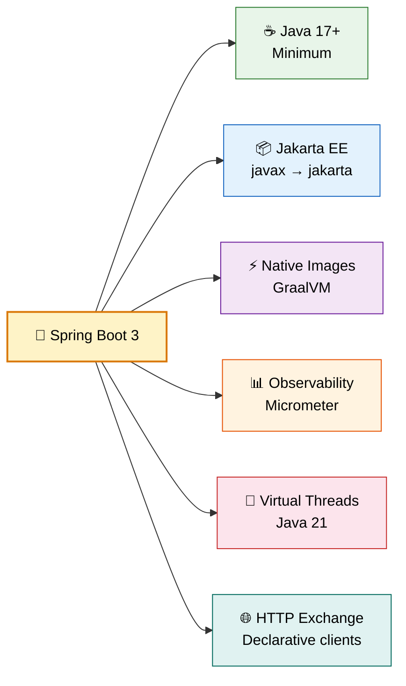
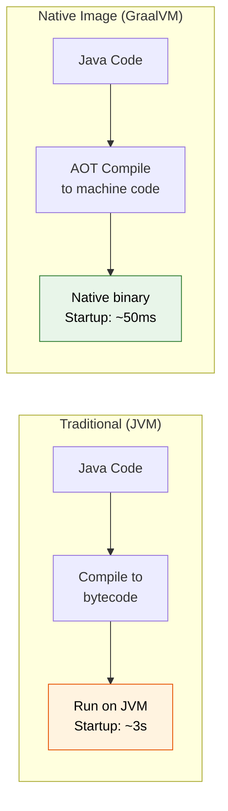
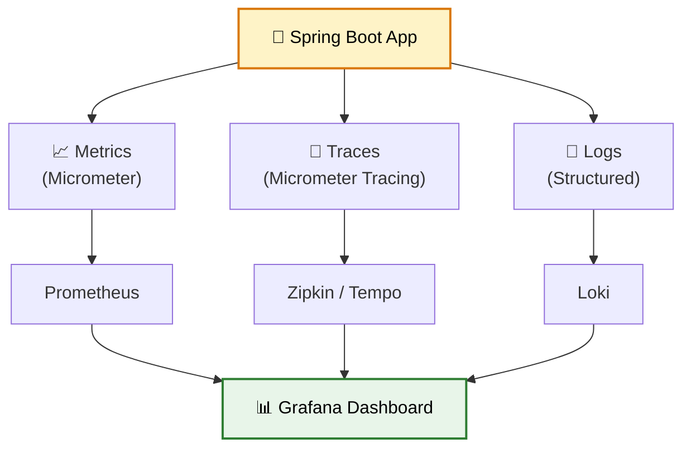
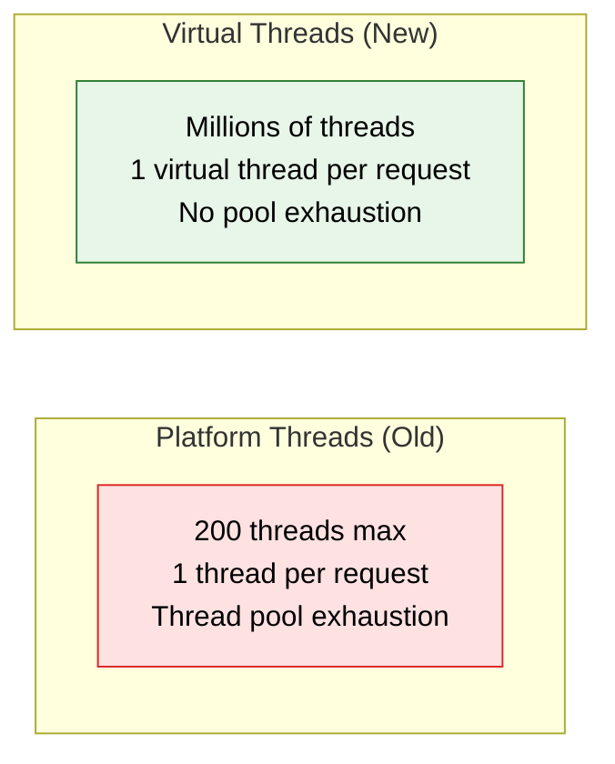

# 🚀 Spring Boot 3 & Spring Framework 6

> **The biggest Spring upgrade in a decade — Java 17 baseline, Jakarta EE, native images, and observability built-in.**

---



---

## ☕ Java 17 Baseline

Spring Boot 3 **requires** Java 17 or later. This unlocks modern Java features:

| Feature | Example |
|---------|---------|
| Records | `record UserDTO(String name, String email) {}` |
| Sealed Classes | `sealed interface Shape permits Circle, Square` |
| Pattern Matching | `if (obj instanceof String s)` |
| Text Blocks | `"""multiline strings"""` |
| Switch Expressions | `var result = switch(day) { case MON -> "Monday"; ... }` |

!!! warning "No more Java 8 or 11"
    If your project is on Java 8/11, you must upgrade to Java 17+ before migrating to Spring Boot 3.

---

## 📦 Jakarta EE Migration (javax → jakarta)

The biggest breaking change — **all `javax.*` packages** moved to `jakarta.*`:

```java
// ❌ Spring Boot 2.x (javax)
import javax.persistence.Entity;
import javax.servlet.http.HttpServletRequest;
import javax.validation.constraints.NotNull;

// ✅ Spring Boot 3.x (jakarta)
import jakarta.persistence.Entity;
import jakarta.servlet.http.HttpServletRequest;
import jakarta.validation.constraints.NotNull;
```

### Migration Checklist

| Old (javax) | New (jakarta) |
|-------------|---------------|
| `javax.persistence.*` | `jakarta.persistence.*` |
| `javax.servlet.*` | `jakarta.servlet.*` |
| `javax.validation.*` | `jakarta.validation.*` |
| `javax.annotation.*` | `jakarta.annotation.*` |
| `javax.transaction.*` | `jakarta.transaction.*` |

!!! tip "Quick Migration"
    Use IntelliJ's "Migrate to Jakarta" refactoring or run: `find . -name "*.java" -exec sed -i 's/javax\./jakarta\./g' {} +`

---

## ⚡ Native Images (GraalVM)

Spring Boot 3 supports **AOT (Ahead-of-Time) compilation** to create native executables:



| | JVM | Native Image |
|---|---|---|
| Startup time | 2-5 seconds | 50-100 ms |
| Memory | 200-500 MB | 50-100 MB |
| Peak throughput | Higher | Slightly lower |
| Build time | Fast | Slow (minutes) |
| Best for | Long-running services | Serverless, CLI tools |

### Building a Native Image

```bash
# Using Maven
./mvnw -Pnative native:compile

# Using Gradle
./gradlew nativeCompile

# Using Buildpacks (Docker)
./mvnw spring-boot:build-image -Pnative
```

---

## 🌐 HTTP Interface Clients (@HttpExchange)

New declarative HTTP clients — like Feign but built into Spring:

```java
// Define the interface
@HttpExchange("/api/users")
public interface UserClient {

    @GetExchange
    List<User> getAll();

    @GetExchange("/{id}")
    User getById(@PathVariable Long id);

    @PostExchange
    User create(@RequestBody CreateUserRequest request);

    @DeleteExchange("/{id}")
    void delete(@PathVariable Long id);
}

// Register as a bean
@Configuration
public class ClientConfig {

    @Bean
    public UserClient userClient(RestClient.Builder builder) {
        RestClient restClient = builder.baseUrl("http://user-service").build();
        return HttpServiceProxyFactory
            .builderFor(RestClientAdapter.create(restClient))
            .build()
            .createClient(UserClient.class);
    }
}
```

!!! tip "Replaces Feign in many cases"
    `@HttpExchange` is the Spring-native alternative to OpenFeign. No extra dependency needed.

---

## 📊 Observability (Micrometer + Tracing)

Spring Boot 3 has **first-class observability** support:



```xml
<!-- Dependencies -->
<dependency>
    <groupId>io.micrometer</groupId>
    <artifactId>micrometer-tracing-bridge-otel</artifactId>
</dependency>
<dependency>
    <groupId>io.opentelemetry</groupId>
    <artifactId>opentelemetry-exporter-zipkin</artifactId>
</dependency>
```

```yaml
# application.yml
management:
  tracing:
    sampling:
      probability: 1.0  # 100% sampling in dev
  endpoints:
    web:
      exposure:
        include: health,metrics,prometheus
```

---

## 🧵 Virtual Threads (Java 21+)

Enable lightweight threads that eliminate the need for reactive programming in many cases:

```yaml
# application.yml — that's it!
spring:
  threads:
    virtual:
      enabled: true
```



!!! abstract "When to Use"
    Virtual threads shine for **I/O-bound** workloads (DB calls, HTTP calls, file I/O). For CPU-bound tasks, platform threads are still better.

---

## 🛡️ Problem Details (RFC 7807)

Standardized error responses:

```java
@RestControllerAdvice
public class GlobalExceptionHandler {

    @ExceptionHandler(UserNotFoundException.class)
    public ProblemDetail handleNotFound(UserNotFoundException ex) {
        ProblemDetail problem = ProblemDetail.forStatus(HttpStatus.NOT_FOUND);
        problem.setTitle("User Not Found");
        problem.setDetail(ex.getMessage());
        problem.setProperty("userId", ex.getUserId());
        return problem;
    }
}
```

Response:
```json
{
  "type": "about:blank",
  "title": "User Not Found",
  "status": 404,
  "detail": "User with ID 42 does not exist",
  "instance": "/api/users/42",
  "userId": 42
}
```

---

## 📋 Migration Guide (2.x → 3.x)

| Step | Action |
|------|--------|
| 1 | Upgrade to Java 17+ |
| 2 | Replace all `javax.*` → `jakarta.*` imports |
| 3 | Update Spring Security config (new lambda DSL) |
| 4 | Replace `spring.factories` with `AutoConfiguration.imports` |
| 5 | Update to compatible library versions |
| 6 | Test with `--debug` to verify auto-configuration |

---

## 🎯 Interview Questions

??? question "1. What are the major changes in Spring Boot 3?"
    Java 17 baseline, Jakarta EE namespace migration (javax→jakarta), native image support via GraalVM, built-in observability with Micrometer, HTTP interface clients (@HttpExchange), Problem Details (RFC 7807), and virtual thread support.

??? question "2. Why did Spring move from javax to jakarta?"
    Oracle transferred Java EE to the Eclipse Foundation, which renamed it Jakarta EE. The `javax` namespace belongs to Oracle and couldn't be used. All new development happens under `jakarta.*`.

??? question "3. What are native images and when should you use them?"
    Native images compile Java code ahead-of-time into standalone executables. They start in ~50ms with minimal memory. Best for serverless (AWS Lambda), CLI tools, and containerized microservices. Not ideal for long-running services where JIT optimization matters.

??? question "4. What is the @HttpExchange annotation?"
    A Spring-native declarative HTTP client similar to OpenFeign. You define an interface with annotated methods, and Spring generates the implementation. Works with RestClient or WebClient under the hood.

??? question "5. How do virtual threads help in Spring Boot?"
    Virtual threads (Java 21) allow handling millions of concurrent requests without thread pool exhaustion. Each request gets its own lightweight virtual thread. Enable with `spring.threads.virtual.enabled=true`. Eliminates the need for reactive programming (WebFlux) in many I/O-bound scenarios.
