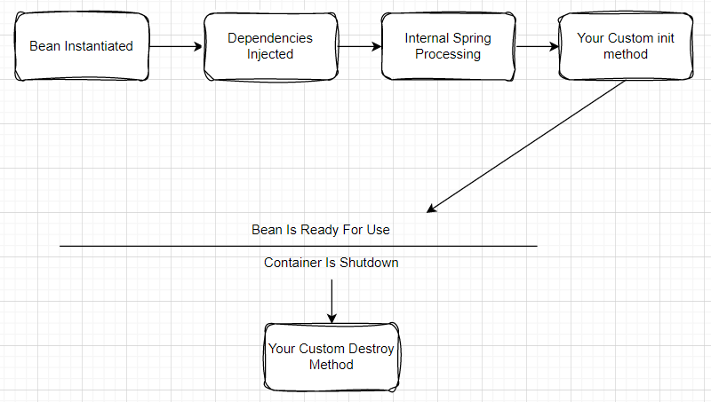

* you don't need to create an object for your java class.
* Spring IOC container will automatically create object and inject the dependent values.
* So, here spring is controlling our object creation i.e The control of object creation is not our hands.
* Service Locator Design Pattern.
* Bean Factory and Application Context

## Spring Bean LifeCycle

* There are 2 important methods in the bean life cycle
  
  a) init()
  b) destroy()

* The annotations used are @PostConstruct and @PreDestroy
* Code Explaining these methods:

   

          public class MyBean {
 
         @PostConstruct
         public void init() {
         // This method will be called after the bean is constructed and its properties are set.
      System.out.println("Bean initialization method called (init()).");
      }

      @PreDestroy
      public void destroy() {
      // This method will be called when the bean is being destroyed, typically during application shutdown.
      System.out.println("Bean destruction method called (destroy()).");
      }

      // Other methods and properties of the bean go here...
      } 
    

       
      

## Spring Scopes 

* In Spring, the scope of a bean defines the lifecycle and visibility of the bean within the application context. 
* There are 6 types

**a) Singleton Scope**

* This is the default scope in Spring.
* Only one instance of the bean is created per Spring container.
* The same instance is returned whenever the bean is requested.
* All subsequent requests for the bean will receive the same object reference.
* It's suitable for stateless beans or beans that share the same state across the application.

* **b)Prototype Scope**

* A new instance of the bean is created each time it is requested.
* It means that the Spring container doesn't manage the lifecycle of the bean, and you are responsible for managing resources and cleanup if needed.
* Prototype-scoped beans are useful when you want a new instance of the bean every time it is injected or looked up.

**c)Request Scope**

* A new instance of the bean is created for each HTTP request.
* It is specific to web applications that use Spring's DispatcherServlet.
* Each user request receives a separate instance of the bean, isolated from other requests.
* Request-scoped beans are ideal for situations where you need data isolation per user request.

**d)Session Scope**

* A new instance of the bean is created for each user session.
* It is specific to web applications, and a user session can span multiple HTTP requests.
* Each user session maintains a separate instance of the bean.
* Session-scoped beans are useful when you want to store stateful data specific to a user's session.

**e)Global Session Scope**

* This scope is similar to the session scope, but it is specific to portlet-based web applications.
* It represents a global session that can span multiple portlets.
* Global session-scoped beans are used when you need data shared across multiple portlets within the same session.

**f)Application Scope**

* The bean instance is shared across the entire application context.
* It is specific to web applications, and the bean instance is created once for the entire application.
* Application-scoped beans are suitable for data that needs to be shared across multiple parts of the application.
