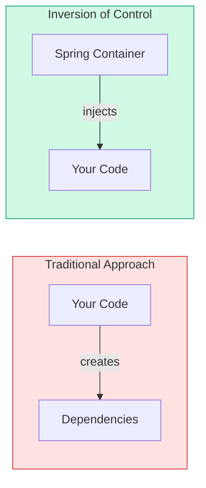
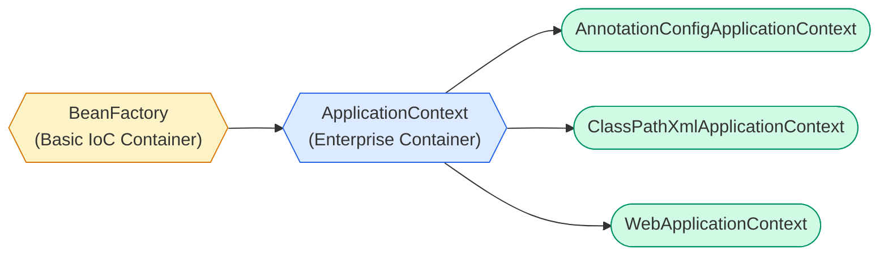
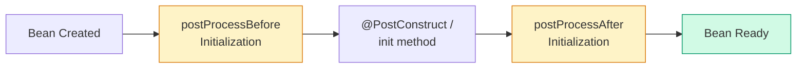
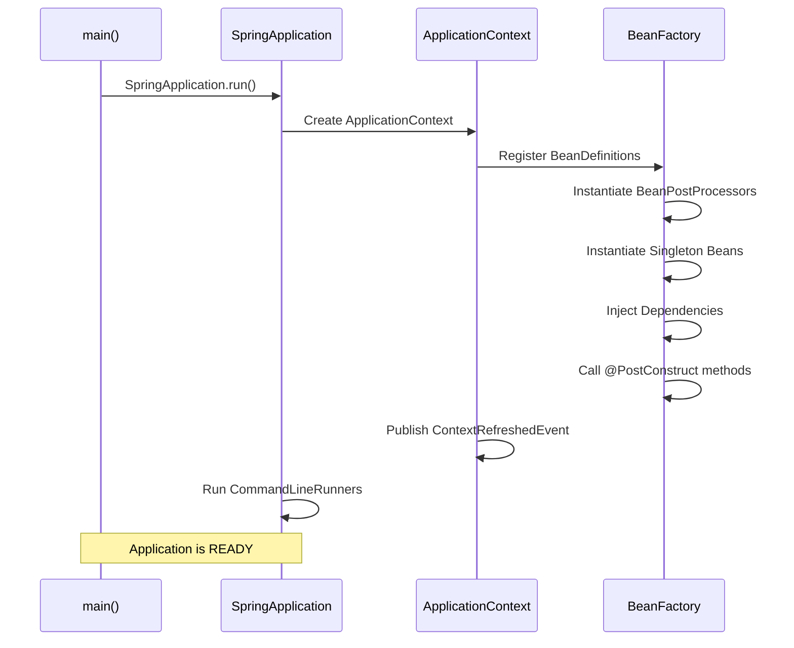

# IoC and Dependency Injection

> **The foundation of Spring — understand this and everything else clicks.**


```mermaid
flowchart LR
    subgraph Traditional["Traditional Approach"]
        A["Your Code"] -->|creates| B["Dependencies"]
    end
    subgraph IoC["Inversion of Control"]
        C["Spring Container"] -->|injects| D["Your Code"]
    end

    style Traditional fill:#FEE2E2,stroke:#DC2626
    style IoC fill:#D1FAE5,stroke:#059669
```

---

## What is IoC?

**Inversion of Control** = you don't create objects. The container creates them and gives them to you.

Also called the **Hollywood Principle**: "Don't call us, we'll call you."

Without IoC — your class does `new StripeGateway()` internally. Tight coupling. Can't test. Can't swap.

With IoC — your class declares `PaymentGateway gateway` in the constructor. Spring provides the right implementation. Loose coupling. Testable. Swappable.

### Without IoC

```java
public class OrderService {
    private PaymentGateway gateway = new StripePaymentGateway(); // tight coupling
    
    public void process(Order order) {
        gateway.charge(order.getTotal()); // can't mock this in tests
    }
}
```

### With IoC

```java
@Service
public class OrderService {
    private final PaymentGateway gateway;

    public OrderService(PaymentGateway gateway) { // Spring injects this
        this.gateway = gateway;
    }

    public void process(Order order) {
        gateway.charge(order.getTotal());
    }
}
```

### How Spring IoC Works Internally

1. **Scans** for `@Component`, `@Service`, `@Repository`, `@Controller` classes
2. Creates a `BeanDefinition` for each — stores class name, scope, dependencies, init methods
3. Builds a **dependency graph** (DAG). Detects circular dependencies here.
4. Instantiates beans in dependency order
5. Injects dependencies via constructor, setter, or field reflection
6. Runs post-processors (`@Autowired` resolution, AOP proxy creation)
7. Calls init callbacks (`@PostConstruct`)

!!! warning "Common Misconception"
    IoC is NOT the same as DI. IoC is the principle (container controls object lifecycle). DI is one implementation of IoC (container injects dependencies). Other forms of IoC: template method pattern, event-driven callbacks, service locator.

---

## BeanFactory vs ApplicationContext


```mermaid
flowchart LR
    A{{"BeanFactory<br/>(Basic IoC Container)"}} --> B{{"ApplicationContext<br/>(Enterprise Container)"}}
    B --> C(["AnnotationConfigApplicationContext"])
    B --> D(["ClassPathXmlApplicationContext"])
    B --> E(["WebApplicationContext"])

    style A fill:#FEF3C7,stroke:#D97706
    style B fill:#DBEAFE,stroke:#2563EB
    style C fill:#D1FAE5,stroke:#059669
    style D fill:#D1FAE5,stroke:#059669
    style E fill:#D1FAE5,stroke:#059669
```

| Feature | BeanFactory | ApplicationContext |
|---------|:-----------:|:------------------:|
| Bean creation | Lazy only | Eager (singletons at startup) |
| `@Autowired` / `@Value` | Manual BPP registration | Auto |
| AOP auto-proxying | No | Yes |
| Event publishing | No | Yes |
| `@Profile` / Environment | No | Yes |
| i18n (MessageSource) | No | Yes |
| **Use in production** | Never | **Always** |

**When to use BeanFactory?** Almost never. Only in memory-constrained embedded scenarios or low-level framework code. `BeanFactory` doesn't auto-register `BeanPostProcessors`, so `@Autowired` won't work without manual setup.

!!! tip "Spring Boot"
    `SpringApplication.run()` creates `AnnotationConfigServletWebServerApplicationContext` automatically. You never manually instantiate it.

---

## Bean Lifecycle


```mermaid
flowchart LR
    A["Instantiate"] --> B["Inject Deps"]
    B --> C["Aware Interfaces"]
    C --> D["BPP Before Init"]
    D --> E["@PostConstruct"]
    E --> F["afterPropertiesSet"]
    F --> G["BPP After Init"]
    G --> H["Ready"]
    H --> I["@PreDestroy"]
    I --> J["destroy()"]

    style A fill:#DBEAFE,stroke:#2563EB,color:#000
    style B fill:#DBEAFE,stroke:#2563EB,color:#000
    style D fill:#FEF3C7,stroke:#D97706,color:#000
    style E fill:#D1FAE5,stroke:#059669,color:#000
    style G fill:#FEF3C7,stroke:#D97706,color:#000
    style H fill:#ECFDF5,stroke:#059669,stroke-width:2px,color:#000
    style I fill:#FEE2E2,stroke:#DC2626,color:#000
    style J fill:#FEE2E2,stroke:#DC2626,color:#000
```

### Step-by-Step

| # | Step | What Happens | When You Care |
|---|------|-------------|---------------|
| 1 | **Instantiation** | Constructor called. Fields NOT injected yet (unless constructor injection). | — |
| 2 | **Populate Properties** | `@Autowired` fields, setters, `@Value` resolved. | — |
| 3 | **Aware Interfaces** | `setBeanName()`, `setBeanFactory()`, `setApplicationContext()` | Rarely. Framework code only. |
| 4 | **BPP Before Init** | `AutowiredAnnotationBeanPostProcessor` runs here. | Custom cross-cutting logic. |
| 5 | **@PostConstruct** | Your init code. All deps guaranteed available. | Cache warming, connection setup. |
| 6 | **afterPropertiesSet** | `InitializingBean` callback. Spring-specific. | Prefer `@PostConstruct`. |
| 7 | **BPP After Init** | **AOP proxies created here.** `@Transactional`, `@Async`, `@Cacheable` wrapping. | — |
| 8 | **Ready** | Bean is live in the container. | — |
| 9 | **@PreDestroy** | Cleanup on graceful shutdown. | Close connections, flush caches. |
| 10 | **destroy()** | `DisposableBean` callback. | Prefer `@PreDestroy`. |

### Execution Order When All Three Init Mechanisms Exist

```
@PostConstruct → InitializingBean.afterPropertiesSet() → @Bean(initMethod)
@PreDestroy → DisposableBean.destroy() → @Bean(destroyMethod)
```

### Key Lifecycle Callbacks

=== "@PostConstruct / @PreDestroy (Recommended)"

    ```java
    @Component
    public class CacheManager {
        @PostConstruct
        public void init() { loadCacheData(); }

        @PreDestroy
        public void cleanup() { flushCache(); }
    }
    ```

=== "InitializingBean / DisposableBean (Framework code)"

    ```java
    @Component
    public class CacheManager implements InitializingBean, DisposableBean {
        @Override
        public void afterPropertiesSet() { loadCacheData(); }

        @Override
        public void destroy() { flushCache(); }
    }
    ```

=== "@Bean initMethod (Third-party classes)"

    ```java
    @Configuration
    public class AppConfig {
        @Bean(initMethod = "init", destroyMethod = "cleanup")
        public CacheManager cacheManager() {
            return new CacheManager();
        }
    }
    ```

### Gotchas

!!! danger "Using @Autowired field in constructor"
    Field injection happens AFTER constructor. Accessing `@Autowired` fields in the constructor → `NullPointerException`. Use constructor injection instead.

!!! danger "Prototype beans don't get @PreDestroy"
    Spring doesn't track prototype instances after creation. No destruction callback. You must clean up manually.

!!! danger "@PostConstruct throws exception"
    If `@PostConstruct` throws, the bean fails, the context fails, the app doesn't start. For non-critical init, use `@EventListener(ApplicationReadyEvent.class)` instead.

---

## Bean Scopes

| Scope | Instances | Destroy Managed? | Thread-Safe? | Use Case |
|-------|-----------|:-----------------:|:------------:|----------|
| **singleton** | 1 per container | Yes | Must be | Services, repos, controllers |
| **prototype** | New per lookup | **No** | N/A | Stateful builders, commands |
| **request** | 1 per HTTP request | Yes | No | Correlation ID, request timer |
| **session** | 1 per HTTP session | Yes | Yes (concurrent requests) | Shopping cart, user prefs |
| **application** | 1 per ServletContext | Yes | Yes | Shared app-level state |
| **websocket** | 1 per WS connection | Yes | Depends | Per-connection chat state |

```java
@Service                        // singleton (default)
public class OrderService { }

@Component
@Scope("prototype")             // new instance every time
public class ReportBuilder { }

@Component
@Scope(value = "request", proxyMode = ScopedProxyMode.TARGET_CLASS)
public class RequestContext { }  // needs proxyMode!
```

### The Prototype-in-Singleton Problem

```java
@Service
public class OrderService {
    @Autowired
    private ShoppingCart cart; // prototype, but injected ONCE at singleton creation!
    // Same cart instance reused forever. Bug.
}
```

**Fix:** Use `ObjectProvider<T>`:

```java
@Service
public class OrderService {
    private final ObjectProvider<ShoppingCart> cartProvider;

    public OrderService(ObjectProvider<ShoppingCart> cartProvider) {
        this.cartProvider = cartProvider;
    }

    public void process() {
        ShoppingCart cart = cartProvider.getObject(); // fresh prototype each time
    }
}
```

Other fixes: `Provider<T>` (JSR-330), `@Lookup`, `proxyMode = TARGET_CLASS`.

### ScopedProxyMode Explained

Injecting request-scoped bean into singleton — no HTTP request exists at startup. Spring can't create it.

Solution: inject a **CGLIB proxy** instead. The proxy delegates to the real bean at runtime by looking it up from the current request's thread-local.

- `TARGET_CLASS` — CGLIB subclass proxy. Works on concrete classes. Most common.
- `INTERFACES` — JDK dynamic proxy. Requires interface. Slightly lighter.

---

## Dependency Resolution — @Qualifier, @Primary

When multiple beans implement the same interface, Spring needs disambiguation.

### Resolution Order

1. `@Qualifier("name")` match → exact
2. `@Primary` → default pick
3. Parameter/field name matches bean name → fallback
4. None → `NoUniqueBeanDefinitionException`

### @Primary — "Use this by default"

```java
@Component
@Primary
public class EmailSender implements NotificationSender { }

@Component
public class SmsSender implements NotificationSender { }

@Service
public class AlertService {
    public AlertService(NotificationSender sender) {
        // gets EmailSender (marked @Primary)
    }
}
```

### @Qualifier — "I want this specific one"

```java
@Service
public class AlertService {
    public AlertService(
            @Qualifier("emailSender") NotificationSender email,
            @Qualifier("smsSender") NotificationSender sms) {
        // explicit selection, overrides @Primary
    }
}
```

### Custom Qualifier Annotations

```java
@Target({ElementType.FIELD, ElementType.PARAMETER, ElementType.TYPE})
@Retention(RetentionPolicy.RUNTIME)
@Qualifier
public @interface Email {}

@Component @Email
public class EmailSender implements NotificationSender { }

@Service
public class AlertService {
    public AlertService(@Email NotificationSender sender) { } // compile-time safe
}
```

### Injecting All Beans of a Type

```java
@Service
public class NotificationBroadcaster {
    private final List<NotificationSender> senders; // ALL implementations injected

    public NotificationBroadcaster(List<NotificationSender> senders) {
        this.senders = senders; // ordered by @Order if present
    }

    public void broadcast(String msg) {
        senders.forEach(s -> s.send(msg));
    }
}
```

`Map<String, NotificationSender>` gives you bean name → instance mapping. Useful for plugin architectures.

---

## Profiles and Conditional Beans

### @Profile — Environment-Specific Beans

```java
@Bean @Profile("dev")
public DataSource devDs() { return h2InMemory(); }

@Bean @Profile("prod")
public DataSource prodDs() { return hikariPostgres(); }

@Bean @Profile("test")
public DataSource testDs() { return testcontainers(); }
```

**Activation:** `spring.profiles.active=prod` in properties, CLI arg, env variable, or `@ActiveProfiles("test")` in tests.

**Expressions:** `@Profile("prod & us-east")`, `@Profile("dev | staging")`, `@Profile("!prod")`.

### @Conditional — Spring Boot Auto-Configuration Foundation

| Annotation | Bean Created When... |
|-----------|---------------------|
| `@ConditionalOnClass(DataSource.class)` | Class on classpath |
| `@ConditionalOnMissingBean(CacheManager.class)` | No existing bean of that type |
| `@ConditionalOnProperty(name="cache.type", havingValue="redis")` | Property matches |
| `@ConditionalOnBean(DataSource.class)` | Bean exists in context |

This is how Spring Boot "magic" works. Add `spring-boot-starter-data-jpa` → `DataSource.class` appears on classpath → `DataSourceAutoConfiguration` activates → HikariCP auto-configured.

---

## BeanPostProcessor

Hooks into **every** bean creation. Spring uses it internally for `@Autowired`, `@Transactional`, `@Async`.


```mermaid
flowchart LR
    A["Bean Created"] --> B["postProcessBefore<br/>Initialization"]
    B --> C["@PostConstruct /<br/>init method"]
    C --> D["postProcessAfter<br/>Initialization"]
    D --> E["Bean Ready"]

    style B fill:#FEF3C7,stroke:#D97706
    style D fill:#FEF3C7,stroke:#D97706
    style E fill:#D1FAE5,stroke:#059669
```

```java
@Component
public class TimingBPP implements BeanPostProcessor {
    private final Map<String, Long> starts = new ConcurrentHashMap<>();

    public Object postProcessBeforeInitialization(Object bean, String name) {
        starts.put(name, System.nanoTime());
        return bean;
    }

    public Object postProcessAfterInitialization(Object bean, String name) {
        long ms = TimeUnit.NANOSECONDS.toMillis(System.nanoTime() - starts.remove(name));
        if (ms > 100) log.warn("Slow init: {} took {}ms", name, ms);
        return bean; // can return a proxy here
    }
}
```

### BeanFactoryPostProcessor vs BeanPostProcessor

| | BeanFactoryPostProcessor | BeanPostProcessor |
|---|---|---|
| **Runs** | Before any bean instantiation | After each bean instantiation |
| **Modifies** | Bean **definitions** (metadata) | Bean **instances** (objects) |
| **Example** | `PropertySourcesPlaceholderConfigurer` resolves `${...}` | `AutowiredAnnotationBeanPostProcessor` |

### Spring's Internal Post-Processors

- `AutowiredAnnotationBeanPostProcessor` — handles `@Autowired`, `@Value`
- `CommonAnnotationBeanPostProcessor` — handles `@PostConstruct`, `@PreDestroy`, `@Resource`
- `AnnotationAwareAspectJAutoProxyCreator` — creates AOP proxies for `@Transactional`, `@Cacheable`, `@Async`

---

## ApplicationContext Startup Flow


```mermaid
sequenceDiagram
    participant Main as main()
    participant SA as SpringApplication
    participant AC as ApplicationContext
    participant BF as BeanFactory

    Main->>SA: SpringApplication.run()
    SA->>AC: Create ApplicationContext
    AC->>BF: Register BeanDefinitions
    BF->>BF: Instantiate BeanPostProcessors
    BF->>BF: Instantiate Singleton Beans
    BF->>BF: Inject Dependencies
    BF->>BF: Call @PostConstruct methods
    AC->>AC: Publish ContextRefreshedEvent
    SA->>SA: Run CommandLineRunners
    Note over Main,SA: Application is READY
```

### Listening to Lifecycle Events

```java
@Component
public class AppLifecycleListener {
    @EventListener(ContextRefreshedEvent.class)
    public void onReady() { /* all beans initialized */ }

    @EventListener(ApplicationReadyEvent.class)
    public void onAppReady() { /* runners done, safe to take traffic */ }

    @EventListener(ContextClosedEvent.class)
    public void onShutdown() { /* graceful shutdown */ }
}
```

---

## Interview Questions

??? question "1. What is IoC? How is it different from DI?"
    IoC = design principle. The container controls object lifecycle, not your code. DI = one way to implement IoC (container pushes dependencies into objects). Other IoC forms: template method, event callbacks, service locator.

??? question "2. BeanFactory vs ApplicationContext?"
    `BeanFactory` — lazy loading, basic DI. `ApplicationContext` — extends BeanFactory with eager init, AOP, events, profiles, auto BPP registration. Always use `ApplicationContext`. `BeanFactory` doesn't even support `@Autowired` without manual BPP setup.

??? question "3. Complete bean lifecycle order?"
    Constructor → DI → Aware interfaces → BPP.beforeInit → @PostConstruct → afterPropertiesSet → BPP.afterInit (AOP proxies here) → Ready → @PreDestroy → destroy().

??? question "4. Where are AOP proxies created in the lifecycle?"
    In `BeanPostProcessor.postProcessAfterInitialization()`. The `AnnotationAwareAspectJAutoProxyCreator` wraps the bean in a CGLIB/JDK proxy. This is why calling `@Transactional` methods on `this` bypasses the proxy — `this` is the raw object, not the proxy.

??? question "5. Prototype bean injected into singleton — what happens?"
    Single prototype instance created at singleton init time. Reused forever. Fix: `ObjectProvider<T>.getObject()`, `Provider<T>`, `@Lookup`, or scoped proxy.

??? question "6. Does Spring call @PreDestroy on prototype beans?"
    No. Spring doesn't track prototype instances after creation. You must manage cleanup yourself.

??? question "7. @PostConstruct throws — what happens?"
    Bean creation fails → context fails to start → app crashes. For non-critical init, use `@EventListener(ApplicationReadyEvent.class)`.

??? question "8. How does Spring resolve ambiguous beans?"
    Priority: @Qualifier → @Primary → field/parameter name match → fail with `NoUniqueBeanDefinitionException`.

??? question "9. Difference between BeanFactoryPostProcessor and BeanPostProcessor?"
    BFPP modifies bean **definitions** before any bean is created (e.g., resolving `${property}` placeholders). BPP modifies bean **instances** after creation (e.g., `@Autowired` injection, AOP proxying).

??? question "10. ScopedProxyMode — why is it needed?"
    Request/session-scoped beans don't exist at startup when singletons are created. Spring injects a CGLIB proxy. At runtime, the proxy resolves the real bean from the current request/session thread-local.

??? question "11. Can Spring resolve circular dependencies?"
    With setter/field injection on singletons — yes, using a three-level cache (singletonObjects, earlySingletonObjects, singletonFactories). With constructor injection — no, throws `BeanCurrentlyInCreationException`. Spring Boot 2.6+ bans circular deps by default.

??? question "12. Three-level cache — how does it work?"
    Level 1: `singletonObjects` (fully initialized). Level 2: `earlySingletonObjects` (partially constructed). Level 3: `singletonFactories` (ObjectFactory to create early reference). When A needs B and B needs A: A is created, put in L3 as factory. B is created, needs A, gets early reference from L3 → moved to L2. B completes. A completes → moved to L1.

??? question "13. How does @ConditionalOnClass enable auto-configuration?"
    Spring Boot auto-config classes use `@ConditionalOnClass(DataSource.class)`. Adding `spring-boot-starter-data-jpa` puts `DataSource.class` on classpath → condition passes → auto-config activates → HikariCP configured automatically.

??? question "14. @Autowired field in constructor — what happens?"
    Field injection happens AFTER constructor. Accessing an `@Autowired` field inside the constructor → `NullPointerException`. Constructor injection doesn't have this problem because deps are constructor params.

??? question "15. What are Aware interfaces? Should you use them?"
    `BeanNameAware`, `ApplicationContextAware`, etc. Let beans receive container references. Couples code to Spring. Prefer constructor injection of `ApplicationContext` or `Environment` instead. Aware interfaces are for framework/library code.
