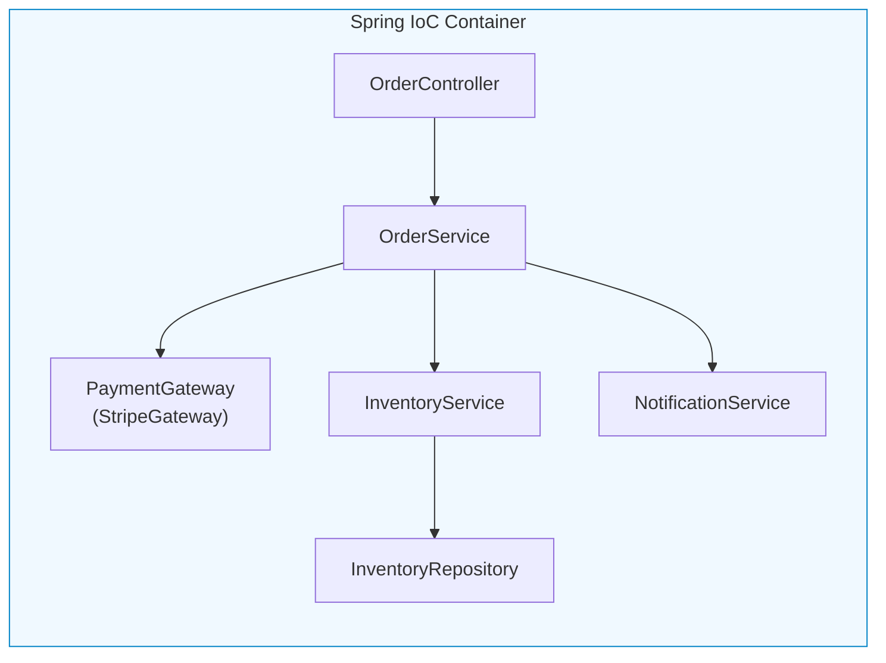
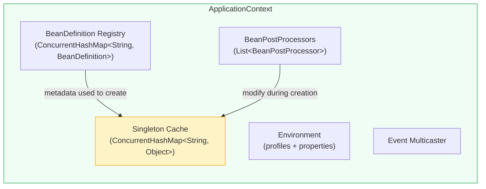
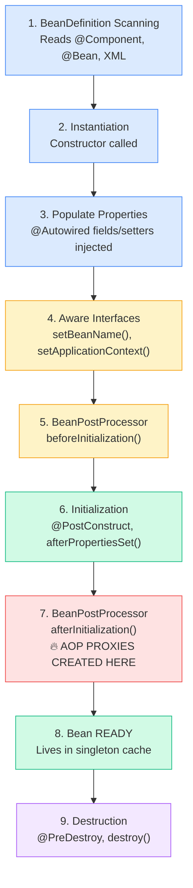
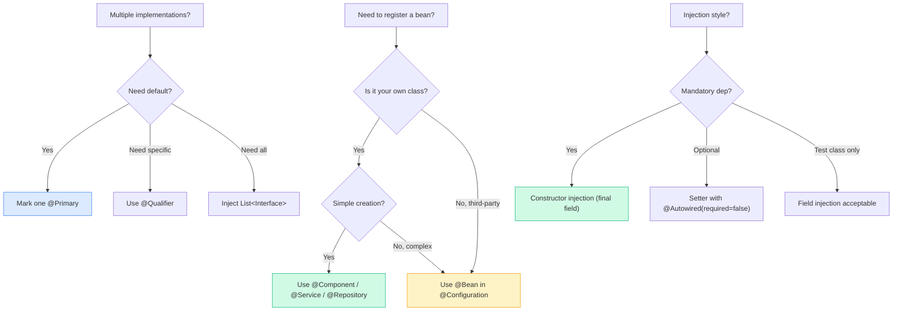

# IoC and Dependency Injection

> **If you nail this topic, you nail 50% of any Spring interview. This is the foundation everything else sits on.**

---

## What is Inversion of Control (IoC)?

!!! tip "💡 One-liner for interviews"
    IoC is a design principle where the **container** controls object creation and lifecycle — not your code. "Don't call us, we'll call you."

### What

IoC means you surrender control of *when* and *how* your objects are created. Instead of your `OrderService` doing `new PaymentService()`, a container creates `PaymentService` and hands it to `OrderService`.

### Why — The Problem It Solves

Imagine you're building an e-commerce platform. Your `OrderService` needs to charge customers. Without IoC:

```java
public class OrderService {
    // You hardcoded this. Now what?
    // - Can't swap to PayPalGateway without changing this class
    // - Can't mock it in tests
    // - If StripeGateway needs an API key, YOU must manage it
    private PaymentGateway gateway = new StripePaymentGateway("sk-live-xxx");

    public void placeOrder(Order order) {
        gateway.charge(order.getTotal()); // tightly coupled
    }
}
```

Here's what actually happens in production: you need Stripe in US, Razorpay in India, and a mock gateway in tests. With the code above, you're rewriting `OrderService` for every scenario.

IoC flips the relationship: **your class declares what it needs, the container decides what to give it.**

### When to Use IoC

Every Spring application uses IoC. The question isn't "when" — it's "when would you NOT?" Answer: standalone utilities, data classes, and objects with no dependencies.

### How — With IoC

```java
@Service
public class OrderService {
    private final PaymentGateway gateway;

    // You declare: "I need a PaymentGateway. I don't care which one."
    // Spring decides: "Here's StripeGateway because it's marked @Primary."
    public OrderService(PaymentGateway gateway) {
        this.gateway = gateway;
    }

    public void placeOrder(Order order) {
        gateway.charge(order.getTotal());
    }
}
```

### Where — Architecture Fit

IoC is the backbone of every layered architecture. Controllers depend on services, services depend on repositories, repositories depend on data sources. The container wires the entire graph.


```mermaid
flowchart TB
    subgraph Container["Spring IoC Container"]
        direction TB
        C["OrderController"] --> S["OrderService"]
        S --> P["PaymentGateway<br/>(StripeGateway)"]
        S --> I["InventoryService"]
        S --> N["NotificationService"]
        I --> R["InventoryRepository"]
    end

    style Container fill:#f0f9ff,stroke:#0284c7
```

!!! example "🎯 Interview Tip"
    When asked "What is IoC?", don't just say "container creates objects." Say: "IoC is the Hollywood Principle — my classes declare dependencies, the container provides them. This gives me loose coupling, testability, and the ability to swap implementations without changing business logic. DI is the mechanism Spring uses to implement this principle."

!!! question "❓ Counter-questions interviewers ask"
    **Q: "Is IoC only about object creation?"**
    No. IoC also controls lifecycle (init, destroy), configuration (externalized properties), and cross-cutting concerns (AOP proxying happens transparently).

    **Q: "Can you have IoC without a framework?"**
    Yes. You could write a `main()` method that creates all objects and passes them down. That's manual IoC. Frameworks like Spring automate it.

---

## What is Dependency Injection (DI)?

!!! tip "💡 One-liner for interviews"
    DI is the **mechanism** that implements IoC — Spring pushes (injects) dependencies into your objects via constructor, setter, or field.

### What

DI is one specific way to achieve IoC. The container "injects" (pushes) collaborators into your object, rather than your object pulling them (via `new` or a lookup).

### Why — IoC vs DI Distinction

Here's the key insight most candidates miss:

| Concept | Type | Description |
|---------|------|-------------|
| **IoC** | Design Principle | "Something else controls my dependencies" |
| **DI** | Implementation of IoC | "Dependencies are pushed into me via constructor/setter" |
| **Service Locator** | Another Implementation of IoC | "I ask a registry for my dependencies" |
| **Template Method** | Another Implementation of IoC | "Parent class controls the algorithm, I fill in steps" |
| **Event-Driven** | Another Implementation of IoC | "I register handlers, framework calls them" |

DI is preferred over Service Locator because:

- Dependencies are **explicit** (visible in the constructor signature)
- Classes are **testable** (just pass mocks to constructor)
- No hidden coupling to a global registry

!!! danger "⚠️ What breaks"
    **Production failure story:** A team used Service Locator pattern (`ApplicationContext.getBean()`) everywhere. When they tried to write integration tests with a sliced context (`@WebMvcTest`), half the beans weren't available. The `getBean()` calls threw `NoSuchBeanDefinitionException` at runtime. With constructor DI, the compiler would have caught missing beans immediately — the test wouldn't even compile if a required dependency was missing.

### The Three DI Styles

=== "Constructor Injection (Recommended)"

    ```java
    @Service
    public class OrderService {
        private final PaymentGateway paymentGateway;
        private final InventoryService inventoryService;
        private final NotificationService notificationService;

        // Since Spring 4.3: single constructor = auto-injected, no @Autowired needed
        public OrderService(PaymentGateway paymentGateway,
                            InventoryService inventoryService,
                            NotificationService notificationService) {
            this.paymentGateway = paymentGateway;
            this.inventoryService = inventoryService;
            this.notificationService = notificationService;
        }

        public OrderConfirmation placeOrder(Order order) {
            inventoryService.reserve(order.getItems());
            paymentGateway.charge(order.getCustomerId(), order.getTotal());
            notificationService.sendOrderConfirmation(order);
            return new OrderConfirmation(order.getId(), Status.CONFIRMED);
        }
    }
    ```

    **Why this is the best:**

    - Fields are `final` — immutable, thread-safe
    - Dependencies are explicit in the constructor signature
    - Can't create an invalid object (all deps required at construction)
    - No reflection magic — works with `new` in tests

=== "Setter Injection (Optional dependencies)"

    ```java
    @Service
    public class OrderService {
        private PaymentGateway paymentGateway;
        private NotificationService notificationService; // optional

        @Autowired
        public void setPaymentGateway(PaymentGateway paymentGateway) {
            this.paymentGateway = paymentGateway;
        }

        @Autowired(required = false)
        public void setNotificationService(NotificationService notificationService) {
            this.notificationService = notificationService;
        }

        public void placeOrder(Order order) {
            paymentGateway.charge(order.getCustomerId(), order.getTotal());
            if (notificationService != null) {
                notificationService.sendOrderConfirmation(order);
            }
        }
    }
    ```

    **When:** Truly optional dependencies, or reconfigurable beans (rare in practice).

=== "Field Injection (Avoid in production)"

    ```java
    @Service
    public class OrderService {
        @Autowired private PaymentGateway paymentGateway;
        @Autowired private InventoryService inventoryService;

        // Looks clean, but:
        // - Can't make fields final
        // - Hidden dependencies (not visible without reading internals)
        // - Can't instantiate without Spring (tests need reflection or @SpringBootTest)
        // - Encourages adding "just one more" field (God class smell)
    }
    ```

    **Only acceptable in:** Test classes, where brevity matters and you're already in a Spring context.

!!! question "❓ Counter-questions interviewers ask"
    **Q: "Why is constructor injection preferred over field injection?"**
    Three reasons: (1) Dependencies are explicit and mandatory — impossible to forget one. (2) Fields can be `final` — immutable and thread-safe. (3) Easy to test — just call `new OrderService(mockPayment, mockInventory, mockNotification)`.

    **Q: "What if I have 10 constructor parameters?"**
    That's a code smell — your class has too many responsibilities. Refactor: group related deps into a new service. E.g., `OrderFulfillmentService` encapsulates payment + inventory + notification.

---

## The Container: ApplicationContext vs BeanFactory

!!! tip "💡 One-liner for interviews"
    `BeanFactory` is the basic IoC container (lazy, minimal). `ApplicationContext` extends it with everything you actually need in production: eager init, events, AOP, profiles, i18n. You always use `ApplicationContext`.

### What's Actually in Memory?

Here's what most people don't know — at its core, the Spring container is essentially a `ConcurrentHashMap<String, Object>` mapping bean names to singleton instances. That's it. Everything else is orchestration around filling and managing that map.


```mermaid
flowchart TB
    subgraph ApplicationContext
        direction TB
        BD["BeanDefinition Registry<br/>(ConcurrentHashMap&lt;String, BeanDefinition&gt;)"]
        SC["Singleton Cache<br/>(ConcurrentHashMap&lt;String, Object&gt;)"]
        BPP["BeanPostProcessors<br/>(List&lt;BeanPostProcessor&gt;)"]
        ENV["Environment<br/>(profiles + properties)"]
        EVT["Event Multicaster"]
    end

    BD -->|"metadata used to create"| SC
    BPP -->|"modify during creation"| SC

    style ApplicationContext fill:#f0fdf4,stroke:#16a34a
    style SC fill:#fef3c7,stroke:#f59e0b
```

### Feature Comparison

| Feature | BeanFactory | ApplicationContext |
|---------|:-----------:|:------------------:|
| Bean instantiation | Lazy only | **Eager** (singletons pre-created at startup) |
| Auto `@Autowired` / `@Value` | No (manual BPP registration) | **Yes** |
| AOP auto-proxying | No | **Yes** |
| Event publishing (`ApplicationEvent`) | No | **Yes** |
| Profile support (`@Profile`) | No | **Yes** |
| Internationalization (MessageSource) | No | **Yes** |
| Annotation-based config | Partial | **Full** |
| **What to use in production** | Never | **Always** |

### Why Eager Initialization Matters

With `ApplicationContext`, all singleton beans are created at startup. This means:

- **Fail fast:** If a bean has a misconfiguration (wrong property, missing dependency), you know at deploy time, not at 3 AM when a user hits that code path.
- **No first-request latency:** Everything is warm and ready.
- **Circular dependency detection:** Caught immediately.

### BeanFactory — When Would You Ever Use It?

Almost never. The only scenario: you're building a framework or library that needs to operate in extremely memory-constrained environments (embedded IoT, for example). Even Spring Boot's test slices use `ApplicationContext`.

!!! example "🎯 Interview Tip"
    If asked "What's the difference between BeanFactory and ApplicationContext?", say: "BeanFactory is the raw IoC container — lazy loading, basic DI, no enterprise features. ApplicationContext extends BeanFactory with eager initialization, auto-registration of BeanPostProcessors (which enables @Autowired), AOP, events, profiles, and i18n. In any real application, including Spring Boot, you always get an ApplicationContext. BeanFactory is an implementation detail you never touch directly."

### What Spring Boot Actually Creates

```java
// When you run this:
SpringApplication.run(MyApp.class, args);

// Spring Boot creates:
// - Web app → AnnotationConfigServletWebServerApplicationContext
// - Reactive app → AnnotationConfigReactiveWebServerApplicationContext
// - Non-web app → AnnotationConfigApplicationContext
```

!!! question "❓ Counter-questions interviewers ask"
    **Q: "Can you make a singleton bean lazy in ApplicationContext?"**
    Yes — `@Lazy` on the bean or injection point. The bean won't be created until first accessed. Useful for expensive beans that may not be needed in every code path.

    **Q: "What happens if a bean definition references a class not on the classpath?"**
    With eager init: `BeanCreationException` at startup (fail fast). With lazy init: `NoClassDefFoundError` at first access (fail late — dangerous).

---

## How Spring Creates Beans Internally

!!! tip "💡 One-liner for interviews"
    Spring reads BeanDefinitions, instantiates via constructor, populates properties, calls Aware interfaces, runs BeanPostProcessors (this is where @PostConstruct and AOP proxying happen), then the bean is ready.

This is the bean lifecycle — memorize this flow and you can answer 80% of Spring internals questions.


```mermaid
flowchart TD
    A["1. BeanDefinition Scanning<br/>Reads @Component, @Bean, XML"] --> B["2. Instantiation<br/>Constructor called"]
    B --> C["3. Populate Properties<br/>@Autowired fields/setters injected"]
    C --> D["4. Aware Interfaces<br/>setBeanName(), setApplicationContext()"]
    D --> E["5. BeanPostProcessor<br/>beforeInitialization()"]
    E --> F["6. Initialization<br/>@PostConstruct, afterPropertiesSet()"]
    F --> G["7. BeanPostProcessor<br/>afterInitialization()<br/>🔥 AOP PROXIES CREATED HERE"]
    G --> H["8. Bean READY<br/>Lives in singleton cache"]
    H --> I["9. Destruction<br/>@PreDestroy, destroy()"]

    style A fill:#dbeafe,stroke:#3b82f6
    style B fill:#dbeafe,stroke:#3b82f6
    style C fill:#dbeafe,stroke:#3b82f6
    style D fill:#fef3c7,stroke:#f59e0b
    style E fill:#fef3c7,stroke:#f59e0b
    style F fill:#d1fae5,stroke:#10b981
    style G fill:#fee2e2,stroke:#ef4444
    style H fill:#d1fae5,stroke:#10b981
    style I fill:#f3e8ff,stroke:#a855f7
```

### Step-by-Step Deep Dive

**Step 1: BeanDefinition Scanning**

Spring scans your classpath and creates a `BeanDefinition` for each bean. This is pure metadata — no objects created yet.

What's in a BeanDefinition:

- Class name (e.g., `com.shop.OrderService`)
- Scope (`singleton`, `prototype`, etc.)
- Lazy flag
- Init method / Destroy method
- Constructor arguments and property values
- Dependencies (what it `@Autowired`)

**Step 2: Instantiation**

Spring picks a constructor. The rules:

1. If only one constructor → use it (no `@Autowired` needed since Spring 4.3)
2. If multiple constructors and one has `@Autowired` → use that one
3. If multiple constructors and none has `@Autowired` → use no-arg constructor
4. If no suitable constructor found → `BeanCreationException`

**Step 3: Populate Properties**

This is where `@Autowired` field injection and setter injection happen. Constructor injection already happened in Step 2.

**Step 4: Aware Interfaces**

Spring calls special callbacks if your bean implements them:

```java
public class OrderService implements BeanNameAware, ApplicationContextAware {
    @Override
    public void setBeanName(String name) {
        // "orderService" — the bean's name in the container
    }

    @Override
    public void setApplicationContext(ApplicationContext ctx) {
        // Direct access to the container — use sparingly
    }
}
```

**Step 5-6: BeanPostProcessors + Initialization**

`BeanPostProcessor.postProcessBeforeInitialization()` runs, then `@PostConstruct`, then `afterPropertiesSet()`.

**Step 7: AOP Proxy Creation (Critical!)**

`BeanPostProcessor.postProcessAfterInitialization()` is where `AnnotationAwareAspectJAutoProxyCreator` wraps your bean in a CGLIB or JDK dynamic proxy. This is why:

- `@Transactional` works on the proxy, not the raw object
- Calling `this.internalMethod()` bypasses the proxy — no transaction!
- `@Async`, `@Cacheable`, `@Retry` all follow the same pattern

**Step 8: Bean Ready** — stored in `DefaultSingletonBeanRegistry.singletonObjects` map.

**Step 9: Destruction** — on context close: `@PreDestroy` → `DisposableBean.destroy()` → custom destroy method.

!!! danger "⚠️ What breaks"
    **Production failure story:** A developer added `@Transactional` to a method but called it from another method in the same class (`this.save()`). No transaction was created. Why? The `this` reference points to the raw object, not the Spring proxy. The proxy (where `@Transactional` interceptor lives) is only invoked when the call comes from outside the class. Fix: inject `self` via `@Lazy` or extract the method to a separate service.

---

## @Component vs @Bean vs @Configuration

!!! tip "💡 One-liner for interviews"
    `@Component` is class-level scanning for your own classes. `@Bean` is method-level for explicit control (especially third-party classes you can't annotate). `@Configuration` enables CGLIB proxying so `@Bean` method calls return the same singleton.

### When to Use Each

=== "@Component — Your own classes"

    ```java
    @Component  // or @Service, @Repository, @Controller — semantic variants
    public class EmailNotificationChannel implements NotificationChannel {
        private final JavaMailSender mailSender;

        public EmailNotificationChannel(JavaMailSender mailSender) {
            this.mailSender = mailSender;
        }

        @Override
        public void send(String userId, String message) {
            mailSender.send(buildMimeMessage(userId, message));
        }
    }
    ```

    **Use when:** It's your class, it has a simple creation story, and classpath scanning will find it.

=== "@Bean — Third-party or complex creation"

    ```java
    @Configuration
    public class InfraConfig {

        @Bean
        public HikariDataSource dataSource(
                @Value("${db.url}") String url,
                @Value("${db.username}") String user,
                @Value("${db.password}") String pass) {
            HikariDataSource ds = new HikariDataSource();
            ds.setJdbcUrl(url);
            ds.setUsername(user);
            ds.setPassword(pass);
            ds.setMaximumPoolSize(20);
            ds.setConnectionTimeout(3000);
            return ds;
        }

        @Bean
        public RestTemplate restTemplate() {
            return new RestTemplateBuilder()
                .setConnectTimeout(Duration.ofSeconds(3))
                .setReadTimeout(Duration.ofSeconds(5))
                .build();
        }
    }
    ```

    **Use when:** You can't put `@Component` on the class (third-party), or the creation logic is complex and needs builder/factory patterns.

=== "@Configuration — The CGLIB trap"

    ```java
    @Configuration  // CGLIB proxy wraps this class!
    public class AppConfig {

        @Bean
        public InventoryService inventoryService() {
            return new InventoryService(inventoryRepository()); // calls @Bean method
        }

        @Bean
        public InventoryRepository inventoryRepository() {
            return new InventoryRepository(dataSource());
        }

        @Bean
        public DataSource dataSource() {
            return new HikariDataSource();
        }
    }
    ```

    **The trap:** Without `@Configuration`, each call to `dataSource()` creates a NEW `HikariDataSource`. With `@Configuration`, Spring intercepts the call via CGLIB proxy and returns the existing singleton. This is "full mode" vs "lite mode."

### Full Mode vs Lite Mode

| | Full Mode (`@Configuration`) | Lite Mode (`@Component` with `@Bean` methods) |
|---|---|---|
| **CGLIB proxy** | Yes — inter-bean references return singletons | No — each method call creates new instance |
| **Performance** | Slightly slower startup (proxy generation) | Faster |
| **When** | You call `@Bean` methods from other `@Bean` methods | You don't cross-reference `@Bean` methods |

!!! danger "⚠️ What breaks"
    **Production failure:** A developer used `@Component` instead of `@Configuration` on a config class. Two `@Bean` methods both called `dataSource()`. Result: two separate connection pools created, double the database connections, pool exhaustion under load, 500 errors in production.

!!! question "❓ Counter-questions interviewers ask"
    **Q: "Why can't you put @Component on HikariDataSource?"**
    Because it's a third-party class — you don't own its source code. You can't add annotations to it. `@Bean` lets you configure it in your own code.

    **Q: "What's the difference between @Component, @Service, @Repository, @Controller?"**
    Functionally identical for DI. The differences: `@Repository` adds persistence exception translation. `@Controller` enables MVC request mapping. `@Service` is purely semantic — signals business logic layer. They all trigger component scanning.

---

## Component Scanning Internals

!!! tip "💡 One-liner for interviews"
    `@SpringBootApplication` = `@Configuration` + `@EnableAutoConfiguration` + `@ComponentScan(basePackage = current package)`. Scanning finds all `@Component`-annotated classes in that package tree and registers them as BeanDefinitions.

### What @SpringBootApplication Actually Does

```java
// This:
@SpringBootApplication
public class ShopApplication { }

// Is equivalent to:
@Configuration
@EnableAutoConfiguration
@ComponentScan(basePackages = "com.shop") // package of ShopApplication
public class ShopApplication { }
```

### The Package Trap

```
com.shop/
├── ShopApplication.java          ← @SpringBootApplication here
├── order/
│   └── OrderService.java         ← ✅ FOUND (sub-package of com.shop)
├── payment/
│   └── PaymentService.java       ← ✅ FOUND
└── notification/
    └── NotificationService.java  ← ✅ FOUND

com.utils/
└── StringHelper.java             ← ❌ NOT FOUND (different root package!)
```

!!! danger "⚠️ What breaks"
    **Production failure:** A developer moved `ShopApplication.java` into `com.shop.config` package. All beans in `com.shop.order`, `com.shop.payment` stopped being discovered because scanning now only covered `com.shop.config` and its sub-packages. The app started with zero controllers — no 404 errors, just a completely silent failure where no endpoints existed.

### Custom Scanning

```java
@SpringBootApplication
@ComponentScan(
    basePackages = {"com.shop", "com.shared.utils"},
    excludeFilters = @ComponentScan.Filter(
        type = FilterType.REGEX,
        pattern = "com\\.shop\\.legacy\\..*"
    )
)
public class ShopApplication { }
```

### Filter Types

| Filter Type | Example | Use Case |
|-------------|---------|----------|
| `ANNOTATION` | Exclude `@Deprecated` beans | Migration |
| `ASSIGNABLE_TYPE` | Exclude specific class | Testing |
| `REGEX` | Pattern match package | Legacy exclusion |
| `CUSTOM` | Implement `TypeFilter` | Complex logic |

!!! example "🎯 Interview Tip"
    If asked "How does Spring Boot find your beans?", walk through the chain: `@SpringBootApplication` → `@ComponentScan` on the main class's package → Spring scans all `.class` files in that package tree → looks for `@Component` and its meta-annotations (`@Service`, `@Repository`, `@Controller`, `@Configuration`) → creates BeanDefinitions → instantiates in dependency order.

---

## Full Real-World Example: Notification System

!!! tip "💡 One-liner for interviews"
    The Strategy pattern + DI = extensible systems. Add a new implementation, zero changes to existing code. This is the Open/Closed Principle powered by Spring.

Here's a production-grade notification system that demonstrates why DI makes architecture beautiful.

### The Interface

```java
public interface NotificationChannel {
    void send(String userId, String message);
    boolean supports(NotificationType type);
    int priority(); // lower = higher priority, used for ordering
}
```

### The Implementations

```java
@Component
public class EmailChannel implements NotificationChannel {
    private final JavaMailSender mailSender;
    private final UserRepository userRepository;

    public EmailChannel(JavaMailSender mailSender, UserRepository userRepository) {
        this.mailSender = mailSender;
        this.userRepository = userRepository;
    }

    @Override
    public void send(String userId, String message) {
        User user = userRepository.findById(userId)
            .orElseThrow(() -> new UserNotFoundException(userId));
        SimpleMailMessage mail = new SimpleMailMessage();
        mail.setTo(user.getEmail());
        mail.setSubject("Notification from ShopApp");
        mail.setText(message);
        mailSender.send(mail);
    }

    @Override
    public boolean supports(NotificationType type) {
        return type == NotificationType.ORDER_CONFIRMATION
            || type == NotificationType.SHIPPING_UPDATE;
    }

    @Override
    public int priority() { return 1; }
}

@Component
public class SMSChannel implements NotificationChannel {
    private final TwilioClient twilioClient;
    private final UserRepository userRepository;

    public SMSChannel(TwilioClient twilioClient, UserRepository userRepository) {
        this.twilioClient = twilioClient;
        this.userRepository = userRepository;
    }

    @Override
    public void send(String userId, String message) {
        User user = userRepository.findById(userId)
            .orElseThrow(() -> new UserNotFoundException(userId));
        twilioClient.sendSms(user.getPhone(), message);
    }

    @Override
    public boolean supports(NotificationType type) {
        return type == NotificationType.OTP
            || type == NotificationType.DELIVERY_ALERT;
    }

    @Override
    public int priority() { return 2; }
}

@Component
public class PushChannel implements NotificationChannel {
    private final FirebaseMessaging firebase;
    private final DeviceTokenRepository tokenRepo;

    public PushChannel(FirebaseMessaging firebase, DeviceTokenRepository tokenRepo) {
        this.firebase = firebase;
        this.tokenRepo = tokenRepo;
    }

    @Override
    public void send(String userId, String message) {
        List<String> tokens = tokenRepo.findByUserId(userId);
        tokens.forEach(token ->
            firebase.send(Message.builder()
                .setToken(token)
                .setNotification(Notification.builder().setBody(message).build())
                .build())
        );
    }

    @Override
    public boolean supports(NotificationType type) {
        return true; // push supports everything as fallback
    }

    @Override
    public int priority() { return 10; } // lowest priority — fallback
}
```

### The Router (Where DI Shines)

```java
@Service
public class NotificationRouter {
    private final List<NotificationChannel> channels; // ALL implementations injected!

    // Spring injects every bean that implements NotificationChannel
    // Ordered by @Order or Ordered interface or our priority() method
    public NotificationRouter(List<NotificationChannel> channels) {
        this.channels = channels.stream()
            .sorted(Comparator.comparingInt(NotificationChannel::priority))
            .collect(Collectors.toList());
    }

    public void route(String userId, String message, NotificationType type) {
        channels.stream()
            .filter(channel -> channel.supports(type))
            .findFirst()
            .ifPresentOrElse(
                channel -> channel.send(userId, message),
                () -> { throw new NoChannelAvailableException(type); }
            );
    }

    public void broadcast(String userId, String message) {
        channels.forEach(channel -> channel.send(userId, message));
    }
}
```

### Why This Is Beautiful

**Adding WhatsAppChannel = ZERO changes to NotificationRouter:**

```java
@Component
public class WhatsAppChannel implements NotificationChannel {
    private final WhatsAppBusinessApi api;
    // ... constructor, send(), supports(), priority()
}
```

Just create the class, annotate with `@Component`, and Spring automatically includes it in the `List<NotificationChannel>` injected into `NotificationRouter`. No config changes. No router changes. **Open/Closed Principle in action.**

### Testing Is Trivial

```java
@Test
void routerSendsToHighestPriorityChannel() {
    NotificationChannel mockEmail = mock(NotificationChannel.class);
    when(mockEmail.supports(ORDER_CONFIRMATION)).thenReturn(true);
    when(mockEmail.priority()).thenReturn(1);

    NotificationChannel mockSms = mock(NotificationChannel.class);
    when(mockSms.supports(ORDER_CONFIRMATION)).thenReturn(true);
    when(mockSms.priority()).thenReturn(2);

    NotificationRouter router = new NotificationRouter(List.of(mockEmail, mockSms));
    router.route("user-123", "Order placed!", ORDER_CONFIRMATION);

    verify(mockEmail).send("user-123", "Order placed!");
    verify(mockSms, never()).send(any(), any());
}
```

No Spring context needed. No `@SpringBootTest`. Just constructors and mocks. **This is why constructor injection wins.**

!!! example "🎯 Interview Tip"
    Use this example when asked "How does DI help in real projects?" Walk them through: interface → multiple implementations → router that takes `List<Interface>` → adding new implementation requires zero changes. Connect it to SOLID: Single Responsibility (each channel does one thing), Open/Closed (extend without modifying), Liskov (all channels are interchangeable), Interface Segregation (small focused interface), Dependency Inversion (depend on abstraction, not concrete classes).

---

## Common Mistakes (With Production Failure Stories)

### Mistake 1: Circular Dependencies

!!! danger "⚠️ What breaks"
    `OrderService` needs `PaymentService` (to charge). `PaymentService` needs `OrderService` (to check order status for refunds). Boom: `BeanCurrentlyInCreationException`.

```java
@Service
public class OrderService {
    private final PaymentService paymentService; // needs PaymentService

    public OrderService(PaymentService paymentService) {
        this.paymentService = paymentService;
    }
}

@Service
public class PaymentService {
    private final OrderService orderService; // needs OrderService

    public PaymentService(OrderService orderService) {
        this.orderService = orderService; // 💥 Circular!
    }
}
```

**What happens internally:** Spring starts creating `OrderService` → needs `PaymentService` → starts creating `PaymentService` → needs `OrderService` → but `OrderService` is still being created → `BeanCurrentlyInCreationException`.

**Solutions (best to worst):**

1. **Redesign (best):** Extract the shared logic into a third service. `OrderStatusService` handles status checks, both depend on it.
2. **Use events:** `PaymentService` publishes `RefundRequestedEvent`, `OrderService` listens.
3. **`@Lazy` on one side:** `public PaymentService(@Lazy OrderService orderService)` — injects a proxy that resolves lazily.
4. **Setter injection (worst):** Allows Spring's three-level cache to resolve it, but hides the design problem.

!!! note "Spring Boot 2.6+"
    Circular dependencies are **banned by default**. `spring.main.allow-circular-references=false`. Don't re-enable it — fix your design.

### Mistake 2: Calling `new` Instead of Letting Spring Inject

!!! danger "⚠️ What breaks"
    A developer wrote `PaymentService ps = new PaymentService(repo)` in a controller instead of injecting it. Everything "worked" — except `@Transactional` on `PaymentService.charge()` silently did nothing. No transaction. Partial writes. Data corruption in production.

```java
// ❌ WRONG — bypasses Spring proxy
@RestController
public class OrderController {
    @Autowired private PaymentRepository repo;

    @PostMapping("/orders")
    public void placeOrder(@RequestBody Order order) {
        PaymentService ps = new PaymentService(repo); // raw object, no proxy!
        ps.charge(order); // @Transactional is ignored!
    }
}

// ✅ CORRECT — Spring injects the proxy
@RestController
public class OrderController {
    private final PaymentService paymentService; // this is the PROXY

    public OrderController(PaymentService paymentService) {
        this.paymentService = paymentService;
    }

    @PostMapping("/orders")
    public void placeOrder(@RequestBody Order order) {
        paymentService.charge(order); // @Transactional works!
    }
}
```

**Why:** `@Transactional`, `@Cacheable`, `@Async` all work via AOP proxies. When you `new` an object, there's no proxy — just the raw class. The annotations become decoration with zero effect.

### Mistake 3: Injecting Prototype into Singleton

!!! danger "⚠️ What breaks"
    `ShoppingCart` is `@Scope("prototype")` — each user should get their own. But it's injected into singleton `OrderService`. Result: ALL users share the same cart. One user adds an iPhone, another user checks out and buys it. Actual production bug at an e-commerce startup.

```java
@Component
@Scope("prototype")
public class ShoppingCart {
    private List<Item> items = new ArrayList<>();
    public void add(Item item) { items.add(item); }
    public List<Item> getItems() { return items; }
}

// ❌ BUG: prototype injected once into singleton
@Service
public class OrderService {
    private final ShoppingCart cart; // same instance forever!

    public OrderService(ShoppingCart cart) {
        this.cart = cart; // injected ONCE at startup. Never refreshed.
    }
}

// ✅ FIX: Use ObjectProvider for fresh instance each time
@Service
public class OrderService {
    private final ObjectProvider<ShoppingCart> cartProvider;

    public OrderService(ObjectProvider<ShoppingCart> cartProvider) {
        this.cartProvider = cartProvider;
    }

    public void addToCart(String userId, Item item) {
        ShoppingCart cart = cartProvider.getObject(); // new prototype each call
        cart.add(item);
    }
}
```

Other solutions: `Provider<T>` (JSR-330), `@Lookup` method, or `proxyMode = ScopedProxyMode.TARGET_CLASS`.

!!! question "❓ Counter-questions interviewers ask"
    **Q: "How does Spring's three-level cache solve circular dependencies?"**
    Level 1: `singletonObjects` — fully initialized beans. Level 2: `earlySingletonObjects` — partially constructed (properties not yet injected). Level 3: `singletonFactories` — factories that produce early references. Flow: A is being created → put in L3 as factory → A needs B → B is created → B needs A → gets A's early reference from L3 (moved to L2) → B completes (L1) → A completes (L1). Only works with field/setter injection, NOT constructor injection.

    **Q: "Why doesn't the three-level cache work with constructor injection?"**
    Because the constructor hasn't finished — there's no object yet to put in the cache. With field/setter injection, the constructor finishes first (creating a partial object), which can be cached.

---

## Interview Q&A — 10 Questions with Follow-Up Chains

!!! question "1. What is IoC?"
    **Answer:** IoC is a design principle where the framework controls object creation and lifecycle, not your code. Your classes declare what they need; the container provides it. Also called the Hollywood Principle: "Don't call us, we'll call you."

    **Follow-up: "How is it different from Service Locator pattern?"**
    Both are IoC — both let something else manage dependencies. The difference: with DI, dependencies are *pushed* into your class (via constructor). With Service Locator, your class *pulls* dependencies from a registry (`locator.getService(PaymentGateway.class)`). DI makes dependencies explicit; Service Locator hides them.

    **Follow-up: "Why is DI preferred over Service Locator?"**
    Three reasons: (1) Dependencies are visible in the constructor — you know at a glance what a class needs. (2) Easier to test — pass mocks via constructor vs. setting up a global registry. (3) Compile-time safety — if a dependency is missing, the constructor call won't compile (in tests) or Spring fails fast at startup.

!!! question "2. What's the difference between @Component and @Bean?"
    **Answer:** `@Component` is class-level — you put it on your own classes, Spring finds them via scanning. `@Bean` is method-level — you put it on a factory method in a `@Configuration` class, you control instantiation explicitly. Use `@Bean` for third-party classes (can't annotate them) or complex creation logic.

    **Follow-up: "What about @Configuration vs @Component on a config class?"**
    `@Configuration` creates a CGLIB proxy. If one `@Bean` method calls another, the proxy intercepts and returns the existing singleton. Without `@Configuration` (lite mode), each call creates a new instance — potentially duplicating singletons like DataSource.

    **Follow-up: "Can @Bean methods be in a @Component class?"**
    Yes, but it's "lite mode" — no CGLIB proxy, no singleton semantics for inter-bean references. Only do this if your `@Bean` methods don't call each other.

!!! question "3. Explain the complete bean lifecycle."
    **Answer:** Constructor → Dependency Injection → Aware interfaces (setBeanName, setApplicationContext) → BeanPostProcessor.beforeInitialization → @PostConstruct → InitializingBean.afterPropertiesSet → custom init-method → BeanPostProcessor.afterInitialization (AOP proxies created HERE) → Bean ready → @PreDestroy → DisposableBean.destroy → custom destroy-method.

    **Follow-up: "Where do AOP proxies get created?"**
    In `postProcessAfterInitialization()`. The `AnnotationAwareAspectJAutoProxyCreator` (a BeanPostProcessor) wraps the bean. This is why calling `this.method()` inside a class bypasses @Transactional — `this` is the raw object, the proxy only exists externally.

    **Follow-up: "What if @PostConstruct throws an exception?"**
    The bean fails to initialize → the ApplicationContext fails to refresh → the application doesn't start. For non-critical initialization, use `@EventListener(ApplicationReadyEvent.class)` instead — it runs after the context is fully up.

!!! question "4. BeanFactory vs ApplicationContext?"
    **Answer:** `BeanFactory` is the basic container — lazy loading, bare-bones DI. `ApplicationContext` extends it with: eager singleton initialization (fail-fast), automatic BeanPostProcessor registration (enables @Autowired), AOP, event publishing, profiles, i18n, and environment abstraction. You always use ApplicationContext. Spring Boot creates one for you.

    **Follow-up: "When would you use BeanFactory?"**
    Almost never in application code. Only in extreme memory-constrained environments or internal framework code. Even `@Autowired` doesn't work with raw BeanFactory without manually registering `AutowiredAnnotationBeanPostProcessor`.

    **Follow-up: "What's actually stored in the container at runtime?"**
    A `ConcurrentHashMap<String, Object>` of singleton instances (`DefaultSingletonBeanRegistry.singletonObjects`) plus a registry of `BeanDefinition` metadata and a list of `BeanPostProcessor` instances.

!!! question "5. How does constructor injection differ from field injection?"
    **Answer:** Constructor injection: dependencies are constructor parameters, fields can be `final`, all deps required at creation time, testable without reflection. Field injection: uses `@Autowired` on private fields, set via reflection after construction, fields can't be `final`, requires Spring (or reflection) for testing.

    **Follow-up: "Why does Spring recommend constructor injection?"**
    Immutability (final fields), explicit dependencies (visible in constructor signature), mandatory dependencies (can't create object without them), testability (just call `new`), and it naturally limits class size (too many params = too many responsibilities).

    **Follow-up: "What happens if you access an @Autowired field in the constructor?"**
    `NullPointerException`. Field injection happens AFTER the constructor completes. The field is still null during construction. This is another reason constructor injection is safer.

!!! question "6. Prototype bean in singleton — what happens?"
    **Answer:** The prototype bean is created ONCE when the singleton is initialized and never refreshed. Every call uses the same "prototype" instance — defeating its purpose entirely.

    **Follow-up: "How do you fix it?"**
    Use `ObjectProvider<T>` (Spring) or `Provider<T>` (JSR-330) and call `.getObject()` each time you need a fresh instance. Alternatives: `@Lookup` annotation on a method, or `proxyMode = ScopedProxyMode.TARGET_CLASS` on the prototype.

    **Follow-up: "Does Spring call @PreDestroy on prototype beans?"**
    No. Spring doesn't track prototype instances after handing them out. You must manage their lifecycle yourself. Only singletons get destruction callbacks.

!!! question "7. How does Spring handle circular dependencies?"
    **Answer:** For field/setter injection of singletons: Spring uses a three-level cache. L1: fully initialized beans. L2: early references (partially constructed). L3: ObjectFactories that create early references. When A needs B and B needs A: A starts creation (L3) → needs B → B starts → needs A → gets A's early ref from L3→L2 → B completes → A completes.

    **Follow-up: "Why doesn't this work with constructor injection?"**
    With constructors, the object doesn't exist yet — the constructor hasn't returned. There's nothing to put in the cache. Spring throws `BeanCurrentlyInCreationException`.

    **Follow-up: "Spring Boot 2.6+ behavior?"**
    Circular dependencies are banned by default. You get an error at startup. This is intentional — circular deps are a design smell. Fix by extracting shared logic to a third class or using events.

!!! question "8. Explain @Qualifier vs @Primary."
    **Answer:** When multiple beans match a type: `@Primary` marks the default winner. `@Qualifier("name")` explicitly selects a specific bean — overrides @Primary. Resolution order: @Qualifier → @Primary → parameter name matching bean name → NoUniqueBeanDefinitionException.

    **Follow-up: "Can you inject ALL beans of a type?"**
    Yes: `List<NotificationChannel>` injects all implementations. `Map<String, NotificationChannel>` gives bean name → instance mapping. Ordering controlled by `@Order` or `Ordered` interface.

    **Follow-up: "What are custom qualifier annotations?"**
    Create your own annotation meta-annotated with `@Qualifier`. E.g., `@Email`, `@SMS`. Provides compile-time safety and is more readable than string-based qualifiers that can have typos.

!!! question "9. How does @SpringBootApplication trigger component scanning?"
    **Answer:** `@SpringBootApplication` = `@Configuration` + `@EnableAutoConfiguration` + `@ComponentScan`. The `@ComponentScan` defaults to the package of the annotated class. Spring scans all sub-packages for `@Component` (and meta-annotations like `@Service`, `@Repository`, `@Controller`).

    **Follow-up: "What if the main class is in the wrong package?"**
    Beans in packages outside the scan base won't be found. No error — they're just invisible. Common mistake: putting the main class in a sub-package (e.g., `com.shop.config`) so `com.shop.order` beans aren't scanned.

    **Follow-up: "How does auto-configuration work?"**
    `@EnableAutoConfiguration` triggers loading from `META-INF/spring/org.springframework.boot.autoconfigure.AutoConfiguration.imports`. Each auto-config class has `@Conditional*` annotations — only activates when conditions match (class on classpath, property set, bean missing).

!!! question "10. What is a BeanPostProcessor? Give an example."
    **Answer:** A BeanPostProcessor hooks into every bean's creation. It has two methods: `postProcessBeforeInitialization` (runs before @PostConstruct) and `postProcessAfterInitialization` (runs after — this is where AOP proxies are created). Spring uses BPPs internally for @Autowired resolution, @Transactional proxying, and @Async.

    **Follow-up: "Difference between BeanPostProcessor and BeanFactoryPostProcessor?"**
    BeanPostProcessor modifies bean *instances* (after creation). BeanFactoryPostProcessor modifies bean *definitions* (metadata, before any bean exists). Example BFPP: `PropertySourcesPlaceholderConfigurer` resolves `${...}` placeholders in BeanDefinitions before beans are created.

    **Follow-up: "Can a BeanPostProcessor return a different object?"**
    Yes! `postProcessAfterInitialization` can return a completely different object (like a proxy). This is exactly what `AnnotationAwareAspectJAutoProxyCreator` does — it receives your bean and returns a CGLIB proxy wrapping it.

---

## Quick Reference: Decision Flowchart


```mermaid
flowchart TD
    A["Need to register a bean?"] --> B{"Is it your own class?"}
    B -->|Yes| C{"Simple creation?"}
    B -->|No, third-party| D["Use @Bean in @Configuration"]
    C -->|Yes| E["Use @Component / @Service / @Repository"]
    C -->|No, complex| D

    F["Multiple implementations?"] --> G{"Need default?"}
    G -->|Yes| H["Mark one @Primary"]
    G -->|Need specific| I["Use @Qualifier"]
    G -->|Need all| J["Inject List&lt;Interface&gt;"]

    K["Injection style?"] --> L{"Mandatory dep?"}
    L -->|Yes| M["Constructor injection (final field)"]
    L -->|Optional| N["Setter with @Autowired(required=false)"]
    L -->|Test class only| O["Field injection acceptable"]

    style D fill:#fef3c7,stroke:#f59e0b
    style E fill:#d1fae5,stroke:#10b981
    style M fill:#d1fae5,stroke:#10b981
    style H fill:#dbeafe,stroke:#3b82f6
```

---

## Summary: What Senior Engineers Know

| Principle | Junior Says | Senior Says |
|-----------|-------------|-------------|
| IoC | "Spring creates objects" | "I surrender lifecycle control so I can focus on business logic. The container manages creation, wiring, proxying, and destruction." |
| DI style | "I use @Autowired on fields" | "Constructor injection — immutable, explicit, testable. Field injection is for test classes only." |
| @Transactional | "I just add the annotation" | "It only works through the proxy. Self-calls bypass it. And the proxy is created in postProcessAfterInitialization by the AspectJ auto proxy creator BPP." |
| Prototype scope | "It creates new instances" | "Only if you use ObjectProvider. Injecting directly into a singleton gives you one instance forever." |
| Bean config | "I @Component everything" | "@Component for my classes, @Bean for third-party, @Configuration for inter-bean references that need singleton guarantees via CGLIB." |
| Circular deps | "Add @Lazy" | "Redesign. Extract shared responsibility to a new service or use domain events. @Lazy is a band-aid." |
