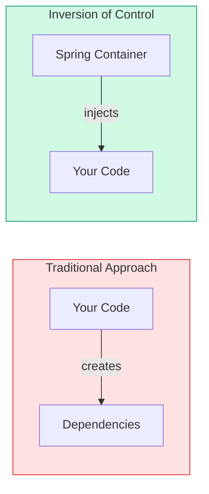
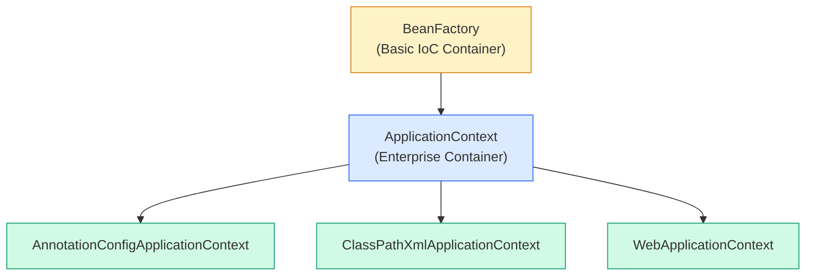
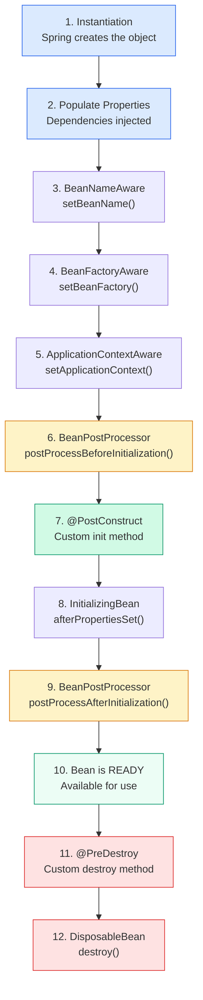
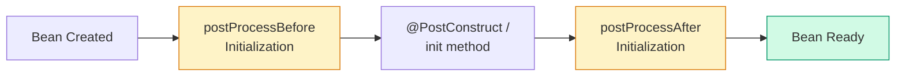
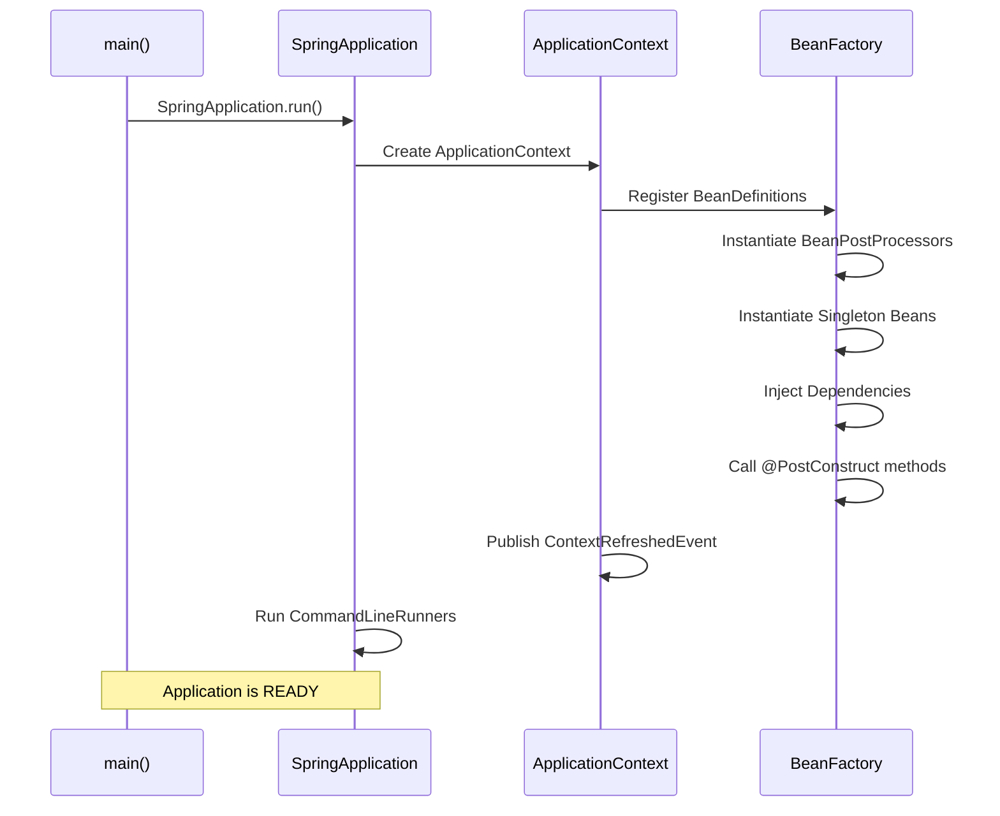

# 🏗️ IoC & Dependency Injection

> **The foundation of Spring — understand this and everything else makes sense.**


```mermaid
flowchart LR
    subgraph Traditional["Traditional Approach"]
        A["Your Code"] -->|creates| B["Dependencies"]
    end
    subgraph IoC["Inversion of Control"]
        C["Spring Container"] -->|injects| D["Your Code"]
    end

    style Traditional fill:#FEE2E2,stroke:#DC2626
    style IoC fill:#D1FAE5,stroke:#059669
```

---

## 🧠 What is Inversion of Control (IoC)?

!!! abstract "In Simple Words"
    **IoC** means you don't create objects yourself — the Spring container creates them and gives them to you. The "control" of object creation is **inverted** from your code to the framework.

### Without IoC (Tight Coupling)

```java
public class OrderService {
    // YOU create the dependency — tight coupling!
    private PaymentGateway gateway = new StripePaymentGateway();

    public void processOrder(Order order) {
        gateway.charge(order.getTotal());
    }
}
```

### With IoC (Loose Coupling)

```java
@Service
public class OrderService {
    // Spring INJECTS the dependency — loose coupling!
    private final PaymentGateway gateway;

    public OrderService(PaymentGateway gateway) {
        this.gateway = gateway;
    }

    public void processOrder(Order order) {
        gateway.charge(order.getTotal());
    }
}
```

!!! tip "Why This Matters"
    - **Testable** — Easily swap `StripePaymentGateway` with a mock in tests
    - **Flexible** — Change implementations without modifying `OrderService`
    - **Maintainable** — Clear dependencies, no hidden object creation

---

## 🏭 BeanFactory vs ApplicationContext


```mermaid
graph TD
    A["BeanFactory<br/>(Basic IoC Container)"] --> B["ApplicationContext<br/>(Enterprise Container)"]
    B --> C["AnnotationConfigApplicationContext"]
    B --> D["ClassPathXmlApplicationContext"]
    B --> E["WebApplicationContext"]

    style A fill:#FEF3C7,stroke:#D97706
    style B fill:#DBEAFE,stroke:#2563EB
    style C fill:#D1FAE5,stroke:#059669
    style D fill:#D1FAE5,stroke:#059669
    style E fill:#D1FAE5,stroke:#059669
```

| Feature | BeanFactory | ApplicationContext |
|---------|------------|-------------------|
| Bean instantiation | Lazy (on-demand) | Eager (at startup) |
| Event publishing | No | Yes |
| AOP support | No | Yes |
| i18n (MessageSource) | No | Yes |
| Environment abstraction | No | Yes |
| Annotation support | Limited | Full |
| **Use in production** | Rarely | **Always** |

!!! tip "Interview Answer"
    `ApplicationContext` is the superset of `BeanFactory`. In Spring Boot, you always use `ApplicationContext` (it is created automatically when you call `SpringApplication.run()`).

---

## 🔄 Bean Lifecycle


```mermaid
flowchart TD
    A["1. Instantiation<br/>Spring creates the object"] --> B["2. Populate Properties<br/>Dependencies injected"]
    B --> C["3. BeanNameAware<br/>setBeanName()"]
    C --> D["4. BeanFactoryAware<br/>setBeanFactory()"]
    D --> E["5. ApplicationContextAware<br/>setApplicationContext()"]
    E --> F["6. BeanPostProcessor<br/>postProcessBeforeInitialization()"]
    F --> G["7. @PostConstruct<br/>Custom init method"]
    G --> H["8. InitializingBean<br/>afterPropertiesSet()"]
    H --> I["9. BeanPostProcessor<br/>postProcessAfterInitialization()"]
    I --> J["10. Bean is READY<br/>Available for use"]
    J --> K["11. @PreDestroy<br/>Custom destroy method"]
    K --> L["12. DisposableBean<br/>destroy()"]

    style A fill:#DBEAFE,stroke:#2563EB
    style B fill:#DBEAFE,stroke:#2563EB
    style F fill:#FEF3C7,stroke:#D97706
    style G fill:#D1FAE5,stroke:#059669
    style I fill:#FEF3C7,stroke:#D97706
    style J fill:#ECFDF5,stroke:#059669
    style K fill:#FEE2E2,stroke:#DC2626
    style L fill:#FEE2E2,stroke:#DC2626
```

### Key Lifecycle Callbacks

=== "@PostConstruct / @PreDestroy (Recommended)"

    ```java
    @Component
    public class CacheManager {

        @PostConstruct
        public void init() {
            System.out.println("Cache initialized — loading data...");
            loadCacheData();
        }

        @PreDestroy
        public void cleanup() {
            System.out.println("Cache shutting down — flushing data...");
            flushCache();
        }
    }
    ```

=== "InitializingBean / DisposableBean"

    ```java
    @Component
    public class CacheManager implements InitializingBean, DisposableBean {

        @Override
        public void afterPropertiesSet() {
            // Called after all properties are set
            loadCacheData();
        }

        @Override
        public void destroy() {
            // Called during shutdown
            flushCache();
        }
    }
    ```

=== "@Bean initMethod/destroyMethod"

    ```java
    @Configuration
    public class AppConfig {

        @Bean(initMethod = "init", destroyMethod = "cleanup")
        public CacheManager cacheManager() {
            return new CacheManager();
        }
    }
    ```

---

## 🎯 Bean Scopes

| Scope | Instances | Lifecycle | Use Case |
|-------|-----------|-----------|----------|
| **singleton** (default) | 1 per container | Entire app lifetime | Stateless services, repositories |
| **prototype** | New per request | Not managed after creation | Stateful objects, builders |
| **request** | 1 per HTTP request | Single HTTP request | Request-scoped data |
| **session** | 1 per HTTP session | User session | Shopping cart, user preferences |
| **application** | 1 per ServletContext | App lifetime (web) | Shared web app state |
| **websocket** | 1 per WebSocket | WebSocket session | Per-connection state |

!!! warning "Web Scopes Require Web Context"
    `request`, `session`, `application`, and `websocket` scopes are only available in web-aware Spring applications.

### Scope Examples

=== "Singleton (Default)"

    ```java
    @Service // Singleton by default
    public class UserService {
        // ONE instance shared across the entire application
        // Must be thread-safe and stateless
    }
    ```

=== "Prototype"

    ```java
    @Component
    @Scope("prototype")
    public class ReportGenerator {
        private List<String> data = new ArrayList<>();

        // NEW instance every time it's requested
        // Spring does NOT manage its destruction
    }
    ```

=== "Request"

    ```java
    @Component
    @Scope(value = WebApplicationContext.SCOPE_REQUEST, proxyMode = ScopedProxyMode.TARGET_CLASS)
    public class RequestContext {
        private String correlationId;
        private Instant startTime = Instant.now();
        // New instance per HTTP request
    }
    ```

=== "Session"

    ```java
    @Component
    @Scope(value = WebApplicationContext.SCOPE_SESSION, proxyMode = ScopedProxyMode.TARGET_CLASS)
    public class ShoppingCart {
        private List<CartItem> items = new ArrayList<>();
        // One instance per user session
    }
    ```

!!! tip "proxyMode is Required for Narrow Scopes"
    When injecting a request/session-scoped bean into a singleton, you must use `proxyMode = ScopedProxyMode.TARGET_CLASS`. This creates a proxy that delegates to the correct scoped instance at runtime.

---

## 🔧 BeanPostProcessor

A `BeanPostProcessor` lets you hook into the bean creation process and modify beans **before** and **after** initialization.


```mermaid
flowchart LR
    A["Bean Created"] --> B["postProcessBefore<br/>Initialization"]
    B --> C["@PostConstruct /<br/>init method"]
    C --> D["postProcessAfter<br/>Initialization"]
    D --> E["Bean Ready"]

    style B fill:#FEF3C7,stroke:#D97706
    style D fill:#FEF3C7,stroke:#D97706
    style E fill:#D1FAE5,stroke:#059669
```

```java
@Component
public class LoggingBeanPostProcessor implements BeanPostProcessor {

    @Override
    public Object postProcessBeforeInitialization(Object bean, String beanName) {
        if (bean instanceof MyService) {
            System.out.println("Before init: " + beanName);
        }
        return bean;
    }

    @Override
    public Object postProcessAfterInitialization(Object bean, String beanName) {
        if (bean instanceof MyService) {
            System.out.println("After init: " + beanName);
        }
        return bean; // Can return a proxy here!
    }
}
```

!!! abstract "Real-World Uses of BeanPostProcessor"
    - **`AutowiredAnnotationBeanPostProcessor`** — processes `@Autowired`
    - **`CommonAnnotationBeanPostProcessor`** — processes `@PostConstruct`, `@PreDestroy`
    - **AOP Proxies** — Spring AOP creates proxies in `postProcessAfterInitialization`

---

## 🌀 ApplicationContext Startup Flow


```mermaid
sequenceDiagram
    participant Main as main()
    participant SA as SpringApplication
    participant AC as ApplicationContext
    participant BF as BeanFactory

    Main->>SA: SpringApplication.run()
    SA->>AC: Create ApplicationContext
    AC->>BF: Register BeanDefinitions
    BF->>BF: Instantiate BeanPostProcessors
    BF->>BF: Instantiate Singleton Beans
    BF->>BF: Inject Dependencies
    BF->>BF: Call @PostConstruct methods
    AC->>AC: Publish ContextRefreshedEvent
    SA->>SA: Run CommandLineRunners
    Note over Main,SA: Application is READY
```

---

## 🎯 Interview Questions & Answers

??? question "1. What is Inversion of Control?"
    IoC is a design principle where the control of object creation and dependency management is transferred from the application code to a container/framework. Instead of your code creating dependencies with `new`, the Spring container creates and injects them.

??? question "2. What is the difference between BeanFactory and ApplicationContext?"
    `ApplicationContext` extends `BeanFactory` with enterprise features: eager bean initialization, event publishing, AOP support, internationalization, and environment abstraction. In Spring Boot, you always use `ApplicationContext`.

??? question "3. What are the different bean scopes in Spring?"
    Six scopes: **singleton** (one instance per container, default), **prototype** (new instance per injection), **request** (per HTTP request), **session** (per user session), **application** (per ServletContext), **websocket** (per WebSocket session). The last four require a web-aware context.

??? question "4. What is the difference between @PostConstruct and InitializingBean?"
    Both run after dependency injection. `@PostConstruct` is a Jakarta EE annotation (preferred, cleaner), while `InitializingBean.afterPropertiesSet()` is Spring-specific. Use `@PostConstruct` for application code; `InitializingBean` is mainly used in framework code.

??? question "5. What is a BeanPostProcessor?"
    An interface that allows you to modify bean instances before and after initialization. Spring uses it internally for `@Autowired` processing, `@PostConstruct` handling, and creating AOP proxies. Custom BeanPostProcessors can add logging, validation, or wrap beans in proxies.

??? question "6. What happens if you inject a prototype bean into a singleton?"
    The singleton gets ONE instance of the prototype bean (injected at creation time) and reuses it forever — defeating the purpose of prototype scope. Solutions: use `ObjectFactory<T>`, `Provider<T>`, or `@Lookup` method injection.

??? question "7. Explain the Spring Bean lifecycle in order."
    Instantiation → Dependency Injection → Aware interfaces (BeanNameAware, etc.) → BeanPostProcessor.beforeInit → @PostConstruct → InitializingBean.afterPropertiesSet → BeanPostProcessor.afterInit → Bean Ready → @PreDestroy → DisposableBean.destroy

??? question "8. What is the Service Locator pattern and how does it differ from DI?"
    Service Locator requires the client to explicitly request dependencies from a registry (pull model). DI pushes dependencies into the client automatically (push model). DI is preferred because it makes dependencies explicit, improves testability, and reduces coupling to the container.
