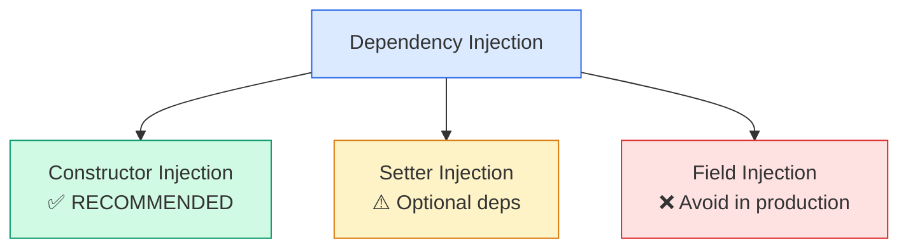
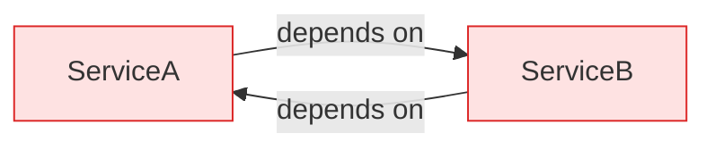

# 💉 Types of Dependency Injection

> **Constructor vs Setter vs Field injection — know when to use each and why constructor injection wins.**



---

## 🧠 What is Dependency Injection?

!!! abstract "In Simple Words"
    **Dependency Injection (DI)** is a design pattern where an object's dependencies are provided by an external entity (the Spring container) rather than created by the object itself. This makes your code loosely coupled, testable, and modular.

---

## 1️⃣ Constructor Injection (Recommended)

Dependencies are provided through the class constructor. The object **cannot** be created without its dependencies.

```java
@Service
public class OrderService {

    private final OrderRepository orderRepository;
    private final PaymentService paymentService;
    private final NotificationService notificationService;

    // Since Spring 4.3, @Autowired is optional for single constructor
    public OrderService(OrderRepository orderRepository,
                        PaymentService paymentService,
                        NotificationService notificationService) {
        this.orderRepository = orderRepository;
        this.paymentService = paymentService;
        this.notificationService = notificationService;
    }

    public void placeOrder(Order order) {
        orderRepository.save(order);
        paymentService.charge(order);
        notificationService.sendConfirmation(order);
    }
}
```

!!! tip "Why Constructor Injection is Preferred"
    - **Immutability** — Fields can be `final`, preventing accidental reassignment
    - **Completeness** — Object is always in a valid state (all dependencies present)
    - **Testability** — Easy to pass mocks via constructor in unit tests
    - **Fail-fast** — Missing dependencies cause errors at startup, not at runtime
    - **No reflection** — Works without Spring (plain Java instantiation)

---

## 2️⃣ Setter Injection

Dependencies are provided through setter methods **after** object construction.

```java
@Service
public class ReportService {

    private ReportFormatter formatter;
    private ReportExporter exporter;

    @Autowired
    public void setFormatter(ReportFormatter formatter) {
        this.formatter = formatter;
    }

    @Autowired(required = false) // Optional dependency
    public void setExporter(ReportExporter exporter) {
        this.exporter = exporter;
    }

    public void generateReport(Data data) {
        String report = formatter.format(data);
        if (exporter != null) {
            exporter.export(report);
        }
    }
}
```

!!! tip "When to Use Setter Injection"
    - When a dependency is **optional** (use `required = false`)
    - When you need to **reconfigure** a bean at runtime
    - For **circular dependencies** (as a workaround — see below)

---

## 3️⃣ Field Injection

Dependencies are injected directly into fields using reflection.

```java
@Service
public class UserService {

    @Autowired
    private UserRepository userRepository;

    @Autowired
    private PasswordEncoder passwordEncoder;

    public User createUser(String email, String password) {
        User user = new User(email, passwordEncoder.encode(password));
        return userRepository.save(user);
    }
}
```

!!! warning "Why Field Injection is Discouraged"
    - Cannot make fields `final` (no immutability)
    - Requires reflection — **cannot instantiate without Spring**
    - Hides dependencies (not visible in API)
    - Hard to test (need reflection or Spring test context)
    - Easy to add too many dependencies without noticing (no "constructor bloat" signal)

---

## 📊 Comparison Table

| Criteria | Constructor | Setter | Field |
|----------|:-----------:|:------:|:-----:|
| Immutability (`final` fields) | ✅ | ❌ | ❌ |
| Mandatory dependencies | ✅ | ❌ | ❌ |
| Optional dependencies | ❌ | ✅ | ✅ |
| Testable without Spring | ✅ | ✅ | ❌ |
| Clear dependency list | ✅ | ⚠️ | ❌ |
| Prevents circular deps | ✅ (fails fast) | ❌ | ❌ |
| Conciseness | ⚠️ (verbose) | ⚠️ | ✅ |
| **Recommended by Spring team** | **✅ YES** | For optional | **❌ NO** |

---

## 🔄 Circular Dependency Problem



### What Happens?

When two beans depend on each other via **constructor injection**, Spring cannot create either one first:

```java
// This causes BeanCurrentlyInCreationException!
@Service
public class ServiceA {
    private final ServiceB serviceB;
    public ServiceA(ServiceB serviceB) { this.serviceB = serviceB; }
}

@Service
public class ServiceB {
    private final ServiceA serviceA;
    public ServiceB(ServiceA serviceA) { this.serviceA = serviceA; }
}
```

### Solutions

=== "1. Redesign (Best)"

    ```java
    // Extract shared logic into a third service
    @Service
    public class SharedService {
        // Common logic that both A and B need
    }

    @Service
    public class ServiceA {
        private final SharedService sharedService;
        public ServiceA(SharedService sharedService) { this.sharedService = sharedService; }
    }

    @Service
    public class ServiceB {
        private final SharedService sharedService;
        public ServiceB(SharedService sharedService) { this.sharedService = sharedService; }
    }
    ```

=== "2. @Lazy (Quick Fix)"

    ```java
    @Service
    public class ServiceA {
        private final ServiceB serviceB;

        public ServiceA(@Lazy ServiceB serviceB) {
            // Injects a proxy; actual ServiceB created on first use
            this.serviceB = serviceB;
        }
    }
    ```

=== "3. Setter Injection (Workaround)"

    ```java
    @Service
    public class ServiceA {
        private ServiceB serviceB;

        @Autowired
        public void setServiceB(ServiceB serviceB) {
            this.serviceB = serviceB;
        }
    }
    ```

=== "4. ObjectFactory/Provider"

    ```java
    @Service
    public class ServiceA {
        private final ObjectFactory<ServiceB> serviceBFactory;

        public ServiceA(ObjectFactory<ServiceB> serviceBFactory) {
            this.serviceBFactory = serviceBFactory;
        }

        public void doSomething() {
            ServiceB serviceB = serviceBFactory.getObject();
            serviceB.execute();
        }
    }
    ```

!!! warning "Spring Boot 2.6+ Change"
    Since Spring Boot 2.6, circular dependencies are **prohibited by default**. You can enable them with `spring.main.allow-circular-references=true`, but this is strongly discouraged. Fix your design instead.

---

## 🧪 Testing Each Injection Type

=== "Constructor (Easy to Test)"

    ```java
    @Test
    void testOrderService() {
        // No Spring needed! Just plain Java.
        OrderRepository mockRepo = mock(OrderRepository.class);
        PaymentService mockPayment = mock(PaymentService.class);
        NotificationService mockNotif = mock(NotificationService.class);

        OrderService service = new OrderService(mockRepo, mockPayment, mockNotif);
        service.placeOrder(new Order());

        verify(mockRepo).save(any());
    }
    ```

=== "Field Injection (Painful to Test)"

    ```java
    @Test
    void testUserService() {
        UserService service = new UserService();
        // How do you set userRepository? It's private with no setter!
        
        // Option 1: Use Spring test context (slow)
        // Option 2: Use reflection (fragile)
        ReflectionTestUtils.setField(service, "userRepository", mockRepo);
    }
    ```

---

## 📏 Best Practices

!!! tip "Rules of Thumb"
    1. **Use constructor injection** for all mandatory dependencies
    2. **Use setter injection** only for truly optional dependencies
    3. **Never use field injection** in production code (acceptable in test classes)
    4. If your constructor has **too many parameters** (>5), it's a sign your class has too many responsibilities — refactor!
    5. Always make injected fields `final` with constructor injection

### Lombok Shortcut

```java
@Service
@RequiredArgsConstructor // Generates constructor for all final fields
public class OrderService {

    private final OrderRepository orderRepository;
    private final PaymentService paymentService;
    private final NotificationService notificationService;

    // No need to write constructor manually!
}
```

---

## 🎯 Interview Questions & Answers

??? question "1. Why is constructor injection recommended over field injection?"
    Constructor injection enables immutability (final fields), ensures all dependencies are provided at creation time (no null states), works without Spring (testable with plain Java), and makes dependencies explicit in the class API.

??? question "2. How do you handle circular dependencies in Spring?"
    Best approach: redesign to eliminate the cycle (extract shared logic into a third service). Quick fixes: use `@Lazy` on one dependency, use setter injection, or use `ObjectFactory`/`Provider`. Since Spring Boot 2.6, circular deps are banned by default.

??? question "3. Can you use @Autowired on a constructor?"
    Yes, but since Spring 4.3, if a class has **only one** constructor, `@Autowired` is optional — Spring uses it automatically. If there are multiple constructors, annotate the one Spring should use.

??? question "4. What happens if a required dependency is not available?"
    With constructor injection: `UnsatisfiedDependencyException` at startup (fail-fast). With `@Autowired` on setter/field: same exception unless `required = false` is set, in which case the field remains `null`.

??? question "5. What is the difference between @Autowired and @Inject?"
    `@Autowired` is Spring-specific and supports `required = false`. `@Inject` (Jakarta/JSR-330) is a standard annotation. Both work for DI in Spring, but `@Autowired` offers more features. Functionally, they are interchangeable in Spring.

??? question "6. How does Lombok's @RequiredArgsConstructor help with DI?"
    It generates a constructor for all `final` fields at compile time, eliminating boilerplate. Combined with constructor injection, you just declare `final` fields and Lombok does the rest — Spring auto-detects the generated constructor.

??? question "7. What is method injection and when would you use it?"
    Method injection (using `@Lookup`) is used when a singleton bean needs a new instance of a prototype-scoped bean on each method call. Spring overrides the lookup method to return a fresh prototype instance each time.
