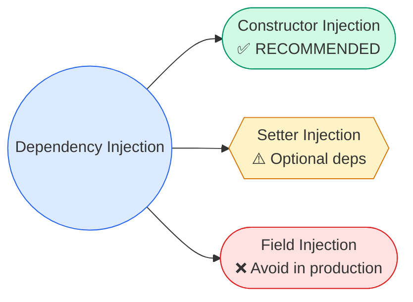
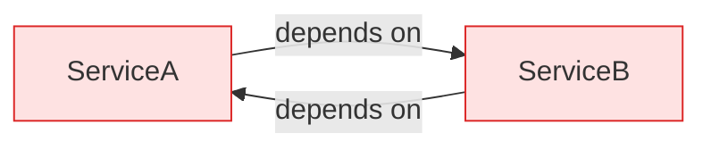

# Types of Dependency Injection

> **Constructor vs Setter vs Field — know when to use each and why constructor injection wins.**



---

## Constructor Injection (Recommended)

Dependencies provided via constructor. Object can't exist without them.

```java
@Service
public class OrderService {
    private final OrderRepository repo;
    private final PaymentService payments;
    private final NotificationService notifications;

    // @Autowired optional since Spring 4.3 (single constructor)
    public OrderService(OrderRepository repo,
                        PaymentService payments,
                        NotificationService notifications) {
        this.repo = repo;
        this.payments = payments;
        this.notifications = notifications;
    }
}
```

**Why it's preferred:**

- **Immutability** — Fields are `final`. Thread-safe by Java Memory Model guarantee. No accidental reassignment.
- **Completeness** — All deps available at creation. No partial state. No NPE at runtime.
- **Testable** — Pass mocks via constructor. No Spring context needed.
- **Fail-fast** — Missing bean → startup failure, not runtime NPE.
- **Design pressure** — Constructor with 8 parameters? Your class has too many responsibilities. SRP violation signal.

!!! info "Under the Hood"
    Spring calls the constructor reflectively via `BeanUtils.instantiateClass()`. It resolves each parameter from the container by type (then `@Qualifier`, `@Primary`, name). The object is fully constructed in one step — no intermediate "half-alive" state.

### Lombok Shortcut

```java
@Service
@RequiredArgsConstructor // generates constructor for all final fields
public class OrderService {
    private final OrderRepository repo;
    private final PaymentService payments;
    private final NotificationService notifications;
    // no boilerplate constructor needed
}
```

---

## Setter Injection

Dependencies set via setter methods AFTER construction. Object exists before its deps are available.

```java
@Service
public class ReportService {
    private ReportFormatter formatter;
    private ReportExporter exporter;

    @Autowired
    public void setFormatter(ReportFormatter formatter) {
        this.formatter = formatter;
    }

    @Autowired(required = false) // optional dependency
    public void setExporter(ReportExporter exporter) {
        this.exporter = exporter;
    }

    public void generate(Data data) {
        String report = formatter.format(data);
        if (exporter != null) exporter.export(report);
    }
}
```

**When to use:**

- Optional dependencies (`required = false`)
- Reconfigurable beans (JMX, runtime config changes)
- Breaking circular dependencies (workaround, not recommended)

!!! warning "Gotcha"
    Setter call order is NOT guaranteed by Spring. Don't depend on one setter running before another.

!!! warning "Gotcha"
    Fields aren't `final`. Another thread could see partially constructed state. Not inherently thread-safe.

---

## Field Injection (Avoid)

Dependencies injected directly via reflection. No constructor, no setter.

```java
@Service
public class UserService {
    @Autowired
    private UserRepository userRepo;

    @Autowired
    private PasswordEncoder encoder;
}
```

**Why it's popular:** Less boilerplate. One annotation per field.

**Why it's bad:**

- **Can't make fields `final`** — no immutability, no JMM guarantees
- **Requires reflection** — can't instantiate without Spring. Breaks in: unit tests, GraalVM native image, Java module system (`--add-opens` needed)
- **Hidden dependencies** — constructor shows you nothing. Easy to add 15 deps without noticing
- **Testing pain** — need `ReflectionTestUtils.setField()` or full Spring context

!!! danger "GraalVM Native Image"
    Field injection relies on `setAccessible(true)` reflection. GraalVM native compilation doesn't support arbitrary reflection. Constructor injection works out of the box.

---

## Method Injection (@Lookup)

Solves: singleton needs a **new** prototype instance on each method call.

```java
@Service
public abstract class OrderService {
    
    public void processOrder(OrderRequest request) {
        OrderProcessor processor = createProcessor(); // new prototype each time
        processor.process(request);
    }

    @Lookup
    protected abstract OrderProcessor createProcessor(); // Spring overrides via CGLIB subclass
}
```

Spring generates a CGLIB subclass at runtime that overrides `createProcessor()` to call `applicationContext.getBean(OrderProcessor.class)`.

**Alternative (preferred):** Use `ObjectProvider<T>` — doesn't require abstract class:

```java
@Service
public class OrderService {
    private final ObjectProvider<OrderProcessor> processorProvider;

    public OrderService(ObjectProvider<OrderProcessor> processorProvider) {
        this.processorProvider = processorProvider;
    }

    public void processOrder(OrderRequest request) {
        processorProvider.getObject().process(request); // new prototype each time
    }
}
```

---

## Comparison

| Criteria | Constructor | Setter | Field | @Lookup |
|----------|:-----------:|:------:|:-----:|:-------:|
| Immutability (`final`) | **Yes** | No | No | N/A |
| Mandatory deps | **Yes** | No | No | N/A |
| Optional deps | Via `@Nullable` | **Yes** | Yes | No |
| Testable without Spring | **Yes** | Yes | **No** | No |
| Visible dependencies | **Yes** | Partial | **No** | N/A |
| Detects circular deps | **Yes** (fail-fast) | No | No | No |
| GraalVM native | **Yes** | Yes | **No** | Yes |
| Spring team recommendation | **Yes** | Optional deps | **No** | Niche |

---

## @Autowired Resolution Order

When Spring resolves `@Autowired`, it follows this exact algorithm:

1. **Match by type** — find all beans assignable to the target type
2. **If multiple:** check `@Qualifier` on injection point → match by qualifier
3. **If still multiple:** check `@Primary` on candidates → use primary
4. **If still multiple:** match by parameter/field name against bean names
5. **If still ambiguous:** throw `NoUniqueBeanDefinitionException`

```java
@Service
public class AlertService {
    // Step 1: finds EmailSender and SmsSender (both NotificationSender)
    // Step 2: no @Qualifier
    // Step 3: EmailSender has @Primary → selected
    public AlertService(NotificationSender sender) { }
}
```

---

## Optional Dependencies

Three approaches:

=== "@Autowired(required = false)"

    ```java
    @Autowired(required = false)
    private MetricsService metrics; // null if no bean exists
    ```

=== "Optional<T>"

    ```java
    public OrderService(Optional<MetricsService> metrics) {
        this.metrics = metrics.orElse(null);
    }
    ```

=== "@Nullable"

    ```java
    public OrderService(@Nullable MetricsService metrics) {
        this.metrics = metrics; // null if absent
    }
    ```

**Best practice:** `Optional<T>` for constructor params. `@Autowired(required = false)` for setter/field.

---

## Collection Injection

```java
@Service
public class NotificationBroadcaster {
    private final List<NotificationSender> senders; // ALL implementations

    public NotificationBroadcaster(List<NotificationSender> senders) {
        this.senders = senders; // ordered by @Order
    }
}
```

```java
@Service
public class PluginManager {
    private final Map<String, Plugin> plugins; // bean name → instance

    public PluginManager(Map<String, Plugin> plugins) {
        this.plugins = plugins;
    }

    public Plugin getPlugin(String name) {
        return plugins.get(name);
    }
}
```

If no beans of that type exist: `List<T>` → empty list. `Map<String, T>` → empty map. No exception.

---

## Circular Dependencies



### Constructor Injection → Fails

```java
@Service
public class ServiceA {
    public ServiceA(ServiceB b) { } // needs B
}

@Service
public class ServiceB {
    public ServiceB(ServiceA a) { } // needs A → BeanCurrentlyInCreationException
}
```

Can't resolve. A needs B constructed first. B needs A constructed first. Deadlock.

### Setter/Field Injection → Works (via three-level cache)

Spring's singleton resolution uses three internal maps:

| Level | Map | Contents |
|-------|-----|----------|
| L1 | `singletonObjects` | Fully initialized beans |
| L2 | `earlySingletonObjects` | Partially constructed (deps not injected yet) |
| L3 | `singletonFactories` | `ObjectFactory` to produce early reference |

**Resolution flow:**

1. Create A. Put A's factory in L3.
2. Inject A's deps → needs B.
3. Create B. Put B's factory in L3.
4. Inject B's deps → needs A.
5. A found in L3 → factory called → early ref moved to L2.
6. B gets A's early ref. B completes → moved to L1.
7. A gets B (fully done). A completes → moved to L1.

### When Three-Level Cache Can't Help

- **Constructor cycles** — no early reference possible (object doesn't exist yet)
- **Prototype-scoped beans** — not cached at all
- **`@Async` beans** — proxy created in BPP.afterInit, but early reference is the raw object. Proxy ≠ raw → mismatch → error

### Fixes

=== "Redesign (Best)"

    ```java
    @Service
    public class SharedLogic { }

    @Service
    public class ServiceA {
        public ServiceA(SharedLogic shared) { }
    }

    @Service
    public class ServiceB {
        public ServiceB(SharedLogic shared) { }
    }
    ```

=== "@Lazy (Quick fix)"

    ```java
    @Service
    public class ServiceA {
        public ServiceA(@Lazy ServiceB b) { } // proxy injected, real B resolved on first use
    }
    ```

=== "ObjectFactory (Runtime resolution)"

    ```java
    @Service
    public class ServiceA {
        private final ObjectFactory<ServiceB> bFactory;

        public ServiceA(ObjectFactory<ServiceB> bFactory) {
            this.bFactory = bFactory;
        }

        public void doWork() {
            bFactory.getObject().execute(); // resolved lazily
        }
    }
    ```

!!! danger "Spring Boot 2.6+"
    Circular dependencies **banned by default**. `spring.main.allow-circular-references=true` re-enables them, but fix your design instead.

---

## Testing Each Type

=== "Constructor (Easy)"

    ```java
    @Test
    void testOrderService() {
        var repo = mock(OrderRepository.class);
        var payments = mock(PaymentService.class);
        var notif = mock(NotificationService.class);

        var service = new OrderService(repo, payments, notif); // plain Java
        service.process(new Order());
        verify(repo).save(any());
    }
    ```

=== "Field Injection (Painful)"

    ```java
    @Test
    void testUserService() {
        var service = new UserService();
        // userRepo is private, no setter, no constructor param
        ReflectionTestUtils.setField(service, "userRepo", mockRepo); // fragile
    }
    ```

---

## Interview Questions

??? question "1. Why is constructor injection preferred?"
    Immutability (`final` fields), completeness (no partial state), testability (no Spring needed), fail-fast (startup error, not runtime NPE), and design pressure (too many params = SRP violation).

??? question "2. Can you use @Autowired on a constructor?"
    Yes, but since Spring 4.3, optional for single-constructor classes. Multiple constructors → annotate the one Spring should use.

??? question "3. When would you legitimately use setter injection?"
    Optional dependencies, reconfigurable beans, breaking circular deps (workaround). Real-world: JMX-exposed config beans, optional monitoring/metrics integrations.

??? question "4. Why is field injection bad for GraalVM native images?"
    Field injection uses `setAccessible(true)` reflection. GraalVM AOT compilation doesn't support arbitrary reflection without explicit config. Constructor injection works natively.

??? question "5. How does @Lookup work internally?"
    Spring creates a CGLIB subclass that overrides the `@Lookup` method. The override calls `applicationContext.getBean()` to return a fresh prototype. Requires abstract method or non-final method.

??? question "6. Circular dependencies — when can Spring resolve them?"
    Setter/field injection on singletons — yes, via three-level cache. Constructor injection — no (object doesn't exist to create early reference). Prototype beans — no (not cached). `@Async` beans — problematic (proxy mismatch).

??? question "7. What is the three-level cache?"
    L1: `singletonObjects` (complete beans). L2: `earlySingletonObjects` (partially constructed). L3: `singletonFactories` (factories producing early references). Allows bean B to get an early ref to bean A while A is still being constructed.

??? question "8. @Autowired resolution order?"
    Type match → @Qualifier → @Primary → field/param name match → fail with `NoUniqueBeanDefinitionException`.

??? question "9. How do you inject all beans of a type?"
    `List<T>` — all implementations, ordered by `@Order`. `Map<String, T>` — bean name to instance. Empty collection if no beans exist (no exception).

??? question "10. Optional<T> vs @Autowired(required=false) vs @Nullable?"
    All handle absent beans. `Optional<T>` — most explicit, works with constructor injection. `required=false` — field/setter, null if absent. `@Nullable` — constructor param, null if absent. Prefer `Optional<T>` in constructor params.

??? question "11. What happens if @Autowired field is accessed in constructor?"
    `NullPointerException`. Field injection runs AFTER construction. Constructor injection doesn't have this problem.

??? question "12. What's the problem with @Async and circular dependencies?"
    `@Async` creates a proxy in BPP.afterInit. But the early reference exposed by three-level cache is the raw bean, not the proxy. When the proxy is created later, it doesn't match the early reference already injected into the other bean → `BeanCurrentlyInCreationException`.

??? question "13. @RequiredArgsConstructor — how does it work with Spring DI?"
    Lombok generates a constructor for all `final` fields at compile time. Spring detects this single constructor and uses it for DI. No `@Autowired` needed.

??? question "14. Setter call order — is it guaranteed?"
    No. Spring doesn't guarantee the order in which setters are called. Don't depend on one setter running before another.

??? question "15. Interface injection — does Spring support it?"
    No. Interface injection (Avalon, PicoContainer pattern) required implementing a `setDependency(Foo foo)` interface. Spring rejected this as too invasive. Only constructor, setter, and field injection are supported.
