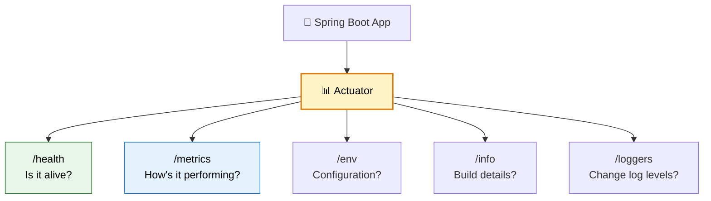

# 📊 Spring Boot Actuator

> **Production-ready features out of the box — health checks, metrics, environment info, and runtime diagnostics for your application.**

---

!!! abstract "Real-World Analogy"
    Think of a **car dashboard**. While driving, you see fuel level, engine temperature, speed, and warning lights — all without opening the hood. Spring Boot Actuator is your application's dashboard — it exposes operational information through HTTP endpoints so you can monitor without touching the code.



---

## 🚀 Setup

```xml
<dependency>
    <groupId>org.springframework.boot</groupId>
    <artifactId>spring-boot-starter-actuator</artifactId>
</dependency>
```

```yaml
management:
  endpoints:
    web:
      exposure:
        include: health,info,metrics,prometheus,loggers,env,beans,mappings
  endpoint:
    health:
      show-details: when_authorized
  info:
    env:
      enabled: true
```

---

## 🏥 Key Endpoints

| Endpoint | Purpose | Example |
|---|---|---|
| `/actuator/health` | Application health status | DB up? Redis up? Disk space? |
| `/actuator/metrics` | Application metrics | Request count, JVM memory |
| `/actuator/info` | Application info | Version, build time, git commit |
| `/actuator/env` | Configuration properties | Active profiles, property sources |
| `/actuator/loggers` | View/change log levels at runtime | Switch DEBUG on without restart |
| `/actuator/beans` | All Spring beans in context | Debug bean loading |
| `/actuator/mappings` | All request mappings | See all API routes |
| `/actuator/threaddump` | Thread dump | Debug deadlocks |
| `/actuator/heapdump` | Heap dump (download) | Debug memory issues |

---

## 🏥 Custom Health Indicators

```java
@Component
public class PaymentGatewayHealthIndicator implements HealthIndicator {

    private final PaymentGatewayClient client;

    @Override
    public Health health() {
        try {
            boolean reachable = client.ping();
            if (reachable) {
                return Health.up()
                    .withDetail("provider", "Stripe")
                    .withDetail("latency", "45ms")
                    .build();
            }
            return Health.down()
                .withDetail("error", "Gateway unreachable")
                .build();
        } catch (Exception e) {
            return Health.down(e).build();
        }
    }
}
```

Response at `/actuator/health`:
```json
{
  "status": "UP",
  "components": {
    "db": { "status": "UP", "details": { "database": "PostgreSQL" } },
    "redis": { "status": "UP" },
    "paymentGateway": { "status": "UP", "details": { "provider": "Stripe", "latency": "45ms" } },
    "diskSpace": { "status": "UP", "details": { "free": "50GB" } }
  }
}
```

---

## 📈 Custom Metrics

```java
@Service
public class OrderService {

    private final Counter orderCounter;
    private final Timer orderProcessingTimer;
    private final AtomicInteger activeOrders;

    public OrderService(MeterRegistry registry) {
        this.orderCounter = Counter.builder("orders.total")
            .description("Total orders placed")
            .tag("service", "order-service")
            .register(registry);

        this.orderProcessingTimer = Timer.builder("orders.processing.duration")
            .description("Time to process an order")
            .register(registry);

        this.activeOrders = registry.gauge("orders.active",
            new AtomicInteger(0));
    }

    public Order placeOrder(OrderRequest request) {
        activeOrders.incrementAndGet();
        try {
            return orderProcessingTimer.record(() -> {
                Order order = processOrder(request);
                orderCounter.increment();
                return order;
            });
        } finally {
            activeOrders.decrementAndGet();
        }
    }
}
```

Access via `/actuator/metrics/orders.total`:
```json
{
  "name": "orders.total",
  "measurements": [{ "statistic": "COUNT", "value": 1523.0 }],
  "availableTags": [{ "tag": "service", "values": ["order-service"] }]
}
```

---

## 🔄 Change Log Level at Runtime

```bash
# Check current level
curl http://localhost:8080/actuator/loggers/com.example.orderservice

# Change to DEBUG without restart!
curl -X POST http://localhost:8080/actuator/loggers/com.example.orderservice \
  -H "Content-Type: application/json" \
  -d '{"configuredLevel": "DEBUG"}'
```

---

## 🔐 Securing Actuator Endpoints

```java
@Configuration
public class ActuatorSecurityConfig {

    @Bean
    public SecurityFilterChain actuatorSecurity(HttpSecurity http) throws Exception {
        return http
            .securityMatcher("/actuator/**")
            .authorizeHttpRequests(auth -> auth
                .requestMatchers("/actuator/health", "/actuator/info").permitAll()
                .requestMatchers("/actuator/**").hasRole("OPS")
            )
            .httpBasic(Customizer.withDefaults())
            .build();
    }
}
```

!!! warning "Production Security"
    Never expose all actuator endpoints publicly. `/actuator/env` can leak secrets. `/actuator/heapdump` can expose everything in memory. Lock down sensitive endpoints behind authentication or restrict to internal network.

---

## 🎯 Interview Questions

??? question "1. What is Spring Boot Actuator?"
    A sub-project that provides production-ready operational endpoints for monitoring and managing Spring Boot applications. It exposes health checks, metrics, environment details, and allows runtime changes (like log levels) via HTTP or JMX.

??? question "2. How do you create a custom health indicator?"
    Implement `HealthIndicator` interface and override `health()`. Return `Health.up()` or `Health.down()` with details. Spring auto-discovers it and includes it in `/actuator/health`. Name it `<name>HealthIndicator` and it appears as `<name>` in the response.

??? question "3. How do you secure actuator endpoints in production?"
    Expose only `/health` and `/info` publicly. Require authentication for sensitive endpoints (`/env`, `/heapdump`, `/loggers`). Use Spring Security to restrict by role. Alternatively, run actuator on a different port (`management.server.port=9090`) and firewall it.

??? question "4. How do you integrate Actuator with Prometheus?"
    Add `micrometer-registry-prometheus` dependency. Expose `/actuator/prometheus` endpoint. Configure Prometheus to scrape that endpoint. All default JVM, HTTP, and custom metrics are automatically available in Prometheus format.

??? question "5. Can you change configuration at runtime without restart?"
    Log levels — yes, via `/actuator/loggers` POST endpoint. For other properties, use Spring Cloud Config with `/actuator/refresh` endpoint to reload external configuration. Feature flags can also be toggled at runtime.

