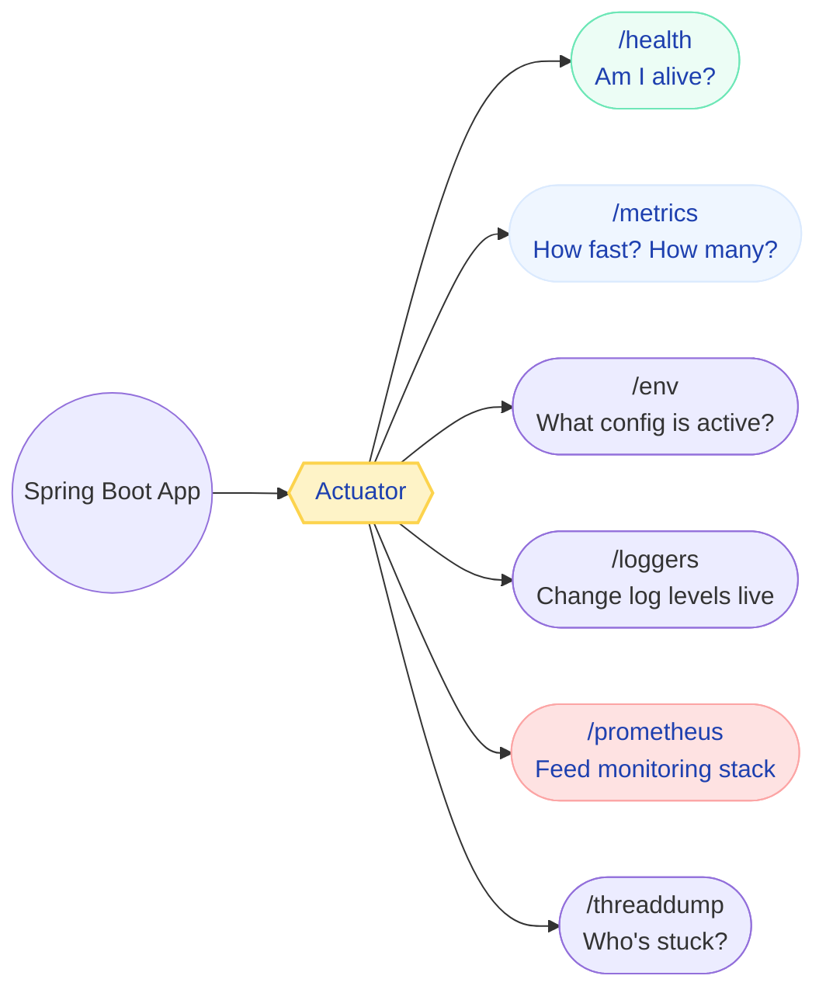
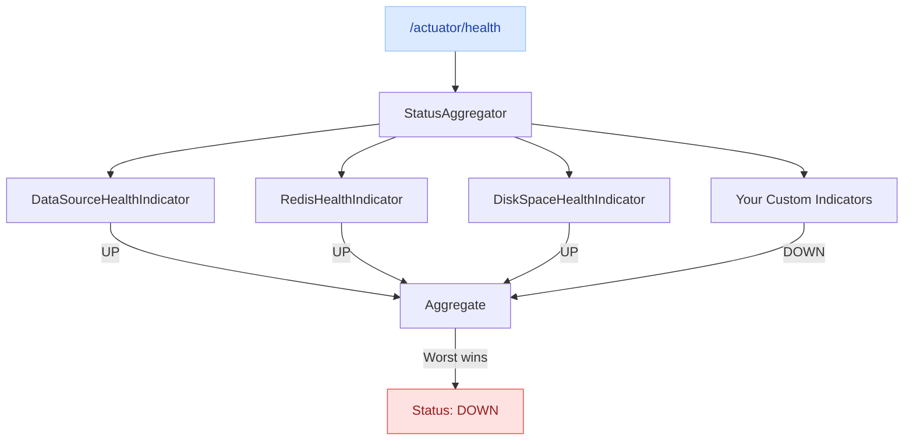
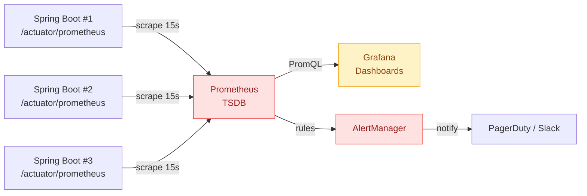
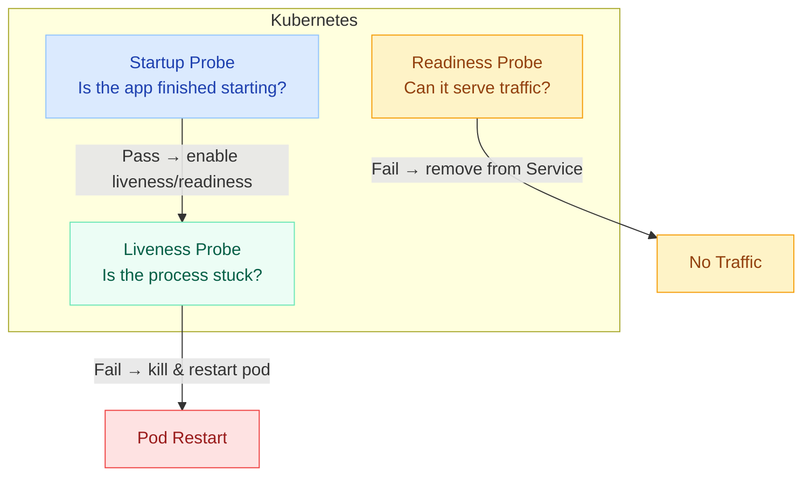
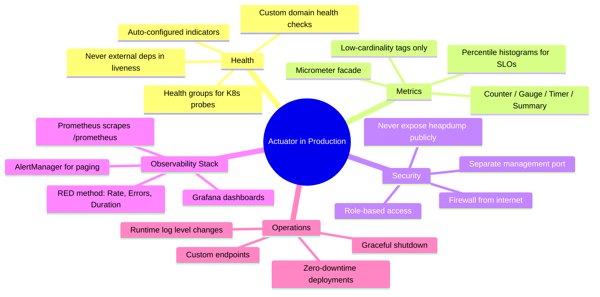

# Spring Boot Actuator

Actuator is how your production application talks back to you. When PagerDuty fires at 3 AM, these endpoints help you figure out if it's a connection pool issue, memory leak, or downstream failure — without SSH-ing into the box.

Think of it this way: you've spent months writing business logic, but in production, nobody cares about your elegant domain model when the service is returning 503s. They care about **why** — and Actuator gives you those answers through a standardized set of HTTP endpoints.

---

## What Actuator Actually Gives You



!!! tip "💡 One-liner for interviews"
    "Actuator adds production-ready operational endpoints to Spring Boot apps — health checks for load balancers, metrics for Prometheus, runtime diagnostics for debugging — all without writing custom controllers."

---

## Enabling and Configuring Actuator

### Dependencies

=== "Maven"

    ```xml
    <dependency>
        <groupId>org.springframework.boot</groupId>
        <artifactId>spring-boot-starter-actuator</artifactId>
    </dependency>
    
    <!-- For Prometheus metrics export -->
    <dependency>
        <groupId>io.micrometer</groupId>
        <artifactId>micrometer-registry-prometheus</artifactId>
    </dependency>
    ```

=== "Gradle"

    ```groovy
    implementation 'org.springframework.boot:spring-boot-starter-actuator'
    implementation 'io.micrometer:micrometer-registry-prometheus'
    ```

### Endpoint Exposure Configuration

By default, only `/health` is exposed over HTTP. Everything else requires explicit inclusion.

```yaml
management:
  endpoints:
    web:
      exposure:
        include: health,info,metrics,prometheus,loggers,env
        exclude: shutdown  # never accidentally expose this
      base-path: /actuator  # default, but be explicit
  endpoint:
    health:
      show-details: when_authorized
      probes:
        enabled: true
    info:
      env:
        enabled: true
```

### Management Port Separation

This is the most important production decision: run actuator on a separate port that's firewalled from the internet.

```yaml
management:
  server:
    port: 9090           # separate from app port 8080
    address: 0.0.0.0     # reachable within cluster
    ssl:
      enabled: false     # internal traffic, TLS terminated at ingress
```

!!! example "🎯 Interview Tip"
    When asked "How do you secure actuator in production?" — lead with management port separation. It's the strongest control because it's network-level, not application-level. An attacker who compromises your app port 8080 still can't reach actuator on 9090 if the firewall blocks it.

---

## Health Endpoint Deep Dive

The `/actuator/health` endpoint is the most critical actuator feature. Load balancers query it to decide if they should route traffic. Kubernetes uses it to decide if your pod lives or dies.

### How Health Status Works



### Status Values and HTTP Codes

| Status | HTTP Code | Meaning |
|--------|-----------|---------|
| `UP` | 200 | Component is functioning normally |
| `DOWN` | 503 | Component has failed |
| `OUT_OF_SERVICE` | 503 | Component taken offline deliberately |
| `UNKNOWN` | 200 | Status cannot be determined |

### show-details Options

| Value | Behavior | Use Case |
|-------|----------|----------|
| `never` | Only shows top-level status | Public-facing health check |
| `when_authorized` | Full details for authenticated users | Production default |
| `always` | Full details for everyone | Development/internal only |

### Auto-Configured Health Indicators

Spring Boot automatically registers these when their dependencies are on the classpath:

| Indicator | Triggers When | What It Checks |
|-----------|---------------|----------------|
| `DataSourceHealthIndicator` | DataSource bean exists | Executes validation query (`SELECT 1`) |
| `DiskSpaceHealthIndicator` | Always | Free disk > threshold (default 10MB) |
| `RedisHealthIndicator` | Redis dependency present | `PING` command to Redis |
| `KafkaHealthIndicator` | Kafka dependency present | Broker cluster ID retrieval |
| `MongoHealthIndicator` | Mongo dependency present | Admin command execution |
| `ElasticsearchRestHealthIndicator` | ES client present | Cluster health API call |
| `RabbitHealthIndicator` | RabbitMQ present | Connection and channel check |
| `MailHealthIndicator` | JavaMailSender exists | SMTP connection test |

### Health Groups

Groups let you partition indicators for different consumers. This is critical for Kubernetes.

```yaml
management:
  endpoint:
    health:
      group:
        liveness:
          include: livenessState
          show-details: always
        readiness:
          include: readinessState, db, redis, paymentGateway
          show-details: always
        critical:
          include: db, paymentGateway, kafka
          show-details: when_authorized
```

Now you get separate endpoints:

- `/actuator/health/liveness` — for Kubernetes liveness probe
- `/actuator/health/readiness` — for Kubernetes readiness probe
- `/actuator/health/critical` — for your alerting system

---

## Custom Health Indicators

This is where Actuator becomes powerful for your specific domain. An e-commerce platform doesn't just need "is the database alive?" — it needs "can we actually process payments right now?"

### Payment Gateway Health Check

```java
@Component
public class PaymentGatewayHealthIndicator implements HealthIndicator {

    private final PaymentGatewayClient gatewayClient;
    private final CircuitBreaker circuitBreaker;

    public PaymentGatewayHealthIndicator(PaymentGatewayClient gatewayClient,
                                          CircuitBreaker circuitBreaker) {
        this.gatewayClient = gatewayClient;
        this.circuitBreaker = circuitBreaker;
    }

    @Override
    public Health health() {
        // If circuit breaker is open, don't even try — we already know it's down
        if (circuitBreaker.getState() == CircuitBreaker.State.OPEN) {
            return Health.down()
                .withDetail("reason", "Circuit breaker OPEN")
                .withDetail("provider", "Stripe")
                .withDetail("failureCount", circuitBreaker.getMetrics().getNumberOfFailedCalls())
                .withDetail("waitDuration", circuitBreaker.getCircuitBreakerConfig()
                    .getWaitDurationInOpenState().toSeconds() + "s")
                .build();
        }

        try {
            long start = System.nanoTime();
            GatewayStatus status = gatewayClient.healthCheck();
            long latencyMs = (System.nanoTime() - start) / 1_000_000;

            if (status.isHealthy() && latencyMs < 2000) {
                return Health.up()
                    .withDetail("provider", "Stripe")
                    .withDetail("latencyMs", latencyMs)
                    .withDetail("apiVersion", status.getApiVersion())
                    .build();
            } else if (status.isHealthy()) {
                // Healthy but slow — degraded
                return Health.status("DEGRADED")
                    .withDetail("provider", "Stripe")
                    .withDetail("latencyMs", latencyMs)
                    .withDetail("warning", "Response time exceeds 2000ms threshold")
                    .build();
            }
            return Health.down()
                .withDetail("provider", "Stripe")
                .withDetail("error", status.getErrorMessage())
                .build();
        } catch (Exception e) {
            return Health.down(e)
                .withDetail("provider", "Stripe")
                .build();
        }
    }
}
```

### Order Queue Depth Health Check

```java
@Component
public class OrderQueueHealthIndicator implements HealthIndicator {

    private final KafkaConsumer<String, String> consumer;
    private static final long LAG_THRESHOLD_WARNING = 10_000;
    private static final long LAG_THRESHOLD_CRITICAL = 50_000;

    @Override
    public Health health() {
        try {
            Map<TopicPartition, Long> endOffsets = consumer.endOffsets(
                consumer.assignment());
            
            long totalLag = 0;
            for (TopicPartition partition : consumer.assignment()) {
                long currentOffset = consumer.position(partition);
                long endOffset = endOffsets.get(partition);
                totalLag += (endOffset - currentOffset);
            }

            Health.Builder builder = totalLag < LAG_THRESHOLD_WARNING
                ? Health.up()
                : totalLag < LAG_THRESHOLD_CRITICAL
                    ? Health.status("DEGRADED")
                    : Health.down();

            return builder
                .withDetail("consumerGroup", "order-processor")
                .withDetail("totalLag", totalLag)
                .withDetail("partitions", consumer.assignment().size())
                .withDetail("threshold_warning", LAG_THRESHOLD_WARNING)
                .withDetail("threshold_critical", LAG_THRESHOLD_CRITICAL)
                .build();
        } catch (Exception e) {
            return Health.down(e).build();
        }
    }
}
```

### Composite Health Response

With custom indicators, your `/actuator/health` response tells the full story:

```json
{
  "status": "UP",
  "components": {
    "db": {
      "status": "UP",
      "details": {
        "database": "PostgreSQL",
        "validationQuery": "isValid()"
      }
    },
    "diskSpace": {
      "status": "UP",
      "details": { "total": "500GB", "free": "312GB", "threshold": "10MB" }
    },
    "orderQueue": {
      "status": "UP",
      "details": {
        "consumerGroup": "order-processor",
        "totalLag": 234,
        "partitions": 12
      }
    },
    "paymentGateway": {
      "status": "UP",
      "details": {
        "provider": "Stripe",
        "latencyMs": 87,
        "apiVersion": "2024-06-20"
      }
    },
    "redis": { "status": "UP" }
  }
}
```

!!! warning "🔥 Production War Story"
    A team put their payment gateway health check in the **liveness** probe group. When Stripe had a 30-minute outage, Kubernetes restarted every pod in the cluster — repeatedly. The pods came back, failed liveness (Stripe was still down), and got killed again. Restart loop. The entire service was down even though the only issue was payment processing — browsing, cart, search all would have worked fine. **Never put external dependencies in liveness.**

---

## Metrics with Micrometer

Micrometer is the metrics facade that ships with Actuator. Think of it as SLF4J for metrics — you write to one API, and it publishes to Prometheus, Datadog, CloudWatch, New Relic, or any of 15+ monitoring backends through pluggable registries.

### Metric Types

| Type | What It Measures | Use When | Example |
|------|-----------------|----------|---------|
| **Counter** | Monotonically increasing count | Counting events that only go up | Total orders placed, total errors |
| **Gauge** | Point-in-time value that goes up AND down | Current state | Active connections, queue size, cache size |
| **Timer** | Duration + invocation count | How long things take | Request latency, DB query time |
| **DistributionSummary** | Distribution of values (non-time) | Size/amount distributions | Request payload size, order amounts |

### Auto-Configured Metrics (Free)

Without writing any code, you get:

| Category | Metrics | Why It Matters |
|----------|---------|----------------|
| **JVM Memory** | Heap used/max, non-heap, buffer pools | Detect memory leaks, tune GC |
| **JVM GC** | Pause duration, collection count | GC causing latency spikes? |
| **JVM Threads** | Live, daemon, peak, states | Thread leaks, deadlocks |
| **HTTP Server** | Request count, duration by URI/method/status | SLI for latency and error rate |
| **Connection Pool** | Active, idle, max, wait time (HikariCP) | Pool exhaustion detection |
| **Cache** | Hits, misses, evictions, size | Cache hit ratio degradation |
| **Tomcat/Jetty** | Active sessions, request processing time | Server saturation |

!!! tip "💡 One-liner for interviews"
    "Micrometer is a vendor-neutral metrics facade — like SLF4J for metrics. You instrument once with Micrometer's API, then swap backends (Prometheus, Datadog, CloudWatch) by changing a dependency, not your code."

---

## Custom Metrics — Real E-Commerce Examples

### Orders Per Minute Counter

```java
@Service
public class OrderService {

    private final Counter orderCounter;
    private final Counter failedOrderCounter;
    private final Timer orderProcessingTimer;
    private final AtomicInteger activeOrders;
    private final DistributionSummary orderValueSummary;

    public OrderService(MeterRegistry registry) {
        this.orderCounter = Counter.builder("orders.placed.total")
            .description("Total number of orders successfully placed")
            .tag("service", "order-service")
            .register(registry);

        this.failedOrderCounter = Counter.builder("orders.failed.total")
            .description("Total number of failed order attempts")
            .tag("service", "order-service")
            .register(registry);

        this.orderProcessingTimer = Timer.builder("orders.processing.duration")
            .description("Time taken to process an order end-to-end")
            .publishPercentiles(0.5, 0.95, 0.99)   // client-side percentiles
            .publishPercentileHistogram()            // server-side histogram for Prometheus
            .serviceLevelObjectives(                 // SLO buckets
                Duration.ofMillis(100),
                Duration.ofMillis(500),
                Duration.ofSeconds(1),
                Duration.ofSeconds(5)
            )
            .register(registry);

        this.activeOrders = registry.gauge("orders.active.count",
            new AtomicInteger(0));

        this.orderValueSummary = DistributionSummary.builder("orders.value.usd")
            .description("Distribution of order monetary values")
            .baseUnit("usd")
            .publishPercentiles(0.5, 0.9, 0.99)
            .scale(0.01)  // convert cents to dollars
            .register(registry);
    }

    public Order placeOrder(OrderRequest request) {
        activeOrders.incrementAndGet();
        try {
            return orderProcessingTimer.record(() -> {
                Order order = processOrder(request);
                orderCounter.increment();
                orderValueSummary.record(order.getTotalAmountCents());
                return order;
            });
        } catch (Exception e) {
            failedOrderCounter.increment();
            throw e;
        } finally {
            activeOrders.decrementAndGet();
        }
    }
}
```

### Using @Timed for Declarative Metrics

```java
@RestController
@RequestMapping("/api/orders")
public class OrderController {

    @Timed(value = "http.orders.create",
           description = "Order creation endpoint",
           percentiles = {0.5, 0.95, 0.99})
    @PostMapping
    public ResponseEntity<Order> createOrder(@RequestBody OrderRequest request) {
        return ResponseEntity.ok(orderService.placeOrder(request));
    }

    @Timed(value = "http.orders.search",
           percentiles = {0.5, 0.95, 0.99})
    @GetMapping("/search")
    public ResponseEntity<Page<Order>> searchOrders(OrderSearchCriteria criteria) {
        return ResponseEntity.ok(orderService.search(criteria));
    }
}
```

Register the aspect:

```java
@Configuration
public class MetricsConfig {

    @Bean
    public TimedAspect timedAspect(MeterRegistry registry) {
        return new TimedAspect(registry);
    }
}
```

### Accessing Metrics via the Endpoint

```bash
# List all available metrics
curl http://localhost:9090/actuator/metrics

# Get specific metric
curl http://localhost:9090/actuator/metrics/orders.placed.total
```

```json
{
  "name": "orders.placed.total",
  "measurements": [{ "statistic": "COUNT", "value": 15234.0 }],
  "availableTags": [
    { "tag": "service", "values": ["order-service"] }
  ]
}
```

!!! danger "⚠️ What breaks"
    **Metric cardinality explosion.** If you tag metrics with high-cardinality values (user IDs, request UUIDs, full URL paths), each unique combination creates a separate time series. Tag `userId` across 1M users? That's 1M time series for a single metric. Prometheus memory balloons, queries time out, Grafana dashboards freeze. **Always use bounded, low-cardinality tags:** HTTP method, status code, endpoint pattern — never the full path with path variables resolved.

---

## Prometheus + Grafana Integration

This is the standard observability stack for Spring Boot in production. Actuator feeds Prometheus, Prometheus feeds Grafana, Grafana fires alerts.

### Architecture



### Spring Boot Configuration for Prometheus

```yaml
management:
  endpoints:
    web:
      exposure:
        include: health,info,prometheus
  metrics:
    export:
      prometheus:
        enabled: true
    distribution:
      percentiles-histogram:
        http.server.requests: true
      slo:
        http.server.requests: 50ms, 100ms, 200ms, 500ms, 1s, 5s
    tags:
      application: ${spring.application.name}
      environment: ${DEPLOY_ENV:local}
      instance: ${HOSTNAME:unknown}
```

### Prometheus Scrape Configuration

=== "Static Targets"

    ```yaml
    # prometheus.yml
    scrape_configs:
      - job_name: 'spring-boot-apps'
        metrics_path: '/actuator/prometheus'
        scrape_interval: 15s
        static_configs:
          - targets: ['order-service:9090', 'payment-service:9090']
            labels:
              team: 'commerce'
    ```

=== "Kubernetes Service Discovery"

    ```yaml
    scrape_configs:
      - job_name: 'kubernetes-pods'
        kubernetes_sd_configs:
          - role: pod
        relabel_configs:
          - source_labels: [__meta_kubernetes_pod_annotation_prometheus_io_scrape]
            action: keep
            regex: true
          - source_labels: [__meta_kubernetes_pod_annotation_prometheus_io_path]
            action: replace
            target_label: __metrics_path__
            regex: (.+)
          - source_labels: [__meta_kubernetes_pod_annotation_prometheus_io_port]
            action: replace
            target_label: __address__
            regex: (.+)
            replacement: ${1}:${2}
    ```

### Essential PromQL Queries for Grafana Dashboards

```promql
# Request rate per second (RED method - Rate)
rate(http_server_requests_seconds_count{uri!~"/actuator.*"}[5m])

# 95th percentile latency (RED method - Duration)
histogram_quantile(0.95, 
  sum(rate(http_server_requests_seconds_bucket[5m])) by (le, uri))

# Error rate percentage (RED method - Errors)
100 * sum(rate(http_server_requests_seconds_count{status=~"5.."}[5m]))
  / sum(rate(http_server_requests_seconds_count[5m]))

# JVM heap utilization percentage
100 * jvm_memory_used_bytes{area="heap"} 
  / jvm_memory_max_bytes{area="heap"}

# HikariCP connection pool saturation
hikaricp_connections_active / hikaricp_connections_max

# GC pause duration (p99)
histogram_quantile(0.99, rate(jvm_gc_pause_seconds_bucket[5m]))

# Custom: orders per minute
rate(orders_placed_total[1m]) * 60

# Custom: order failure rate
rate(orders_failed_total[5m]) / rate(orders_placed_total[5m])
```

### Alert Rules

```yaml
# prometheus-alerts.yml
groups:
  - name: spring-boot-alerts
    rules:
      - alert: HighErrorRate
        expr: |
          sum(rate(http_server_requests_seconds_count{status=~"5.."}[5m]))
          / sum(rate(http_server_requests_seconds_count[5m])) > 0.05
        for: 5m
        labels:
          severity: critical
        annotations:
          summary: "Error rate above 5% for 5 minutes"
          
      - alert: HighLatency
        expr: |
          histogram_quantile(0.95, 
            sum(rate(http_server_requests_seconds_bucket[5m])) by (le)) > 2
        for: 5m
        labels:
          severity: warning
        annotations:
          summary: "P95 latency above 2 seconds"

      - alert: ConnectionPoolExhaustion
        expr: hikaricp_connections_active / hikaricp_connections_max > 0.9
        for: 2m
        labels:
          severity: critical
        annotations:
          summary: "Connection pool >90% utilized — likely exhaustion imminent"

      - alert: OrderProcessingBacklog
        expr: orders_active_count > 100
        for: 5m
        labels:
          severity: warning
        annotations:
          summary: "Over 100 orders actively processing — possible bottleneck"
```

!!! warning "🔥 Production War Story"
    A team set their scrape interval to 5 seconds across 200 microservices. Each scrape returned ~3000 metrics. That's 200 * 3000 * 12 = **7.2 million samples/minute** ingested into Prometheus. Their Prometheus instance OOM'd within hours. The fix: 15s scrape interval (industry standard), and using recording rules for pre-computed aggregations instead of real-time computation.

---

## Info Endpoint

The `/actuator/info` endpoint is your deployment verification tool. After a deployment, hit this endpoint to confirm the right version is running.

### Build Info

Add to your build:

=== "Maven"

    ```xml
    <plugin>
        <groupId>org.springframework.boot</groupId>
        <artifactId>spring-boot-maven-plugin</artifactId>
        <executions>
            <execution>
                <goals>
                    <goal>build-info</goal>
                </goals>
            </execution>
        </executions>
    </plugin>
    ```

=== "Gradle"

    ```groovy
    springBoot {
        buildInfo()
    }
    ```

### Git Info

Add the Git info plugin:

```xml
<plugin>
    <groupId>io.github.git-commit-id</groupId>
    <artifactId>git-commit-id-maven-plugin</artifactId>
</plugin>
```

### Custom Info Contributors

```java
@Component
public class AppInfoContributor implements InfoContributor {

    @Override
    public void contribute(Info.Builder builder) {
        builder.withDetail("app", Map.of(
            "name", "Order Service",
            "team", "Commerce Platform",
            "oncall", "commerce-oncall@company.com",
            "runbook", "https://wiki.internal/runbooks/order-service",
            "sla", "99.95% availability, p99 < 500ms"
        ));
    }
}
```

### Info Response

```json
{
  "app": {
    "name": "Order Service",
    "team": "Commerce Platform",
    "oncall": "commerce-oncall@company.com",
    "runbook": "https://wiki.internal/runbooks/order-service"
  },
  "build": {
    "artifact": "order-service",
    "version": "2.4.1",
    "time": "2024-11-15T10:30:00Z"
  },
  "git": {
    "branch": "main",
    "commit": {
      "id": "a1b2c3d",
      "time": "2024-11-15T10:25:00Z"
    }
  }
}
```

---

## Logger Endpoint — Runtime Log Level Changes

This is your escape hatch for production debugging. Instead of redeploying with `DEBUG` logging enabled (which takes minutes and might not reproduce the issue), change it in real-time.

### View Current Levels

```bash
# See all loggers
curl http://localhost:9090/actuator/loggers

# Check specific logger
curl http://localhost:9090/actuator/loggers/com.example.orderservice
```

```json
{
  "configuredLevel": null,
  "effectiveLevel": "INFO"
}
```

### Change Level at Runtime

```bash
# Enable DEBUG for a specific package — takes effect immediately
curl -X POST http://localhost:9090/actuator/loggers/com.example.orderservice.payment \
  -H "Content-Type: application/json" \
  -d '{"configuredLevel": "DEBUG"}'

# Enable TRACE for Hibernate SQL (see actual queries)
curl -X POST http://localhost:9090/actuator/loggers/org.hibernate.SQL \
  -H "Content-Type: application/json" \
  -d '{"configuredLevel": "DEBUG"}'

# Reset to default when done debugging
curl -X POST http://localhost:9090/actuator/loggers/com.example.orderservice.payment \
  -H "Content-Type: application/json" \
  -d '{"configuredLevel": null}'
```

!!! danger "⚠️ What breaks"
    Two risks: (1) An attacker sets root logger to `OFF` — now you can't see error logs, and your alerting (which depends on log patterns) goes blind. (2) Someone enables `TRACE` on `org.springframework` in production — the log volume overwhelms your ELK stack and fills disk. **Always secure this endpoint with role-based access.**

!!! question "❓ Counter-questions"
    **Q: "How do you debug production issues without being able to reproduce them locally?"**
    
    A: Change log levels at runtime via `/actuator/loggers`. Set the relevant package to DEBUG, reproduce the issue, capture the logs, then reset the level. Combined with distributed tracing (correlation IDs), you can trace a specific request through all service calls without redeploying.

---

## Environment Endpoint

The `/actuator/env` endpoint shows every property source and its precedence. Invaluable when debugging "why is my app using the wrong database URL?"

### What It Exposes

```bash
curl http://localhost:9090/actuator/env
```

Returns all property sources in order of precedence:

1. Command line arguments
2. System properties
3. OS environment variables
4. Application properties (profile-specific)
5. Application properties (default)

### Property Source Debugging

```bash
# Check a specific property
curl http://localhost:9090/actuator/env/spring.datasource.url
```

```json
{
  "property": {
    "source": "Config resource 'application-prod.yml'",
    "value": "jdbc:postgresql://prod-db:5432/orders"
  }
}
```

### Sanitization

Spring Boot automatically masks sensitive values:

```yaml
management:
  endpoint:
    env:
      keys-to-sanitize: 
        - password
        - secret
        - key
        - token
        - credential
        - api-key
```

Properties matching these patterns show `******` instead of actual values.

!!! danger "⚠️ What breaks"
    Sanitization only catches known key patterns. A property named `stripe.webhook.signing` won't be sanitized because it doesn't match `password`, `secret`, `key`, or `token`. **Never expose `/env` publicly.** Keep it behind authentication on the management port, or disable it entirely: `management.endpoint.env.enabled=false`.

---

## Thread Dump and Heap Dump

### Thread Dump — Diagnose Deadlocks

```bash
curl http://localhost:9090/actuator/threaddump
```

Returns all JVM threads with their state, stack trace, and lock information. Look for:

- **BLOCKED** threads — waiting for a monitor lock (possible deadlock)
- **WAITING** on `java.util.concurrent` primitives — possible starvation
- Many threads stuck on the same stack frame — bottleneck identified

### Heap Dump — Diagnose Memory Leaks

```bash
# Downloads binary HPROF file
curl -o heapdump.hprof http://localhost:9090/actuator/heapdump
```

Open with Eclipse MAT (Memory Analyzer Tool) or VisualVM to find:

- Which objects consume the most memory
- Object retention paths (who's holding references)
- Suspected leak candidates

!!! warning "🔥 Production War Story"
    A service was OOM-killing every 4 hours. Grabbed a heap dump via actuator (the 5 seconds before it became available was enough). Eclipse MAT showed 2GB of `HashMap` entries inside a "cache" that never evicted. Someone used `HashMap` instead of a bounded cache. The fix: replace with Caffeine cache with `maximumSize(10000)`. Five-line fix found via a single actuator endpoint.

!!! danger "⚠️ What breaks"
    Heap dumps contain **everything in memory**: database passwords, JWT signing keys, user session data, API keys. If an attacker downloads your heap dump, they own your secrets. Never expose `/heapdump` publicly. Restrict to admin role on internal management port only.

---

## Kubernetes Integration

Actuator is designed to work seamlessly with Kubernetes health probes. This section covers the correct way to set it up.

### The Three Probe Types



### Spring Boot Configuration

```yaml
management:
  endpoint:
    health:
      probes:
        enabled: true  # enables /health/liveness and /health/readiness
      group:
        liveness:
          include: livenessState
          # ONLY JVM-internal checks. Never external dependencies.
        readiness:
          include: readinessState, db, redis, kafka
          # Dependencies needed to serve traffic
  server:
    port: 9090
```

### Kubernetes Deployment YAML

```yaml
apiVersion: apps/v1
kind: Deployment
metadata:
  name: order-service
spec:
  template:
    spec:
      containers:
        - name: order-service
          ports:
            - containerPort: 8080
              name: http
            - containerPort: 9090
              name: management
          startupProbe:
            httpGet:
              path: /actuator/health/liveness
              port: management
            initialDelaySeconds: 10
            periodSeconds: 5
            failureThreshold: 30  # 30 * 5s = 150s max startup time
          livenessProbe:
            httpGet:
              path: /actuator/health/liveness
              port: management
            periodSeconds: 10
            timeoutSeconds: 5
            failureThreshold: 3
          readinessProbe:
            httpGet:
              path: /actuator/health/readiness
              port: management
            periodSeconds: 5
            timeoutSeconds: 3
            failureThreshold: 3
```

### Graceful Shutdown

```yaml
# application.yml
server:
  shutdown: graceful

spring:
  lifecycle:
    timeout-per-shutdown-phase: 30s
```

When a pod receives SIGTERM:

1. Readiness probe immediately returns DOWN (removed from Service)
2. In-flight requests are allowed to complete (up to 30s)
3. No new requests arrive (pod removed from load balancer)
4. After timeout or all requests complete, JVM shuts down

!!! example "🎯 Interview Tip"
    "Graceful shutdown combined with readiness probes ensures zero-downtime deployments. The pod signals it's not ready FIRST, waits for in-flight requests to drain, THEN shuts down. Without this, active requests get connection-reset errors during rolling updates."

---

## Security — What to Expose and What to Lock Down

### The Security Decision Matrix

| Endpoint | Public Internet? | Internal Network? | Authenticated Only? |
|----------|-----------------|-------------------|-------------------|
| `/health` (status only) | Yes | Yes | No |
| `/health` (with details) | **No** | Yes | Yes |
| `/info` | Depends on data | Yes | No |
| `/prometheus` | **No** | Yes | No (Prometheus scraper) |
| `/loggers` (read) | **No** | Yes | Yes (OPS role) |
| `/loggers` (write) | **No** | **No** | Yes (OPS role) |
| `/env` | **Never** | Restricted | Yes (ADMIN role) |
| `/heapdump` | **Never** | **Never** | Yes (ADMIN role) |
| `/threaddump` | **Never** | Restricted | Yes (ADMIN role) |
| `/beans` | **Never** | Restricted | Yes (ADMIN role) |
| `/shutdown` | **Never** | **Never** | **Disable entirely** |

### Strategy 1: Separate Management Port (Recommended)

```yaml
management:
  server:
    port: 9090
    address: 0.0.0.0  # reachable within cluster
  endpoints:
    web:
      exposure:
        include: health,info,metrics,prometheus,loggers
```

Firewall rule: only internal network (10.x.x.x) can reach port 9090. Public internet only reaches port 8080 (your app).

### Strategy 2: Spring Security Role-Based Access

```java
@Configuration
@EnableWebSecurity
public class ActuatorSecurityConfig {

    @Bean
    @Order(1)  // higher priority than main security config
    public SecurityFilterChain actuatorSecurity(HttpSecurity http) throws Exception {
        return http
            .securityMatcher("/actuator/**")
            .authorizeHttpRequests(auth -> auth
                .requestMatchers("/actuator/health").permitAll()
                .requestMatchers("/actuator/health/**").permitAll()
                .requestMatchers("/actuator/info").permitAll()
                .requestMatchers("/actuator/prometheus").hasRole("MONITORING")
                .requestMatchers("/actuator/loggers/**").hasRole("OPS")
                .requestMatchers("/actuator/env/**").hasRole("ADMIN")
                .requestMatchers("/actuator/heapdump").hasRole("ADMIN")
                .requestMatchers("/actuator/threaddump").hasRole("ADMIN")
                .requestMatchers("/actuator/**").hasRole("ADMIN")
            )
            .httpBasic(Customizer.withDefaults())
            .csrf(csrf -> csrf.disable())  // actuator endpoints don't need CSRF
            .build();
    }
}
```

### Strategy 3: Combined (Zero Trust)

```yaml
management:
  server:
    port: 9090
    ssl:
      enabled: true
      key-store: classpath:management-keystore.p12
      key-store-password: ${MGMT_KEYSTORE_PASS}
      client-auth: need  # mTLS — only clients with valid certs can connect
```

This gives you actuator on a separate port with mutual TLS. Only Prometheus (with a valid client cert) can scrape metrics.

---

## Custom Endpoints

When built-in endpoints don't cover your needs, create your own. This is useful for feature flags, circuit breaker status, cache management, or any operational API.

### Feature Flag Endpoint

```java
@Component
@Endpoint(id = "features")
public class FeatureFlagEndpoint {

    private final FeatureFlagService featureService;

    public FeatureFlagEndpoint(FeatureFlagService featureService) {
        this.featureService = featureService;
    }

    @ReadOperation
    public Map<String, FeatureStatus> getAllFeatures() {
        return featureService.getAllFlags().stream()
            .collect(Collectors.toMap(
                FeatureFlag::getName,
                f -> new FeatureStatus(f.isEnabled(), f.getRolloutPercentage(),
                    f.getLastModified())
            ));
    }

    @ReadOperation
    public FeatureStatus getFeature(@Selector String name) {
        FeatureFlag flag = featureService.getFlag(name)
            .orElseThrow(() -> new IllegalArgumentException("Unknown feature: " + name));
        return new FeatureStatus(flag.isEnabled(), flag.getRolloutPercentage(),
            flag.getLastModified());
    }

    @WriteOperation
    public void toggleFeature(@Selector String name, boolean enabled) {
        featureService.setEnabled(name, enabled);
    }

    @DeleteOperation
    public void removeFeature(@Selector String name) {
        featureService.removeFlag(name);
    }

    record FeatureStatus(boolean enabled, int rolloutPercentage, Instant lastModified) {}
}
```

### Circuit Breaker Status Endpoint

```java
@Component
@Endpoint(id = "circuit-breakers")
public class CircuitBreakerEndpoint {

    private final CircuitBreakerRegistry registry;

    public CircuitBreakerEndpoint(CircuitBreakerRegistry registry) {
        this.registry = registry;
    }

    @ReadOperation
    public Map<String, CircuitBreakerStatus> getAll() {
        return registry.getAllCircuitBreakers().stream()
            .collect(Collectors.toMap(
                CircuitBreaker::getName,
                cb -> new CircuitBreakerStatus(
                    cb.getState().name(),
                    cb.getMetrics().getFailureRate(),
                    cb.getMetrics().getNumberOfSuccessfulCalls(),
                    cb.getMetrics().getNumberOfFailedCalls()
                )
            ));
    }

    @WriteOperation
    public void reset(@Selector String name) {
        registry.circuitBreaker(name).reset();
    }

    record CircuitBreakerStatus(String state, float failureRate,
                                 int successCount, int failureCount) {}
}
```

### Expose Custom Endpoints

```yaml
management:
  endpoints:
    web:
      exposure:
        include: health,info,prometheus,features,circuit-breakers
```

Access:

```bash
# All features
GET /actuator/features

# Specific feature
GET /actuator/features/dark-mode

# Toggle feature
POST /actuator/features/dark-mode
Content-Type: application/json
{"enabled": true}

# All circuit breakers
GET /actuator/circuit-breakers

# Reset a breaker
POST /actuator/circuit-breakers/payment-gateway
```

---

## Production Setup Checklist

Here's the complete `application-prod.yml` that puts it all together:

```yaml
# ==========================================
# PRODUCTION ACTUATOR CONFIGURATION
# ==========================================

management:
  # Run actuator on separate port — firewalled from internet
  server:
    port: 9090
    address: 0.0.0.0

  # Endpoint exposure
  endpoints:
    web:
      exposure:
        include: health,info,metrics,prometheus,loggers
        exclude: env,beans,heapdump,threaddump,shutdown
      base-path: /actuator

  # Health configuration
  endpoint:
    health:
      show-details: when_authorized
      probes:
        enabled: true
      group:
        liveness:
          include: livenessState
        readiness:
          include: readinessState, db, redis
    info:
      enabled: true
    loggers:
      enabled: true

  # Metrics configuration
  metrics:
    export:
      prometheus:
        enabled: true
    distribution:
      percentiles-histogram:
        http.server.requests: true
      percentiles:
        http.server.requests: 0.5, 0.95, 0.99
      slo:
        http.server.requests: 50ms, 100ms, 200ms, 500ms, 1s
    tags:
      application: ${spring.application.name}
      environment: production
      instance: ${HOSTNAME:unknown}

  # Info contributors
  info:
    env:
      enabled: true
    build:
      enabled: true
    git:
      enabled: true
      mode: full

# Graceful shutdown
server:
  shutdown: graceful

spring:
  lifecycle:
    timeout-per-shutdown-phase: 30s
```

### Quick Verification Commands

```bash
# After deployment, verify the right version is running
curl -s http://internal:9090/actuator/info | jq '.build.version'

# Check all systems healthy
curl -s http://internal:9090/actuator/health | jq '.status'

# Verify Prometheus can scrape
curl -s http://internal:9090/actuator/prometheus | head -20

# Check active connections
curl -s http://internal:9090/actuator/metrics/hikaricp.connections.active | jq '.measurements[0].value'
```

---

## Interview Questions

!!! question "❓ 1. What is Spring Boot Actuator and why do teams adopt it?"
    Actuator is a Spring Boot module that adds production-ready operational endpoints. It gives you health checks (for load balancers and K8s), metrics (for Prometheus/Grafana), runtime diagnostics (thread dumps, heap dumps), and management operations (log level changes) — all without writing custom controllers. Teams adopt it because monitoring, alerting, and debugging are non-negotiable in production, and Actuator provides these out of the box with a standardized contract.

!!! question "❓ 2. How do you create a custom health indicator, and when would you need one?"
    Implement `HealthIndicator`, annotate with `@Component`, override `health()` returning `Health.up()` or `Health.down()` with details. You need custom indicators when auto-configured ones don't cover your domain — e.g., checking if your payment gateway API is responsive, measuring Kafka consumer lag, verifying an external partner API returns valid responses, or checking that a file sync process hasn't stalled.

!!! question "❓ 3. Explain liveness vs readiness probes. What goes wrong if you confuse them?"
    **Liveness**: "Is the JVM stuck?" Failure = pod killed and restarted. **Readiness**: "Can this pod handle requests?" Failure = removed from load balancer, not restarted.
    
    If you put a database check in liveness: when the DB goes down, K8s restarts ALL pods simultaneously. Pods restart, DB is still down, liveness fails again — restart loop. The entire service goes down even though the JVM is healthy and could serve cached responses or static pages.

!!! question "❓ 4. What are the four Micrometer metric types? Give a real example of each."
    - **Counter**: `orders.placed.total` — monotonically increasing, never resets (use `rate()` in PromQL for per-second)
    - **Gauge**: `hikaricp.connections.active` — current value, goes up and down
    - **Timer**: `http.server.requests` — captures both duration AND count, supports percentile histograms
    - **DistributionSummary**: `http.server.requests.size` — like Timer but for non-time values (payload sizes, order amounts)

!!! question "❓ 5. How do you prevent metric cardinality explosion?"
    Never tag with unbounded values: user IDs, session IDs, full URLs (with path variables resolved), or request bodies. Use bounded categories: HTTP method (7 values), status code group (5 values), endpoint pattern (`/api/orders/{id}` not `/api/orders/12345`). Set `maximumAllowableTags` in Micrometer config. Monitor your Prometheus TSDB cardinality with `prometheus_tsdb_head_series`.

!!! question "❓ 6. Walk me through how Prometheus scrapes Spring Boot and how you'd set up alerting."
    (1) Add `micrometer-registry-prometheus` — auto-configures `/actuator/prometheus` endpoint exposing all metrics in Prometheus text format. (2) Configure Prometheus `scrape_configs` to hit this endpoint every 15s. (3) Write PromQL alert rules (e.g., error rate > 5% for 5min). (4) AlertManager evaluates rules, routes to PagerDuty/Slack based on severity labels. The key insight: Prometheus **pulls** metrics (scrapes), it doesn't receive pushes.

!!! question "❓ 7. How do you secure actuator endpoints in production? Rank the strategies."
    **Strongest to weakest**: (1) Separate management port + network firewall — attacker can't even reach actuator. (2) mTLS on management port — cryptographic identity verification. (3) Spring Security role-based access — application-level but bypassable if app is compromised. (4) IP allowlisting — fragile but better than nothing. Best practice: combine (1) and (3). Management port for network isolation, Spring Security for defense-in-depth.

!!! question "❓ 8. How does graceful shutdown work with Kubernetes and Actuator?"
    (1) K8s sends SIGTERM to pod. (2) Spring Boot sets readiness state to `REFUSING_TRAFFIC`. (3) Next readiness probe fails — K8s removes pod from Service endpoints. (4) New requests stop arriving. (5) Spring Boot waits for in-flight requests to complete (up to `timeout-per-shutdown-phase`). (6) Application context closes, pod terminates. Without this, active requests get connection-reset errors during rolling deployments.

!!! question "❓ 9. You're paged at 3 AM. The service is slow. Walk through your actuator-based investigation."
    (1) `/health` — are all dependencies UP? DB? Redis? External APIs? (2) `/metrics/hikaricp.connections.active` — is the connection pool exhausted? (3) `/metrics/jvm.memory.used` — memory pressure? GC thrashing? (4) `/metrics/http.server.requests` with tag filters — which endpoint is slow? (5) `/threaddump` — threads BLOCKED or all waiting on same lock? (6) Change log level via `/loggers` to DEBUG on the suspicious package. (7) If memory suspect, grab `/heapdump` before the pod OOMs.

!!! question "❓ 10. How do you implement zero-downtime deployments with Actuator health groups?"
    Configure health groups: liveness (only `livenessState`), readiness (dependencies). Kubernetes startup probe waits for app initialization. During rolling update: new pod starts, startup probe passes, readiness checks pass, pod joins Service. Old pod receives SIGTERM, readiness immediately fails, removed from Service, in-flight requests drain, pod terminates. At no point are requests lost because the old pod stops receiving traffic BEFORE shutting down.

!!! question "❓ 11. What is the difference between `show-details: always` vs `when_authorized` vs `never`?"
    - `never`: Only returns `{"status": "UP"}` — safe for public internet, load balancers only need this
    - `when_authorized`: Full component details (DB type, disk space, latencies) for authenticated users — production default
    - `always`: Everyone sees full details — fine for development, dangerous in production (leaks internal architecture: database type, cache technology, queue systems)

!!! question "❓ 12. How would you design a custom actuator endpoint for feature flag management?"
    Create a `@Component` with `@Endpoint(id = "features")`. `@ReadOperation` returns all flags with their state/rollout%. `@ReadOperation` with `@Selector` returns a single flag. `@WriteOperation` toggles flags. `@DeleteOperation` removes them. Secure with OPS role — this is a management operation. Expose on management port only. This replaces the need for a dedicated admin UI for simple flag management.

---

## Key Takeaways



!!! tip "💡 One-liner for interviews"
    "Actuator turns your Spring Boot app from a black box into a glass box. Health endpoints tell load balancers and Kubernetes if traffic should flow. Metrics feed Prometheus and Grafana for dashboards and alerting. And when things go wrong at 3 AM, thread dumps, heap dumps, and runtime log changes help you diagnose without redeploying."
