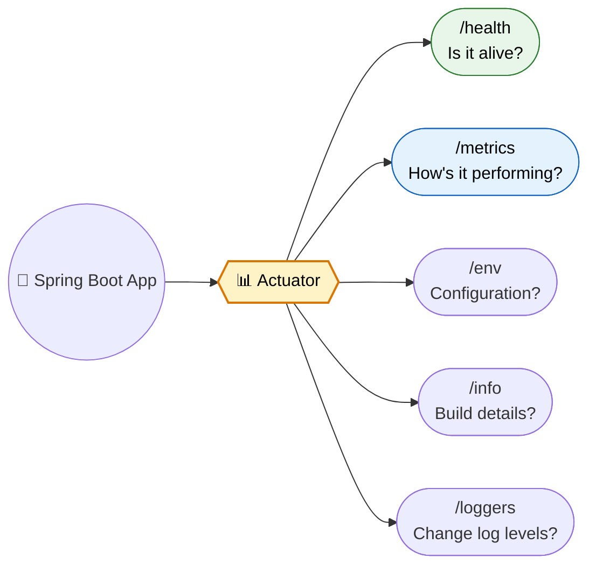
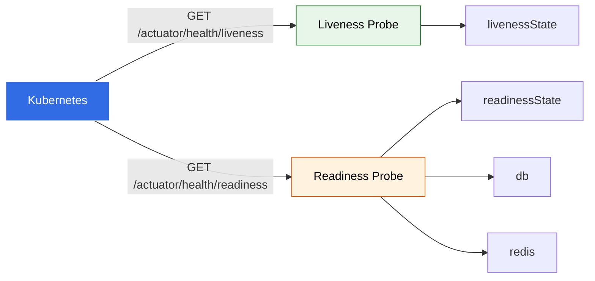
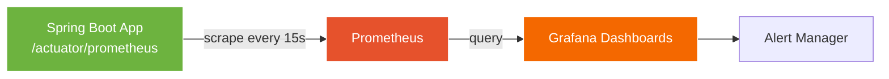

# Spring Boot Actuator

> **Production-ready monitoring and management endpoints. Health checks, metrics, environment info, runtime diagnostics — without touching application code.**

---

!!! abstract "Real-World Analogy"
    Think of a **car dashboard**. While driving, you see fuel level, engine temperature, speed, and warning lights — all without opening the hood. Spring Boot Actuator is your application's dashboard — it exposes operational information through HTTP endpoints so you can monitor without touching the code.



---

## Setup

```xml
<dependency>
    <groupId>org.springframework.boot</groupId>
    <artifactId>spring-boot-starter-actuator</artifactId>
</dependency>
```

For Prometheus metrics support:

```xml
<dependency>
    <groupId>io.micrometer</groupId>
    <artifactId>micrometer-registry-prometheus</artifactId>
</dependency>
```

Minimal `application.yml`:

```yaml
management:
  endpoints:
    web:
      exposure:
        include: health,info,metrics,prometheus,loggers
  endpoint:
    health:
      show-details: when_authorized
      probes:
        enabled: true  # enables /health/liveness and /health/readiness
  info:
    env:
      enabled: true
```

---

## Built-in Endpoints

| Endpoint | Purpose | When to Use |
|---|---|---|
| `/actuator/health` | Aggregate health status | Load balancer checks, K8s probes |
| `/actuator/info` | Build info, git commit, custom metadata | Deployment verification |
| `/actuator/metrics` | Micrometer metrics catalog | Performance monitoring |
| `/actuator/env` | All configuration properties and their sources | Debug config resolution |
| `/actuator/beans` | Every Spring bean in the ApplicationContext | Debug wiring issues |
| `/actuator/mappings` | All `@RequestMapping` routes | API discovery |
| `/actuator/loggers` | View and change log levels at runtime | Runtime debugging |
| `/actuator/threaddump` | Snapshot of all JVM threads | Detect deadlocks, thread leaks |
| `/actuator/heapdump` | Binary heap dump (HPROF format) | Memory leak analysis |

!!! note "Endpoint IDs"
    By default only `/health` is exposed over HTTP. Everything else requires explicit inclusion via `management.endpoints.web.exposure.include`.

---

## Health Indicators

### Built-in Health Indicators

Spring Boot auto-configures health indicators when relevant dependencies are on the classpath:

| Indicator | Triggers When | What It Checks |
|---|---|---|
| `DataSourceHealthIndicator` | DataSource bean exists | Executes validation query |
| `DiskSpaceHealthIndicator` | Always | Free disk > threshold (default 10MB) |
| `RedisHealthIndicator` | Redis dependency present | `PING` command |
| `KafkaHealthIndicator` | Kafka dependency present | Broker cluster ID retrieval |
| `MongoHealthIndicator` | Mongo dependency present | Admin command execution |
| `ElasticsearchRestHealthIndicator` | ES client present | Cluster health request |
| `MailHealthIndicator` | JavaMailSender exists | SMTP connection test |

### Custom Health Indicator

```java
@Component
public class PaymentGatewayHealthIndicator implements HealthIndicator {

    private final PaymentGatewayClient client;

    public PaymentGatewayHealthIndicator(PaymentGatewayClient client) {
        this.client = client;
    }

    @Override
    public Health health() {
        try {
            long start = System.currentTimeMillis();
            boolean reachable = client.ping();
            long latency = System.currentTimeMillis() - start;

            if (reachable) {
                return Health.up()
                    .withDetail("provider", "Stripe")
                    .withDetail("latencyMs", latency)
                    .build();
            }
            return Health.down()
                .withDetail("error", "Gateway unreachable")
                .build();
        } catch (Exception e) {
            return Health.down(e).build();
        }
    }
}
```

### Fun Example: Coffee Level Health Indicator

```java
@Component
public class CoffeeLevelHealthIndicator implements HealthIndicator {

    private final AtomicInteger cupsRemaining = new AtomicInteger(10);

    @Override
    public Health health() {
        int cups = cupsRemaining.get();
        if (cups > 5) {
            return Health.up()
                .withDetail("cups_remaining", cups)
                .withDetail("status", "Fully caffeinated")
                .build();
        } else if (cups > 0) {
            return Health.status("WARN")
                .withDetail("cups_remaining", cups)
                .withDetail("status", "Running low, send help")
                .build();
        }
        return Health.down()
            .withDetail("cups_remaining", 0)
            .withDetail("status", "CRITICAL: Developer non-functional without coffee")
            .build();
    }

    public void drinkCoffee() {
        cupsRemaining.decrementAndGet();
    }

    public void refill(int cups) {
        cupsRemaining.addAndGet(cups);
    }
}
```

Response at `/actuator/health`:

```json
{
  "status": "UP",
  "components": {
    "coffeeLevel": {
      "status": "WARN",
      "details": {
        "cups_remaining": 3,
        "status": "Running low, send help"
      }
    },
    "db": { "status": "UP", "details": { "database": "PostgreSQL" } },
    "diskSpace": { "status": "UP", "details": { "free": "50GB" } },
    "paymentGateway": { "status": "UP", "details": { "provider": "Stripe", "latencyMs": 45 } },
    "redis": { "status": "UP" }
  }
}
```

---

## Health Groups: Liveness vs Readiness (Kubernetes)

Kubernetes needs two distinct signals:

- **Liveness** — Is the process stuck? If DOWN, K8s kills and restarts the pod.
- **Readiness** — Can the app serve traffic? If DOWN, K8s removes the pod from the Service load balancer.

```yaml
management:
  endpoint:
    health:
      probes:
        enabled: true  # exposes /health/liveness and /health/readiness
      group:
        liveness:
          include: livenessState, coffeeLevel
        readiness:
          include: readinessState, db, redis, paymentGateway
```



Deployment YAML:

```yaml
livenessProbe:
  httpGet:
    path: /actuator/health/liveness
    port: 8080
  initialDelaySeconds: 30
  periodSeconds: 10
  timeoutSeconds: 5
  failureThreshold: 3
readinessProbe:
  httpGet:
    path: /actuator/health/readiness
    port: 8080
  initialDelaySeconds: 10
  periodSeconds: 5
  timeoutSeconds: 3
  failureThreshold: 3
```

!!! warning "Do NOT put external dependency checks in liveness"
    If your liveness probe checks the database and the DB goes down, K8s will restart all pods. This causes a cascade failure. Liveness should only check if the JVM is responsive.

---

## Metrics with Micrometer

Micrometer is the metrics facade. It supports 15+ monitoring systems (Prometheus, Datadog, New Relic, CloudWatch, etc.) through pluggable registries.

### Metric Types

| Type | Purpose | Example |
|---|---|---|
| **Counter** | Monotonically increasing value | Total requests, total errors |
| **Gauge** | Current point-in-time value | Active connections, queue size |
| **Timer** | Duration + count of events | Request latency, DB query time |
| **DistributionSummary** | Distribution of values (non-time) | Request payload sizes |

### Custom Metrics

```java
@Service
public class OrderService {

    private final Counter orderCounter;
    private final Counter failedOrderCounter;
    private final Timer orderProcessingTimer;
    private final AtomicInteger activeOrders;
    private final DistributionSummary orderValueSummary;

    public OrderService(MeterRegistry registry) {
        this.orderCounter = Counter.builder("orders.placed.total")
            .description("Total orders placed")
            .tag("service", "order-service")
            .register(registry);

        this.failedOrderCounter = Counter.builder("orders.failed.total")
            .description("Total failed orders")
            .tag("service", "order-service")
            .register(registry);

        this.orderProcessingTimer = Timer.builder("orders.processing.duration")
            .description("Time to process an order")
            .publishPercentiles(0.5, 0.95, 0.99)  // client-side percentiles
            .publishPercentileHistogram()           // server-side histogram
            .register(registry);

        this.activeOrders = registry.gauge("orders.active",
            new AtomicInteger(0));

        this.orderValueSummary = DistributionSummary.builder("orders.value")
            .description("Order monetary value distribution")
            .baseUnit("usd")
            .publishPercentiles(0.5, 0.9, 0.99)
            .register(registry);
    }

    public Order placeOrder(OrderRequest request) {
        activeOrders.incrementAndGet();
        try {
            return orderProcessingTimer.record(() -> {
                Order order = processOrder(request);
                orderCounter.increment();
                orderValueSummary.record(order.getTotalAmount());
                return order;
            });
        } catch (Exception e) {
            failedOrderCounter.increment();
            throw e;
        } finally {
            activeOrders.decrementAndGet();
        }
    }
}
```

Access via `/actuator/metrics/orders.placed.total`:

```json
{
  "name": "orders.placed.total",
  "measurements": [{ "statistic": "COUNT", "value": 1523.0 }],
  "availableTags": [{ "tag": "service", "values": ["order-service"] }]
}
```

### Using @Timed for Declarative Metrics

```java
@RestController
public class OrderController {

    @Timed(value = "http.order.create", percentiles = {0.5, 0.95, 0.99})
    @PostMapping("/orders")
    public Order createOrder(@RequestBody OrderRequest request) {
        return orderService.placeOrder(request);
    }
}
```

Requires `TimedAspect` bean:

```java
@Bean
public TimedAspect timedAspect(MeterRegistry registry) {
    return new TimedAspect(registry);
}
```

---

## Integration with Prometheus + Grafana

### Architecture



### Prometheus Scrape Config

```yaml
# prometheus.yml
scrape_configs:
  - job_name: 'spring-boot-app'
    metrics_path: '/actuator/prometheus'
    scrape_interval: 15s
    static_configs:
      - targets: ['app-host:8080']
    # If actuator runs on a separate port:
    # - targets: ['app-host:9090']
```

For Kubernetes with service discovery:

```yaml
scrape_configs:
  - job_name: 'kubernetes-pods'
    kubernetes_sd_configs:
      - role: pod
    relabel_configs:
      - source_labels: [__meta_kubernetes_pod_annotation_prometheus_io_scrape]
        action: keep
        regex: true
      - source_labels: [__meta_kubernetes_pod_annotation_prometheus_io_path]
        action: replace
        target_label: __metrics_path__
        regex: (.+)
```

### Common Grafana Dashboard Queries (PromQL)

```promql
# Request rate (per second)
rate(http_server_requests_seconds_count{uri!="/actuator/prometheus"}[5m])

# 95th percentile latency
histogram_quantile(0.95, rate(http_server_requests_seconds_bucket[5m]))

# Error rate (5xx)
rate(http_server_requests_seconds_count{status=~"5.."}[5m])
  / rate(http_server_requests_seconds_count[5m])

# JVM heap used
jvm_memory_used_bytes{area="heap"}

# Active threads
jvm_threads_live_threads

# Custom: order processing rate
rate(orders_placed_total[5m])
```

---

## Securing Actuator Endpoints

### Strategy 1: Separate Management Port (Recommended)

Run actuator on a different port, firewalled from the internet:

```yaml
management:
  server:
    port: 9090           # separate port for actuator
    address: 127.0.0.1   # bind to localhost only
  endpoints:
    web:
      exposure:
        include: health,info,metrics,prometheus,loggers,env,beans
```

Only internal monitoring systems (Prometheus, health checks from K8s node network) can reach port 9090.

### Strategy 2: Spring Security Role-Based Access

```java
@Configuration
public class ActuatorSecurityConfig {

    @Bean
    public SecurityFilterChain actuatorSecurity(HttpSecurity http) throws Exception {
        return http
            .securityMatcher("/actuator/**")
            .authorizeHttpRequests(auth -> auth
                .requestMatchers("/actuator/health", "/actuator/info").permitAll()
                .requestMatchers("/actuator/prometheus").hasRole("MONITORING")
                .requestMatchers("/actuator/loggers/**").hasRole("OPS")
                .requestMatchers("/actuator/**").hasRole("ADMIN")
            )
            .httpBasic(Customizer.withDefaults())
            .build();
    }
}
```

### Strategy 3: Combine Both

```yaml
management:
  server:
    port: 9090
    ssl:
      enabled: true
      key-store: classpath:management.p12
      key-store-password: ${MGMT_KEYSTORE_PASS}
```

This gives you actuator on a separate port with TLS, accessible only to internal mTLS clients.

---

## Custom Endpoints

Create entirely new actuator endpoints using `@Endpoint`:

```java
@Component
@Endpoint(id = "features")
public class FeatureEndpoint {

    private final Map<String, Boolean> features = new ConcurrentHashMap<>();

    @ReadOperation
    public Map<String, Boolean> getAllFeatures() {
        return features;
    }

    @ReadOperation
    public boolean getFeature(@Selector String name) {
        return features.getOrDefault(name, false);
    }

    @WriteOperation
    public void setFeature(@Selector String name, boolean enabled) {
        features.put(name, enabled);
    }

    @DeleteOperation
    public void deleteFeature(@Selector String name) {
        features.remove(name);
    }
}
```

Access:

```bash
# Read all features
GET /actuator/features

# Read one feature
GET /actuator/features/dark-mode

# Toggle a feature
POST /actuator/features/dark-mode
Content-Type: application/json
{"enabled": true}

# Remove
DELETE /actuator/features/dark-mode
```

Expose it:

```yaml
management:
  endpoints:
    web:
      exposure:
        include: health,info,features
```

---

## Change Log Level at Runtime

```bash
# Check current level
curl http://localhost:8080/actuator/loggers/com.example.orderservice

# Response
# {"configuredLevel": null, "effectiveLevel": "INFO"}

# Change to DEBUG without restart
curl -X POST http://localhost:8080/actuator/loggers/com.example.orderservice \
  -H "Content-Type: application/json" \
  -d '{"configuredLevel": "DEBUG"}'

# Reset to default
curl -X POST http://localhost:8080/actuator/loggers/com.example.orderservice \
  -H "Content-Type: application/json" \
  -d '{"configuredLevel": null}'
```

---

## Production Setup Checklist

### What to Expose

```yaml
management:
  server:
    port: 9090
    address: 0.0.0.0  # reachable within cluster, firewalled externally
  endpoints:
    web:
      exposure:
        include: health,info,metrics,prometheus
      base-path: /actuator
  endpoint:
    health:
      show-details: when_authorized
      probes:
        enabled: true
    info:
      enabled: true
  metrics:
    export:
      prometheus:
        enabled: true
    tags:
      application: ${spring.application.name}
      environment: ${ENVIRONMENT:local}
```

### What to Hide or Restrict

| Endpoint | Risk | Recommendation |
|---|---|---|
| `/env` | Leaks secrets, API keys, DB passwords | Require ADMIN role or disable |
| `/heapdump` | Full memory dump — contains everything | Require ADMIN role, never expose publicly |
| `/threaddump` | Reveals internal architecture | Restrict to OPS role |
| `/loggers` (write) | Attacker can flood logs or suppress alerts | Require OPS role |
| `/beans` | Reveals full dependency graph | Restrict or disable |
| `/mappings` | Reveals all API surface area | Restrict or disable |
| `/shutdown` | Shuts down the application | Never enable unless absolutely necessary |

---

## Gotchas and Common Mistakes

!!! danger "Exposing All Endpoints in Production"
    Setting `management.endpoints.web.exposure.include=*` is a severe security risk. An attacker with access to `/env` gets your database credentials. With `/heapdump`, they get JWT signing keys, session tokens, and every secret in memory.

!!! danger "/env Leaking Secrets"
    Even with sanitization (`management.endpoint.env.keys-to-sanitize`), some secrets slip through custom property names. The safest approach: do not expose `/env` publicly. Period.

!!! warning "Health Check Timeouts in Kubernetes"
    If your readiness probe has a 3-second timeout but your DB health check takes 5 seconds under load, K8s marks the pod as unready. Traffic shifts to remaining pods, which get more load, causing cascading readiness failures. Solutions:

    - Set generous `timeoutSeconds` on probes
    - Use async health checks for slow dependencies
    - Move slow checks out of readiness groups

!!! warning "Liveness Probe Checking External Dependencies"
    If liveness depends on an external service (DB, Redis) and that service goes down, K8s restarts all pods simultaneously. When pods come back, they all fail liveness again (DB is still down). Result: restart loop. Liveness should only check JVM health.

!!! note "Metric Cardinality Explosion"
    Tagging metrics with high-cardinality values (user IDs, request IDs, full URLs) creates millions of time series. Prometheus slows down. Grafana queries time out. Always use bounded tag values (HTTP method, status code, endpoint pattern, not full path).

---

## Interview Questions

??? question "1. What is Spring Boot Actuator and why is it needed?"
    Actuator is a sub-project that adds production-ready operational endpoints to a Spring Boot application. It provides health checks for load balancers, metrics for monitoring systems, environment inspection for debugging, and runtime management (log level changes) without redeployment. It bridges the gap between writing code and operating code in production.

??? question "2. How do you create a custom health indicator?"
    Implement the `HealthIndicator` interface and annotate with `@Component`. Override `health()` to return `Health.up()`, `Health.down()`, or a custom status with `.withDetail()` for context. Spring auto-discovers it by classpath scanning. Name the class `<Name>HealthIndicator` and it appears as `<name>` in the health response.

??? question "3. What is the difference between liveness and readiness probes?"
    Liveness answers: "Is the process stuck?" If it fails, K8s kills and restarts the pod. Readiness answers: "Can this pod serve traffic?" If it fails, K8s removes the pod from the Service endpoints but does not restart it. Liveness should never check external dependencies. Readiness should check dependencies the app needs to serve requests (DB, cache).

??? question "4. How do you secure actuator endpoints in production?"
    Multiple strategies: (1) Run actuator on a separate management port (`management.server.port`) and firewall it from public traffic. (2) Use Spring Security to require authentication and role-based access. (3) Expose only `/health` and `/info` publicly; keep everything else behind auth. (4) Combine separate port + mTLS for zero-trust environments.

??? question "5. How does Micrometer integrate with Prometheus?"
    Add `micrometer-registry-prometheus` dependency. This auto-configures a `PrometheusMeterRegistry` that exposes all metrics at `/actuator/prometheus` in Prometheus exposition format. Configure Prometheus to scrape this endpoint at a regular interval (typically 15s). All default JVM, HTTP, and custom metrics are automatically formatted.

??? question "6. What are the four Micrometer metric types?"
    **Counter** — monotonically increasing count (requests, errors). **Gauge** — current instantaneous value (active threads, queue depth). **Timer** — measures duration and count together, supports percentiles (request latency). **DistributionSummary** — like Timer but for non-time values (payload sizes, order amounts).

??? question "7. How do you change log levels at runtime without restarting?"
    Send a POST to `/actuator/loggers/{logger-name}` with `{"configuredLevel": "DEBUG"}`. The change takes effect immediately. To reset to default, send `{"configuredLevel": null}`. This is invaluable for debugging production issues without redeployment. Secure this endpoint since an attacker could suppress error logging.

??? question "8. What is management.server.port and when should you use it?"
    It runs actuator endpoints on a separate HTTP server and port (e.g., 9090). Use it when you want to isolate management traffic from application traffic. Allows firewall rules that block public access to actuator while the main app port (8080) remains open. Common in container deployments where only internal Prometheus scrapers need access.

??? question "9. How do you create a custom actuator endpoint?"
    Annotate a `@Component` class with `@Endpoint(id = "myendpoint")`. Define methods with `@ReadOperation` (GET), `@WriteOperation` (POST), or `@DeleteOperation` (DELETE). Use `@Selector` for path parameters. The endpoint appears at `/actuator/myendpoint`. Add it to the exposure include list.

??? question "10. What is a health group and why use it?"
    Health groups partition health indicators into logical sets. Each group has its own status and HTTP endpoint (e.g., `/health/liveness`, `/health/readiness`). Use them to provide different health signals for different consumers: K8s liveness probes should only check JVM state, while readiness probes check dependencies. Without groups, all indicators contribute to a single status.

??? question "11. What happens if you tag metrics with high-cardinality values?"
    Each unique combination of tag values creates a separate time series. Tagging with user IDs or full URLs creates millions of series. Prometheus memory usage explodes, query performance degrades, and Grafana dashboards time out. Always use bounded, low-cardinality tag values like HTTP method, status code category, or endpoint patterns.

??? question "12. How do you prevent /env from leaking secrets?"
    Spring Boot sanitizes keys matching patterns like `password`, `secret`, `key`, `token` by default. Override with `management.endpoint.env.keys-to-sanitize`. However, custom property names often bypass sanitization. The safest approach: do not expose `/env` over HTTP in production. Use it only on the management port behind authentication, or disable it entirely with `management.endpoint.env.enabled=false`.

??? question "13. How do you monitor Spring Boot with Grafana dashboards?"
    Expose `/actuator/prometheus`. Configure Prometheus to scrape it. Import community Grafana dashboards (JVM Micrometer dashboard ID 4701 is popular). Key panels: request rate, error rate, p95 latency, JVM heap usage, GC pause duration, thread count, and custom business metrics. Set up alerting rules for SLO violations (e.g., p99 latency > 500ms).

??? question "14. What is the risk of including /heapdump in web exposure?"
    A heap dump contains the entire JVM memory: database credentials, JWT secrets, session tokens, cached user data, encryption keys. Anyone who downloads it can extract all secrets. Never expose it publicly. Restrict to admin-only access on internal management port, or disable it entirely and use JMX/kubectl for on-demand heap dumps.
