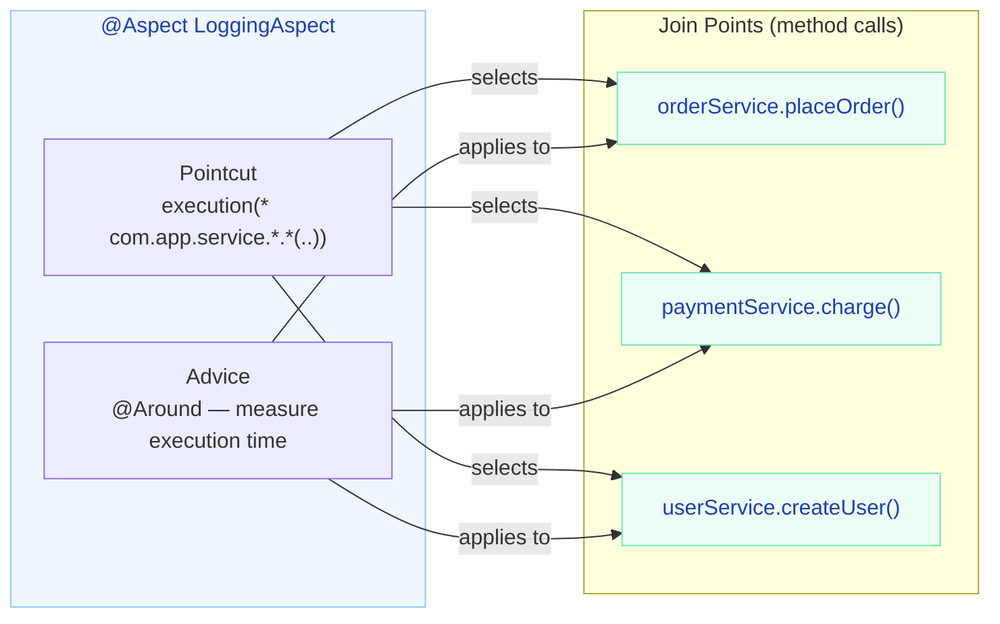
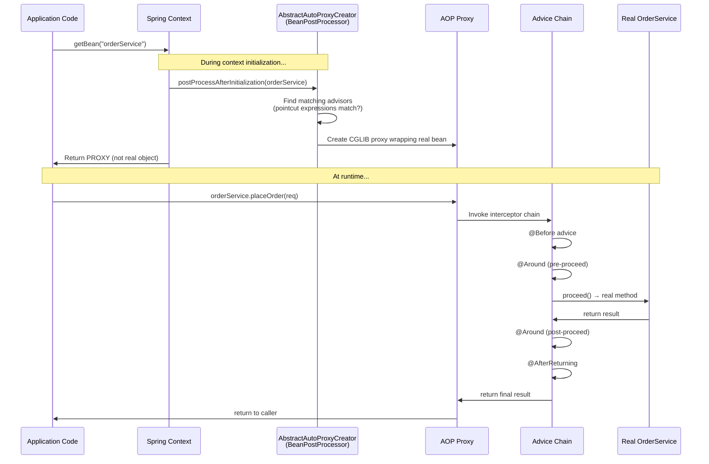
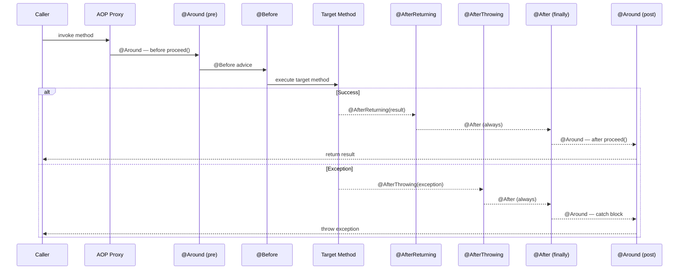
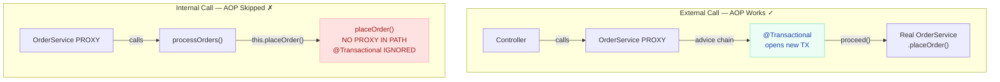

# Spring AOP — The Complete Interview Guide

AOP is that topic where interviewers love to go deep. "How does `@Transactional` actually work?" — that's an AOP question. "Why doesn't my `@Cacheable` method work when called from the same class?" — AOP again. "Can Spring intercept private methods?" — AOP. Let me explain how Spring creates proxies, how advice chains execute, and why understanding this single concept unlocks answers to dozens of interview questions.

---

## What is AOP and Why Should You Care?

**One sentence:** AOP (Aspect-Oriented Programming) lets you inject behavior into methods without modifying them.

**The problem it solves:** Imagine you have 200 service methods across 40 classes. Every single one needs logging, performance metrics, security checks, and transaction management. Without AOP, you copy-paste the same 15 lines of boilerplate into each method. When the logging format changes, you update 200 places.

**With AOP:** You write that logic once in an "aspect" and declare which methods it applies to. Done.

!!! tip "💡 One-liner for interviews"
    "AOP lets you inject behavior into methods without modifying them — Spring uses it for @Transactional, @Cacheable, @Async, @Secured, and you can use it for your own cross-cutting concerns like logging, metrics, and retry logic."

### Before and After AOP

=== "Without AOP — Scattered Boilerplate"

    ```java
    @Service
    public class OrderService {

        public Order placeOrder(OrderRequest request) {
            // Security check (repeated in every method)
            Authentication auth = SecurityContextHolder.getContext().getAuthentication();
            if (!auth.getAuthorities().contains("ROLE_ORDER_WRITE")) {
                throw new AccessDeniedException("Insufficient permissions");
            }

            // Performance monitoring (repeated in every method)
            long start = System.nanoTime();

            // Audit logging (repeated in every method)
            log.info("User {} calling placeOrder with {}", auth.getName(), request);

            try {
                // --- Actual business logic (2 lines) ---
                Order order = orderRepository.save(Order.from(request));
                eventPublisher.publish(new OrderPlacedEvent(order));
                // --- End business logic ---

                long duration = (System.nanoTime() - start) / 1_000_000;
                log.info("placeOrder completed in {} ms", duration);
                meterRegistry.timer("order.place").record(duration, TimeUnit.MILLISECONDS);
                auditRepo.save(new AuditEntry("PLACE_ORDER", auth.getName(), order.getId()));
                return order;
            } catch (Exception e) {
                log.error("placeOrder failed", e);
                alertService.notifyOnCall("placeOrder", e);
                throw e;
            }
        }
        // ... 30 more methods with the SAME boilerplate
    }
    ```

=== "With AOP — Pure Business Logic"

    ```java
    @Service
    public class OrderService {

        @Secured("ROLE_ORDER_WRITE")
        @Timed("order.place")
        @Auditable(action = "PLACE_ORDER")
        @Transactional
        public Order placeOrder(OrderRequest request) {
            Order order = orderRepository.save(Order.from(request));
            eventPublisher.publish(new OrderPlacedEvent(order));
            return order;
        }
    }
    ```

!!! example "🎯 Interview Tip"
    When asked "What are cross-cutting concerns?", don't just list them. Explain WHY they're "cross-cutting": they span multiple modules horizontally, cutting across the vertical business logic layers. They don't fit neatly into one class or one module.

### Cross-Cutting Concerns in Spring

| Concern | Spring's AOP Implementation | Annotation |
|---|---|---|
| Transaction management | `TransactionInterceptor` | `@Transactional` |
| Caching | `CacheInterceptor` | `@Cacheable`, `@CacheEvict` |
| Async execution | `AsyncExecutionInterceptor` | `@Async` |
| Security | `MethodSecurityInterceptor` | `@Secured`, `@PreAuthorize` |
| Retry | `RetryOperationsInterceptor` | `@Retryable` |
| Custom metrics | Your own aspect | Your own annotation |

---

## Core Terminology — With Real Examples

Here's the mental model: AOP is a mail system. The **Aspect** is the mail room. The **Pointcut** is the address list (which mailboxes to deliver to). The **Advice** is the actual letter (what to deliver). The **Join Point** is the specific mailbox. **Weaving** is the act of delivery.



| Term | What it does | Why it exists | Real example |
|---|---|---|---|
| **Aspect** | The class containing cross-cutting logic | Encapsulates a concern in one place | `@Aspect class PerformanceMonitor` |
| **Join Point** | A point in execution where advice CAN run | Defines the "hooks" available in code | Every public method call on a Spring bean |
| **Pointcut** | Expression that selects WHICH join points get advice | Precision targeting — not every method needs logging | `execution(* com.app.service.*.*(..))` |
| **Advice** | The actual code that runs at a join point | The behavior you're injecting | `@Around` method that measures time |
| **Weaving** | Process of applying aspects to targets | The mechanism that makes AOP work | Spring does this at runtime via proxies |
| **Target Object** | The original bean being proxied | The thing you're adding behavior to | Your `OrderService` instance |
| **AOP Proxy** | The wrapper Spring creates around the target | Intercepts calls and routes through advice | CGLIB subclass or JDK dynamic proxy |

!!! question "❓ Counter-question: What join points does Spring AOP support?"
    Only **method execution**. Not field access, not constructor calls, not static initializers. If you need those, you need full AspectJ. This is the single biggest limitation of Spring AOP, and interviewers test whether you know it.

---

## How Spring AOP Works Internally

This is where interviews get interesting. Spring AOP is **proxy-based**. When Spring creates a bean that has matching aspects, it doesn't give you the real object — it gives you a proxy that wraps the real object.

### The Proxy Mechanism



### JDK Dynamic Proxy vs CGLIB Proxy

| Feature | JDK Dynamic Proxy | CGLIB Proxy |
|---|---|---|
| **How it works** | Implements target's interfaces at runtime | Generates a subclass of target at runtime |
| **Requirement** | Target MUST implement an interface | No interface needed |
| **Cannot proxy** | Classes without interfaces | `final` classes or `final` methods |
| **Generated class** | `$Proxy0`, `$Proxy1`, etc. | `OrderService$$EnhancerBySpringCGLIB$$abc123` |
| **Performance** | Slightly faster creation, slower invocation | Slightly slower creation, faster invocation |
| **Spring Boot default** | No (since 2.0) | **Yes** — always CGLIB unless you opt out |

!!! tip "💡 One-liner for interviews"
    "Spring Boot defaults to CGLIB proxies because they work with any class regardless of whether it implements an interface. JDK proxies are only used when you explicitly set `spring.aop.proxy-target-class=false` AND the bean implements an interface."

### When Each Proxy Type is Used

```java
// CGLIB (default) — generates: OrderService$$EnhancerBySpringCGLIB
@Service
public class OrderService {  // No interface — CGLIB is the only option
    public Order placeOrder(OrderRequest req) { ... }
}

// JDK Proxy — only if you explicitly configure it AND have an interface
public interface PaymentGateway {
    PaymentResult charge(PaymentRequest req);
}

@Service
public class StripePaymentGateway implements PaymentGateway {
    public PaymentResult charge(PaymentRequest req) { ... }
}
// With spring.aop.proxy-target-class=false → JDK proxy implementing PaymentGateway
// Default (true) → CGLIB subclass regardless
```

### BeanPostProcessor — Where Proxies Are Born

```java
// Simplified view of what happens inside Spring:
public class AbstractAutoProxyCreator implements BeanPostProcessor {

    @Override
    public Object postProcessAfterInitialization(Object bean, String beanName) {
        // 1. Find all Advisor beans (aspects compiled into advisors)
        List<Advisor> advisors = findEligibleAdvisors(bean.getClass());

        // 2. If any pointcut matches this bean's methods, create a proxy
        if (!advisors.isEmpty()) {
            ProxyFactory proxyFactory = new ProxyFactory();
            proxyFactory.setTarget(bean);
            proxyFactory.addAdvisors(advisors);

            // 3. Choose proxy type
            if (shouldUseJdkProxy(bean)) {
                proxyFactory.setProxyTargetClass(false);  // JDK
            } else {
                proxyFactory.setProxyTargetClass(true);   // CGLIB
            }

            return proxyFactory.getProxy();  // Return proxy instead of real bean
        }
        return bean;  // No aspects match — return original
    }
}
```

!!! danger "⚠️ What breaks"
    If your bean is `final`, CGLIB cannot subclass it → `BeanCreationException` at startup. If only a method is `final`, the proxy is created but that method is **silently not intercepted**. No error, no warning — your `@Transactional` just doesn't work.

---

## Pointcut Expressions Deep Dive

Pointcuts are the targeting system of AOP. Get them wrong and your aspect either matches nothing or matches everything.

### execution() — The Most Common

Pattern: `execution([modifiers] return-type [declaring-type.]method-name(param-pattern) [throws])`

```java
// All public methods in service package
@Pointcut("execution(public * com.app.service.*.*(..))")
public void allServiceMethods() {}

// All methods in service package AND sub-packages (note the ..)
@Pointcut("execution(* com.app.service..*.*(..))")
public void serviceAndSubPackages() {}

// Only methods returning Order
@Pointcut("execution(Order com.app.service.*.*(..))")
public void orderReturningMethods() {}

// Methods starting with "find" (typically read operations)
@Pointcut("execution(* com.app.service.*.find*(..))")
public void finderMethods() {}

// Methods with exactly one Long parameter
@Pointcut("execution(* com.app.service.*.*(Long))")
public void methodsWithSingleLong() {}

// Methods with Long as first param, anything else after
@Pointcut("execution(* com.app.service.*.*(Long, ..))")
public void methodsWithLongFirst() {}
```

!!! info "Pattern wildcards"
    - `*` — matches any single segment (one package level, one return type, one method name)
    - `..` — in package position: any sub-packages. In params position: any number of params of any type
    - `+` — matches subclasses: `execution(* com.app.service.BaseService+.*(..))`

### @annotation() — Match by Annotation

```java
// All methods annotated with @Transactional
@Pointcut("@annotation(org.springframework.transaction.annotation.Transactional)")
public void transactionalMethods() {}

// Custom annotation — bind it to access annotation values in advice
@Around("@annotation(timed)")
public Object measureTime(ProceedingJoinPoint pjp, Timed timed) throws Throwable {
    String metricName = timed.value();  // Access annotation attributes!
    long warnThreshold = timed.warnThresholdMs();
    // ...
}
```

### within() — Match by Type

```java
// All methods within OrderService (regardless of method name)
@Pointcut("within(com.app.service.OrderService)")
public void withinOrderService() {}

// All methods in any @RestController class
@Pointcut("within(@org.springframework.web.bind.annotation.RestController *)")
public void withinControllers() {}

// All methods in service package and sub-packages
@Pointcut("within(com.app.service..*)")
public void withinServiceLayer() {}
```

### bean() — Spring-Specific (Match by Bean Name)

```java
// Match specific bean by name
@Pointcut("bean(orderService)")
public void orderServiceBean() {}

// Wildcard — all beans ending with "Service"
@Pointcut("bean(*Service)")
public void allServiceBeans() {}
```

### args() — Match by Parameter Types at Runtime

```java
// Methods accepting exactly one String
@Pointcut("args(String)")
public void singleStringArg() {}

// Bind arguments for use in advice
@Before("execution(* com.app.service.UserService.*(..)) && args(userId,..)")
public void logUserAction(Long userId) {
    log.info("Action initiated by user: {}", userId);
}
```

### Combining Pointcuts with Operators

```java
@Aspect
@Component
public class CombinedPointcuts {

    @Pointcut("execution(* com.app.service.*.*(..))")
    public void serviceLayer() {}

    @Pointcut("execution(* com.app.controller.*.*(..))")
    public void controllerLayer() {}

    @Pointcut("@annotation(com.app.annotation.Auditable)")
    public void auditable() {}

    // AND — both must match (service method that is also @Auditable)
    @Before("serviceLayer() && auditable()")
    public void auditServiceMethods(JoinPoint jp) { }

    // OR — either matches
    @Before("serviceLayer() || controllerLayer()")
    public void logAllEntryPoints(JoinPoint jp) { }

    // NOT — exclude getters from service logging
    @Before("serviceLayer() && !execution(* com.app.service.*.get*(..))")
    public void nonGetterServiceMethods(JoinPoint jp) { }

    // Complex composition
    @Around("serviceLayer() && !execution(* com.app.service.*.toString(..)) && !execution(* com.app.service.*.hashCode(..))")
    public Object monitorExcludingObjectMethods(ProceedingJoinPoint pjp) throws Throwable {
        return pjp.proceed();
    }
}
```

!!! example "🎯 Interview Tip"
    When writing pointcuts in interviews, always exclude `toString()`, `hashCode()`, and `equals()` methods. These get called constantly by frameworks and logging, and advising them creates infinite loops or performance disasters.

---

## Advice Types with Production Examples

### @Before — Gate Execution

**What:** Runs before the target method. Cannot access return value.
**When to use:** Validation, authorization, pre-condition checks.
**How it works:** If it throws, the target never executes.

```java
@Aspect
@Component
public class InputValidationAspect {

    @Before("execution(* com.app.service.OrderService.placeOrder(..)) && args(request)")
    public void validateOrderRequest(OrderRequest request) {
        if (request.getItems() == null || request.getItems().isEmpty()) {
            throw new IllegalArgumentException("Order must contain at least one item");
        }
        if (request.getItems().stream().anyMatch(i -> i.getQuantity() <= 0)) {
            throw new IllegalArgumentException("All items must have positive quantity");
        }
        // If we get here, execution continues to placeOrder()
        // If we throw, placeOrder() NEVER executes
    }
}
```

### @After — Always Runs (The "Finally" Block)

**What:** Runs after the method, regardless of success or failure.
**When to use:** Resource cleanup, releasing locks, clearing ThreadLocal state.
**Limitation:** Cannot access the return value or the exception.

```java
@Aspect
@Component
public class ThreadLocalCleanupAspect {

    @After("execution(* com.app.service.*.*(..))")
    public void clearRequestContext() {
        RequestContextHolder.clear();  // Prevent ThreadLocal leaks in thread pools
        MDC.clear();                   // Clean up logging context
    }
}
```

### @AfterReturning — Success Path Only

**What:** Runs after successful return. Has read access to the return value.
**When to use:** Audit logging, event publishing, metrics on successful operations.
**Key detail:** Does NOT execute if the method throws.

```java
@Aspect
@Component
public class OrderAuditAspect {

    private final AuditRepository auditRepo;
    private final ApplicationEventPublisher eventPublisher;

    @AfterReturning(
        pointcut = "execution(* com.app.service.OrderService.placeOrder(..))",
        returning = "order"
    )
    public void auditAndPublish(JoinPoint jp, Order order) {
        // Audit trail
        String username = SecurityContextHolder.getContext()
            .getAuthentication().getName();

        auditRepo.save(AuditEntry.builder()
            .action("ORDER_PLACED")
            .entityId(order.getId().toString())
            .actor(username)
            .details("Amount: " + order.getTotalAmount())
            .timestamp(Instant.now())
            .build());

        // Domain event for downstream systems
        eventPublisher.publishEvent(new OrderPlacedEvent(order));
    }
}
```

### @AfterThrowing — Error Path Only

**What:** Runs when the target throws an exception. Cannot swallow it (exception still propagates).
**When to use:** Error alerting, exception metrics, fallback logging.
**Key detail:** If you want to CATCH and HANDLE the exception, use `@Around` instead.

```java
@Aspect
@Component
public class ExceptionAlertingAspect {

    private final MeterRegistry meterRegistry;
    private final SlackClient slackClient;

    @AfterThrowing(
        pointcut = "execution(* com.app.service.*.*(..))",
        throwing = "ex"
    )
    public void alertOnException(JoinPoint jp, Exception ex) {
        String method = jp.getSignature().toShortString();

        // Metrics
        meterRegistry.counter("app.exceptions",
            "method", method,
            "type", ex.getClass().getSimpleName()
        ).increment();

        // Alert on-call for critical failures
        if (ex instanceof PaymentProcessingException
            || ex instanceof DataIntegrityViolationException) {
            slackClient.sendAlert("#oncall",
                String.format("CRITICAL: %s failed with %s: %s",
                    method, ex.getClass().getSimpleName(), ex.getMessage()));
        }
    }
}
```

### @Around — Full Control (The Swiss Army Knife)

**What:** Wraps the entire method. You control whether it executes, what arguments it gets, what it returns, and whether exceptions propagate.
**When to use:** Performance monitoring, retry logic, caching, circuit breaking, distributed tracing.
**Gotcha:** You MUST call `proceed()` or the target never executes. You MUST return the result or callers get `null`.

```java
@Aspect
@Component
@Slf4j
public class PerformanceMonitoringAspect {

    private final MeterRegistry meterRegistry;

    @Around("execution(* com.app.service.*.*(..))")
    public Object monitorPerformance(ProceedingJoinPoint pjp) throws Throwable {
        String className = pjp.getTarget().getClass().getSimpleName();
        String methodName = pjp.getSignature().getName();
        String metricName = className + "." + methodName;

        Timer.Sample sample = Timer.start(meterRegistry);

        try {
            Object result = pjp.proceed();  // ← Execute the actual method

            sample.stop(Timer.builder("method.duration")
                .tag("class", className)
                .tag("method", methodName)
                .tag("status", "success")
                .register(meterRegistry));

            return result;  // ← MUST return this!

        } catch (Throwable ex) {
            sample.stop(Timer.builder("method.duration")
                .tag("class", className)
                .tag("method", methodName)
                .tag("status", "error")
                .tag("exception", ex.getClass().getSimpleName())
                .register(meterRegistry));

            throw ex;  // ← Re-throw or you silently swallow errors
        }
    }
}
```

!!! danger "⚠️ What breaks"
    ```java
    // BUG 1: Forgot to call proceed() — method never executes
    @Around("execution(* com.app.service.*.*(..))")
    public Object broken1(ProceedingJoinPoint pjp) throws Throwable {
        log.info("Before");
        // Oops — no proceed()! Target never runs.
        log.info("After");
        return null;  // Caller gets null
    }

    // BUG 2: Forgot to return result — caller gets null
    @Around("execution(* com.app.service.*.*(..))")
    public Object broken2(ProceedingJoinPoint pjp) throws Throwable {
        Object result = pjp.proceed();
        log.info("Result: {}", result);
        // Oops — forgot to return result!
        return null;
    }
    ```

### Advice Execution Order



| Advice | Runs When | Access Return? | Access Exception? | Can Prevent Execution? | Can Modify Result? |
|---|---|---|---|---|---|
| `@Before` | Before method | No | No | Yes (throw) | No |
| `@After` | Always (finally) | No | No | No | No |
| `@AfterReturning` | On success only | **Read-only** | No | No | No |
| `@AfterThrowing` | On failure only | No | **Yes** | No | No |
| `@Around` | Wraps everything | **Yes** | **Yes** | **Yes** | **Yes** |

---

## The Self-Invocation Problem (THE Most Asked AOP Question)

This is the #1 AOP interview question. If you understand nothing else, understand this.

### The Problem

When a method calls another method **in the same class** using `this.method()`, the call bypasses the proxy. No advice is applied. Your `@Transactional`, `@Cacheable`, `@Async`, `@Retryable` — all silently do nothing.

```java
@Service
public class OrderService {

    @Transactional
    public void processOrders(List<OrderRequest> requests) {
        for (OrderRequest req : requests) {
            placeOrder(req);  // ← Calls this.placeOrder() — BYPASSES PROXY!
        }
    }

    @Transactional(propagation = Propagation.REQUIRES_NEW)
    public Order placeOrder(OrderRequest request) {
        // REQUIRES_NEW is IGNORED when called internally!
        // No new transaction is created. It runs in the outer transaction.
        // If one order fails, ALL orders roll back — not what you wanted.
        return orderRepository.save(Order.from(request));
    }
}
```

### Why It Happens



The key insight: **`this` refers to the raw target object, not the proxy**. The proxy only exists in the call path when an external caller invokes the method. Once you're inside the object, all internal calls go directly to the target, bypassing the proxy and all its interceptors.

!!! warning "🔥 Production War Story"
    A payments team had `processRefunds()` calling `refundOrder()` internally. `refundOrder()` had `@Transactional(propagation = REQUIRES_NEW)` to isolate each refund in its own transaction. But since the call was internal, all refunds ran in one transaction. When refund #47 out of 200 failed, ALL 200 refunds rolled back — including the 46 that had already succeeded and sent confirmation emails. Customers got "refund processed" emails but never got their money. It took 3 days to untangle.

### Four Solutions (With Tradeoffs)

=== "Solution 1: Self-Injection (Most Common)"

    ```java
    @Service
    public class OrderService {

        @Lazy
        @Autowired
        private OrderService self;  // Injects the PROXY, not 'this'

        @Transactional
        public void processOrders(List<OrderRequest> requests) {
            for (OrderRequest req : requests) {
                self.placeOrder(req);  // Goes through PROXY → AOP applied!
            }
        }

        @Transactional(propagation = Propagation.REQUIRES_NEW)
        public Order placeOrder(OrderRequest request) {
            return orderRepository.save(Order.from(request));
        }
    }
    ```

    **Tradeoff:** `@Lazy` prevents the circular dependency error. Slightly unusual pattern — some teams consider it a code smell. But it's the fastest fix.

=== "Solution 2: Extract to Separate Bean (Cleanest)"

    ```java
    @Service
    @RequiredArgsConstructor
    public class OrderBatchProcessor {
        private final OrderService orderService;  // Different bean!

        @Transactional
        public void processOrders(List<OrderRequest> requests) {
            for (OrderRequest req : requests) {
                orderService.placeOrder(req);  // Cross-bean call → proxy!
            }
        }
    }

    @Service
    public class OrderService {

        @Transactional(propagation = Propagation.REQUIRES_NEW)
        public Order placeOrder(OrderRequest request) {
            return orderRepository.save(Order.from(request));
        }
    }
    ```

    **Tradeoff:** Requires refactoring. Introduces a new class. But it's the cleanest, most testable design.

=== "Solution 3: AopContext (Legacy)"

    ```java
    // Enable expose-proxy in configuration
    @EnableAspectJAutoProxy(exposeProxy = true)

    @Service
    public class OrderService {

        public void processOrders(List<OrderRequest> requests) {
            OrderService proxy = (OrderService) AopContext.currentProxy();
            for (OrderRequest req : requests) {
                proxy.placeOrder(req);  // Through proxy!
            }
        }
    }
    ```

    **Tradeoff:** Couples your code to Spring AOP infrastructure. Requires `exposeProxy = true`. Uses ThreadLocal internally. Generally discouraged in modern Spring.

=== "Solution 4: Full AspectJ (Nuclear Option)"

    ```java
    @EnableTransactionManagement(mode = AdviceMode.ASPECTJ)
    @Configuration
    public class AopConfig {}
    ```

    With AspectJ compile-time weaving, aspects are woven into the bytecode itself. There IS no proxy. Self-invocation works because the advice code is literally inside the method's bytecode.

    **Tradeoff:** Requires the AspectJ compiler (`ajc`) or load-time weaver. More complex build. Harder to debug. Overkill for most Spring Boot apps.

!!! question "❓ Counter-question: Which solution would you recommend?"
    **Answer:** Solution 2 (extract to separate bean) for greenfield code — it's the cleanest architecture and most testable. Solution 1 (self-injection) for brownfield code where you can't easily refactor. Never Solution 3 in new code. Solution 4 only if you have many self-invocation patterns AND performance-critical paths.

---

## Real Production Aspects

### 1. Distributed Tracing with MDC

```java
@Aspect
@Component
@Order(1)  // Outermost — trace context must be set before anything else
public class DistributedTracingAspect {

    @Around("execution(* com.app.service.*.*(..))")
    public Object addTraceContext(ProceedingJoinPoint pjp) throws Throwable {
        String traceId = MDC.get("traceId");
        if (traceId == null) {
            traceId = UUID.randomUUID().toString().replace("-", "").substring(0, 16);
            MDC.put("traceId", traceId);
        }

        String spanId = UUID.randomUUID().toString().replace("-", "").substring(0, 8);
        String parentSpanId = MDC.get("spanId");
        MDC.put("spanId", spanId);
        MDC.put("parentSpanId", parentSpanId != null ? parentSpanId : "root");
        MDC.put("operation", pjp.getSignature().toShortString());

        try {
            return pjp.proceed();
        } finally {
            MDC.put("spanId", parentSpanId);  // Restore parent span
            MDC.remove("parentSpanId");
            MDC.remove("operation");
        }
    }
}
```

### 2. Custom Retry with Exponential Backoff

```java
@Target(ElementType.METHOD)
@Retention(RetentionPolicy.RUNTIME)
public @interface RetryOnFailure {
    int maxAttempts() default 3;
    long initialDelayMs() default 100;
    double backoffMultiplier() default 2.0;
    Class<? extends Throwable>[] retryOn() default {RuntimeException.class};
    Class<? extends Throwable>[] noRetryOn() default {};
}
```

```java
@Aspect
@Component
@Slf4j
public class RetryAspect {

    @Around("@annotation(retry)")
    public Object retryOnFailure(ProceedingJoinPoint pjp, RetryOnFailure retry) throws Throwable {
        String method = pjp.getSignature().toShortString();
        Throwable lastException = null;
        long delay = retry.initialDelayMs();

        for (int attempt = 1; attempt <= retry.maxAttempts(); attempt++) {
            try {
                Object result = pjp.proceed();
                if (attempt > 1) {
                    log.info("Method {} succeeded on attempt {}", method, attempt);
                }
                return result;
            } catch (Throwable ex) {
                lastException = ex;

                // Don't retry non-retryable exceptions
                if (isExcluded(ex, retry.noRetryOn())) {
                    log.warn("Non-retryable exception in {}: {}", method, ex.getMessage());
                    throw ex;
                }

                // Only retry specified exception types
                if (!isRetryable(ex, retry.retryOn())) {
                    throw ex;
                }

                if (attempt < retry.maxAttempts()) {
                    log.warn("Attempt {}/{} failed for {}: {}. Retrying in {} ms",
                        attempt, retry.maxAttempts(), method, ex.getMessage(), delay);
                    Thread.sleep(delay);
                    delay = (long) (delay * retry.backoffMultiplier());  // Exponential backoff
                } else {
                    log.error("All {} attempts exhausted for {}", retry.maxAttempts(), method);
                }
            }
        }
        throw lastException;
    }

    private boolean isRetryable(Throwable ex, Class<? extends Throwable>[] retryOn) {
        for (Class<? extends Throwable> clazz : retryOn) {
            if (clazz.isInstance(ex)) return true;
        }
        return false;
    }

    private boolean isExcluded(Throwable ex, Class<? extends Throwable>[] noRetryOn) {
        for (Class<? extends Throwable> clazz : noRetryOn) {
            if (clazz.isInstance(ex)) return true;
        }
        return false;
    }
}
```

Usage:
```java
@Service
public class PaymentService {

    @RetryOnFailure(
        maxAttempts = 3,
        initialDelayMs = 200,
        backoffMultiplier = 2.0,
        retryOn = {TimeoutException.class, ConnectionException.class},
        noRetryOn = {InsufficientFundsException.class}
    )
    public PaymentResult chargeCard(PaymentRequest request) {
        return stripeClient.charge(request);  // Retries on network issues, fails fast on business errors
    }
}
```

### 3. Per-User Rate Limiting

```java
@Target(ElementType.METHOD)
@Retention(RetentionPolicy.RUNTIME)
public @interface RateLimit {
    int maxRequests() default 100;
    int windowSeconds() default 60;
    String keyExpression() default "";  // SpEL for dynamic key
}
```

```java
@Aspect
@Component
public class RateLimitAspect {

    private final Map<String, Deque<Long>> requestLog = new ConcurrentHashMap<>();

    @Around("@annotation(rateLimit)")
    public Object enforceRateLimit(ProceedingJoinPoint pjp, RateLimit rateLimit) throws Throwable {
        String key = resolveKey(pjp, rateLimit);
        long now = System.currentTimeMillis();
        long windowStart = now - (rateLimit.windowSeconds() * 1000L);

        Deque<Long> timestamps = requestLog.computeIfAbsent(key, k -> new ConcurrentLinkedDeque<>());

        // Evict expired entries
        while (!timestamps.isEmpty() && timestamps.peekFirst() < windowStart) {
            timestamps.pollFirst();
        }

        if (timestamps.size() >= rateLimit.maxRequests()) {
            throw new RateLimitExceededException(String.format(
                "Rate limit exceeded for key '%s': %d/%d requests in %d seconds. Retry after %d ms.",
                key, timestamps.size(), rateLimit.maxRequests(), rateLimit.windowSeconds(),
                timestamps.peekFirst() + (rateLimit.windowSeconds() * 1000L) - now));
        }

        timestamps.addLast(now);
        return pjp.proceed();
    }

    private String resolveKey(ProceedingJoinPoint pjp, RateLimit rateLimit) {
        if (!rateLimit.keyExpression().isEmpty()) {
            // Evaluate SpEL: e.g., "#userId" resolves to the method parameter named userId
            return evaluateSpEL(pjp, rateLimit.keyExpression());
        }
        // Default: current user + method name
        String user = SecurityContextHolder.getContext().getAuthentication().getName();
        return user + ":" + pjp.getSignature().toShortString();
    }
}
```

### 4. Comprehensive Audit Logging

```java
@Aspect
@Component
@Slf4j
public class AuditLoggingAspect {

    private final AuditEventRepository auditRepo;
    private final ObjectMapper objectMapper;

    @AfterReturning(
        pointcut = "@annotation(audit)",
        returning = "result"
    )
    public void recordSuccessAudit(JoinPoint jp, Auditable audit, Object result) {
        persistAuditEntry(jp, audit, result, null);
    }

    @AfterThrowing(
        pointcut = "@annotation(audit)",
        throwing = "ex"
    )
    public void recordFailureAudit(JoinPoint jp, Auditable audit, Exception ex) {
        persistAuditEntry(jp, audit, null, ex);
    }

    private void persistAuditEntry(JoinPoint jp, Auditable audit, Object result, Exception ex) {
        Authentication auth = SecurityContextHolder.getContext().getAuthentication();

        AuditEntry entry = AuditEntry.builder()
            .action(audit.action())
            .entity(audit.entity())
            .actor(auth != null ? auth.getName() : "SYSTEM")
            .method(jp.getSignature().toShortString())
            .args(sanitizeArgs(jp.getArgs()))
            .result(result != null ? summarize(result) : null)
            .error(ex != null ? ex.getMessage() : null)
            .success(ex == null)
            .timestamp(Instant.now())
            .traceId(MDC.get("traceId"))
            .build();

        auditRepo.save(entry);
    }

    private String sanitizeArgs(Object[] args) {
        // Remove sensitive data (passwords, tokens, credit card numbers)
        // ... implementation
    }
}
```

### 5. Circuit Breaker Pattern

```java
@Aspect
@Component
@Slf4j
public class CircuitBreakerAspect {

    private final Map<String, CircuitState> circuits = new ConcurrentHashMap<>();

    @Around("@annotation(circuitBreaker)")
    public Object withCircuitBreaker(ProceedingJoinPoint pjp, CircuitBreaker circuitBreaker) throws Throwable {
        String circuitName = circuitBreaker.name();
        CircuitState state = circuits.computeIfAbsent(circuitName,
            k -> new CircuitState(circuitBreaker.failureThreshold(), circuitBreaker.resetTimeoutMs()));

        if (state.isOpen()) {
            if (state.shouldAttemptReset()) {
                log.info("Circuit '{}' half-open — attempting reset", circuitName);
                // Fall through to try the call
            } else {
                throw new CircuitOpenException(
                    "Circuit '" + circuitName + "' is OPEN. Failing fast. Resets in " +
                    state.getTimeUntilReset() + " ms");
            }
        }

        try {
            Object result = pjp.proceed();
            state.recordSuccess();
            return result;
        } catch (Throwable ex) {
            state.recordFailure();
            if (state.isOpen()) {
                log.error("Circuit '{}' OPENED after {} consecutive failures",
                    circuitName, circuitBreaker.failureThreshold());
            }
            throw ex;
        }
    }
}
```

---

## AOP vs Alternatives — When to Use Which

| Mechanism | Scope | Use When | Limitations |
|---|---|---|---|
| **Spring AOP** | Method-level, Spring beans only | Cross-cutting on service/repo layer | Proxy-based, self-invocation problem |
| **Servlet Filters** | HTTP request/response | Authentication, CORS, request logging, compression | Only for web requests, no access to method params |
| **HandlerInterceptors** | Controller methods | Pre/post processing of controller calls | Spring MVC only, no service layer |
| **Decorator Pattern** | Single interface | When you need one specific wrapper | Manual, one-off, no wildcard matching |
| **AspectJ** | Anything (fields, constructors, statics) | Performance-critical, self-invocation required | Complex build setup |
| **Event Listeners** | Decoupled notifications | Audit logging, notifications after the fact | Cannot modify behavior, only react |

!!! question "❓ Counter-question: When would you NOT use AOP?"
    **Answer:** When the behavior is specific to ONE method and unlikely to be reused. When you need to intercept private methods or constructors (use AspectJ). When the logic is tightly coupled to business rules (it's not really "cross-cutting"). When debugging becomes too difficult because behavior is invisible in the source code.

---

## Spring AOP vs AspectJ

| Feature | Spring AOP | AspectJ |
|---|---|---|
| **Weaving** | Runtime (proxy-based) | Compile-time (`ajc`) or load-time (agent) |
| **Join Points** | Method execution only | Methods, constructors, fields, static blocks |
| **Self-invocation** | Broken (bypasses proxy) | Works (bytecode is in the class) |
| **Private methods** | Cannot intercept | Can intercept |
| **Final classes/methods** | Cannot proxy | Can weave |
| **Performance** | Proxy indirection on every call | Zero runtime overhead (pre-woven) |
| **Setup** | `spring-boot-starter-aop` (2 seconds) | AspectJ compiler + build plugin (30 minutes) |
| **Debugging** | See proxy in stack trace | Aspect code appears in bytecode (confusing) |
| **Best for** | 99% of Spring Boot applications | Ultra-high performance, library-level AOP |

!!! tip "💡 One-liner for interviews"
    "Spring AOP covers method-level interception with zero config and is good enough for 99% of applications. AspectJ is the full AOP spec — compile-time weaving, field access, constructor interception — but requires build tool integration and is only worth the complexity when you need to advise self-invocations at scale or can't tolerate proxy overhead."

---

## Ordering Multiple Aspects with @Order

When multiple aspects match the same method, `@Order` controls nesting. Think of it like middleware layers — lower number = outer layer.

```java
@Aspect @Component @Order(1)  // Outermost — first in, last out
public class SecurityAspect { }

@Aspect @Component @Order(2)
public class TransactionAspect { }

@Aspect @Component @Order(3)
public class RetryAspect { }

@Aspect @Component @Order(4)  // Innermost — closest to target
public class LoggingAspect { }
```

```
Request → Security(1) → Transaction(2) → Retry(3) → Logging(4) → TARGET → Logging(4) → Retry(3) → Transaction(2) → Security(1) → Response
```

!!! danger "⚠️ What breaks"
    If two aspects have the same `@Order` or no `@Order` at all, their relative order is **undefined and non-deterministic**. This means your retry aspect might run outside your transaction aspect in one environment and inside it in another. Always specify order explicitly.

!!! example "🎯 Interview Tip"
    "Why should Security be outermost?" — Because you want to reject unauthorized requests BEFORE starting a transaction or incrementing retry counters. "Why should Transaction wrap Retry?" — Because each retry attempt should have its own transaction boundary; if retry is outside transaction, retries would join the same (already-failed) transaction.

---

## Gotchas and Pitfalls

### Final Classes and Methods

```java
// STARTUP FAILURE — CGLIB cannot subclass final class
@Service
public final class PaymentService {  // ← BeanCreationException!
    @Transactional
    public void process() { }
}

// SILENT FAILURE — Method is final, proxy created but method not intercepted
@Service
public class PaymentService {
    @Transactional
    public final void process() { }  // ← @Transactional silently ignored!
}
```

!!! danger "⚠️ What breaks"
    Kotlin classes are `final` by default. If you're mixing Kotlin and Spring, either use the `all-open` compiler plugin or explicitly mark classes as `open`. This catches many teams off guard when migrating from Java to Kotlin.

### Private Methods

```java
@Service
public class ReportService {

    public Report generate() {
        return buildReport(fetchData());  // fetchData is private
    }

    @Timed  // COMPLETELY IGNORED — private method
    @Cacheable("data")  // COMPLETELY IGNORED — private method
    private List<Data> fetchData() {
        return repository.findAll();
    }
}
```

Spring AOP cannot intercept private methods because CGLIB works by subclassing (can't override private) and JDK proxies work by implementing interfaces (private methods aren't in interfaces).

### AOP Only Works on Spring Beans

```java
// AOP will NOT work — object created with 'new', not managed by Spring
OrderValidator validator = new OrderValidator();
validator.validate(order);  // No proxy, no advice, no interception

// AOP WILL work — bean obtained from Spring context
@Autowired
private OrderValidator validator;  // This is a proxy
validator.validate(order);  // Intercepted!
```

### Lazy Initialization Trap

```java
@Service
@Lazy
public class ExpensiveService {
    @Transactional
    public void doWork() { ... }
}
```

Lazy beans get their proxy created on first access, not at startup. If your aspect depends on startup ordering (like registering metrics), lazy beans might be missed until they're first invoked.

---

## Common Interview Questions

??? question "1. How does @Transactional work under the hood?"
    `@Transactional` is implemented as an `@Around` aspect via `TransactionInterceptor`. The proxy intercepts the method call, checks the `@Transactional` attributes (propagation, isolation, timeout), opens or joins a transaction via `PlatformTransactionManager`, calls the real method, and either commits (on success) or rolls back (on unchecked exception by default). This is why `@Transactional` doesn't work on private methods, final methods, or self-invocations — all proxy-based limitations.

??? question "2. What happens when you call a @Cacheable method from within the same class?"
    Nothing happens — the cache is never checked. The call goes through `this` (the raw object), bypassing the proxy where `CacheInterceptor` lives. The method executes every time, defeating the purpose of caching. Fix: inject the bean into itself with `@Lazy @Autowired` or extract the cached method into a separate bean.

??? question "3. Can Spring AOP intercept private methods? Why not?"
    No. Spring AOP uses runtime proxies — CGLIB (subclassing) or JDK dynamic proxy (interface implementation). Private methods cannot be overridden in a subclass and are not part of any interface. The proxy has no way to intercept them. If you need to advise private methods, use AspectJ with compile-time or load-time weaving — it modifies bytecode directly.

??? question "4. JDK proxy vs CGLIB — when is each used?"
    **CGLIB (default in Spring Boot 2.0+):** Always, unless you explicitly set `spring.aop.proxy-target-class=false`. Creates a subclass of the target. Cannot proxy `final` classes/methods.
    
    **JDK Dynamic Proxy:** Used only when (1) you explicitly configure it AND (2) the target implements at least one interface. Creates a runtime implementation of the interface. Cannot call methods not in the interface.
    
    Spring Boot switched to CGLIB-by-default to avoid confusion where beans with interfaces got JDK proxies and beans without got CGLIB, causing inconsistent behavior (like `ClassCastException` when injecting by concrete type).

??? question "5. Difference between Spring AOP and AspectJ?"
    Spring AOP is proxy-based, runtime only, method-execution join points only, simple setup. AspectJ is a full AOP framework with compile-time/load-time weaving, supports all join points (constructors, fields, static methods), no self-invocation problem, no proxy overhead, but requires the AspectJ compiler or Java agent. Use Spring AOP for 99% of cases; use AspectJ when you need to advise self-invocations, private methods, final methods, or need zero-overhead interception on hot paths.

??? question "6. How do you control the order of multiple aspects?"
    Use `@Order(n)` annotation on the aspect class, or implement the `Ordered` interface. Lower values = outermost layer (executes first on the way in, last on the way out). Without explicit ordering, behavior is undefined and non-deterministic. Best practice: Security(@Order(1)) → Transaction(@Order(2)) → Retry(@Order(3)) → Logging(@Order(4)).

??? question "7. What is ProceedingJoinPoint and why is it only for @Around?"
    `ProceedingJoinPoint` extends `JoinPoint` by adding the `proceed()` method, which invokes the next interceptor in the chain (or the target method if it's the last). Only `@Around` needs this because only `@Around` has the responsibility of deciding WHETHER and HOW to invoke the target. `@Before`/@After` are notifications — they run but don't control flow. You can call `proceed()` zero times (skip execution), once (normal), or multiple times (retry). You can also pass modified arguments: `proceed(new Object[]{modifiedArg1, modifiedArg2})`.

??? question "8. Why doesn't my @Async method work when called from the same class?"
    Same reason as `@Transactional` self-invocation. `@Async` is implemented via AOP proxy (`AsyncExecutionInterceptor`). Internal calls use `this`, bypassing the proxy. The method runs synchronously in the caller's thread. Fix: inject self with `@Lazy @Autowired` or extract the async method into a separate bean.

??? question "9. Can @Around advice modify method arguments?"
    Yes. Retrieve original args with `pjp.getArgs()`, modify the array, and pass it to `proceed(modifiedArgs)`. Common uses: input sanitization (trimming strings), normalization (lowercase emails), injecting context objects, converting between DTOs.

??? question "10. What happens if you apply @Transactional to a final method?"
    The proxy IS created (the class isn't final), but the `final` method cannot be overridden in the CGLIB subclass. So the method is not intercepted. `@Transactional` is silently ignored — no error, no warning at startup. The method runs without any transaction management. This is one of the most insidious bugs because there's no indication anything is wrong until you find uncommitted data or unexplained rollback behavior.

??? question "11. How do you test an aspect in isolation?"
    Three approaches:
    
    1. **Unit test the aspect directly:** Instantiate it, mock `ProceedingJoinPoint`, call the advice method as a regular method.
    2. **Integration test with minimal context:** Use `@SpringBootTest` with a test-only `@Configuration` that loads only the aspect and a simple target bean.
    3. **Verify behavior not implementation:** Assert the observable effect (metric incremented, audit saved, exception logged) rather than verifying the proxy was called.
    
    ```java
    @SpringBootTest(classes = {TimedAspect.class, TestTargetBean.class})
    class TimedAspectIntegrationTest {
        @Autowired TestTargetBean target;
        @Autowired MeterRegistry registry;

        @Test
        void shouldRecordMethodDuration() {
            target.slowMethod();
            assertThat(registry.get("method.duration").timer().count()).isEqualTo(1);
        }
    }
    ```

??? question "12. What are the limitations of Spring AOP?"
    1. Only method-execution join points (no constructors, fields, static methods)
    2. Only works on Spring-managed beans (not `new` objects)
    3. Self-invocation bypasses the proxy
    4. Cannot intercept `private` methods
    5. Cannot intercept `final` methods/classes (CGLIB)
    6. Slight runtime overhead from proxy indirection
    7. Cannot apply aspects to other aspects
    8. Pointcut expressions evaluated at startup, not dynamically

??? question "13. How does Spring's @Cacheable work internally?"
    `@Cacheable` is an `@Around` aspect (`CacheInterceptor`). Before proceed: it generates a cache key (from method params or SpEL expression), checks the cache. On HIT: returns cached value without calling the target method. On MISS: calls proceed(), takes the return value, stores it in the cache, returns it. Subject to all proxy limitations — self-invocation skips the cache entirely. Also: `@CacheEvict` and `@CachePut` use the same AOP infrastructure.

??? question "14. Difference between compile-time and load-time weaving?"
    **Compile-time weaving (CTW):** The AspectJ compiler (`ajc`) modifies bytecode during compilation. The resulting `.class` files contain the aspect code inlined. Pro: zero runtime overhead, best performance. Con: requires `ajc` in build pipeline, longer builds, debugging shows woven bytecode.
    
    **Load-time weaving (LTW):** A Java agent (`-javaagent:aspectjweaver.jar`) modifies bytecode as classes are loaded by the classloader. Pro: no special compiler needed, works with any build tool. Con: slower startup, requires JVM flag, agent must be present in all environments.
    
    Both eliminate the self-invocation problem and support all join point types.

---

## Setup and Configuration

### Maven Dependency

```xml
<dependency>
    <groupId>org.springframework.boot</groupId>
    <artifactId>spring-boot-starter-aop</artifactId>
</dependency>
```

That's it. Spring Boot auto-configures AOP with CGLIB proxies. No additional annotations needed on your `@SpringBootApplication` class.

### Configuration Properties

```yaml
# application.yml
spring:
  aop:
    proxy-target-class: true   # default — use CGLIB (set false for JDK proxies)
    auto: true                 # default — enable AOP auto-proxying
```

### Enabling AspectJ Mode (For @Transactional, @Async, @Cacheable)

```java
@Configuration
@EnableTransactionManagement(mode = AdviceMode.ASPECTJ)  // Compile-time woven transactions
@EnableAsync(mode = AdviceMode.ASPECTJ)                  // Compile-time woven async
@EnableCaching(mode = AdviceMode.ASPECTJ)                // Compile-time woven caching
public class AspectJConfig {}
```

---

## Quick Reference — Cheat Sheet

| Question | Answer |
|---|---|
| What proxy does Spring Boot use? | CGLIB (subclass-based) by default since 2.0 |
| Can AOP intercept private methods? | No — use AspectJ for that |
| Can AOP intercept final methods? | No — CGLIB cannot override final |
| Does self-invocation trigger AOP? | No — `this` bypasses the proxy |
| Most powerful advice type? | `@Around` — controls everything |
| How is @Transactional implemented? | `@Around` advice via `TransactionInterceptor` |
| Ordering multiple aspects? | `@Order(n)` — lower = outermost |
| JDK proxy vs CGLIB? | JDK needs interface; CGLIB subclasses; Boot defaults to CGLIB |
| When to use AspectJ over Spring AOP? | Self-invocation, private methods, zero overhead, non-method join points |
| Does AOP work on non-Spring beans? | No — only beans managed by the container |
| Can @AfterThrowing swallow exceptions? | No — use @Around to catch and handle |
| Can @AfterReturning modify the return value? | No — read-only access. Use @Around to modify. |
