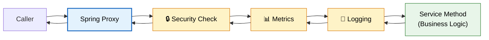
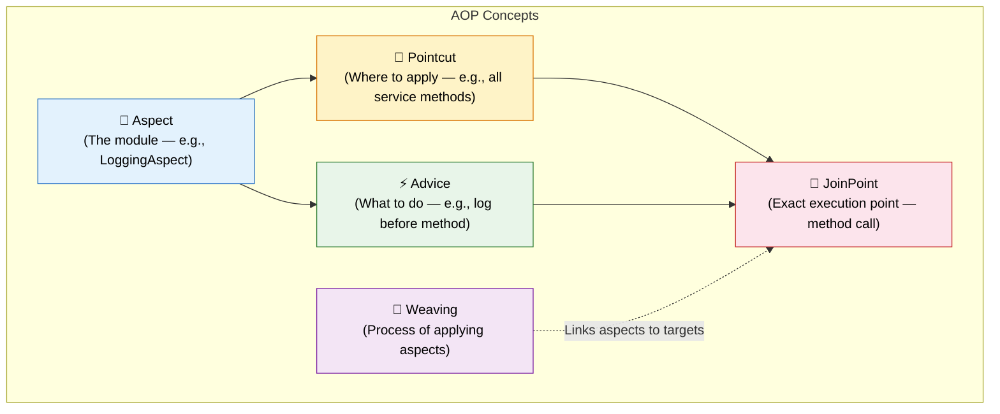
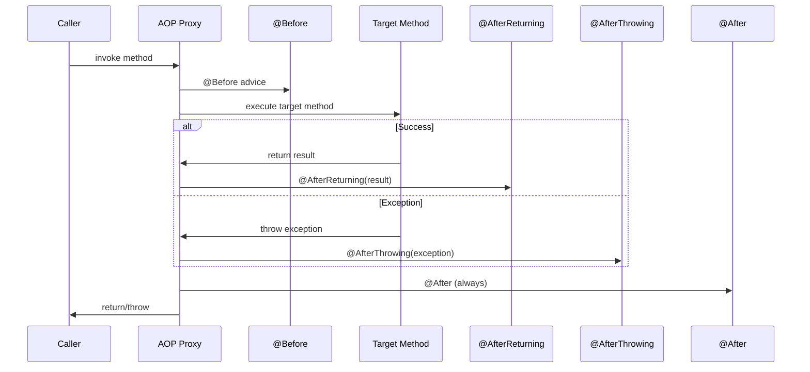
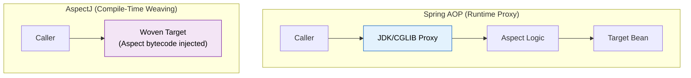
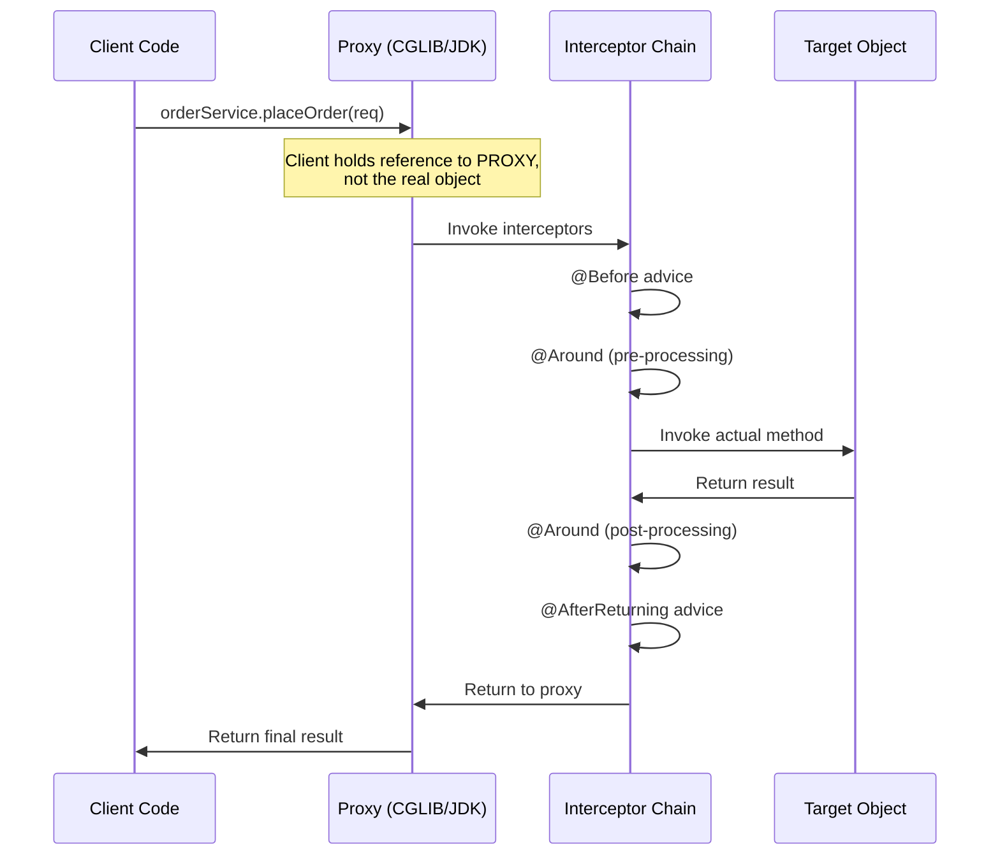
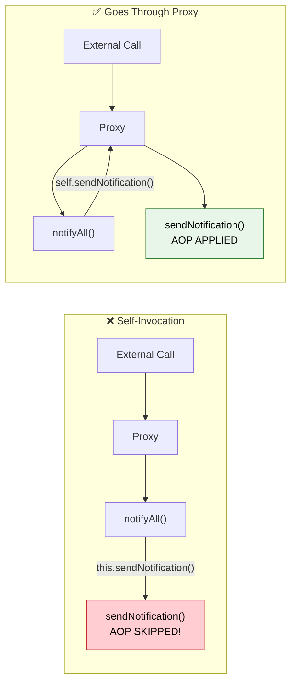

# 🎯 Spring AOP (Aspect-Oriented Programming)

> **Modularize cross-cutting concerns like logging, security, and metrics — without scattering boilerplate code across every service method.**

---

!!! abstract "Real-World Analogy"
    Think of **airport security checkpoints**. Every passenger (method call) passes through the same security screening (aspect) regardless of their destination gate (business logic). The airlines don't implement their own security — it's a centralized, cross-cutting concern applied uniformly. AOP is that checkpoint: it intercepts calls, applies common behavior, and lets the passenger continue to their gate.



---

## 🧩 Why AOP? Cross-Cutting Concerns

Without AOP, you end up with **tangled code** — the same logging/security/metrics logic copy-pasted in every method:

```java
// ❌ Without AOP — boilerplate everywhere
@Service
public class OrderService {

    public Order placeOrder(OrderRequest request) {
        log.info("Entering placeOrder");          // Logging
        securityContext.checkPermission("ORDER"); // Security
        long start = System.nanoTime();           // Metrics
        
        try {
            Order order = doBusinessLogic(request); // Actual work
            log.info("Exiting placeOrder");
            metrics.record("placeOrder", System.nanoTime() - start);
            return order;
        } catch (Exception e) {
            log.error("Failed placeOrder", e);
            throw e;
        }
    }
}
```

```java
// ✅ With AOP — clean separation
@Service
public class OrderService {

    public Order placeOrder(OrderRequest request) {
        return doBusinessLogic(request);  // Pure business logic only!
    }
}
```

---

## 📖 Key Terminology



| Term | Definition | Example |
|---|---|---|
| **Aspect** | A module encapsulating cross-cutting logic | `@Aspect LoggingAspect` |
| **Advice** | The action taken at a join point | `@Before`, `@Around` method |
| **Pointcut** | Expression defining WHERE advice applies | `execution(* com.app.service.*.*(..))` |
| **JoinPoint** | A point during execution (always a method call in Spring AOP) | `orderService.placeOrder()` being called |
| **Weaving** | Linking aspects to target objects | Spring does this at runtime via proxies |
| **Target** | The object being advised (proxied) | `OrderService` bean |

---

## ⚡ Advice Types

### Setup

```xml
<dependency>
    <groupId>org.springframework.boot</groupId>
    <artifactId>spring-boot-starter-aop</artifactId>
</dependency>
```

---

### @Before — Run Before Method

```java
@Aspect
@Component
public class AuthorizationAspect {

    @Before("execution(* com.app.service.OrderService.placeOrder(..))")
    public void checkAuthorization(JoinPoint joinPoint) {
        Authentication auth = SecurityContextHolder.getContext().getAuthentication();
        if (auth == null || !auth.isAuthenticated()) {
            throw new AccessDeniedException("User not authenticated");
        }
        log.info("Authorization passed for: {}", joinPoint.getSignature().getName());
    }
}
```

---

### @After — Run After Method (Always — like finally)

```java
@Aspect
@Component
public class ResourceCleanupAspect {

    @After("execution(* com.app.service.FileService.*(..))")
    public void cleanupTempResources(JoinPoint joinPoint) {
        log.info("Cleanup after: {}", joinPoint.getSignature().getName());
        TempResourceHolder.clear();
    }
}
```

---

### @AfterReturning — Run After Successful Return

```java
@Aspect
@Component
public class AuditAspect {

    @AfterReturning(
        pointcut = "execution(* com.app.service.PaymentService.processPayment(..))",
        returning = "result"
    )
    public void auditPayment(JoinPoint joinPoint, PaymentResult result) {
        Object[] args = joinPoint.getArgs();
        auditRepository.save(AuditLog.builder()
            .action("PAYMENT_PROCESSED")
            .amount(result.getAmount())
            .transactionId(result.getTransactionId())
            .userId(((PaymentRequest) args[0]).getUserId())
            .timestamp(Instant.now())
            .build());
    }
}
```

---

### @AfterThrowing — Run After Exception

```java
@Aspect
@Component
public class ExceptionMonitoringAspect {

    @AfterThrowing(
        pointcut = "execution(* com.app.service.*.*(..))",
        throwing = "ex"
    )
    public void handleException(JoinPoint joinPoint, Exception ex) {
        String method = joinPoint.getSignature().toShortString();
        log.error("Exception in {}: {}", method, ex.getMessage());
        
        meterRegistry.counter("app.exceptions",
            "method", method,
            "exception", ex.getClass().getSimpleName()
        ).increment();
        
        if (ex instanceof CriticalBusinessException) {
            alertService.notifyOnCall(method, ex);
        }
    }
}
```

---

### @Around — Full Control (Most Powerful)

```java
@Aspect
@Component
public class PerformanceMonitoringAspect {

    @Around("execution(* com.app.service.*.*(..))")
    public Object monitorPerformance(ProceedingJoinPoint joinPoint) throws Throwable {
        String method = joinPoint.getSignature().toShortString();
        Timer.Sample sample = Timer.start(meterRegistry);
        
        try {
            Object result = joinPoint.proceed();  // Execute the actual method
            sample.stop(Timer.builder("app.method.duration")
                .tag("method", method)
                .tag("status", "success")
                .register(meterRegistry));
            return result;
        } catch (Throwable ex) {
            sample.stop(Timer.builder("app.method.duration")
                .tag("method", method)
                .tag("status", "error")
                .register(meterRegistry));
            throw ex;
        }
    }
}
```

---

### Advice Execution Order



| Advice | Runs When | Can Modify Result? | Can Prevent Execution? |
|---|---|---|---|
| `@Before` | Before method | No | Yes (throw exception) |
| `@After` | After method (always) | No | No |
| `@AfterReturning` | After successful return | No (read-only access) | No |
| `@AfterThrowing` | After exception | No | No (can rethrow) |
| `@Around` | Wraps entire method | Yes | Yes |

---

## 🎯 Pointcut Expressions

### execution — Match Method Signatures

```java
// All methods in service package
@Pointcut("execution(* com.app.service.*.*(..))")
public void serviceLayer() {}

// All public methods returning Order
@Pointcut("execution(public Order com.app.service.*.*(..))")
public void orderReturningMethods() {}

// Methods with specific parameter type
@Pointcut("execution(* com.app.service.*.*(Long, ..))")
public void methodsWithLongFirstParam() {}

// Pattern: modifiers  return-type  package.class.method(params)
//          *          *            com.app.service.*.*(..))
```

### within — Match All Methods in a Type

```java
// All methods within OrderService
@Pointcut("within(com.app.service.OrderService)")
public void withinOrderService() {}

// All methods in any class in service package
@Pointcut("within(com.app.service..*)")
public void withinServicePackage() {}
```

### @annotation — Match Methods With Specific Annotation

```java
// All methods annotated with @Transactional
@Pointcut("@annotation(org.springframework.transaction.annotation.Transactional)")
public void transactionalMethods() {}

// Custom annotation
@Pointcut("@annotation(com.app.annotation.LogExecutionTime)")
public void logTimeMethods() {}
```

### args — Match Based on Method Arguments

```java
// Methods that accept a single String argument
@Pointcut("args(String)")
public void methodsWithStringArg() {}

// Bind argument for use in advice
@Before("execution(* com.app.service.UserService.*(..)) && args(userId,..)")
public void logUserAction(Long userId) {
    log.info("Action by user: {}", userId);
}
```

### Combining Pointcuts

```java
@Aspect
@Component
public class CombinedAspect {

    @Pointcut("execution(* com.app.service.*.*(..))")
    public void serviceLayer() {}

    @Pointcut("@annotation(com.app.annotation.Auditable)")
    public void auditable() {}

    // AND — both conditions must match
    @Before("serviceLayer() && auditable()")
    public void auditServiceMethods(JoinPoint joinPoint) { }

    // OR — either condition matches
    @Before("serviceLayer() || execution(* com.app.controller.*.*(..))")
    public void logAllEndpoints(JoinPoint joinPoint) { }

    // NOT — exclude certain methods
    @Before("serviceLayer() && !execution(* com.app.service.*.get*(..))")
    public void nonGetterServiceMethods(JoinPoint joinPoint) { }
}
```

---

## 🛠️ Custom Annotations with AOP

### Example 1: @LogExecutionTime

```java
@Target(ElementType.METHOD)
@Retention(RetentionPolicy.RUNTIME)
public @interface LogExecutionTime {
    String value() default "";
}
```

```java
@Aspect
@Component
@Slf4j
public class LogExecutionTimeAspect {

    @Around("@annotation(logExecutionTime)")
    public Object logTime(ProceedingJoinPoint joinPoint, LogExecutionTime logExecutionTime) throws Throwable {
        String methodName = logExecutionTime.value().isEmpty()
            ? joinPoint.getSignature().toShortString()
            : logExecutionTime.value();

        long start = System.currentTimeMillis();
        try {
            return joinPoint.proceed();
        } finally {
            long duration = System.currentTimeMillis() - start;
            log.info("[PERF] {} executed in {} ms", methodName, duration);
            
            if (duration > 1000) {
                log.warn("[SLOW] {} took {} ms — exceeds 1s threshold", methodName, duration);
            }
        }
    }
}
```

```java
// Usage
@Service
public class ReportService {

    @LogExecutionTime("Monthly Report Generation")
    public Report generateMonthlyReport(YearMonth month) {
        // Complex report generation logic
        return report;
    }
}
```

---

### Example 2: @RateLimit

```java
@Target(ElementType.METHOD)
@Retention(RetentionPolicy.RUNTIME)
public @interface RateLimit {
    int maxRequests() default 100;
    int windowSeconds() default 60;
    String key() default "";  // SpEL expression for rate limit key
}
```

```java
@Aspect
@Component
public class RateLimitAspect {

    private final Map<String, Deque<Long>> requestLog = new ConcurrentHashMap<>();

    @Around("@annotation(rateLimit)")
    public Object enforceRateLimit(ProceedingJoinPoint joinPoint, RateLimit rateLimit) throws Throwable {
        String key = resolveKey(joinPoint, rateLimit);
        long now = System.currentTimeMillis();
        long windowStart = now - (rateLimit.windowSeconds() * 1000L);

        Deque<Long> timestamps = requestLog.computeIfAbsent(key, k -> new ConcurrentLinkedDeque<>());
        
        // Remove expired entries
        while (!timestamps.isEmpty() && timestamps.peekFirst() < windowStart) {
            timestamps.pollFirst();
        }

        if (timestamps.size() >= rateLimit.maxRequests()) {
            throw new RateLimitExceededException(
                String.format("Rate limit exceeded: %d requests per %d seconds",
                    rateLimit.maxRequests(), rateLimit.windowSeconds()));
        }

        timestamps.addLast(now);
        return joinPoint.proceed();
    }

    private String resolveKey(ProceedingJoinPoint joinPoint, RateLimit rateLimit) {
        if (rateLimit.key().isEmpty()) {
            return joinPoint.getSignature().toShortString();
        }
        // Resolve SpEL expression for dynamic keys (e.g., by user/IP)
        return evaluateSpEL(joinPoint, rateLimit.key());
    }
}
```

```java
// Usage
@RestController
@RequestMapping("/api")
public class ApiController {

    @RateLimit(maxRequests = 10, windowSeconds = 60, key = "#request.remoteAddr")
    @PostMapping("/submit")
    public ResponseEntity<String> submit(HttpServletRequest request, @RequestBody Payload payload) {
        return ResponseEntity.ok(service.process(payload));
    }
}
```

---

### Example 3: @Retry

```java
@Target(ElementType.METHOD)
@Retention(RetentionPolicy.RUNTIME)
public @interface Retry {
    int maxAttempts() default 3;
    long delayMs() default 1000;
    Class<? extends Throwable>[] retryOn() default {RuntimeException.class};
}
```

```java
@Aspect
@Component
@Slf4j
public class RetryAspect {

    @Around("@annotation(retry)")
    public Object retryOnFailure(ProceedingJoinPoint joinPoint, Retry retry) throws Throwable {
        int attempts = 0;
        Throwable lastException = null;

        while (attempts < retry.maxAttempts()) {
            try {
                return joinPoint.proceed();
            } catch (Throwable ex) {
                lastException = ex;
                if (!isRetryable(ex, retry.retryOn())) {
                    throw ex;
                }
                attempts++;
                log.warn("Attempt {}/{} failed for {}: {}",
                    attempts, retry.maxAttempts(),
                    joinPoint.getSignature().toShortString(),
                    ex.getMessage());

                if (attempts < retry.maxAttempts()) {
                    Thread.sleep(retry.delayMs() * attempts);  // Exponential backoff
                }
            }
        }
        throw lastException;
    }

    private boolean isRetryable(Throwable ex, Class<? extends Throwable>[] retryOn) {
        for (Class<? extends Throwable> clazz : retryOn) {
            if (clazz.isInstance(ex)) return true;
        }
        return false;
    }
}
```

```java
// Usage
@Service
public class ExternalPaymentGateway {

    @Retry(maxAttempts = 3, delayMs = 500, retryOn = {TimeoutException.class, ConnectException.class})
    public PaymentResponse charge(PaymentRequest request) {
        return restTemplate.postForObject(gatewayUrl, request, PaymentResponse.class);
    }
}
```

---

## 🏢 Real-World Use Cases

| Use Case | Advice Type | Description |
|---|---|---|
| **Performance Monitoring** | `@Around` | Measure method duration, push to Prometheus/Grafana |
| **Audit Trail** | `@AfterReturning` | Record who did what, for compliance (SOX, GDPR) |
| **Retry Logic** | `@Around` | Retry transient failures (network, DB connection) |
| **Caching** | `@Around` | Spring's `@Cacheable` is implemented via AOP |
| **Transaction Management** | `@Around` | Spring's `@Transactional` is an AOP aspect |
| **Security** | `@Before` | Spring Security's `@PreAuthorize` uses AOP |
| **Input Validation** | `@Before` | Validate method arguments before execution |
| **Exception Translation** | `@AfterThrowing` | Convert low-level exceptions to domain exceptions |

---

## 🆚 Spring AOP vs AspectJ



| Feature | Spring AOP | AspectJ |
|---|---|---|
| **Weaving** | Runtime (proxy-based) | Compile-time / Load-time |
| **Join Points** | Method execution only | Methods, constructors, fields, static initializers |
| **Performance** | Slight runtime overhead (proxy indirection) | No runtime overhead (bytecode modified at compile) |
| **Self-Invocation** | Does NOT work (proxy bypassed) | Works (bytecode is woven in) |
| **Private Methods** | Cannot intercept | Can intercept |
| **Final Classes/Methods** | Cannot proxy (CGLIB limitation) | Can weave |
| **Setup Complexity** | Simple (`spring-boot-starter-aop`) | Requires AspectJ compiler (`ajc`) |
| **Best For** | Most Spring Boot apps | High-performance, fine-grained AOP needs |

### How Spring AOP Proxies Work



!!! info "Proxy Types"
    - **JDK Dynamic Proxy**: Used when the target implements an interface. Proxy implements the same interface.
    - **CGLIB Proxy** (default in Spring Boot): Subclasses the target class. Works without interfaces but cannot proxy `final` classes/methods.

---

## ⚠️ Common Pitfalls

### 1. Self-Invocation (Proxy Bypass) — The #1 AOP Mistake

```java
@Service
public class NotificationService {

    public void notifyAll(List<User> users) {
        for (User user : users) {
            sendNotification(user);  // ❌ Calls this.sendNotification() — BYPASSES PROXY
        }
    }

    @RateLimit(maxRequests = 100, windowSeconds = 60)
    @LogExecutionTime
    public void sendNotification(User user) {
        // Rate limiting and logging are NEVER applied when called from within!
        emailClient.send(user.getEmail(), buildMessage(user));
    }
}
```



**Fixes:**

```java
// Fix 1: Self-injection
@Service
public class NotificationService {

    @Lazy
    @Autowired
    private NotificationService self;

    public void notifyAll(List<User> users) {
        for (User user : users) {
            self.sendNotification(user);  // ✅ Goes through proxy
        }
    }
}

// Fix 2: Extract to separate bean
@Service
public class NotificationOrchestrator {
    
    private final NotificationSender sender;

    public void notifyAll(List<User> users) {
        for (User user : users) {
            sender.sendNotification(user);  // ✅ Different bean = goes through proxy
        }
    }
}
```

---

### 2. Final Methods Cannot Be Proxied

```java
@Service
public class PaymentService {

    // ❌ CGLIB cannot override final methods — AOP silently does nothing
    @Transactional
    public final void processPayment(PaymentRequest request) {
        // Transaction management will NOT be applied!
    }
}
```

!!! warning "Rule"
    Never use `final` on methods that need AOP (transactions, caching, custom aspects). CGLIB creates a subclass of your bean, and `final` prevents method overriding.

---

### 3. Private Methods Are Invisible to AOP

```java
@Service
public class ReportService {

    public Report generate() {
        List<Data> data = fetchData();  // ❌ AOP cannot intercept private methods
        return buildReport(data);
    }

    @LogExecutionTime  // This annotation is IGNORED — method is private
    private List<Data> fetchData() {
        return repository.findAll();
    }
}
```

---

### 4. Aspect Ordering

When multiple aspects apply to the same method, use `@Order` to control sequence:

```java
@Aspect
@Component
@Order(1)  // Executes FIRST (outermost)
public class SecurityAspect { }

@Aspect
@Component
@Order(2)  // Executes SECOND
public class TransactionAspect { }

@Aspect
@Component
@Order(3)  // Executes LAST (innermost, closest to target)
public class LoggingAspect { }
```

```
Incoming call → Security → Transaction → Logging → TARGET → Logging → Transaction → Security
```

---

## 🎯 Interview Questions

??? question "1. What is the difference between Spring AOP and AspectJ?"
    **Spring AOP** is proxy-based and operates at runtime. It only supports method-level join points and cannot intercept self-invocations, private methods, or final methods. **AspectJ** performs compile-time or load-time weaving, injecting aspect bytecode directly into the target class. It supports all join points (constructors, field access, etc.) and has no proxy limitations. Spring AOP is simpler to set up and sufficient for 90% of use cases; AspectJ is needed for fine-grained control or performance-critical scenarios.

??? question "2. Why does @Transactional not work when calling a method from within the same class?"
    Spring implements `@Transactional` using AOP proxies. When you call a method externally, the call goes through the proxy which applies the transactional behavior. But when a method calls another method in the same class (`this.method()`), it bypasses the proxy entirely — the annotation is never processed. Fixes include: (1) self-injection with `@Lazy`, (2) extracting the method to a separate `@Service` bean, or (3) using AspectJ mode with compile-time weaving (`@EnableTransactionManagement(mode = AdviceMode.ASPECTJ)`).

??? question "3. What is the difference between @Around and @Before + @After?"
    `@Around` gives you full control: you decide whether to proceed with the method execution, can modify arguments before calling `proceed()`, can modify the return value, and can handle exceptions. `@Before + @After` are more limited — `@Before` cannot prevent execution (except by throwing), `@After` cannot access the return value, and neither can modify the result. Use `@Around` for: timing, retries, caching, and conditional execution. Use `@Before/@After` for simpler, non-invasive concerns like logging entry/exit.

??? question "4. How do you implement a custom annotation that measures method execution time?"
    Define a `@Retention(RUNTIME)` annotation (e.g., `@LogExecutionTime`), create an `@Aspect @Component` class, and write an `@Around("@annotation(logExecutionTime)")` method. Inside the advice, capture `System.currentTimeMillis()` before calling `joinPoint.proceed()`, compute the delta after, and log it. The annotation binding (`@annotation(logExecutionTime)`) lets you access annotation attributes (like thresholds or metric names) directly in the advice method parameter.

??? question "5. What are the limitations of Spring AOP's proxy-based approach?"
    (1) **Self-invocation** does not trigger aspects — internal calls bypass the proxy. (2) **Final methods/classes** cannot be proxied by CGLIB. (3) **Private methods** are not interceptable. (4) **Only method execution** join points are supported (no field access, constructor interception). (5) **Slight runtime overhead** from proxy indirection. (6) Aspects only apply to **Spring-managed beans** — plain `new` objects are not proxied.

??? question "6. How do you control the execution order of multiple aspects?"
    Use the `@Order` annotation on aspect classes. Lower values execute first (outermost in the call chain). For `@Around` advice, the lowest-order aspect's pre-processing runs first, and its post-processing runs last (like layers of an onion). If two aspects have the same order, their relative order is undefined. You can also implement the `Ordered` interface for programmatic control.
