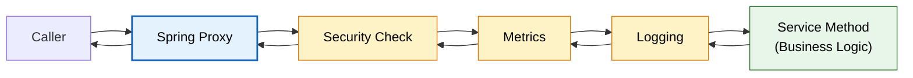
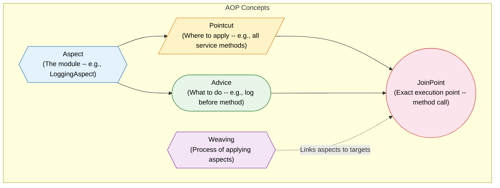
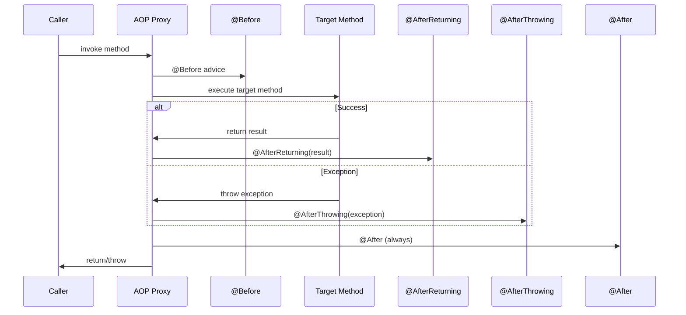
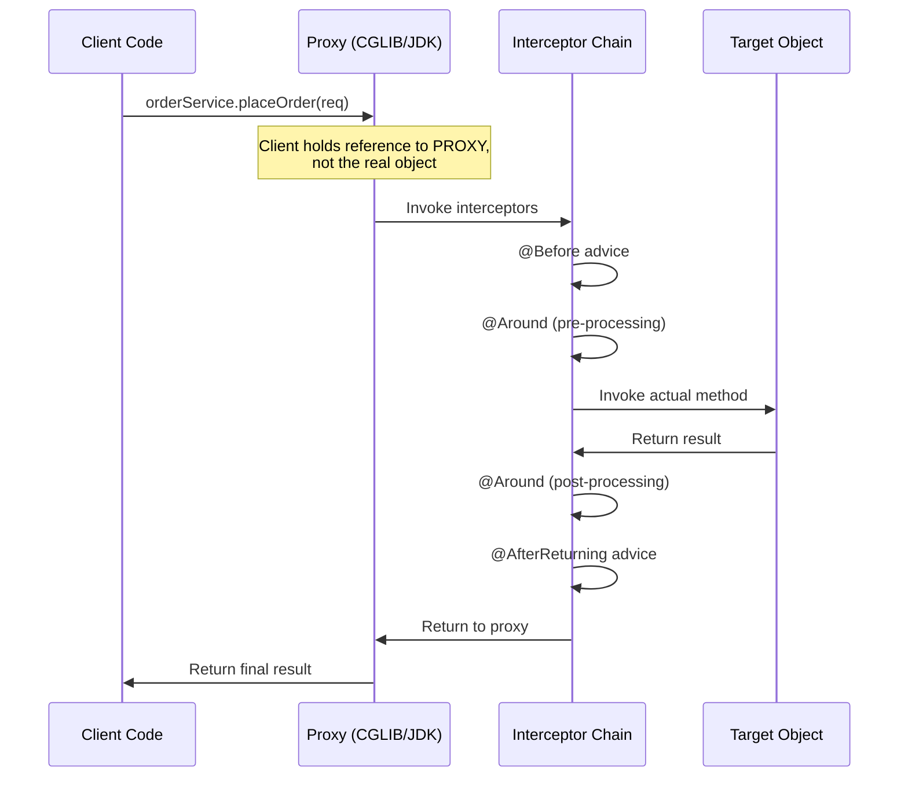
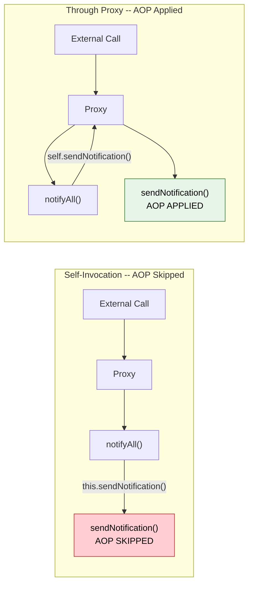
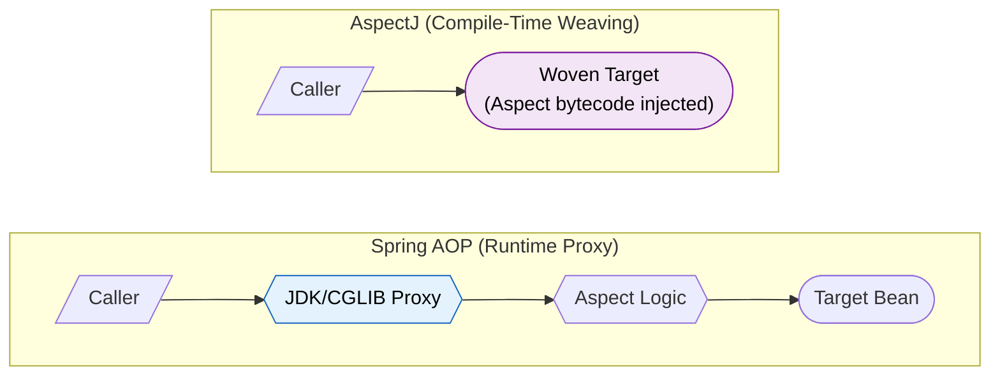

# Spring AOP (Aspect-Oriented Programming)

> Modularize cross-cutting concerns. Stop scattering logging, security, and metrics boilerplate across every service method.

---

!!! abstract "Real-World Analogy"
    Airport security checkpoints. Every passenger (method call) passes through the same screening (aspect) regardless of destination gate (business logic). Airlines don't implement their own security. It's centralized. AOP is that checkpoint: intercept, apply behavior, let the caller continue.



---

## What AOP Solves: Cross-Cutting Concerns

Cross-cutting concerns are behaviors that span multiple modules: logging, security, transactions, caching, metrics. Without AOP, these concerns tangle with business logic.

```java
// Without AOP -- boilerplate everywhere
@Service
public class OrderService {

    public Order placeOrder(OrderRequest request) {
        log.info("Entering placeOrder");
        securityContext.checkPermission("ORDER");
        long start = System.nanoTime();

        try {
            Order order = doBusinessLogic(request);
            log.info("Exiting placeOrder");
            metrics.record("placeOrder", System.nanoTime() - start);
            return order;
        } catch (Exception e) {
            log.error("Failed placeOrder", e);
            throw e;
        }
    }
}
```

```java
// With AOP -- pure business logic
@Service
public class OrderService {

    public Order placeOrder(OrderRequest request) {
        return doBusinessLogic(request);
    }
}
```

---

## Terminology



| Term | Definition | Example |
|---|---|---|
| **Aspect** | Module encapsulating cross-cutting logic | `@Aspect LoggingAspect` |
| **Advice** | Action taken at a join point | `@Before`, `@Around` method |
| **Pointcut** | Expression defining WHERE advice applies | `execution(* com.app.service.*.*(..))` |
| **JoinPoint** | A point during execution (always a method call in Spring AOP) | `orderService.placeOrder()` being called |
| **Weaving** | Linking aspects to target objects | Spring does this at runtime via proxies |
| **Target** | The object being advised (proxied) | `OrderService` bean |

---

## Advice Types

### Setup

```xml
<dependency>
    <groupId>org.springframework.boot</groupId>
    <artifactId>spring-boot-starter-aop</artifactId>
</dependency>
```

---

### @Before -- Run Before Method

Runs before the target method executes. Cannot modify return value. Can prevent execution only by throwing.

```java
@Aspect
@Component
public class AuthorizationAspect {

    @Before("execution(* com.app.service.OrderService.placeOrder(..))")
    public void checkAuthorization(JoinPoint joinPoint) {
        Authentication auth = SecurityContextHolder.getContext().getAuthentication();
        if (auth == null || !auth.isAuthenticated()) {
            throw new AccessDeniedException("User not authenticated");
        }
        log.info("Authorization passed for: {}", joinPoint.getSignature().getName());
    }
}
```

!!! tip "When to use @Before"
    Input validation. Permission checks. Logging method entry. Anything that should gate execution but does not need the return value.

---

### @After -- Run After Method (Always, Like Finally)

Executes regardless of success or failure. Cannot access the return value or exception.

```java
@Aspect
@Component
public class ResourceCleanupAspect {

    @After("execution(* com.app.service.FileService.*(..))")
    public void cleanupTempResources(JoinPoint joinPoint) {
        log.info("Cleanup after: {}", joinPoint.getSignature().getName());
        TempResourceHolder.clear();
    }
}
```

!!! tip "When to use @After"
    Resource cleanup. Releasing locks. Clearing thread-local state. Any "finally" behavior.

---

### @AfterReturning -- Run After Successful Return

Has read access to the return value. Does not execute if the method throws.

```java
@Aspect
@Component
public class AuditAspect {

    @AfterReturning(
        pointcut = "execution(* com.app.service.PaymentService.processPayment(..))",
        returning = "result"
    )
    public void auditPayment(JoinPoint joinPoint, PaymentResult result) {
        Object[] args = joinPoint.getArgs();
        auditRepository.save(AuditLog.builder()
            .action("PAYMENT_PROCESSED")
            .amount(result.getAmount())
            .transactionId(result.getTransactionId())
            .userId(((PaymentRequest) args[0]).getUserId())
            .timestamp(Instant.now())
            .build());
    }
}
```

!!! tip "When to use @AfterReturning"
    Audit trails. Publishing events based on results. Metrics that depend on successful output.

---

### @AfterThrowing -- Run After Exception

Captures the thrown exception. Cannot swallow it (the exception still propagates).

```java
@Aspect
@Component
public class ExceptionMonitoringAspect {

    @AfterThrowing(
        pointcut = "execution(* com.app.service.*.*(..))",
        throwing = "ex"
    )
    public void handleException(JoinPoint joinPoint, Exception ex) {
        String method = joinPoint.getSignature().toShortString();
        log.error("Exception in {}: {}", method, ex.getMessage());

        meterRegistry.counter("app.exceptions",
            "method", method,
            "exception", ex.getClass().getSimpleName()
        ).increment();

        if (ex instanceof CriticalBusinessException) {
            alertService.notifyOnCall(method, ex);
        }
    }
}
```

!!! tip "When to use @AfterThrowing"
    Error monitoring. Alerting. Incrementing exception counters. Exception translation (though @Around is better for that).

---

### @Around -- Full Control (Most Powerful)

Wraps the entire method. Controls whether to proceed. Can modify arguments, return value, or swallow exceptions.

```java
@Aspect
@Component
public class PerformanceMonitoringAspect {

    @Around("execution(* com.app.service.*.*(..))")
    public Object monitorPerformance(ProceedingJoinPoint joinPoint) throws Throwable {
        String method = joinPoint.getSignature().toShortString();
        Timer.Sample sample = Timer.start(meterRegistry);

        try {
            Object result = joinPoint.proceed();  // Execute the actual method
            sample.stop(Timer.builder("app.method.duration")
                .tag("method", method)
                .tag("status", "success")
                .register(meterRegistry));
            return result;
        } catch (Throwable ex) {
            sample.stop(Timer.builder("app.method.duration")
                .tag("method", method)
                .tag("status", "error")
                .register(meterRegistry));
            throw ex;
        }
    }
}
```

!!! warning "@Around requires calling `proceed()`"
    If you forget to call `joinPoint.proceed()`, the target method never executes. If you forget to return the result, callers get `null`.

#### Modifying Arguments and Return Values

```java
@Around("execution(* com.app.service.UserService.findUser(..))")
public Object normalizeAndCache(ProceedingJoinPoint joinPoint) throws Throwable {
    // Modify arguments before proceeding
    Object[] args = joinPoint.getArgs();
    args[0] = ((String) args[0]).trim().toLowerCase();  // Normalize email input

    Object result = joinPoint.proceed(args);  // Pass modified args

    // Modify return value
    if (result instanceof User user) {
        user.setLastAccessedAt(Instant.now());
    }
    return result;
}
```

---

### Advice Execution Order



| Advice | Runs When | Can Modify Result? | Can Prevent Execution? |
|---|---|---|---|
| `@Before` | Before method | No | Yes (throw exception) |
| `@After` | After method (always) | No | No |
| `@AfterReturning` | After successful return | No (read-only access) | No |
| `@AfterThrowing` | After exception | No | No (can rethrow) |
| `@Around` | Wraps entire method | **Yes** | **Yes** |

---

## Pointcut Expressions

### execution() -- Match Method Signatures

The most common pointcut designator. Pattern: `execution(modifiers return-type package.class.method(params))`.

```java
// All methods in service package
@Pointcut("execution(* com.app.service.*.*(..))")
public void serviceLayer() {}

// All public methods returning Order
@Pointcut("execution(public Order com.app.service.*.*(..))")
public void orderReturningMethods() {}

// Methods with specific parameter type
@Pointcut("execution(* com.app.service.*.*(Long, ..))")
public void methodsWithLongFirstParam() {}

// Only void methods in any subpackage of service
@Pointcut("execution(void com.app.service..*.*(..))")
public void voidServiceMethods() {}
```

!!! info "Pattern breakdown"
    ```
    execution([modifiers] return-type [declaring-type.]method-name(param-pattern) [throws])
    ```
    - `*` matches any single segment
    - `..` in package = any sub-package; in params = any number of params

---

### @annotation() -- Match Methods With Specific Annotation

```java
// All methods annotated with @Transactional
@Pointcut("@annotation(org.springframework.transaction.annotation.Transactional)")
public void transactionalMethods() {}

// Custom annotation -- bind it for access in advice
@Around("@annotation(timed)")
public Object timeIt(ProceedingJoinPoint pjp, Timed timed) throws Throwable {
    // Access timed.value(), timed.unit(), etc.
}
```

---

### within() -- Match All Methods in a Type

```java
// All methods within OrderService
@Pointcut("within(com.app.service.OrderService)")
public void withinOrderService() {}

// All methods in any class in service package (including sub-packages)
@Pointcut("within(com.app.service..*)")
public void withinServicePackage() {}
```

---

### args() -- Match Based on Method Arguments

```java
// Methods that accept a single String argument
@Pointcut("args(String)")
public void methodsWithStringArg() {}

// Bind argument for use in advice
@Before("execution(* com.app.service.UserService.*(..)) && args(userId,..)")
public void logUserAction(Long userId) {
    log.info("Action by user: {}", userId);
}
```

---

### Combining Pointcuts

```java
@Aspect
@Component
public class CombinedAspect {

    @Pointcut("execution(* com.app.service.*.*(..))")
    public void serviceLayer() {}

    @Pointcut("@annotation(com.app.annotation.Auditable)")
    public void auditable() {}

    // AND -- both conditions must match
    @Before("serviceLayer() && auditable()")
    public void auditServiceMethods(JoinPoint joinPoint) { }

    // OR -- either condition matches
    @Before("serviceLayer() || execution(* com.app.controller.*.*(..))")
    public void logAllEndpoints(JoinPoint joinPoint) { }

    // NOT -- exclude certain methods
    @Before("serviceLayer() && !execution(* com.app.service.*.get*(..))")
    public void nonGetterServiceMethods(JoinPoint joinPoint) { }
}
```

---

## How Spring AOP Works: Proxy Mechanism

Spring AOP is proxy-based. When Spring creates a bean that has aspects applied, it wraps it in a proxy object. Callers interact with the proxy, not the real object.

### CGLIB Proxy vs JDK Dynamic Proxy

| Feature | JDK Dynamic Proxy | CGLIB Proxy |
|---|---|---|
| **Mechanism** | Implements target's interface | Subclasses the target class |
| **Requirement** | Target must implement an interface | No interface needed |
| **Cannot proxy** | Classes without interfaces | `final` classes or `final` methods |
| **Spring Boot default** | No (since Spring Boot 2.0) | **Yes** (default) |
| **Performance** | Slightly faster for interface calls | Slightly faster for class calls |

!!! info "When each proxy type is used"
    - **CGLIB** (default): Spring Boot uses CGLIB by default (`spring.aop.proxy-target-class=true`). Generates a subclass at runtime.
    - **JDK Dynamic Proxy**: Used when you explicitly set `spring.aop.proxy-target-class=false` AND the bean implements an interface.

### Proxy Creation Internals

```java
// What Spring does internally (simplified):
// 1. BeanPostProcessor detects that OrderService has aspects matching it
// 2. Creates proxy:

// CGLIB approach -- subclass
public class OrderService$$EnhancerBySpringCGLIB extends OrderService {
    private MethodInterceptor interceptor;

    @Override
    public Order placeOrder(OrderRequest request) {
        // Interceptor invokes advice chain, then calls super.placeOrder(request)
        return (Order) interceptor.intercept(this, method, args, methodProxy);
    }
}

// JDK Dynamic Proxy approach -- interface-based
Proxy.newProxyInstance(
    classLoader,
    new Class[]{OrderServiceInterface.class},
    (proxy, method, args) -> {
        // Invoke advice chain, then call real target
        return method.invoke(realTarget, args);
    }
);
```



---

## The Self-Invocation Problem

The most common AOP pitfall. When a method calls another method in the same class via `this.method()`, it bypasses the proxy. No advice is applied.

### Why It Happens

The proxy wraps the bean externally. Internal calls use `this`, which is the raw object, not the proxy.

```java
@Service
public class NotificationService {

    public void notifyAll(List<User> users) {
        for (User user : users) {
            sendNotification(user);  // Calls this.sendNotification() -- BYPASSES PROXY
        }
    }

    @RateLimit(maxRequests = 100, windowSeconds = 60)
    @LogExecutionTime
    public void sendNotification(User user) {
        // Rate limiting and logging are NEVER applied when called internally
        emailClient.send(user.getEmail(), buildMessage(user));
    }
}
```



### Three Fixes

=== "Fix 1: Self-Injection"

    ```java
    @Service
    public class NotificationService {

        @Lazy
        @Autowired
        private NotificationService self;  // Injects the PROXY

        public void notifyAll(List<User> users) {
            for (User user : users) {
                self.sendNotification(user);  // Goes through proxy
            }
        }
    }
    ```

    !!! note
        `@Lazy` prevents circular dependency issues. The injected `self` is the proxy, not `this`.

=== "Fix 2: Extract to Separate Bean"

    ```java
    @Service
    public class NotificationOrchestrator {
        private final NotificationSender sender;  // Different bean

        public void notifyAll(List<User> users) {
            for (User user : users) {
                sender.sendNotification(user);  // Different bean = goes through its proxy
            }
        }
    }

    @Service
    public class NotificationSender {
        @RateLimit(maxRequests = 100, windowSeconds = 60)
        public void sendNotification(User user) { ... }
    }
    ```

=== "Fix 3: Use AspectJ (Compile-Time Weaving)"

    ```java
    @EnableTransactionManagement(mode = AdviceMode.ASPECTJ)
    @EnableAspectJAutoProxy(proxyTargetClass = true)
    @Configuration
    public class AopConfig { }
    ```

    AspectJ weaves bytecode directly into the class at compile time. No proxy involved. Self-invocation works because the advice is in the bytecode itself.

---

## Custom Annotations with AOP

### Build @Timed -- Log Method Execution Time

The annotation:

```java
@Target(ElementType.METHOD)
@Retention(RetentionPolicy.RUNTIME)
public @interface Timed {
    String value() default "";
    long warnThresholdMs() default 1000;
}
```

The aspect:

```java
@Aspect
@Component
@Slf4j
public class TimedAspect {

    @Around("@annotation(timed)")
    public Object measureTime(ProceedingJoinPoint joinPoint, Timed timed) throws Throwable {
        String label = timed.value().isEmpty()
            ? joinPoint.getSignature().toShortString()
            : timed.value();

        long start = System.nanoTime();
        try {
            return joinPoint.proceed();
        } finally {
            long durationMs = (System.nanoTime() - start) / 1_000_000;
            log.info("[TIMED] {} completed in {} ms", label, durationMs);

            if (durationMs > timed.warnThresholdMs()) {
                log.warn("[SLOW] {} took {} ms -- exceeds {} ms threshold",
                    label, durationMs, timed.warnThresholdMs());
            }
        }
    }
}
```

Usage:

```java
@Service
public class ReportService {

    @Timed(value = "Monthly Report Generation", warnThresholdMs = 5000)
    public Report generateMonthlyReport(YearMonth month) {
        // Complex report generation
        return report;
    }
}
```

Output:
```
[TIMED] Monthly Report Generation completed in 3200 ms
```

If it takes more than 5 seconds:
```
[TIMED] Monthly Report Generation completed in 7800 ms
[SLOW] Monthly Report Generation took 7800 ms -- exceeds 5000 ms threshold
```

---

### Build @RateLimit

```java
@Target(ElementType.METHOD)
@Retention(RetentionPolicy.RUNTIME)
public @interface RateLimit {
    int maxRequests() default 100;
    int windowSeconds() default 60;
    String key() default "";
}
```

```java
@Aspect
@Component
public class RateLimitAspect {

    private final Map<String, Deque<Long>> requestLog = new ConcurrentHashMap<>();

    @Around("@annotation(rateLimit)")
    public Object enforceRateLimit(ProceedingJoinPoint joinPoint, RateLimit rateLimit) throws Throwable {
        String key = resolveKey(joinPoint, rateLimit);
        long now = System.currentTimeMillis();
        long windowStart = now - (rateLimit.windowSeconds() * 1000L);

        Deque<Long> timestamps = requestLog.computeIfAbsent(key, k -> new ConcurrentLinkedDeque<>());

        // Evict expired entries
        while (!timestamps.isEmpty() && timestamps.peekFirst() < windowStart) {
            timestamps.pollFirst();
        }

        if (timestamps.size() >= rateLimit.maxRequests()) {
            throw new RateLimitExceededException(
                String.format("Rate limit exceeded: %d/%d requests in %d seconds",
                    timestamps.size(), rateLimit.maxRequests(), rateLimit.windowSeconds()));
        }

        timestamps.addLast(now);
        return joinPoint.proceed();
    }

    private String resolveKey(ProceedingJoinPoint joinPoint, RateLimit rateLimit) {
        if (rateLimit.key().isEmpty()) {
            return joinPoint.getSignature().toShortString();
        }
        return evaluateSpEL(joinPoint, rateLimit.key());
    }
}
```

---

### Build @Audit

```java
@Target(ElementType.METHOD)
@Retention(RetentionPolicy.RUNTIME)
public @interface Audit {
    String action();
    String entity() default "";
}
```

```java
@Aspect
@Component
public class AuditAspect {

    private final AuditRepository auditRepo;
    private final SecurityContext securityContext;

    @AfterReturning(pointcut = "@annotation(audit)", returning = "result")
    public void recordAudit(JoinPoint joinPoint, Audit audit, Object result) {
        String user = securityContext.getCurrentUser().getUsername();
        String entity = audit.entity().isEmpty()
            ? joinPoint.getTarget().getClass().getSimpleName()
            : audit.entity();

        auditRepo.save(AuditEntry.builder()
            .action(audit.action())
            .entity(entity)
            .user(user)
            .args(Arrays.toString(joinPoint.getArgs()))
            .result(String.valueOf(result))
            .timestamp(Instant.now())
            .build());
    }
}
```

Usage:

```java
@Service
public class UserService {

    @Audit(action = "CREATE_USER", entity = "User")
    public User createUser(CreateUserRequest request) {
        return userRepository.save(mapToEntity(request));
    }
}
```

---

### Build @Retry

```java
@Target(ElementType.METHOD)
@Retention(RetentionPolicy.RUNTIME)
public @interface Retry {
    int maxAttempts() default 3;
    long delayMs() default 1000;
    Class<? extends Throwable>[] retryOn() default {RuntimeException.class};
}
```

```java
@Aspect
@Component
@Slf4j
public class RetryAspect {

    @Around("@annotation(retry)")
    public Object retryOnFailure(ProceedingJoinPoint joinPoint, Retry retry) throws Throwable {
        Throwable lastException = null;

        for (int attempt = 1; attempt <= retry.maxAttempts(); attempt++) {
            try {
                return joinPoint.proceed();
            } catch (Throwable ex) {
                lastException = ex;
                if (!isRetryable(ex, retry.retryOn())) {
                    throw ex;
                }
                log.warn("Attempt {}/{} failed for {}: {}",
                    attempt, retry.maxAttempts(),
                    joinPoint.getSignature().toShortString(),
                    ex.getMessage());

                if (attempt < retry.maxAttempts()) {
                    Thread.sleep(retry.delayMs() * attempt);  // Linear backoff
                }
            }
        }
        throw lastException;
    }

    private boolean isRetryable(Throwable ex, Class<? extends Throwable>[] retryOn) {
        for (Class<? extends Throwable> clazz : retryOn) {
            if (clazz.isInstance(ex)) return true;
        }
        return false;
    }
}
```

---

## Real-World Aspects

| Use Case | Advice Type | How It Works |
|---|---|---|
| **Performance Monitoring** | `@Around` | Measure duration, push to Prometheus/Grafana |
| **Audit Trail** | `@AfterReturning` | Record who did what, for SOX/GDPR compliance |
| **Retry Logic** | `@Around` | Retry transient failures (network timeouts, DB locks) |
| **Caching** | `@Around` | Spring's `@Cacheable` is implemented via AOP proxy |
| **Transaction Management** | `@Around` | Spring's `@Transactional` is an AOP aspect |
| **Security** | `@Before` | Spring Security's `@PreAuthorize` uses AOP |
| **Rate Limiting** | `@Around` | Throttle calls per key within a time window |
| **Exception Translation** | `@AfterThrowing` | Convert low-level exceptions to domain exceptions |
| **Input Validation** | `@Before` | Validate method arguments before execution |

---

## Spring AOP vs AspectJ



| Feature | Spring AOP | AspectJ |
|---|---|---|
| **Weaving** | Runtime (proxy-based) | Compile-time or load-time |
| **Join Points** | Method execution only | Methods, constructors, fields, static initializers |
| **Performance** | Slight runtime overhead (proxy indirection) | No runtime overhead (bytecode is pre-woven) |
| **Self-Invocation** | Does NOT work (proxy bypassed) | Works (bytecode is inside the class) |
| **Private Methods** | Cannot intercept | Can intercept |
| **Final Classes/Methods** | Cannot proxy (CGLIB limitation) | Can weave |
| **Setup Complexity** | Simple (`spring-boot-starter-aop`) | Requires AspectJ compiler (`ajc`) or load-time weaver |
| **Best For** | Most Spring Boot applications | High-performance, fine-grained AOP needs |

!!! note "When to choose AspectJ over Spring AOP"
    - You need to advise `private`, `final`, or `static` methods.
    - Self-invocation must trigger aspects.
    - Performance overhead of proxy indirection is unacceptable (hot paths, millions of calls/sec).
    - You need constructor or field-access join points.

---

## Gotchas and Pitfalls

### AOP on Final Classes and Methods

CGLIB generates a subclass of your bean. `final` prevents subclassing or method overriding.

```java
@Service
public class PaymentService {

    // CGLIB cannot override this -- AOP silently does nothing
    @Transactional
    public final void processPayment(PaymentRequest request) {
        // Transaction management NOT applied
    }
}
```

!!! warning "Rule"
    Never use `final` on methods that need AOP. This includes `@Transactional`, `@Cacheable`, `@Async`, and any custom aspects.

### AOP on Private Methods

Spring AOP only intercepts public (and package-private/protected with CGLIB) method calls through the proxy. Private methods are invisible.

```java
@Service
public class ReportService {

    public Report generate() {
        List<Data> data = fetchData();  // Private -- AOP cannot intercept
        return buildReport(data);
    }

    @LogExecutionTime  // IGNORED -- method is private
    private List<Data> fetchData() {
        return repository.findAll();
    }
}
```

### Ordering with @Order

When multiple aspects target the same method, `@Order` controls the nesting order. Lower value = outermost (executes first on the way in, last on the way out).

```java
@Aspect
@Component
@Order(1)  // Outermost -- executes first
public class SecurityAspect { }

@Aspect
@Component
@Order(2)
public class TransactionAspect { }

@Aspect
@Component
@Order(3)  // Innermost -- closest to target method
public class LoggingAspect { }
```

```
Request --> Security(1) --> Transaction(2) --> Logging(3) --> TARGET --> Logging(3) --> Transaction(2) --> Security(1) --> Response
```

!!! info "Undefined order"
    If two aspects have the same `@Order` value (or no `@Order`), their relative order is undefined. Always be explicit.

---

### AOP Only Applies to Spring Beans

Objects created with `new` are not proxied. AOP only works on beans managed by the Spring container.

```java
// AOP will NOT apply -- not a Spring bean
NotificationService svc = new NotificationService();
svc.sendNotification(user);  // No proxy, no advice
```

---

## Interview Questions

??? question "1. CGLIB vs JDK Dynamic Proxy -- what is the difference?"
    **JDK Dynamic Proxy** implements the target's interface at runtime using `java.lang.reflect.Proxy`. The target must implement an interface. The proxy delegates calls to an `InvocationHandler`.

    **CGLIB** generates a subclass of the target at runtime using bytecode generation (ASM library). No interface required. Cannot proxy `final` classes or methods because it relies on inheritance.

    Spring Boot 2.0+ defaults to CGLIB (`spring.aop.proxy-target-class=true`). JDK proxy is used only when explicitly configured and the target has an interface.

??? question "2. Why does self-invocation bypass AOP?"
    Spring AOP is proxy-based. External callers hold a reference to the proxy, so calls go through the advice chain. But inside the bean, `this` refers to the raw object, not the proxy. Calling `this.method()` invokes the method directly on the target, bypassing all interceptors. The proxy is only in the call path for external invocations.

??? question "3. How does @Transactional use AOP?"
    `@Transactional` is implemented as an `@Around` aspect (`TransactionInterceptor`). Before the method: it opens a transaction (or joins an existing one based on propagation). After successful return: it commits. After exception: it rolls back (for unchecked exceptions by default). This is why `@Transactional` on a `private` or `final` method does nothing, and self-invocation skips transaction management.

??? question "4. Can you AOP a private method in Spring?"
    No. Spring AOP uses proxies (CGLIB subclass or JDK interface proxy). Private methods cannot be overridden in a subclass and are not part of any interface. They are invisible to the proxy mechanism. Use AspectJ with compile-time weaving if you need to advise private methods.

??? question "5. What is the difference between @Around and @Before + @After combined?"
    `@Around` gives complete control. You can: (1) prevent execution entirely, (2) modify arguments via `proceed(newArgs)`, (3) modify the return value, (4) catch and swallow exceptions, (5) retry the method. `@Before + @After` cannot do any of these. `@Before` fires before execution (can only throw to prevent it). `@After` fires after but has no access to the result. Use `@Around` for timing, retries, caching, and conditional execution.

??? question "6. What happens if you apply AOP to a final class?"
    CGLIB proxy creation fails at startup. Spring throws a `BeanCreationException` because CGLIB cannot subclass a `final` class. If only a method is `final`, the proxy is created but that specific method is not intercepted -- aspects on it are silently ignored.

??? question "7. How do you control execution order of multiple aspects?"
    Use `@Order(n)` on the aspect class. Lower values execute first (outermost layer). For `@Around`, low-order aspects wrap high-order aspects. Without `@Order`, execution order is undefined. You can also implement the `Ordered` interface for programmatic control.

??? question "8. What is the ProceedingJoinPoint and when do you use it?"
    `ProceedingJoinPoint` is a subtype of `JoinPoint` available only in `@Around` advice. It adds the `proceed()` method, which invokes the next advice in the chain or the target method. You can call `proceed()` zero times (skip execution), once (normal), or multiple times (retry). You can also pass modified arguments: `proceed(Object[] newArgs)`.

??? question "9. Can @Around advice modify the method's arguments?"
    Yes. Call `joinPoint.proceed(modifiedArgs)` with a new `Object[]` array. The target method receives the modified values. This is useful for input sanitization, normalization, or injecting context.

??? question "10. Why does Spring Boot default to CGLIB instead of JDK proxies?"
    JDK proxies require the target to implement an interface. Many Spring beans are concrete classes without interfaces. CGLIB handles both cases uniformly. Before Spring Boot 2.0, if a bean had no interface, CGLIB was used; if it had an interface, JDK proxy was used -- causing inconsistent behavior. Defaulting to CGLIB eliminated this confusion.

??? question "11. How does Spring's @Cacheable work under the hood?"
    `@Cacheable` is implemented as an `@Around` aspect (`CacheInterceptor`). Before proceeding, it checks the cache for the key (derived from method arguments or a SpEL expression). If a cache hit occurs, it returns the cached value without calling the target. On a miss, it proceeds, caches the result, and returns it. Self-invocation bypasses the cache for the same proxy reason as `@Transactional`.

??? question "12. What is the difference between compile-time and runtime weaving?"
    **Runtime weaving** (Spring AOP): Aspects are applied by wrapping beans in proxies at startup. Simple. Limited to method-level join points. Has proxy overhead.

    **Compile-time weaving** (AspectJ): The `ajc` compiler modifies bytecode during compilation, injecting aspect logic directly into class files. No proxy. No self-invocation problem. Supports all join points. Requires build tool integration.

    **Load-time weaving** (AspectJ LTW): A Java agent modifies bytecode as classes are loaded by the JVM. Middle ground -- no special compiler, but needs `-javaagent` flag at startup.

??? question "13. How do you test aspects in isolation?"
    Three approaches: (1) **Integration test** -- boot a Spring context, invoke the advised method, verify behavior. (2) **Unit test the aspect** -- instantiate the aspect directly, mock `ProceedingJoinPoint`, call the advice method. (3) **Slice test** -- use `@SpringBootTest` with a minimal config that only loads the aspect and a test target bean.

    ```java
    @SpringBootTest
    class TimedAspectTest {
        @Autowired
        private TestService testService;  // A simple bean with @Timed

        @Test
        void shouldLogExecutionTime() {
            testService.slowMethod();
            // Assert log output or metrics
        }
    }
    ```

??? question "14. What are the limitations of Spring AOP?"
    1. Only method-execution join points (no field access, no constructors).
    2. Self-invocation bypasses proxy.
    3. Cannot advise `final` methods/classes (CGLIB).
    4. Cannot advise `private` methods.
    5. Only works on Spring-managed beans.
    6. Slight runtime overhead from proxy indirection.
    7. Aspects cannot be applied to aspects themselves.

---

## Summary Table

| Topic | Key Point |
|---|---|
| Proxy type | CGLIB (default). Subclasses target. Cannot handle `final`. |
| Self-invocation | `this.method()` bypasses proxy. Fix: self-inject, extract bean, or use AspectJ. |
| Private methods | Invisible to Spring AOP. No interception. |
| @Around | Most powerful. Controls proceed, args, return, exceptions. |
| Ordering | `@Order(1)` = outermost. Lower = first in, last out. |
| @Transactional | Implemented as @Around AOP. Subject to all proxy limitations. |
| AspectJ | Compile-time weaving. No proxy. No limitations. More complex setup. |
