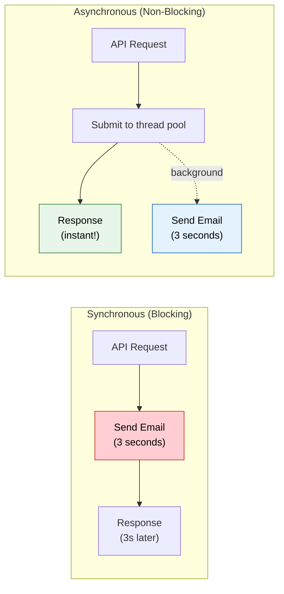
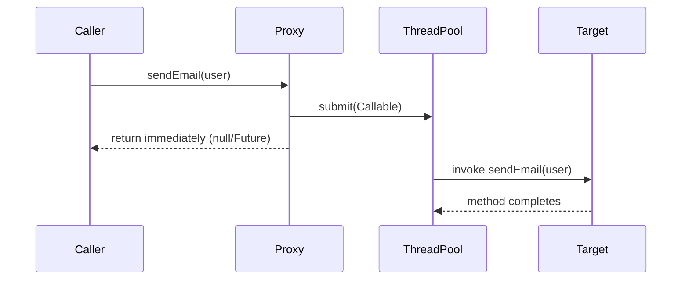

# Async & Scheduling

> **Run tasks in background threads and schedule recurring jobs. Never block your API response waiting for slow operations.**

---

!!! abstract "Real-World Analogy"
    A restaurant. You place an order. The waiter does not stand in the kitchen waiting (blocking). They hand the order to the kitchen (async), serve other tables, and bring your food when ready. `@Async` works identically — hand off slow work to a background thread and return immediately.



---

## @Async Internals

`@Async` is proxy-based. Spring wraps the bean in a CGLIB or JDK dynamic proxy. When an `@Async` method is called through the proxy, the invocation is intercepted by `AsyncExecutionInterceptor`. It submits the method call as a `Callable` to a `TaskExecutor` and returns immediately.

Key implications:

- The method runs on a **separate thread** from a thread pool.
- The caller gets back `null` (void), a `Future`, or a `CompletableFuture`.
- Without `@EnableAsync`, the annotation is **silently ignored**. No error. No async.
- Without a custom executor bean, Spring uses `SimpleAsyncTaskExecutor` — which creates a **new thread per invocation** with no pooling. This is dangerous in production.



---

## @EnableAsync

Required to activate async processing. Without it, `@Async` does nothing.

```java
@SpringBootApplication
@EnableAsync
public class Application { }
```

You can also set the default executor mode:

```java
@EnableAsync(proxyTargetClass = true)  // Force CGLIB proxies
```

---

## Custom TaskExecutor Configuration

Always define a custom executor. Never rely on `SimpleAsyncTaskExecutor`.

```java
@Configuration
@EnableAsync
public class AsyncConfig {

    @Bean("taskExecutor")
    public Executor taskExecutor() {
        ThreadPoolTaskExecutor executor = new ThreadPoolTaskExecutor();
        executor.setCorePoolSize(8);
        executor.setMaxPoolSize(20);
        executor.setQueueCapacity(200);
        executor.setThreadNamePrefix("async-");
        executor.setRejectedExecutionHandler(new ThreadPoolExecutor.CallerRunsPolicy());
        executor.setWaitForTasksToCompleteOnShutdown(true);
        executor.setAwaitTerminationSeconds(30);
        executor.initialize();
        return executor;
    }

    @Bean("emailExecutor")
    public Executor emailExecutor() {
        ThreadPoolTaskExecutor executor = new ThreadPoolTaskExecutor();
        executor.setCorePoolSize(2);
        executor.setMaxPoolSize(5);
        executor.setQueueCapacity(50);
        executor.setThreadNamePrefix("email-");
        executor.initialize();
        return executor;
    }
}

// Use specific executor
@Async("emailExecutor")
public void sendEmail(String to, String body) { ... }
```

---

## Thread Pool Tuning

### How ThreadPoolTaskExecutor Works

1. New task arrives.
2. If active threads < `corePoolSize` — create a new thread.
3. If active threads >= `corePoolSize` — put task in queue.
4. If queue is full AND active threads < `maxPoolSize` — create a new thread.
5. If queue is full AND active threads == `maxPoolSize` — rejection policy kicks in.

### Formulas

**CPU-bound tasks** (computation, serialization, hashing):

```
corePoolSize = number of CPU cores
maxPoolSize  = corePoolSize (no benefit exceeding cores)
queueCapacity = short (10-50) to avoid latency buildup
```

**I/O-bound tasks** (HTTP calls, DB queries, file I/O):

```
corePoolSize = number of CPU cores * 2 * (1 + wait_time / service_time)
maxPoolSize  = corePoolSize * 2-4x (burst capacity)
queueCapacity = larger (100-500) depending on acceptable latency
```

Example: 8-core machine, tasks spend 80% waiting on I/O:

```
corePoolSize = 8 * 2 * (1 + 0.8/0.2) = 8 * 2 * 5 = 80
```

### Rejection Policies

| Policy | Behavior |
|---|---|
| `AbortPolicy` | Throws `RejectedExecutionException`. Default. |
| `CallerRunsPolicy` | Executes on the calling thread. Natural backpressure. |
| `DiscardPolicy` | Silently drops the task. |
| `DiscardOldestPolicy` | Drops the oldest queued task, retries submission. |

For most apps, use `CallerRunsPolicy`. It slows the caller down instead of losing work.

---

## Return Types: void vs Future vs CompletableFuture

### void — Fire and Forget

```java
@Async
public void sendWelcomeEmail(String email) {
    emailClient.send(email, "Welcome!", "...");
}
```

Use when: you do not need the result, and failures can be logged asynchronously.

### Future — Legacy

```java
@Async
public Future<Report> generateReport(Long id) {
    Report report = heavyWork(id);
    return new AsyncResult<>(report);
}

// Caller blocks on get()
Future<Report> future = service.generateReport(42L);
Report report = future.get(5, TimeUnit.SECONDS);
```

Use when: stuck on Java 7 or pre-Spring 4.

### CompletableFuture — Preferred

```java
@Async
public CompletableFuture<UserReport> generateReport(Long userId) {
    UserReport report = heavyComputation(userId);
    return CompletableFuture.completedFuture(report);
}

// Caller can compose
CompletableFuture<UserReport> future = service.generateReport(42L);
future.thenAccept(report -> log.info("Done: {}", report))
      .exceptionally(ex -> { log.error("Failed", ex); return null; });
```

Use when: you need composition, chaining, or error handling. Always prefer this.

### Combining Multiple Async Results

```java
CompletableFuture<User> userFuture = userService.fetchUser(id);
CompletableFuture<List<Order>> ordersFuture = orderService.fetchOrders(id);

CompletableFuture.allOf(userFuture, ordersFuture).thenRun(() -> {
    User user = userFuture.join();
    List<Order> orders = ordersFuture.join();
    buildDashboard(user, orders);
});
```

---

## @Scheduled: fixedRate vs fixedDelay vs cron

### Setup

```java
@SpringBootApplication
@EnableScheduling
public class Application { }
```

### fixedRate

Fires every N milliseconds **from the start** of the previous execution. Executions can overlap if the task takes longer than the interval.

```java
@Scheduled(fixedRate = 300_000)  // Every 5 minutes
public void cleanupExpiredTokens() {
    tokenRepository.deleteExpired();
}
```

### fixedDelay

Waits N milliseconds **after the previous execution completes** before starting the next.

```java
@Scheduled(fixedDelay = 10_000)  // 10s after last run finished
public void syncInventory() {
    inventoryService.syncWithWarehouse();
}
```

### cron

Full cron expression support. Six fields (Spring adds seconds).

```java
@Scheduled(cron = "0 0 2 * * *")       // Every day at 2:00 AM
public void generateDailyReport() {
    reportService.generateAndEmail();
}

@Scheduled(cron = "0 0 9 * * MON")     // Every Monday at 9:00 AM
public void weeklyDigest() {
    notificationService.sendWeeklyDigest();
}

@Scheduled(cron = "0 0/15 8-18 * * MON-FRI")  // Every 15 min, 8AM-6PM, weekdays
public void businessHoursCheck() {
    healthService.checkPartners();
}

@Scheduled(cron = "0 0 0 1 1 *")       // Midnight on Jan 1st (yearly)
public void annualRollover() {
    accountService.rolloverQuotas();
}
```

### Cron Expression Cheat Sheet

```
┌───────────── second (0-59)
│ ┌───────────── minute (0-59)
│ │ ┌───────────── hour (0-23)
│ │ │ ┌───────────── day of month (1-31)
│ │ │ │ ┌───────────── month (1-12)
│ │ │ │ │ ┌───────────── day of week (0-7, SUN-SAT)
│ │ │ │ │ │
* * * * * *
```

| Expression | Meaning |
|---|---|
| `0 0 * * * *` | Every hour on the hour |
| `0 0/30 * * * *` | Every 30 minutes |
| `0 0 9-17 * * MON-FRI` | Every hour 9AM-5PM weekdays |
| `0 0 2 * * *` | Every day at 2 AM |
| `0 0 0 1 * *` | First day of every month at midnight |
| `0 30 4 * * SUN` | Every Sunday at 4:30 AM |
| `0 0 12 15 * *` | 15th of every month at noon |

---

## Scheduler Thread Pool

By default, `@Scheduled` uses a **single-threaded** scheduler. One slow task blocks all others.

### SchedulingConfigurer

```java
@Configuration
@EnableScheduling
public class SchedulerConfig implements SchedulingConfigurer {

    @Override
    public void configureTasks(ScheduledTaskRegistrar taskRegistrar) {
        taskRegistrar.setScheduler(taskScheduler());
    }

    @Bean(destroyMethod = "shutdown")
    public Executor taskScheduler() {
        ScheduledThreadPoolExecutor executor = new ScheduledThreadPoolExecutor(4);
        executor.setThreadFactory(r -> {
            Thread t = new Thread(r);
            t.setName("scheduler-" + t.getId());
            t.setDaemon(true);
            return t;
        });
        return executor;
    }
}
```

### Using TaskScheduler Bean

```java
@Bean
public TaskScheduler taskScheduler() {
    ThreadPoolTaskScheduler scheduler = new ThreadPoolTaskScheduler();
    scheduler.setPoolSize(4);
    scheduler.setThreadNamePrefix("scheduler-");
    scheduler.setErrorHandler(t -> log.error("Scheduled task failed", t));
    return scheduler;
}
```

Alternatively via properties:

```yaml
spring:
  task:
    scheduling:
      pool:
        size: 4
      thread-name-prefix: "scheduler-"
```

---

## Error Handling in @Async

### void Methods — AsyncUncaughtExceptionHandler

Exceptions in `void` async methods are silently swallowed by default. You must configure a handler.

```java
@Configuration
public class AsyncExceptionConfig implements AsyncConfigurer {

    @Override
    public AsyncUncaughtExceptionHandler getAsyncUncaughtExceptionHandler() {
        return (ex, method, params) -> {
            log.error("Async exception in {}.{}(): {}",
                method.getDeclaringClass().getSimpleName(),
                method.getName(),
                ex.getMessage(), ex);
            // Alert, metric, or retry logic here
        };
    }

    @Override
    public Executor getAsyncExecutor() {
        // Return your custom executor
        ThreadPoolTaskExecutor executor = new ThreadPoolTaskExecutor();
        executor.setCorePoolSize(5);
        executor.setMaxPoolSize(10);
        executor.setQueueCapacity(100);
        executor.setThreadNamePrefix("async-");
        executor.initialize();
        return executor;
    }
}
```

### CompletableFuture — exceptionally() and handle()

```java
@Async
public CompletableFuture<String> callExternalApi(String url) {
    try {
        String result = restTemplate.getForObject(url, String.class);
        return CompletableFuture.completedFuture(result);
    } catch (Exception ex) {
        CompletableFuture<String> failed = new CompletableFuture<>();
        failed.completeExceptionally(ex);
        return failed;
    }
}

// Caller-side error handling
service.callExternalApi("https://api.example.com/data")
    .thenApply(data -> processData(data))
    .exceptionally(ex -> {
        log.error("API call failed: {}", ex.getMessage());
        return fallbackData();
    });
```

---

## @Async + @Transactional — Transaction Propagation

**Transactions do NOT propagate across threads.** Each thread has its own `TransactionSynchronizationManager` bound to a `ThreadLocal`. A new thread gets no transaction context.

```java
@Service
public class OrderService {

    @Transactional
    public void placeOrder(Order order) {
        orderRepository.save(order);
        notificationService.notifyAsync(order);  // New thread = NO transaction
    }
}

@Service
public class NotificationService {

    @Async
    @Transactional  // This starts a NEW, independent transaction
    public void notifyAsync(Order order) {
        // If this fails, the order transaction is NOT rolled back
        auditRepository.save(new AuditLog(order.getId(), "NOTIFIED"));
        emailClient.send(order.getUserEmail(), "Order placed");
    }
}
```

Rules:

- `@Async` method always runs in a **new** transaction (or none, if not annotated with `@Transactional`).
- Parent transaction commits/rollbacks independently.
- If you need atomicity across both, do not use `@Async`. Or use eventual consistency patterns (outbox, events).

---

## SecurityContext Propagation in Async

By default, `SecurityContext` is **not** propagated to async threads. The background thread has no authenticated user.

### DelegatingSecurityContextExecutor

```java
@Configuration
@EnableAsync
public class AsyncSecurityConfig {

    @Bean("secureTaskExecutor")
    public Executor secureTaskExecutor() {
        ThreadPoolTaskExecutor delegate = new ThreadPoolTaskExecutor();
        delegate.setCorePoolSize(5);
        delegate.setMaxPoolSize(10);
        delegate.setQueueCapacity(100);
        delegate.setThreadNamePrefix("secure-async-");
        delegate.initialize();

        // Wraps the executor to propagate SecurityContext
        return new DelegatingSecurityContextAsyncTaskExecutor(delegate);
    }
}

@Async("secureTaskExecutor")
public void auditAction(String action) {
    // SecurityContextHolder.getContext() is available here
    String username = SecurityContextHolder.getContext()
        .getAuthentication().getName();
    auditService.log(username, action);
}
```

### MODE_INHERITABLETHREADLOCAL (simpler but limited)

```java
@Bean
public MethodInvokingFactoryBean securityContextStrategy() {
    MethodInvokingFactoryBean bean = new MethodInvokingFactoryBean();
    bean.setTargetClass(SecurityContextHolder.class);
    bean.setTargetMethod("setStrategyName");
    bean.setArguments("MODE_INHERITABLETHREADLOCAL");
    return bean;
}
```

Warning: `MODE_INHERITABLETHREADLOCAL` only works when the parent thread creates the child thread. It breaks with thread pools because threads are reused — they inherit the context of whoever created the thread, not the current caller. Use `DelegatingSecurityContextExecutor` for production.

---

## Gotchas

### 1. Self-Invocation (Proxy Bypass)

```java
@Service
public class OrderService {

    public void placeOrder(Order order) {
        save(order);
        sendNotification(order);  // NOT async! Self-call bypasses proxy
    }

    @Async
    public void sendNotification(Order order) { ... }
}
```

Fix: call from a different bean, or inject self:

```java
@Service
public class OrderService {

    @Lazy
    @Autowired
    private OrderService self;

    public void placeOrder(Order order) {
        save(order);
        self.sendNotification(order);  // Goes through proxy
    }

    @Async
    public void sendNotification(Order order) { ... }
}
```

### 2. @Async Without @EnableAsync

The annotation is silently ignored. The method runs synchronously on the caller thread. No exception. No warning. Always verify async behavior in tests.

### 3. Default Pool is SimpleAsyncTaskExecutor

No pooling. Creates an unbounded number of threads. Under load, this will exhaust system resources. Always configure a `ThreadPoolTaskExecutor`.

### 4. @Async + Circular Dependencies

`@Async` proxying happens early in the bean lifecycle. If bean A depends on bean B which depends on bean A, and one has `@Async`, you get a `BeanCurrentlyInCreationException`. Fix with `@Lazy` on one of the injection points.

### 5. @Scheduled on Non-Singleton Beans

`@Scheduled` only works on singleton-scoped beans. On prototype-scoped beans, the scheduler never triggers because Spring does not track prototype instances after creation.

---

## Virtual Threads (Java 21) with Spring Boot 3.2+

Spring Boot 3.2+ supports virtual threads natively. Virtual threads are lightweight, JVM-managed threads ideal for I/O-bound workloads. No thread pool tuning required — you can spawn millions.

### Enable Globally

```yaml
spring:
  threads:
    virtual:
      enabled: true
```

This switches the default async executor and embedded server threads to virtual threads.

### Custom Virtual Thread Executor

```java
@Configuration
@EnableAsync
public class VirtualThreadConfig {

    @Bean("virtualExecutor")
    public Executor virtualExecutor() {
        return Executors.newVirtualThreadPerTaskExecutor();
    }
}

@Async("virtualExecutor")
public CompletableFuture<Data> fetchFromSlowApi() {
    // Each call gets its own virtual thread — millions can coexist
    Data data = restClient.get().uri("/slow").retrieve().body(Data.class);
    return CompletableFuture.completedFuture(data);
}
```

### When to Use Virtual Threads vs Thread Pools

| Scenario | Recommendation |
|---|---|
| I/O-bound (HTTP, DB, file) | Virtual threads. No tuning needed. |
| CPU-bound (compute, crypto) | Platform thread pool. Virtual threads offer no benefit. |
| Need backpressure/queue limits | Platform thread pool with bounded queue. |
| Legacy Java (< 21) | Platform thread pool. No choice. |

### Virtual Threads with @Scheduled

```java
@Bean
public TaskScheduler taskScheduler() {
    SimpleAsyncTaskScheduler scheduler = new SimpleAsyncTaskScheduler();
    scheduler.setVirtualThreads(true);
    scheduler.setThreadNamePrefix("vsched-");
    return scheduler;
}
```

---

## Fun Example: Async Email Sending with Retry

```java
@Service
@Slf4j
public class EmailService {

    private final JavaMailSender mailSender;
    private static final int MAX_RETRIES = 3;

    @Async("emailExecutor")
    public CompletableFuture<Boolean> sendWithRetry(String to, String subject, String body) {
        int attempt = 0;
        while (attempt < MAX_RETRIES) {
            try {
                attempt++;
                log.info("Attempt {} sending email to {} on thread {}",
                    attempt, to, Thread.currentThread().getName());

                SimpleMailMessage message = new SimpleMailMessage();
                message.setTo(to);
                message.setSubject(subject);
                message.setText(body);
                mailSender.send(message);

                log.info("Email sent successfully to {}", to);
                return CompletableFuture.completedFuture(true);

            } catch (MailException ex) {
                log.warn("Attempt {} failed for {}: {}", attempt, to, ex.getMessage());
                if (attempt < MAX_RETRIES) {
                    try {
                        Thread.sleep(1000L * attempt);  // Exponential-ish backoff
                    } catch (InterruptedException ie) {
                        Thread.currentThread().interrupt();
                        break;
                    }
                }
            }
        }

        log.error("All {} attempts failed for {}", MAX_RETRIES, to);
        CompletableFuture<Boolean> failed = new CompletableFuture<>();
        failed.completeExceptionally(
            new MailSendException("Failed to send email after " + MAX_RETRIES + " retries"));
        return failed;
    }
}

// Controller usage
@PostMapping("/api/users/register")
public ResponseEntity<User> register(@RequestBody UserRequest request) {
    User user = userService.create(request);
    emailService.sendWithRetry(
        user.getEmail(),
        "Welcome to the platform!",
        "Hi " + user.getName() + ", your account is ready."
    ).exceptionally(ex -> {
        log.error("Welcome email failed for user {}: {}", user.getId(), ex.getMessage());
        // Could queue for manual retry or dead-letter
        return false;
    });
    return ResponseEntity.status(201).body(user);  // Returns instantly
}
```

---

## Interview Questions

??? question "1. How does @Async work internally?"
    Spring creates a CGLIB proxy around the bean. The proxy's `AsyncExecutionInterceptor` intercepts calls to `@Async` methods and submits them to a `TaskExecutor` as `Callable` tasks. The caller receives `null` (void) or an incomplete `Future`. The actual method runs on a thread pool thread. This is why self-invocation breaks it — `this.method()` skips the proxy entirely.

??? question "2. What happens if you use @Async without @EnableAsync?"
    Nothing. The annotation is silently ignored. The method executes synchronously on the calling thread. No error, no log, no warning. This is a common source of bugs — always verify async behavior with integration tests that assert thread names.

??? question "3. What is the default TaskExecutor and why is it dangerous?"
    `SimpleAsyncTaskExecutor`. It creates a **new thread per task** with no pooling, no queue, no upper bound. Under load, it spawns unlimited threads, exhausting memory and OS resources. Always configure a `ThreadPoolTaskExecutor` with bounded pool size and queue.

??? question "4. Difference between fixedRate and fixedDelay?"
    `fixedRate`: measures from the **start** of the previous execution. If the task takes longer than the interval, the next run starts immediately after (or overlaps if the pool allows). `fixedDelay`: measures from the **end** of the previous execution. Guarantees a gap between runs. Use `fixedDelay` for tasks that should not overlap.

??? question "5. Does @Transactional propagate to @Async methods?"
    No. Transactions are bound to `ThreadLocal` via `TransactionSynchronizationManager`. A new thread gets a fresh context with no active transaction. An `@Async @Transactional` method starts its own independent transaction. If it fails, the parent transaction is unaffected and vice versa.

??? question "6. How do you propagate SecurityContext to async threads?"
    Use `DelegatingSecurityContextAsyncTaskExecutor` to wrap your executor. It copies the `SecurityContext` from the submitting thread to the executing thread. Do not use `MODE_INHERITABLETHREADLOCAL` with thread pools — it inherits context from thread creation time, not submission time.

??? question "7. How do you handle exceptions in @Async void methods?"
    Implement `AsyncConfigurer.getAsyncUncaughtExceptionHandler()`. Return a custom `AsyncUncaughtExceptionHandler` that logs, alerts, or retries. Without this, exceptions are swallowed silently — you will never know something failed.

??? question "8. Can @Scheduled run in a clustered environment without duplicates?"
    Not by default. Each application instance runs its own scheduler independently. Solutions: ShedLock (database-based distributed lock), Quartz with a JDBC store, leader election (Spring Integration, ZooKeeper), or designing tasks to be idempotent so duplicates are harmless.

??? question "9. What rejection policy should you use and why?"
    `CallerRunsPolicy` for most cases. When the pool and queue are full, it executes the task on the calling thread. This creates natural backpressure — the caller slows down, preventing overload. `AbortPolicy` (default) throws an exception. `DiscardPolicy` silently drops tasks. Choose based on whether you can tolerate task loss.

??? question "10. How do virtual threads change async patterns in Spring Boot?"
    With Java 21 and Spring Boot 3.2+, set `spring.threads.virtual.enabled=true`. Virtual threads eliminate the need for thread pool tuning for I/O-bound work. You get a thread per task (like `SimpleAsyncTaskExecutor`) but without resource exhaustion — the JVM multiplexes millions of virtual threads onto few OS threads. You still need platform thread pools for CPU-bound work and for backpressure (virtual threads have no built-in queue/rejection mechanism).

??? question "11. Why does self-invocation break @Async?"
    `@Async` relies on AOP proxies. When you call `this.asyncMethod()`, you call the target object directly, bypassing the proxy. The proxy never intercepts the call, so no thread submission happens. Fixes: inject self (`@Lazy @Autowired private MyService self`), extract the async method to a separate bean, or use `AspectJ` weaving (compile-time, no proxy).

??? question "12. How do you size a thread pool for I/O-bound tasks?"
    Use the formula: `threads = cores * (1 + wait_time / service_time)`. For a task that spends 80% waiting on I/O on an 8-core machine: `8 * (1 + 4) = 40` threads as core pool size. Set max pool size 2-4x higher for bursts. Set queue capacity based on acceptable latency — larger queues mean higher latency under load.

??? question "13. What is the difference between @Async + CompletableFuture and reactive (WebFlux)?"
    `@Async` still uses one thread per task — it just moves blocking off the request thread. Reactive (WebFlux) uses non-blocking I/O with event loops — one thread handles many concurrent requests without blocking. Use `@Async` in servlet-based (MVC) apps for simple fire-and-forget or parallel calls. Use WebFlux when you need high concurrency with minimal threads (thousands of concurrent connections).

??? question "14. How do you test @Async methods?"
    Use `@SpringBootTest` with a real application context so proxies are created. Assert on side effects (DB state, mock interactions) with `Awaitility` — `await().atMost(5, SECONDS).until(() -> verifyCondition())`. Do not use `Thread.sleep()`. Alternatively, override the executor with a synchronous one (`SyncTaskExecutor`) for deterministic unit tests.
