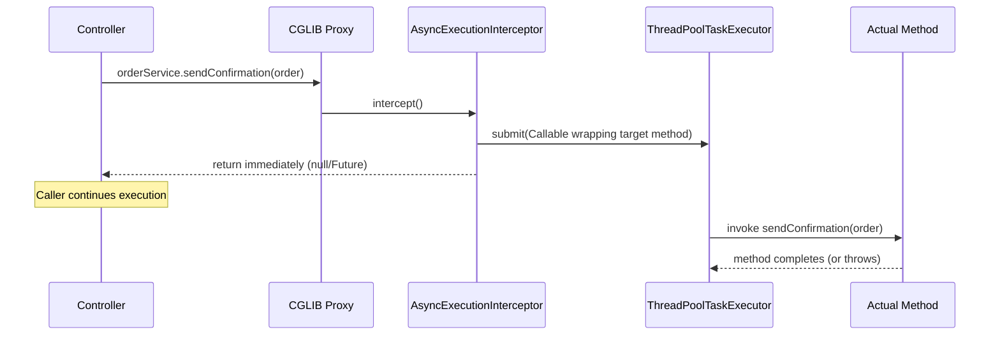
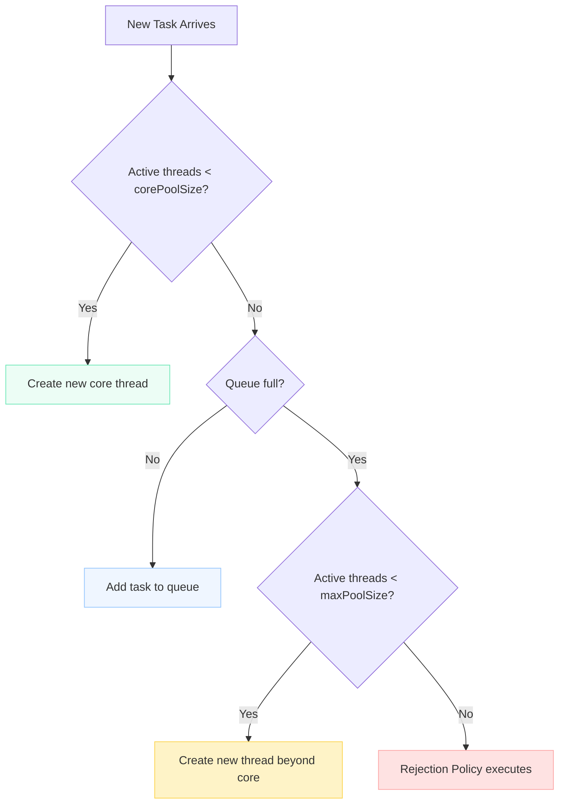
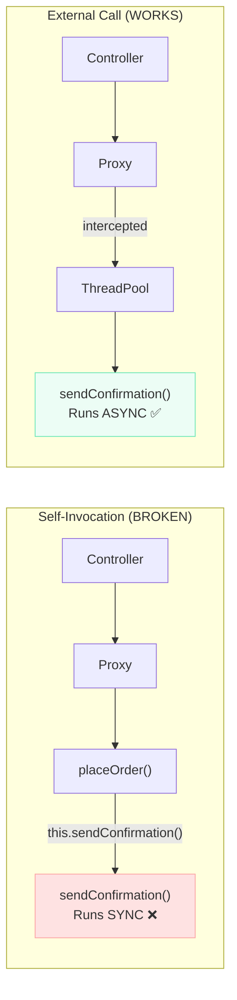
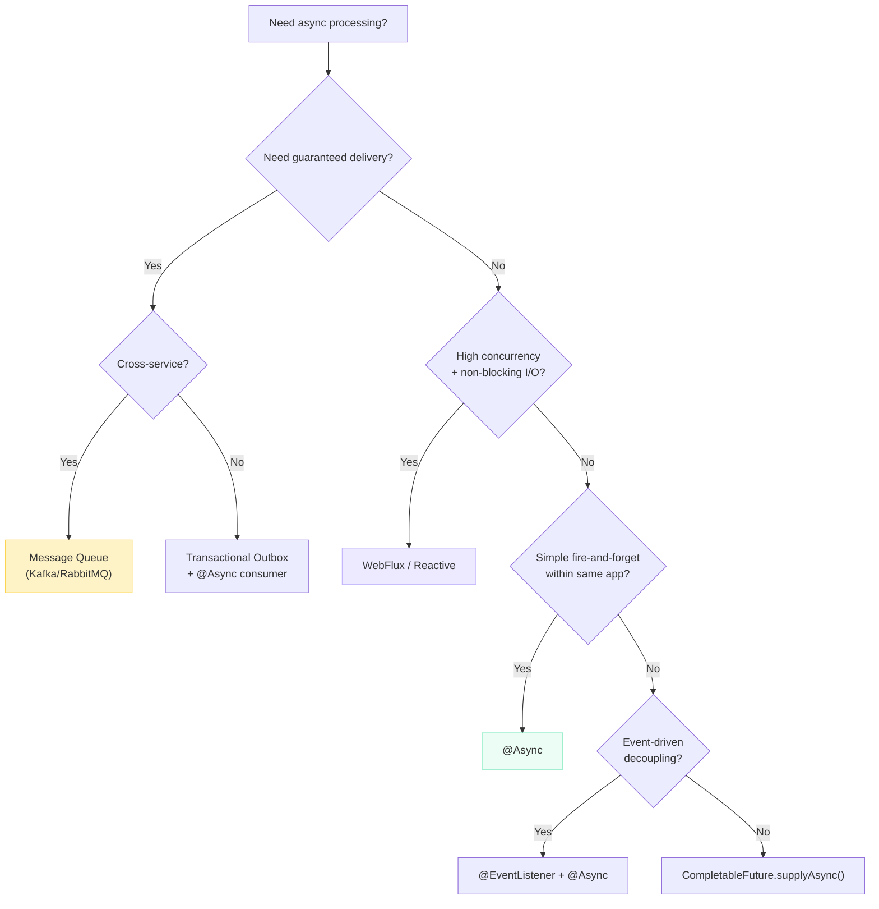
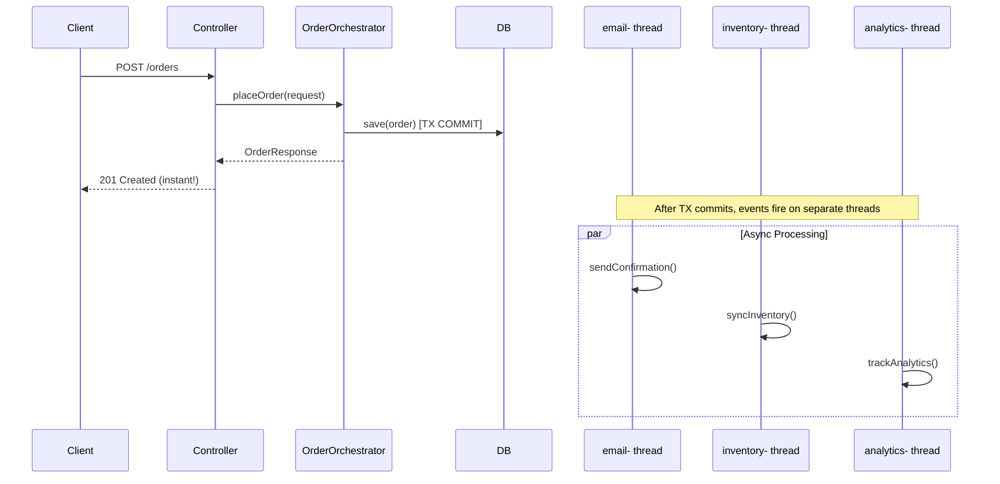

# Spring Boot @Async — The Complete Guide

> **You add `@Async` to a method and expect magic. But then: "Why is my @Async method running on the main thread?" or "Why did my exception disappear into a void?" or "My app crashed with OutOfMemoryError after adding @Async." These are the questions that separate engineers who understand async from those who copy annotations.**

---

## What is @Async?

!!! tip "💡 One-liner for interviews"
    `@Async` offloads method execution to a thread pool, returning immediately to the caller — it's Spring's simplest way to do fire-and-forget or parallel processing.

### What It Does

- Executes the annotated method on a **separate thread** from a configured thread pool
- Returns **immediately** to the caller (with `null`, `Future`, or `CompletableFuture`)
- Decouples expensive operations from the request thread

### Why It Exists

Without `@Async`, every operation in a request runs sequentially on the same thread. Sending a confirmation email takes 3 seconds? Your API response waits 3 seconds. Generating a PDF report? The user stares at a spinner. `@Async` lets you say: "This work is important but the caller doesn't need to wait for it."

### When to Use

- Sending emails, SMS, push notifications after an action
- Syncing data to external systems (inventory, CRM, analytics)
- Generating reports or PDFs in the background
- Publishing events to audit logs
- Processing webhook callbacks
- Any I/O-bound operation that the caller doesn't need the result of immediately

### How It Works Internally



Spring creates a **CGLIB proxy** around your bean. When an `@Async` method is called **through the proxy**, `AsyncExecutionInterceptor` wraps the method invocation in a `Callable` and submits it to a `TaskExecutor`. The caller gets back immediately — either `null` (for void), or an incomplete `Future`/`CompletableFuture`.

!!! danger "⚠️ What breaks"
    - Without `@EnableAsync` → annotation is **silently ignored**. No error. No warning. Method runs synchronously.
    - Without a custom executor → Spring uses `SimpleAsyncTaskExecutor` which creates a **new thread per task** with no pooling. Under load = OOM.
    - Self-invocation (`this.asyncMethod()`) → bypasses the proxy. Runs synchronously.

---

## Enabling Async

### Basic Setup

```java
@SpringBootApplication
@EnableAsync
public class ECommerceApplication {
    public static void main(String[] args) {
        SpringApplication.run(ECommerceApplication.class, args);
    }
}
```

### What @EnableAsync Does Internally

1. Registers an `AsyncAnnotationBeanPostProcessor`
2. The post-processor scans all beans for `@Async` annotations
3. Creates AOP proxies (CGLIB by default) for those beans
4. The proxy intercepts calls to `@Async` methods and delegates to `AsyncExecutionInterceptor`
5. The interceptor resolves which `TaskExecutor` to use and submits the work

```java
// Force CGLIB proxies (class-based, works even without interfaces)
@EnableAsync(proxyTargetClass = true)

// Use AspectJ weaving instead of proxies (compile-time, no self-invocation problem)
@EnableAsync(mode = AdviceMode.ASPECTJ)
```

!!! example "🎯 Interview Tip"
    If asked "What does @EnableAsync do?", don't just say "enables async." Say: "It registers an `AsyncAnnotationBeanPostProcessor` that creates AOP proxies around beans with `@Async` methods, and those proxies submit method calls to a `TaskExecutor` instead of executing them directly."

---

## TaskExecutor Configuration (Production)

### Why Defaults Are Dangerous

!!! danger "⚠️ What breaks"
    Spring Boot's fallback is `SimpleAsyncTaskExecutor`. It creates a **new thread for every single task** with no pooling, no queue, no upper bound. 10,000 concurrent requests = 10,000 new threads = `OutOfMemoryError`. Always define a `ThreadPoolTaskExecutor`.

### Production Configuration

```java
@Configuration
@EnableAsync
public class AsyncConfig implements AsyncConfigurer {

    @Override
    public Executor getAsyncExecutor() {
        ThreadPoolTaskExecutor executor = new ThreadPoolTaskExecutor();
        executor.setCorePoolSize(8);          // Always-alive threads
        executor.setMaxPoolSize(20);          // Burst capacity
        executor.setQueueCapacity(200);       // Bounded! OOM protection
        executor.setThreadNamePrefix("async-");
        executor.setRejectedExecutionHandler(new ThreadPoolExecutor.CallerRunsPolicy());
        executor.setWaitForTasksToCompleteOnShutdown(true);
        executor.setAwaitTerminationSeconds(60);
        executor.initialize();
        return executor;
    }

    @Override
    public AsyncUncaughtExceptionHandler getAsyncUncaughtExceptionHandler() {
        return new CustomAsyncExceptionHandler();
    }
}
```

### Multiple Executors for Different Workloads

```java
@Configuration
@EnableAsync
public class MultiExecutorConfig {

    @Bean("emailExecutor")
    public Executor emailExecutor() {
        ThreadPoolTaskExecutor executor = new ThreadPoolTaskExecutor();
        executor.setCorePoolSize(2);
        executor.setMaxPoolSize(5);
        executor.setQueueCapacity(100);
        executor.setThreadNamePrefix("email-");
        executor.setRejectedExecutionHandler(new ThreadPoolExecutor.CallerRunsPolicy());
        executor.setWaitForTasksToCompleteOnShutdown(true);
        executor.setAwaitTerminationSeconds(30);
        executor.initialize();
        return executor;
    }

    @Bean("reportExecutor")
    public Executor reportExecutor() {
        ThreadPoolTaskExecutor executor = new ThreadPoolTaskExecutor();
        executor.setCorePoolSize(4);
        executor.setMaxPoolSize(8);
        executor.setQueueCapacity(50);
        executor.setThreadNamePrefix("report-");
        executor.setRejectedExecutionHandler(new ThreadPoolExecutor.AbortPolicy());
        executor.setWaitForTasksToCompleteOnShutdown(true);
        executor.setAwaitTerminationSeconds(120);  // Reports take time
        executor.initialize();
        return executor;
    }

    @Bean("webhookExecutor")
    public Executor webhookExecutor() {
        ThreadPoolTaskExecutor executor = new ThreadPoolTaskExecutor();
        executor.setCorePoolSize(10);
        executor.setMaxPoolSize(30);
        executor.setQueueCapacity(500);
        executor.setThreadNamePrefix("webhook-");
        executor.setRejectedExecutionHandler(new ThreadPoolExecutor.CallerRunsPolicy());
        executor.initialize();
        return executor;
    }
}

// Usage — specify which executor
@Async("emailExecutor")
public void sendOrderConfirmation(Order order) { ... }

@Async("reportExecutor")
public CompletableFuture<byte[]> generateMonthlyReport(Long accountId) { ... }

@Async("webhookExecutor")
public void processPaymentWebhook(WebhookEvent event) { ... }
```

!!! question "❓ Counter-question: Why would you use multiple executors instead of one large pool?"
    **Answer:** Isolation. If your report generation saturates a shared pool (all 20 threads busy generating PDFs), email sending gets queued behind them. With separate pools, email always has dedicated threads available. It's the same principle as bulkheads in ship design — a leak in one compartment doesn't sink the whole ship.

---

## Thread Pool Sizing Rules

### How ThreadPoolTaskExecutor Processes Tasks



!!! warning "🔥 Production War Story"
    A team set `corePoolSize=5`, `maxPoolSize=100`, `queueCapacity=Integer.MAX_VALUE`. They expected burst scaling to 100 threads. What happened? The queue **never** filled up (it's unbounded), so `maxPoolSize` was **never** reached. All tasks queued behind 5 threads. Latency went to minutes. The fix: set `queueCapacity` to a reasonable bounded value (e.g., 50-500) so the pool actually scales up under load.

### Sizing Formulas

=== "CPU-bound tasks"

    ```
    corePoolSize = Runtime.getRuntime().availableProcessors()
    maxPoolSize  = corePoolSize + 1  (no benefit exceeding cores)
    queueCapacity = short (10-50) to avoid latency buildup
    ```

    Examples: JSON serialization, hashing, cryptographic operations, image processing.

=== "I/O-bound tasks"

    ```
    corePoolSize = cores × 2 × (1 + wait_time / compute_time)
    maxPoolSize  = corePoolSize × 2  (burst capacity)
    queueCapacity = 100-500 depending on acceptable latency
    ```

    Examples: HTTP calls, database queries, file I/O, email sending.

    **Concrete example:** 8-core machine, tasks spend 80% waiting on I/O (4ms wait, 1ms compute):
    ```
    corePoolSize = 8 × 2 × (1 + 4/1) = 80
    maxPoolSize  = 160
    queueCapacity = 200
    ```

### Rejection Policies

| Policy | Behavior | When to Use |
|--------|----------|-------------|
| `AbortPolicy` | Throws `RejectedExecutionException` | When you want to fail fast and handle rejection explicitly |
| `CallerRunsPolicy` | Executes on the **calling thread** | **Most production apps** — natural backpressure, no task loss |
| `DiscardPolicy` | Silently drops the task | Metrics/telemetry where loss is acceptable |
| `DiscardOldestPolicy` | Drops the oldest queued task, retries | Real-time feeds where only latest matters |

!!! tip "💡 One-liner for interviews"
    "Use `CallerRunsPolicy` — it creates natural backpressure by slowing the caller down when the system is overloaded, instead of losing work or crashing."

---

## Return Types

### Comparison Table

| Return Type | Use Case | Error Handling | Composition | Status |
|-------------|----------|----------------|-------------|--------|
| `void` | Fire and forget | Exceptions vanish silently | None | Active |
| `Future<T>` | Need result, blocking `.get()` | Exception on `.get()` | None | Legacy |
| `CompletableFuture<T>` | Chaining, combining, error recovery | `.exceptionally()`, `.handle()` | Full | **Preferred** |
| `ListenableFuture<T>` | Callback-based | Callbacks | Limited | **Deprecated (Spring 6)** |

### void — Fire and Forget

```java
@Async("emailExecutor")
public void sendOrderConfirmationEmail(Order order) {
    log.info("[{}] Sending confirmation for order {}",
        Thread.currentThread().getName(), order.getId());

    emailClient.send(
        order.getCustomerEmail(),
        "Order #" + order.getId() + " Confirmed",
        templateEngine.render("order-confirmation", Map.of("order", order))
    );
}
```

!!! danger "⚠️ What breaks"
    If `emailClient.send()` throws an exception, it **disappears**. No log. No alert. No stack trace in your console. The exception goes to `AsyncUncaughtExceptionHandler` which, by default, does nothing useful. You will never know the email failed unless you configure a handler.

### Future&lt;T&gt; — Legacy (Avoid in New Code)

```java
@Async
public Future<InventoryReport> generateInventoryReport(Long warehouseId) {
    InventoryReport report = inventoryService.calculateStock(warehouseId);
    return new AsyncResult<>(report);  // Spring's Future wrapper
}

// Caller — blocks on get()
Future<InventoryReport> future = reportService.generateInventoryReport(42L);
InventoryReport report = future.get(30, TimeUnit.SECONDS);  // Blocks up to 30s
```

### CompletableFuture&lt;T&gt; — The Right Choice

```java
@Async("reportExecutor")
public CompletableFuture<SalesReport> generateSalesReport(Long storeId, DateRange range) {
    log.info("Generating sales report for store {} on thread {}",
        storeId, Thread.currentThread().getName());

    SalesReport report = analyticsEngine.computeSales(storeId, range);
    return CompletableFuture.completedFuture(report);
}
```

### Combining Multiple Async Results (Parallel Execution)

```java
@Service
@RequiredArgsConstructor
public class DashboardService {

    private final UserService userService;
    private final OrderService orderService;
    private final RecommendationService recommendationService;

    public DashboardResponse buildDashboard(Long userId) {
        // All three run in parallel on separate threads
        CompletableFuture<UserProfile> profileFuture =
            userService.fetchProfile(userId);
        CompletableFuture<List<Order>> ordersFuture =
            orderService.fetchRecentOrders(userId);
        CompletableFuture<List<Product>> recommendationsFuture =
            recommendationService.getRecommendations(userId);

        // Wait for all to complete (with timeout)
        CompletableFuture.allOf(profileFuture, ordersFuture, recommendationsFuture)
            .orTimeout(5, TimeUnit.SECONDS)
            .join();

        return DashboardResponse.builder()
            .profile(profileFuture.join())
            .recentOrders(ordersFuture.join())
            .recommendations(recommendationsFuture.join())
            .build();
    }
}
```

!!! example "🎯 Interview Tip"
    This pattern is the #1 use case for `@Async` with `CompletableFuture` in interviews: "How do you speed up a page that calls 3 independent services each taking 2 seconds?" Answer: "Call all three with `@Async`, combine with `CompletableFuture.allOf()`. Total time = max(2s, 2s, 2s) = 2s instead of 6s sequential."

---

## The Self-Invocation Problem

This is the **same proxy issue** that affects `@Transactional` and `@Cacheable`. If you understand it once, you understand it everywhere.

### The Problem

```java
@Service
public class OrderService {

    public void placeOrder(Order order) {
        orderRepository.save(order);
        sendConfirmation(order);  // ❌ NOT async! Calls this.sendConfirmation()
    }

    @Async
    public void sendConfirmation(Order order) {
        // This runs on the SAME thread as placeOrder()
        emailClient.send(order.getEmail(), "Your order is confirmed");
    }
}
```

**Why?** When `placeOrder()` calls `sendConfirmation()`, it's calling `this.sendConfirmation()` — a direct method call on the target object. The proxy is never involved. The AOP interceptor never fires. The method runs synchronously.



### Solutions

=== "Solution 1: Separate Service (Cleanest)"

    ```java
    @Service
    @RequiredArgsConstructor
    public class OrderService {
        private final OrderNotificationService notificationService;

        public void placeOrder(Order order) {
            orderRepository.save(order);
            notificationService.sendConfirmation(order);  // ✅ Goes through proxy
        }
    }

    @Service
    public class OrderNotificationService {

        @Async("emailExecutor")
        public void sendConfirmation(Order order) {
            emailClient.send(order.getEmail(), "Your order is confirmed");
        }
    }
    ```

=== "Solution 2: Inject Self"

    ```java
    @Service
    public class OrderService {

        @Lazy
        @Autowired
        private OrderService self;  // Injects the PROXY, not the target

        public void placeOrder(Order order) {
            orderRepository.save(order);
            self.sendConfirmation(order);  // ✅ Goes through proxy
        }

        @Async
        public void sendConfirmation(Order order) {
            emailClient.send(order.getEmail(), "Your order is confirmed");
        }
    }
    ```

=== "Solution 3: ApplicationEventPublisher"

    ```java
    @Service
    @RequiredArgsConstructor
    public class OrderService {
        private final ApplicationEventPublisher eventPublisher;

        @Transactional
        public void placeOrder(Order order) {
            orderRepository.save(order);
            eventPublisher.publishEvent(new OrderPlacedEvent(order));
        }
    }

    @Component
    public class OrderEventListener {

        @Async("emailExecutor")
        @EventListener
        public void handleOrderPlaced(OrderPlacedEvent event) {
            emailClient.send(event.getOrder().getEmail(), "Confirmed!");
        }
    }
    ```

---

## Exception Handling

### void Return — The Silent Killer

```java
@Async
public void processPaymentWebhook(WebhookEvent event) {
    // If this throws, the exception goes to... nowhere useful
    paymentService.reconcile(event.getPaymentId());
}
```

By default, the exception is caught by the thread pool's `UncaughtExceptionHandler`, which logs to stderr (often lost in production log noise). You **must** configure a proper handler.

### Custom AsyncUncaughtExceptionHandler

```java
@Slf4j
public class CustomAsyncExceptionHandler implements AsyncUncaughtExceptionHandler {

    private final MeterRegistry meterRegistry;
    private final AlertService alertService;

    public CustomAsyncExceptionHandler(MeterRegistry meterRegistry, AlertService alertService) {
        this.meterRegistry = meterRegistry;
        this.alertService = alertService;
    }

    @Override
    public void handleUncaughtException(Throwable ex, Method method, Object... params) {
        String className = method.getDeclaringClass().getSimpleName();
        String methodName = method.getName();

        // 1. Log with full context
        log.error("Async exception in {}.{}() with params {}: {}",
            className, methodName, Arrays.toString(params), ex.getMessage(), ex);

        // 2. Increment failure metric
        meterRegistry.counter("async.exceptions",
            "class", className,
            "method", methodName,
            "exception", ex.getClass().getSimpleName()
        ).increment();

        // 3. Alert if critical
        if (ex instanceof PaymentException || ex instanceof DataIntegrityException) {
            alertService.sendPagerDuty(
                "Critical async failure in " + className + "." + methodName, ex);
        }
    }
}
```

### CompletableFuture — Proper Error Handling

```java
@Async("webhookExecutor")
public CompletableFuture<PaymentResult> processPayment(PaymentRequest request) {
    try {
        PaymentResult result = paymentGateway.charge(request);
        return CompletableFuture.completedFuture(result);
    } catch (PaymentDeclinedException ex) {
        return CompletableFuture.failedFuture(ex);  // Java 9+
    }
}

// Caller-side error handling with recovery
paymentService.processPayment(request)
    .thenApply(result -> {
        orderService.markPaid(orderId, result.getTransactionId());
        return result;
    })
    .exceptionally(ex -> {
        log.error("Payment failed for order {}: {}", orderId, ex.getMessage());
        orderService.markPaymentFailed(orderId);
        notificationService.alertCustomer(customerId, "Payment failed");
        return PaymentResult.failed(ex.getMessage());
    });
```

!!! warning "🔥 Production War Story"
    A fintech company had `@Async void` methods processing payment reconciliation. When the downstream bank API started returning 500 errors, thousands of reconciliation tasks failed silently. No alerts. No metrics. The team only discovered the problem 3 days later when merchants reported missing settlements. The fix: replace `void` with `CompletableFuture<Void>`, add `.exceptionally()` with alerting, and implement `AsyncUncaughtExceptionHandler` as a safety net.

---

## @Async + @Transactional — Transaction Propagation

### The Core Rule

**Transactions do NOT propagate across threads.** Period. Each thread has its own `TransactionSynchronizationManager` backed by `ThreadLocal`. A new thread starts with no transaction context.

```java
@Service
@RequiredArgsConstructor
public class OrderService {

    private final OrderRepository orderRepository;
    private final InventoryService inventoryService;

    @Transactional
    public void placeOrder(Order order) {
        orderRepository.save(order);          // Inside transaction
        inventoryService.syncAsync(order);    // New thread = NO transaction from parent
        // If syncAsync fails, this transaction is NOT rolled back
    }
}

@Service
public class InventoryService {

    @Async
    @Transactional  // Starts its OWN independent transaction
    public void syncAsync(Order order) {
        // This runs in a completely separate transaction
        // If it fails, the order is already committed
        inventoryRepository.decrementStock(order.getProductId(), order.getQuantity());
    }
}
```

!!! danger "⚠️ What breaks"
    Putting `@Transactional` and `@Async` on the **same method** where the caller expects transactional behavior is a trap. The async method gets its own transaction that is completely independent of the caller's transaction. If you need atomicity, do NOT use `@Async`.

### The Right Pattern: Event After Commit

```java
@Service
@RequiredArgsConstructor
public class OrderService {

    private final ApplicationEventPublisher eventPublisher;

    @Transactional
    public Order placeOrder(OrderRequest request) {
        Order order = orderRepository.save(new Order(request));
        // Event published AFTER transaction commits
        eventPublisher.publishEvent(new OrderPlacedEvent(order.getId()));
        return order;
    }
}

@Component
@RequiredArgsConstructor
public class OrderEventHandler {

    @Async("emailExecutor")
    @TransactionalEventListener(phase = TransactionPhase.AFTER_COMMIT)
    public void onOrderPlaced(OrderPlacedEvent event) {
        // Guaranteed: order is committed before this runs
        // Runs on async thread, won't block the response
        Order order = orderRepository.findById(event.getOrderId()).orElseThrow();
        emailService.sendConfirmation(order);
        inventoryService.syncWithWarehouse(order);
    }
}
```

!!! tip "💡 One-liner for interviews"
    "Use `@TransactionalEventListener(phase = AFTER_COMMIT)` + `@Async` to guarantee the parent transaction is committed before async processing begins. This prevents the async thread from reading uncommitted data."

---

## ThreadLocal Propagation — MDC, SecurityContext, RequestAttributes

### The Problem

`@Async` runs on a different thread. `ThreadLocal` data does not follow:

- **MDC (Mapped Diagnostic Context)** — correlation IDs disappear from async thread logs
- **SecurityContext** — authenticated user is null in async thread
- **RequestAttributes** — HTTP request context unavailable

### Solution: TaskDecorator

```java
@Slf4j
public class MdcTaskDecorator implements TaskDecorator {

    @Override
    public Runnable decorate(Runnable runnable) {
        // Capture context on the submitting thread
        Map<String, String> mdcContext = MDC.getCopyOfContextMap();
        RequestAttributes requestAttributes =
            RequestContextHolder.getRequestAttributes();

        return () -> {
            try {
                // Set context on the executing thread
                if (mdcContext != null) {
                    MDC.setContextMap(mdcContext);
                }
                if (requestAttributes != null) {
                    RequestContextHolder.setRequestAttributes(requestAttributes);
                }
                runnable.run();
            } finally {
                // Clean up to prevent thread pool pollution
                MDC.clear();
                RequestContextHolder.resetRequestAttributes();
            }
        };
    }
}
```

### Apply the Decorator

```java
@Bean("taskExecutor")
public Executor taskExecutor() {
    ThreadPoolTaskExecutor executor = new ThreadPoolTaskExecutor();
    executor.setCorePoolSize(8);
    executor.setMaxPoolSize(20);
    executor.setQueueCapacity(200);
    executor.setThreadNamePrefix("async-");
    executor.setTaskDecorator(new MdcTaskDecorator());  // Propagate MDC
    executor.initialize();
    return executor;
}
```

### SecurityContext Propagation

```java
@Bean("secureExecutor")
public Executor secureExecutor() {
    ThreadPoolTaskExecutor delegate = new ThreadPoolTaskExecutor();
    delegate.setCorePoolSize(5);
    delegate.setMaxPoolSize(10);
    delegate.setQueueCapacity(100);
    delegate.setThreadNamePrefix("secure-async-");
    delegate.initialize();

    // Wraps every task to copy SecurityContext from submitter → executor
    return new DelegatingSecurityContextAsyncTaskExecutor(delegate);
}

@Async("secureExecutor")
public void auditUserAction(String action) {
    // SecurityContextHolder.getContext().getAuthentication() works here
    String username = SecurityContextHolder.getContext()
        .getAuthentication().getName();
    auditRepository.save(new AuditEntry(username, action, Instant.now()));
}
```

!!! question "❓ Counter-question: Why not use `MODE_INHERITABLETHREADLOCAL` for SecurityContext?"
    **Answer:** It only works when the parent thread **creates** the child thread. With thread pools, threads are **reused** — they inherit the context of whoever originally created the thread, not the current submitter. Thread A submits a task, the pool thread runs it with Thread A's context. Later Thread B submits a task, the same pool thread runs it with... Thread A's context (stale!). Use `DelegatingSecurityContextAsyncTaskExecutor` instead.

---

## Production Patterns

### Pattern 1: Async with Retry (@Async + @Retryable)

```java
@Service
@Slf4j
public class PaymentNotificationService {

    @Async("webhookExecutor")
    @Retryable(
        retryFor = {RestClientException.class, TimeoutException.class},
        maxAttempts = 3,
        backoff = @Backoff(delay = 2000, multiplier = 2)  // 2s, 4s, 8s
    )
    public CompletableFuture<Void> notifyMerchant(PaymentEvent event) {
        log.info("Notifying merchant {} for payment {} (thread: {})",
            event.getMerchantId(), event.getPaymentId(),
            Thread.currentThread().getName());

        restClient.post()
            .uri(event.getWebhookUrl())
            .body(event)
            .retrieve()
            .toBodilessEntity();

        return CompletableFuture.completedFuture(null);
    }

    @Recover
    public CompletableFuture<Void> notifyMerchantFallback(
            RestClientException ex, PaymentEvent event) {
        log.error("All retries exhausted for merchant {}, payment {}",
            event.getMerchantId(), event.getPaymentId(), ex);
        deadLetterQueue.push(event);  // Save for manual retry
        alertService.notify("Merchant webhook failed: " + event.getMerchantId());
        return CompletableFuture.completedFuture(null);
    }
}
```

!!! tip "💡 One-liner for interviews"
    "`@Async` + `@Retryable` gives you non-blocking retries with exponential backoff. The calling thread returns immediately, while the async thread retries on its own schedule."

### Pattern 2: Async Batch Processing

```java
@Service
@RequiredArgsConstructor
@Slf4j
public class BulkEmailService {

    private final EmailSender emailSender;

    @Async("emailExecutor")
    public CompletableFuture<BatchResult> sendBatch(List<EmailRequest> batch, int batchNumber) {
        log.info("Processing batch {} ({} emails) on thread {}",
            batchNumber, batch.size(), Thread.currentThread().getName());

        int success = 0, failed = 0;
        for (EmailRequest email : batch) {
            try {
                emailSender.send(email);
                success++;
            } catch (Exception ex) {
                failed++;
                log.warn("Failed to send email to {}: {}", email.getTo(), ex.getMessage());
            }
        }

        return CompletableFuture.completedFuture(new BatchResult(batchNumber, success, failed));
    }

    public CompletableFuture<List<BatchResult>> sendBulk(List<EmailRequest> allEmails) {
        // Partition into batches of 100
        List<List<EmailRequest>> batches = Lists.partition(allEmails, 100);

        List<CompletableFuture<BatchResult>> futures = IntStream.range(0, batches.size())
            .mapToObj(i -> sendBatch(batches.get(i), i))
            .toList();

        return CompletableFuture.allOf(futures.toArray(new CompletableFuture[0]))
            .thenApply(v -> futures.stream()
                .map(CompletableFuture::join)
                .toList());
    }
}
```

### Pattern 3: Async with Timeout

```java
@Async("reportExecutor")
public CompletableFuture<Report> generateReport(ReportRequest request) {
    return CompletableFuture.supplyAsync(() -> {
        return heavyReportGeneration(request);
    }).orTimeout(30, TimeUnit.SECONDS);  // Java 9+
}

// Caller handles timeout gracefully
reportService.generateReport(request)
    .thenAccept(report -> cache.put(request.getId(), report))
    .exceptionally(ex -> {
        if (ex.getCause() instanceof TimeoutException) {
            log.warn("Report generation timed out for request {}", request.getId());
            notifyUser(request.getUserId(), "Report is taking longer than expected");
        }
        return null;
    });
```

### Pattern 4: Graceful Shutdown

```java
@Bean("taskExecutor")
public Executor taskExecutor() {
    ThreadPoolTaskExecutor executor = new ThreadPoolTaskExecutor();
    executor.setCorePoolSize(8);
    executor.setMaxPoolSize(20);
    executor.setQueueCapacity(200);
    executor.setThreadNamePrefix("async-");

    // Graceful shutdown: finish in-progress tasks before app dies
    executor.setWaitForTasksToCompleteOnShutdown(true);
    executor.setAwaitTerminationSeconds(60);  // Wait up to 60s

    executor.initialize();
    return executor;
}
```

!!! warning "🔥 Production War Story"
    A team deployed during peak hours. Kubernetes sent SIGTERM, the app shut down immediately, killing 200+ in-flight async tasks (payment confirmations, inventory updates). Result: data inconsistency, angry merchants, 4-hour incident. The fix: `setWaitForTasksToCompleteOnShutdown(true)` + adequate `awaitTerminationSeconds` + Kubernetes `terminationGracePeriodSeconds` matching the executor timeout.

---

## @Async vs Other Approaches

### Decision Tree



### Comparison Table

| Approach | Thread Model | Guaranteed Delivery | Complexity | Use Case |
|----------|-------------|-------------------|------------|----------|
| `@Async` | Thread-per-task from pool | No (task lost if app crashes) | Low | In-process fire-and-forget |
| `CompletableFuture.supplyAsync()` | Direct pool submission | No | Low | When you don't need Spring proxy |
| `@EventListener` + `@Async` | Thread pool via event bus | No (in-memory) | Medium | Decoupled in-process events |
| Message Queue (Kafka/RabbitMQ) | Consumer threads | Yes (persistent) | High | Cross-service, at-least-once |
| WebFlux/Reactive | Event loop (few threads) | No | High | High-concurrency non-blocking I/O |
| Virtual Threads (Java 21) | Virtual thread per task | No | Low | I/O-bound, no pool tuning needed |

!!! question "❓ Counter-question: When should I use a message queue instead of @Async?"
    **Answer:** Use a message queue when: (1) the task MUST NOT be lost even if the app crashes, (2) you need at-least-once or exactly-once delivery, (3) the work crosses service boundaries, (4) you need rate limiting/backpressure across distributed consumers, (5) you need dead-letter queues and retry policies managed externally. Use `@Async` when: it's in-process, best-effort, and you can tolerate loss on app restart.

---

## Monitoring Thread Pools

### Micrometer Integration

```java
@Bean("taskExecutor")
public Executor taskExecutor(MeterRegistry meterRegistry) {
    ThreadPoolTaskExecutor executor = new ThreadPoolTaskExecutor();
    executor.setCorePoolSize(8);
    executor.setMaxPoolSize(20);
    executor.setQueueCapacity(200);
    executor.setThreadNamePrefix("async-");
    executor.initialize();

    // Expose metrics
    ExecutorServiceMetrics.monitor(
        meterRegistry,
        executor.getThreadPoolExecutor(),
        "async.task.executor"
    );

    return executor;
}
```

### Key Metrics to Alert On

| Metric | Alert Condition | Meaning |
|--------|----------------|---------|
| `executor.pool.size` | Consistently at `maxPoolSize` | Pool is saturated |
| `executor.queue.remaining` | < 10% of capacity | Queue almost full, rejections imminent |
| `executor.completed` vs `executor.submitted` | Growing gap | Tasks queueing faster than completing |
| `async.exceptions` (custom) | Spike | Downstream failures |

```yaml
# Prometheus alert rules
- alert: AsyncPoolSaturated
  expr: executor_pool_size{name="async.task.executor"} >= 18  # 90% of max 20
  for: 5m
  annotations:
    summary: "Async thread pool near capacity"

- alert: AsyncQueueBacklog
  expr: executor_queued_task_count{name="async.task.executor"} > 150  # 75% of 200
  for: 2m
  annotations:
    summary: "Async queue building up — check downstream latency"
```

---

## Virtual Threads (Java 21+) with Spring Boot 3.2+

### The Game Changer

Virtual threads eliminate thread pool sizing for I/O-bound work. Instead of tuning `corePoolSize` and `queueCapacity`, you get a thread per task — but the JVM multiplexes millions of virtual threads onto a few OS (carrier) threads.

### Enable Globally

```yaml
spring:
  threads:
    virtual:
      enabled: true  # Switches all async executors + server threads to virtual threads
```

### Custom Virtual Thread Executor

```java
@Bean("virtualExecutor")
public Executor virtualExecutor() {
    return Executors.newVirtualThreadPerTaskExecutor();
}

@Async("virtualExecutor")
public CompletableFuture<OrderStatus> checkOrderStatus(Long orderId) {
    // Each call gets its own virtual thread — no pool exhaustion
    OrderStatus status = externalOrderApi.getStatus(orderId);
    return CompletableFuture.completedFuture(status);
}
```

### When to Use Virtual Threads vs Platform Thread Pools

| Scenario | Recommendation | Why |
|----------|---------------|-----|
| I/O-bound (HTTP, DB, file) | Virtual threads | No tuning, scales to millions |
| CPU-bound (compute, crypto) | Platform thread pool | Virtual threads offer no benefit for CPU work |
| Need backpressure/queue limits | Platform thread pool | Virtual threads have no built-in rejection |
| Need task prioritization | Platform thread pool | Virtual threads have no queue ordering |
| Legacy Java (< 21) | Platform thread pool | No choice |

!!! danger "⚠️ What breaks"
    Virtual threads + `synchronized` blocks = **pinning**. If a virtual thread enters a `synchronized` block that does I/O, it pins to the carrier thread (defeats the purpose). Use `ReentrantLock` instead of `synchronized` when using virtual threads. Spring's JDBC and JPA have been updated to avoid this, but third-party libraries may not be.

---

## Common Pitfalls — Complete List

| # | Pitfall | Symptom | Fix |
|---|---------|---------|-----|
| 1 | `@Async` on **private** method | Runs synchronously | Make it `public` (proxy can't intercept private) |
| 2 | `@Async` on **same-class** method | Runs synchronously | Extract to separate bean or inject self |
| 3 | Missing `@EnableAsync` | Runs synchronously (no error!) | Add `@EnableAsync` to a `@Configuration` class |
| 4 | No custom executor | `SimpleAsyncTaskExecutor` = OOM under load | Define `ThreadPoolTaskExecutor` bean |
| 5 | Missing exception handler | Exceptions in void methods vanish | Implement `AsyncUncaughtExceptionHandler` |
| 6 | `ThreadLocal` data loss | MDC/SecurityContext/RequestScope null | Use `TaskDecorator` or `DelegatingSecurityContext` |
| 7 | Unbounded `queueCapacity` | `maxPoolSize` never reached, latency grows | Set bounded capacity (50-500) |
| 8 | `@Transactional` + `@Async` same method | Transaction doesn't propagate to caller | Separate concerns; use event-based pattern |
| 9 | No graceful shutdown | Tasks killed mid-execution on deploy | `setWaitForTasksToCompleteOnShutdown(true)` |
| 10 | `@Async` on `final` method | CGLIB can't override, runs synchronously | Remove `final` |
| 11 | Testing with `Thread.sleep()` | Flaky tests | Use `Awaitility` or `SyncTaskExecutor` |
| 12 | `@Async` + circular dependency | `BeanCurrentlyInCreationException` | Add `@Lazy` on one injection point |

---

## Testing @Async

### Integration Test with Awaitility

```java
@SpringBootTest
class OrderServiceIntegrationTest {

    @Autowired
    private OrderService orderService;

    @Autowired
    private EmailRepository emailRepository;

    @Test
    void placeOrder_sendsConfirmationEmailAsynchronously() {
        Order order = new Order("user@example.com", "Product-123");

        orderService.placeOrder(order);

        // Don't use Thread.sleep()! Use Awaitility
        await()
            .atMost(Duration.ofSeconds(5))
            .pollInterval(Duration.ofMillis(200))
            .until(() -> emailRepository.findByRecipient("user@example.com").isPresent());

        Email sent = emailRepository.findByRecipient("user@example.com").get();
        assertThat(sent.getSubject()).contains("Order Confirmed");
    }
}
```

### Unit Test with Synchronous Executor

```java
@Configuration
@Profile("test")
public class TestAsyncConfig {

    @Bean("emailExecutor")
    @Primary
    public Executor syncExecutor() {
        // Makes @Async methods run synchronously in tests — deterministic, no timing issues
        return new SyncTaskExecutor();
    }
}
```

### Verifying Thread Name (Async Actually Works)

```java
@Test
void asyncMethod_runsOnDifferentThread() {
    String callerThread = Thread.currentThread().getName();

    CompletableFuture<String> future = asyncService.doWork();
    String asyncThread = future.join();

    assertThat(asyncThread).isNotEqualTo(callerThread);
    assertThat(asyncThread).startsWith("async-");  // Matches threadNamePrefix
}
```

---

## Interview Questions

??? question "How does @Async work internally?"
    Spring creates a CGLIB proxy around the bean. The proxy's `AsyncExecutionInterceptor` intercepts calls to `@Async` methods, wraps the invocation in a `Callable`, and submits it to a `TaskExecutor`. The caller receives `null` (void) or an incomplete `Future`. The actual method executes on a thread pool thread. This proxy-based mechanism is why self-invocation (`this.method()`) bypasses async — it calls the target directly, not through the proxy.

??? question "What happens to exceptions in @Async void methods?"
    They disappear silently. The exception is caught by the thread pool's internal handler. By default, Spring logs it at DEBUG level (which most apps don't enable). You must implement `AsyncConfigurer.getAsyncUncaughtExceptionHandler()` to catch, log, and alert on these exceptions. With `CompletableFuture` return types, exceptions are stored in the future and accessible via `.exceptionally()` or `.get()`.

??? question "How do you configure a production thread pool?"
    1. Choose `corePoolSize` based on workload type: CPU-bound = cores, I/O-bound = cores × 2 × (1 + wait/compute ratio). 2. Set `maxPoolSize` for burst capacity (2-4x core). 3. Set **bounded** `queueCapacity` (never unbounded). 4. Use `CallerRunsPolicy` for natural backpressure. 5. Enable `waitForTasksToCompleteOnShutdown`. 6. Set meaningful `threadNamePrefix` for debugging. 7. Separate executors for different workload types.

??? question "What's the self-invocation problem and how do you solve it?"
    Calling an `@Async` method from within the same class (`this.asyncMethod()`) bypasses the proxy, running synchronously. Solutions: (1) Extract async method to a separate `@Service` (cleanest), (2) inject self with `@Lazy @Autowired private MyService self` and call `self.asyncMethod()`, (3) use `ApplicationEventPublisher` for event-driven decoupling, (4) use AspectJ compile-time weaving (`@EnableAsync(mode = AdviceMode.ASPECTJ)`).

??? question "How do you propagate SecurityContext to async threads?"
    Use `DelegatingSecurityContextAsyncTaskExecutor` to wrap your `ThreadPoolTaskExecutor`. It copies the `SecurityContext` from the submitting thread to the executing thread before each task runs. Do NOT use `MODE_INHERITABLETHREADLOCAL` with thread pools — it inherits context from the thread's creation time (who first created the pool thread), not from the current submitter.

??? question "@Async vs message queues — when to use which?"
    Use `@Async` for: in-process, best-effort, fire-and-forget work where task loss on app crash is acceptable. Use message queues (Kafka/RabbitMQ) when: (1) tasks must survive app restarts, (2) you need at-least-once delivery, (3) work crosses service boundaries, (4) you need distributed rate limiting, (5) you need dead-letter queues. `@Async` is simpler but provides no durability guarantee.

??? question "How do you handle graceful shutdown with pending async tasks?"
    Configure the executor with `setWaitForTasksToCompleteOnShutdown(true)` and `setAwaitTerminationSeconds(N)`. When the app receives SIGTERM, Spring will: (1) stop accepting new tasks, (2) wait up to N seconds for in-flight tasks to complete, (3) then forcefully shut down. Ensure your Kubernetes `terminationGracePeriodSeconds` is >= `awaitTerminationSeconds`.

??? question "How does @Async interact with @Transactional?"
    Transactions do NOT propagate across threads — they're stored in `ThreadLocal`. An `@Async @Transactional` method starts its own independent transaction, completely isolated from the caller's transaction. For the pattern where you need the parent transaction to commit before async processing starts, use `@TransactionalEventListener(phase = AFTER_COMMIT)` + `@Async`.

??? question "How do you prevent OutOfMemoryError with @Async?"
    Three defenses: (1) Use `ThreadPoolTaskExecutor` (never `SimpleAsyncTaskExecutor`), (2) Set bounded `queueCapacity` (prevents unbounded memory growth), (3) Set a rejection policy like `CallerRunsPolicy` (provides backpressure). Monitor queue depth and alert before it fills up. The OOM happens when an unbounded queue accumulates tasks faster than they're processed.

??? question "How do you test @Async methods?"
    Two approaches: (1) Integration test with `Awaitility` — start the full context, invoke the method, use `await().atMost(5s).until(() -> condition)` to verify async side effects without `Thread.sleep()`. (2) Unit test with `SyncTaskExecutor` — replace the async executor with a synchronous one in a test profile, making the method execute immediately for deterministic testing.

??? question "What are virtual threads and how do they change @Async?"
    Java 21 virtual threads are lightweight, JVM-managed threads that eliminate thread pool sizing for I/O-bound work. With Spring Boot 3.2+, set `spring.threads.virtual.enabled=true` to switch all async executors to virtual threads. You get a thread per task (like `SimpleAsyncTaskExecutor`) but without resource exhaustion — the JVM multiplexes millions of virtual threads onto few carrier threads. Caveats: no built-in backpressure, avoid `synchronized` blocks with I/O (causes pinning), still need platform thread pools for CPU-bound and backpressure-required workloads.

---

## E-Commerce Complete Example

Putting it all together — a production-grade async setup for an e-commerce platform:

```java
@Configuration
@EnableAsync
@Slf4j
public class AsyncConfiguration implements AsyncConfigurer {

    @Override
    public Executor getAsyncExecutor() {
        return buildExecutor("default-async-", 8, 20, 200);
    }

    @Bean("emailExecutor")
    public Executor emailExecutor() {
        return buildExecutor("email-", 2, 5, 100);
    }

    @Bean("inventoryExecutor")
    public Executor inventoryExecutor() {
        return buildExecutor("inventory-", 4, 10, 50);
    }

    @Bean("analyticsExecutor")
    public Executor analyticsExecutor() {
        return buildExecutor("analytics-", 2, 4, 500);  // Large queue, best-effort
    }

    private Executor buildExecutor(String prefix, int core, int max, int queue) {
        ThreadPoolTaskExecutor executor = new ThreadPoolTaskExecutor();
        executor.setCorePoolSize(core);
        executor.setMaxPoolSize(max);
        executor.setQueueCapacity(queue);
        executor.setThreadNamePrefix(prefix);
        executor.setTaskDecorator(new MdcTaskDecorator());
        executor.setRejectedExecutionHandler(new ThreadPoolExecutor.CallerRunsPolicy());
        executor.setWaitForTasksToCompleteOnShutdown(true);
        executor.setAwaitTerminationSeconds(60);
        executor.initialize();
        return executor;
    }

    @Override
    public AsyncUncaughtExceptionHandler getAsyncUncaughtExceptionHandler() {
        return (ex, method, params) -> {
            log.error("Uncaught async exception in {}.{}(): {}",
                method.getDeclaringClass().getSimpleName(),
                method.getName(), ex.getMessage(), ex);
        };
    }
}
```

```java
@Service
@RequiredArgsConstructor
@Slf4j
public class OrderOrchestrator {

    private final OrderRepository orderRepository;
    private final ApplicationEventPublisher eventPublisher;

    @Transactional
    public OrderResponse placeOrder(OrderRequest request) {
        // 1. Save order (transactional)
        Order order = orderRepository.save(Order.from(request));

        // 2. Publish event — listeners run AFTER commit, asynchronously
        eventPublisher.publishEvent(new OrderPlacedEvent(order));

        // 3. Return immediately
        return OrderResponse.success(order.getId());
    }
}

@Component
@RequiredArgsConstructor
@Slf4j
public class OrderEventHandlers {

    private final EmailService emailService;
    private final InventoryService inventoryService;
    private final AnalyticsService analyticsService;

    @Async("emailExecutor")
    @TransactionalEventListener(phase = TransactionPhase.AFTER_COMMIT)
    public void sendConfirmation(OrderPlacedEvent event) {
        log.info("Sending order confirmation for {} on thread {}",
            event.getOrderId(), Thread.currentThread().getName());
        emailService.sendOrderConfirmation(event.getOrderId());
    }

    @Async("inventoryExecutor")
    @TransactionalEventListener(phase = TransactionPhase.AFTER_COMMIT)
    public void syncInventory(OrderPlacedEvent event) {
        log.info("Syncing inventory for order {} on thread {}",
            event.getOrderId(), Thread.currentThread().getName());
        inventoryService.decrementAndSync(event.getOrderId());
    }

    @Async("analyticsExecutor")
    @TransactionalEventListener(phase = TransactionPhase.AFTER_COMMIT)
    public void trackAnalytics(OrderPlacedEvent event) {
        analyticsService.trackPurchase(event.getOrderId());
    }
}
```



---

## Quick Reference Card

```java
// 1. Enable
@EnableAsync

// 2. Configure (NEVER skip this)
@Bean public Executor taskExecutor() { /* ThreadPoolTaskExecutor */ }

// 3. Use
@Async                              // Default executor
@Async("emailExecutor")             // Named executor

// 4. Return types
@Async public void fire() {}                           // Fire & forget
@Async public CompletableFuture<T> compute() {}        // Composable result

// 5. Handle errors
implements AsyncConfigurer → getAsyncUncaughtExceptionHandler()
.exceptionally(ex -> fallback)

// 6. Propagate context
executor.setTaskDecorator(new MdcTaskDecorator())
new DelegatingSecurityContextAsyncTaskExecutor(executor)

// 7. Shutdown gracefully
executor.setWaitForTasksToCompleteOnShutdown(true)
executor.setAwaitTerminationSeconds(60)
```
