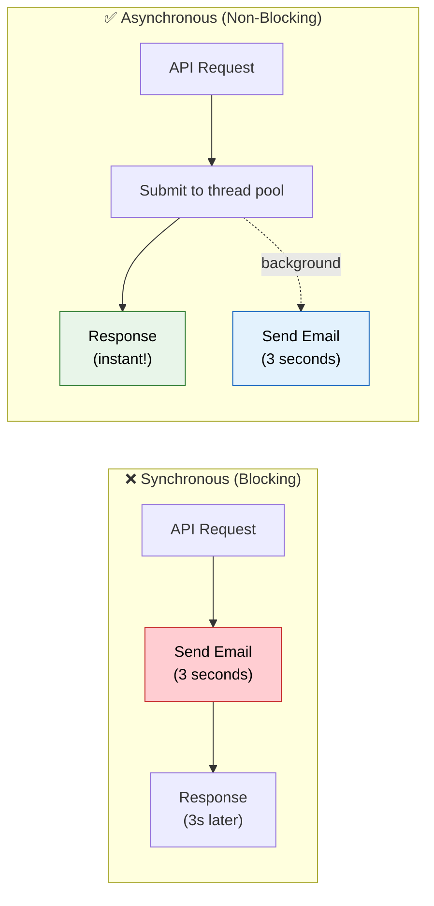

# 🔀 Async & Scheduling

> **Run tasks in background threads and schedule recurring jobs — don't block your API response waiting for slow operations.**

---

!!! abstract "Real-World Analogy"
    Think of a **restaurant**. When you place an order, the waiter doesn't stand in the kitchen waiting for your food (blocking). They take your order, hand it to the kitchen (async), and serve other tables. When the food is ready, they bring it to you. `@Async` works the same way — hand off slow work to a background thread and return immediately.



---

## 🚀 @Async — Run Methods in Background

### Setup

```java
@SpringBootApplication
@EnableAsync
public class Application { }
```

### Basic Usage

```java
@Service
@Slf4j
public class NotificationService {

    @Async
    public void sendWelcomeEmail(String email) {
        // Runs in a separate thread — caller doesn't wait
        log.info("Sending email on thread: {}", Thread.currentThread().getName());
        emailClient.send(email, "Welcome!", "...");
        // Takes 3 seconds — but caller already got their response
    }

    @Async
    public CompletableFuture<UserReport> generateReport(Long userId) {
        // Returns a future — caller can check result later
        UserReport report = heavyComputation(userId);
        return CompletableFuture.completedFuture(report);
    }
}

@RestController
public class UserController {

    @PostMapping("/api/users")
    public ResponseEntity<User> register(@RequestBody UserRequest request) {
        User user = userService.create(request);
        notificationService.sendWelcomeEmail(user.getEmail());  // Fire and forget
        return ResponseEntity.status(201).body(user);           // Returns immediately!
    }
}
```

### Custom Thread Pool

```java
@Configuration
@EnableAsync
public class AsyncConfig {

    @Bean("taskExecutor")
    public Executor taskExecutor() {
        ThreadPoolTaskExecutor executor = new ThreadPoolTaskExecutor();
        executor.setCorePoolSize(5);
        executor.setMaxPoolSize(10);
        executor.setQueueCapacity(100);
        executor.setThreadNamePrefix("async-");
        executor.setRejectedExecutionHandler(new ThreadPoolExecutor.CallerRunsPolicy());
        executor.initialize();
        return executor;
    }

    @Bean("emailExecutor")
    public Executor emailExecutor() {
        ThreadPoolTaskExecutor executor = new ThreadPoolTaskExecutor();
        executor.setCorePoolSize(2);
        executor.setMaxPoolSize(5);
        executor.setQueueCapacity(50);
        executor.setThreadNamePrefix("email-");
        executor.initialize();
        return executor;
    }
}

// Use specific executor
@Async("emailExecutor")
public void sendEmail(String to, String body) { ... }
```

---

## ⏰ @Scheduled — Recurring Tasks

### Setup

```java
@SpringBootApplication
@EnableScheduling
public class Application { }
```

### Usage

```java
@Component
@Slf4j
public class ScheduledTasks {

    // Every 5 minutes
    @Scheduled(fixedRate = 300000)
    public void cleanupExpiredTokens() {
        log.info("Cleaning expired tokens...");
        tokenRepository.deleteExpired();
    }

    // 10 seconds after last execution completed
    @Scheduled(fixedDelay = 10000)
    public void syncInventory() {
        log.info("Syncing inventory...");
        inventoryService.syncWithWarehouse();
    }

    // Cron expression: every day at 2 AM
    @Scheduled(cron = "0 0 2 * * *")
    public void generateDailyReport() {
        log.info("Generating daily report...");
        reportService.generateAndEmail();
    }

    // Every Monday at 9 AM
    @Scheduled(cron = "0 0 9 * * MON")
    public void weeklyDigest() {
        notificationService.sendWeeklyDigest();
    }
}
```

### Cron Expression Cheat Sheet

```
┌───────────── second (0-59)
│ ┌───────────── minute (0-59)
│ │ ┌───────────── hour (0-23)
│ │ │ ┌───────────── day of month (1-31)
│ │ │ │ ┌───────────── month (1-12)
│ │ │ │ │ ┌───────────── day of week (0-7, SUN-SAT)
│ │ │ │ │ │
* * * * * *
```

| Expression | Meaning |
|---|---|
| `0 0 * * * *` | Every hour |
| `0 0/30 * * * *` | Every 30 minutes |
| `0 0 9-17 * * MON-FRI` | Every hour 9AM-5PM weekdays |
| `0 0 2 * * *` | Every day at 2 AM |
| `0 0 0 1 * *` | First day of every month |

---

## ⚠️ @Async Pitfalls

### 1. Self-Invocation (Same as @Transactional!)

```java
@Service
public class OrderService {

    public void placeOrder(Order order) {
        save(order);
        sendNotification(order);  // ❌ NOT async! Self-call bypasses proxy
    }

    @Async
    public void sendNotification(Order order) { ... }
}
```

!!! warning "Fix"
    Call `@Async` methods from a **different bean**, or inject self with `@Lazy`.

### 2. Exception Handling

```java
// Void async methods — exceptions are lost silently by default!
@Async
public void riskyOperation() {
    throw new RuntimeException("oops");  // Silently swallowed!
}

// Fix: configure an exception handler
@Configuration
public class AsyncExceptionConfig implements AsyncConfigurer {
    @Override
    public AsyncUncaughtExceptionHandler getAsyncUncaughtExceptionHandler() {
        return (ex, method, params) -> {
            log.error("Async error in {}: {}", method.getName(), ex.getMessage(), ex);
        };
    }
}
```

### 3. Return CompletableFuture for Results

```java
@Async
public CompletableFuture<Report> generateReport(Long id) {
    Report report = heavyWork(id);
    return CompletableFuture.completedFuture(report);
}

// Caller can compose or wait
CompletableFuture<Report> future = service.generateReport(42L);
future.thenAccept(report -> log.info("Done: {}", report));
```

---

## 🎯 Interview Questions

??? question "1. How does @Async work internally?"
    Spring creates a proxy around the bean. When an `@Async` method is called, the proxy submits the method execution to a `TaskExecutor` (thread pool) and returns immediately. The actual work runs in a background thread. This is why self-invocation doesn't work — it bypasses the proxy.

??? question "2. Difference between fixedRate and fixedDelay?"
    `fixedRate` — runs every N milliseconds regardless of how long the task takes. If task takes longer than the rate, next execution starts immediately after. `fixedDelay` — waits N milliseconds **after the previous execution completes** before starting the next one.

??? question "3. How do you handle exceptions in @Async void methods?"
    By default, exceptions in `void` async methods are silently lost. Implement `AsyncConfigurer.getAsyncUncaughtExceptionHandler()` to log or alert on failures. Alternatively, return `CompletableFuture` so callers can handle exceptions.

??? question "4. Can @Scheduled work in a clustered environment?"
    By default, NO — each instance runs the scheduled task independently (duplicates). Solutions: use distributed scheduling (ShedLock, Quartz with DB), leader election, or ensure the task is idempotent so running it on multiple instances is harmless.

??? question "5. What happens if the thread pool is full?"
    Depends on the `RejectedExecutionHandler`. Default is `AbortPolicy` (throws exception). `CallerRunsPolicy` executes the task on the calling thread (backpressure). Choose based on your requirements: drop, queue, block, or run on caller.

