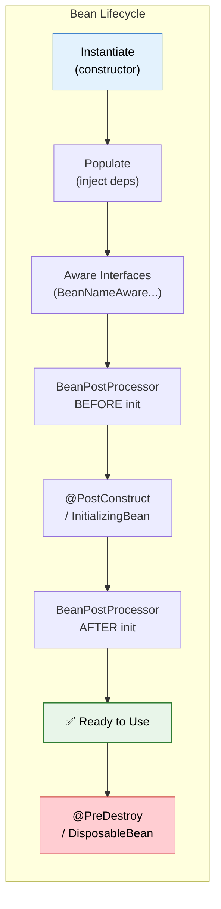
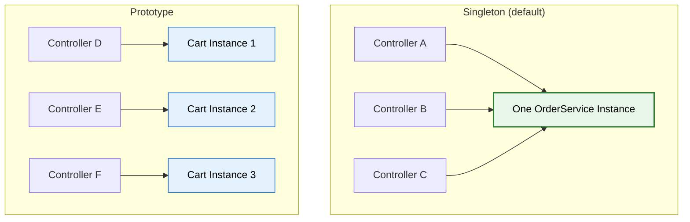

# 🌱 Bean Lifecycle & Scopes

> **Understand how Spring creates, manages, and destroys beans — the foundation of every Spring application.**

---

!!! abstract "Real-World Analogy"
    Think of a **restaurant**. The chef (Spring Container) prepares a dish (bean): selects ingredients (dependencies), follows the recipe (constructor), adds seasoning (post-processing), plates it (ready to serve), and eventually clears the plate (destruction). The chef decides whether to make one dish for everyone (singleton) or a fresh one per order (prototype).



---

## 🔄 Complete Lifecycle Stages

```java
@Component
public class OrderService implements BeanNameAware, InitializingBean, DisposableBean {

    private final OrderRepository repository;

    // 1. INSTANTIATION — constructor called
    public OrderService(OrderRepository repository) {
        System.out.println("1. Constructor called");
        this.repository = repository;
    }

    // 2. POPULATE PROPERTIES — dependencies injected (already done via constructor)

    // 3. AWARE INTERFACES — Spring gives you container info
    @Override
    public void setBeanName(String name) {
        System.out.println("3. BeanNameAware: my name is " + name);
    }

    // 4. BeanPostProcessor.postProcessBeforeInitialization (external)

    // 5. INITIALIZATION — your custom init logic
    @PostConstruct
    public void init() {
        System.out.println("5. @PostConstruct — custom initialization");
    }

    @Override
    public void afterPropertiesSet() {
        System.out.println("5b. InitializingBean.afterPropertiesSet");
    }

    // 6. BeanPostProcessor.postProcessAfterInitialization (external)
    // This is where AOP proxies are created!

    // 7. READY TO USE ✅

    // 8. DESTRUCTION — cleanup when container shuts down
    @PreDestroy
    public void cleanup() {
        System.out.println("8. @PreDestroy — cleanup resources");
    }

    @Override
    public void destroy() {
        System.out.println("8b. DisposableBean.destroy");
    }
}
```

---

## 📦 Bean Scopes

| Scope | Instances | Lifecycle | Use Case |
|---|---|---|---|
| **singleton** (default) | ONE per container | Container start → shutdown | Services, repositories, configs |
| **prototype** | NEW per injection/request | Created on demand, never destroyed by Spring | Stateful objects, builders |
| **request** | ONE per HTTP request | Request start → end | Request-scoped data |
| **session** | ONE per HTTP session | Session creation → timeout | User session data |
| **application** | ONE per ServletContext | App start → stop | Shared across all sessions |

```java
@Component
@Scope("singleton")  // Default — one instance shared everywhere
public class OrderService { }

@Component
@Scope("prototype")  // Fresh instance every time it's requested
public class ShoppingCart { }

@Component
@Scope(value = WebApplicationContext.SCOPE_REQUEST, proxyMode = ScopedProxyMode.TARGET_CLASS)
public class RequestContext { }
```

### Singleton vs Prototype



!!! warning "Prototype in Singleton Trap"
    If a singleton bean has a prototype-scoped dependency injected, the prototype is created ONCE (at singleton creation time). Subsequent calls use the same prototype instance! Fix: use `ObjectFactory<T>`, `Provider<T>`, or `@Lookup` method.

```java
@Service
public class OrderService {

    private final ObjectFactory<ShoppingCart> cartFactory;

    public void processOrder() {
        ShoppingCart cart = cartFactory.getObject();  // Fresh instance every time
    }
}
```

---

## ⚙️ BeanPostProcessor

Intercept ALL beans during initialization — this is how Spring implements AOP, `@Autowired`, `@Value`, etc.:

```java
@Component
public class CustomBeanPostProcessor implements BeanPostProcessor {

    @Override
    public Object postProcessBeforeInitialization(Object bean, String beanName) {
        if (bean instanceof OrderService) {
            log.info("Before init: {}", beanName);
        }
        return bean;
    }

    @Override
    public Object postProcessAfterInitialization(Object bean, String beanName) {
        // This is where AOP proxies wrap the original bean
        return bean;
    }
}
```

---

## 🎯 Interview Questions

??? question "1. Describe the Spring Bean lifecycle."
    1) Instantiate (constructor) → 2) Populate properties (DI) → 3) Aware interfaces (BeanNameAware, etc.) → 4) BeanPostProcessor before init → 5) @PostConstruct / InitializingBean → 6) BeanPostProcessor after init (AOP proxies created here) → 7) Ready → 8) @PreDestroy / DisposableBean at shutdown.

??? question "2. What's the default bean scope and why?"
    **Singleton** — one instance per Spring container, shared across the entire application. It's default because most beans (services, repositories, controllers) are stateless and thread-safe, so sharing one instance saves memory and creation time.

??? question "3. When to use prototype scope?"
    When the bean holds **state specific to a single use** — shopping carts, request builders, form objects. Never use prototype for services or repositories (they should be stateless singletons).

??? question "4. Difference between @PostConstruct and InitializingBean?"
    Both run after dependencies are injected. `@PostConstruct` is a standard Java annotation (JSR-250), cleaner and preferred. `InitializingBean.afterPropertiesSet()` is Spring-specific and couples your code to Spring. Use `@PostConstruct`.

??? question "5. What is a BeanPostProcessor?"
    An interface that lets you intercept EVERY bean during initialization. Spring uses it internally for `@Autowired` resolution, AOP proxy creation, `@Async` processing, etc. Custom BPPs can add cross-cutting logic to all beans without modifying them.

??? question "6. Explain the 'prototype inside singleton' problem."
    A prototype-scoped bean injected into a singleton is created only once (when the singleton is initialized). Subsequent requests use the SAME prototype instance, defeating the purpose. Solutions: inject `ObjectFactory<T>`, `Provider<T>`, use `@Lookup` method, or `ApplicationContext.getBean()`.

