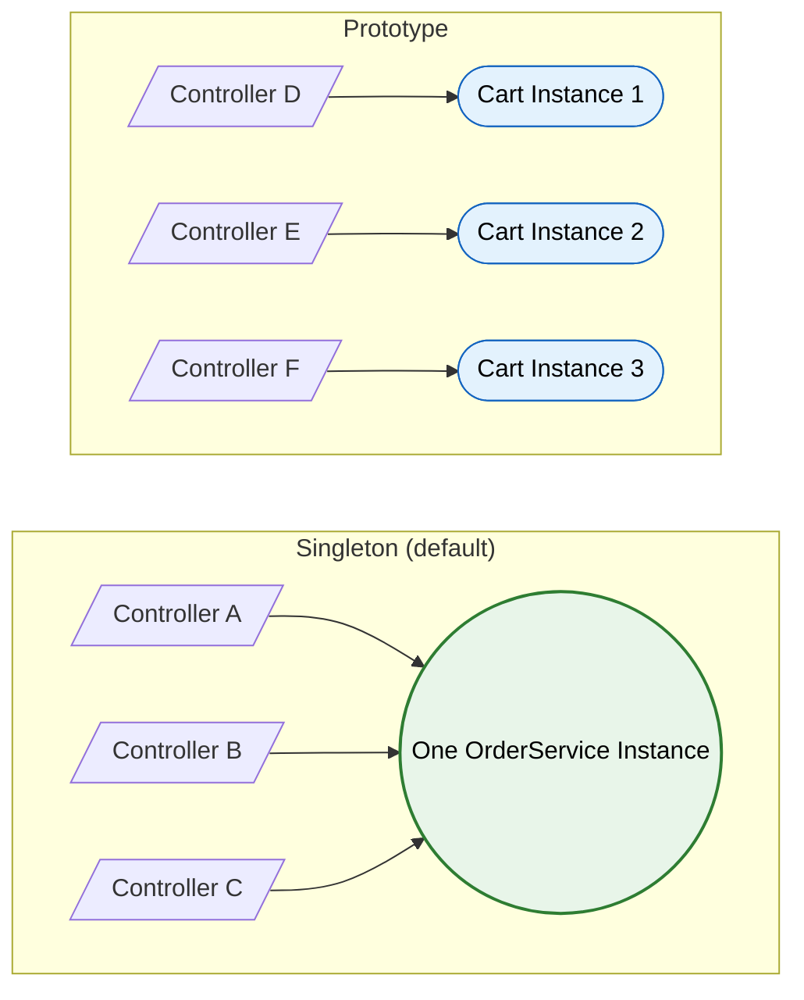

# Bean Lifecycle & Scopes

> **How Spring creates, wires, initializes, and destroys beans.**


---

## Lifecycle Stages

### 1. BeanDefinition Loading

Before any bean is created. Spring reads `@Component`, `@Configuration`, `@Bean` metadata. Creates `BeanDefinition` objects (class, scope, deps, init method). `BeanFactoryPostProcessor` can modify definitions here.

### 2. Instantiation

Constructor called. For constructor injection, all deps are resolved NOW. If field/setter injection — deps are NOT available yet.

Constructor selection rules:

- Single constructor → used automatically (no `@Autowired` needed since Spring 4.3)
- Multiple constructors → use the one with `@Autowired`
- No annotation + multiple → Spring uses no-arg constructor

### 3. Dependency Injection

`@Autowired` fields and setters populated. `@Value` properties resolved. After this step, all deps are available.

### 4. Aware Interfaces

Spring calls these if your bean implements them:

| Interface | Provides |
|-----------|----------|
| `BeanNameAware` | Bean's name in the container |
| `BeanFactoryAware` | Reference to the BeanFactory |
| `ApplicationContextAware` | Reference to the ApplicationContext |
| `EnvironmentAware` | Environment (profiles, properties) |

!!! tip "Prefer constructor injection"
    Instead of implementing `ApplicationContextAware`, just inject `ApplicationContext` via constructor. Same result, no Spring interface coupling.

### 5. BeanPostProcessor — Before Init

`postProcessBeforeInitialization()` called on ALL beans. This is where `CommonAnnotationBeanPostProcessor` processes `@Resource`.

### 6. Initialization Callbacks

Three mechanisms, called in this order:

```
@PostConstruct → InitializingBean.afterPropertiesSet() → @Bean(initMethod)
```

| Mechanism | When to Use |
|-----------|-------------|
| `@PostConstruct` | Application code. Preferred. |
| `InitializingBean` | Framework/library code. Spring-specific. |
| `@Bean(initMethod)` | Third-party classes you can't annotate. |

### 7. BeanPostProcessor — After Init

`postProcessAfterInitialization()` called. **AOP proxies created here.** `@Transactional`, `@Async`, `@Cacheable` wrapping happens at this stage.

!!! danger "Self-invocation problem"
    `@Transactional` method A calls `@Transactional` method B on `this` → B's transaction is ignored. `this` is the raw bean, not the proxy. The proxy is only in the caller's reference.
    
    Fix: inject self via `ObjectFactory<MyService>`, or extract B into another service.

### 8. Bean Ready

Bean is live. Available for injection and use.

### 9. Destruction

On container shutdown:

```
@PreDestroy → DisposableBean.destroy() → @Bean(destroyMethod)
```

Spring auto-infers `close()` or `shutdown()` methods as destroyMethod. Set `@Bean(destroyMethod = "")` to disable.

### Full Lifecycle Code Example

```java
@Component
public class OrderService implements BeanNameAware, InitializingBean, DisposableBean {

    private final OrderRepository repo;

    // 1. Constructor (instantiation + constructor injection)
    public OrderService(OrderRepository repo) {
        this.repo = repo;
        // @Autowired fields are NULL here if using field injection!
    }

    // 4. Aware interface
    @Override
    public void setBeanName(String name) {
        log.info("Bean name: {}", name);
    }

    // 6a. @PostConstruct (runs first)
    @PostConstruct
    public void init() { warmUpCache(); }

    // 6b. InitializingBean (runs second)
    @Override
    public void afterPropertiesSet() { validateConfig(); }

    // 9a. @PreDestroy (runs first)
    @PreDestroy
    public void cleanup() { flushCache(); }

    // 9b. DisposableBean (runs second)
    @Override
    public void destroy() { closeConnections(); }
}
```

### Gotchas

!!! danger "@Autowired field accessed in constructor → NPE"
    Field injection happens AFTER constructor. Use constructor injection to avoid this.

!!! danger "@PostConstruct throws → app won't start"
    Context initialization fails. For non-critical init, use `@EventListener(ApplicationReadyEvent.class)`.

!!! danger "Prototype beans: no @PreDestroy"
    Spring doesn't track prototype instances. No destruction callback. Clean up manually.

---

## Bean Scopes

| Scope | Instances | Destruction Managed? | Thread-Safe? | Use Case |
|-------|-----------|:-------------------:|:------------:|----------|
| **singleton** | 1 per container | Yes | Must be | Services, repos, controllers |
| **prototype** | New per lookup | **No** | N/A | Stateful builders, commands |
| **request** | 1 per HTTP request | Yes | No (1 thread) | Correlation ID, request timer |
| **session** | 1 per HTTP session | Yes | Yes (concurrent reqs) | Shopping cart, user prefs |
| **application** | 1 per ServletContext | Yes | Yes | Shared app-level state |
| **websocket** | 1 per WS connection | Yes | Depends | Per-connection state |



### Singleton

Default. One instance shared everywhere. Must be **stateless** and **thread-safe**. No mutable instance fields (or use `ConcurrentHashMap`, `AtomicLong`).

### Prototype

New instance per `getBean()` call or injection point. Spring creates it and forgets it — no lifecycle management after creation.

### The Prototype-in-Singleton Trap

```java
@Service
public class OrderService {
    @Autowired
    private ShoppingCart cart; // prototype, but created ONCE with the singleton
}
```

`cart` is the same instance forever. Prototype scope defeated.

**Fixes:**

```java
// Option 1: ObjectProvider (preferred)
private final ObjectProvider<ShoppingCart> cartProvider;
public void process() { cartProvider.getObject(); } // new instance each time

// Option 2: @Lookup
@Lookup
protected abstract ShoppingCart createCart();

// Option 3: Provider (JSR-330)
private final Provider<ShoppingCart> cartProvider;
```

### Request/Session Scope + ScopedProxyMode

Request-scoped bean injected into singleton — no request exists at startup. Spring can't create it.

Solution: inject a **CGLIB proxy**. At runtime, proxy delegates to the real bean from the current request thread-local.

```java
@Component
@Scope(value = "request", proxyMode = ScopedProxyMode.TARGET_CLASS)
public class RequestContext {
    private String correlationId;
    private Instant startTime = Instant.now();
}
```

- `TARGET_CLASS` — CGLIB subclass proxy. Works on concrete classes.
- `INTERFACES` — JDK dynamic proxy. Requires interface. Lighter.

---

## BeanPostProcessor vs BeanFactoryPostProcessor

| | BeanFactoryPostProcessor | BeanPostProcessor |
|---|---|---|
| **When** | Before any bean instantiation | After each bean instantiation |
| **Modifies** | Bean **definitions** (metadata) | Bean **instances** (objects) |
| **Can change** | Class, scope, property values | Wrap in proxy, add behavior |
| **Example** | `PropertySourcesPlaceholderConfigurer` (resolves `${...}`) | `AutowiredAnnotationBeanPostProcessor` |

### Spring's Internal BPPs

| BPP | What It Does |
|-----|-------------|
| `AutowiredAnnotationBeanPostProcessor` | Processes `@Autowired`, `@Value` |
| `CommonAnnotationBeanPostProcessor` | Processes `@PostConstruct`, `@PreDestroy`, `@Resource` |
| `AnnotationAwareAspectJAutoProxyCreator` | Creates AOP proxies (`@Transactional`, `@Async`, `@Cacheable`) |
| `ScheduledAnnotationBeanPostProcessor` | Processes `@Scheduled` |
| `AsyncAnnotationBeanPostProcessor` | Wraps `@Async` methods with executor |

### Custom BPP Example

```java
@Component
public class SlowBeanDetector implements BeanPostProcessor {
    private final Map<String, Long> starts = new ConcurrentHashMap<>();

    public Object postProcessBeforeInitialization(Object bean, String name) {
        starts.put(name, System.nanoTime());
        return bean;
    }

    public Object postProcessAfterInitialization(Object bean, String name) {
        long ms = TimeUnit.NANOSECONDS.toMillis(System.nanoTime() - starts.remove(name));
        if (ms > 100) log.warn("Slow bean: {} took {}ms", name, ms);
        return bean;
    }
}
```

---

## Bean Creation Order

Spring creates beans in dependency order. A depends on B → B created first.

For beans without explicit deps, order is **undefined**. Control it with:

| Annotation | Effect |
|-----------|--------|
| `@DependsOn("cacheManager")` | This bean created after `cacheManager` |
| `@Order(1)` / `Ordered` | Controls order in `List<T>` injection and BPP priority |
| `@Priority(1)` | Like `@Order`, also affects `@Primary` resolution |
| `SmartLifecycle.getPhase()` | Controls startup/shutdown order |

!!! warning "@DependsOn"
    If you need it, you probably have a hidden dependency that should be made explicit via injection.

---

## @Lazy Initialization

```java
@Lazy
@Service
public class HeavyReportService { } // not created at startup

@Service
public class OrderService {
    public OrderService(@Lazy HeavyReportService reports) { } // proxy injected, real bean on first use
}
```

Global: `spring.main.lazy-initialization=true` (Spring Boot 2.2+).

**Pros:** Faster startup. Lower memory until first use.

**Cons:** Startup errors surface at runtime. First request slower. Harder to debug missing beans.

!!! danger "Production risk"
    Lazy init hides configuration errors. A missing bean that would fail at startup now fails at 2 AM when the first user hits that code path.

---

## Graceful Shutdown

On `context.close()` or SIGTERM:

1. Stop accepting new requests
2. Wait for in-flight requests to complete (`spring.lifecycle.timeout-per-shutdown-phase=30s`)
3. Call `@PreDestroy` on singletons (reverse creation order)
4. Call `DisposableBean.destroy()`
5. Close ApplicationContext
6. JVM shutdown hooks run

```java
@Component
public class GracefulService {
    @PreDestroy
    public void onShutdown() {
        deregisterFromServiceRegistry();
        flushPendingMessages();
        closeConnectionPool();
    }
}
```

---

## ApplicationContext Events

| Event | When |
|-------|------|
| `ContextRefreshedEvent` | All beans initialized, context ready |
| `ContextStartedEvent` | `context.start()` called |
| `ContextStoppedEvent` | `context.stop()` called |
| `ContextClosedEvent` | `context.close()`, shutdown |
| `ApplicationReadyEvent` (Boot) | Runners executed, app fully ready |
| `ApplicationFailedEvent` (Boot) | Startup failed |

```java
@Component
public class StartupListener {
    @EventListener(ApplicationReadyEvent.class)
    public void onReady() {
        log.info("App started. Loading initial data...");
        loadReferenceData();
    }
}
```

### Custom Events

```java
// Define
public class OrderPlacedEvent extends ApplicationEvent {
    private final Order order;
    public OrderPlacedEvent(Object source, Order order) {
        super(source);
        this.order = order;
    }
}

// Publish
@Service
public class OrderService {
    private final ApplicationEventPublisher publisher;
    
    public void placeOrder(Order order) {
        orderRepo.save(order);
        publisher.publishEvent(new OrderPlacedEvent(this, order));
    }
}

// Listen
@Component
public class NotificationListener {
    @EventListener
    public void onOrderPlaced(OrderPlacedEvent event) {
        sendConfirmationEmail(event.getOrder());
    }
}
```

### @TransactionalEventListener

```java
@TransactionalEventListener(phase = TransactionPhase.AFTER_COMMIT)
public void onOrderCommitted(OrderPlacedEvent event) {
    // only runs if the transaction committed successfully
    sendEmail(event.getOrder());
}
```

Phases: `BEFORE_COMMIT`, `AFTER_COMMIT`, `AFTER_ROLLBACK`, `AFTER_COMPLETION`.

---

## Interview Questions

??? question "1. Describe the bean lifecycle in order."
    Constructor → DI → Aware interfaces → BPP.beforeInit → @PostConstruct → afterPropertiesSet → BPP.afterInit (AOP proxies) → Ready → @PreDestroy → destroy().

??? question "2. Where are AOP proxies created?"
    `BeanPostProcessor.postProcessAfterInitialization()`. `AnnotationAwareAspectJAutoProxyCreator` wraps the bean. This is why self-invocation (`this.method()`) bypasses `@Transactional` — `this` is the raw bean, not the proxy.

??? question "3. @PostConstruct vs InitializingBean vs @Bean(initMethod)?"
    All run after DI. Order: @PostConstruct → afterPropertiesSet → initMethod. Use @PostConstruct for your code. InitializingBean for framework code. initMethod for third-party classes.

??? question "4. Default scope and why?"
    Singleton. Most beans (services, repos) are stateless. One shared instance saves memory. Must be thread-safe.

??? question "5. Prototype in singleton — what happens?"
    Prototype created once at singleton init. Same instance reused forever. Fix: `ObjectProvider<T>`, `Provider<T>`, `@Lookup`.

??? question "6. Does Spring call @PreDestroy on prototypes?"
    No. Spring doesn't track prototype instances after creation. No destruction lifecycle. You clean up manually.

??? question "7. What is ScopedProxyMode?"
    Injects a CGLIB proxy for narrow-scoped beans (request/session) into wider scopes (singleton). Proxy resolves real bean from current request/session at runtime.

??? question "8. BeanFactoryPostProcessor vs BeanPostProcessor?"
    BFPP runs before any bean exists, modifies bean definitions (metadata). BPP runs after each bean is created, modifies instances (objects, proxies).

??? question "9. @PostConstruct throws — what happens?"
    Bean creation fails. Context fails. App doesn't start. Use `@EventListener(ApplicationReadyEvent.class)` for non-critical init.

??? question "10. Self-invocation: why does @Transactional not work on this.method()?"
    `this` is the raw bean. `@Transactional` works via AOP proxy wrapping. When you call `this.method()`, you bypass the proxy. The caller holds the proxy reference, not you.

??? question "11. How to control bean creation order?"
    Spring resolves by dependency graph. Explicit control: `@DependsOn`, `@Order`/`@Priority` (for collections), `SmartLifecycle.getPhase()` (for startup/shutdown).

??? question "12. @Lazy — what's the risk?"
    Defers bean creation to first use. Startup errors become runtime errors. Missing bean at 2 AM instead of at deploy time. Use for genuinely heavy beans only.

??? question "13. What is @TransactionalEventListener?"
    Listens to events but only fires based on transaction phase (AFTER_COMMIT, AFTER_ROLLBACK). Avoids processing events from rolled-back transactions.

??? question "14. Graceful shutdown sequence?"
    Stop accepting requests → wait for in-flight to complete → @PreDestroy (reverse creation order) → DisposableBean.destroy() → close context → JVM shutdown hooks.

??? question "15. Why does Spring auto-infer destroyMethod?"
    Spring looks for `close()` or `shutdown()` methods on beans declared via `@Bean`. Auto-calls them on context close. Disable with `@Bean(destroyMethod = "")`.

??? question "16. What happens if @Autowired field is used in constructor?"
    `NullPointerException`. Field injection runs after constructor. The field is null during construction. Use constructor injection instead.
