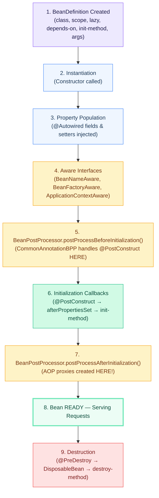
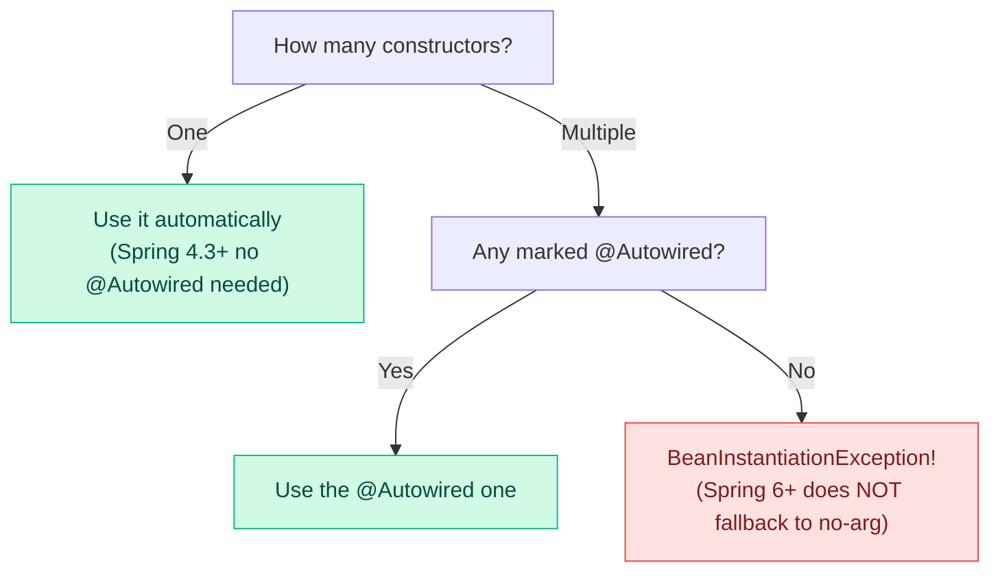
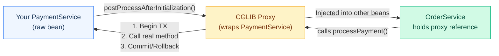
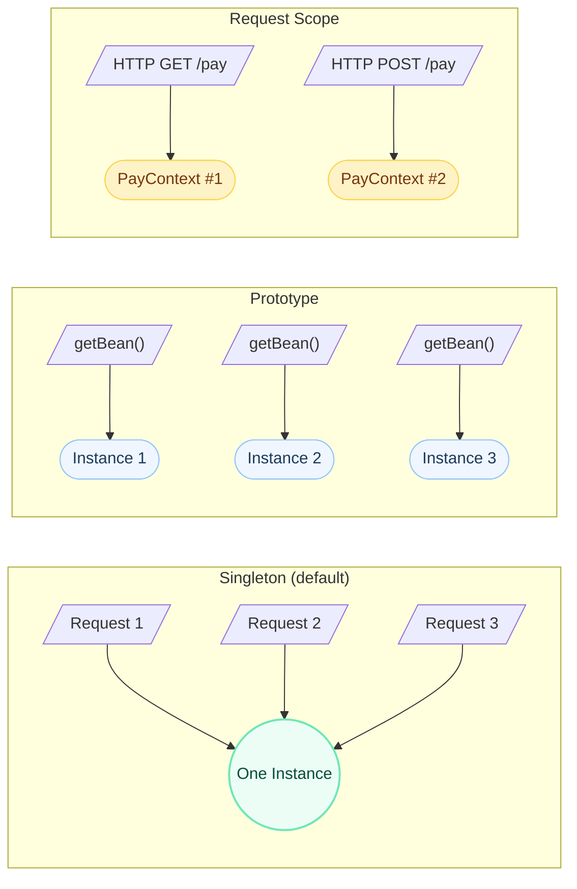
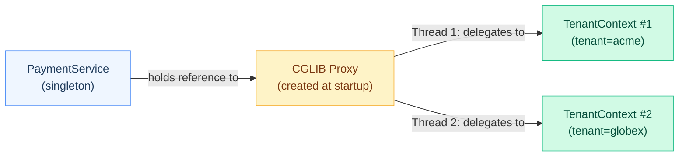
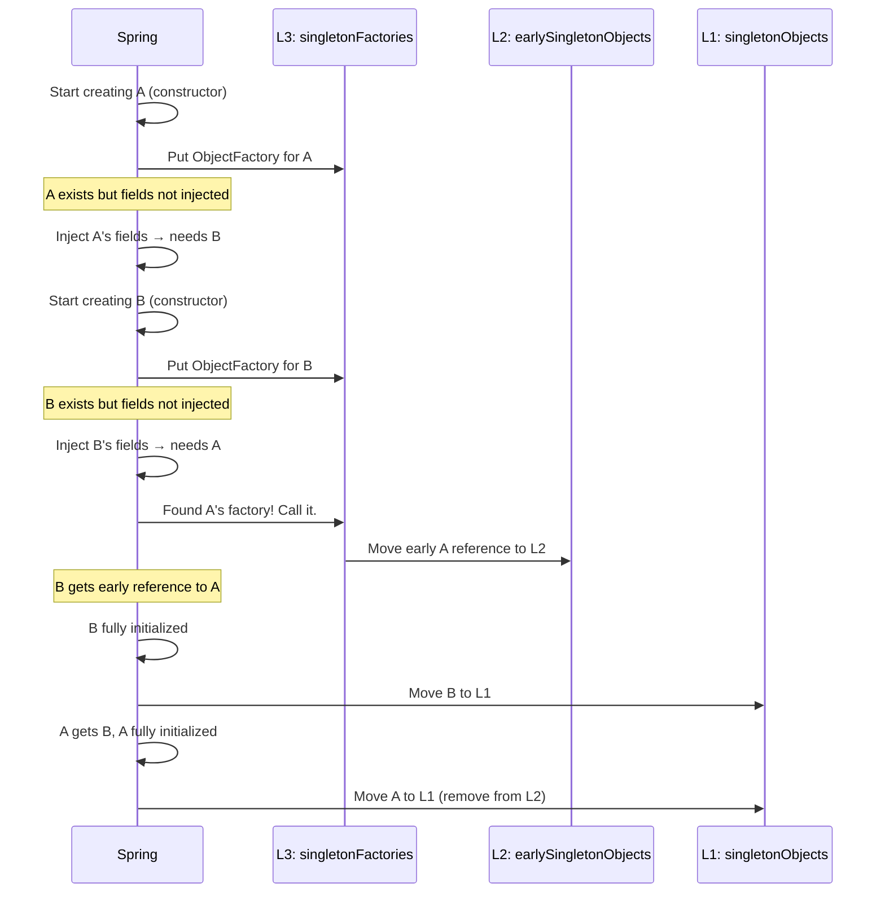
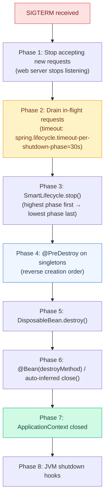

# Bean Lifecycle & Scopes — The Complete Interview Guide

You know when you put `@Service` on a class and magically it works? Here's what Spring actually does behind the scenes — there are **11 steps** between your class file and a working bean, and interviewers love asking about every single one of them.

This page covers the full lifecycle with production code, the scopes that trip up senior devs, the circular dependency problem everyone asks about, and the 12 hardest interview questions with follow-ups that separate "read the docs" candidates from "debugged this at 3AM" candidates.

---

## The Complete Bean Lifecycle



!!! tip "💡 One-liner"
    A Spring bean goes through: Definition → Instantiation → Injection → Awareness → Pre-processing → Initialization → Post-processing (proxies!) → Ready → Destruction.

!!! example "🎯 Interview Tip"
    When asked "describe the bean lifecycle," start with "There are 9 major phases..." and walk through them. Mentioning that AOP proxies are created in step 7 (postProcessAfterInitialization) shows deep understanding — it explains why self-invocation breaks @Transactional.

---

## Step 1: BeanDefinition Creation

**What:** Spring scans your classpath, reads `@Component`, `@Configuration`, `@Bean`, XML — and creates a `BeanDefinition` object for each bean. This is **metadata**, not the bean itself.

**Why:** Spring needs to know everything about a bean before creating it — class type, scope, dependencies, init methods, constructor args. This separation of metadata from instances is what makes `BeanFactoryPostProcessor` possible.

**When:** During `ApplicationContext` refresh, before any bean is instantiated.

**What's stored in a BeanDefinition:**

| Property | Example |
|----------|---------|
| `beanClassName` | `com.payment.PaymentService` |
| `scope` | `singleton` |
| `lazyInit` | `false` |
| `dependsOn` | `["cacheManager"]` |
| `initMethodName` | `"initialize"` |
| `destroyMethodName` | `"cleanup"` |
| `constructorArgumentValues` | Constructor params |
| `propertyValues` | Setter injection values |
| `primary` | `true/false` |
| `factoryMethodName` | For `@Bean` methods |

```java
// You can inspect BeanDefinitions at runtime
@Component
public class BeanDefinitionInspector implements ApplicationContextAware {
    
    @Override
    public void setApplicationContext(ApplicationContext ctx) {
        ConfigurableApplicationContext configCtx = (ConfigurableApplicationContext) ctx;
        BeanDefinitionRegistry registry = (BeanDefinitionRegistry) configCtx.getBeanFactory();
        
        BeanDefinition def = registry.getBeanDefinition("paymentService");
        System.out.println("Class: " + def.getBeanClassName());
        System.out.println("Scope: " + def.getScope());
        System.out.println("Lazy: " + def.isLazyInit());
    }
}
```

---

## Step 2: Instantiation

**What:** Spring calls the constructor. The bean object now exists in memory but is completely uninitialized — no fields injected, no proxies, nothing.

**Why:** You need an object before you can do anything with it. Constructor injection resolves dependencies NOW because they're constructor parameters.

**Constructor Selection Rules:**



=== "Single Constructor (Preferred)"

    ```java
    @Service
    public class PaymentService {
        
        private final PaymentGateway gateway;
        private final TransactionRepository repo;
        private final MeterRegistry metrics;
        
        // Spring 4.3+: single constructor, no @Autowired needed
        public PaymentService(PaymentGateway gateway, 
                              TransactionRepository repo,
                              MeterRegistry metrics) {
            this.gateway = gateway;
            this.repo = repo;
            this.metrics = metrics;
            // All deps available HERE. Fields are final. Immutable. Thread-safe.
        }
    }
    ```

=== "Multiple Constructors"

    ```java
    @Service
    public class PaymentService {
        
        private final PaymentGateway gateway;
        private final TransactionRepository repo;
        
        @Autowired  // REQUIRED when multiple constructors exist
        public PaymentService(PaymentGateway gateway, TransactionRepository repo) {
            this.gateway = gateway;
            this.repo = repo;
        }
        
        // Used in tests — Spring ignores this one
        public PaymentService(PaymentGateway gateway) {
            this(gateway, new InMemoryTransactionRepository());
        }
    }
    ```

!!! danger "⚠️ What breaks"
    If you have field injection (`@Autowired` on a field) and try to use that field in the constructor — **NullPointerException**. The constructor runs BEFORE field injection. This is the #1 reason to prefer constructor injection.

---

## Step 3: Property Population (Dependency Injection)

**What:** Spring injects `@Autowired` fields, calls `@Autowired` setters, resolves `@Value` properties. After this step, all dependencies are available.

**Injection Order:**

1. Constructor parameters (already done in Step 2)
2. `@Autowired` fields (via reflection, bypasses setter)
3. `@Autowired` setter methods
4. `@Value` properties resolved from `Environment`

```java
@Service
public class PaymentService {
    
    @Autowired  // Step 3: injected via reflection AFTER constructor
    private AuditService auditService;
    
    @Value("${payment.gateway.timeout:5000}")  // Step 3: resolved from properties
    private int gatewayTimeout;
    
    private NotificationService notifications;
    
    @Autowired  // Step 3: setter called AFTER constructor
    public void setNotificationService(NotificationService notifications) {
        this.notifications = notifications;
        // You can do validation here — deps are being injected
    }
}
```

!!! question "❓ Counter-question: Why does Spring recommend constructor injection over field injection?"
    Three reasons: (1) Fields can be `final` — immutable, thread-safe. (2) Dependencies are explicit — you see them in the constructor signature. (3) Testable without Spring — just call `new PaymentService(mockGateway, mockRepo)`. Field injection requires reflection or a Spring context to test.

---

## Step 4: Aware Interfaces

**What:** If your bean implements specific `Aware` interfaces, Spring calls the corresponding setter method, giving your bean access to infrastructure objects.

**Why:** Sometimes a bean needs to know its own name (for logging/metrics), access the BeanFactory (for dynamic bean lookup), or get the Environment (for feature flags).

**When to use:** Rarely in application code. Mostly in framework/library code. Prefer constructor injection of `ApplicationContext` or `Environment` instead.

| Interface | Method Called | What You Get | Real Use Case |
|-----------|-------------|--------------|---------------|
| `BeanNameAware` | `setBeanName(String)` | Bean's registered name | Logging, metrics tags |
| `BeanFactoryAware` | `setBeanFactory(BeanFactory)` | The BeanFactory | Dynamic bean resolution |
| `ApplicationContextAware` | `setApplicationContext(ApplicationContext)` | Full context | Event publishing, resource loading |
| `EnvironmentAware` | `setEnvironment(Environment)` | Environment | Profile/property access |
| `ResourceLoaderAware` | `setResourceLoader(ResourceLoader)` | Resource loader | Loading classpath files |
| `ApplicationEventPublisherAware` | `setApplicationEventPublisher(...)` | Event publisher | Publishing events |

```java
@Component
public class PaymentService implements BeanNameAware, EnvironmentAware {
    
    private String beanName;
    private boolean sandboxMode;
    
    @Override
    public void setBeanName(String name) {
        this.beanName = name;
        // Real use: include bean name in MDC for distributed tracing
        // "paymentService" shows up in logs and metrics dashboards
    }
    
    @Override
    public void setEnvironment(Environment env) {
        // Real use: check if we're in sandbox mode before @PostConstruct runs
        this.sandboxMode = env.acceptsProfiles(Profiles.of("sandbox"));
    }
}
```

!!! tip "💡 One-liner"
    Aware interfaces are Spring's callback mechanism to inject infrastructure objects into beans. They run after property population but before initialization.

---

## Step 5: BeanPostProcessor — Before Initialization

**What:** Spring calls `postProcessBeforeInitialization(Object bean, String beanName)` on **every single bean** for **every registered BeanPostProcessor**.

**Why:** This is where Spring's magic annotations get processed. `CommonAnnotationBeanPostProcessor` processes `@PostConstruct` (actually triggers it in Step 6, but discovers it here), `@Resource`, etc.

**Who uses this internally:**

| BeanPostProcessor | What It Does Here |
|-------------------|-------------------|
| `CommonAnnotationBeanPostProcessor` | Discovers `@PostConstruct` and `@PreDestroy` methods |
| `ApplicationContextAwareProcessor` | Calls all `Aware` interface methods |
| `InitDestroyAnnotationBeanPostProcessor` | Handles JSR-250 lifecycle annotations |

!!! example "🎯 Interview Tip"
    When asked "how does @PostConstruct work internally?", answer: "CommonAnnotationBeanPostProcessor is a BeanPostProcessor that discovers @PostConstruct-annotated methods during the beforeInitialization phase and invokes them during the initialization callbacks phase."

---

## Step 6: Initialization Callbacks

**What:** Three initialization mechanisms, called in this **exact** order:

```
1. @PostConstruct          (JSR-250 annotation)
2. InitializingBean.afterPropertiesSet()   (Spring interface)
3. @Bean(initMethod = "init")              (XML/Java config)
```

**When to use which:**

| Mechanism | Use When | Example |
|-----------|----------|---------|
| `@PostConstruct` | Application code. Your default choice. | Validate API keys, warm caches, register metrics |
| `InitializingBean` | Framework/library code that already depends on Spring | Spring's own internal beans |
| `@Bean(initMethod)` | Third-party class you can't annotate | DataSource, connection pool |

### Production Example: PaymentService Startup

```java
@Service
public class PaymentService implements InitializingBean {
    
    private final PaymentGateway gateway;
    private final PaymentConfig config;
    private volatile boolean ready = false;
    
    public PaymentService(PaymentGateway gateway, PaymentConfig config) {
        this.gateway = gateway;
        this.config = config;
        // DON'T do initialization here — deps might not all be ready
        // (especially if other beans have circular refs to us)
    }
    
    @PostConstruct  // Runs FIRST
    void validateConfiguration() {
        // Real production use: fail fast if config is wrong
        if (config.getApiKey() == null || config.getApiKey().isBlank()) {
            throw new IllegalStateException(
                "Payment API key not configured! Set PAYMENT_API_KEY env var.");
        }
        if (config.getTimeout().toMillis() > 30_000) {
            throw new IllegalStateException(
                "Payment timeout too high: " + config.getTimeout() + 
                ". Max allowed: 30s");
        }
        log.info("PaymentService config validated: endpoint={}, timeout={}ms",
                config.getEndpoint(), config.getTimeout().toMillis());
    }
    
    @Override  // Runs SECOND
    public void afterPropertiesSet() throws Exception {
        // Real production use: verify connectivity to external service
        gateway.healthCheck();
        log.info("Payment gateway connectivity verified");
    }
    
    // If declared as @Bean(initMethod = "warmUp") — runs THIRD
    public void warmUp() {
        // Real production use: pre-load exchange rates, supported currencies
        gateway.loadSupportedCurrencies();
        this.ready = true;
    }
}
```

!!! danger "⚠️ What breaks"
    If `@PostConstruct` throws an exception, **the entire application fails to start**. This is usually what you want (fail fast), but for non-critical initialization (loading cache, pre-warming), use `@EventListener(ApplicationReadyEvent.class)` instead — the app starts and handles the failure gracefully.

---

## Step 7: BeanPostProcessor — After Initialization

**What:** Spring calls `postProcessAfterInitialization(Object bean, String beanName)`. This is the **most important step** for understanding Spring magic.

**Why this matters:** **AOP proxies are created HERE.** This is why `@Transactional`, `@Async`, `@Cacheable`, `@Retryable` work — the bean you get injected is not your class, it's a proxy that wraps your class.



**Key BPPs that run here:**

| BeanPostProcessor | What It Creates |
|-------------------|-----------------|
| `AnnotationAwareAspectJAutoProxyCreator` | AOP proxies for `@Transactional`, `@Cacheable`, `@Async` |
| `AsyncAnnotationBeanPostProcessor` | Wraps `@Async` methods with TaskExecutor |
| `MethodValidationPostProcessor` | Validates `@Valid` method parameters |

### The Self-Invocation Problem (CRITICAL for interviews)

```java
@Service
public class OrderService {
    
    @Transactional
    public void placeOrder(Order order) {
        orderRepo.save(order);
        // BUG: this.sendConfirmation() bypasses the proxy!
        // @Transactional on sendConfirmation is IGNORED
        this.sendConfirmation(order);
    }
    
    @Transactional(propagation = Propagation.REQUIRES_NEW)
    public void sendConfirmation(Order order) {
        // This WON'T run in a new transaction when called from placeOrder()
        // because `this` is the raw bean, not the proxy
        notificationService.send(order);
    }
}
```

**Fixes:**

=== "Extract to Separate Service (Best)"

    ```java
    @Service
    public class OrderService {
        private final OrderConfirmationService confirmationService;
        
        @Transactional
        public void placeOrder(Order order) {
            orderRepo.save(order);
            confirmationService.sendConfirmation(order); // Goes through proxy!
        }
    }
    
    @Service
    public class OrderConfirmationService {
        @Transactional(propagation = Propagation.REQUIRES_NEW)
        public void sendConfirmation(Order order) {
            notificationService.send(order); // New transaction works!
        }
    }
    ```

=== "Self-Injection via ObjectFactory"

    ```java
    @Service
    public class OrderService {
        private final ObjectFactory<OrderService> self;
        
        @Transactional
        public void placeOrder(Order order) {
            orderRepo.save(order);
            self.getObject().sendConfirmation(order); // Goes through proxy!
        }
    }
    ```

---

## Step 8: Bean Ready

The bean is fully initialized, proxied, and available. It's now serving requests, being injected into other beans, and doing its job.

---

## Step 9: Destruction

**On container shutdown (SIGTERM, `context.close()`), destruction callbacks fire in this order:**

```
1. @PreDestroy                    (JSR-250 annotation)
2. DisposableBean.destroy()       (Spring interface)
3. @Bean(destroyMethod = "close") (Java config / auto-inferred)
```

### Production Example: Graceful Connection Pool Shutdown

```java
@Service
public class PaymentService implements DisposableBean {
    
    private final HttpClient httpClient;
    private final ScheduledExecutorService scheduler;
    private final MeterRegistry metrics;
    
    @PreDestroy  // Runs FIRST
    void deregister() {
        // 1. Remove from service registry so no new traffic arrives
        serviceRegistry.deregister(this);
        log.info("PaymentService deregistered from service discovery");
        
        // 2. Wait for in-flight requests to drain
        awaitInFlightRequests(Duration.ofSeconds(10));
    }
    
    @Override  // Runs SECOND
    public void destroy() {
        // 3. Shut down background tasks
        scheduler.shutdown();
        try {
            if (!scheduler.awaitTermination(5, TimeUnit.SECONDS)) {
                scheduler.shutdownNow();
            }
        } catch (InterruptedException e) {
            scheduler.shutdownNow();
            Thread.currentThread().interrupt();
        }
        
        // 4. Close HTTP connection pool
        httpClient.close();
        log.info("PaymentService connections closed");
    }
}
```

!!! danger "⚠️ What breaks"
    **Prototype beans do NOT get `@PreDestroy` called.** Spring creates them and forgets. If your prototype holds resources (file handles, connections), you must close them manually or use a custom `DestructionAwareBeanPostProcessor`.

!!! tip "💡 One-liner"
    Spring auto-infers `close()` or `shutdown()` methods on `@Bean`-declared beans as the destroyMethod. Disable with `@Bean(destroyMethod = "")` if auto-close is unwanted (e.g., shared DataSource).

---

## Bean Scopes — Production Scenarios



| Scope | Instances | Destruction? | Thread-Safe? | Real Use Case |
|-------|-----------|:------------:|:------------:|---------------|
| **singleton** | 1 per container | Yes | MUST be | Services, repos, controllers |
| **prototype** | New per lookup | **No** | N/A (one owner) | Stateful commands, parsers |
| **request** | 1 per HTTP request | Yes | No (1 thread) | Tenant context, request timer |
| **session** | 1 per HTTP session | Yes | Must be | Shopping cart, user prefs |
| **application** | 1 per ServletContext | Yes | Must be | App-level shared config |
| **websocket** | 1 per WS session | Yes | Depends | Chat connection state |

---

### Singleton — The Thread-Safety Bug Everyone Has

**The problem:** Singleton beans are shared across ALL threads. If you put mutable state in a singleton, you have a race condition.

```java
@Service
public class PricingService {
    
    // BUG: mutable state in a singleton!
    private BigDecimal lastCalculatedPrice;  // Race condition!
    private String lastCustomerId;           // Race condition!
    
    public BigDecimal calculatePrice(String customerId, Order order) {
        this.lastCustomerId = customerId;  // Thread A writes
        BigDecimal price = doExpensiveCalculation(order);
        this.lastCalculatedPrice = price;  // Thread B writes, overwrites Thread A
        
        // Thread A reads — gets Thread B's price! WRONG!
        audit(this.lastCustomerId, this.lastCalculatedPrice);
        return price;
    }
}
```

**The fix — stateless design:**

```java
@Service
public class PricingService {
    
    // No mutable fields! All state is local to the method.
    
    public BigDecimal calculatePrice(String customerId, Order order) {
        BigDecimal price = doExpensiveCalculation(order);  // local variable — thread-safe
        audit(customerId, price);  // method params — thread-safe
        return price;
    }
    
    // If you NEED shared mutable state:
    private final AtomicLong totalCalculations = new AtomicLong(0);  // Thread-safe
    private final ConcurrentHashMap<String, BigDecimal> priceCache = new ConcurrentHashMap<>();  // Thread-safe
}
```

!!! danger "⚠️ What breaks"
    **The classic production bug:** Developer adds a `SimpleDateFormat` field to a singleton service for "performance" (avoid creating new instances). `SimpleDateFormat` is NOT thread-safe. Under load: corrupted dates, random `NumberFormatException`. Fix: use `DateTimeFormatter` (immutable) or `ThreadLocal<SimpleDateFormat>`.

---

### Prototype — Stateful Objects Done Right

**Use for:** Objects that accumulate state during processing. File parsers, report builders, shopping carts, wizard flows.

```java
@Component
@Scope("prototype")
public class CsvFileProcessor {
    
    private final List<String> errors = new ArrayList<>();
    private int rowCount = 0;
    private int successCount = 0;
    
    public ProcessingResult process(InputStream file) {
        // Safe! Each call gets its own instance with fresh state.
        try (BufferedReader reader = new BufferedReader(new InputStreamReader(file))) {
            reader.lines().forEach(line -> {
                rowCount++;
                try {
                    parseLine(line);
                    successCount++;
                } catch (ParseException e) {
                    errors.add("Row " + rowCount + ": " + e.getMessage());
                }
            });
        }
        return new ProcessingResult(rowCount, successCount, errors);
    }
}
```

### THE TRAP: Prototype Injected into Singleton

This is asked in **every** senior Spring interview:

```java
@Service  // Singleton!
public class FileUploadService {
    
    @Autowired
    private CsvFileProcessor processor;  // Prototype... but created ONCE with the singleton!
    
    public ProcessingResult handleUpload(InputStream file) {
        // BUG: same processor instance for every request!
        // Previous request's errors, rowCount etc. are still there!
        return processor.process(file);
    }
}
```

**Three solutions:**

=== "ObjectProvider (Preferred — Spring 5+)"

    ```java
    @Service
    public class FileUploadService {
        
        private final ObjectProvider<CsvFileProcessor> processorProvider;
        
        public FileUploadService(ObjectProvider<CsvFileProcessor> processorProvider) {
            this.processorProvider = processorProvider;
        }
        
        public ProcessingResult handleUpload(InputStream file) {
            // Fresh instance every time!
            CsvFileProcessor processor = processorProvider.getObject();
            return processor.process(file);
        }
    }
    ```

=== "@Lookup Method"

    ```java
    @Service
    public abstract class FileUploadService {
        
        @Lookup  // Spring overrides this method via CGLIB to call getBean()
        protected abstract CsvFileProcessor createProcessor();
        
        public ProcessingResult handleUpload(InputStream file) {
            CsvFileProcessor processor = createProcessor();  // Fresh instance!
            return processor.process(file);
        }
    }
    ```

=== "Provider<T> (JSR-330 Standard)"

    ```java
    @Service
    public class FileUploadService {
        
        private final Provider<CsvFileProcessor> processorProvider;
        
        public FileUploadService(Provider<CsvFileProcessor> processorProvider) {
            this.processorProvider = processorProvider;
        }
        
        public ProcessingResult handleUpload(InputStream file) {
            CsvFileProcessor processor = processorProvider.get();  // Fresh instance!
            return processor.process(file);
        }
    }
    ```

!!! example "🎯 Interview Tip"
    When asked about the prototype-in-singleton trap, explain: "The prototype bean is resolved at singleton creation time — once. After that, the singleton holds a direct reference that never changes. The fix is to inject a factory (`ObjectProvider`, `Provider`, or `@Lookup`) instead of the bean itself, so each access creates a new prototype instance."

---

### Request/Session Scope + ScopedProxyMode

**The problem:** A request-scoped bean needs to be injected into a singleton. But at application startup (when the singleton is created), there IS no HTTP request. Spring can't create the request-scoped bean.

**The solution:** Inject a **CGLIB proxy**. The proxy is created at startup (satisfies the singleton's dependency). At runtime, the proxy delegates every method call to the **real bean bound to the current HTTP request**.



### Production Example: Multi-Tenant Request Context

```java
@Component
@Scope(value = WebApplicationContext.SCOPE_REQUEST, proxyMode = ScopedProxyMode.TARGET_CLASS)
public class TenantContext {
    
    private String tenantId;
    private String tenantDatabaseUrl;
    private Instant requestStartTime;
    private Map<String, String> tenantFeatureFlags;
    
    @PostConstruct
    void init() {
        this.requestStartTime = Instant.now();
    }
    
    public void setTenant(String tenantId, TenantConfig config) {
        this.tenantId = tenantId;
        this.tenantDatabaseUrl = config.getDatabaseUrl();
        this.tenantFeatureFlags = config.getFeatureFlags();
    }
    
    public String getTenantId() { return tenantId; }
    public String getDatabaseUrl() { return tenantDatabaseUrl; }
    public boolean isFeatureEnabled(String flag) {
        return "true".equals(tenantFeatureFlags.get(flag));
    }
    public Duration getRequestDuration() {
        return Duration.between(requestStartTime, Instant.now());
    }
}

// Singleton service — safely uses request-scoped bean
@Service
public class PaymentService {
    
    private final TenantContext tenantContext;  // Actually a proxy!
    private final DataSourceRouter dataSourceRouter;
    
    public PaymentService(TenantContext tenantContext, DataSourceRouter dataSourceRouter) {
        this.tenantContext = tenantContext;
        this.dataSourceRouter = dataSourceRouter;
    }
    
    @Transactional
    public PaymentResult processPayment(PaymentRequest request) {
        // Each HTTP request gets its own TenantContext instance
        String tenantDb = tenantContext.getDatabaseUrl();
        dataSourceRouter.routeTo(tenantDb);
        
        if (tenantContext.isFeatureEnabled("new_payment_flow")) {
            return processWithNewFlow(request);
        }
        return processWithLegacyFlow(request);
    }
}
```

**ScopedProxyMode options:**

| Mode | How | When |
|------|-----|------|
| `TARGET_CLASS` | CGLIB subclass proxy | Concrete classes (most common) |
| `INTERFACES` | JDK dynamic proxy | When bean implements an interface |
| `NO` | No proxy | Use with `ObjectProvider<T>` instead |

!!! question "❓ Counter-question: What happens if you access a request-scoped bean outside an HTTP request (e.g., in a @Scheduled method)?"
    You get `IllegalStateException: No thread-bound request found`. Fix: either don't use request-scoped beans in async contexts, or create a custom scope that works with both.

---

### Custom Scope: Tenant Scope for Multi-Tenant SaaS

When request scope isn't enough — you want beans to live for the duration of a tenant's "session" across multiple requests:

```java
public class TenantScope implements Scope {
    
    private final ThreadLocal<Map<String, Object>> tenantBeans = 
        ThreadLocal.withInitial(HashMap::new);
    private final ThreadLocal<Map<String, Runnable>> destructionCallbacks = 
        ThreadLocal.withInitial(HashMap::new);

    @Override
    public Object get(String name, ObjectFactory<?> objectFactory) {
        Map<String, Object> scope = tenantBeans.get();
        return scope.computeIfAbsent(name, k -> objectFactory.getObject());
    }

    @Override
    public Object remove(String name) {
        destructionCallbacks.get().remove(name);
        return tenantBeans.get().remove(name);
    }

    @Override
    public void registerDestructionCallback(String name, Runnable callback) {
        destructionCallbacks.get().put(name, callback);
    }

    @Override
    public String getConversationId() {
        return TenantContextHolder.getCurrentTenantId();
    }
    
    // Call this when tenant context ends
    public void clear() {
        destructionCallbacks.get().values().forEach(Runnable::run);
        destructionCallbacks.get().clear();
        tenantBeans.get().clear();
    }

    @Override
    public Object resolveContextualObject(String key) { return null; }
}

// Register the custom scope
@Configuration
public class TenantScopeConfig {
    
    @Bean
    public static CustomScopeConfigurer tenantScopeConfigurer() {
        CustomScopeConfigurer configurer = new CustomScopeConfigurer();
        configurer.addScope("tenant", new TenantScope());
        return configurer;
    }
}

// Use it
@Component
@Scope(value = "tenant", proxyMode = ScopedProxyMode.TARGET_CLASS)
public class TenantRateLimiter {
    private final AtomicInteger requestCount = new AtomicInteger(0);
    private final int maxRequestsPerMinute;
    // One rate limiter per tenant — shared across requests for same tenant
}
```

---

## BeanPostProcessor Deep Dive

### What It Is

A `BeanPostProcessor` is a hook that Spring calls for **every bean** in the container, before and after initialization. It's how Spring implements almost all of its annotation-based features internally.

### How Spring Uses BPPs Internally

| BPP Class | What It Processes |
|-----------|-------------------|
| `AutowiredAnnotationBeanPostProcessor` | `@Autowired`, `@Value`, `@Inject` |
| `CommonAnnotationBeanPostProcessor` | `@PostConstruct`, `@PreDestroy`, `@Resource` |
| `AnnotationAwareAspectJAutoProxyCreator` | Creates AOP proxies (`@Transactional`, `@Async`, `@Cacheable`) |
| `ScheduledAnnotationBeanPostProcessor` | `@Scheduled` methods → registers with TaskScheduler |
| `AsyncAnnotationBeanPostProcessor` | `@Async` methods → wraps with TaskExecutor |
| `PersistenceAnnotationBeanPostProcessor` | `@PersistenceContext` (JPA EntityManager injection) |

### Custom BPP: TimingBeanPostProcessor

Real production use — find beans that take too long to initialize (blocking app startup):

```java
@Component
public class TimingBeanPostProcessor implements BeanPostProcessor, Ordered {
    
    private static final Logger log = LoggerFactory.getLogger(TimingBeanPostProcessor.class);
    private final Map<String, Long> startTimes = new ConcurrentHashMap<>();
    private final List<BeanTiming> slowBeans = new CopyOnWriteArrayList<>();
    
    @Override
    public Object postProcessBeforeInitialization(Object bean, String beanName) {
        startTimes.put(beanName, System.nanoTime());
        return bean;
    }
    
    @Override
    public Object postProcessAfterInitialization(Object bean, String beanName) {
        Long startTime = startTimes.remove(beanName);
        if (startTime != null) {
            long durationMs = TimeUnit.NANOSECONDS.toMillis(System.nanoTime() - startTime);
            if (durationMs > 100) {
                slowBeans.add(new BeanTiming(beanName, bean.getClass().getSimpleName(), durationMs));
                log.warn("🐢 Slow bean initialization: {} ({}) took {}ms", 
                         beanName, bean.getClass().getSimpleName(), durationMs);
            }
        }
        return bean;
    }
    
    @Override
    public int getOrder() {
        return Ordered.HIGHEST_PRECEDENCE; // Run first so we measure all other BPPs too
    }
    
    @EventListener(ApplicationReadyEvent.class)
    public void reportSlowBeans() {
        if (!slowBeans.isEmpty()) {
            log.info("=== Slow Bean Report ({} beans > 100ms) ===", slowBeans.size());
            slowBeans.stream()
                .sorted(Comparator.comparingLong(BeanTiming::durationMs).reversed())
                .forEach(bt -> log.info("  {} ({}) — {}ms", bt.name(), bt.type(), bt.durationMs()));
            long total = slowBeans.stream().mapToLong(BeanTiming::durationMs).sum();
            log.info("  Total slow bean time: {}ms", total);
        }
    }
    
    private record BeanTiming(String name, String type, long durationMs) {}
}
```

### Custom BPP: Encryption Annotation Processor

Real-world example — auto-decrypt `@Encrypted` fields on bean initialization:

```java
@Retention(RetentionPolicy.RUNTIME)
@Target(ElementType.FIELD)
public @interface Encrypted {}

@Component
public class EncryptionBeanPostProcessor implements BeanPostProcessor {
    
    private final EncryptionService encryptionService;
    
    public EncryptionBeanPostProcessor(EncryptionService encryptionService) {
        this.encryptionService = encryptionService;
    }
    
    @Override
    public Object postProcessAfterInitialization(Object bean, String beanName) {
        for (Field field : bean.getClass().getDeclaredFields()) {
            if (field.isAnnotationPresent(Encrypted.class) && field.getType() == String.class) {
                field.setAccessible(true);
                try {
                    String encrypted = (String) field.get(bean);
                    if (encrypted != null) {
                        field.set(bean, encryptionService.decrypt(encrypted));
                    }
                } catch (IllegalAccessException e) {
                    throw new BeanInitializationException(
                        "Failed to decrypt @Encrypted field: " + field.getName(), e);
                }
            }
        }
        return bean;
    }
}

// Usage
@Component
public class PaymentConfig {
    @Value("${payment.api.key}")
    @Encrypted
    private String apiKey;  // Stored encrypted in properties, decrypted at startup
}
```

---

## BeanFactoryPostProcessor

### What | Why | When

**What:** A hook that runs **before any beans are created** — it modifies `BeanDefinition` metadata, not bean instances.

**Why:** You need to change how beans will be created. Change their scope, modify property values, add new bean definitions dynamically.

**When:** During context refresh, after all `BeanDefinition`s are loaded but before any `getBean()` call.


### How Spring Uses BFPPs Internally

| BFPP Class | What It Does |
|-----------|--------------|
| `PropertySourcesPlaceholderConfigurer` | Resolves `${db.url}` → actual value from properties files |
| `ConfigurationClassPostProcessor` | Processes `@Configuration`, `@Bean`, `@Import`, `@ComponentScan` |
| `EventListenerMethodProcessor` | Discovers `@EventListener` methods |

### Custom BFPP: Environment-Based Scope Override

Real example — in dev/test, make all request-scoped beans into singletons (no HTTP request in integration tests):

```java
@Component
public class ScopeOverrideBeanFactoryPostProcessor implements BeanFactoryPostProcessor {
    
    private final Environment environment;
    
    public ScopeOverrideBeanFactoryPostProcessor(Environment environment) {
        this.environment = environment;
    }
    
    @Override
    public void postProcessBeanFactory(ConfigurableListableBeanFactory beanFactory) {
        if (environment.acceptsProfiles(Profiles.of("test", "dev"))) {
            for (String beanName : beanFactory.getBeanDefinitionNames()) {
                BeanDefinition def = beanFactory.getBeanDefinition(beanName);
                if ("request".equals(def.getScope()) || "session".equals(def.getScope())) {
                    log.info("Overriding scope for '{}': {} → singleton (test mode)", 
                             beanName, def.getScope());
                    def.setScope("singleton");
                }
            }
        }
    }
}
```

### Custom BFPP: Feature Flag Bean Registration

Dynamically register beans based on feature flags:

```java
@Component
public class FeatureFlagBeanRegistrar implements BeanDefinitionRegistryPostProcessor {
    
    @Override
    public void postProcessBeanDefinitionRegistry(BeanDefinitionRegistry registry) {
        // Read feature flags from config
        if (isFeatureEnabled("new-payment-engine")) {
            RootBeanDefinition def = new RootBeanDefinition(StripePaymentGateway.class);
            def.setPrimary(true);
            registry.registerBeanDefinition("paymentGateway", def);
        } else {
            RootBeanDefinition def = new RootBeanDefinition(LegacyPaymentGateway.class);
            def.setPrimary(true);
            registry.registerBeanDefinition("paymentGateway", def);
        }
    }
    
    @Override
    public void postProcessBeanFactory(ConfigurableListableBeanFactory beanFactory) {
        // Can also modify existing definitions here
    }
}
```

!!! question "❓ Counter-question: What's the difference between BeanFactoryPostProcessor and BeanDefinitionRegistryPostProcessor?"
    `BeanDefinitionRegistryPostProcessor` extends `BeanFactoryPostProcessor` and adds the ability to **register new BeanDefinitions** (not just modify existing ones). `ConfigurationClassPostProcessor` is a `BeanDefinitionRegistryPostProcessor` — it registers all `@Bean` method beans.

---

## Circular Dependencies — THE Deep Interview Question

### The Problem

```java
@Service
public class ServiceA {
    private final ServiceB serviceB;
    public ServiceA(ServiceB serviceB) { this.serviceB = serviceB; }
}

@Service
public class ServiceB {
    private final ServiceA serviceA;
    public ServiceB(ServiceA serviceA) { this.serviceA = serviceA; }
}
```

A needs B. B needs A. Who gets created first?

### The Three-Level Cache (Singleton Resolution)

Spring solves circular dependencies for **field/setter-injected singletons** using a three-level cache:

| Cache Level | Map Name | Contains | Purpose |
|-------------|----------|----------|---------|
| **L1** | `singletonObjects` | Fully initialized beans | The final cache. Normal bean lookup. |
| **L2** | `earlySingletonObjects` | Partially initialized beans | Exposed early to break cycles. |
| **L3** | `singletonFactories` | `ObjectFactory<?>` lambdas | Can create early reference (possibly proxy). |

### Walk-Through: A depends on B, B depends on A (Field Injection)



**Step-by-step:**

1. Spring starts creating A → calls constructor → A object exists but is uninitialized
2. Spring puts an `ObjectFactory` for A in L3 (this factory can return A's early reference)
3. Spring tries to inject A's dependencies → A needs B
4. Spring starts creating B → calls constructor → B object exists but is uninitialized
5. Spring puts an `ObjectFactory` for B in L3
6. Spring tries to inject B's dependencies → B needs A
7. Spring checks L1 (not there), L2 (not there), **L3 (found A's factory!)**
8. Calls the factory → gets early reference to A → puts it in L2
9. B now has a reference to A (partially initialized). B completes → moves to L1
10. Back to A: gets B from L1. A completes → moves to L1 (removed from L2)

### WHY Constructor Injection Breaks This

```java
@Service
public class ServiceA {
    private final ServiceB serviceB;
    
    public ServiceA(ServiceB serviceB) {  // Need B to exist BEFORE A's constructor returns!
        this.serviceB = serviceB;
    }
}
```

With constructor injection, Spring can't expose A's early reference because **A's constructor hasn't finished yet** — the object doesn't exist. You can't put something in L3 that doesn't exist.

Spring throws: `BeanCurrentlyInCreationException: Requested bean is currently in creation: Is there an unresolvable circular reference?`

### Solutions

=== "@Lazy (Quick Fix)"

    ```java
    @Service
    public class ServiceA {
        private final ServiceB serviceB;
        
        public ServiceA(@Lazy ServiceB serviceB) {
            // Injects a PROXY, not the real B.
            // Real B created on first method call.
            this.serviceB = serviceB;
        }
    }
    ```

=== "Redesign (Best — Break the Cycle)"

    ```java
    // Extract the shared logic into a third service
    @Service
    public class ServiceA {
        private final SharedLogic shared;
        public ServiceA(SharedLogic shared) { this.shared = shared; }
    }
    
    @Service
    public class ServiceB {
        private final SharedLogic shared;
        public ServiceB(SharedLogic shared) { this.shared = shared; }
    }
    
    @Service
    public class SharedLogic {
        // The logic both A and B needed from each other
    }
    ```

=== "Setter Injection (Escape Hatch)"

    ```java
    @Service
    public class ServiceA {
        private ServiceB serviceB;
        
        @Autowired
        public void setServiceB(ServiceB serviceB) {
            this.serviceB = serviceB;  // Injected AFTER constructor
        }
    }
    ```

=== "Event-Driven (Decouple)"

    ```java
    @Service
    public class ServiceA {
        private final ApplicationEventPublisher publisher;
        
        public void doWork() {
            // Instead of calling serviceB directly:
            publisher.publishEvent(new WorkCompletedEvent(result));
        }
    }
    
    @Service
    public class ServiceB {
        @EventListener
        public void onWorkCompleted(WorkCompletedEvent event) {
            // React to A's work without A knowing about B
        }
    }
    ```

!!! danger "⚠️ What breaks"
    **Spring Boot 2.6+ (Spring Framework 6+) disables circular dependency resolution by default.** You get `BeanCurrentlyInCreationException` even with field injection. Re-enable (not recommended) with `spring.main.allow-circular-references=true`. The real fix is redesigning your dependencies.

!!! example "🎯 Interview Tip"
    When explaining the three-level cache, mention: "The reason for L3 (ObjectFactory) instead of just using L2 is that the factory can return a proxy if AOP is involved. When B needs an early reference to A, and A will eventually be proxied (e.g., @Transactional), the factory creates the proxy early so B holds the correct proxy reference, not the raw bean."

---

## Graceful Shutdown — Production Deep Dive

### SmartLifecycle Interface

For beans that need precise control over startup/shutdown ordering and async shutdown:

```java
@Component
public class KafkaConsumerLifecycle implements SmartLifecycle {
    
    private final KafkaConsumer<String, String> consumer;
    private final ExecutorService executor;
    private volatile boolean running = false;
    
    @Override
    public int getPhase() {
        // Lower phase = starts first, stops last
        // Higher phase = starts last, stops first
        // Consumers should stop BEFORE producers (higher phase)
        return Integer.MAX_VALUE - 100;
    }
    
    @Override
    public void start() {
        running = true;
        executor.submit(() -> {
            while (running) {
                ConsumerRecords<String, String> records = consumer.poll(Duration.ofMillis(100));
                processRecords(records);
            }
        });
        log.info("Kafka consumer started");
    }
    
    @Override
    public void stop(Runnable callback) {
        // Async shutdown — call callback when done
        log.info("Kafka consumer stopping...");
        running = false;
        
        executor.submit(() -> {
            try {
                // Commit final offsets
                consumer.commitSync(Duration.ofSeconds(5));
                consumer.close(Duration.ofSeconds(10));
                log.info("Kafka consumer stopped gracefully");
            } finally {
                callback.run();  // Signal Spring that we're done
            }
        });
    }
    
    @Override
    public boolean isRunning() {
        return running;
    }
    
    @Override
    public boolean isAutoStartup() {
        return true;  // Start automatically with context
    }
}
```

### Complete Shutdown Sequence



### Production Configuration

```yaml
# application.yml
spring:
  lifecycle:
    timeout-per-shutdown-phase: 30s  # Max wait for in-flight to drain
  
server:
  shutdown: graceful  # Enable graceful shutdown (Spring Boot 2.3+)
```

### Real Example: Complete Graceful Shutdown for a Payment Service

```java
@Service
public class PaymentService implements SmartLifecycle {
    
    private final ServiceRegistry serviceRegistry;
    private final ConnectionPool connectionPool;
    private final MetricsPublisher metricsPublisher;
    private final AtomicInteger inFlightRequests = new AtomicInteger(0);
    private volatile boolean accepting = false;
    
    @Override
    public int getPhase() {
        return 0; // Default phase
    }
    
    @Override
    public void start() {
        accepting = true;
        serviceRegistry.register(this);
        log.info("PaymentService registered and accepting requests");
    }
    
    @Override
    public void stop(Runnable callback) {
        log.info("PaymentService shutdown initiated...");
        
        // Step 1: Deregister from service discovery
        serviceRegistry.deregister(this);
        accepting = false;
        log.info("Deregistered from service registry");
        
        // Step 2: Wait for in-flight requests (max 25s)
        CompletableFuture.runAsync(() -> {
            Instant deadline = Instant.now().plusSeconds(25);
            while (inFlightRequests.get() > 0 && Instant.now().isBefore(deadline)) {
                log.info("Waiting for {} in-flight requests...", inFlightRequests.get());
                try { Thread.sleep(500); } catch (InterruptedException e) { break; }
            }
            
            if (inFlightRequests.get() > 0) {
                log.warn("Shutdown timeout! {} requests still in-flight", inFlightRequests.get());
            }
            
            // Step 3: Flush metrics
            metricsPublisher.flush();
            
            // Step 4: Close connections
            connectionPool.close();
            log.info("PaymentService shutdown complete");
            
            callback.run();
        });
    }
    
    @Override
    public boolean isRunning() { return accepting; }
    
    @Override
    public boolean isAutoStartup() { return true; }
    
    public PaymentResult processPayment(PaymentRequest request) {
        if (!accepting) {
            throw new ServiceUnavailableException("Service shutting down");
        }
        inFlightRequests.incrementAndGet();
        try {
            return doProcess(request);
        } finally {
            inFlightRequests.decrementAndGet();
        }
    }
}
```

---

## Full Lifecycle Code Example — Production PaymentService

Putting it all together — a single class demonstrating every lifecycle phase:

```java
@Service
public class PaymentService implements BeanNameAware, ApplicationContextAware,
        InitializingBean, DisposableBean, SmartLifecycle {
    
    // === Dependencies (Step 2: Constructor Injection) ===
    private final PaymentGateway gateway;
    private final TransactionRepository repository;
    private final MeterRegistry metrics;
    
    // === State ===
    private String beanName;
    private ApplicationContext applicationContext;
    private volatile boolean running = false;
    private Timer paymentTimer;
    
    // Step 2: Instantiation — constructor called
    public PaymentService(PaymentGateway gateway, 
                          TransactionRepository repository,
                          MeterRegistry metrics) {
        this.gateway = gateway;
        this.repository = repository;
        this.metrics = metrics;
        // Note: @Autowired fields would be NULL here (if any existed)
        log.debug("PaymentService constructor called");
    }
    
    // Step 4: Aware Interfaces
    @Override
    public void setBeanName(String name) {
        this.beanName = name;
        MDC.put("bean", name);  // For structured logging
        log.debug("Bean name set: {}", name);
    }
    
    @Override
    public void setApplicationContext(ApplicationContext ctx) {
        this.applicationContext = ctx;
        log.debug("ApplicationContext injected");
    }
    
    // Step 6a: @PostConstruct (runs FIRST in initialization)
    @PostConstruct
    void validateConfig() {
        Objects.requireNonNull(gateway, "PaymentGateway must not be null");
        if (!gateway.isConfigured()) {
            throw new IllegalStateException(
                "Payment gateway not configured! Check PAYMENT_API_KEY env var.");
        }
        this.paymentTimer = Timer.builder("payment.duration")
                .tag("service", beanName)
                .register(metrics);
        log.info("PaymentService config validated");
    }
    
    // Step 6b: InitializingBean.afterPropertiesSet (runs SECOND)
    @Override
    public void afterPropertiesSet() throws Exception {
        // Verify connectivity to payment provider
        HealthStatus status = gateway.healthCheck();
        if (status != HealthStatus.UP) {
            throw new IllegalStateException("Payment gateway unreachable: " + status);
        }
        log.info("Payment gateway health check passed");
    }
    
    // SmartLifecycle: controlled startup
    @Override
    public void start() {
        running = true;
        log.info("PaymentService is now accepting payments");
    }
    
    @Override
    public int getPhase() { return 0; }
    
    @Override
    public boolean isRunning() { return running; }
    
    @Override
    public boolean isAutoStartup() { return true; }
    
    // SmartLifecycle: graceful shutdown (before @PreDestroy)
    @Override
    public void stop(Runnable callback) {
        running = false;
        log.info("PaymentService stopping — draining in-flight...");
        // Allow 10s for in-flight requests to complete
        try { Thread.sleep(2000); } catch (InterruptedException ignored) {}
        callback.run();
    }
    
    // Step 9a: @PreDestroy (runs FIRST in destruction)
    @PreDestroy
    void shutdown() {
        log.info("PaymentService @PreDestroy — flushing metrics");
        metrics.close();
    }
    
    // Step 9b: DisposableBean.destroy (runs SECOND in destruction)
    @Override
    public void destroy() {
        log.info("PaymentService destroy — closing gateway connection");
        gateway.close();
    }
    
    // === Business Method ===
    @Transactional  // Proxy wraps this (Step 7: BPP After Init)
    public PaymentResult processPayment(PaymentRequest request) {
        if (!running) throw new ServiceUnavailableException("Shutting down");
        
        return paymentTimer.record(() -> {
            Transaction tx = gateway.charge(request);
            repository.save(tx);
            applicationContext.publishEvent(new PaymentProcessedEvent(this, tx));
            return new PaymentResult(tx.getId(), tx.getStatus());
        });
    }
}
```

---

## Interview Questions & Answers

!!! question "❓ Q1: Walk me through the complete bean lifecycle."
    **Answer:** "There are 9 major phases:
    
    1. **BeanDefinition** — Spring reads metadata (class, scope, deps, init method) from annotations/config
    2. **Instantiation** — Constructor called. For constructor injection, deps resolved now.
    3. **Property Population** — @Autowired fields and setters injected
    4. **Aware Interfaces** — BeanNameAware, ApplicationContextAware etc. called
    5. **BPP Before Init** — BeanPostProcessors run pre-initialization hooks
    6. **Initialization** — @PostConstruct, then afterPropertiesSet(), then init-method
    7. **BPP After Init** — AOP proxies created here (@Transactional, @Cacheable wrapping)
    8. **Bean Ready** — Serving requests
    9. **Destruction** — @PreDestroy, then destroy(), then destroyMethod
    
    The key insight is that AOP proxies are created in step 7, which is why self-invocation bypasses @Transactional."
    
    **Follow-up: Why does the order matter?**
    "Because if you need to do something after AOP proxying (rare), you'd need a BPP with very low order. And if your @PostConstruct calls another @Transactional method on the same bean, it won't work because the proxy hasn't been created yet (step 6 happens before step 7)."

!!! question "❓ Q2: Where exactly are AOP proxies created, and why does this cause the self-invocation problem?"
    **Answer:** "AOP proxies are created in `BeanPostProcessor.postProcessAfterInitialization()` by `AnnotationAwareAspectJAutoProxyCreator`. It wraps the original bean in a CGLIB proxy (or JDK dynamic proxy).
    
    The self-invocation problem: when you call `this.method()`, you're calling the raw bean directly — `this` is NOT the proxy. The proxy only intercepts calls made through the injected reference that other beans hold. So `this.transactionalMethod()` bypasses the proxy entirely, and @Transactional is ignored.
    
    Fixes: (1) Extract to another service, (2) inject self via ObjectFactory, (3) use AopContext.currentProxy() (fragile)."

!!! question "❓ Q3: Explain the three-level cache for circular dependency resolution."
    **Answer:** "Spring uses three maps to resolve circular dependencies between singleton beans with field/setter injection:
    
    - **L1 (singletonObjects):** Fully initialized beans. Normal lookup.
    - **L2 (earlySingletonObjects):** Partially initialized beans, exposed early to break cycles.
    - **L3 (singletonFactories):** ObjectFactory lambdas that can create the early reference.
    
    Walk-through: A needs B, B needs A.
    
    1. Creating A → constructor done → put ObjectFactory in L3
    2. Injecting A's fields → needs B → start creating B
    3. Injecting B's fields → needs A → check L1 (no), L2 (no), L3 (found!)
    4. Call A's factory → get early reference → put in L2 → give to B
    5. B completes → L1. Return to A → gets B → A completes → L1.
    
    L3 exists (vs. just putting the raw bean in L2) because the factory can return a proxy if AOP is needed — ensuring B holds the correct proxy reference."
    
    **Follow-up: Why doesn't this work with constructor injection?**
    "Because Spring puts the bean into L3 AFTER the constructor returns. With constructor injection, the dependency is needed DURING construction — the bean doesn't exist yet, so there's nothing to put in L3."

!!! question "❓ Q4: What's the difference between BeanFactoryPostProcessor and BeanPostProcessor?"
    **Answer:** "They run at completely different times and modify different things:
    
    **BeanFactoryPostProcessor:** Runs BEFORE any bean is instantiated. Operates on BeanDefinition metadata (class, scope, property values). Example: PropertySourcesPlaceholderConfigurer resolves `${db.url}` in BeanDefinitions before beans are created.
    
    **BeanPostProcessor:** Runs AFTER each bean is instantiated and injected. Operates on bean instances (objects). Can wrap in proxy, modify behavior. Example: AnnotationAwareAspectJAutoProxyCreator creates AOP proxies.
    
    Think of it as: BFPP modifies the blueprint, BPP modifies the built house."

!!! question "❓ Q5: Prototype bean injected into singleton — what happens and how to fix?"
    **Answer:** "The prototype bean is instantiated once when the singleton is created, and that same instance is reused forever — defeating the purpose of prototype scope.
    
    This happens because Spring resolves the dependency at injection time. The singleton gets a direct reference, not a factory.
    
    Three fixes:
    
    1. **ObjectProvider<T>** (preferred) — call `provider.getObject()` each time
    2. **@Lookup** — Spring overrides an abstract method to call getBean()
    3. **Provider<T>** (JSR-330) — standard Java equivalent of ObjectProvider
    
    The key insight: inject a factory, not the bean itself."
    
    **Follow-up: Does Spring call @PreDestroy on prototype beans?**
    "No. Spring doesn't track prototype instances after creation. No destruction callbacks. You must clean up resources manually."

!!! question "❓ Q6: How does @PostConstruct work internally? What if it throws?"
    **Answer:** "@PostConstruct is processed by `CommonAnnotationBeanPostProcessor`, which is a `BeanPostProcessor`. It discovers methods annotated with @PostConstruct and invokes them during the initialization phase (step 6).
    
    If @PostConstruct throws: the bean creation fails, which fails the ApplicationContext refresh, which crashes the application. This is 'fail fast' — intentional for critical validation.
    
    For non-critical init (cache warming, pre-loading), use `@EventListener(ApplicationReadyEvent.class)` instead — the app starts fully, then runs your init. If it fails, the app is still serving traffic."

!!! question "❓ Q7: Explain ScopedProxyMode. When and why do you need it?"
    **Answer:** "ScopedProxyMode solves the 'narrow scope into wide scope' injection problem.
    
    Example: request-scoped bean injected into singleton. At startup when the singleton is created, there's no HTTP request — Spring can't create the request-scoped bean.
    
    Solution: `proxyMode = ScopedProxyMode.TARGET_CLASS` injects a CGLIB proxy at startup. The proxy satisfies the singleton's dependency. At runtime, every method call on the proxy delegates to the real bean from the current thread's HTTP request (via ThreadLocal lookup).
    
    Two modes: `TARGET_CLASS` (CGLIB, works on concrete classes) and `INTERFACES` (JDK proxy, lighter, requires interface)."
    
    **Follow-up: What happens if you access a request-scoped bean outside an HTTP request?**
    "IllegalStateException: No thread-bound request found. This happens in @Scheduled methods, @Async tasks, or any non-request thread."

!!! question "❓ Q8: What is SmartLifecycle and how does it differ from @PostConstruct/@PreDestroy?"
    **Answer:** "SmartLifecycle provides phased startup and async shutdown, which @PostConstruct/@PreDestroy don't offer.
    
    Key differences:
    
    - **Phases:** `getPhase()` controls order. Lower phase starts first, stops last. Critical for: 'start consumers AFTER producers are ready.'
    - **Async shutdown:** `stop(Runnable callback)` allows async cleanup. @PreDestroy is synchronous.
    - **Running state:** `isRunning()` lets Spring know if the component is active.
    - **Conditional startup:** `isAutoStartup()` can prevent automatic start.
    
    Use SmartLifecycle for components with ongoing processes (Kafka consumers, scheduled tasks, health check loops). Use @PostConstruct for one-time initialization."

!!! question "❓ Q9: Singleton thread-safety — how do you handle mutable state?"
    **Answer:** "Singleton beans are shared across all threads. Mutable instance fields without synchronization = race condition.
    
    Rules:
    
    1. **Stateless by default** — no mutable instance fields
    2. **Local variables** — always thread-safe (stack-confined)
    3. **If you need shared state:** `AtomicLong`, `ConcurrentHashMap`, `volatile`, or explicit locks
    4. **Never:** `SimpleDateFormat`, `HashMap`, `ArrayList` as instance fields in singletons
    
    The most common production bug: developer adds a mutable cache (plain HashMap) to a singleton for 'performance'. Under concurrent load: ConcurrentModificationException, infinite loops (HashMap resize race), corrupted data."

!!! question "❓ Q10: What happens during Spring Boot graceful shutdown?"
    **Answer:** "On SIGTERM or context.close():
    
    1. Web server stops accepting new connections
    2. Drain in-flight requests (configurable timeout: `spring.lifecycle.timeout-per-shutdown-phase=30s`)
    3. SmartLifecycle.stop() — highest phase first
    4. @PreDestroy on singletons — reverse creation order
    5. DisposableBean.destroy()
    6. Auto-inferred close()/shutdown() methods
    7. ApplicationContext closed
    8. JVM shutdown hooks
    
    Enable with: `server.shutdown=graceful` (Spring Boot 2.3+).
    
    Critical for: Kubernetes rolling deployments (pod gets SIGTERM, needs to finish requests before being killed after terminationGracePeriodSeconds)."

!!! question "❓ Q11: How would you debug slow application startup?"
    **Answer:** "Three approaches:
    
    1. **Custom TimingBeanPostProcessor** — measure initialization time per bean, report slow ones (>100ms). This shows exactly which beans are the bottleneck.
    
    2. **Spring Boot startup actuator** (`spring.application.startup=buffering`) — records startup steps with timing. Access via `/actuator/startup`.
    
    3. **ApplicationStartup with FlightRecorder** — zero-overhead timing for production.
    
    Common culprits: beans that do network calls in @PostConstruct (health checks, API key validation), Hibernate auto-DDL, scanning large classpaths, heavy Flyway migrations.
    
    Fixes: @Lazy for heavy beans, async initialization with ApplicationReadyEvent, reduce classpath scanning with explicit @ComponentScan basePackages."

!!! question "❓ Q12: Design a BeanPostProcessor that adds retry logic to any method annotated with @Retryable."
    **Answer:** "The approach:
    
    1. In `postProcessAfterInitialization`, check if bean class has any method with @Retryable
    2. If yes, return a CGLIB proxy that intercepts those methods
    3. The proxy catches exceptions and retries based on annotation parameters
    
    ```java
    @Component
    public class RetryBeanPostProcessor implements BeanPostProcessor {
        
        @Override
        public Object postProcessAfterInitialization(Object bean, String beanName) {
            Class<?> targetClass = AopUtils.getTargetClass(bean);
            
            boolean hasRetryable = Arrays.stream(targetClass.getMethods())
                .anyMatch(m -> m.isAnnotationPresent(Retryable.class));
            
            if (!hasRetryable) return bean;
            
            ProxyFactory factory = new ProxyFactory(bean);
            factory.addAdvice((MethodInterceptor) invocation -> {
                Method method = invocation.getMethod();
                Retryable retry = method.getAnnotation(Retryable.class);
                if (retry == null) return invocation.proceed();
                
                int attempts = 0;
                while (true) {
                    try {
                        return invocation.proceed();
                    } catch (Exception e) {
                        attempts++;
                        if (attempts >= retry.maxAttempts()) throw e;
                        Thread.sleep(retry.backoff());
                    }
                }
            });
            return factory.getProxy();
        }
    }
    ```
    
    Follow-up: In production, use Spring Retry (`@EnableRetry`) which handles this via `AnnotationAwareRetryOperationsInterceptor` — a proper BPP with exponential backoff, circuit breaking, and recovery methods."

---

## Quick Reference Card

| Phase | What Happens | Key Insight |
|-------|-------------|-------------|
| BeanDefinition | Metadata loaded | BFPP can modify here |
| Instantiation | Constructor called | Constructor deps resolved NOW |
| Property Population | @Autowired injected | Fields null in constructor! |
| Aware Interfaces | Infrastructure injected | BeanNameAware for logging |
| BPP Before | Pre-processing hooks | @PostConstruct discovered here |
| Initialization | @PostConstruct runs | Throws = app won't start |
| BPP After | **AOP proxies created** | Self-invocation breaks here |
| Ready | Serving traffic | — |
| Destruction | @PreDestroy runs | Not called for prototypes! |

---

## Common Gotchas Cheat Sheet

!!! danger "⚠️ Production Failures"
    
    | Gotcha | Symptom | Fix |
    |--------|---------|-----|
    | Field used in constructor | `NullPointerException` | Constructor injection |
    | @PostConstruct throws | App won't start | Use ApplicationReadyEvent for non-critical |
    | Prototype in singleton | Same instance reused | ObjectProvider or @Lookup |
    | Prototype @PreDestroy | Never called | Manual cleanup |
    | Self-invocation @Transactional | Transaction ignored | Extract to separate service |
    | SimpleDateFormat in singleton | Corrupted dates under load | DateTimeFormatter (immutable) |
    | Circular dependency (constructor) | BeanCurrentlyInCreationException | @Lazy, redesign, or setter injection |
    | Request-scoped in @Scheduled | IllegalStateException | Don't mix scopes, or use custom scope |
    | @PostConstruct calls @Transactional on self | No transaction | Proxy not created yet (step 6 < step 7) |
    | Lazy init hides missing bean | Runtime failure at 2AM | Fail fast: avoid global lazy init in prod |
