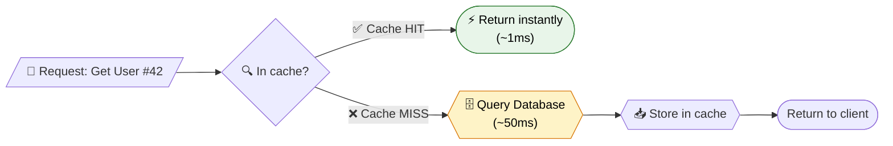
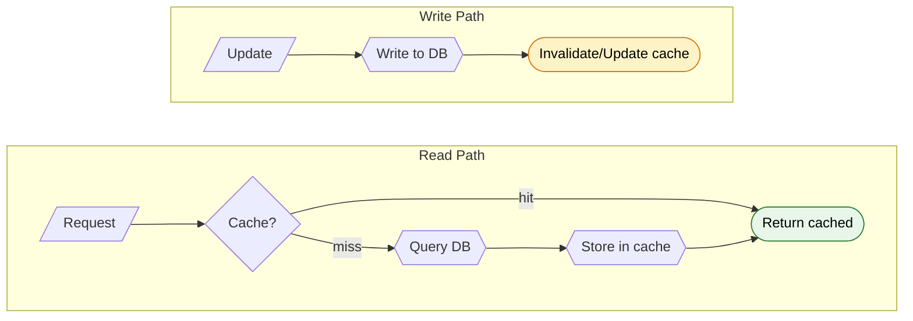

# Caching in Spring Boot

> Store frequently accessed data in memory. Skip the database round-trip. Get sub-millisecond reads.

---

!!! abstract "Real-World Analogy"
    A librarian keeps popular books on the desk (cache). Only walks to the shelves (database) on a miss. Same idea — hot data stays close.



---

## Quick Setup

```xml
<dependency>
    <groupId>org.springframework.boot</groupId>
    <artifactId>spring-boot-starter-cache</artifactId>
</dependency>
```

```java
@SpringBootApplication
@EnableCaching
public class Application { }
```

That single `@EnableCaching` activates Spring's caching infrastructure via AOP proxies.

---

## Core Annotations

### @Cacheable

Intercepts the method call. If a cached value exists for the computed key, the method body never executes.

```java
@Cacheable(value = "products", key = "#id")
public Product getById(Long id) {
    log.info("DB hit");  // only logged on cache MISS
    return productRepository.findById(id).orElseThrow();
}
```

**Use when:** reading data that changes infrequently.

### @CachePut

Always executes the method. Stores the return value in the cache. Never short-circuits.

```java
@CachePut(value = "products", key = "#product.id")
public Product update(Product product) {
    return productRepository.save(product);
}
```

**Use when:** you want to update the cache entry on every write.

### @CacheEvict

Removes one entry (or all entries) from the cache.

```java
@CacheEvict(value = "products", key = "#id")
public void delete(Long id) {
    productRepository.deleteById(id);
}

@CacheEvict(value = "products", allEntries = true)
public void clearProductCache() { }
```

**Use when:** data is deleted or bulk-invalidation is needed.

### @Caching

Combines multiple cache operations on a single method.

```java
@Caching(
    evict = {
        @CacheEvict(value = "products", key = "#product.id"),
        @CacheEvict(value = "productList", allEntries = true)
    },
    put = {
        @CachePut(value = "products", key = "#product.id")
    }
)
public Product update(Product product) {
    return productRepository.save(product);
}
```

**Use when:** a single operation must touch multiple caches or perform evict + put together.

### Annotation Summary

| Annotation | Executes Method? | Updates Cache? | Typical Use |
|---|---|---|---|
| `@Cacheable` | Only on miss | Yes (on miss) | Reads |
| `@CachePut` | Always | Always | Writes / updates |
| `@CacheEvict` | Always | Removes entry | Deletes / invalidation |
| `@Caching` | Depends on composed annotations | Depends | Multi-cache operations |

---

## Cache Providers

### ConcurrentHashMap (Default)

Zero configuration. Spring Boot uses `SimpleCacheManager` backed by `ConcurrentHashMap`. No TTL. No size limit. Entries live forever unless evicted manually.

```yaml
# No config needed — auto-activated with @EnableCaching
```

### Caffeine

High-performance, near-optimal hit rate (W-TinyLFU eviction). Local only.

```xml
<dependency>
    <groupId>com.github.ben-manes.caffeine</groupId>
    <artifactId>caffeine</artifactId>
</dependency>
```

```yaml
spring:
  cache:
    type: caffeine
    caffeine:
      spec: maximumSize=1000,expireAfterWrite=10m
    cache-names: products,users,orders
```

### Redis

Distributed. Survives app restarts. Shared across instances.

```xml
<dependency>
    <groupId>org.springframework.boot</groupId>
    <artifactId>spring-boot-starter-data-redis</artifactId>
</dependency>
```

```yaml
spring:
  cache:
    type: redis
  data:
    redis:
      host: localhost
      port: 6379
      password: secret
```

### EhCache

Mature. Supports heap + off-heap + disk tiers. XML-based configuration.

```xml
<dependency>
    <groupId>org.ehcache</groupId>
    <artifactId>ehcache</artifactId>
</dependency>
<dependency>
    <groupId>javax.cache</groupId>
    <artifactId>cache-api</artifactId>
</dependency>
```

```yaml
spring:
  cache:
    type: jcache
    jcache:
      config: classpath:ehcache.xml
```

### Provider Comparison

| Feature | ConcurrentHashMap | Caffeine | Redis | EhCache |
|---|---|---|---|---|
| Distributed | No | No | Yes | No (clustered mode exists) |
| TTL / Expiry | No | Yes | Yes | Yes |
| Size-based eviction | No | Yes (LFU) | Manual | Yes (LRU/LFU) |
| Off-heap storage | No | No | N/A (external) | Yes |
| Persistence | No | No | Yes (RDB/AOF) | Yes (disk tier) |
| Speed | Fastest (~ns) | Very fast (~ns) | Fast (~ms, network) | Fast (~ns local) |
| Multi-instance safe | No | No | Yes | No |
| Best for | Dev / tests | Single-node prod | Multi-node prod | Single-node + overflow |

---

## Cache Key Generation

### Default SpEL-based Keys

Spring uses method parameters as the key by default. Override with `key` attribute using SpEL.

```java
// Single param — param itself is the key
@Cacheable("users")
public User getUser(Long id) { ... }

// Multiple params — default key = SimpleKey(param1, param2, ...)
@Cacheable("orders")
public List<Order> find(Long userId, String status) { ... }

// Explicit SpEL key
@Cacheable(value = "orders", key = "#userId + ':' + #status")
public List<Order> find(Long userId, String status) { ... }

// Access object fields
@Cacheable(value = "users", key = "#request.email")
public User findByRequest(UserRequest request) { ... }
```

### Custom KeyGenerator

Implement `KeyGenerator` for complex or reusable key logic.

```java
@Component("prefixKeyGenerator")
public class PrefixKeyGenerator implements KeyGenerator {
    @Override
    public Object generate(Object target, Method method, Object... params) {
        return target.getClass().getSimpleName() + ":" 
            + method.getName() + ":" 
            + Arrays.stream(params).map(Object::toString).collect(Collectors.joining(":"));
    }
}
```

```java
@Cacheable(value = "reports", keyGenerator = "prefixKeyGenerator")
public Report generate(String region, int quarter) { ... }
```

### `key` vs `keyGenerator`

| Attribute | Scope | Use When |
|---|---|---|
| `key` | Per-method SpEL expression | Simple, one-off key logic |
| `keyGenerator` | Reusable bean | Shared key strategy across services |

You cannot use both on the same annotation. Pick one.

---

## Conditional Caching

### `condition` — Evaluated BEFORE method execution

Controls whether the cache is even consulted. If `false`, method runs and result is not cached.

```java
// Only cache products with id > 10
@Cacheable(value = "products", key = "#id", condition = "#id > 10")
public Product getById(Long id) { ... }

// Only cache when flag is true
@Cacheable(value = "config", condition = "#useCache")
public Config getConfig(String name, boolean useCache) { ... }
```

### `unless` — Evaluated AFTER method execution

Controls whether the result gets stored. Has access to `#result`.

```java
// Don't cache null results
@Cacheable(value = "products", key = "#id", unless = "#result == null")
public Product getById(Long id) { ... }

// Don't cache empty collections
@Cacheable(value = "orders", unless = "#result.isEmpty()")
public List<Order> getOrders(Long userId) { ... }

// Don't cache errors / specific values
@Cacheable(value = "prices", unless = "#result.amount <= 0")
public Price getPrice(String sku) { ... }
```

### Combining Both

```java
@Cacheable(
    value = "users",
    key = "#email",
    condition = "#email != null",     // skip cache lookup if email is null
    unless = "#result?.active == false" // don't cache inactive users
)
public User findByEmail(String email) { ... }
```

---

## TTL and Eviction Policies

### Caffeine Spec Options

```yaml
spring:
  cache:
    caffeine:
      spec: maximumSize=500,expireAfterWrite=5m,expireAfterAccess=2m,recordStats
```

| Spec Key | Meaning |
|---|---|
| `maximumSize=N` | Evict when N entries reached (W-TinyLFU) |
| `maximumWeight=N` | Evict based on weighted size |
| `expireAfterWrite=Xm` | TTL from write time |
| `expireAfterAccess=Xm` | TTL from last read/write |
| `recordStats` | Enable hit/miss/eviction stats |

### Caffeine Per-Cache TTL (Programmatic)

```java
@Bean
public CacheManager cacheManager() {
    CaffeineCacheManager manager = new CaffeineCacheManager();
    manager.setCacheSpecification("maximumSize=100,expireAfterWrite=5m");
    manager.registerCustomCache("sessions",
        Caffeine.newBuilder().expireAfterWrite(Duration.ofMinutes(30)).maximumSize(10_000).build());
    manager.registerCustomCache("static-data",
        Caffeine.newBuilder().expireAfterWrite(Duration.ofHours(24)).maximumSize(50).build());
    return manager;
}
```

### Redis TTL

Set per-cache TTL via `RedisCacheConfiguration`:

```java
@Bean
public RedisCacheManager cacheManager(RedisConnectionFactory factory) {
    RedisCacheConfiguration defaults = RedisCacheConfiguration.defaultCacheConfig()
        .entryTtl(Duration.ofMinutes(30))
        .disableCachingNullValues();

    Map<String, RedisCacheConfiguration> perCache = Map.of(
        "sessions", defaults.entryTtl(Duration.ofMinutes(5)),
        "products", defaults.entryTtl(Duration.ofHours(2)),
        "static-config", defaults.entryTtl(Duration.ofDays(1))
    );

    return RedisCacheManager.builder(factory)
        .cacheDefaults(defaults)
        .withInitialCacheConfigurations(perCache)
        .build();
}
```

### Size-Based Eviction

- **Caffeine:** `maximumSize` triggers W-TinyLFU eviction (frequency + recency).
- **Redis:** Use `maxmemory-policy` in `redis.conf` (e.g., `allkeys-lru`, `volatile-ttl`).
- **EhCache:** Configure heap/offheap/disk tiers with size limits.

---

## Cache Patterns

### Cache-Aside (Lazy Loading)

Application manages the cache explicitly. Read: check cache, miss triggers DB read + cache store. Write: update DB, then invalidate cache.

This is what `@Cacheable` + `@CacheEvict` implements.



**Pros:** Only caches what's actually requested. Simple.  
**Cons:** First request always slow (cold cache). Potential for stale data between invalidation and next read.

### Write-Through

Every write goes to cache AND database synchronously. Cache always has latest data.

```java
@CachePut(value = "products", key = "#product.id")
public Product save(Product product) {
    return productRepository.save(product);  // DB + cache updated atomically
}
```

**Pros:** Cache never stale. Reads always hit cache.  
**Cons:** Write latency increases. All data cached even if never read.

### Write-Behind (Write-Back)

Write goes to cache immediately. Database is updated asynchronously in the background (batched).

Not natively supported by Spring Cache abstraction. Requires custom implementation or libraries like EhCache's write-behind.

```java
// Conceptual — not Spring's built-in
@CachePut(value = "events", key = "#event.id")
public Event record(Event event) {
    asyncWriter.enqueue(event);  // writes to DB later in batch
    return event;
}
```

**Pros:** Ultra-fast writes. Batching reduces DB load.  
**Cons:** Risk of data loss if cache crashes before flush. Complexity.

### Pattern Comparison

| Pattern | Read Perf | Write Perf | Consistency | Complexity |
|---|---|---|---|---|
| Cache-Aside | Miss = slow | Fast (invalidate only) | Eventual | Low |
| Write-Through | Always fast | Slower (dual write) | Strong | Medium |
| Write-Behind | Always fast | Fastest | Weak | High |

---

## Redis Caching Deep Dive

### RedisCacheManager Configuration

```java
@Configuration
@EnableCaching
public class RedisCacheConfig {

    @Bean
    public RedisCacheConfiguration defaultCacheConfig() {
        ObjectMapper mapper = new ObjectMapper();
        mapper.activateDefaultTyping(
            mapper.getPolymorphicTypeValidator(),
            ObjectMapper.DefaultTyping.NON_FINAL);
        mapper.registerModule(new JavaTimeModule());

        return RedisCacheConfiguration.defaultCacheConfig()
            .entryTtl(Duration.ofMinutes(30))
            .disableCachingNullValues()
            .serializeKeysWith(
                SerializationPair.fromSerializer(new StringRedisSerializer()))
            .serializeValuesWith(
                SerializationPair.fromSerializer(new GenericJackson2JsonRedisSerializer(mapper)));
    }

    @Bean
    public RedisCacheManager cacheManager(RedisConnectionFactory factory) {
        Map<String, RedisCacheConfiguration> configs = Map.of(
            "products", defaultCacheConfig().entryTtl(Duration.ofHours(1)),
            "users", defaultCacheConfig().entryTtl(Duration.ofMinutes(15)),
            "sessions", defaultCacheConfig().entryTtl(Duration.ofMinutes(5))
        );

        return RedisCacheManager.builder(factory)
            .cacheDefaults(defaultCacheConfig())
            .withInitialCacheConfigurations(configs)
            .transactionAware()
            .build();
    }
}
```

### Serialization: JSON vs JDK

| Aspect | GenericJackson2JsonRedisSerializer | JdkSerializationRedisSerializer |
|---|---|---|
| Human-readable in Redis | Yes (JSON) | No (binary) |
| Performance | Slightly slower | Faster |
| Class evolution | Tolerant (add fields OK) | Fragile (serialVersionUID) |
| Cross-language | Yes | Java only |
| Size | Larger (field names) | Smaller |
| Debugging | Easy (`redis-cli` readable) | Painful |

!!! tip "Recommendation"
    Use JSON serialization. The debugging and evolvability benefits far outweigh the slight perf cost.

### TTL Per Cache

```java
// Different TTL for different caches
Map<String, RedisCacheConfiguration> configs = Map.of(
    "hot-data", defaults.entryTtl(Duration.ofSeconds(30)),
    "warm-data", defaults.entryTtl(Duration.ofMinutes(10)),
    "cold-data", defaults.entryTtl(Duration.ofHours(6))
);
```

---

## Gotchas and Pitfalls

### Self-Invocation (Proxy Bypass)

`@Cacheable` relies on Spring AOP proxies. Calling a cached method from within the same class bypasses the proxy. Cache is never consulted.

```java
@Service
public class OrderService {

    // THIS DOES NOT CACHE — self-invocation!
    public OrderSummary getSummary(Long orderId) {
        Order order = getOrder(orderId);  // direct call, no proxy
        return buildSummary(order);
    }

    @Cacheable("orders")
    public Order getOrder(Long orderId) {
        return repository.findById(orderId).orElseThrow();
    }
}
```

!!! danger "Fix Options"
    1. **Inject self:** `@Lazy @Autowired private OrderService self;` then call `self.getOrder(id)`.
    2. **Extract to another service:** Move the cached method to a separate bean.
    3. **Use AspectJ weaving** (compile-time or load-time) instead of JDK proxies.

### Caching Null Values

By default, `null` results ARE cached. This can mask bugs or return stale nulls.

```java
// Option 1: unless clause
@Cacheable(value = "users", unless = "#result == null")
public User findById(Long id) { ... }

// Option 2: Redis global setting
RedisCacheConfiguration.defaultCacheConfig().disableCachingNullValues();
// Throws IllegalArgumentException if method returns null
```

### Cache Key Collisions

Different methods sharing the same cache name can collide if keys overlap.

```java
// COLLISION! Both use cache "data" with key = param
@Cacheable(value = "data", key = "#id")
public User getUser(Long id) { ... }

@Cacheable(value = "data", key = "#id")
public Product getProduct(Long id) { ... }
// getUser(1) and getProduct(1) share the same cache entry!
```

**Fix:** Use distinct cache names or prefix keys.

### Serialization with Lombok

`@Data` / `@Value` classes work fine. But `@Builder` without a default constructor breaks Jackson deserialization.

```java
// BROKEN with Jackson for Redis cache
@Value
@Builder
public class Product {
    Long id;
    String name;
}

// FIXED — add JsonDeserialize + JsonPOJOBuilder
@Value
@Builder
@JsonDeserialize(builder = Product.ProductBuilder.class)
public class Product {
    Long id;
    String name;

    @JsonPOJOBuilder(withPrefix = "")
    public static class ProductBuilder { }
}
```

### Private Methods

`@Cacheable` on private methods does nothing. Spring AOP proxies only intercept public methods on the proxy interface.

### @Transactional Interaction

`@Cacheable` stores the result even if the surrounding transaction rolls back. The cache update happens outside the transaction boundary.

**Fix:** Use `TransactionAwareCacheDecorator` or evict on rollback.

---

## Cache Warming Strategies

### @PostConstruct

Load critical data at startup.

```java
@Service
public class ConfigService {

    @Autowired
    private ConfigRepository repository;
    
    @Autowired
    private CacheManager cacheManager;

    @PostConstruct
    public void warmCache() {
        Cache cache = cacheManager.getCache("config");
        repository.findAll().forEach(c -> cache.put(c.getKey(), c));
        log.info("Config cache warmed with {} entries", repository.count());
    }
}
```

### ApplicationReadyEvent

Runs after full context initialization (safer for complex dependencies).

```java
@Component
public class CacheWarmer implements ApplicationListener<ApplicationReadyEvent> {

    @Autowired private ProductService productService;

    @Override
    public void onApplicationEvent(ApplicationReadyEvent event) {
        productService.getTopProducts().forEach(p -> 
            productService.getById(p.getId())  // triggers @Cacheable
        );
        log.info("Product cache warmed");
    }
}
```

### Scheduled Refresh

Periodically refresh cache before TTL expires. Prevents cache misses in production.

```java
@Service
public class PriceCacheRefresher {

    @Autowired private PriceService priceService;

    @Scheduled(fixedRate = 300_000)  // every 5 minutes
    public void refreshPrices() {
        priceService.getAllActiveSkus().forEach(sku -> {
            priceService.evictPrice(sku);
            priceService.getPrice(sku);  // re-populates cache
        });
    }
}
```

---

## Monitoring with Micrometer

### Enable Cache Metrics

```yaml
management:
  endpoints:
    web:
      exposure:
        include: metrics,caches
  metrics:
    enable:
      cache: true
```

### Caffeine + Micrometer

```java
@Bean
public CacheManager cacheManager(MeterRegistry registry) {
    CaffeineCacheManager manager = new CaffeineCacheManager();
    manager.setCacheSpecification("maximumSize=1000,expireAfterWrite=10m,recordStats");
    // Micrometer auto-binds when recordStats is enabled
    return manager;
}
```

### Key Metrics

| Metric | Meaning |
|---|---|
| `cache.gets{result=hit}` | Cache hit count |
| `cache.gets{result=miss}` | Cache miss count |
| `cache.puts` | Entries added |
| `cache.evictions` | Entries evicted |
| `cache.size` | Current entry count |

### Calculating Hit Ratio

```
hit_ratio = cache.gets{result=hit} / (cache.gets{result=hit} + cache.gets{result=miss})
```

Target: > 90% for read-heavy caches. Below 50% means the cache is not effective.

### Prometheus / Grafana Query

```promql
rate(cache_gets_total{result="hit", cache="products"}[5m]) 
/ 
rate(cache_gets_total{cache="products"}[5m])
```

---

## Fun Example: Caching a Weather API

A weather service that caches external API responses. Shows the full cache hit/miss flow.

=== "WeatherService.java"

    ```java
    @Service
    @Slf4j
    public class WeatherService {

        private final RestClient restClient;

        public WeatherService(RestClient.Builder builder) {
            this.restClient = builder.baseUrl("https://api.weather.example.com").build();
        }

        @Cacheable(value = "weather", key = "#city", unless = "#result == null")
        public WeatherData getWeather(String city) {
            log.info("CACHE MISS — calling external weather API for: {}", city);
            return restClient.get()
                .uri("/v1/current?city={city}", city)
                .retrieve()
                .body(WeatherData.class);
        }

        @CacheEvict(value = "weather", key = "#city")
        public void evictWeather(String city) {
            log.info("Evicted weather cache for: {}", city);
        }

        @Scheduled(fixedRate = 600_000)  // refresh every 10 min
        @CacheEvict(value = "weather", allEntries = true)
        public void refreshAllWeather() {
            log.info("Cleared all weather cache — next requests will fetch fresh data");
        }
    }
    ```

=== "WeatherController.java"

    ```java
    @RestController
    @RequestMapping("/api/weather")
    public class WeatherController {

        @Autowired private WeatherService weatherService;

        @GetMapping("/{city}")
        public WeatherData getWeather(@PathVariable String city) {
            long start = System.currentTimeMillis();
            WeatherData data = weatherService.getWeather(city);
            long elapsed = System.currentTimeMillis() - start;
            log.info("Response for {} in {}ms", city, elapsed);
            return data;
        }
    }
    ```

=== "Cache Config"

    ```java
    @Bean
    public CacheManager weatherCacheManager() {
        CaffeineCacheManager manager = new CaffeineCacheManager("weather");
        manager.setCaffeine(Caffeine.newBuilder()
            .maximumSize(200)
            .expireAfterWrite(Duration.ofMinutes(10))
            .recordStats());
        return manager;
    }
    ```

=== "Request Flow"

    ```
    GET /api/weather/Tokyo
    → Log: "CACHE MISS — calling external weather API for: Tokyo"
    → Log: "Response for Tokyo in 320ms"
    → External API called, result cached

    GET /api/weather/Tokyo   (within 10 min)
    → Log: "Response for Tokyo in 1ms"
    → Served from cache. No external call.

    GET /api/weather/London
    → Log: "CACHE MISS — calling external weather API for: London"
    → Log: "Response for London in 280ms"
    → New city, cache miss, external call made.
    ```

---

## Interview Questions

??? question "1. What is the difference between @Cacheable and @CachePut?"
    `@Cacheable` checks the cache first. If the key exists, the method body is skipped entirely. `@CachePut` always executes the method and writes the result to the cache. Use `@Cacheable` for reads. Use `@CachePut` for writes where you want the cache updated with the new value.

??? question "2. How do you set different TTL per cache in Spring Boot?"
    With **Redis**: create a `Map<String, RedisCacheConfiguration>` with per-cache TTLs and pass it to `RedisCacheManager.builder().withInitialCacheConfigurations(map)`. With **Caffeine**: use `CaffeineCacheManager.registerCustomCache()` to register caches with individual `Caffeine` builder specs.

??? question "3. What is the cache stampede problem and how do you solve it?"
    When a hot cache entry expires, many concurrent requests simultaneously miss the cache and hit the database. Solutions: (1) Lock-based population — only one thread fetches, others wait. (2) Pre-emptive refresh — refresh before actual expiry. (3) Jittered TTLs — randomize expiry to spread load. (4) Caffeine's `refreshAfterWrite` with `AsyncLoadingCache`.

??? question "4. Why doesn't @Cacheable work on private methods?"
    Spring Cache uses AOP proxies (JDK dynamic proxies or CGLIB). Proxies can only intercept public method calls made through the proxy reference. Private methods are called directly on the target object, bypassing the proxy entirely. Fix: make the method public, or use AspectJ compile-time weaving.

??? question "5. Why doesn't caching work when calling a method from within the same class?"
    Same reason — self-invocation bypasses the proxy. `this.someMethod()` calls the target directly. The proxy never intercepts it. Fix: inject the bean into itself (`@Lazy` to break circular dependency), extract to a separate service, or use `AopContext.currentProxy()`.

??? question "6. How do you avoid caching null values?"
    Two approaches: (1) `@Cacheable(unless = "#result == null")` — method runs but null is not stored. (2) `RedisCacheConfiguration.defaultCacheConfig().disableCachingNullValues()` — throws `IllegalArgumentException` if null is returned.

??? question "7. How do you handle cache invalidation in a microservices environment?"
    Options: (1) Redis pub/sub — publish eviction events across instances. (2) Spring Cloud Bus — broadcast `@CacheEvict` events. (3) Short TTLs — accept eventual consistency. (4) Event-driven architecture — consume domain events (Kafka/RabbitMQ) to trigger evictions.

??? question "8. What serialization issues occur with Redis caching and Lombok?"
    `@Builder` classes without a no-arg constructor fail Jackson deserialization. `@Value` (immutable) classes need `@JsonDeserialize(builder = ...)`. Lazy-loaded JPA proxies serialize as Hibernate proxy objects instead of actual entities. Fix: use DTOs for cache values, not JPA entities.

??? question "9. Can you use @Cacheable with reactive (WebFlux) applications?"
    Standard `@Cacheable` does not work with `Mono`/`Flux` — it caches the Publisher object, not the emitted value. Use Reactor's `CacheMono`/`CacheFlux` from `reactor-extra`, or manually integrate with `ReactiveRedisTemplate`.

??? question "10. How do you monitor cache effectiveness in production?"
    Enable Micrometer metrics. Key metrics: `cache.gets{result=hit}`, `cache.gets{result=miss}`, `cache.evictions`. Calculate hit ratio. Alert if ratio drops below threshold. For Caffeine, enable `recordStats`. Expose via `/actuator/metrics/cache.gets`.

??? question "11. What is the difference between `condition` and `unless` in @Cacheable?"
    `condition` is evaluated BEFORE method execution — controls whether cache is consulted at all. `unless` is evaluated AFTER method execution — controls whether the result is stored. `condition` cannot access `#result`. `unless` can. Both use SpEL.

??? question "12. How do you warm a cache at application startup?"
    Three strategies: (1) `@PostConstruct` — load data immediately after bean creation. (2) `ApplicationReadyEvent` listener — run after full context is ready (safer). (3) `@Scheduled` refresh — periodic reload. Choose based on data size and startup time tolerance.

??? question "13. How does Spring resolve cache keys by default?"
    No params → `SimpleKey.EMPTY`. One param → that param directly. Multiple params → `new SimpleKey(param1, param2, ...)`. The `SimpleKey` class implements proper `hashCode()`/`equals()`. Override with `key` (SpEL) or `keyGenerator` (bean) attributes.

??? question "14. What is the difference between cache-aside and write-through patterns?"
    **Cache-aside:** Application manages cache explicitly. Reads check cache then DB. Writes update DB and invalidate cache. **Write-through:** Every write updates both cache and DB synchronously. Cache always has latest data. Cache-aside has simpler writes but potential stale reads. Write-through has consistent reads but slower writes.
