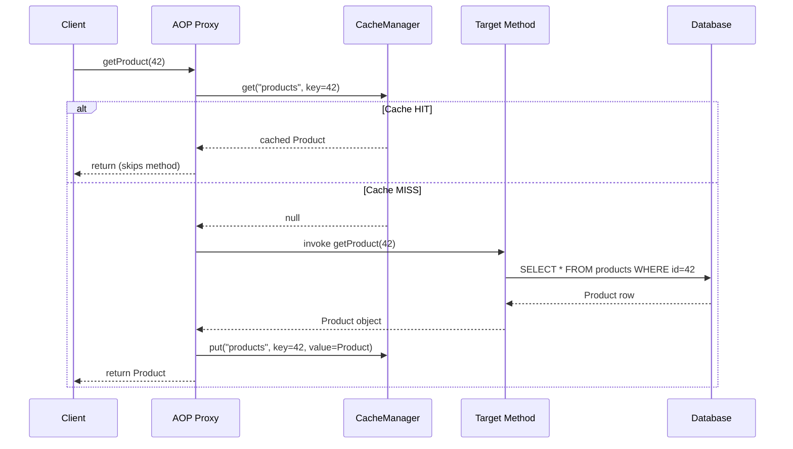
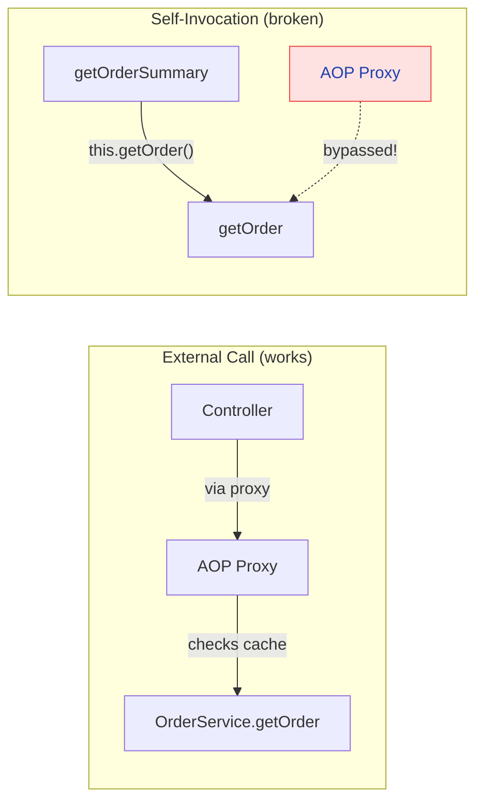
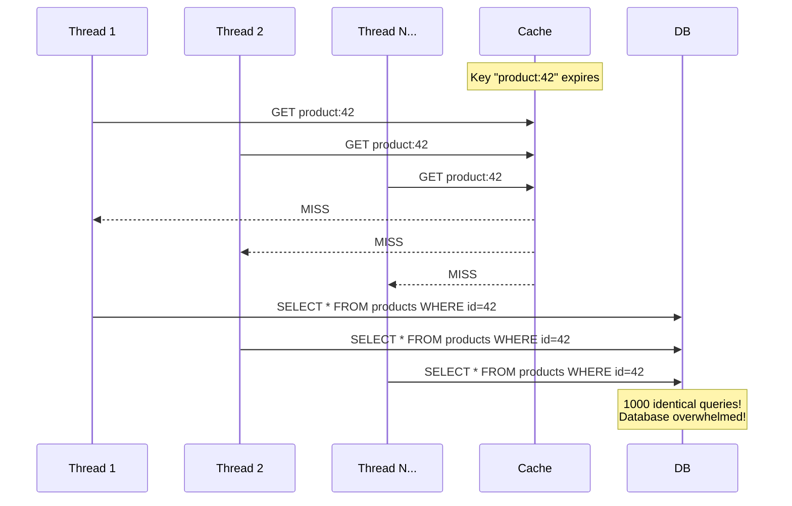
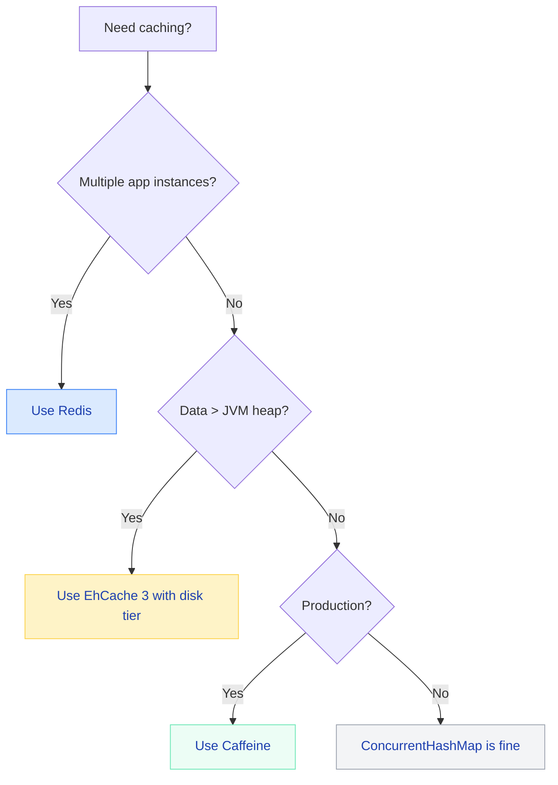

# Spring Boot Caching — The Complete Production Guide

Caching is deceptively simple to add — `@Cacheable` and done. But in production, caching is where most subtle bugs live. Cache invalidation is one of the "two hard things in computer science" for a reason. When do you use `@CachePut` vs `@CacheEvict`? What happens during a cache stampede? Why is your `@Cacheable` not working when called from the same class? Let me walk you through it...

---

## Why Cache?

### The Performance Pyramid

Every system has a memory hierarchy. The further you go from the CPU, the more expensive data access becomes.

| Layer | Latency | Example |
|---|---|---|
| L1 CPU Cache | ~1 ns | Register access |
| L2/L3 Cache | ~10 ns | On-chip SRAM |
| Application Cache (Caffeine) | ~50-100 ns | In-process HashMap |
| Distributed Cache (Redis) | ~1-5 ms | Network round-trip |
| Database (PostgreSQL) | ~5-50 ms | Disk I/O + query planning |
| External API Call | ~100-500 ms | Network + remote processing |

!!! tip "💡 One-liner for interviews"
    "Caching trades memory for latency by keeping frequently accessed data closer to the computation."

### When to Cache

- **Read-heavy workloads** — product catalog viewed 10,000x/sec, updated once/hour
- **Expensive computations** — price calculations, recommendation scores, report aggregations
- **Data that changes infrequently** — configuration, feature flags, country/currency lists
- **External API responses** — weather data, exchange rates, third-party service calls

### When NOT to Cache

- **Write-heavy data** — real-time stock prices, live chat messages (stale instantly)
- **Security-sensitive data** — tokens, passwords, PII (cache = attack surface)
- **Data that must be real-time** — account balances, inventory counts during flash sales
- **Highly personalized data** — unique per user with low reuse (cache pollution)

!!! danger "⚠️ What breaks"
    Caching financial data without proper invalidation caused a major e-commerce platform to show stale prices for 4 hours. Customers purchased items at old (lower) prices. The company ate $2.3M in losses because the cache TTL was set to 6 hours and no event-based invalidation existed.

---

## Spring Cache Abstraction

### How It Works Internally

!!! tip "💡 One-liner for interviews"
    "Spring's cache abstraction is an AOP proxy that intercepts method calls and short-circuits execution when a cached result exists for the computed key."



### Core Interfaces

| Interface | What It Does | Why It Exists |
|---|---|---|
| `Cache` | Abstraction over a single named cache region | Decouples caching logic from the provider (Redis, Caffeine, etc.) |
| `CacheManager` | Factory that creates/retrieves `Cache` instances by name | Single point of configuration for all caches in the application |
| `KeyGenerator` | Generates cache keys from method parameters | Pluggable key strategy without changing business logic |
| `CacheResolver` | Resolves which cache(s) to use at runtime | Dynamic cache selection (e.g., based on tenant) |

### Quick Setup

```xml
<dependency>
    <groupId>org.springframework.boot</groupId>
    <artifactId>spring-boot-starter-cache</artifactId>
</dependency>
```

```java
@SpringBootApplication
@EnableCaching  // Activates cache infrastructure via AOP proxies
public class ECommerceApplication { }
```

That single `@EnableCaching` registers a `CacheInterceptor` that wraps eligible beans in a caching proxy.

---

## Core Annotations Deep Dive

### @Cacheable — "Check before you compute"

**What it does:** Intercepts the method call. If a cached value exists for the computed key, the method body *never* executes.

**Why it exists:** To eliminate redundant computation for identical inputs.

**When to use:** Read operations where the result doesn't change between calls for the same input.

**How it works internally:** The `CacheInterceptor` computes the key via `KeyGenerator`, calls `Cache.get(key)`. On hit, returns the cached value directly. On miss, invokes the method, stores the result via `Cache.put(key, result)`, then returns.

=== "Basic Usage"

    ```java
    @Service
    public class ProductService {

        @Cacheable(value = "products", key = "#productId")
        public Product getProduct(Long productId) {
            log.info("DB HIT for product {}", productId);  // only on cache MISS
            return productRepository.findById(productId)
                .orElseThrow(() -> new ProductNotFoundException(productId));
        }
    }
    ```

=== "With Conditions"

    ```java
    @Cacheable(
        value = "products",
        key = "#productId",
        condition = "#productId > 0",           // don't cache invalid IDs
        unless = "#result.price == 0",          // don't cache free products
        sync = true                             // prevent cache stampede
    )
    public Product getProduct(Long productId) {
        return productRepository.findById(productId).orElseThrow();
    }
    ```

=== "Multiple Cache Names"

    ```java
    // Stores in BOTH caches — useful for different eviction policies
    @Cacheable(value = {"productCache", "searchCache"}, key = "#sku")
    public Product findBySku(String sku) {
        return productRepository.findBySku(sku);
    }
    ```

!!! warning "🔥 Production War Story"
    A team cached `Optional.empty()` results without `unless = "#result.isEmpty()"`. When a product was later added to the database, the cache kept returning empty for hours. Users reported "product not found" while it was clearly visible in the admin panel.

### @CachePut — "Always execute, always update"

**What it does:** Always executes the method body AND stores the result in the cache.

**Why it exists:** To keep the cache in sync after write operations without requiring a separate evict+read cycle.

**When to use:** Write/update operations where you want the cache to reflect the latest state immediately.

**How it works internally:** The `CacheInterceptor` always invokes the target method, then calls `Cache.put(key, result)` with the return value. Never short-circuits.

```java
@CachePut(value = "products", key = "#product.id")
public Product updateProduct(Product product) {
    log.info("Updating product {} and refreshing cache", product.getId());
    return productRepository.save(product);  // Always executes
}
```

!!! example "🎯 Interview Tip"
    "Use `@Cacheable` for reads (might skip execution), `@CachePut` for writes (always executes, updates cache). Never use `@Cacheable` on a method that has side effects — if it hits cache, your side effect won't execute."

### @CacheEvict — "Remove stale data"

**What it does:** Removes one entry (or all entries) from the cache.

**Why it exists:** To invalidate stale data when the underlying source changes.

**When to use:** Delete operations, or when you want to force a fresh load on next access.

```java
// Evict single entry
@CacheEvict(value = "products", key = "#productId")
public void deleteProduct(Long productId) {
    productRepository.deleteById(productId);
}

// Nuclear option — clear entire cache
@CacheEvict(value = "products", allEntries = true)
public void reloadProductCatalog() {
    log.info("Full catalog refresh — evicting all cached products");
}

// Evict BEFORE method executes (useful if method might throw)
@CacheEvict(value = "inventory", key = "#sku", beforeInvocation = true)
public void updateInventory(String sku, int quantity) {
    inventoryRepository.update(sku, quantity);  // might throw
}
```

!!! question "❓ Counter-questions"
    **Q: "Why would you use `beforeInvocation = true`?"**
    
    A: If the method throws an exception, default behavior (after invocation) means the eviction never happens. The cache retains stale data. With `beforeInvocation = true`, the entry is removed regardless of whether the method succeeds. Use this when stale data is worse than a cache miss.

### @Caching — "Multiple operations in one shot"

**What it does:** Combines multiple `@Cacheable`, `@CachePut`, and `@CacheEvict` on a single method.

**When to use:** When one operation affects multiple caches or needs both eviction and put.

```java
@Caching(
    put = {
        @CachePut(value = "products", key = "#product.id"),
        @CachePut(value = "productsBySku", key = "#product.sku")
    },
    evict = {
        @CacheEvict(value = "productList", allEntries = true),
        @CacheEvict(value = "categoryProducts", key = "#product.categoryId")
    }
)
public Product updateProduct(Product product) {
    return productRepository.save(product);
}
```

### @CacheConfig — "DRY for cache settings"

**What it does:** Class-level defaults for cache name, key generator, cache manager.

```java
@Service
@CacheConfig(cacheNames = "orders", cacheManager = "redisCacheManager")
public class OrderService {

    @Cacheable(key = "#orderId")          // inherits cache name "orders"
    public Order getOrder(Long orderId) { ... }

    @CacheEvict(key = "#orderId")         // inherits cache name "orders"
    public void cancelOrder(Long orderId) { ... }
}
```

### Annotation Cheat Sheet

| Annotation | Executes Method? | Reads Cache? | Writes Cache? | Typical Use |
|---|---|---|---|---|
| `@Cacheable` | Only on miss | Yes | Yes (on miss) | GET / read operations |
| `@CachePut` | Always | No | Always | PUT / update operations |
| `@CacheEvict` | Always | No | Removes | DELETE / invalidation |
| `@Caching` | Depends | Depends | Depends | Multi-cache operations |
| `@CacheConfig` | N/A | N/A | N/A | Class-level defaults |

---

## Key Generation

### Default Behavior (SimpleKeyGenerator)

| Parameters | Generated Key |
|---|---|
| No params | `SimpleKey.EMPTY` |
| Single param | The param itself (`Long`, `String`, etc.) |
| Multiple params | `new SimpleKey(param1, param2, ...)` |

### SpEL Key Expressions

```java
// Direct parameter reference
@Cacheable(value = "users", key = "#userId")
public User getUser(Long userId) { ... }

// Object field access
@Cacheable(value = "users", key = "#request.email")
public User findByRequest(UserSearchRequest request) { ... }

// Composite key
@Cacheable(value = "orders", key = "#userId + ':' + #status")
public List<Order> findOrders(Long userId, OrderStatus status) { ... }

// Method name in key (avoid collisions)
@Cacheable(value = "analytics", key = "#root.methodName + ':' + #id")
public AnalyticsData getMetrics(Long id) { ... }

// Conditional key with ternary
@Cacheable(value = "search", key = "#query.length() > 50 ? #query.hashCode() : #query")
public SearchResults search(String query) { ... }
```

### Custom KeyGenerator Bean

```java
@Component("tenantAwareKeyGenerator")
public class TenantAwareKeyGenerator implements KeyGenerator {
    
    @Override
    public Object generate(Object target, Method method, Object... params) {
        String tenant = TenantContext.getCurrentTenant();
        String paramKey = Arrays.stream(params)
            .map(p -> p == null ? "null" : p.toString())
            .collect(Collectors.joining(":"));
        return tenant + ":" + method.getName() + ":" + paramKey;
    }
}

// Usage
@Cacheable(value = "products", keyGenerator = "tenantAwareKeyGenerator")
public List<Product> getTenantProducts(String category) { ... }
```

!!! danger "⚠️ What breaks"
    **Null parameters:** If a method parameter is `null`, `SimpleKeyGenerator` uses `null` in the key. Two methods with `(null)` and `(null)` produce the same key — collision. Always handle nulls explicitly in custom keys.

    **Collections as keys:** A `List<Long>` parameter generates a key based on `List.hashCode()`. Order matters! `[1,2,3]` and `[3,2,1]` produce different keys. Sort first if order shouldn't matter.

---

## Cache Providers

### Provider Comparison

| Feature | ConcurrentHashMap | Caffeine | Redis | EhCache 3 |
|---|---|---|---|---|
| **Type** | Local | Local | Distributed | Local (clustered option) |
| **TTL/Expiry** | No | Yes | Yes | Yes |
| **Max Size Eviction** | No | W-TinyLFU | `maxmemory-policy` | LRU/LFU |
| **Off-Heap** | No | No | N/A (external process) | Yes |
| **Persistence** | No | No | RDB/AOF | Disk tier |
| **Speed** | ~5 ns | ~50 ns | ~1-5 ms (network) | ~50 ns (heap) |
| **Multi-instance** | No | No | Yes | No |
| **Monitoring** | No | `recordStats` | `INFO`/`MONITOR` | JMX/MBeans |
| **Best For** | Tests, prototypes | Single-node production | Multi-node production | Overflow to disk |

### ConcurrentHashMap (Default)

Zero config. No TTL, no eviction, entries live forever. **Development only.**

```yaml
# Nothing needed — auto-activated with @EnableCaching
spring:
  cache:
    type: simple
```

!!! danger "⚠️ What breaks"
    Deploying with the default `SimpleCacheManager` to production = guaranteed OOM. No size limit + no TTL = unbounded memory growth. **Always** configure a real provider in production.

### Caffeine — High-Performance Local Cache

=== "Dependency"

    ```xml
    <dependency>
        <groupId>com.github.ben-manes.caffeine</groupId>
        <artifactId>caffeine</artifactId>
    </dependency>
    ```

=== "application.yml"

    ```yaml
    spring:
      cache:
        type: caffeine
        caffeine:
          spec: maximumSize=10000,expireAfterWrite=10m,recordStats
        cache-names: products,users,orders,inventory
    ```

=== "Programmatic (Per-Cache Config)"

    ```java
    @Configuration
    @EnableCaching
    public class CaffeineCacheConfig {

        @Bean
        public CacheManager cacheManager() {
            CaffeineCacheManager manager = new CaffeineCacheManager();
            
            // Default spec for unnamed caches
            manager.setCacheSpecification("maximumSize=500,expireAfterWrite=5m");
            
            // Per-cache custom configuration
            manager.registerCustomCache("products",
                Caffeine.newBuilder()
                    .maximumSize(10_000)
                    .expireAfterWrite(Duration.ofHours(1))
                    .refreshAfterWrite(Duration.ofMinutes(45))
                    .recordStats()
                    .build());

            manager.registerCustomCache("userSessions",
                Caffeine.newBuilder()
                    .maximumSize(50_000)
                    .expireAfterAccess(Duration.ofMinutes(30))
                    .recordStats()
                    .build());

            manager.registerCustomCache("priceCalculations",
                Caffeine.newBuilder()
                    .maximumSize(5_000)
                    .expireAfterWrite(Duration.ofMinutes(5))
                    .recordStats()
                    .build());

            return manager;
        }
    }
    ```

### Redis — Distributed Cache

=== "Dependency"

    ```xml
    <dependency>
        <groupId>org.springframework.boot</groupId>
        <artifactId>spring-boot-starter-data-redis</artifactId>
    </dependency>
    ```

=== "application.yml"

    ```yaml
    spring:
      cache:
        type: redis
      data:
        redis:
          host: redis-cluster.internal
          port: 6379
          password: ${REDIS_PASSWORD}
          timeout: 2000ms
          lettuce:
            pool:
              max-active: 16
              max-idle: 8
              min-idle: 4
              max-wait: 2000ms
    ```

=== "Full Configuration"

    ```java
    @Configuration
    @EnableCaching
    public class RedisCacheConfig {

        @Bean
        public RedisCacheManager cacheManager(RedisConnectionFactory factory) {
            // JSON serializer with type information
            ObjectMapper mapper = new ObjectMapper();
            mapper.activateDefaultTyping(
                mapper.getPolymorphicTypeValidator(),
                ObjectMapper.DefaultTyping.NON_FINAL);
            mapper.registerModule(new JavaTimeModule());
            mapper.disable(SerializationFeature.WRITE_DATES_AS_TIMESTAMPS);

            GenericJackson2JsonRedisSerializer jsonSerializer = 
                new GenericJackson2JsonRedisSerializer(mapper);

            RedisCacheConfiguration defaults = RedisCacheConfiguration.defaultCacheConfig()
                .entryTtl(Duration.ofMinutes(30))
                .disableCachingNullValues()
                .serializeKeysWith(SerializationPair.fromSerializer(new StringRedisSerializer()))
                .serializeValuesWith(SerializationPair.fromSerializer(jsonSerializer))
                .prefixCacheNameWith("ecommerce::");

            // Per-cache TTL configuration
            Map<String, RedisCacheConfiguration> perCacheConfig = Map.of(
                "products",       defaults.entryTtl(Duration.ofHours(2)),
                "users",          defaults.entryTtl(Duration.ofMinutes(15)),
                "inventory",      defaults.entryTtl(Duration.ofSeconds(30)),
                "orderSummary",   defaults.entryTtl(Duration.ofMinutes(10)),
                "priceCalc",      defaults.entryTtl(Duration.ofMinutes(5))
            );

            return RedisCacheManager.builder(factory)
                .cacheDefaults(defaults)
                .withInitialCacheConfigurations(perCacheConfig)
                .transactionAware()  // align cache ops with @Transactional
                .build();
        }
    }
    ```

### EhCache 3 — Tiered Storage

```xml
<dependency>
    <groupId>org.ehcache</groupId>
    <artifactId>ehcache</artifactId>
    <classifier>jakarta</classifier>
</dependency>
<dependency>
    <groupId>javax.cache</groupId>
    <artifactId>cache-api</artifactId>
</dependency>
```

```yaml
spring:
  cache:
    type: jcache
    jcache:
      config: classpath:ehcache.xml
```

```xml
<!-- ehcache.xml -->
<config xmlns:xsi="http://www.w3.org/2001/XMLSchema-instance"
        xmlns="http://www.ehcache.org/v3">
    <cache alias="products">
        <expiry>
            <ttl unit="minutes">60</ttl>
        </expiry>
        <resources>
            <heap unit="entries">1000</heap>
            <offheap unit="MB">100</offheap>
            <disk unit="GB">1</disk>
        </resources>
    </cache>
</config>
```

---

## Caffeine Deep Dive

### Configuration Options

| Option | What It Does | When to Use |
|---|---|---|
| `maximumSize(n)` | Evict when n entries reached (W-TinyLFU) | Always set this — prevents OOM |
| `maximumWeight(n)` | Evict based on weighted entry size | When entries vary greatly in memory cost |
| `expireAfterWrite(d)` | TTL from time of creation/update | Data has known staleness tolerance |
| `expireAfterAccess(d)` | TTL from last read or write | Session-like data (idle timeout) |
| `refreshAfterWrite(d)` | Async refresh after duration (requires `CacheLoader`) | Hot data that should never be stale |
| `recordStats()` | Enable hit/miss/eviction counters | Production monitoring |
| `weakKeys()` / `weakValues()` | Allow GC to collect entries | Memory-sensitive caches |

### Refresh-Ahead Pattern with Caffeine

This is the killer feature. Instead of serving stale data OR blocking on refresh, Caffeine serves the stale value while asynchronously refreshing in the background.

```java
@Bean
public CacheManager cacheManager() {
    CaffeineCacheManager manager = new CaffeineCacheManager();
    manager.registerCustomCache("products",
        Caffeine.newBuilder()
            .maximumSize(10_000)
            .expireAfterWrite(Duration.ofHours(1))     // hard TTL
            .refreshAfterWrite(Duration.ofMinutes(45)) // soft refresh
            .recordStats()
            .build());
    return manager;
}
```

!!! tip "💡 One-liner for interviews"
    "`refreshAfterWrite` returns stale data immediately while triggering an async reload — zero latency spikes, always-fresh data for the next caller."

### Stats Recording for Monitoring

```java
@Component
public class CacheStatsReporter {

    @Autowired private CacheManager cacheManager;

    @Scheduled(fixedRate = 60_000)
    public void reportStats() {
        cacheManager.getCacheNames().forEach(name -> {
            Cache cache = cacheManager.getCache(name);
            if (cache != null && cache.getNativeCache() instanceof com.github.benmanes.caffeine.cache.Cache<?,?> caffeineCache) {
                CacheStats stats = caffeineCache.stats();
                log.info("Cache [{}] hitRate={:.2f}% evictions={} size={}",
                    name, stats.hitRate() * 100, stats.evictionCount(), caffeineCache.estimatedSize());
            }
        });
    }
}
```

---

## Redis Cache Deep Dive

### Serialization Comparison

| Serializer | Readable? | Performance | Compatibility | Size |
|---|---|---|---|---|
| `JdkSerializationRedisSerializer` | No (binary) | Fast | Java only, fragile across versions | Smallest |
| `Jackson2JsonRedisSerializer` | Yes | Medium | Fixed type, cross-language | Medium |
| `GenericJackson2JsonRedisSerializer` | Yes (with `@class`) | Medium | Polymorphic, cross-language | Largest |
| `StringRedisSerializer` | Yes | Fastest | Strings only | Smallest |

!!! example "🎯 Interview Tip"
    "Always use JSON serialization for Redis cache values. The 10-15% performance overhead is nothing compared to the debugging hours saved when you can `redis-cli GET` a key and actually read the JSON."

### Redis Cluster Considerations

```java
@Bean
public LettuceConnectionFactory redisConnectionFactory() {
    RedisClusterConfiguration clusterConfig = new RedisClusterConfiguration(
        List.of("redis-1:6379", "redis-2:6379", "redis-3:6379"));
    clusterConfig.setMaxRedirects(3);

    LettuceClientConfiguration clientConfig = LettuceClientConfiguration.builder()
        .commandTimeout(Duration.ofMillis(2000))
        .readFrom(ReadFrom.REPLICA_PREFERRED)  // Read from replicas for cache reads
        .build();

    return new LettuceConnectionFactory(clusterConfig, clientConfig);
}
```

### Connection Pool Tuning

| Parameter | Default | Production Recommendation | Why |
|---|---|---|---|
| `max-active` | 8 | 16-32 | Enough concurrent connections for peak load |
| `max-idle` | 8 | 8-16 | Keep warm connections ready |
| `min-idle` | 0 | 4-8 | Avoid cold-start latency |
| `max-wait` | -1 (infinite) | 2000ms | Fail fast rather than queue indefinitely |

!!! warning "🔥 Production War Story"
    A service with `max-active=8` (default) under 200 RPS started queueing all requests waiting for Redis connections. P99 latency went from 5ms to 30 seconds. The fix was increasing `max-active` to 32 and setting `max-wait=2000ms` to fail fast instead of queueing.

---

## Production Patterns

### Cache-Aside (Most Common with Spring)

The application is responsible for reading from and writing to the cache. This is what `@Cacheable` + `@CacheEvict` implements.

```java
@Service
public class ProductCatalogService {

    @Cacheable(value = "products", key = "#productId", unless = "#result == null")
    public Product getProduct(Long productId) {
        return productRepository.findById(productId).orElse(null);
    }

    @CacheEvict(value = "products", key = "#product.id")
    public Product updateProduct(Product product) {
        return productRepository.save(product);
    }
}
```

**Pros:** Only caches what's actually accessed. Simple mental model.  
**Cons:** First request always slow (cold miss). Brief inconsistency window between DB write and cache eviction.

### Write-Through

Every write updates both the cache and the database. The cache always has the latest data.

```java
@Service
public class InventoryService {

    @CachePut(value = "inventory", key = "#sku")
    public InventoryLevel updateStock(String sku, int newQuantity) {
        InventoryLevel level = new InventoryLevel(sku, newQuantity, Instant.now());
        inventoryRepository.save(level);
        return level;  // This exact object goes into the cache
    }

    @Cacheable(value = "inventory", key = "#sku")
    public InventoryLevel getStock(String sku) {
        return inventoryRepository.findBySku(sku);
    }
}
```

**Pros:** Cache never stale (within the same application instance). Reads always fast.  
**Cons:** Every write is slower (dual-write). Caches data that may never be read.

### Write-Behind (Async)

Write to cache immediately, flush to database asynchronously in batches.

```java
@Service
public class EventTrackingService {

    private final BlockingQueue<UserEvent> writeQueue = new LinkedBlockingQueue<>(10_000);

    @CachePut(value = "userEvents", key = "#event.userId + ':' + #event.eventType")
    public UserEvent trackEvent(UserEvent event) {
        writeQueue.offer(event);  // Async — DB write happens later
        return event;
    }

    @Scheduled(fixedDelay = 5000)
    public void flushToDatabase() {
        List<UserEvent> batch = new ArrayList<>();
        writeQueue.drainTo(batch, 500);
        if (!batch.isEmpty()) {
            eventRepository.saveAll(batch);
            log.info("Flushed {} events to database", batch.size());
        }
    }
}
```

**Pros:** Ultra-fast writes. Batching reduces DB pressure.  
**Cons:** Data loss risk if cache crashes before flush. Eventually consistent.

### Multi-Level Cache (Local + Distributed)

Use Caffeine as L1 (fast, local) and Redis as L2 (shared, durable). This eliminates network calls for hot data while maintaining consistency across instances.

```java
@Configuration
@EnableCaching
public class MultiLevelCacheConfig {

    @Bean
    @Primary
    public CacheManager cacheManager(RedisConnectionFactory redisFactory) {
        return new MultiLevelCacheManager(
            caffeineCacheManager(),
            redisCacheManager(redisFactory)
        );
    }

    private CaffeineCacheManager caffeineCacheManager() {
        CaffeineCacheManager manager = new CaffeineCacheManager();
        manager.setCaffeine(Caffeine.newBuilder()
            .maximumSize(1_000)
            .expireAfterWrite(Duration.ofMinutes(5))  // Short L1 TTL
            .recordStats());
        return manager;
    }

    private RedisCacheManager redisCacheManager(RedisConnectionFactory factory) {
        RedisCacheConfiguration config = RedisCacheConfiguration.defaultCacheConfig()
            .entryTtl(Duration.ofMinutes(60));  // Longer L2 TTL
        return RedisCacheManager.builder(factory).cacheDefaults(config).build();
    }
}
```

```java
// Custom CacheManager that checks L1 then L2
public class MultiLevelCacheManager implements CacheManager {
    private final CacheManager l1;  // Caffeine
    private final CacheManager l2;  // Redis

    @Override
    public Cache getCache(String name) {
        return new MultiLevelCache(l1.getCache(name), l2.getCache(name));
    }

    // MultiLevelCache: get() checks L1 then L2, put() writes to both
}
```

!!! example "🎯 Interview Tip"
    "Multi-level caching gives you nanosecond reads from L1 for the hottest data, with L2 as a shared fallback. The key challenge is keeping L1 in sync across instances — use short L1 TTLs or Redis pub/sub for invalidation."

### Pattern Comparison

| Pattern | Read Latency | Write Latency | Consistency | Complexity | Spring Support |
|---|---|---|---|---|---|
| Cache-Aside | Miss = slow | Fast (evict) | Eventual | Low | `@Cacheable` + `@CacheEvict` |
| Write-Through | Always fast | Slower (dual-write) | Strong (single node) | Medium | `@CachePut` |
| Write-Behind | Always fast | Fastest | Weak | High | Custom implementation |
| Multi-Level | Fastest (L1 hit) | Medium | Tunable | High | Custom `CacheManager` |

---

## Cache Invalidation Strategies

!!! tip "💡 One-liner for interviews"
    "There are only two hard things in Computer Science: cache invalidation and naming things." — Phil Karlton

### TTL-Based (Time-to-Live)

Set it and forget it. Data expires after a fixed duration regardless of changes.

```java
// Redis: 30-minute TTL
RedisCacheConfiguration.defaultCacheConfig().entryTtl(Duration.ofMinutes(30));

// Caffeine: 10-minute TTL
Caffeine.newBuilder().expireAfterWrite(Duration.ofMinutes(10));
```

**When to use:** Data where some staleness is acceptable (product descriptions, blog posts, config).  
**Gotcha:** Too short = poor hit rate. Too long = stale data. Find the sweet spot.

### Event-Based (On Write/Update/Delete)

Invalidate immediately when the source of truth changes.

```java
@Service
public class ProductService {

    @Cacheable("products")
    public Product getProduct(Long id) { return repo.findById(id).orElseThrow(); }

    @Caching(evict = {
        @CacheEvict(value = "products", key = "#product.id"),
        @CacheEvict(value = "productsByCategory", key = "#product.categoryId"),
        @CacheEvict(value = "productSearch", allEntries = true)
    })
    public Product updateProduct(Product product) { return repo.save(product); }
}
```

### Event-Driven (Microservices)

In distributed systems, use messaging to propagate invalidation across services.

```java
// Service A: Publishes product update event
@CachePut(value = "products", key = "#product.id")
public Product updateProduct(Product product) {
    Product saved = repo.save(product);
    kafkaTemplate.send("product-events", new ProductUpdatedEvent(saved.getId()));
    return saved;
}

// Service B: Listens and invalidates its local cache
@KafkaListener(topics = "product-events")
public void onProductUpdated(ProductUpdatedEvent event) {
    Cache cache = cacheManager.getCache("products");
    if (cache != null) {
        cache.evict(event.getProductId());
        log.info("Evicted product {} from local cache due to upstream update", event.getProductId());
    }
}
```

### Version-Based

Include a version or timestamp in the cache key. When data changes, increment the version — old keys naturally become unreachable and expire via TTL.

```java
@Cacheable(value = "productPage", key = "#productId + ':v' + #version")
public ProductPageDTO getProductPage(Long productId, int version) {
    return buildExpensiveProductPage(productId);
}
```

### Pattern-Based Eviction (Redis)

Use Redis `SCAN` to evict by pattern. Useful for evicting all keys related to an entity.

```java
public void evictByPattern(String pattern) {
    RedisConnection connection = redisTemplate.getConnectionFactory().getConnection();
    ScanOptions options = ScanOptions.scanOptions().match(pattern).count(100).build();
    Cursor<byte[]> cursor = connection.scan(options);
    while (cursor.hasNext()) {
        connection.del(cursor.next());
    }
}

// Evict all product-related caches for product 42
evictByPattern("ecommerce::product*42*");
```

---

## The Self-Invocation Problem

This is the #1 reason `@Cacheable` "doesn't work" in production.

### The Problem

```java
@Service
public class OrderService {

    // BROKEN — cache is NEVER consulted here!
    public OrderSummary getOrderSummary(Long orderId) {
        Order order = getOrder(orderId);  // ← Direct call, bypasses proxy
        return buildSummary(order);
    }

    @Cacheable("orders")
    public Order getOrder(Long orderId) {
        return orderRepository.findById(orderId).orElseThrow();
    }
}
```

**Why it happens:** `@Cacheable` works via AOP proxy. When you call `this.getOrder()`, you're calling the method directly on the target object, completely bypassing the proxy that handles caching.



### Solutions

=== "Self-Injection (Recommended)"

    ```java
    @Service
    public class OrderService {

        @Lazy
        @Autowired
        private OrderService self;  // Inject proxy reference

        public OrderSummary getOrderSummary(Long orderId) {
            Order order = self.getOrder(orderId);  // Goes through proxy!
            return buildSummary(order);
        }

        @Cacheable("orders")
        public Order getOrder(Long orderId) {
            return orderRepository.findById(orderId).orElseThrow();
        }
    }
    ```

=== "Separate Service (Cleanest)"

    ```java
    @Service
    public class OrderCacheService {
        @Cacheable("orders")
        public Order getOrder(Long orderId) {
            return orderRepository.findById(orderId).orElseThrow();
        }
    }

    @Service
    public class OrderService {
        @Autowired private OrderCacheService cacheService;

        public OrderSummary getOrderSummary(Long orderId) {
            Order order = cacheService.getOrder(orderId);  // External call
            return buildSummary(order);
        }
    }
    ```

=== "AopContext (Less Clean)"

    ```java
    // Requires: @EnableAspectJAutoProxy(exposeProxy = true)
    public OrderSummary getOrderSummary(Long orderId) {
        OrderService proxy = (OrderService) AopContext.currentProxy();
        Order order = proxy.getOrder(orderId);
        return buildSummary(order);
    }
    ```

!!! danger "⚠️ What breaks"
    This also applies to `@Transactional`, `@Async`, `@Retryable` — any annotation that works via AOP proxy. If your cache hit rate is suspiciously low, check for self-invocation first.

---

## Cache Stampede / Thundering Herd

### The Problem

A hot cache key expires. 1,000 concurrent requests arrive simultaneously. All see a cache miss. All hit the database at once. Database dies.



### Solutions

=== "sync=true (Spring Built-in)"

    ```java
    // Only ONE thread computes; others wait for the result
    @Cacheable(value = "products", key = "#id", sync = true)
    public Product getProduct(Long id) {
        return productRepository.findById(id).orElseThrow();
    }
    ```
    
    **How it works:** The underlying cache implementation uses a lock per key. First thread computes; others block on `Cache.get(key, Callable)`.
    
    **Limitation:** Only works within a single JVM. In a distributed system, you still get N nodes hitting the DB simultaneously.

=== "Distributed Lock (Redis)"

    ```java
    @Cacheable(value = "products", key = "#id")
    public Product getProduct(Long id) {
        return productRepository.findById(id).orElseThrow();
    }

    // Wrapper with distributed locking for critical paths
    public Product getProductSafe(Long id) {
        Product cached = cacheManager.getCache("products").get(id, Product.class);
        if (cached != null) return cached;

        String lockKey = "lock:product:" + id;
        Boolean acquired = redisTemplate.opsForValue()
            .setIfAbsent(lockKey, "locked", Duration.ofSeconds(10));

        if (Boolean.TRUE.equals(acquired)) {
            try {
                Product product = productRepository.findById(id).orElseThrow();
                cacheManager.getCache("products").put(id, product);
                return product;
            } finally {
                redisTemplate.delete(lockKey);
            }
        } else {
            // Wait briefly and retry from cache
            Thread.sleep(100);
            return cacheManager.getCache("products").get(id, Product.class);
        }
    }
    ```

=== "Probabilistic Early Refresh"

    ```java
    // Refresh the cache BEFORE TTL expires with some probability
    // As expiry approaches, refresh probability increases
    @Cacheable(value = "products", key = "#id")
    public Product getProduct(Long id) {
        return productRepository.findById(id).orElseThrow();
    }

    // Caffeine's refreshAfterWrite handles this elegantly
    Caffeine.newBuilder()
        .maximumSize(10_000)
        .expireAfterWrite(Duration.ofMinutes(60))      // Hard expiry
        .refreshAfterWrite(Duration.ofMinutes(50))     // Start refreshing at 50m
        .build();
    ```

=== "Jittered TTL"

    ```java
    // Randomize TTL to prevent synchronized expiration
    @Bean
    public RedisCacheManager cacheManager(RedisConnectionFactory factory) {
        return RedisCacheManager.builder(factory)
            .cacheDefaults(RedisCacheConfiguration.defaultCacheConfig()
                .entryTtl(Duration.ofMinutes(30)))  // Base TTL
            .build();
    }

    // Or programmatically with jitter:
    Duration baseTtl = Duration.ofMinutes(30);
    Duration jitter = Duration.ofMinutes(ThreadLocalRandom.current().nextInt(0, 10));
    Duration finalTtl = baseTtl.plus(jitter);  // 30-40 minutes, random
    ```

!!! warning "🔥 Production War Story"
    A flash sale page cached product details with a 5-minute TTL. At exactly T+5:00, 50,000 users simultaneously got cache misses. The database connection pool was exhausted in 200ms. The entire site went down for 3 minutes. Fix: `sync=true` + jittered TTLs + pre-warming before the sale started.

---

## Common Problems & Solutions

### Problem: Serialization Errors with Redis

```java
// BROKEN — Hibernate lazy proxy cannot be serialized
@Cacheable("orders")
public Order getOrder(Long id) {
    return orderRepository.findById(id).orElseThrow();
    // Order.customer is a lazy-loaded proxy → SerializationException!
}

// FIXED — Use DTOs, not entities
@Cacheable("orders")
public OrderDTO getOrder(Long id) {
    Order order = orderRepository.findById(id).orElseThrow();
    return OrderDTO.from(order);  // Eagerly maps all fields
}
```

### Problem: Cache Key Collision

```java
// COLLISION — both use cache "data" with numeric key
@Cacheable(value = "data", key = "#id")
public User getUser(Long id) { ... }      // data::1 → User

@Cacheable(value = "data", key = "#id")
public Product getProduct(Long id) { ... } // data::1 → Product  CONFLICT!

// FIXED — separate cache names or prefixed keys
@Cacheable(value = "users", key = "#id")
public User getUser(Long id) { ... }

@Cacheable(value = "products", key = "#id")
public Product getProduct(Long id) { ... }
```

### Problem: Stale Cache After Database Update

```java
// RACE CONDITION — another thread reads between DB write and evict
public Product updateProduct(Product product) {
    productRepository.save(product);          // Step 1: DB updated
    // <-- Thread B reads stale cache here!
    cacheManager.getCache("products").evict(product.getId());  // Step 2: Cache evicted
    return product;
}

// BETTER — use @CachePut for atomic update or evict BEFORE DB write
@CachePut(value = "products", key = "#product.id")
public Product updateProduct(Product product) {
    return productRepository.save(product);  // Atomic: method returns, cache updates
}
```

### Problem: Memory Leak with Unbounded Caches

```java
// DANGEROUS — no size limit, no TTL
@Cacheable("searchResults")  // with SimpleCacheManager
public List<Product> search(String query) { ... }
// 10,000 unique queries = 10,000 cached result sets = OOM

// FIXED — always configure bounds
Caffeine.newBuilder()
    .maximumSize(1_000)           // Hard limit on entries
    .expireAfterWrite(Duration.ofMinutes(5))  // Hard limit on time
    .build();
```

### Problem: @Cacheable on Private/Void Methods

```java
// DOES NOTHING — private method, proxy can't intercept
@Cacheable("data")
private Data loadData(Long id) { ... }

// DOES NOTHING — void return, nothing to cache
@Cacheable("notifications")
public void sendNotification(Long userId) { ... }

// FIXED — public method with return value
@Cacheable("data")
public Data loadData(Long id) { ... }
```

### Problem: @Transactional + @Cacheable Interaction

```java
// DANGER — cache updated even if transaction rolls back!
@Transactional
@Cacheable("accounts")
public Account getAccount(Long id) {
    Account account = repo.findById(id).orElseThrow();
    auditService.logAccess(id);  // If this throws → rollback, but cache has data
    return account;
}

// FIXED — use transaction-aware cache manager
RedisCacheManager.builder(factory)
    .transactionAware()  // Cache writes deferred until transaction commits
    .build();
```

---

## Cache Warming Strategies

### Startup Warming with ApplicationReadyEvent

```java
@Component
@Slf4j
public class CacheWarmer {

    @Autowired private ProductService productService;
    @Autowired private ConfigService configService;

    @EventListener(ApplicationReadyEvent.class)
    public void warmCaches() {
        log.info("Starting cache warm-up...");
        
        Instant start = Instant.now();

        // Warm top 100 products (covers 80% of traffic)
        productService.getTopProducts(100).forEach(p -> 
            productService.getProduct(p.getId()));

        // Warm all configuration (small dataset, always needed)
        configService.getAllConfigs();

        Duration elapsed = Duration.between(start, Instant.now());
        log.info("Cache warm-up complete in {}ms", elapsed.toMillis());
    }
}
```

### Scheduled Refresh (Prevent Expiration)

```java
@Service
public class CacheRefreshService {

    @Autowired private ProductService productService;

    // Refresh 5 minutes BEFORE TTL expires (TTL = 60m, refresh at 55m)
    @Scheduled(fixedRate = 55 * 60 * 1000)
    public void refreshProductCache() {
        log.info("Pre-emptive cache refresh starting");
        productService.getHotProductIds().forEach(id -> {
            try {
                productService.evictProduct(id);
                productService.getProduct(id);  // Re-populates cache
            } catch (Exception e) {
                log.warn("Failed to refresh product {}: {}", id, e.getMessage());
            }
        });
    }
}
```

---

## Monitoring & Observability

### Micrometer Integration

```yaml
management:
  endpoints:
    web:
      exposure:
        include: metrics,caches,health
  metrics:
    enable:
      cache: true
    tags:
      application: ecommerce-api
```

### Key Metrics to Monitor

| Metric | Meaning | Alert Threshold |
|---|---|---|
| `cache.gets{result=hit}` | Successful cache lookups | N/A (higher = better) |
| `cache.gets{result=miss}` | Cache misses | Spike = problem |
| `cache.puts` | New entries added | Spike after deploy = cold cache |
| `cache.evictions` | Entries removed (size/TTL) | Sustained high = cache too small |
| `cache.size` | Current entry count | Near max = consider increasing |

### Hit Rate Calculation

```
hit_ratio = hits / (hits + misses)
```

| Hit Rate | Assessment | Action |
|---|---|---|
| > 95% | Excellent | Cache is working perfectly |
| 80-95% | Good | Normal for most workloads |
| 50-80% | Concerning | Check TTL, cache size, key distribution |
| < 50% | Cache is useless | Rethink strategy — wrong data being cached |

### Prometheus/Grafana Dashboard Query

```promql
# Hit rate over 5 minutes
sum(rate(cache_gets_total{result="hit", application="ecommerce-api"}[5m])) by (cache)
/
sum(rate(cache_gets_total{application="ecommerce-api"}[5m])) by (cache)

# Eviction rate (indicates cache pressure)
rate(cache_evictions_total{application="ecommerce-api"}[5m])
```

### Caffeine Stats with Actuator

```java
@Bean
public CacheManager cacheManager(MeterRegistry meterRegistry) {
    CaffeineCacheManager manager = new CaffeineCacheManager();
    manager.setCacheSpecification("maximumSize=10000,expireAfterWrite=10m,recordStats");
    // Spring Boot auto-binds Caffeine stats to Micrometer when recordStats is enabled
    return manager;
}
```

Access via: `GET /actuator/metrics/cache.gets?tag=cache:products&tag=result:hit`

---

## E-Commerce Caching Example (Full Implementation)

A complete, production-ready caching setup for an e-commerce platform.

=== "CacheConfig.java"

    ```java
    @Configuration
    @EnableCaching
    @Slf4j
    public class ECommerceCacheConfig {

        @Bean
        @Primary
        public CacheManager caffeineCacheManager() {
            CaffeineCacheManager manager = new CaffeineCacheManager();
            
            // Product catalog — large, long TTL, high hit rate expected
            manager.registerCustomCache("products",
                Caffeine.newBuilder()
                    .maximumSize(50_000)
                    .expireAfterWrite(Duration.ofHours(2))
                    .refreshAfterWrite(Duration.ofHours(1))
                    .recordStats()
                    .build());

            // Price calculations — smaller, shorter TTL (prices change often)
            manager.registerCustomCache("prices",
                Caffeine.newBuilder()
                    .maximumSize(10_000)
                    .expireAfterWrite(Duration.ofMinutes(5))
                    .recordStats()
                    .build());

            // User sessions — access-based expiry (idle timeout)
            manager.registerCustomCache("sessions",
                Caffeine.newBuilder()
                    .maximumSize(100_000)
                    .expireAfterAccess(Duration.ofMinutes(30))
                    .recordStats()
                    .build());

            // Inventory — very short TTL (real-time-ish)
            manager.registerCustomCache("inventory",
                Caffeine.newBuilder()
                    .maximumSize(20_000)
                    .expireAfterWrite(Duration.ofSeconds(30))
                    .recordStats()
                    .build());

            return manager;
        }
    }
    ```

=== "ProductService.java"

    ```java
    @Service
    @CacheConfig(cacheNames = "products")
    @Slf4j
    public class ProductService {

        @Autowired private ProductRepository productRepository;

        @Cacheable(key = "#productId", unless = "#result == null", sync = true)
        public ProductDTO getProduct(Long productId) {
            log.debug("Cache MISS — loading product {} from DB", productId);
            return productRepository.findById(productId)
                .map(ProductDTO::from)
                .orElse(null);
        }

        @Cacheable(key = "'category:' + #categoryId + ':page:' + #page")
        public Page<ProductDTO> getByCategory(Long categoryId, int page) {
            return productRepository.findByCategoryId(categoryId, PageRequest.of(page, 20))
                .map(ProductDTO::from);
        }

        @Caching(
            put = @CachePut(key = "#result.id"),
            evict = @CacheEvict(value = "productSearch", allEntries = true)
        )
        public ProductDTO updateProduct(UpdateProductCommand command) {
            Product product = productRepository.findById(command.getId()).orElseThrow();
            product.update(command);
            return ProductDTO.from(productRepository.save(product));
        }

        @CacheEvict(key = "#productId")
        public void evictProduct(Long productId) {
            log.debug("Evicted product {} from cache", productId);
        }
    }
    ```

=== "PriceService.java"

    ```java
    @Service
    @Slf4j
    public class PriceService {

        @Autowired private PriceRepository priceRepository;
        @Autowired private DiscountEngine discountEngine;

        @Cacheable(value = "prices", key = "#sku + ':' + #currency",
                   unless = "#result == null")
        public PriceDTO calculatePrice(String sku, Currency currency) {
            log.debug("Cache MISS — calculating price for {} in {}", sku, currency);
            
            BigDecimal basePrice = priceRepository.getBasePrice(sku, currency);
            BigDecimal discount = discountEngine.calculateDiscount(sku);
            BigDecimal finalPrice = basePrice.subtract(discount);
            
            return new PriceDTO(sku, currency, basePrice, discount, finalPrice);
        }

        @CacheEvict(value = "prices", allEntries = true)
        @EventListener(PriceUpdateEvent.class)
        public void onPriceUpdate(PriceUpdateEvent event) {
            log.info("Prices updated — evicting entire price cache");
        }
    }
    ```

=== "InventoryService.java"

    ```java
    @Service
    @Slf4j
    public class InventoryService {

        @Autowired private InventoryRepository inventoryRepository;

        // 30-second TTL — we accept 30s staleness for inventory
        @Cacheable(value = "inventory", key = "#sku", sync = true)
        public InventoryDTO getStock(String sku) {
            return InventoryDTO.from(inventoryRepository.findBySku(sku));
        }

        // Always evict on stock change — don't wait for TTL
        @CacheEvict(value = "inventory", key = "#sku")
        public void decrementStock(String sku, int quantity) {
            inventoryRepository.decrement(sku, quantity);
        }
    }
    ```

---

## Conditional Caching

### `condition` vs `unless`

| Attribute | Evaluated | Can Access `#result`? | Effect When `false` |
|---|---|---|---|
| `condition` | BEFORE method | No | Cache not consulted, method always runs, result not stored |
| `unless` | AFTER method | Yes | Method runs, result is NOT stored in cache |

```java
// Only consult cache for premium users (condition)
@Cacheable(value = "recommendations",
    key = "#userId",
    condition = "#userTier == T(UserTier).PREMIUM")
public List<Product> getRecommendations(Long userId, UserTier userTier) { ... }

// Cache the result unless it's an empty list (unless)
@Cacheable(value = "orders",
    key = "#userId",
    unless = "#result.isEmpty()")
public List<Order> getRecentOrders(Long userId) { ... }

// Combined: only cache for valid users, skip empty results
@Cacheable(value = "wishlist",
    key = "#userId",
    condition = "#userId != null",
    unless = "#result == null || #result.items.isEmpty()")
public Wishlist getWishlist(Long userId) { ... }
```

---

## Testing Caches

### Verifying Cache Behavior

```java
@SpringBootTest
class ProductServiceCacheTest {

    @Autowired private ProductService productService;
    @Autowired private CacheManager cacheManager;
    @MockBean private ProductRepository productRepository;

    @BeforeEach
    void clearCache() {
        cacheManager.getCache("products").clear();
    }

    @Test
    void shouldCacheProductOnFirstCall() {
        when(productRepository.findById(1L)).thenReturn(Optional.of(testProduct()));

        // First call — cache miss, hits repository
        productService.getProduct(1L);
        
        // Second call — cache hit, should NOT hit repository again
        productService.getProduct(1L);

        verify(productRepository, times(1)).findById(1L);  // Only called once!
    }

    @Test
    void shouldEvictOnUpdate() {
        when(productRepository.findById(1L)).thenReturn(Optional.of(testProduct()));
        
        productService.getProduct(1L);  // Populate cache
        
        assertNotNull(cacheManager.getCache("products").get(1L));  // Cached

        productService.evictProduct(1L);  // Evict

        assertNull(cacheManager.getCache("products").get(1L));  // Gone
    }
}
```

### Disabling Cache in Tests

```java
@TestConfiguration
public class NoCacheTestConfig {
    @Bean
    @Primary
    public CacheManager noOpCacheManager() {
        return new NoOpCacheManager();  // All operations are no-ops
    }
}
```

---

## Interview Questions

??? question "How does @Cacheable work internally?"
    Spring creates an AOP proxy around the bean. When a `@Cacheable` method is called through the proxy, the `CacheInterceptor` first computes the cache key (using `KeyGenerator` or SpEL), then calls `Cache.get(key)`. On hit, it returns the cached value without invoking the method. On miss, it invokes the method, stores the result via `Cache.put(key, value)`, and returns. The proxy is typically CGLIB (for class-based) or JDK dynamic proxy (for interface-based).

??? question "@Cacheable vs @CachePut — when to use each?"
    `@Cacheable`: reads. Method is skipped if cache has data. Think "lazy loading." `@CachePut`: writes. Method ALWAYS executes and the result updates the cache. Think "write-through." Never use `@Cacheable` on methods with side effects — if cache hits, the side effect won't execute.

??? question "How do you handle cache invalidation in microservices?"
    Four approaches: (1) **Short TTLs** — accept eventual consistency, simplest. (2) **Event-driven** — publish domain events (Kafka/RabbitMQ), consumers evict their local caches. (3) **Redis pub/sub** — lightweight notification channel for cache invalidation across instances. (4) **Spring Cloud Bus** — broadcast eviction commands to all instances. Choose based on consistency requirements and infrastructure complexity.

??? question "What is cache stampede and how do you prevent it?"
    When a hot key expires, many concurrent threads simultaneously miss the cache and hit the database. Prevention: (1) `sync=true` — only one thread computes, others wait. (2) Distributed lock (Redis `SETNX`) — prevents cross-node stampede. (3) `refreshAfterWrite` (Caffeine) — proactive refresh before expiry. (4) Jittered TTLs — randomize expiry to spread load. (5) Never-expire + background refresh — hot keys always in cache.

??? question "How do you implement multi-level caching in Spring Boot?"
    Create a custom `CacheManager` that wraps two providers: Caffeine (L1, local, nanoseconds) and Redis (L2, distributed, milliseconds). On `get`: check L1, if miss check L2, if miss compute and store in both. On `put`: write to both. On `evict`: remove from both. Use short L1 TTL (1-5 min) to limit staleness. Optionally use Redis pub/sub to proactively invalidate L1 across instances.

??? question "Why might @Cacheable not work?"
    Six reasons: (1) **Self-invocation** — method called from same class bypasses proxy. (2) **Private method** — AOP can only intercept public methods. (3) **Void return** — nothing to cache. (4) **`condition` evaluates to false** — cache not consulted. (5) **Exception thrown** — result not cached. (6) **`@EnableCaching` missing** — no cache infrastructure active.

??? question "How does Spring resolve cache keys by default?"
    `SimpleKeyGenerator`: no params → `SimpleKey.EMPTY`. One param → param itself. Multiple params → `new SimpleKey(param1, param2, ...)` using `hashCode`/`equals`. Override with `key` (SpEL per method) or `keyGenerator` (reusable bean). Cannot use both on the same annotation.

??? question "What serialization issues occur with Redis caching?"
    (1) **Hibernate lazy proxies** — serialize as proxy objects, not actual entities. Fix: use DTOs. (2) **Lombok @Builder without no-arg constructor** — Jackson deserialization fails. Fix: add `@JsonDeserialize(builder=...)`. (3) **LocalDateTime** — requires `JavaTimeModule` registration. (4) **Polymorphic types** — need `activateDefaultTyping` for correct deserialization. (5) **Class evolution** — JDK serialization breaks on field changes. Fix: use JSON.

??? question "Can you use @Cacheable with reactive (WebFlux) applications?"
    Standard `@Cacheable` caches the `Mono`/`Flux` publisher object, NOT the emitted values. This breaks completely. Solutions: (1) Use `CacheMono`/`CacheFlux` from `reactor-extra`. (2) Use `ReactiveRedisTemplate` with manual cache logic. (3) Use `Mono.cache()` operator for simple in-memory caching of individual publishers.

??? question "What is the difference between `condition` and `unless`?"
    `condition` is evaluated BEFORE method execution — controls whether the cache is consulted at all. Cannot access `#result`. When false, method always runs, result never cached. `unless` is evaluated AFTER method execution — controls whether the result is stored. CAN access `#result`. When true, result is NOT stored. Use `condition` for input-based filtering, `unless` for output-based filtering.

??? question "How do you monitor cache effectiveness in production?"
    (1) Enable `recordStats` on Caffeine or use Spring Boot Actuator cache metrics. (2) Key metrics: hit rate (`cache.gets{result=hit}` / total), eviction rate, size. (3) Alert on hit rate below 80% — means cache is not effective. (4) Monitor P99 latency — cache misses should correlate with latency spikes. (5) Use Prometheus + Grafana dashboards for visibility.

??? question "How do you design caching for a high-traffic e-commerce checkout?"
    Layered approach: (1) Product catalog — long TTL (hours), local Caffeine cache, high hit rate. (2) Pricing — short TTL (minutes), event-driven eviction on price changes. (3) Inventory — very short TTL (seconds) or no cache during checkout (real-time). (4) User cart — session-scoped, Redis for cross-device access. (5) Order summary — write-through on creation, short TTL. Never cache payment/security data.

??? question "What is the difference between cache-aside and write-through patterns?"
    **Cache-aside:** Application manages cache explicitly. Reads check cache → miss → DB → store. Writes update DB → evict cache. Simple, but briefly inconsistent after writes. **Write-through:** Every write updates both cache AND DB (via `@CachePut`). Cache always current. But: slower writes (dual-write), caches data that may never be read. Cache-aside is more common; write-through when read-after-write consistency is critical.

---

## Quick Reference

### Caffeine Spec Syntax

```
maximumSize=10000,expireAfterWrite=10m,expireAfterAccess=5m,recordStats
```

### SpEL Key Expressions

| Expression | Meaning |
|---|---|
| `#paramName` | Method parameter by name |
| `#p0`, `#a0` | First parameter by index |
| `#result` | Return value (only in `unless`) |
| `#root.method.name` | Method name |
| `#root.target` | Target object |
| `#root.targetClass` | Target class |
| `#root.args[0]` | First argument |

### Decision Matrix: Which Provider?



---

!!! tip "💡 One-liner for interviews"
    "In production, I use Caffeine for local single-node caching with TTL and size bounds, Redis for distributed multi-node caching with per-cache TTL configuration, and I always monitor hit rates with Micrometer to prove the cache is actually helping."
