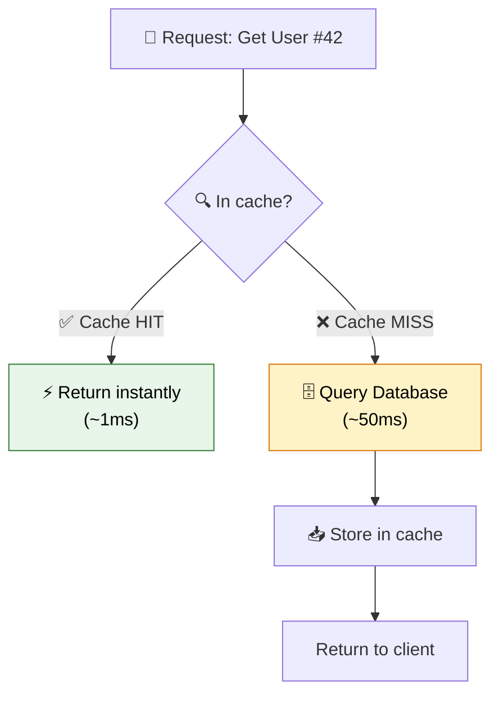
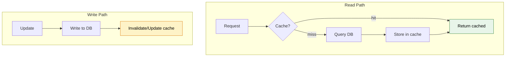

# ⚡ Caching in Spring Boot

> **Speed up your application by storing frequently accessed data in memory — avoid hitting the database for every request.**

---

!!! abstract "Real-World Analogy"
    Think of a **librarian's desk**. Frequently requested books are kept on the desk (cache) instead of walking to the deep shelves (database) every time. If someone asks for a popular book, the librarian grabs it instantly from the desk. Only when the book isn't there (cache miss) do they walk to the shelf.



---

## 🚀 Quick Setup

```xml
<dependency>
    <groupId>org.springframework.boot</groupId>
    <artifactId>spring-boot-starter-cache</artifactId>
</dependency>
```

```java
@SpringBootApplication
@EnableCaching
public class Application { }
```

---

## 🎯 Core Annotations

```java
@Service
public class ProductService {

    // Cache the result — next call with same id skips the method
    @Cacheable(value = "products", key = "#id")
    public Product getById(Long id) {
        log.info("Fetching from DB...");  // Only logged on cache MISS
        return productRepository.findById(id).orElseThrow();
    }

    // Update the cache when data changes
    @CachePut(value = "products", key = "#product.id")
    public Product update(Product product) {
        return productRepository.save(product);
    }

    // Remove from cache when data is deleted
    @CacheEvict(value = "products", key = "#id")
    public void delete(Long id) {
        productRepository.deleteById(id);
    }

    // Clear entire cache
    @CacheEvict(value = "products", allEntries = true)
    public void clearCache() { }
}
```

| Annotation | Purpose | When executed |
|---|---|---|
| `@Cacheable` | Read from cache; if miss → execute method, store result | Before method |
| `@CachePut` | Always execute method, update cache with result | After method |
| `@CacheEvict` | Remove entry from cache | After method |
| `@Caching` | Combine multiple cache operations | — |

---

## 🔧 Cache Providers

### In-Memory (Default — ConcurrentHashMap)

```yaml
# No config needed — Spring Boot uses simple in-memory cache by default
# Good for: development, single-instance apps
# Bad for: production with multiple instances (not shared!)
```

### Caffeine (High-Performance Local Cache)

```xml
<dependency>
    <groupId>com.github.ben-manes.caffeine</groupId>
    <artifactId>caffeine</artifactId>
</dependency>
```

```yaml
spring:
  cache:
    type: caffeine
    caffeine:
      spec: maximumSize=1000,expireAfterWrite=10m
    cache-names: products,users,orders
```

### Redis (Distributed Cache — Production)

```xml
<dependency>
    <groupId>org.springframework.boot</groupId>
    <artifactId>spring-boot-starter-data-redis</artifactId>
</dependency>
```

```yaml
spring:
  cache:
    type: redis
  data:
    redis:
      host: localhost
      port: 6379
      password: secret
```

```java
@Configuration
@EnableCaching
public class RedisConfig {

    @Bean
    public RedisCacheConfiguration cacheConfiguration() {
        return RedisCacheConfiguration.defaultCacheConfig()
            .entryTtl(Duration.ofMinutes(30))
            .serializeValuesWith(
                SerializationPair.fromSerializer(new GenericJackson2JsonRedisSerializer()));
    }

    @Bean
    public RedisCacheManager cacheManager(RedisConnectionFactory factory) {
        Map<String, RedisCacheConfiguration> cacheConfigs = Map.of(
            "products", RedisCacheConfiguration.defaultCacheConfig().entryTtl(Duration.ofHours(1)),
            "users", RedisCacheConfiguration.defaultCacheConfig().entryTtl(Duration.ofMinutes(15))
        );

        return RedisCacheManager.builder(factory)
            .cacheDefaults(cacheConfiguration())
            .withInitialCacheConfigurations(cacheConfigs)
            .build();
    }
}
```

### Comparison

| Provider | Shared? | Speed | TTL Support | Best For |
|---|---|---|---|---|
| ConcurrentHashMap | ❌ | Fastest | ❌ | Dev/testing |
| Caffeine | ❌ | Very fast | ✅ | Single-instance production |
| Redis | ✅ | Fast (network) | ✅ | Multi-instance production |

---

## 📐 Cache Patterns

### Pattern 1: Conditional Caching

```java
// Only cache if result is not null
@Cacheable(value = "products", key = "#id", unless = "#result == null")
public Product getById(Long id) { ... }

// Only cache for certain conditions
@Cacheable(value = "products", key = "#id", condition = "#id > 10")
public Product getById(Long id) { ... }
```

### Pattern 2: Composite Keys

```java
@Cacheable(value = "orders", key = "#userId + '_' + #status")
public List<Order> getUserOrders(Long userId, OrderStatus status) { ... }
```

### Pattern 3: Cache-Aside with TTL + Write-Through



---

## ⚠️ Cache Pitfalls

!!! warning "Common Mistakes"
    - **Cache stampede**: Many requests hit an expired key simultaneously → all query the DB. Fix: use lock-based population or staggered TTLs.
    - **Stale data**: Cache doesn't know about direct DB changes. Fix: proper eviction strategy, reasonable TTL.
    - **Serialization issues**: Objects in Redis must be serializable. Fix: use Jackson serializer, avoid caching entities with lazy-loaded proxies.
    - **Over-caching**: Caching everything wastes memory. Cache only: frequently read, rarely changed, expensive to compute.

---

## 🎯 Interview Questions

??? question "1. Difference between @Cacheable and @CachePut?"
    `@Cacheable` — checks cache first; if found, skips method execution entirely. `@CachePut` — always executes the method and updates the cache with the result. Use `@Cacheable` for reads, `@CachePut` for updates.

??? question "2. How do you handle cache invalidation?"
    Use `@CacheEvict` when data changes (delete/update). Set TTL (time-to-live) for automatic expiry. For event-driven systems, listen for change events and evict affected entries. In distributed systems, use Redis pub/sub for cross-instance invalidation.

??? question "3. Local cache vs distributed cache — when to use each?"
    **Local (Caffeine)**: single instance, ultra-low latency needs, data that's okay to be slightly stale across instances. **Distributed (Redis)**: multiple instances must see same data, large datasets, need cache survival across restarts.

??? question "4. What is cache stampede and how to prevent it?"
    When a popular cache entry expires, hundreds of requests simultaneously hit the DB. Prevention: lock-based cache loading (only one request populates), pre-emptive refresh before expiry, or adding random jitter to TTLs so entries don't all expire simultaneously.

??? question "5. How do you handle cache with @Transactional?"
    By default, `@Cacheable` updates the cache even if the transaction later rolls back (because caching happens outside the TX). Solution: use `@CacheEvict` on rollback, or configure cache operations to execute after transaction commit using `TransactionAwareCacheDecorator`.

