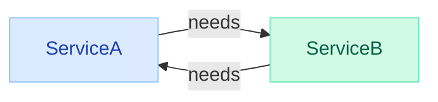
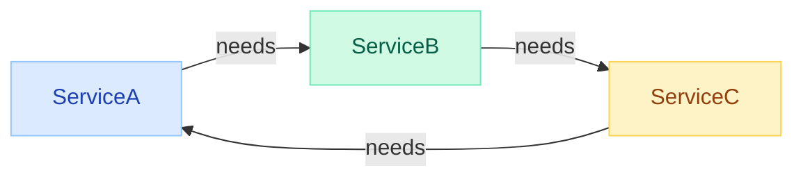
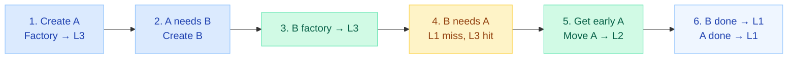
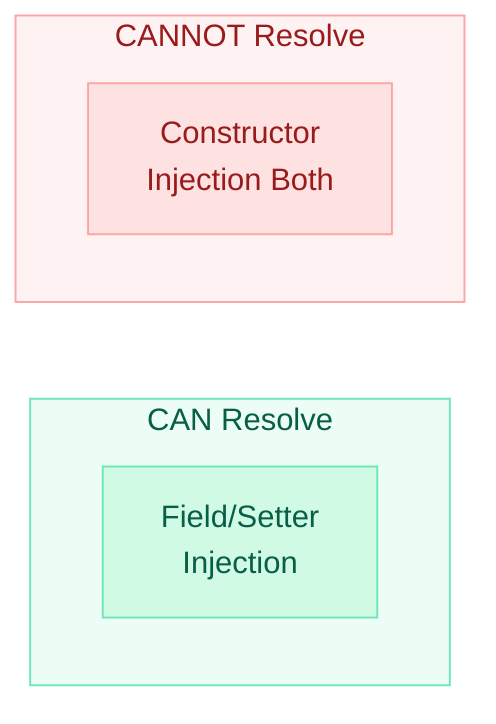
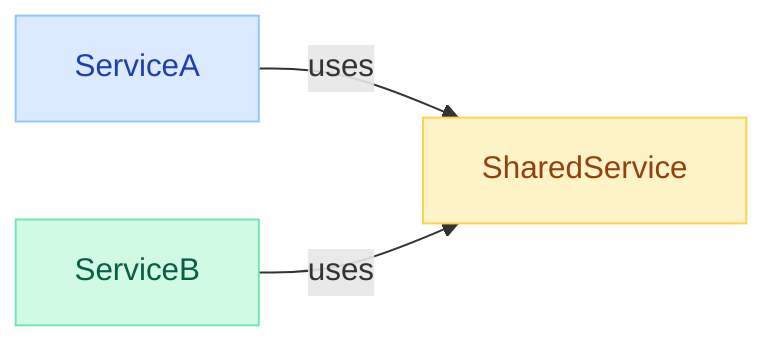
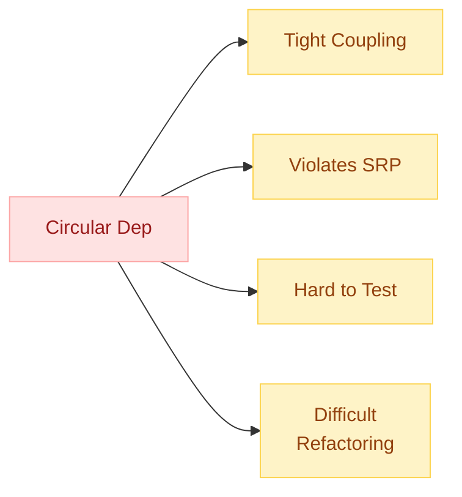

# Circular Dependencies

> **Your app fails to start with `BeanCurrentlyInCreationException` — here is why, how Spring tries to help, and how to fix it properly.**

!!! failure "The Error You See"
    ```
    BeanCurrentlyInCreationException: Error creating bean with name 'serviceA':
    Requested bean is currently in creation: Is there an unresolvable circular reference?
    ```
    This means two or more beans depend on each other, forming a cycle that Spring cannot resolve.

---

## What Is a Circular Dependency?

A circular dependency occurs when Bean A depends on Bean B, and Bean B depends back on Bean A (directly or transitively).



This also applies to longer chains:



---

## How Spring Resolves It — The 3-Level Cache

Spring uses three internal maps (caches) inside `DefaultSingletonBeanRegistry` to break simple circular dependencies:

| Level | Cache Name | Contents |
|-------|-----------|----------|
| 1st | `singletonObjects` | Fully initialized beans |
| 2nd | `earlySingletonObjects` | Partially initialized (deps not injected yet) |
| 3rd | `singletonFactories` | Factory lambdas that produce early references |

### Step-by-Step Resolution



!!! info "Key Insight"
    The 3rd-level cache stores `ObjectFactory` lambdas (not the bean). This allows AOP proxies to be created on demand if another bean needs an early reference.

---

## When Spring CAN vs CANNOT Resolve

| Injection Style | Can Resolve? | Reason |
|----------------|:---:|--------|
| Field injection (`@Autowired` field) | Yes | Bean instantiated first, deps injected later |
| Setter injection | Yes | Bean instantiated first, setter called later |
| Constructor injection (both sides) | **No** | Cannot instantiate A without B, cannot instantiate B without A |
| Constructor on one side, field on other | Yes | The field-injected side can expose an early reference |



---

## Spring Boot 2.6+ Change

!!! warning "Breaking Change in Spring Boot 2.6"
    Starting with Spring Boot 2.6, circular references are **prohibited by default**. Even field-injection cycles that previously worked will now fail at startup.

To temporarily allow them (not recommended long-term):

```yaml
# application.yml
spring:
  main:
    allow-circular-references: true
```

```properties
# application.properties
spring.main.allow-circular-references=true
```

!!! tip "Migration Strategy"
    Use the flag as a temporary measure during migration. The goal should be to eliminate the cycle, not to permanently allow it.

---

## Detection Strategies

### 1. Startup Logs

Spring prints the cycle path in the exception message:

```
The dependencies of some of the beans in the application context form a cycle:

   serviceA (field private ServiceB)
      ↓
   serviceB (field private ServiceA)
```

### 2. BeanCurrentlyInCreationException

This is the definitive signal. The stack trace shows exactly which bean triggered the cycle.

### 3. IDE Inspection

IntelliJ IDEA warns about circular dependencies with a gutter icon when using Spring support.

### 4. ArchUnit Test

```java
@Test
void noCyclicDependencies() {
    slices().matching("com.example.(*)..")
        .should().beFreeOfCycles()
        .check(importedClasses);
}
```

---

## Solutions

### 1. `@Lazy` — Quick Fix

Break the cycle by making one injection lazy. Spring injects a proxy that only resolves the real bean on first use.

```java
@Service
public class ServiceA {
    private final ServiceB serviceB;

    public ServiceA(@Lazy ServiceB serviceB) {
        this.serviceB = serviceB; // proxy, not real bean
    }
}
```

!!! note "When to use"
    Use `@Lazy` for quick unblocking. It hides the cycle but does not fix the design problem.

### 2. Redesign with Events — Best for Decoupling

Replace the direct call with an application event:

```java
@Service
public class OrderService {
    private final ApplicationEventPublisher publisher;

    public OrderService(ApplicationEventPublisher publisher) {
        this.publisher = publisher;
    }

    public void placeOrder(Order order) {
        // ... business logic ...
        publisher.publishEvent(new OrderPlacedEvent(order));
    }
}

@Service
public class NotificationService {
    @EventListener
    public void onOrderPlaced(OrderPlacedEvent event) {
        // send notification — no circular dep
    }
}
```

### 3. Extract Common Interface / Shared Service

If A and B both need shared logic, extract it into a third service C:



### 4. `@PostConstruct` Initialization

Inject one dependency manually after construction:

```java
@Service
public class ServiceA {
    @Autowired
    private ApplicationContext context;
    private ServiceB serviceB;

    @PostConstruct
    void init() {
        this.serviceB = context.getBean(ServiceB.class);
    }
}
```

!!! warning "Downsides"
    This makes the dependency invisible to the constructor, harder to test, and couples to `ApplicationContext`.

### 5. `ObjectProvider` / `Provider<T>`

Defer resolution using Jakarta's `Provider` or Spring's `ObjectProvider`:

```java
@Service
public class ServiceA {
    private final ObjectProvider<ServiceB> serviceBProvider;

    public ServiceA(ObjectProvider<ServiceB> serviceBProvider) {
        this.serviceBProvider = serviceBProvider;
    }

    public void doWork() {
        ServiceB b = serviceBProvider.getObject(); // resolved on demand
        b.process();
    }
}
```

### Solution Comparison

| Solution | Effort | Coupling | Testability | Recommended? |
|----------|:---:|:---:|:---:|:---:|
| `@Lazy` | Low | High | Medium | Temporary |
| Events | Medium | **Low** | **High** | Yes |
| Extract service | Medium | **Low** | **High** | Yes |
| `@PostConstruct` | Low | High | Low | No |
| `ObjectProvider` | Low | Medium | Medium | Acceptable |

---

## Why Circular Dependencies Are a Code Smell



- **Tight Coupling** — Two services become inseparable; change one, break the other.
- **Violates SRP** — If A needs B and B needs A, their responsibilities are likely tangled.
- **Hard to Unit Test** — You cannot instantiate one without mocking the other, creating brittle test setups.
- **Prevents Modularization** — Cannot extract either service into a separate module/library without the other.
- **Hidden Temporal Coupling** — Initialization order becomes fragile and non-deterministic.

!!! success "Rule of Thumb"
    If you find a circular dependency, treat it as a signal to rethink your domain boundaries. The fix is usually to introduce an intermediary (event, interface, or new service) that both sides depend on.

---

## Quick Recall

| Question | Answer |
|----------|--------|
| What exception signals a cycle? | `BeanCurrentlyInCreationException` |
| What are the 3 cache levels? | `singletonObjects`, `earlySingletonObjects`, `singletonFactories` |
| Can constructor injection resolve cycles? | No (both sides) |
| Can field injection resolve cycles? | Yes (Spring exposes early reference) |
| Spring Boot 2.6+ default? | Circular refs disabled |
| Property to re-enable? | `spring.main.allow-circular-references=true` |
| Best long-term fix? | Redesign with events or extract shared service |
| Why is `@Lazy` not ideal? | Hides the design problem, still tightly coupled |

---

## Interview Template

???+ example "Tell me about circular dependencies in Spring"

    **What it is:** Bean A depends on B and B depends on A, forming a cycle that can prevent startup.

    **How Spring handles it:** 3-level singleton cache — stores ObjectFactory in L3, exposes early bean reference in L2, fully-initialized bean in L1. Works for field/setter injection but NOT constructor injection on both sides.

    **Spring Boot 2.6+ change:** Circular refs disabled by default. Must explicitly opt-in with `spring.main.allow-circular-references=true`.

    **Quick fixes:** `@Lazy`, `ObjectProvider`, `@PostConstruct` lookup.

    **Proper fixes:** Decouple with application events, extract shared logic into a new service, or use interfaces to invert the dependency direction.

    **Why it matters:** Circular deps signal tight coupling, SRP violations, and make testing/refactoring difficult.
