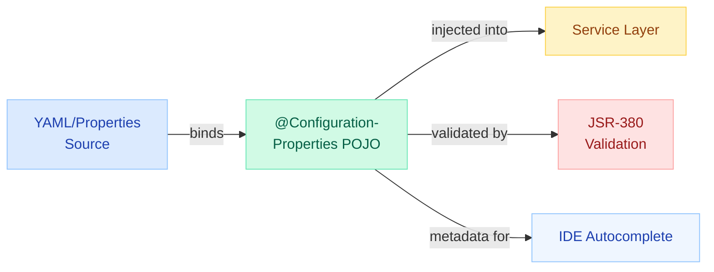
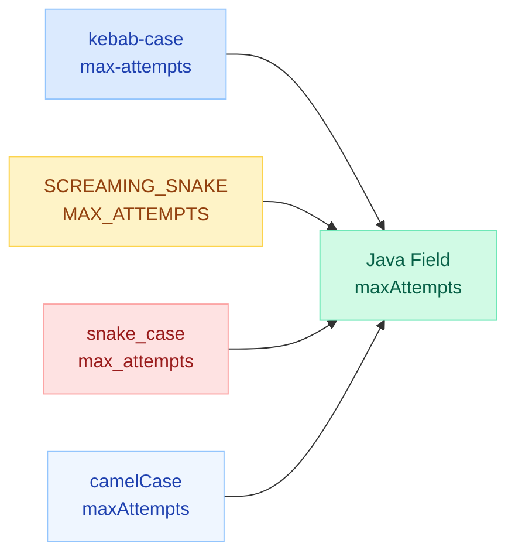
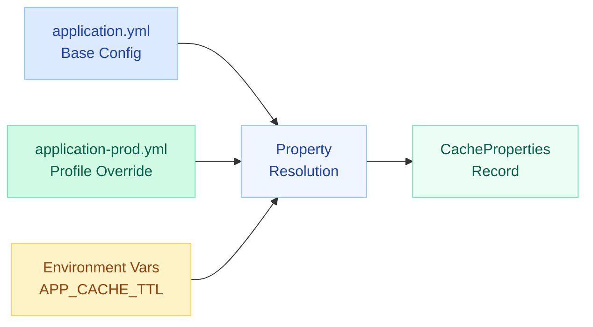
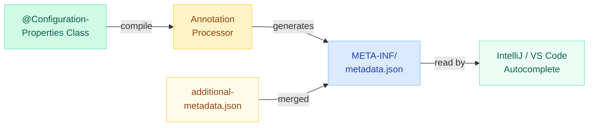

# @ConfigurationProperties

> Type-safe, validated, IDE-friendly configuration binding. The cleanest way to externalize and structure application settings in Spring Boot.

---

!!! danger "Silent Failures in Production"
    A typo in YAML (`app.retyr.max-attempts` instead of `app.retry.max-attempts`) is **silently ignored**. Spring does not error on unrecognized keys. The property class keeps its default value, and your production service quietly runs with unintended config. `@Validated` and the configuration processor are your safety nets.



---

## @ConfigurationProperties vs @Value

| Dimension | @ConfigurationProperties | @Value |
|-----------|--------------------------|--------|
| **Binding** | Entire prefix to a POJO | Single property to a field |
| **Type Safety** | Full (nested objects, lists, maps) | Limited (String, basic types) |
| **Relaxed Binding** | Yes (camelCase, kebab, SCREAMING_SNAKE) | No (exact key match) |
| **Validation** | @Validated + JSR-380 | No built-in validation |
| **SpEL Support** | No | Yes (`#{...}`) |
| **IDE Autocomplete** | Yes (with processor) | No |
| **Immutability** | Constructor binding / records | Only with `final` + SpEL |
| **Meta-documentation** | JSON metadata for tooling | None |
| **Best For** | Structured, multi-property config | One-off values, SpEL expressions |

!!! tip "Rule of Thumb"
    Use `@ConfigurationProperties` for anything with more than 2 related keys. Use `@Value` only for one-off values or when you need SpEL expressions.

---

## Setup

### Basic Declaration

```java
@ConfigurationProperties(prefix = "app.mail")
public class MailProperties {

    private String host = "smtp.example.com";
    private int port = 587;
    private boolean starttls = true;

    // getters and setters
}
```

### Enabling: Three Approaches

=== "@EnableConfigurationProperties"

    ```java
    @SpringBootApplication
    @EnableConfigurationProperties(MailProperties.class)
    public class Application { }
    ```

    Explicitly registers the properties class as a bean. Good for libraries and starters.

=== "@ConfigurationPropertiesScan"

    ```java
    @SpringBootApplication
    @ConfigurationPropertiesScan("com.example.config")
    public class Application { }
    ```

    Scans the package for all `@ConfigurationProperties` classes. Good for applications with many config classes.

=== "@Component on the properties class"

    ```java
    @Component
    @ConfigurationProperties(prefix = "app.mail")
    public class MailProperties { /* ... */ }
    ```

    Works but couples the config class to component scanning. Least recommended.

---

## Relaxed Binding

Spring Boot maps multiple naming conventions to the same property. All of these bind to `maxAttempts`:

| Format | Example | Where Used |
|--------|---------|------------|
| **camelCase** | `app.retry.maxAttempts` | Java field name |
| **kebab-case** | `app.retry.max-attempts` | YAML / properties (recommended) |
| **snake_case** | `app.retry.max_attempts` | YAML / properties |
| **SCREAMING_SNAKE** | `APP_RETRY_MAX_ATTEMPTS` | Environment variables |



!!! warning "Environment Variable Rules"
    For env vars, replace dots with underscores and use uppercase: `app.mail.smtp-host` becomes `APP_MAIL_SMTP_HOST`. List indices use underscores: `app.servers[0].host` becomes `APP_SERVERS_0_HOST`.

---

## Nested Objects, Lists, and Maps

### Nested Objects

```java
@ConfigurationProperties(prefix = "app")
public class AppProperties {

    private final Server server = new Server();
    private final Security security = new Security();

    public static class Server {
        private String host = "localhost";
        private int port = 8080;
        private Duration timeout = Duration.ofSeconds(30);
        // getters and setters
    }

    public static class Security {
        private boolean enabled = true;
        private String tokenSecret;
        private Duration tokenExpiry = Duration.ofHours(1);
        // getters and setters
    }

    // getters
}
```

```yaml
app:
  server:
    host: api.example.com
    port: 9090
    timeout: 45s
  security:
    enabled: true
    token-secret: ${TOKEN_SECRET}
    token-expiry: 2h
```

### Lists

```java
@ConfigurationProperties(prefix = "app")
public class AppProperties {

    private List<String> corsOrigins = new ArrayList<>();
    private List<ServerConfig> servers = new ArrayList<>();

    public static class ServerConfig {
        private String host;
        private int port;
        private int weight = 1;
        // getters and setters
    }

    // getters and setters
}
```

```yaml
app:
  cors-origins:
    - https://frontend.example.com
    - https://admin.example.com
  servers:
    - host: node1.example.com
      port: 8080
      weight: 3
    - host: node2.example.com
      port: 8080
      weight: 1
```

### Maps

```java
@ConfigurationProperties(prefix = "app")
public class AppProperties {

    private Map<String, String> labels = new LinkedHashMap<>();
    private Map<String, DataSourceConfig> datasources = new LinkedHashMap<>();

    public static class DataSourceConfig {
        private String url;
        private String username;
        private String password;
        private int maxPool = 10;
        // getters and setters
    }

    // getters and setters
}
```

```yaml
app:
  labels:
    environment: production
    region: us-east-1
    team: platform
  datasources:
    primary:
      url: jdbc:postgresql://primary:5432/app
      username: app_user
      password: ${DB_PRIMARY_PASSWORD}
      max-pool: 20
    analytics:
      url: jdbc:postgresql://analytics:5432/reports
      username: readonly
      password: ${DB_ANALYTICS_PASSWORD}
      max-pool: 5
```

---

## Validation with @Validated

Add `@Validated` to the properties class to trigger JSR-380 (Bean Validation) at startup. Invalid config fails fast with a clear error.

```java
@ConfigurationProperties(prefix = "app.mail")
@Validated
public class MailProperties {

    @NotBlank(message = "Mail host must be configured")
    private String host;

    @Min(1) @Max(65535)
    private int port = 587;

    @NotEmpty
    private List<@Email String> recipients;

    @DurationUnit(ChronoUnit.SECONDS)
    @Min(1) @Max(300)
    private Duration connectionTimeout = Duration.ofSeconds(10);

    @Valid  // triggers validation on nested object
    private Retry retry = new Retry();

    public static class Retry {
        @Min(1) @Max(10)
        private int maxAttempts = 3;

        @NotNull
        private Duration backoff = Duration.ofMillis(500);

        // getters and setters
    }

    // getters and setters
}
```

!!! note "Startup Failure Example"
    If `app.mail.host` is missing:
    ```
    ***************************
    APPLICATION FAILED TO START
    ***************************

    Description:
    Binding to target com.example.MailProperties failed:

        Property: app.mail.host
        Value: null
        Reason: Mail host must be configured
    ```

---

## Constructor Binding (Immutable Config)

Since Spring Boot 2.2, use `@ConstructorBinding` for immutable properties. Since Boot 3.0, constructor binding is the default when a single constructor exists.

### With a Class

```java
@ConfigurationProperties(prefix = "app.retry")
public class RetryProperties {

    private final int maxAttempts;
    private final Duration backoff;
    private final boolean exponential;

    public RetryProperties(
            @DefaultValue("3") int maxAttempts,
            @DefaultValue("500ms") Duration backoff,
            @DefaultValue("true") boolean exponential) {
        this.maxAttempts = maxAttempts;
        this.backoff = backoff;
        this.exponential = exponential;
    }

    public int getMaxAttempts() { return maxAttempts; }
    public Duration getBackoff() { return backoff; }
    public boolean isExponential() { return exponential; }
}
```

### With a Java Record (Recommended for Boot 3+)

```java
@ConfigurationProperties(prefix = "app.retry")
@Validated
public record RetryProperties(
    @DefaultValue("3") @Min(1) @Max(10) int maxAttempts,
    @DefaultValue("500ms") Duration backoff,
    @DefaultValue("true") boolean exponential
) {}
```

```java
@ConfigurationProperties(prefix = "app.cache")
public record CacheProperties(
    @DefaultValue("true") boolean enabled,
    @DefaultValue("60s") Duration ttl,
    @DefaultValue("1000") int maxSize,
    @DefaultValue("CAFFEINE") CacheType type
) {
    enum CacheType { CAFFEINE, REDIS, HAZELCAST }
}
```

Records are immutable, have no setters, and map naturally to configuration. This is the idiomatic Boot 3+ approach.

---

## Default Values and Optional Properties

### @DefaultValue Annotation

Used with constructor binding to provide fallback values.

```java
@ConfigurationProperties(prefix = "app.http")
public record HttpClientProperties(
    @DefaultValue("5s") Duration connectTimeout,
    @DefaultValue("30s") Duration readTimeout,
    @DefaultValue("20") int maxConnections,
    @DefaultValue("true") boolean followRedirects,
    @DefaultValue("") String proxyHost  // empty = no proxy
) {}
```

### Optional Fields (Setter Binding)

```java
@ConfigurationProperties(prefix = "app.feature")
public class FeatureProperties {

    private boolean darkMode = false;           // default in field
    private String bannerMessage;               // null if not configured
    private Duration sessionTimeout = Duration.ofMinutes(30);
    private Optional<String> customLogo = Optional.empty();

    // getters and setters
}
```

!!! info "Null vs Default"
    With setter binding, unset properties remain at their Java defaults (`null` for objects, `0` for ints, `false` for booleans). Use field initializers to set meaningful defaults. With constructor binding, use `@DefaultValue`.

---

## Profile-Specific Properties

Combine `@ConfigurationProperties` with Spring profiles for environment-specific config.

```yaml
# application.yml
app:
  cache:
    enabled: true
    ttl: 60s
    max-size: 500
---
spring:
  config:
    activate:
      on-profile: dev
app:
  cache:
    enabled: false
---
spring:
  config:
    activate:
      on-profile: prod
app:
  cache:
    ttl: 300s
    max-size: 10000
```

The properties POJO does not change. Spring resolves the active profile and binds the correct values automatically.



---

## Custom Starter with Configuration Metadata

When building a shared library or Spring Boot starter, provide metadata so users get autocomplete and documentation.

### Step 1: Properties Class

```java
@ConfigurationProperties(prefix = "acme.sdk")
@Validated
public record AcmeSdkProperties(
    @NotBlank @DefaultValue("https://api.acme.com") String baseUrl,
    @NotBlank String apiKey,
    @DefaultValue("5s") Duration timeout,
    @DefaultValue("3") @Min(1) int maxRetries
) {}
```

### Step 2: Auto-Configuration

```java
@AutoConfiguration
@EnableConfigurationProperties(AcmeSdkProperties.class)
@ConditionalOnClass(AcmeClient.class)
public class AcmeSdkAutoConfiguration {

    @Bean
    @ConditionalOnMissingBean
    public AcmeClient acmeClient(AcmeSdkProperties props) {
        return AcmeClient.builder()
            .baseUrl(props.baseUrl())
            .apiKey(props.apiKey())
            .timeout(props.timeout())
            .maxRetries(props.maxRetries())
            .build();
    }
}
```

### Step 3: additional-spring-configuration-metadata.json

Place in `src/main/resources/META-INF/`:

```json
{
  "properties": [
    {
      "name": "acme.sdk.api-key",
      "type": "java.lang.String",
      "description": "API key for authenticating with the Acme service.",
      "sourceType": "com.acme.AcmeSdkProperties"
    },
    {
      "name": "acme.sdk.base-url",
      "type": "java.lang.String",
      "description": "Base URL of the Acme API endpoint.",
      "defaultValue": "https://api.acme.com"
    }
  ],
  "hints": [
    {
      "name": "acme.sdk.base-url",
      "values": [
        { "value": "https://api.acme.com", "description": "Production" },
        { "value": "https://sandbox.acme.com", "description": "Sandbox" }
      ]
    }
  ]
}
```

### Step 4: Register the Auto-Configuration

`src/main/resources/META-INF/spring/org.springframework.boot.autoconfigure.AutoConfiguration.imports`:

```
com.acme.autoconfigure.AcmeSdkAutoConfiguration
```

---

## IDE Autocomplete with spring-boot-configuration-processor

The annotation processor generates `META-INF/spring-configuration-metadata.json` at compile time. This powers IDE autocomplete, hover docs, and validation.

### Maven Setup

```xml
<dependency>
    <groupId>org.springframework.boot</groupId>
    <artifactId>spring-boot-configuration-processor</artifactId>
    <optional>true</optional>
</dependency>
```

### Gradle Setup

```kotlin
annotationProcessor("org.springframework.boot:spring-boot-configuration-processor")
```

### What Gets Generated

After compilation, `target/classes/META-INF/spring-configuration-metadata.json` contains:

```json
{
  "groups": [
    {
      "name": "app.mail",
      "type": "com.example.MailProperties",
      "sourceType": "com.example.MailProperties"
    }
  ],
  "properties": [
    {
      "name": "app.mail.host",
      "type": "java.lang.String",
      "sourceType": "com.example.MailProperties",
      "defaultValue": "smtp.example.com"
    },
    {
      "name": "app.mail.port",
      "type": "java.lang.Integer",
      "sourceType": "com.example.MailProperties",
      "defaultValue": 587
    }
  ]
}
```



!!! tip "IntelliJ Tip"
    After adding the processor, rebuild the project (`Ctrl+F9`). IntelliJ immediately picks up the generated metadata and offers autocomplete in `application.yml` for your custom properties.

---

## Quick Recall

| Concept | Key Point |
|---------|-----------|
| **Prefix binding** | `@ConfigurationProperties(prefix = "app.x")` binds all `app.x.*` keys |
| **Enabling** | `@EnableConfigurationProperties` or `@ConfigurationPropertiesScan` |
| **Relaxed binding** | `maxAttempts` = `max-attempts` = `MAX_ATTEMPTS` |
| **Validation** | `@Validated` + JSR-380 annotations; fails fast at startup |
| **Immutability** | Constructor binding or Java records (Boot 3+ default) |
| **Defaults** | `@DefaultValue("x")` for constructor binding; field initializers for setters |
| **Nested** | Inner static classes; use `@Valid` to cascade validation |
| **Lists** | `List<T>` with indexed YAML; env vars use `_0_`, `_1_` |
| **Maps** | `Map<String, T>` with YAML map keys as map entries |
| **Metadata** | `spring-boot-configuration-processor` generates IDE autocomplete |
| **Additional metadata** | `additional-spring-configuration-metadata.json` for hints/docs |
| **Profile interaction** | Same POJO, different values per profile; no code change needed |
| **Silent failure risk** | Typo in YAML key = silently ignored; always use `@Validated` |

---

## Interview Answer Template

!!! tip "Interview Question: How does @ConfigurationProperties work and why use it over @Value?"

    **1. What it does:** Binds an entire configuration prefix (`app.mail.*`) to a type-safe Java object. Spring Boot resolves values from YAML, properties files, environment variables, and command-line args using relaxed binding rules.

    **2. Why over @Value:**

    - Type safety: nested objects, lists, maps — not just strings
    - Validation: `@Validated` + JSR-380 catches misconfig at startup
    - IDE support: annotation processor generates metadata for autocomplete
    - Testability: inject the POJO, mock it, or construct it directly
    - Relaxed binding: handles kebab-case, env vars automatically

    **3. Immutability:** Use Java records with `@DefaultValue` for constructor binding. No setters, thread-safe, clean.

    **4. Production pattern:** Always add `@Validated`, always add the configuration processor, always document via `additional-spring-configuration-metadata.json` in starters.

!!! tip "Follow-up: What happens if you misspell a YAML key?"

    Spring Boot silently ignores unknown keys. The property class uses its default value. This is the most common source of "works in dev, wrong in prod" config bugs. Mitigation:

    1. `@Validated` with `@NotNull`/`@NotBlank` — catches missing required values
    2. Configuration processor — IDE warns on unknown keys
    3. Startup banner log — Spring logs `The following properties were supplied but could not be bound` if fail-on-unknown is enabled
    4. Integration tests — bind from test YAML and assert values

!!! tip "Follow-up: Constructor binding vs setter binding?"

    | Aspect | Constructor | Setter |
    |--------|------------|--------|
    | Mutability | Immutable | Mutable |
    | Thread safety | Inherently safe | Needs care |
    | Defaults | `@DefaultValue` | Field initializers |
    | Java records | Natural fit | Not applicable |
    | Partial binding | All-or-nothing | Individual fields |
    | Spring Boot 3 | Default (single constructor) | Explicit `@Bean` needed |

    Prefer constructor binding (records) for new code. Use setter binding only when you need partial/dynamic updates.
