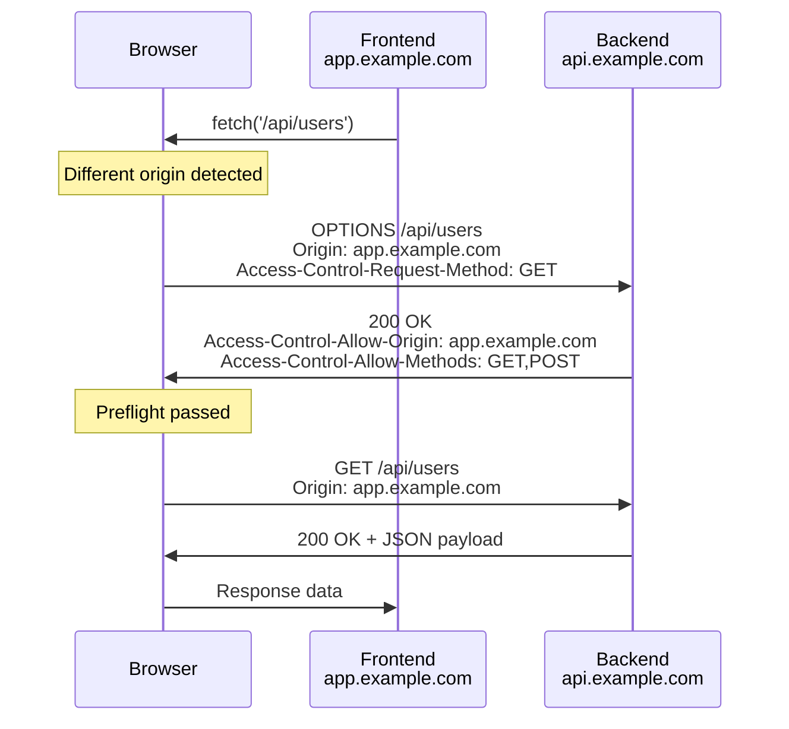
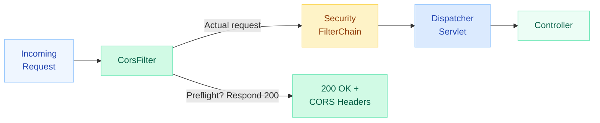
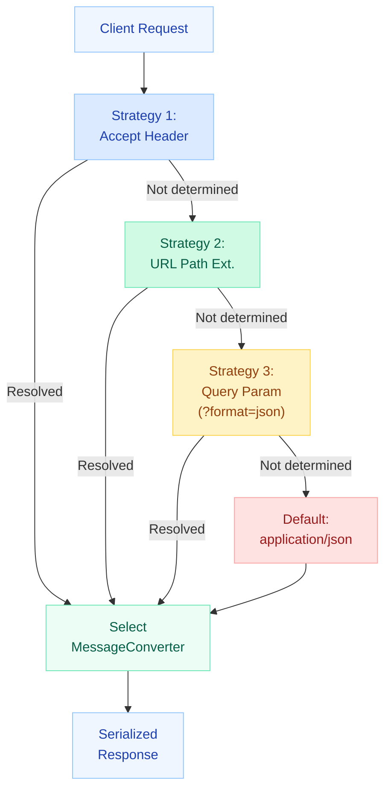
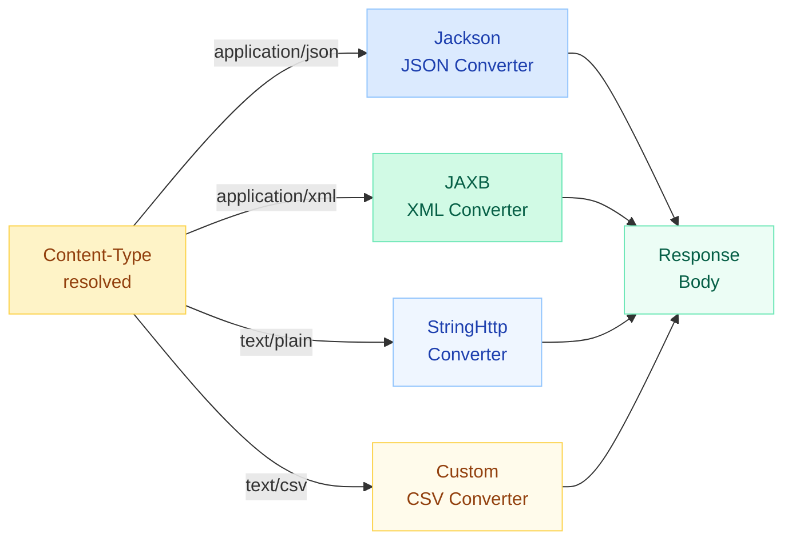

# CORS Configuration & Content Negotiation

> **Two things that seem trivial until they silently break your entire frontend-backend integration: CORS and content type resolution.**

---

!!! danger "Real-World Incident: Frontend Team Blocked 2 Days"
    A backend team deployed a new API without configuring CORS preflight handling. The browser sent `OPTIONS` requests that returned `403 Forbidden` because Spring Security intercepted them before the CORS filter. The frontend team spent **2 full days** debugging "Network Error" messages in Axios, assuming it was their code. Fix: register `CorsFilter` as a bean **before** the `SecurityFilterChain` so preflight requests bypass authentication entirely.

---

## CORS (Cross-Origin Resource Sharing)

### What Is CORS?

Browsers enforce the **Same-Origin Policy**: JavaScript on `app.example.com` cannot call `api.example.com` unless the server explicitly allows it via CORS headers.



!!! info "When Does Preflight Happen?"
    Browsers send a preflight `OPTIONS` request when:

    - Method is anything other than `GET`, `HEAD`, or `POST`
    - `POST` with `Content-Type` other than `application/x-www-form-urlencoded`, `multipart/form-data`, or `text/plain`
    - Custom headers are included (e.g., `Authorization`, `X-Request-Id`)

---

### @CrossOrigin Annotation

The quickest way to enable CORS for a specific endpoint or controller.

=== "Method-Level"

    ```java
    @RestController
    @RequestMapping("/api/users")
    public class UserController {

        @CrossOrigin(origins = "https://app.example.com")
        @GetMapping("/{id}")
        public User getUser(@PathVariable Long id) {
            return userService.findById(id);
        }
    }
    ```

=== "Class-Level"

    ```java
    @CrossOrigin(
        origins = {"https://app.example.com", "https://admin.example.com"},
        methods = {RequestMethod.GET, RequestMethod.POST, RequestMethod.PUT},
        allowedHeaders = {"Authorization", "Content-Type"},
        exposedHeaders = {"X-Total-Count"},
        allowCredentials = "true",
        maxAge = 3600
    )
    @RestController
    @RequestMapping("/api/orders")
    public class OrderController {
        // All endpoints inherit CORS config
    }
    ```

!!! warning "Limitation"
    `@CrossOrigin` is fine for a few controllers. For 50+ endpoints, use global configuration.

---

### Global CORS via WebMvcConfigurer

```java
@Configuration
public class WebConfig implements WebMvcConfigurer {

    @Override
    public void addCorsMappings(CorsRegistry registry) {
        registry.addMapping("/api/**")
            .allowedOrigins("https://app.example.com", "https://admin.example.com")
            .allowedMethods("GET", "POST", "PUT", "DELETE", "PATCH")
            .allowedHeaders("*")
            .exposedHeaders("X-Total-Count", "X-Page-Number")
            .allowCredentials(true)
            .maxAge(3600);

        // Separate config for public endpoints
        registry.addMapping("/public/**")
            .allowedOrigins("*")
            .allowedMethods("GET")
            .maxAge(86400);
    }
}
```

---

### CorsFilter for Spring Security Integration

!!! danger "Critical: CorsFilter Must Come Before SecurityFilterChain"
    If Spring Security processes the preflight `OPTIONS` request first, it rejects it with `401/403` because there's no `Authorization` header on preflight requests. The `CorsFilter` must intercept first.



```java
@Configuration
@EnableWebSecurity
public class SecurityConfig {

    @Bean
    public SecurityFilterChain filterChain(HttpSecurity http) throws Exception {
        http
            // Enable CORS with the bean defined below
            .cors(cors -> cors.configurationSource(corsConfigurationSource()))
            .authorizeHttpRequests(auth -> auth
                .requestMatchers("/public/**").permitAll()
                .anyRequest().authenticated()
            );
        return http.build();
    }

    @Bean
    public CorsConfigurationSource corsConfigurationSource() {
        CorsConfiguration config = new CorsConfiguration();
        config.setAllowedOrigins(List.of(
            "https://app.example.com",
            "https://admin.example.com"
        ));
        config.setAllowedMethods(List.of("GET", "POST", "PUT", "DELETE", "PATCH", "OPTIONS"));
        config.setAllowedHeaders(List.of("*"));
        config.setExposedHeaders(List.of("X-Total-Count"));
        config.setAllowCredentials(true);
        config.setMaxAge(3600L);

        UrlBasedCorsConfigurationSource source = new UrlBasedCorsConfigurationSource();
        source.registerCorsConfiguration("/api/**", config);
        return source;
    }
}
```

---

### CORS Configuration Properties

| Property | Description | Example |
|----------|-------------|---------|
| `allowedOrigins` | Origins permitted to access | `https://app.example.com` |
| `allowedMethods` | HTTP methods allowed | `GET, POST, PUT, DELETE` |
| `allowedHeaders` | Request headers client can send | `Authorization, Content-Type` |
| `exposedHeaders` | Response headers client can read | `X-Total-Count` |
| `allowCredentials` | Allow cookies/auth headers | `true` |
| `maxAge` | Preflight cache duration (seconds) | `3600` |

---

### Common CORS Mistakes

!!! failure "Mistake 1: Wildcard + Credentials"
    ```java
    // THIS WILL FAIL at runtime
    config.setAllowedOrigins(List.of("*"));
    config.setAllowCredentials(true);
    ```
    Browsers reject `Access-Control-Allow-Origin: *` when credentials are included. Use `allowedOriginPatterns("*")` instead, or list explicit origins.

!!! failure "Mistake 2: Forgetting OPTIONS in Security"
    ```java
    // OPTIONS never reaches the CORS filter
    http.authorizeHttpRequests(auth -> auth
        .anyRequest().authenticated()  // blocks OPTIONS too!
    );
    ```
    Fix: either use `.cors()` on `HttpSecurity` (which auto-permits OPTIONS), or explicitly:
    ```java
    .requestMatchers(HttpMethod.OPTIONS, "/**").permitAll()
    ```

!!! failure "Mistake 3: CORS on Gateway vs Downstream"
    In a microservice setup, configure CORS **only at the API Gateway**. If both gateway and downstream service add CORS headers, the browser sees duplicate headers and rejects the response.

---

## Content Negotiation

### How Spring Resolves Response Format

When a client sends a request, Spring must decide **which format** to serialize the response into. It uses a strategy chain:



| Strategy | How It Works | Example |
|----------|-------------|---------|
| **Accept Header** | Client sends `Accept: application/xml` | Most RESTful approach |
| **URL Path Extension** | `/api/users.json` or `/api/users.xml` | Deprecated in Spring 5.3+ |
| **Query Parameter** | `/api/users?format=xml` | Good for browser testing |
| **Default** | Falls back to configured default | Usually `application/json` |

---

### ContentNegotiationConfigurer

```java
@Configuration
public class WebConfig implements WebMvcConfigurer {

    @Override
    public void configureContentNegotiation(ContentNegotiationConfigurer configurer) {
        configurer
            // Honor the Accept header
            .favorParameter(true)           // Enable ?format=json
            .parameterName("format")
            .ignoreAcceptHeader(false)
            // Default to JSON if nothing specified
            .defaultContentType(MediaType.APPLICATION_JSON)
            // Map format parameter values to media types
            .mediaType("json", MediaType.APPLICATION_JSON)
            .mediaType("xml", MediaType.APPLICATION_XML)
            .mediaType("csv", MediaType.valueOf("text/csv"));
    }
}
```

!!! note "Path Extension Deprecated"
    Since Spring 5.3, path extension negotiation (`.json`, `.xml`) is disabled by default due to security concerns (RFD attacks). Use `Accept` header or query parameter instead.

---

### Producing Specific Media Types

Use `produces` in `@RequestMapping` to restrict what formats an endpoint can return:

```java
@RestController
@RequestMapping("/api/reports")
public class ReportController {

    // Only returns JSON
    @GetMapping(value = "/{id}", produces = MediaType.APPLICATION_JSON_VALUE)
    public Report getReportJson(@PathVariable Long id) {
        return reportService.findById(id);
    }

    // Only returns XML
    @GetMapping(value = "/{id}", produces = MediaType.APPLICATION_XML_VALUE)
    public Report getReportXml(@PathVariable Long id) {
        return reportService.findById(id);
    }

    // Returns CSV (custom media type)
    @GetMapping(value = "/{id}/export", produces = "text/csv")
    public ResponseEntity<String> exportCsv(@PathVariable Long id) {
        String csv = reportService.toCsv(id);
        return ResponseEntity.ok()
            .header(HttpHeaders.CONTENT_DISPOSITION, "attachment; filename=report.csv")
            .body(csv);
    }
}
```

!!! tip "`consumes` works for request body"
    ```java
    @PostMapping(consumes = MediaType.APPLICATION_JSON_VALUE, 
                 produces = MediaType.APPLICATION_JSON_VALUE)
    public User createUser(@RequestBody User user) { ... }
    ```

---

### HttpMessageConverter Selection

Spring uses `HttpMessageConverter` implementations to serialize/deserialize request/response bodies. The converter is selected based on the **media type** resolved by content negotiation.



**Built-in Converters (ordered by priority):**

| Converter | Media Type | Library |
|-----------|-----------|---------|
| `MappingJackson2HttpMessageConverter` | `application/json` | Jackson |
| `Jaxb2RootElementHttpMessageConverter` | `application/xml` | JAXB |
| `StringHttpMessageConverter` | `text/plain` | Built-in |
| `ByteArrayHttpMessageConverter` | `application/octet-stream` | Built-in |
| `FormHttpMessageConverter` | `application/x-www-form-urlencoded` | Built-in |

---

### Custom MediaType & MessageConverter

```java
// 1. Define a custom media type
public class CustomMediaTypes {
    public static final String CSV_VALUE = "text/csv";
    public static final MediaType CSV = MediaType.valueOf(CSV_VALUE);
}

// 2. Implement a custom converter
public class CsvHttpMessageConverter extends AbstractHttpMessageConverter<List<?>> {

    public CsvHttpMessageConverter() {
        super(CustomMediaTypes.CSV);
    }

    @Override
    protected boolean supports(Class<?> clazz) {
        return List.class.isAssignableFrom(clazz);
    }

    @Override
    protected List<?> readInternal(Class<? extends List<?>> clazz,
                                    HttpInputMessage inputMessage) {
        // Parse CSV to list of objects
        throw new UnsupportedOperationException("CSV read not supported");
    }

    @Override
    protected void writeInternal(List<?> objects,
                                  HttpOutputMessage outputMessage) throws IOException {
        OutputStreamWriter writer = new OutputStreamWriter(outputMessage.getBody());
        // Write header row
        // Write data rows using reflection or known structure
        for (Object obj : objects) {
            writer.write(toCsvRow(obj));
            writer.write("\n");
        }
        writer.flush();
    }

    private String toCsvRow(Object obj) {
        // Convert object fields to CSV row
        return obj.toString(); // simplified
    }
}

// 3. Register the converter
@Configuration
public class WebConfig implements WebMvcConfigurer {

    @Override
    public void extendMessageConverters(List<HttpMessageConverter<?>> converters) {
        converters.add(new CsvHttpMessageConverter());
    }
}
```

!!! tip "Use `extendMessageConverters` vs `configureMessageConverters`"
    - `extendMessageConverters()` — adds to defaults (preferred)
    - `configureMessageConverters()` — replaces all defaults (dangerous)

---

## Quick Recall

| Topic | Key Point |
|-------|-----------|
| Same-Origin Policy | Browser blocks cross-origin XHR/fetch unless server opts in |
| Preflight | `OPTIONS` request sent before non-simple requests |
| `@CrossOrigin` | Per-controller/method CORS config |
| `WebMvcConfigurer.addCorsMappings()` | Global CORS for all endpoints |
| `CorsFilter` + Security | Must be registered **before** `SecurityFilterChain` |
| Wildcard + Credentials | `*` origin forbidden when `allowCredentials=true` |
| Content Negotiation Order | Accept header > parameter > path extension > default |
| `produces` | Restricts which media types an endpoint can return |
| `HttpMessageConverter` | Pluggable serializers selected by resolved media type |
| `extendMessageConverters()` | Adds converters without replacing defaults |

---

## Interview Template

???+ example "Tell me about CORS in Spring Boot"
    **Situation:** Our frontend (React on `app.example.com`) could not call our Spring Boot API (`api.example.com`). Browser showed CORS errors, and the team wasted 2 days thinking it was a frontend issue.

    **Task:** Configure server-side CORS to allow the frontend origin while maintaining security.

    **Action:**
    
    1. Identified that preflight `OPTIONS` requests were being blocked by Spring Security (401).
    2. Registered a `CorsConfigurationSource` bean with explicit allowed origins, methods, and headers.
    3. Enabled `.cors()` on `HttpSecurity` so Spring Security auto-permits `OPTIONS` requests.
    4. Set `maxAge=3600` to cache preflight responses and reduce round-trips.
    5. For production: listed explicit origins instead of wildcard patterns.

    **Result:** CORS errors resolved immediately. Frontend-backend integration unblocked. Added integration test using `MockMvc` to verify CORS headers on every PR.

???+ example "How does Spring decide JSON vs XML response?"
    **Situation:** A partner team needed XML responses from our existing JSON API for legacy system integration.

    **Task:** Support both JSON and XML from the same endpoints without duplicating code.

    **Action:**
    
    1. Added `jackson-dataformat-xml` dependency for XML serialization.
    2. Configured `ContentNegotiationConfigurer` to honor `Accept` header and `?format=` param.
    3. Used `produces` on endpoints that should only return one format.
    4. Verified with `Accept: application/xml` header in integration tests.

    **Result:** Same controller code serves both JSON and XML. Partner team integrated within a day. No code duplication needed.
