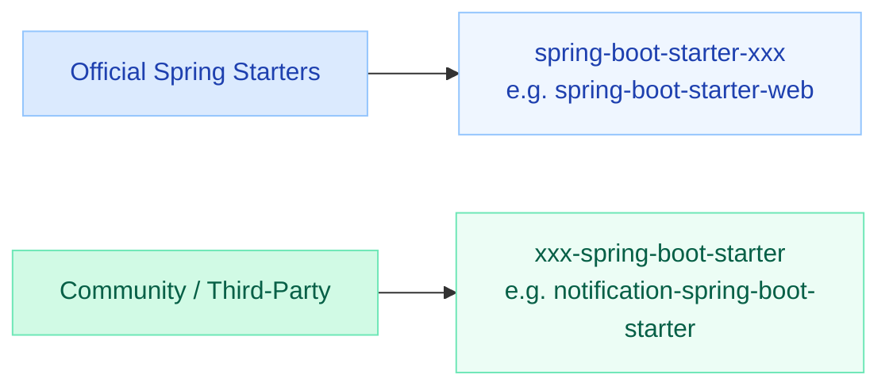
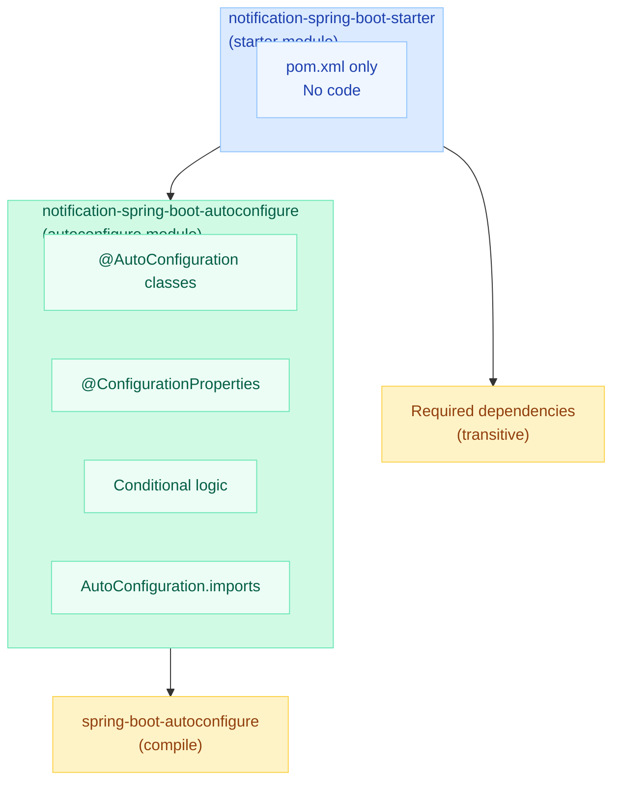
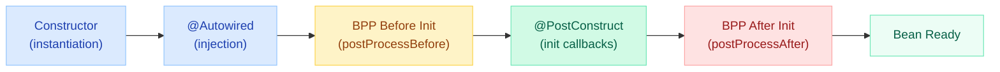
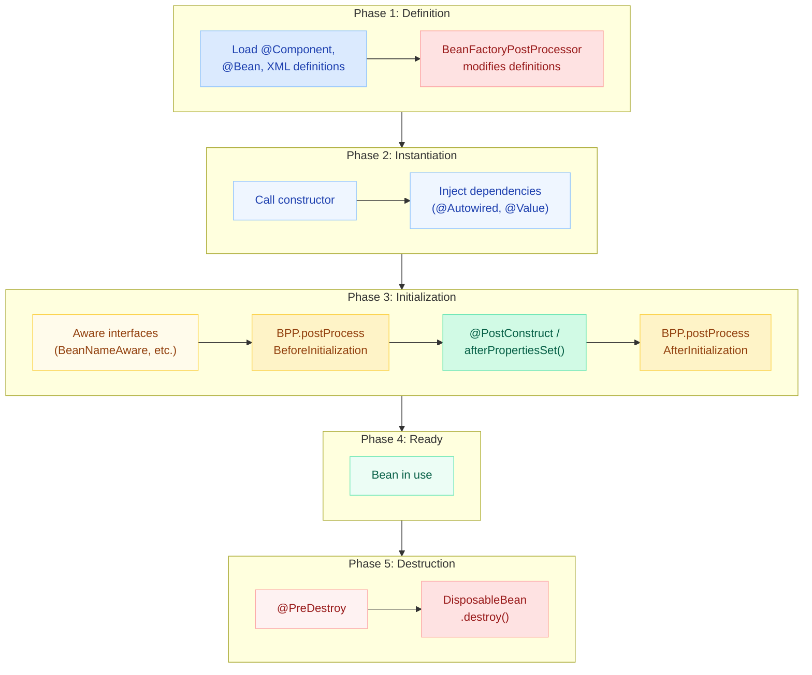

# Custom Starters, BeanPostProcessor & BeanFactoryPostProcessor

> **Your team is spending weeks writing boilerplate config for each microservice — the same DataSource setup, the same metrics wiring, the same notification client. Custom starters eliminate this entirely: write once, auto-configure everywhere.**

---

!!! abstract "Why This Matters"
    In a 50-service organization, a custom starter can save **hundreds of hours** per year. Instead of copy-pasting configuration classes across repos, you package them as a starter JAR that auto-configures itself when dropped onto the classpath. Understanding BeanPostProcessor and BeanFactoryPostProcessor is the key to making this work — they are the extension points that Spring itself uses internally.

---

## Custom Starter Creation

### Naming Convention



| Convention | Pattern | Example |
|-----------|---------|---------|
| **Official** (Spring team) | `spring-boot-starter-{name}` | `spring-boot-starter-data-jpa` |
| **Community** (you) | `{name}-spring-boot-starter` | `notification-spring-boot-starter` |

!!! warning "Never use the `spring-boot-starter-` prefix"
    The `spring-boot-starter-` prefix is reserved for official Spring starters. Using it for your custom starter will confuse developers and violate Maven Central naming policies.

---

### Two-Module Pattern

The recommended structure separates auto-configuration logic from the dependency aggregation:



**Why two modules?**

- The **autoconfigure** module contains all the logic, conditionals, and configuration classes
- The **starter** module is a thin POM that pulls in the autoconfigure module plus required runtime dependencies
- Users add only the starter to their `pom.xml` — they get everything transitively

---

### Registration: spring.factories vs AutoConfiguration.imports

=== "Spring Boot 3.x (Current)"

    ```
    # File: META-INF/spring/org.springframework.boot.autoconfigure.AutoConfiguration.imports
    com.example.notification.NotificationAutoConfiguration
    com.example.notification.NotificationMetricsAutoConfiguration
    ```

    - One class per line
    - Supports `@AutoConfiguration(before=..., after=...)` ordering
    - Clean, simple format

=== "Spring Boot 2.x (Legacy)"

    ```properties
    # File: META-INF/spring.factories
    org.springframework.boot.autoconfigure.EnableAutoConfiguration=\
      com.example.notification.NotificationAutoConfiguration,\
      com.example.notification.NotificationMetricsAutoConfiguration
    ```

    - Still works in Boot 3 but deprecated
    - Migrate to `.imports` file for new starters

---

### Key Conditional Annotations

| Annotation | Purpose | Example |
|-----------|---------|---------|
| `@ConditionalOnClass` | Only configure if class is on classpath | `@ConditionalOnClass(JavaMailSender.class)` |
| `@ConditionalOnMissingBean` | Back off if user already defined this bean | `@ConditionalOnMissingBean(NotificationService.class)` |
| `@ConditionalOnProperty` | Only configure if property is set | `@ConditionalOnProperty("notification.enabled")` |
| `@ConditionalOnBean` | Only configure if another bean exists | `@ConditionalOnBean(DataSource.class)` |
| `@ConditionalOnMissingClass` | Only if class is NOT on classpath | Exclude conflicting providers |
| `@ConditionalOnWebApplication` | Only in web contexts | Servlet/Reactive specific beans |

---

### Full Example: notification-spring-boot-starter

#### Step 1 — Configuration Properties

```java
@ConfigurationProperties(prefix = "notification")
public class NotificationProperties {

    /** Enable/disable the notification starter */
    private boolean enabled = true;

    /** Provider: smtp, sns, twilio */
    private String provider = "smtp";

    /** Default sender address */
    private String from = "noreply@myapp.com";

    /** Max retry attempts on failure */
    private int retryAttempts = 3;

    /** Connection timeout */
    private Duration timeout = Duration.ofSeconds(5);

    // getters and setters...
}
```

#### Step 2 — Service Classes

```java
public class NotificationTemplate {
    private final String provider;
    private final String from;
    private final int retryAttempts;

    public NotificationTemplate(String provider, String from, int retryAttempts) {
        this.provider = provider;
        this.from = from;
        this.retryAttempts = retryAttempts;
    }

    public void send(String to, String subject, String body) {
        // Delegate to provider (SMTP, SNS, Twilio)
        // Built-in retry logic using retryAttempts
    }
}

public class NotificationService {
    private final NotificationTemplate template;

    public NotificationService(NotificationTemplate template) {
        this.template = template;
    }

    public void notifyUser(String userId, String message) {
        String email = lookupEmail(userId);
        template.send(email, "Notification", message);
    }
}
```

#### Step 3 — Auto-Configuration Class

```java
@AutoConfiguration
@ConditionalOnClass(NotificationTemplate.class)
@EnableConfigurationProperties(NotificationProperties.class)
@ConditionalOnProperty(prefix = "notification", name = "enabled",
                       havingValue = "true", matchIfMissing = true)
public class NotificationAutoConfiguration {

    @Bean
    @ConditionalOnMissingBean
    public NotificationTemplate notificationTemplate(NotificationProperties props) {
        return new NotificationTemplate(
            props.getProvider(),
            props.getFrom(),
            props.getRetryAttempts()
        );
    }

    @Bean
    @ConditionalOnMissingBean
    public NotificationService notificationService(NotificationTemplate template) {
        return new NotificationService(template);
    }

    @Bean
    @ConditionalOnMissingBean
    @ConditionalOnClass(name = "io.micrometer.core.instrument.MeterRegistry")
    public NotificationMetrics notificationMetrics(MeterRegistry registry) {
        return new NotificationMetrics(registry);
    }
}
```

#### Step 4 — Register in imports file

```
# META-INF/spring/org.springframework.boot.autoconfigure.AutoConfiguration.imports
com.example.notification.NotificationAutoConfiguration
```

#### Step 5 — Usage in consuming application

```yaml
# application.yml — just works after adding the starter dependency
notification:
  provider: sns
  from: alerts@mycompany.com
  retry-attempts: 5
  timeout: 10s
```

```java
@RestController
public class OrderController {
    private final NotificationService notifications; // auto-injected!

    @PostMapping("/orders")
    public Order placeOrder(@RequestBody OrderRequest req) {
        Order order = orderService.create(req);
        notifications.notifyUser(order.getUserId(), "Order placed: " + order.getId());
        return order;
    }
}
```

---

## BeanPostProcessor (BPP)

### Interface Definition

```java
public interface BeanPostProcessor {

    // Called AFTER dependency injection, BEFORE @PostConstruct / init-method
    default Object postProcessBeforeInitialization(Object bean, String beanName)
            throws BeansException {
        return bean;
    }

    // Called AFTER @PostConstruct / init-method
    // This is where AOP proxies are created
    default Object postProcessAfterInitialization(Object bean, String beanName)
            throws BeansException {
        return bean;
    }
}
```

### When It Runs in the Bean Lifecycle



!!! info "Key Insight"
    BPP methods are called for **every single bean** in the application context. If you have 200 beans, your BPP's methods are invoked 200 times each.

### Use Cases

#### 1. Custom Annotation Processing

```java
@Component
public class AuditAnnotationBeanPostProcessor implements BeanPostProcessor {

    @Override
    public Object postProcessBeforeInitialization(Object bean, String beanName) {
        // Scan for custom @Auditable annotation
        for (Method method : bean.getClass().getDeclaredMethods()) {
            if (method.isAnnotationPresent(Auditable.class)) {
                AuditRegistry.register(beanName, method.getName());
            }
        }
        return bean;
    }
}
```

#### 2. Proxy Creation (Wrapping Beans)

```java
@Component
public class RetryBeanPostProcessor implements BeanPostProcessor {

    @Override
    public Object postProcessAfterInitialization(Object bean, String beanName) {
        Class<?> beanClass = bean.getClass();
        // Only proxy beans annotated with @Retryable
        if (beanClass.isAnnotationPresent(Retryable.class)) {
            return createRetryProxy(bean, beanClass);
        }
        return bean;
    }

    private Object createRetryProxy(Object target, Class<?> targetClass) {
        return Proxy.newProxyInstance(
            targetClass.getClassLoader(),
            targetClass.getInterfaces(),
            new RetryInvocationHandler(target, 3)
        );
    }
}
```

#### 3. Validation Injection

```java
@Component
public class ValidationBeanPostProcessor implements BeanPostProcessor {

    @Override
    public Object postProcessBeforeInitialization(Object bean, String beanName) {
        for (Field field : bean.getClass().getDeclaredFields()) {
            if (field.isAnnotationPresent(ValidatedConfig.class)) {
                field.setAccessible(true);
                Object value = ReflectionUtils.getField(field, bean);
                if (value == null) {
                    throw new BeanCreationException(
                        "Field " + field.getName() + " in " + beanName + " must not be null");
                }
            }
        }
        return bean;
    }
}
```

### How Spring Uses BPP Internally

| BeanPostProcessor | What It Does |
|-------------------|-------------|
| `AutowiredAnnotationBeanPostProcessor` | Processes `@Autowired` and `@Value` injection |
| `CommonAnnotationBeanPostProcessor` | Processes `@PostConstruct`, `@PreDestroy`, `@Resource` |
| `AnnotationAwareAspectJAutoProxyCreator` | Creates AOP proxies for `@Transactional`, `@Async`, `@Cacheable` |
| `AsyncAnnotationBeanPostProcessor` | Wraps `@Async` methods in async execution proxy |
| `ScheduledAnnotationBeanPostProcessor` | Registers `@Scheduled` methods with the task scheduler |
| `PersistenceAnnotationBeanPostProcessor` | Injects JPA `EntityManager` via `@PersistenceContext` |

---

## BeanFactoryPostProcessor (BFPP)

### Interface Definition

```java
@FunctionalInterface
public interface BeanFactoryPostProcessor {

    // Called ONCE, BEFORE any bean is instantiated
    // You receive the entire bean factory — all definitions are loaded but NO beans exist yet
    void postProcessBeanFactory(ConfigurableListableBeanFactory beanFactory)
            throws BeansException;
}
```

### When It Runs


!!! danger "Critical Difference"
    BFPP runs **before any bean exists**. It works with **bean definitions** (metadata), not actual objects. If you accidentally trigger bean instantiation inside a BFPP (e.g., by calling `getBean()`), those beans will miss BPP processing and may break.

### Use Cases

#### 1. Modify Bean Definitions

```java
@Component
public class TimeoutBeanFactoryPostProcessor implements BeanFactoryPostProcessor {

    @Override
    public void postProcessBeanFactory(ConfigurableListableBeanFactory beanFactory) {
        // Change all RestTemplate beans to have a custom timeout
        for (String name : beanFactory.getBeanDefinitionNames()) {
            BeanDefinition def = beanFactory.getBeanDefinition(name);
            if ("org.springframework.web.client.RestTemplate".equals(def.getBeanClassName())) {
                MutablePropertyValues props = def.getPropertyValues();
                props.addPropertyValue("connectTimeout", 5000);
                props.addPropertyValue("readTimeout", 10000);
            }
        }
    }
}
```

#### 2. Register New Bean Definitions Dynamically

```java
@Component
public class DynamicRepositoryRegistrar implements BeanFactoryPostProcessor {

    @Override
    public void postProcessBeanFactory(ConfigurableListableBeanFactory beanFactory) {
        BeanDefinitionRegistry registry = (BeanDefinitionRegistry) beanFactory;

        // Scan for @Repository interfaces and register implementations
        for (Class<?> repoInterface : scanRepositoryInterfaces()) {
            GenericBeanDefinition definition = new GenericBeanDefinition();
            definition.setBeanClass(DynamicRepositoryProxy.class);
            definition.getConstructorArgumentValues()
                      .addGenericArgumentValue(repoInterface);
            registry.registerBeanDefinition(
                repoInterface.getSimpleName(), definition);
        }
    }
}
```

#### 3. PropertySourcesPlaceholderConfigurer (Spring's Own BFPP)

```java
// This is the BFPP that resolves ${...} placeholders in bean definitions
// It runs BEFORE beans are created, so @Value("${db.url}") works
@Bean
public static PropertySourcesPlaceholderConfigurer propertyConfigurer() {
    // MUST be static! Otherwise Spring can't invoke it early enough
    PropertySourcesPlaceholderConfigurer configurer = new PropertySourcesPlaceholderConfigurer();
    configurer.setLocation(new ClassPathResource("custom.properties"));
    return configurer;
}
```

!!! warning "Always declare BFPP beans as `static`"
    A `@Bean` method returning a `BeanFactoryPostProcessor` must be `static`. Otherwise, Spring has to instantiate the `@Configuration` class first (which means creating beans prematurely, breaking the lifecycle).

---

## ApplicationContext vs BeanFactory

| Feature | BeanFactory | ApplicationContext |
|---------|-------------|-------------------|
| **Bean instantiation** | Lazy (on first `getBean()`) | Eager (all singletons at startup) |
| **BeanPostProcessor** | Manual registration | Auto-detected and registered |
| **BeanFactoryPostProcessor** | Manual registration | Auto-detected and registered |
| **Event publishing** | Not supported | `ApplicationEventPublisher` built-in |
| **MessageSource (i18n)** | Not supported | Built-in internationalization |
| **Environment** | Basic property resolution | Full Environment abstraction |
| **Resource loading** | Basic | Unified `ResourceLoader` interface |
| **AOP support** | Must configure manually | Auto-proxy creation |
| **Web integration** | None | `WebApplicationContext` variants |
| **Lifecycle management** | Minimal | `SmartLifecycle`, graceful shutdown |
| **When to use** | Unit tests, memory-constrained | Always in production code |

!!! tip "Rule of Thumb"
    Always use `ApplicationContext` (which extends `BeanFactory`). The only reason to use raw `BeanFactory` is in extreme memory-constrained environments or specialized testing scenarios where you want lazy initialization of everything.

---

## Bean Lifecycle Diagram: Where BPP and BFPP Fit



---

## Quick Recall

| Concept | One-Liner |
|---------|-----------|
| Custom Starter naming | Community: `xxx-spring-boot-starter`, Official: `spring-boot-starter-xxx` |
| Two-module pattern | Autoconfigure (logic) + Starter (dependency POM) |
| Boot 3 registration | `META-INF/spring/...AutoConfiguration.imports` file |
| `@ConditionalOnMissingBean` | Your beans always win over auto-configured ones |
| BeanPostProcessor | Processes **bean instances** — called for every bean, before/after init |
| BeanFactoryPostProcessor | Processes **bean definitions** — called once, before any bean exists |
| BPP main use | Proxy creation, annotation processing, validation |
| BFPP main use | Modify definitions, resolve placeholders, register beans dynamically |
| BFPP `static` rule | Always declare BFPP `@Bean` methods as `static` |
| ApplicationContext | Extends BeanFactory with events, i18n, resource loading, auto-registration |

---

## Interview Template

??? question "Q1: Walk me through creating a custom Spring Boot starter from scratch."

    **Answer:**

    1. Create two modules: `xxx-spring-boot-autoconfigure` (logic) and `xxx-spring-boot-starter` (dependency POM)
    2. Define `@ConfigurationProperties` for externalized config
    3. Write an `@AutoConfiguration` class with `@ConditionalOnClass`, `@ConditionalOnMissingBean`, and `@ConditionalOnProperty`
    4. Register in `META-INF/spring/org.springframework.boot.autoconfigure.AutoConfiguration.imports`
    5. Provide `additional-spring-configuration-metadata.json` for IDE support
    6. Users add starter dependency — auto-configuration kicks in automatically

    **Key principle:** Always use `@ConditionalOnMissingBean` so users can override your defaults.

??? question "Q2: What is the difference between BeanPostProcessor and BeanFactoryPostProcessor?"

    **Answer:**

    | Aspect | BeanFactoryPostProcessor | BeanPostProcessor |
    |--------|--------------------------|-------------------|
    | **Operates on** | Bean definitions (metadata) | Bean instances (objects) |
    | **Timing** | Before any bean is instantiated | During each bean's initialization |
    | **Called** | Once on the factory | Once per bean (x2: before + after init) |
    | **Can modify** | What beans will be created, their properties | The actual bean object (wrap, validate) |
    | **Example** | `PropertySourcesPlaceholderConfigurer` | `AutowiredAnnotationBeanPostProcessor` |

    **Mnemonic:** BFPP = blueprints (definitions), BPP = buildings (instances).

??? question "Q3: Why must BeanFactoryPostProcessor @Bean methods be static?"

    **Answer:** If the method is non-static, Spring must first instantiate the `@Configuration` class to call the method. But BFPP needs to run *before* beans are created. This creates a chicken-and-egg problem. Making it `static` allows Spring to invoke it without instantiating the configuration class, preserving the correct lifecycle order. Spring logs a warning if you forget.

??? question "Q4: How does Spring AOP use BeanPostProcessor internally?"

    **Answer:** `AnnotationAwareAspectJAutoProxyCreator` is a BPP that runs in `postProcessAfterInitialization`. For each bean, it checks whether any AOP advisor/pointcut matches the bean's methods. If so, it wraps the bean in a proxy (CGLIB or JDK dynamic). This is why `@Transactional` on a `final` method silently fails — the proxy cannot override it.

??? question "Q5: ApplicationContext vs BeanFactory — when would you use raw BeanFactory?"

    **Answer:** Almost never in production. `ApplicationContext` extends `BeanFactory` and adds event publishing, i18n, resource loading, and automatic registration of BPP/BFPP. Use raw `BeanFactory` only in:

    - Extreme memory-constrained environments (embedded/IoT)
    - Testing scenarios where you need full control over lazy initialization
    - Framework internals

    In real applications, always use `ApplicationContext` (which Spring Boot gives you automatically).

??? question "Q6: A custom starter's auto-configured bean is not appearing. How do you debug?"

    **Answer:**

    1. Run with `--debug` or set `debug: true` — check the CONDITIONS EVALUATION REPORT
    2. Look for your auto-configuration class in "Negative matches"
    3. Common causes:
        - `@ConditionalOnClass` failed — dependency not on classpath
        - `@ConditionalOnMissingBean` failed — another `@Configuration` defined it first
        - `.imports` file path is wrong or class name is misspelled
        - `@ConditionalOnProperty` not satisfied
    4. Use `/actuator/conditions` endpoint for runtime inspection
    5. Verify with `mvn dependency:tree` that the autoconfigure JAR is included
