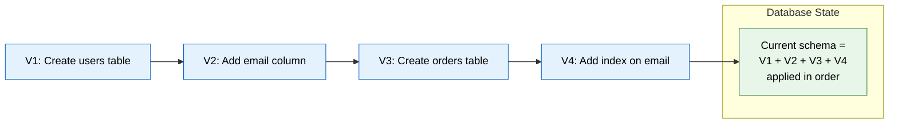
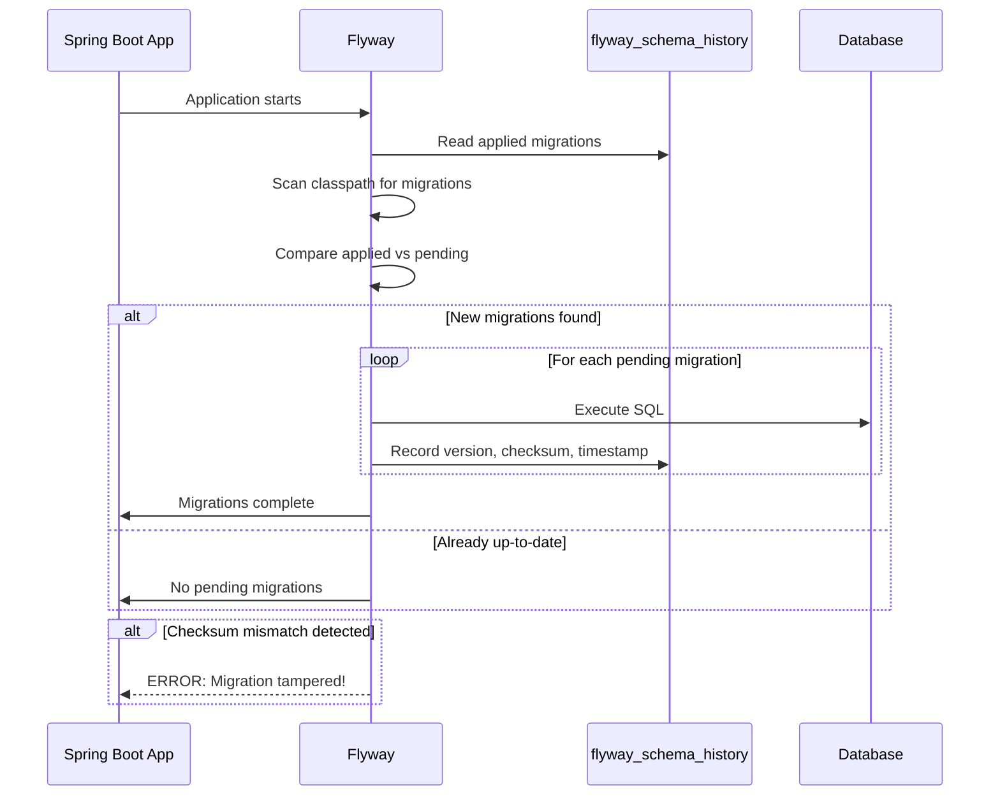
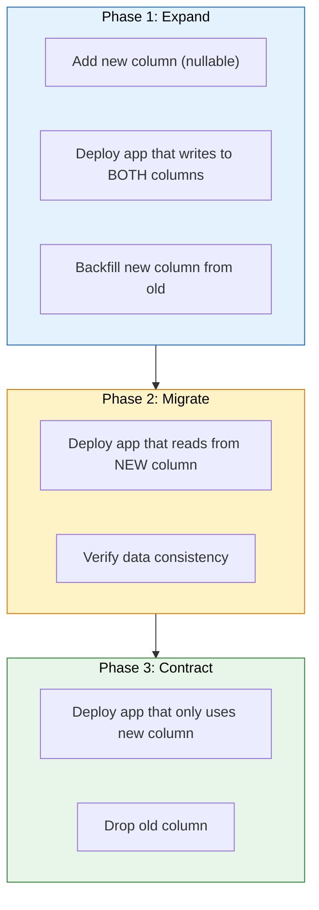
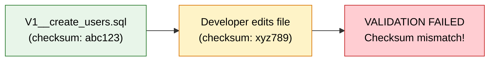
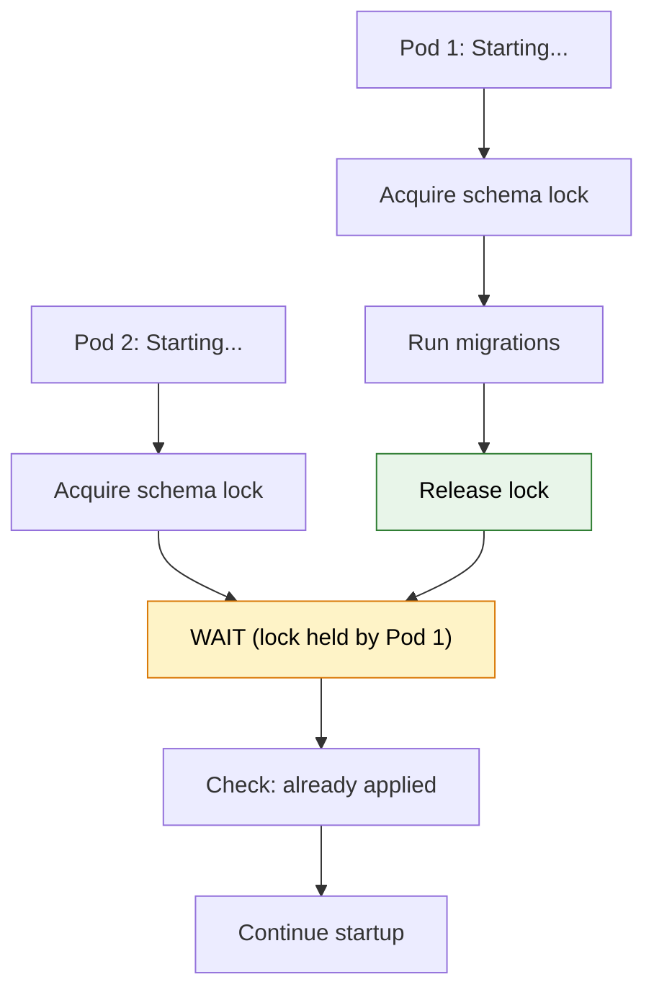

# 🗃️ Database Migrations with Flyway & Liquibase

> **Version control your database schema — every change is tracked, reproducible, and deployable just like application code.**

---

!!! abstract "Real-World Analogy"
    Think of database migrations like a **building blueprint revision history**. Each revision (V1, V2, V3...) describes exactly what changed — "add a new floor," "widen the hallway," "install plumbing in room 4." You can't skip revisions or go back and alter a published blueprint. New construction sites (environments) apply revisions in order to reach the current state. This ensures every building (database) is structurally identical regardless of when it was built.



---

## 🤔 Why Database Migrations Matter

| Problem Without Migrations | Solution With Migrations |
|---|---|
| Manual SQL scripts applied ad-hoc | Automated, ordered execution |
| "Works on my machine" schema drift | Every environment is identical |
| No rollback capability | Reversible changes with undo/rollback |
| No audit trail of schema changes | Full history in version control |
| Risky deployments with unknown state | Deterministic, repeatable deployments |
| Team conflicts on schema changes | Sequential versioning prevents conflicts |

---

## 🛫 Flyway

### Setup in Spring Boot

```xml
<dependency>
    <groupId>org.flywaydb</groupId>
    <artifactId>flyway-core</artifactId>
</dependency>
<dependency>
    <groupId>org.flywaydb</groupId>
    <artifactId>flyway-database-postgresql</artifactId> <!-- DB-specific module -->
</dependency>
```

```yaml
# application.yml
spring:
  datasource:
    url: jdbc:postgresql://localhost:5432/myapp
    username: app_user
    password: ${DB_PASSWORD}
  flyway:
    enabled: true
    locations: classpath:db/migration
    baseline-on-migrate: true
    baseline-version: 0
    schemas: public
    validate-on-migrate: true
    out-of-order: false
```

### Naming Conventions

```
src/main/resources/db/migration/
├── V1__create_users_table.sql
├── V1.1__add_email_to_users.sql
├── V2__create_orders_table.sql
├── V3__add_index_on_users_email.sql
├── R__refresh_materialized_views.sql
└── U2__undo_create_orders_table.sql
```

| Prefix | Type | Naming Pattern | Behavior |
|---|---|---|---|
| `V` | Versioned | `V{version}__{description}.sql` | Runs once, in order |
| `R` | Repeatable | `R__{description}.sql` | Runs every time checksum changes |
| `U` | Undo (Teams) | `U{version}__{description}.sql` | Reverses a versioned migration |

!!! warning "Double underscore required"
    The separator between version and description is **two underscores** (`__`). `V1_create_table.sql` will fail with a parsing error.

### Migration Lifecycle



### Versioned Migration Example

```sql
-- V1__create_users_table.sql
CREATE TABLE users (
    id          BIGSERIAL PRIMARY KEY,
    username    VARCHAR(50)  NOT NULL UNIQUE,
    email       VARCHAR(255) NOT NULL UNIQUE,
    password    VARCHAR(255) NOT NULL,
    active      BOOLEAN      NOT NULL DEFAULT TRUE,
    created_at  TIMESTAMP    NOT NULL DEFAULT NOW(),
    updated_at  TIMESTAMP    NOT NULL DEFAULT NOW()
);

CREATE INDEX idx_users_email ON users(email);
CREATE INDEX idx_users_username ON users(username);
```

```sql
-- V2__create_orders_table.sql
CREATE TABLE orders (
    id          BIGSERIAL PRIMARY KEY,
    user_id     BIGINT       NOT NULL REFERENCES users(id),
    status      VARCHAR(20)  NOT NULL DEFAULT 'PENDING',
    total_cents BIGINT       NOT NULL,
    created_at  TIMESTAMP    NOT NULL DEFAULT NOW()
);

CREATE INDEX idx_orders_user_id ON orders(user_id);
CREATE INDEX idx_orders_status ON orders(status);
```

### Repeatable Migration Example

```sql
-- R__create_order_summary_view.sql
CREATE OR REPLACE VIEW order_summary AS
SELECT
    u.id AS user_id,
    u.username,
    COUNT(o.id) AS total_orders,
    COALESCE(SUM(o.total_cents), 0) AS lifetime_spend_cents
FROM users u
LEFT JOIN orders o ON o.user_id = u.id
GROUP BY u.id, u.username;
```

### Java-Based Migrations

```java
package db.migration;

import org.flywaydb.core.api.migration.BaseJavaMigration;
import org.flywaydb.core.api.migration.Context;

import java.sql.PreparedStatement;
import java.sql.ResultSet;

public class V5__backfill_user_display_names extends BaseJavaMigration {

    @Override
    public void migrate(Context context) throws Exception {
        try (var stmt = context.getConnection().prepareStatement(
                "UPDATE users SET display_name = username WHERE display_name IS NULL")) {
            int updated = stmt.executeUpdate();
            logger.info("Backfilled {} display names", updated);
        }
    }
}
```

---

## 🧪 Liquibase

### Setup in Spring Boot

```xml
<dependency>
    <groupId>org.liquibase</groupId>
    <artifactId>liquibase-core</artifactId>
</dependency>
```

```yaml
# application.yml
spring:
  datasource:
    url: jdbc:postgresql://localhost:5432/myapp
    username: app_user
    password: ${DB_PASSWORD}
  liquibase:
    enabled: true
    change-log: classpath:db/changelog/db.changelog-master.yaml
```

### Changelog Structure

```yaml
# db/changelog/db.changelog-master.yaml
databaseChangeLog:
  - include:
      file: db/changelog/changes/001-create-users.yaml
  - include:
      file: db/changelog/changes/002-create-orders.yaml
  - include:
      file: db/changelog/changes/003-add-user-display-name.yaml
```

### Changeset Example (YAML)

```yaml
# db/changelog/changes/001-create-users.yaml
databaseChangeLog:
  - changeSet:
      id: 001-create-users
      author: vkaruturi
      preConditions:
        - onFail: MARK_RAN
        - not:
            tableExists:
              tableName: users
      changes:
        - createTable:
            tableName: users
            columns:
              - column:
                  name: id
                  type: BIGINT
                  autoIncrement: true
                  constraints:
                    primaryKey: true
              - column:
                  name: username
                  type: VARCHAR(50)
                  constraints:
                    nullable: false
                    unique: true
              - column:
                  name: email
                  type: VARCHAR(255)
                  constraints:
                    nullable: false
                    unique: true
              - column:
                  name: created_at
                  type: TIMESTAMP
                  defaultValueComputed: NOW()
      rollback:
        - dropTable:
            tableName: users
```

### Changeset Example (XML)

```xml
<!-- db/changelog/changes/002-create-orders.xml -->
<databaseChangeLog xmlns="http://www.liquibase.org/xml/ns/dbchangelog"
                   xmlns:xsi="http://www.w3.org/2001/XMLSchema-instance"
                   xsi:schemaLocation="http://www.liquibase.org/xml/ns/dbchangelog
                   http://www.liquibase.org/xml/ns/dbchangelog/dbchangelog-latest.xsd">

    <changeSet id="002-create-orders" author="vkaruturi">
        <preConditions onFail="MARK_RAN">
            <not><tableExists tableName="orders"/></not>
        </preConditions>

        <createTable tableName="orders">
            <column name="id" type="BIGINT" autoIncrement="true">
                <constraints primaryKey="true"/>
            </column>
            <column name="user_id" type="BIGINT">
                <constraints nullable="false" foreignKeyName="fk_orders_user"
                             references="users(id)"/>
            </column>
            <column name="status" type="VARCHAR(20)" defaultValue="PENDING"/>
            <column name="total_cents" type="BIGINT">
                <constraints nullable="false"/>
            </column>
        </createTable>

        <createIndex tableName="orders" indexName="idx_orders_user_id">
            <column name="user_id"/>
        </createIndex>

        <rollback>
            <dropTable tableName="orders"/>
        </rollback>
    </changeSet>
</databaseChangeLog>
```

### Preconditions

```yaml
# Run only on PostgreSQL
preConditions:
  - onFail: WARN
  - dbms:
      type: postgresql

# Run only if column doesn't exist yet
preConditions:
  - onFail: MARK_RAN
  - not:
      columnExists:
        tableName: users
        columnName: display_name
```

| Precondition Action | Behavior |
|---|---|
| `HALT` | Stop execution and report failure (default) |
| `MARK_RAN` | Skip but mark as executed |
| `WARN` | Log warning and continue |
| `CONTINUE` | Silently skip |

---

## 🚀 Zero-Downtime Migration Strategies

### Expand-and-Contract Pattern



### Example: Renaming a Column Safely

**Wrong approach** (causes downtime):
```sql
-- DANGEROUS: Instant breakage for running application
ALTER TABLE users RENAME COLUMN name TO full_name;
```

**Safe approach** (expand-and-contract):

```sql
-- V5__add_full_name_column.sql (Phase 1: Expand)
ALTER TABLE users ADD COLUMN full_name VARCHAR(100);

-- Backfill existing data
UPDATE users SET full_name = name WHERE full_name IS NULL;

-- Add NOT NULL constraint after backfill
ALTER TABLE users ALTER COLUMN full_name SET NOT NULL;

-- Create compatibility view for legacy queries
CREATE VIEW users_compat AS
SELECT *, name AS full_name_alias FROM users;
```

```java
// Phase 2: Application writes to both columns
@Entity
@Table(name = "users")
public class User {

    @Column(name = "name")
    private String name;

    @Column(name = "full_name")
    private String fullName;

    @PrePersist
    @PreUpdate
    void syncColumns() {
        if (fullName == null) fullName = name;
        if (name == null) name = fullName;
    }
}
```

```sql
-- V6__drop_legacy_name_column.sql (Phase 3: Contract — deployed after all services use full_name)
ALTER TABLE users DROP COLUMN name;
```

### Adding a Column Safely

```sql
-- V7__add_phone_to_users.sql
-- SAFE: Nullable columns with defaults don't lock the table in PostgreSQL 11+
ALTER TABLE users ADD COLUMN phone VARCHAR(20) DEFAULT NULL;

-- For NOT NULL with defaults (PostgreSQL 11+ does this without full table rewrite):
ALTER TABLE users ADD COLUMN country VARCHAR(3) NOT NULL DEFAULT 'US';
```

!!! warning "MySQL Caution"
    In MySQL < 8.0, `ALTER TABLE ... ADD COLUMN` with a default **locks the entire table**. Use `pt-online-schema-change` or `gh-ost` for large tables.

---

## 📊 Handling Large Data Migrations

### Batched Updates (Avoid Table Locks)

```java
package db.migration;

import org.flywaydb.core.api.migration.BaseJavaMigration;
import org.flywaydb.core.api.migration.Context;

import java.sql.Connection;
import java.sql.PreparedStatement;

public class V8__backfill_normalized_email extends BaseJavaMigration {

    private static final int BATCH_SIZE = 5000;

    @Override
    public void migrate(Context context) throws Exception {
        Connection conn = context.getConnection();
        int totalUpdated = 0;

        while (true) {
            try (PreparedStatement ps = conn.prepareStatement("""
                UPDATE users
                SET normalized_email = LOWER(TRIM(email))
                WHERE normalized_email IS NULL
                AND id IN (
                    SELECT id FROM users
                    WHERE normalized_email IS NULL
                    LIMIT ?
                )
                """)) {

                ps.setInt(1, BATCH_SIZE);
                int updated = ps.executeUpdate();
                totalUpdated += updated;

                if (updated < BATCH_SIZE) break;

                // Allow other transactions to proceed between batches
                conn.commit();
                Thread.sleep(100);
            }
        }

        logger.info("Backfilled {} normalized emails", totalUpdated);
    }
}
```

### Liquibase Batched Data Migration

```yaml
# 003-backfill-display-name.yaml
databaseChangeLog:
  - changeSet:
      id: 003-backfill-display-name
      author: vkaruturi
      changes:
        - sql:
            sql: >
              UPDATE users
              SET display_name = CONCAT(first_name, ' ', last_name)
              WHERE display_name IS NULL;
      rollback:
        - sql:
            sql: UPDATE users SET display_name = NULL;
```

---

## ⚖️ Flyway vs Liquibase Comparison

| Feature | Flyway | Liquibase |
|---|---|---|
| **Configuration format** | SQL + Java | XML, YAML, JSON, SQL |
| **Learning curve** | Lower (just write SQL) | Higher (DSL to learn) |
| **Rollback support** | Undo migrations (paid Teams edition) | Built-in rollback (free) |
| **Database abstraction** | SQL is DB-specific | Changesets are DB-agnostic |
| **Preconditions** | Limited (callbacks) | Rich precondition system |
| **Diff/generate** | No | Yes (compare DB to model) |
| **Dry run** | No (paid only) | Yes (`updateSQL` command) |
| **History table** | `flyway_schema_history` | `DATABASECHANGELOG` |
| **Spring Boot support** | Auto-configured | Auto-configured |
| **Community** | Large | Large |
| **Best for** | Teams comfortable with raw SQL | Teams needing DB portability or rollback |
| **Pricing** | Community (free) + Teams/Enterprise (paid) | Community (free) + Pro (paid) |

---

## ✅ Best Practices

### 1. One Logical Change Per Migration

```sql
-- GOOD: V3__add_phone_to_users.sql
ALTER TABLE users ADD COLUMN phone VARCHAR(20);

-- BAD: V3__multiple_changes.sql (too many unrelated changes)
ALTER TABLE users ADD COLUMN phone VARCHAR(20);
CREATE TABLE notifications (...);
ALTER TABLE orders ADD COLUMN discount_cents BIGINT;
```

### 2. Never Edit an Applied Migration



!!! danger "Golden Rule"
    Once a migration has been applied to any shared environment (dev, staging, prod), it is **immutable**. Create a new migration to make corrections.

### 3. Test Migrations in CI/CD

```yaml
# GitHub Actions example
name: Test Migrations
on: [pull_request]

jobs:
  migration-test:
    runs-on: ubuntu-latest
    services:
      postgres:
        image: postgres:16
        env:
          POSTGRES_DB: testdb
          POSTGRES_USER: test
          POSTGRES_PASSWORD: test
        ports:
          - 5432:5432
    steps:
      - uses: actions/checkout@v4
      - uses: actions/setup-java@v4
        with:
          java-version: '21'
          distribution: 'temurin'
      - run: ./mvnw flyway:migrate -Dflyway.url=jdbc:postgresql://localhost:5432/testdb
      - run: ./mvnw flyway:validate
      - run: ./mvnw test -Dspring.profiles.active=test
```

### 4. Use Transactions for Safety

```sql
-- Flyway wraps each migration in a transaction by default (PostgreSQL)
-- For databases that don't support transactional DDL (MySQL), be extra careful

-- Explicitly handle in Liquibase:
-- <changeSet id="..." author="..." runInTransaction="true">
```

### 5. Environment-Specific Configuration

```java
@Configuration
public class FlywayConfig {

    @Bean
    @Profile("production")
    public FlywayMigrationStrategy productionStrategy() {
        return flyway -> {
            flyway.validate();  // Fail fast if state is inconsistent
            flyway.migrate();
        };
    }

    @Bean
    @Profile("development")
    public FlywayMigrationStrategy devStrategy() {
        return flyway -> {
            flyway.repair();   // Fix failed migration entries
            flyway.migrate();
        };
    }
}
```

---

## ⚠️ Common Pitfalls

### Concurrent Migration Execution



!!! info "How tools handle concurrency"
    Both Flyway and Liquibase use a **database lock** (row-level lock on the history table) to prevent concurrent migrations. However, if a migration crashes mid-execution, the lock may become stale. Use `flyway repair` or Liquibase's `releaseLocks` to resolve.

### Schema Lock Contention in Production

```java
@Configuration
@Profile("production")
public class FlywayProductionConfig {

    @Bean
    public FlywayConfigurationCustomizer flywayCustomizer() {
        return configuration -> configuration
            .lockRetryCount(50)              // Retry lock acquisition
            .baselineOnMigrate(false)        // Never auto-baseline in prod
            .outOfOrder(false)               // Strict ordering
            .validateOnMigrate(true);        // Always validate checksums
    }
}
```

### Avoiding DDL Lock Timeouts

```sql
-- PostgreSQL: Set lock timeout to avoid blocking other queries
SET lock_timeout = '5s';

-- Add index concurrently (doesn't lock table, but can't run inside a transaction)
-- Flyway: disable transaction for this migration
-- flyway:executeInTransaction=false
CREATE INDEX CONCURRENTLY idx_orders_created_at ON orders(created_at);
```

```yaml
# Liquibase: disable transaction for concurrent index creation
- changeSet:
    id: add-index-concurrently
    author: vkaruturi
    runInTransaction: false
    changes:
      - sql:
          sql: CREATE INDEX CONCURRENTLY idx_orders_created_at ON orders(created_at);
```

---

## 🎯 Interview Questions

??? question "1. Why should you never edit a migration that has already been applied?"
    Migration tools store a **checksum** of each applied migration file. If you edit the file, the checksum changes and validation fails on next startup, halting the application. Applied migrations are treated as immutable history. If you need to correct something, write a new migration. This ensures all environments (dev, staging, prod) can reproduce the exact same schema state from scratch.

??? question "2. How do you perform a zero-downtime column rename in production?"
    Use the **expand-and-contract** pattern: (1) Add the new column alongside the old one. (2) Deploy application code that writes to both columns and reads from the new one. (3) Backfill existing rows. (4) Once all services use the new column, drop the old one in a separate deployment. This avoids breaking running application instances that still reference the old column name.

??? question "3. How do Flyway and Liquibase prevent concurrent migration execution in a multi-instance deployment?"
    Both tools use a **database-level advisory lock** or a lock row in their history table. When a pod starts and attempts to migrate, it first acquires this lock. Other pods wait (or skip if already up-to-date). If a pod crashes while holding the lock, you need to manually run `flyway repair` or `liquibase releaseLocks` to clear the stale lock before migrations can proceed.

??? question "4. When would you choose Liquibase over Flyway?"
    Choose Liquibase when: (1) You need **database-agnostic** changesets that generate correct DDL for multiple database vendors (e.g., PostgreSQL in prod, H2 in tests). (2) You need **built-in rollback** support without a paid license. (3) You need **preconditions** to conditionally apply changes. (4) You want to **generate changelogs** by diffing a reference database against a target. Flyway is preferable when your team is comfortable with raw SQL and wants a simpler, convention-based approach.

??? question "5. How do you handle a large data migration (millions of rows) without locking the table or causing downtime?"
    Process updates in **batches** (e.g., 5,000 rows at a time) with pauses between batches. Use a Java-based Flyway migration or a Liquibase custom change class. Each batch commits independently so other transactions can interleave. Optionally use database-specific tools like `pg_repack` or MySQL's `pt-online-schema-change`. Monitor lock wait times and replication lag during execution.

??? question "6. What happens if a migration fails halfway through on a database that doesn't support transactional DDL (like MySQL)?"
    The migration leaves the schema in a **partially applied state** — some statements executed successfully, others did not. The migration is marked as failed in the history table. You must manually fix the schema to a consistent state, then run `flyway repair` (which removes the failed entry from the history table) before re-attempting. This is why it's critical to keep migrations small and atomic, and to test them thoroughly before applying to production.
