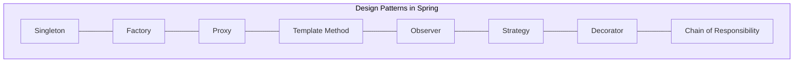
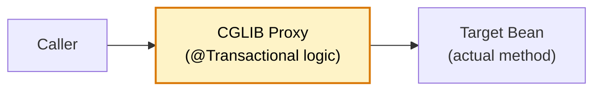

# 🧩 Design Patterns in Spring Boot

> **Recognize and apply the design patterns that Spring uses internally and that you should use in your services — the patterns FAANG interviewers expect you to know cold.**

---

!!! abstract "Real-World Analogy"
    Spring Boot is a **master class in design patterns**. Every time you use `@Autowired`, you're using Dependency Injection. Every `RestTemplate` interceptor is a Chain of Responsibility. Every `@Bean` method is a Factory. Knowing these patterns helps you understand Spring internals AND write better code.

---

## 🏭 Patterns Spring Uses Internally



---

## 1️⃣ Singleton Pattern

Every Spring Bean is a singleton by default:

```java
@Service  // Singleton — one instance shared across the entire app
public class OrderService {
    // Thread-safe: no mutable state, only dependencies
    private final OrderRepository orderRepository;
    private final PaymentClient paymentClient;

    public OrderService(OrderRepository repo, PaymentClient client) {
        this.orderRepository = repo;
        this.paymentClient = client;
    }
}
```

**Key rule**: Singleton beans must be **stateless** (no instance fields that change per request).

---

## 2️⃣ Factory Pattern

Spring's `BeanFactory` / `ApplicationContext` is the ultimate factory:

```java
// Custom factory for creating strategy implementations
@Component
public class NotificationFactory {

    private final Map<String, NotificationSender> senders;

    public NotificationFactory(List<NotificationSender> senderList) {
        this.senders = senderList.stream()
            .collect(Collectors.toMap(NotificationSender::getType, Function.identity()));
    }

    public NotificationSender getSender(String type) {
        return Optional.ofNullable(senders.get(type))
            .orElseThrow(() -> new IllegalArgumentException("Unknown type: " + type));
    }
}

// Usage
notificationFactory.getSender("EMAIL").send(message);
notificationFactory.getSender("SMS").send(message);
```

---

## 3️⃣ Proxy Pattern

Spring AOP, `@Transactional`, `@Cacheable` — all use dynamic proxies:



```java
@Service
public class PaymentService {

    @Transactional  // Spring creates a PROXY that wraps this method
    @Cacheable("payments")
    public Payment processPayment(PaymentRequest request) {
        // The proxy: 1) checks cache, 2) begins TX, 3) calls this, 4) commits TX
        return paymentRepository.save(Payment.from(request));
    }
}
```

**Pitfall**: Self-invocation bypasses the proxy — calling `this.method()` skips `@Transactional`/`@Cacheable`.

---

## 4️⃣ Template Method Pattern

Spring's `JdbcTemplate`, `RestTemplate`, `TransactionTemplate`:

```java
// Spring's template handles boilerplate (connection, error handling, closing)
// You provide only the specific logic (the callback)
@Repository
public class CustomReportRepository {

    private final JdbcTemplate jdbc;

    public List<Report> getMonthlyReport(YearMonth month) {
        return jdbc.query(
            "SELECT * FROM reports WHERE month = ?",
            (rs, rowNum) -> new Report(         // You provide only the mapping
                rs.getLong("id"),
                rs.getString("title"),
                rs.getBigDecimal("amount")
            ),
            month.toString()
        );
    }
}

// TransactionTemplate — template for programmatic transactions
@Service
public class BatchService {

    private final TransactionTemplate txTemplate;

    public void processBatch(List<Item> items) {
        txTemplate.execute(status -> {
            items.forEach(this::processItem);  // Your logic
            return null;
            // Template handles: begin, commit/rollback, cleanup
        });
    }
}
```

---

## 5️⃣ Strategy Pattern

Use interfaces + Spring DI to swap implementations:

```java
// Strategy interface
public interface PricingStrategy {
    BigDecimal calculatePrice(Order order);
    String getType();
}

// Concrete strategies
@Component
public class StandardPricing implements PricingStrategy {
    public BigDecimal calculatePrice(Order order) {
        return order.getBasePrice();
    }
    public String getType() { return "STANDARD"; }
}

@Component
public class PremiumPricing implements PricingStrategy {
    public BigDecimal calculatePrice(Order order) {
        return order.getBasePrice().multiply(new BigDecimal("0.8")); // 20% discount
    }
    public String getType() { return "PREMIUM"; }
}

@Component
public class WholesalePricing implements PricingStrategy {
    public BigDecimal calculatePrice(Order order) {
        return order.getBasePrice().multiply(new BigDecimal("0.6")); // 40% discount
    }
    public String getType() { return "WHOLESALE"; }
}

// Context — uses strategy based on customer tier
@Service
public class OrderPricingService {

    private final Map<String, PricingStrategy> strategies;

    public OrderPricingService(List<PricingStrategy> strategyList) {
        this.strategies = strategyList.stream()
            .collect(Collectors.toMap(PricingStrategy::getType, Function.identity()));
    }

    public BigDecimal calculateOrderPrice(Order order, String customerTier) {
        return strategies.getOrDefault(customerTier, strategies.get("STANDARD"))
            .calculatePrice(order);
    }
}
```

---

## 6️⃣ Observer Pattern

Spring Events implement the Observer pattern:

```java
// Subject publishes event
@Service
public class UserService {
    private final ApplicationEventPublisher publisher;

    @Transactional
    public User register(RegisterRequest request) {
        User user = userRepository.save(User.from(request));
        publisher.publishEvent(new UserRegisteredEvent(user.getId(), user.getEmail()));
        return user;
    }
}

// Observers react independently
@Component
public class WelcomeEmailObserver {
    @EventListener
    public void onUserRegistered(UserRegisteredEvent event) {
        emailService.sendWelcome(event.email());
    }
}

@Component
public class AnalyticsObserver {
    @EventListener
    public void onUserRegistered(UserRegisteredEvent event) {
        analytics.track("user_registered", event.userId());
    }
}
```

---

## 7️⃣ Decorator Pattern

Wrapping beans with additional behavior:

```java
// Base interface
public interface NotificationService {
    void send(String userId, String message);
}

// Core implementation
@Component
@Primary
public class LoggingNotificationDecorator implements NotificationService {

    private final NotificationService delegate;

    public LoggingNotificationDecorator(@Qualifier("smsNotification") NotificationService delegate) {
        this.delegate = delegate;
    }

    @Override
    public void send(String userId, String message) {
        log.info("Sending notification to user: {}", userId);
        delegate.send(userId, message);
        log.info("Notification sent successfully");
    }
}

@Component("smsNotification")
public class SmsNotificationService implements NotificationService {
    public void send(String userId, String message) {
        smsGateway.send(userId, message);
    }
}
```

---

## 8️⃣ Chain of Responsibility

Spring Security filter chain, interceptors:

```java
// Custom handler chain for order validation
public interface OrderValidator {
    void validate(Order order);
    int getOrder();
}

@Component
public class StockValidator implements OrderValidator {
    public void validate(Order order) {
        if (!inventoryService.hasStock(order.getItemIds())) {
            throw new OutOfStockException(order.getId());
        }
    }
    public int getOrder() { return 1; }
}

@Component
public class FraudValidator implements OrderValidator {
    public void validate(Order order) {
        if (fraudService.isSuspicious(order)) {
            throw new FraudDetectedException(order.getId());
        }
    }
    public int getOrder() { return 2; }
}

@Component
public class CreditValidator implements OrderValidator {
    public void validate(Order order) {
        if (!creditService.hasCredit(order.getUserId(), order.getTotal())) {
            throw new InsufficientCreditException(order.getId());
        }
    }
    public int getOrder() { return 3; }
}

// Chain executor
@Service
public class OrderValidationChain {

    private final List<OrderValidator> validators;

    public OrderValidationChain(List<OrderValidator> validators) {
        this.validators = validators.stream()
            .sorted(Comparator.comparingInt(OrderValidator::getOrder))
            .toList();
    }

    public void validateOrder(Order order) {
        validators.forEach(v -> v.validate(order));
    }
}
```

---

## 9️⃣ Builder Pattern

Common in Spring for configuration and DTOs:

```java
// Response builder
@Builder
public record ApiResponse<T>(
    T data,
    String message,
    int statusCode,
    Instant timestamp,
    Map<String, Object> metadata
) {
    public static <T> ApiResponse<T> success(T data) {
        return ApiResponse.<T>builder()
            .data(data)
            .message("Success")
            .statusCode(200)
            .timestamp(Instant.now())
            .metadata(Map.of())
            .build();
    }

    public static <T> ApiResponse<T> error(String message, int code) {
        return ApiResponse.<T>builder()
            .data(null)
            .message(message)
            .statusCode(code)
            .timestamp(Instant.now())
            .build();
    }
}
```

---

## 📊 Pattern Summary

| Pattern | Spring Usage | Your Code Usage |
|---|---|---|
| **Singleton** | All beans by default | Service layer, repositories |
| **Factory** | BeanFactory, FactoryBean | Strategy selection, object creation |
| **Proxy** | AOP, @Transactional, @Cacheable | Custom AOP aspects |
| **Template Method** | JdbcTemplate, RestTemplate | Reusable flows with variable steps |
| **Strategy** | HandlerMapping, ViewResolver | Pluggable algorithms, multi-tenant logic |
| **Observer** | ApplicationEventPublisher | Decoupled side effects |
| **Decorator** | BeanPostProcessor, Filter wrapping | Adding cross-cutting logic |
| **Chain of Resp.** | Filter chain, Interceptors | Validation pipelines |
| **Builder** | Builder APIs (WebClient, Security) | DTOs, configurations |

---

## 🎯 Interview Questions

??? question "1. What design patterns does Spring Framework use internally?"
    **Singleton** (bean scope), **Factory** (BeanFactory/ApplicationContext), **Proxy** (AOP, @Transactional), **Template Method** (JdbcTemplate, RestTemplate), **Observer** (Application Events), **Strategy** (HandlerMapping, ViewResolver), **Chain of Responsibility** (Security filter chain), **Decorator** (BeanPostProcessor).

??? question "2. How would you implement the Strategy pattern in Spring Boot?"
    Define a strategy interface, create multiple `@Component` implementations, inject them as a `List<Strategy>` or `Map<String, Strategy>`. Use a factory/context class to select the right strategy at runtime based on a discriminator (customer tier, region, feature flag).

??? question "3. Why does Spring use the Proxy pattern extensively?"
    Proxies allow Spring to add behavior (transactions, caching, security, lazy loading) to your beans **without modifying your code**. When you call a `@Transactional` method, you're actually calling the proxy, which wraps your logic with begin/commit/rollback. This is AOP in action.

??? question "4. What is the Template Method pattern and how does Spring use it?"
    Defines the skeleton of an algorithm with extension points. `JdbcTemplate` handles connection management, statement creation, exception translation, and resource cleanup — you only provide the query and row mapper. This eliminates boilerplate while letting you customize the specific logic.

??? question "5. How do you implement Chain of Responsibility in Spring?"
    Create an interface with a `handle()` method and `getOrder()` for priority. Implement multiple `@Component` validators/handlers. Inject them as a `List`, sort by order, and iterate. Each handler can process and/or pass to the next. Spring Security's filter chain is the canonical example.
