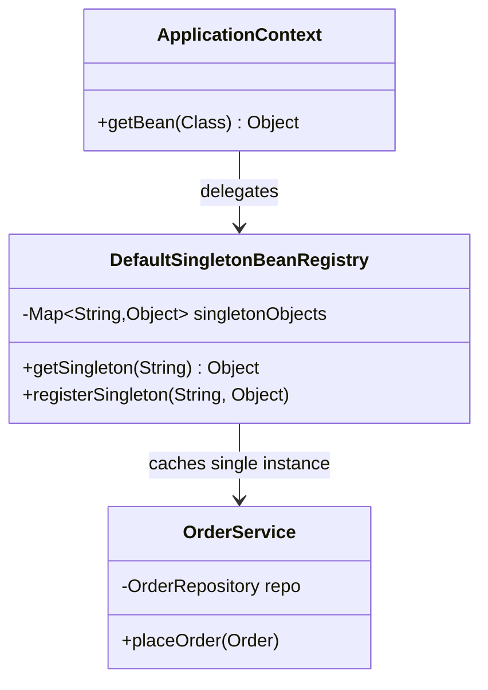
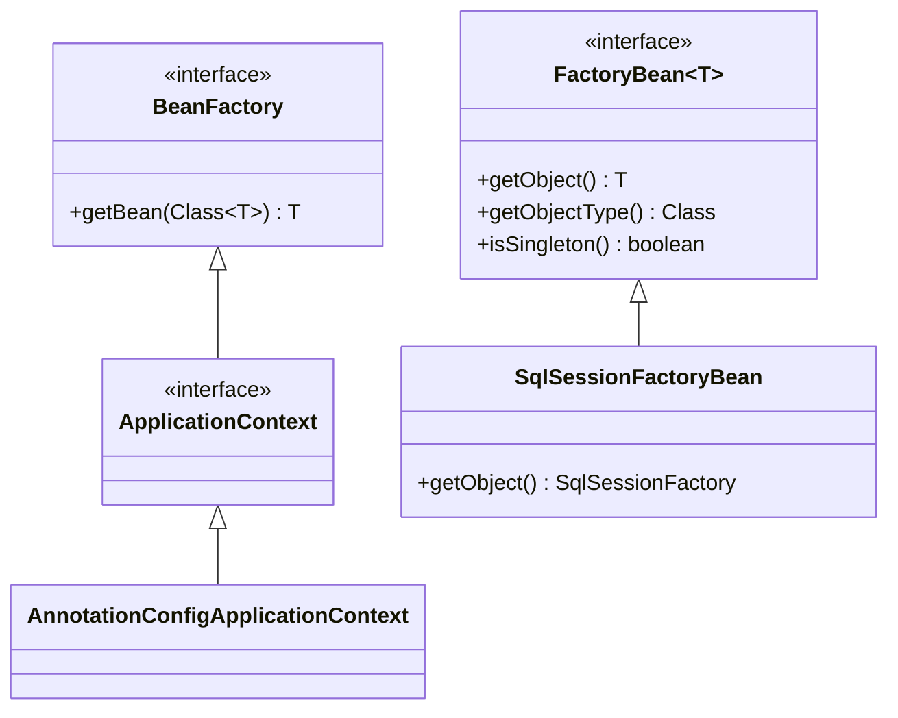
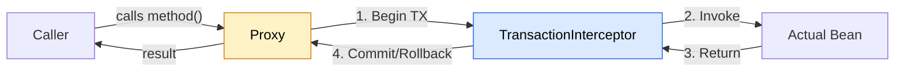
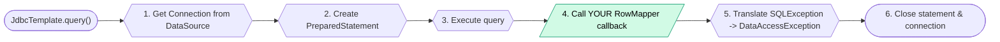
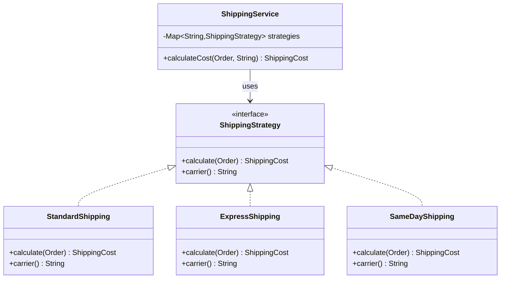
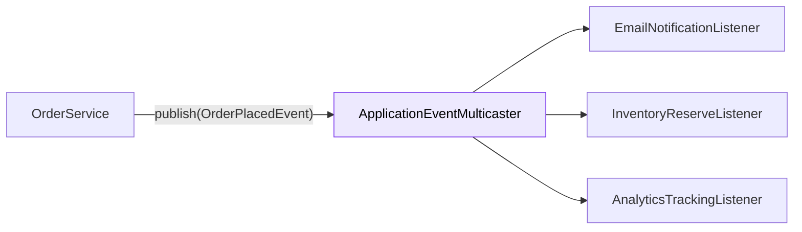
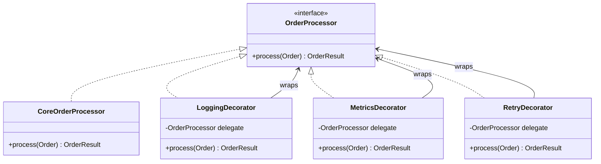
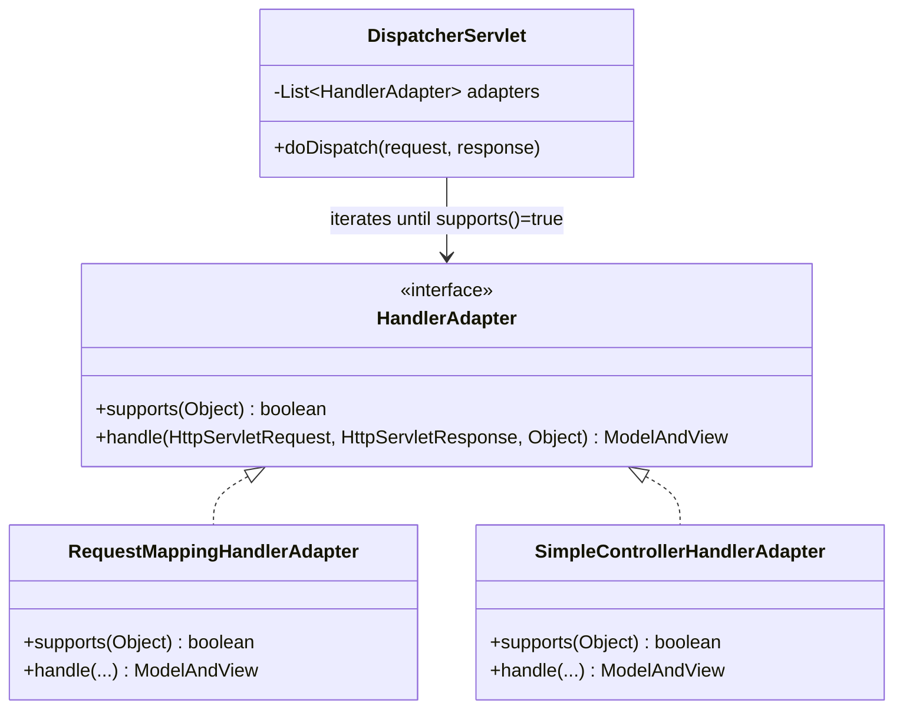
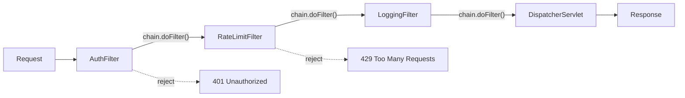
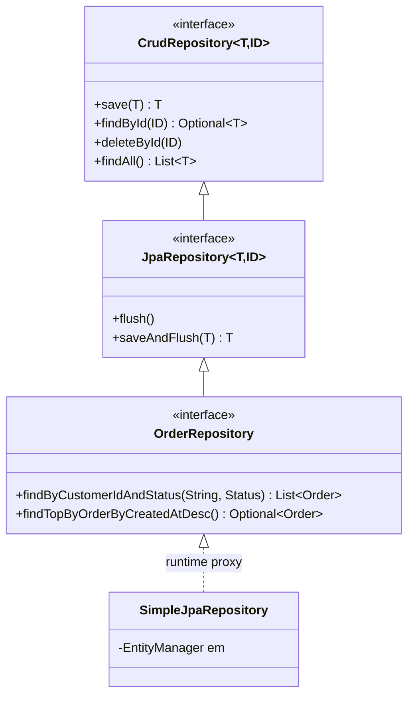

# Design Patterns in Spring Boot

> Interview-ready reference. Each pattern: what it is, how Spring uses it internally, when to apply it yourself, code, and gotchas.

---

## 1. Singleton Pattern

**What it is:** One instance per container. All dependents share the same object reference.

**Spring internally:** Every bean defaults to singleton scope. The `DefaultSingletonBeanRegistry` caches instances in a `ConcurrentHashMap`. Unlike GoF singleton (private constructor, static accessor), Spring manages the lifecycle externally via IoC.

**When to use it yourself:** Stateless services, repositories, clients. Anything thread-safe that doesn't hold per-request state.



```java
@Service // Singleton by default
public class OrderService {
    private final OrderRepository repository;
    private final PaymentGateway gateway;

    public OrderService(OrderRepository repository, PaymentGateway gateway) {
        this.repository = repository;
        this.gateway = gateway;
    }

    public Order place(OrderRequest req) {
        // Stateless: safe for concurrent access
        Order order = Order.from(req);
        gateway.charge(order.total());
        return repository.save(order);
    }
}
```

!!! danger "Spring Singleton vs GoF Singleton"
    Spring singleton = one instance **per ApplicationContext**. GoF singleton = one instance **per JVM**. Two Spring contexts in the same JVM = two instances. Never use GoF singletons in Spring apps -- they break testability and ignore the container.

!!! warning "Gotcha: Mutable State"
    Adding a mutable field (e.g., `private int counter;`) to a singleton bean creates a race condition under load. Use `@Scope("prototype")` or `AtomicInteger` if you need per-instance state.

---

## 2. Factory Method & Abstract Factory

**What it is:** Encapsulate object creation. Caller doesn't know the concrete class.

**Spring internally:**

- `BeanFactory` / `ApplicationContext` -- the ultimate factory. You ask for a bean by type; Spring decides which concrete class to instantiate.
- `FactoryBean<T>` interface -- when bean creation logic is complex (e.g., `SqlSessionFactoryBean`, `ProxyFactoryBean`).
- `@Bean` methods in `@Configuration` classes are factory methods.

**When to use it yourself:** When runtime data determines which implementation to create.



```java
// FactoryBean: Spring calls getObject() to produce the actual bean
@Component
public class NotificationChannelFactoryBean implements FactoryBean<NotificationChannel> {

    @Value("${notification.default-channel}")
    private String channelType;

    @Override
    public NotificationChannel getObject() {
        return switch (channelType) {
            case "sms"   -> new SmsChannel();
            case "email" -> new EmailChannel();
            case "push"  -> new PushChannel();
            default -> throw new IllegalStateException("Unknown channel: " + channelType);
        };
    }

    @Override
    public Class<?> getObjectType() { return NotificationChannel.class; }
}
```

```java
// Runtime factory: select implementation based on request data
@Component
public class PaymentProcessorFactory {

    private final Map<String, PaymentProcessor> processors;

    public PaymentProcessorFactory(List<PaymentProcessor> list) {
        this.processors = list.stream()
            .collect(Collectors.toMap(PaymentProcessor::method, Function.identity()));
    }

    public PaymentProcessor resolve(String paymentMethod) {
        return Optional.ofNullable(processors.get(paymentMethod))
            .orElseThrow(() -> new UnsupportedPaymentException(paymentMethod));
    }
}
```

!!! tip "Prefer List/Map Injection Over Switches"
    Spring auto-collects all implementations of an interface. Inject `List<T>` and build a lookup map. Adding a new payment method = adding one `@Component`. Zero changes to the factory.

---

## 3. Proxy Pattern

**What it is:** A surrogate that controls access to the real object. Adds behavior before/after delegation.

**Spring internally:** The foundation of Spring AOP. `@Transactional`, `@Cacheable`, `@Async`, `@Retryable` -- all work by generating a proxy at runtime. Two mechanisms:

- **JDK Dynamic Proxy** -- target must implement an interface. Generates proxy implementing the same interface.
- **CGLIB Proxy** -- subclasses the target class. Works without interfaces. Default since Spring Boot 2.x (`spring.aop.proxy-target-class=true`).



```java
@Service
public class InventoryService {

    @Transactional
    @CacheEvict(value = "stock", key = "#sku")
    public void reduceStock(String sku, int qty) {
        // Proxy chain: CacheEvict advice -> TX advice -> this method
        Item item = itemRepo.findBySku(sku);
        item.reduceBy(qty);
        itemRepo.save(item);
    }
}
```

!!! danger "Self-Invocation Trap"
    Calling `this.reduceStock(...)` from another method in the same class bypasses the proxy. The `@Transactional` and `@CacheEvict` will NOT fire. Fix: inject self (`@Lazy private InventoryService self;`) or extract to a separate bean.

!!! info "CGLIB vs JDK Proxy"
    | | JDK Dynamic Proxy | CGLIB |
    |---|---|---|
    | Requires interface | Yes | No |
    | Mechanism | `java.lang.reflect.Proxy` | Bytecode subclass generation |
    | `final` methods | N/A | Cannot proxy `final` methods |
    | Spring Boot default | No | Yes (since 2.0) |

---

## 4. Template Method Pattern

**What it is:** Define algorithm skeleton in a base class/method. Subclasses (or callbacks) fill in the variable steps.

**Spring internally:** `JdbcTemplate`, `RestTemplate`, `TransactionTemplate`, `JmsTemplate`, `HibernateTemplate`. All handle resource acquisition, error handling, and cleanup. You supply the domain-specific logic via callbacks.



```java
@Repository
public class OrderReportRepository {

    private final JdbcTemplate jdbc;

    // You provide: SQL + mapping. Template handles: connection, statement, cleanup, exceptions.
    public List<OrderSummary> findTopOrders(BigDecimal minAmount) {
        return jdbc.query(
            "SELECT id, customer, total FROM orders WHERE total > ? ORDER BY total DESC LIMIT 50",
            (rs, row) -> new OrderSummary(
                rs.getLong("id"),
                rs.getString("customer"),
                rs.getBigDecimal("total")
            ),
            minAmount
        );
    }
}
```

```java
// TransactionTemplate: programmatic TX control without @Transactional
@Service
public class BulkImportService {

    private final TransactionTemplate txTemplate;

    public ImportResult importBatch(List<Record> records) {
        return txTemplate.execute(status -> {
            int count = 0;
            for (Record r : records) {
                if (!isValid(r)) {
                    status.setRollbackOnly();
                    return ImportResult.failed(count);
                }
                persist(r);
                count++;
            }
            return ImportResult.success(count);
        });
    }
}
```

!!! tip "When to Build Your Own Template"
    If you have 3+ methods with identical try/catch/finally structures that differ only in the core logic, extract a template. Example: retry-with-backoff template, audit-logging template.

---

## 5. Strategy Pattern

**What it is:** Define a family of algorithms behind a common interface. Swap at runtime without modifying clients.

**Spring internally:** `HandlerMapping` (URL to controller resolution), `ViewResolver` (view name to actual view), `ResourceLoader` (classpath vs filesystem vs URL).

**When to use it yourself:** Multi-tenant pricing, payment processing, notification routing, export formats.



```java
public interface ShippingStrategy {
    ShippingCost calculate(Order order);
    String carrier();
}

@Component
public class StandardShipping implements ShippingStrategy {
    public ShippingCost calculate(Order order) {
        return new ShippingCost(order.weight().multiply(RATE_PER_KG), 5);
    }
    public String carrier() { return "STANDARD"; }
}

@Component
public class ExpressShipping implements ShippingStrategy {
    public ShippingCost calculate(Order order) {
        return new ShippingCost(order.weight().multiply(RATE_PER_KG.multiply(TWO)), 2);
    }
    public String carrier() { return "EXPRESS"; }
}

// Context: resolves strategy dynamically
@Service
public class ShippingService {

    private final Map<String, ShippingStrategy> strategies;

    public ShippingService(List<ShippingStrategy> strategyList) {
        this.strategies = strategyList.stream()
            .collect(Collectors.toMap(ShippingStrategy::carrier, Function.identity()));
    }

    public ShippingCost calculateCost(Order order, String carrier) {
        ShippingStrategy strategy = strategies.get(carrier);
        if (strategy == null) throw new UnsupportedCarrierException(carrier);
        return strategy.calculate(order);
    }
}
```

!!! info "@Qualifier for Compile-Time Selection"
    When you know at design time which implementation you need, use `@Qualifier("express") ShippingStrategy strategy`. When it depends on runtime input (user choice, config), use the map-based approach above.

---

## 6. Observer Pattern (Event-Driven)

**What it is:** One-to-many dependency. When a subject changes state, all observers are notified automatically.

**Spring internally:** `ApplicationEventPublisher` + `@EventListener`. The context maintains a `SimpleApplicationEventMulticaster` that dispatches events to all registered listeners.

**When to use it yourself:** Decoupling side effects from core logic. Order placed -> send email, update analytics, notify warehouse. Each listener is independent.



```java
// Event
public record OrderPlacedEvent(String orderId, String customerId, BigDecimal total) {}

// Publisher -- core domain logic, no knowledge of listeners
@Service
public class OrderService {
    private final ApplicationEventPublisher events;

    @Transactional
    public Order place(OrderRequest req) {
        Order order = orderRepo.save(Order.from(req));
        events.publishEvent(new OrderPlacedEvent(order.id(), req.customerId(), order.total()));
        return order;
    }
}

// Listeners -- independently deployed, independently testable
@Component
public class EmailNotificationListener {
    @EventListener
    public void handle(OrderPlacedEvent event) {
        emailService.sendOrderConfirmation(event.customerId(), event.orderId());
    }
}

@Component
public class InventoryReserveListener {
    @TransactionalEventListener(phase = TransactionPhase.AFTER_COMMIT)
    public void handle(OrderPlacedEvent event) {
        inventoryService.reserveItems(event.orderId());
    }
}

@Component
public class AnalyticsListener {
    @Async
    @EventListener
    public void handle(OrderPlacedEvent event) {
        analytics.track("order_placed", Map.of("total", event.total()));
    }
}
```

!!! warning "@TransactionalEventListener vs @EventListener"
    `@EventListener` fires immediately (within the transaction). If the TX rolls back, the email is already sent. Use `@TransactionalEventListener(phase = AFTER_COMMIT)` for side effects that must only happen on success.

!!! tip "Async Events"
    Add `@Async` + `@EnableAsync` to process listeners on a separate thread pool. Failures in one listener won't block others or the publisher.

---

## 7. Decorator Pattern

**What it is:** Wrap an object to add behavior without altering its interface. Multiple decorators can stack.

**Spring internally:**

- `BeanPostProcessor` -- wraps beans after creation (e.g., wrapping with proxies).
- `HandlerInterceptor` -- decorates controller execution with pre/post logic.
- `HttpMessageConverter` wrappers.
- Servlet `Filter` wrappers.

**When to use it yourself:** Adding logging, metrics, retry, circuit-breaking around an existing service without modifying it.



```java
public interface OrderProcessor {
    OrderResult process(Order order);
}

@Component("coreOrderProcessor")
public class CoreOrderProcessor implements OrderProcessor {
    public OrderResult process(Order order) {
        // actual business logic
        return orderRepo.save(order).toResult();
    }
}

@Component
@Primary
public class MetricsOrderProcessor implements OrderProcessor {

    private final OrderProcessor delegate;
    private final MeterRegistry metrics;

    public MetricsOrderProcessor(
            @Qualifier("coreOrderProcessor") OrderProcessor delegate,
            MeterRegistry metrics) {
        this.delegate = delegate;
        this.metrics = metrics;
    }

    @Override
    public OrderResult process(Order order) {
        Timer.Sample sample = Timer.start(metrics);
        try {
            OrderResult result = delegate.process(order);
            sample.stop(metrics.timer("order.process", "status", "success"));
            return result;
        } catch (Exception e) {
            sample.stop(metrics.timer("order.process", "status", "error"));
            throw e;
        }
    }
}
```

```java
// BeanPostProcessor: Spring's internal decorator mechanism
@Component
public class ProfilingBeanPostProcessor implements BeanPostProcessor {

    @Override
    public Object postProcessAfterInitialization(Object bean, String beanName) {
        if (bean.getClass().isAnnotationPresent(Profiled.class)) {
            // Return a proxy that adds timing around every method
            return createTimingProxy(bean);
        }
        return bean;
    }
}
```

!!! tip "Stacking Decorators with @Order"
    Use `@Order(1)`, `@Order(2)` etc. on `BeanPostProcessor` implementations to control wrapping order. Lower value = applied first (outermost wrapper).

---

## 8. Builder Pattern

**What it is:** Construct complex objects step-by-step. Separates construction from representation. Enables fluent APIs.

**Spring internally:** `WebClient.builder()`, `SecurityFilterChain` (via `HttpSecurity`), `UriComponentsBuilder`, `MockMvcRequestBuilders`, `ResponseEntity.status().header().body()`.

**When to use it yourself:** Complex configuration objects, multi-field DTOs, query builders.


```java
// Spring's WebClient builder -- immutable once built
@Bean
public WebClient paymentClient() {
    return WebClient.builder()
        .baseUrl("https://api.payments.com")
        .defaultHeader(HttpHeaders.CONTENT_TYPE, MediaType.APPLICATION_JSON_VALUE)
        .defaultHeader("X-Api-Key", apiKey)
        .filter(retryFilter())
        .filter(loggingFilter())
        .codecs(c -> c.defaultCodecs().maxInMemorySize(2 * 1024 * 1024))
        .build();
}

// SecurityFilterChain builder
@Bean
public SecurityFilterChain filterChain(HttpSecurity http) throws Exception {
    return http
        .csrf(csrf -> csrf.disable())
        .sessionManagement(s -> s.sessionCreationPolicy(STATELESS))
        .authorizeHttpRequests(auth -> auth
            .requestMatchers("/api/public/**").permitAll()
            .requestMatchers("/api/admin/**").hasRole("ADMIN")
            .anyRequest().authenticated()
        )
        .oauth2ResourceServer(oauth -> oauth.jwt(Customizer.withDefaults()))
        .build();
}
```

```java
// Custom builder for domain objects
public class SearchQuery {
    private final String keyword;
    private final List<String> categories;
    private final BigDecimal minPrice;
    private final BigDecimal maxPrice;
    private final SortOrder sort;
    private final int page;
    private final int size;

    private SearchQuery(Builder builder) {
        this.keyword = builder.keyword;
        this.categories = List.copyOf(builder.categories);
        this.minPrice = builder.minPrice;
        this.maxPrice = builder.maxPrice;
        this.sort = builder.sort;
        this.page = builder.page;
        this.size = builder.size;
    }

    public static Builder builder(String keyword) {
        return new Builder(keyword);
    }

    public static class Builder {
        private final String keyword;
        private List<String> categories = List.of();
        private BigDecimal minPrice = BigDecimal.ZERO;
        private BigDecimal maxPrice = BigDecimal.valueOf(Long.MAX_VALUE);
        private SortOrder sort = SortOrder.RELEVANCE;
        private int page = 0;
        private int size = 20;

        private Builder(String keyword) { this.keyword = keyword; }

        public Builder categories(List<String> c) { this.categories = c; return this; }
        public Builder priceRange(BigDecimal min, BigDecimal max) {
            this.minPrice = min; this.maxPrice = max; return this;
        }
        public Builder sort(SortOrder s) { this.sort = s; return this; }
        public Builder page(int p) { this.page = p; return this; }
        public Builder size(int s) { this.size = s; return this; }
        public SearchQuery build() { return new SearchQuery(this); }
    }
}
```

!!! info "Lombok @Builder"
    For simple cases, `@Builder` annotation eliminates boilerplate. For validation or computed defaults, write the builder manually.

---

## 9. Adapter Pattern

**What it is:** Convert one interface to another. Makes incompatible classes work together.

**Spring internally:**

- `HandlerAdapter` -- adapts different controller types (annotated, simple, HttpRequestHandler) to a uniform `handle()` interface.
- `HttpMessageConverter` -- adapts between HTTP body bytes and Java objects.
- `JpaRepositoryFactory` -- adapts JPA EntityManager to Spring Data Repository interface.

**When to use it yourself:** Integrating third-party libraries, legacy systems, or external APIs with incompatible interfaces.



```java
// Adapting a legacy payment gateway to your clean interface
public interface PaymentGateway {
    PaymentResult charge(String customerId, Money amount);
    PaymentResult refund(String transactionId, Money amount);
}

// Legacy SDK with incompatible interface
public class LegacyStripeSDK {
    public Map<String, Object> createCharge(String token, long amountCents, String currency) { ... }
    public Map<String, Object> createRefund(String chargeId, long amountCents) { ... }
}

// Adapter: bridges legacy SDK to your interface
@Component
public class StripePaymentAdapter implements PaymentGateway {

    private final LegacyStripeSDK stripe;
    private final CustomerTokenResolver tokenResolver;

    @Override
    public PaymentResult charge(String customerId, Money amount) {
        String token = tokenResolver.resolve(customerId);
        Map<String, Object> response = stripe.createCharge(
            token, amount.toCents(), amount.currency().getCode()
        );
        return mapToResult(response);
    }

    @Override
    public PaymentResult refund(String transactionId, Money amount) {
        Map<String, Object> response = stripe.createRefund(transactionId, amount.toCents());
        return mapToResult(response);
    }

    private PaymentResult mapToResult(Map<String, Object> raw) {
        return new PaymentResult(
            (String) raw.get("id"),
            "succeeded".equals(raw.get("status")) ? Status.SUCCESS : Status.FAILED
        );
    }
}
```

!!! tip "Adapter vs Decorator"
    Adapter changes the interface (incompatible -> compatible). Decorator keeps the same interface but adds behavior. If the method signatures differ, it's an adapter.

---

## 10. Chain of Responsibility

**What it is:** Pass a request along a chain of handlers. Each handler decides whether to process it or pass it along.

**Spring internally:**

- `FilterChain` in Servlet/Spring Security -- each `Filter` calls `chain.doFilter()` to pass to the next.
- `HandlerInterceptor` chain -- `preHandle()` returns `true` to continue, `false` to halt.
- `HandlerExceptionResolver` chain -- tries resolvers in order until one handles the exception.

**When to use it yourself:** Validation pipelines, approval workflows, request enrichment.



```java
// Order validation chain -- e-commerce example
public interface OrderValidationHandler {
    void validate(Order order, OrderContext context);
    int priority();
}

@Component
public class InventoryCheckHandler implements OrderValidationHandler {
    public void validate(Order order, OrderContext ctx) {
        for (LineItem item : order.items()) {
            if (!inventoryService.isAvailable(item.sku(), item.qty())) {
                ctx.reject("Item " + item.sku() + " out of stock");
                return; // halt chain via context flag
            }
        }
    }
    public int priority() { return 10; }
}

@Component
public class FraudCheckHandler implements OrderValidationHandler {
    public void validate(Order order, OrderContext ctx) {
        if (ctx.isRejected()) return; // skip if already rejected
        FraudScore score = fraudEngine.evaluate(order);
        if (score.isHigh()) {
            ctx.reject("Fraud risk too high: " + score.value());
        }
    }
    public int priority() { return 20; }
}

@Component
public class CreditCheckHandler implements OrderValidationHandler {
    public void validate(Order order, OrderContext ctx) {
        if (ctx.isRejected()) return;
        if (!walletService.hasSufficientFunds(order.customerId(), order.total())) {
            ctx.reject("Insufficient funds");
        }
    }
    public int priority() { return 30; }
}

@Service
public class OrderValidationPipeline {

    private final List<OrderValidationHandler> handlers;

    public OrderValidationPipeline(List<OrderValidationHandler> handlers) {
        this.handlers = handlers.stream()
            .sorted(Comparator.comparingInt(OrderValidationHandler::priority))
            .toList();
    }

    public OrderContext validate(Order order) {
        OrderContext ctx = new OrderContext();
        for (OrderValidationHandler handler : handlers) {
            handler.validate(order, ctx);
            if (ctx.isRejected()) break;
        }
        return ctx;
    }
}
```

!!! warning "Ordering Matters"
    Cheap checks first (inventory lookup), expensive checks last (external fraud API). Use `@Order` annotation or `Ordered` interface. Lower number = higher priority = runs first.

---

## 11. Repository Pattern

**What it is:** Abstract data access behind a collection-like interface. Domain code never sees SQL, JPQL, or database specifics.

**Spring internally:** Spring Data auto-generates implementations from interface method names. `JpaRepository`, `MongoRepository`, `R2dbcRepository` all follow this pattern. Behind the scenes, `SimpleJpaRepository` provides the implementation at runtime via JDK proxy.



```java
public interface OrderRepository extends JpaRepository<Order, UUID> {

    // Derived query -- Spring generates SQL from method name
    List<Order> findByCustomerIdAndStatusOrderByCreatedAtDesc(String customerId, OrderStatus status);

    // Custom JPQL
    @Query("SELECT o FROM Order o WHERE o.total > :minTotal AND o.createdAt > :since")
    List<Order> findLargeRecentOrders(@Param("minTotal") BigDecimal minTotal,
                                      @Param("since") LocalDateTime since);

    // Projection
    @Query("SELECT new com.app.dto.OrderSummary(o.id, o.total, o.status) FROM Order o WHERE o.customerId = :cid")
    List<OrderSummary> findSummariesByCustomer(@Param("cid") String customerId);

    // Modifying query
    @Modifying
    @Query("UPDATE Order o SET o.status = :status WHERE o.id = :id")
    int updateStatus(@Param("id") UUID id, @Param("status") OrderStatus status);
}
```

```java
// Custom repository implementation for complex queries
public interface OrderRepositoryCustom {
    Page<Order> searchOrders(OrderSearchCriteria criteria, Pageable pageable);
}

@Repository
public class OrderRepositoryCustomImpl implements OrderRepositoryCustom {

    private final EntityManager em;

    public Page<Order> searchOrders(OrderSearchCriteria criteria, Pageable pageable) {
        CriteriaBuilder cb = em.getCriteriaBuilder();
        CriteriaQuery<Order> query = cb.createQuery(Order.class);
        Root<Order> root = query.from(Order.class);

        List<Predicate> predicates = new ArrayList<>();
        if (criteria.status() != null) {
            predicates.add(cb.equal(root.get("status"), criteria.status()));
        }
        if (criteria.minTotal() != null) {
            predicates.add(cb.greaterThan(root.get("total"), criteria.minTotal()));
        }
        query.where(predicates.toArray(Predicate[]::new));

        // Execute with pagination
        List<Order> results = em.createQuery(query)
            .setFirstResult((int) pageable.getOffset())
            .setMaxResults(pageable.getPageSize())
            .getResultList();

        return new PageImpl<>(results, pageable, countTotal(criteria));
    }
}
```

!!! danger "N+1 Query Problem"
    Derived queries with `@OneToMany` relations fetch lazily by default. Use `@EntityGraph(attributePaths = {"items"})` or `JOIN FETCH` in `@Query` to avoid N+1 database calls.

---

## Pattern Summary

| Pattern | Spring Internal Usage | Your Application Usage |
|---|---|---|
| **Singleton** | Default bean scope, `DefaultSingletonBeanRegistry` | Stateless services, shared resources |
| **Factory** | `BeanFactory`, `FactoryBean`, `@Bean` methods | Runtime strategy selection, complex object creation |
| **Proxy** | AOP, `@Transactional`, `@Cacheable`, `@Async` | Custom aspects, lazy initialization |
| **Template Method** | `JdbcTemplate`, `RestTemplate`, `TransactionTemplate` | Reusable algorithms with variable steps |
| **Strategy** | `HandlerMapping`, `ViewResolver`, `ResourceLoader` | Pricing engines, notification routing, export formats |
| **Observer** | `ApplicationEventPublisher`, `@EventListener` | Decoupled side effects, async processing |
| **Decorator** | `BeanPostProcessor`, `HandlerInterceptor`, Filters | Metrics, logging, retry around existing services |
| **Builder** | `WebClient`, `HttpSecurity`, `UriComponentsBuilder` | Complex DTOs, fluent configuration, query objects |
| **Adapter** | `HandlerAdapter`, `HttpMessageConverter` | Third-party integrations, legacy system wrappers |
| **Chain of Resp.** | Security `FilterChain`, `HandlerInterceptor` chain | Validation pipelines, approval workflows |
| **Repository** | Spring Data `JpaRepository` proxy generation | Data access abstraction, query encapsulation |

---

## Interview Questions

??? question "1. How does Spring's singleton differ from the GoF Singleton pattern?"
    GoF singleton uses a private constructor + static accessor to guarantee one instance per JVM. Spring singleton means one instance per `ApplicationContext`. Multiple contexts (e.g., parent-child in web apps, or test scenarios) produce multiple instances. Spring singletons are also easier to test since creation is external, not locked behind a static method.

??? question "2. What happens when you call a @Transactional method from within the same class?"
    Nothing transactional happens. Spring applies `@Transactional` via a proxy wrapper. Internal calls (`this.method()`) bypass the proxy entirely. The method executes without transaction management. Fix: inject the bean into itself with `@Lazy`, use `AopContext.currentProxy()`, or extract the method to a separate service.

??? question "3. CGLIB proxy vs JDK dynamic proxy -- when does Spring use each?"
    Spring Boot defaults to CGLIB (subclass-based). JDK proxy is used when explicitly configured (`spring.aop.proxy-target-class=false`) and the bean implements an interface. CGLIB can proxy classes without interfaces but cannot override `final` methods. JDK proxy only works through the interface -- casting to the concrete class throws `ClassCastException`.

??? question "4. How would you implement the Strategy pattern for a multi-tenant pricing engine?"
    Define `PricingStrategy` interface with `calculate(Order)` and `supports(Tenant)`. Create implementations per tenant/tier as `@Component`. Inject `List<PricingStrategy>`, build a map keyed by tenant. Resolve at runtime: `strategies.get(tenant).calculate(order)`. New tenants = new component class, zero changes to the resolver.

??? question "5. What problem does the Template Method pattern solve in JdbcTemplate?"
    It eliminates boilerplate: getting connection, creating statement, handling `SQLException`, closing resources in `finally`. You only provide the variable part (SQL + `RowMapper`). The template guarantees proper resource cleanup even on exceptions, and translates checked `SQLException` into Spring's unchecked `DataAccessException` hierarchy.

??? question "6. @EventListener vs @TransactionalEventListener -- when to use which?"
    `@EventListener` fires immediately when `publishEvent()` is called, inside the current transaction. If the TX rolls back, the side effect already happened (e.g., email sent for a failed order). `@TransactionalEventListener(phase = AFTER_COMMIT)` defers execution until the transaction commits successfully. Use it for notifications, analytics, external API calls.

??? question "7. How does Spring Security implement Chain of Responsibility?"
    `SecurityFilterChain` is an ordered list of `Filter` objects. Each filter receives the request, performs its logic (authentication, CORS, CSRF), and calls `chain.doFilter(request, response)` to pass to the next filter. Any filter can halt the chain by returning a response directly (e.g., 401). Ordering is critical -- `CorsFilter` before `AuthenticationFilter` before `AuthorizationFilter`.

??? question "8. How do you add cross-cutting behavior to beans without modifying their source code?"
    Three approaches: (1) **AOP** -- define `@Aspect` with pointcuts matching target methods. (2) **Decorator** -- create a wrapper implementing the same interface, inject the original via `@Qualifier`, mark the wrapper `@Primary`. (3) **BeanPostProcessor** -- intercept bean creation and return a proxy. AOP is cleanest for broad cross-cutting concerns; Decorator is best for single-bean wrapping with complex logic.

??? question "9. Explain the Adapter pattern in Spring MVC's DispatcherServlet."
    `DispatcherServlet` must handle multiple controller types: `@Controller` annotated methods, `HttpRequestHandler`, and old-style `Controller` interface. Each has a different signature. `HandlerAdapter` converts them to a uniform `handle(request, response, handler)` call. `DispatcherServlet` iterates adapters, calls `supports(handler)`, and uses the first match. This lets Spring MVC evolve without rewriting the dispatch logic.

??? question "10. When would you use FactoryBean vs @Bean method?"
    `@Bean` is simpler and preferred for most cases. Use `FactoryBean` when: (1) creation logic is very complex with many dependencies, (2) you need to control the exact type returned dynamically, (3) you're building a framework/library that integrates with Spring's lifecycle. Common examples: `SqlSessionFactoryBean`, `LocalContainerEntityManagerFactoryBean` -- both produce complex objects requiring multi-step initialization.

??? question "11. How does Spring Data generate repository implementations at runtime?"
    Spring scans interfaces extending `Repository`. For each, it creates a JDK dynamic proxy. Method calls are intercepted by `RepositoryFactorySupport`. Derived query methods are parsed by `PartTree` into JPQL/Criteria queries. `@Query` methods use the provided string directly. The proxy delegates to `SimpleJpaRepository` for standard CRUD methods. No implementation class needed.

??? question "12. How would you implement a retry decorator without modifying existing service code?"
    Option 1: `@Retryable` annotation from Spring Retry -- AOP-based, zero code change. Option 2: Manual decorator implementing same interface, wrapping delegate call in a retry loop with backoff. Option 3: `BeanPostProcessor` that detects a custom `@WithRetry` annotation and wraps the bean in a retry proxy. Option 1 for standard use, Option 2 when you need full control over retry logic.

??? question "13. What is the difference between Decorator and Proxy patterns in Spring?"
    Intent differs. **Proxy** controls access -- Spring's AOP proxy decides whether to begin a transaction, check cache, or verify security before delegating. **Decorator** adds behavior -- e.g., a logging wrapper always delegates but adds logging before/after. In Spring, both are implemented as proxies technically, but the design intent matters. Proxy = access control / lifecycle management. Decorator = behavioral extension.

??? question "14. How do you ensure proper ordering in a Chain of Responsibility implementation?"
    Implement `Ordered` interface or annotate with `@Order(n)`. Lower values run first. Spring auto-sorts `List<T>` injection by order. For filter chains, `FilterRegistrationBean.setOrder()` controls position. Always put cheap/fast checks early (null checks, format validation) and expensive checks late (database lookups, external API calls) to fail fast.

??? question "15. Design a notification system using Observer + Strategy + Factory patterns together."
    **Event (Observer):** `OrderPlacedEvent` published after order creation. **Listener:** catches event, determines notification channels from user preferences. **Factory:** `NotificationChannelFactory` resolves channel implementations by type string. **Strategy:** Each channel (`EmailStrategy`, `SmsStrategy`, `PushStrategy`) implements `NotificationStrategy.send(user, message)`. Flow: Event -> Listener -> Factory resolves channels -> each Strategy sends. Adding a new channel = one new `@Component`, no changes elsewhere.
