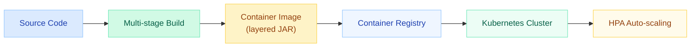
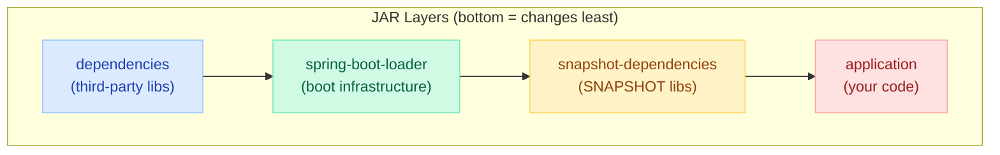
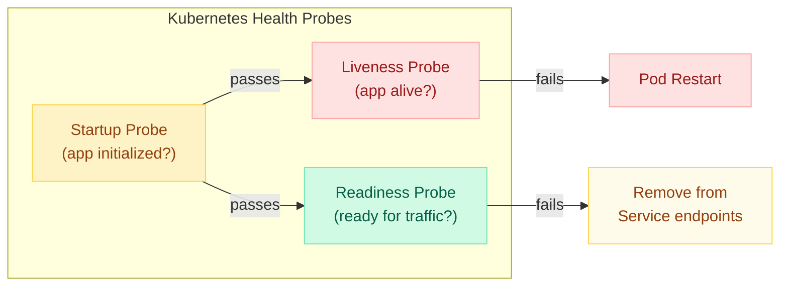
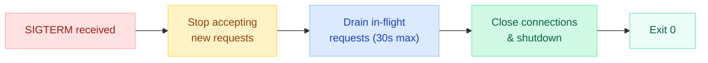

# Docker & Kubernetes with Spring Boot

> **Containerize once, deploy everywhere — from local Docker to production Kubernetes clusters with confidence.**

---

!!! failure "The OOM Kill That Broke Production"
    A Spring Boot app with `-Xmx512m` was deployed to a Kubernetes pod with a `256Mi` memory limit. The JVM didn't respect the container's cgroup memory — it tried to allocate 512MB, the kernel OOM-killed the pod, and Kubernetes kept restarting it in a crash loop. The fix: use `-XX:+UseContainerSupport` (default since JDK 10) and `-XX:MaxRAMPercentage=75.0` so the JVM **reads cgroup limits** instead of host memory.



---

## Docker for Spring Boot

### Multi-Stage Dockerfile (Best Practice)

```dockerfile
# Stage 1: Build
FROM eclipse-temurin:21-jdk AS builder
WORKDIR /app
COPY .mvn/ .mvn/
COPY mvnw pom.xml ./
RUN ./mvnw dependency:resolve          # Cache dependencies layer
COPY src/ src/
RUN ./mvnw package -DskipTests -Dspring-boot.build-image.skip=true

# Stage 2: Extract layers
FROM eclipse-temurin:21-jdk AS extractor
WORKDIR /app
COPY --from=builder /app/target/*.jar app.jar
RUN java -Djarmode=layertools -jar app.jar extract

# Stage 3: Runtime (minimal)
FROM eclipse-temurin:21-jre
WORKDIR /app
COPY --from=extractor /app/dependencies/ ./
COPY --from=extractor /app/spring-boot-loader/ ./
COPY --from=extractor /app/snapshot-dependencies/ ./
COPY --from=extractor /app/application/ ./

EXPOSE 8080
ENTRYPOINT ["java", \
  "-XX:+UseContainerSupport", \
  "-XX:MaxRAMPercentage=75.0", \
  "org.springframework.boot.loader.launch.JarLauncher"]
```

!!! tip "Why Three Stages?"
    - **Stage 1** builds the JAR (includes JDK + Maven — large)
    - **Stage 2** extracts layers (temporary)
    - **Stage 3** only has JRE + application layers — final image is ~250MB instead of 800MB+

---

### Layered JARs (spring-boot-jarmode-layertools)

Spring Boot 2.3+ splits the fat JAR into **ordered layers** that align with Docker's caching model.



**Why layer order matters for caching:**

| Layer | Changes | Docker Cache Hit |
|-------|---------|-----------------|
| dependencies | Rarely (only on `pom.xml` change) | Almost always cached |
| spring-boot-loader | Almost never | Always cached |
| snapshot-dependencies | Occasionally | Usually cached |
| application | Every commit | Rebuilt each time |

Result: typical rebuild only re-layers your application code — **push goes from 200MB to 5MB**.

```bash
# Inspect layers
java -Djarmode=layertools -jar target/myapp.jar list

# Extract for Dockerfile COPY
java -Djarmode=layertools -jar target/myapp.jar extract
```

---

### Cloud Native Buildpacks (No Dockerfile Needed)

```bash
# Build OCI image directly — no Dockerfile required
./mvnw spring-boot:build-image \
  -Dspring-boot.build-image.imageName=myregistry/myapp:latest
```

```xml
<!-- pom.xml configuration -->
<plugin>
    <groupId>org.springframework.boot</groupId>
    <artifactId>spring-boot-maven-plugin</artifactId>
    <configuration>
        <image>
            <name>myregistry/${project.artifactId}:${project.version}</name>
            <env>
                <BP_JVM_VERSION>21</BP_JVM_VERSION>
                <BPE_JAVA_TOOL_OPTIONS>-XX:MaxRAMPercentage=75.0</BPE_JAVA_TOOL_OPTIONS>
            </env>
        </image>
    </configuration>
</plugin>
```

!!! info "Buildpacks vs Dockerfile"
    | Aspect | Buildpacks | Dockerfile |
    |--------|-----------|------------|
    | Maintenance | Auto-patches base image CVEs | Manual rebuild needed |
    | Reproducibility | Deterministic builds | Depends on `FROM` tag stability |
    | Customization | Limited (env vars) | Full control |
    | Layer optimization | Automatic | Manual layering |
    | Build speed | Slower first build | Faster with cache |

---

### JVM Container Awareness

Since JDK 10, the JVM respects cgroup limits **by default** — but you must configure it correctly.

```bash
# Key flags for containers
java \
  -XX:+UseContainerSupport \          # Default ON since JDK 10
  -XX:MaxRAMPercentage=75.0 \         # Use 75% of container memory for heap
  -XX:InitialRAMPercentage=50.0 \     # Start at 50% to reduce GC pressure
  -XX:+UseG1GC \                      # Best for containers (predictable pauses)
  -XX:MaxGCPauseMillis=200 \
  -jar app.jar
```

!!! warning "Common Memory Mistakes"
    | Mistake | Problem | Fix |
    |---------|---------|-----|
    | `-Xmx512m` in 256Mi container | OOM Kill | Use `-XX:MaxRAMPercentage=75.0` |
    | 100% RAM for heap | No room for metaspace, threads, NIO buffers | Keep at 75% |
    | Ignoring non-heap memory | Thread stacks (1MB each) + metaspace (64-256MB) | Budget: heap = 75%, rest = 25% |
    | Old JDK (< 10) in container | JVM reads host memory, not cgroup | Upgrade or use `-Xmx` carefully |

**Memory budget for a 512Mi container:**

```
Total: 512MB
├── Heap (75%):       384MB (-XX:MaxRAMPercentage=75.0)
├── Metaspace:         64MB (-XX:MaxMetaspaceSize=64m)
├── Thread stacks:     40MB (~40 threads × 1MB)
├── Code cache:        12MB
└── NIO/Direct:        12MB
                      ─────
                      512MB
```

---

### Image Size Optimization

| Base Image | Size | Use Case |
|-----------|------|----------|
| `eclipse-temurin:21-jdk` | ~460MB | Build stage only |
| `eclipse-temurin:21-jre` | ~270MB | Standard runtime |
| `eclipse-temurin:21-jre-alpine` | ~130MB | Size-optimized runtime |
| `gcr.io/distroless/java21` | ~220MB | Security-hardened (no shell) |
| Custom JRE (jlink) | ~80-100MB | Minimal custom runtime |

```bash
# Create custom minimal JRE with jlink
jlink --add-modules java.base,java.logging,java.sql,java.naming,java.management,java.instrument \
      --strip-debug --no-man-pages --no-header-files \
      --compress=2 --output /custom-jre

# Result: ~50MB JRE with only what Spring Boot needs
```

```dockerfile
# Ultra-minimal with jlink
FROM eclipse-temurin:21-jdk AS jre-builder
RUN jlink --add-modules java.base,java.logging,java.sql,java.naming,\
java.management,java.instrument,java.desktop,java.security.jgss \
    --strip-debug --no-man-pages --compress=2 --output /opt/jre

FROM debian:bookworm-slim
COPY --from=jre-builder /opt/jre /opt/jre
ENV PATH="/opt/jre/bin:$PATH"
COPY --from=builder /app/target/*.jar /app/app.jar
ENTRYPOINT ["java", "-XX:MaxRAMPercentage=75.0", "-jar", "/app/app.jar"]
```

---

## Kubernetes for Spring Boot

### Liveness vs Readiness vs Startup Probes



| Probe | Purpose | Fails → | Spring Boot Actuator |
|-------|---------|---------|---------------------|
| **Startup** | Wait for slow initialization | Block liveness/readiness checks | `/actuator/health/liveness` |
| **Liveness** | Detect deadlocks, infinite loops | **Restart** the pod | `/actuator/health/liveness` |
| **Readiness** | Detect temporary unavailability (DB down, warming cache) | **Remove** from load balancer | `/actuator/health/readiness` |

```yaml
# application.yml — enable probe endpoints
management:
  endpoint:
    health:
      probes:
        enabled: true
      group:
        liveness:
          include: livenessState
        readiness:
          include: readinessState, db, redis
  health:
    livenessstate:
      enabled: true
    readinessstate:
      enabled: true
```

!!! danger "Probe Anti-Patterns"
    - **Liveness checks the database** → DB goes down → all pods restart → cascading failure. Liveness should only check if the process is stuck.
    - **No startup probe for slow apps** → Liveness kills pod before it finishes starting → infinite restart loop.
    - **Readiness same as liveness** → Readiness failure restarts pods instead of just removing from LB.

---

### Graceful Shutdown

When Kubernetes sends SIGTERM, the app must finish in-flight requests before dying.

```yaml
# application.yml
server:
  shutdown: graceful                    # Wait for active requests to complete

spring:
  lifecycle:
    timeout-per-shutdown-phase: 30s     # Max 30s to drain
```



```yaml
# Deployment — add preStop hook for safety
spec:
  containers:
    - name: myapp
      lifecycle:
        preStop:
          exec:
            command: ["sh", "-c", "sleep 5"]  # Wait for LB to deregister
  terminationGracePeriodSeconds: 45           # Must be > shutdown-phase + preStop
```

!!! tip "Why preStop sleep?"
    There's a race condition: Kubernetes sends SIGTERM and removes the pod from Service endpoints **simultaneously**. During that brief window, the load balancer might still route traffic to the dying pod. The `sleep 5` in preStop ensures the LB has time to deregister before the app starts refusing connections.

---

### ConfigMaps and Secrets (spring-cloud-kubernetes)

```xml
<!-- pom.xml -->
<dependency>
    <groupId>org.springframework.cloud</groupId>
    <artifactId>spring-cloud-starter-kubernetes-client-config</artifactId>
</dependency>
```

```yaml
# application.yml
spring:
  cloud:
    kubernetes:
      config:
        enabled: true
        name: myapp-config         # ConfigMap name
        namespace: production
      secrets:
        enabled: true
        name: myapp-secrets        # Secret name
      reload:
        enabled: true              # Hot-reload on ConfigMap changes
        strategy: refresh          # Or restart_context for full reload
        mode: event                # Watch for changes (vs polling)
```

```yaml
# ConfigMap (myapp-config.yaml)
apiVersion: v1
kind: ConfigMap
metadata:
  name: myapp-config
data:
  application.yml: |
    app:
      feature-flag: true
      cache-ttl: 300
      external-service-url: https://api.example.com
```

```yaml
# Secret (myapp-secrets.yaml)
apiVersion: v1
kind: Secret
metadata:
  name: myapp-secrets
type: Opaque
stringData:
  spring.datasource.password: "s3cr3t-db-pass"
  app.jwt-secret: "hmac-256-secret-key"
```

---

### Resource Limits — How to Size for JVM

```yaml
resources:
  requests:
    memory: "512Mi"    # Guaranteed minimum
    cpu: "250m"        # 0.25 CPU cores
  limits:
    memory: "512Mi"    # Hard cap (OOM kill if exceeded)
    cpu: "1000m"       # Throttled if exceeded (not killed)
```

!!! warning "JVM Memory Sizing Formula"
    ```
    Container Memory Limit = Heap + Non-Heap + Safety Margin
    
    Where:
      Heap = MaxRAMPercentage × Container Limit (use 75%)
      Non-Heap = Metaspace (64-128MB) + Threads (N × 1MB) + CodeCache + DirectBuffers
      Safety Margin = 10-15% of total
    
    Example: 200 threads, 96MB metaspace
      Non-Heap ≈ 200MB + 96MB + 48MB = 344MB
      Total needed = Heap(384MB) + Non-Heap(344MB) ≈ 768Mi
      Set limit: 768Mi, MaxRAMPercentage=50% → Heap=384MB
    ```

| Workload Type | Memory Request/Limit | CPU Request | CPU Limit |
|--------------|---------------------|-------------|-----------|
| Light API (low traffic) | 256Mi / 256Mi | 100m | 500m |
| Standard API | 512Mi / 512Mi | 250m | 1000m |
| Heavy processing | 1Gi / 1Gi | 500m | 2000m |
| Batch/Data pipeline | 2Gi / 2Gi | 1000m | 4000m |

!!! tip "CPU: Requests vs Limits"
    - **Set requests = limits for memory** (prevent OOM from overcommit)
    - **Set CPU limit > request** (allow bursting) — CPU throttling is recoverable, unlike OOM
    - Never set CPU limit = request for JVM apps — JIT compilation needs CPU bursts at startup

---

### HPA (Horizontal Pod Autoscaler) with Custom Metrics

```yaml
apiVersion: autoscaling/v2
kind: HorizontalPodAutoscaler
metadata:
  name: myapp-hpa
spec:
  scaleTargetRef:
    apiVersion: apps/v1
    kind: Deployment
    name: myapp
  minReplicas: 2
  maxReplicas: 10
  metrics:
    # CPU-based (default)
    - type: Resource
      resource:
        name: cpu
        target:
          type: Utilization
          averageUtilization: 70

    # Memory-based
    - type: Resource
      resource:
        name: memory
        target:
          type: Utilization
          averageUtilization: 80

    # Custom metric (requests per second via Prometheus)
    - type: Pods
      pods:
        metric:
          name: http_requests_per_second
        target:
          type: AverageValue
          averageValue: "1000"

  behavior:
    scaleUp:
      stabilizationWindowSeconds: 30    # React quickly
      policies:
        - type: Pods
          value: 2
          periodSeconds: 60             # Add max 2 pods per minute
    scaleDown:
      stabilizationWindowSeconds: 300   # Wait 5 min before scaling down
      policies:
        - type: Pods
          value: 1
          periodSeconds: 60             # Remove 1 pod per minute
```

!!! tip "JVM + HPA Best Practices"
    - **Don't scale on CPU alone** — JIT warmup causes CPU spikes that trigger false scale-ups
    - **Use custom metrics** (request rate, queue depth, latency p99) for better signals
    - **Set stabilization windows** — JVM apps take time to warm up; aggressive scale-down wastes that warmup
    - **Scale on readiness** — new pods only receive traffic after passing readiness probe

---

### Rolling Updates with Zero Downtime

```yaml
apiVersion: apps/v1
kind: Deployment
metadata:
  name: myapp
spec:
  replicas: 3
  strategy:
    type: RollingUpdate
    rollingUpdate:
      maxSurge: 1          # 1 extra pod during rollout
      maxUnavailable: 0    # Never reduce below desired count
  template:
    spec:
      containers:
        - name: myapp
          image: myregistry/myapp:2.0.0
          ports:
            - containerPort: 8080
          startupProbe:
            httpGet:
              path: /actuator/health/liveness
              port: 8080
            initialDelaySeconds: 10
            periodSeconds: 5
            failureThreshold: 30       # 10 + (5×30) = 160s max startup
          livenessProbe:
            httpGet:
              path: /actuator/health/liveness
              port: 8080
            periodSeconds: 10
            failureThreshold: 3
          readinessProbe:
            httpGet:
              path: /actuator/health/readiness
              port: 8080
            periodSeconds: 5
            failureThreshold: 3
          resources:
            requests:
              memory: "512Mi"
              cpu: "250m"
            limits:
              memory: "512Mi"
              cpu: "1000m"
          env:
            - name: JAVA_TOOL_OPTIONS
              value: "-XX:MaxRAMPercentage=75.0 -XX:+UseG1GC"
          lifecycle:
            preStop:
              exec:
                command: ["sh", "-c", "sleep 5"]
      terminationGracePeriodSeconds: 45
```

**Zero-downtime checklist:**

- [x] `maxUnavailable: 0` — always maintain full capacity
- [x] Startup probe — don't kill slow-starting JVM pods
- [x] Readiness probe — only send traffic to warm pods
- [x] Graceful shutdown — drain in-flight requests
- [x] preStop sleep — allow LB deregistration
- [x] `terminationGracePeriodSeconds` > shutdown timeout + preStop

---

## Architecture: Build, Image, Deploy, Scale

```mermaid
flowchart LR
    subgraph Build["Build Phase"]
        CODE["Push Code"] --> CI["CI Pipeline"]
        CI --> TEST["Run Tests"]
        TEST --> PACKAGE["Build JAR"]
        PACKAGE --> DOCKER["Docker Build"]
    end

    subgraph Image["Image Phase"]
        DOCKER --> SCAN["CVE Scan"]
        SCAN --> PUSH["Push Registry"]
    end

    subgraph Deploy["Deploy Phase"]
        PUSH --> MANIFEST["Apply Manifests"]
        MANIFEST --> ROLLING["Rolling Update"]
        ROLLING --> HEALTH["Health Check"]
    end

    subgraph Scale["Scale Phase"]
        HEALTH --> HPA["HPA Monitor"]
        HPA --> REPLICAS["Scale Pods"]
        REPLICAS --> LB["Load Balance"]
    end

    style CODE fill:#DBEAFE,stroke:#93C5FD,color:#1E40AF
    style CI fill:#DBEAFE,stroke:#93C5FD,color:#1E40AF
    style TEST fill:#D1FAE5,stroke:#6EE7B7,color:#065F46
    style PACKAGE fill:#D1FAE5,stroke:#6EE7B7,color:#065F46
    style DOCKER fill:#D1FAE5,stroke:#6EE7B7,color:#065F46
    style SCAN fill:#FEF3C7,stroke:#FCD34D,color:#92400E
    style PUSH fill:#FEF3C7,stroke:#FCD34D,color:#92400E
    style MANIFEST fill:#EFF6FF,stroke:#93C5FD,color:#1E40AF
    style ROLLING fill:#ECFDF5,stroke:#6EE7B7,color:#065F46
    style HEALTH fill:#ECFDF5,stroke:#6EE7B7,color:#065F46
    style HPA fill:#FFFBEB,stroke:#FCD34D,color:#92400E
    style REPLICAS fill:#FFFBEB,stroke:#FCD34D,color:#92400E
    style LB fill:#FEF2F2,stroke:#FCA5A5,color:#991B1B
```



---

## Complete Deployment YAML

```yaml
# namespace.yaml
apiVersion: v1
kind: Namespace
metadata:
  name: myapp-prod
---
# configmap.yaml
apiVersion: v1
kind: ConfigMap
metadata:
  name: myapp-config
  namespace: myapp-prod
data:
  SPRING_PROFILES_ACTIVE: "prod"
  SERVER_PORT: "8080"
  MANAGEMENT_SERVER_PORT: "8081"
---
# secret.yaml
apiVersion: v1
kind: Secret
metadata:
  name: myapp-secrets
  namespace: myapp-prod
type: Opaque
stringData:
  SPRING_DATASOURCE_URL: "jdbc:postgresql://db-host:5432/myapp"
  SPRING_DATASOURCE_USERNAME: "app_user"
  SPRING_DATASOURCE_PASSWORD: "encrypted-password"
---
# deployment.yaml
apiVersion: apps/v1
kind: Deployment
metadata:
  name: myapp
  namespace: myapp-prod
  labels:
    app: myapp
    version: v2.0.0
spec:
  replicas: 3
  selector:
    matchLabels:
      app: myapp
  strategy:
    type: RollingUpdate
    rollingUpdate:
      maxSurge: 1
      maxUnavailable: 0
  template:
    metadata:
      labels:
        app: myapp
        version: v2.0.0
      annotations:
        prometheus.io/scrape: "true"
        prometheus.io/port: "8081"
        prometheus.io/path: "/actuator/prometheus"
    spec:
      serviceAccountName: myapp-sa
      topologySpreadConstraints:
        - maxSkew: 1
          topologyKey: topology.kubernetes.io/zone
          whenUnsatisfiable: DoNotSchedule
          labelSelector:
            matchLabels:
              app: myapp
      containers:
        - name: myapp
          image: myregistry/myapp:2.0.0
          ports:
            - name: http
              containerPort: 8080
            - name: management
              containerPort: 8081
          envFrom:
            - configMapRef:
                name: myapp-config
            - secretRef:
                name: myapp-secrets
          env:
            - name: JAVA_TOOL_OPTIONS
              value: >-
                -XX:+UseContainerSupport
                -XX:MaxRAMPercentage=75.0
                -XX:+UseG1GC
                -XX:MaxGCPauseMillis=200
                -Dspring.config.additional-location=optional:configmap:myapp-config/
          startupProbe:
            httpGet:
              path: /actuator/health/liveness
              port: management
            initialDelaySeconds: 10
            periodSeconds: 5
            failureThreshold: 30
          livenessProbe:
            httpGet:
              path: /actuator/health/liveness
              port: management
            periodSeconds: 10
            failureThreshold: 3
          readinessProbe:
            httpGet:
              path: /actuator/health/readiness
              port: management
            periodSeconds: 5
            failureThreshold: 3
          resources:
            requests:
              memory: "512Mi"
              cpu: "250m"
            limits:
              memory: "512Mi"
              cpu: "1000m"
          lifecycle:
            preStop:
              exec:
                command: ["sh", "-c", "sleep 5"]
      terminationGracePeriodSeconds: 45
---
# service.yaml
apiVersion: v1
kind: Service
metadata:
  name: myapp-service
  namespace: myapp-prod
spec:
  selector:
    app: myapp
  ports:
    - name: http
      port: 80
      targetPort: http
    - name: management
      port: 8081
      targetPort: management
  type: ClusterIP
---
# hpa.yaml
apiVersion: autoscaling/v2
kind: HorizontalPodAutoscaler
metadata:
  name: myapp-hpa
  namespace: myapp-prod
spec:
  scaleTargetRef:
    apiVersion: apps/v1
    kind: Deployment
    name: myapp
  minReplicas: 2
  maxReplicas: 10
  metrics:
    - type: Resource
      resource:
        name: cpu
        target:
          type: Utilization
          averageUtilization: 70
  behavior:
    scaleDown:
      stabilizationWindowSeconds: 300
```

---

## Quick Recall

| Concept | Key Point |
|---------|-----------|
| Multi-stage Dockerfile | Build with JDK, run with JRE — 3x smaller images |
| Layered JARs | dependencies → loader → snapshots → app (cache-friendly order) |
| Buildpacks | `mvn spring-boot:build-image` — no Dockerfile, auto-patched CVEs |
| Container awareness | `-XX:MaxRAMPercentage=75.0` — JVM reads cgroup limits |
| Image optimization | Alpine (~130MB), distroless (~220MB), jlink (~80MB) |
| Startup probe | Protects slow JVM apps from premature liveness kills |
| Liveness probe | Only checks if process is stuck — never check external deps |
| Readiness probe | Checks DB, cache, warmup — controls LB traffic routing |
| Graceful shutdown | `server.shutdown=graceful` + `timeout-per-shutdown-phase=30s` |
| preStop hook | `sleep 5` — race condition fix for LB deregistration |
| Memory limits | Set requests = limits for memory (prevent OOM overcommit) |
| CPU limits | Set limit > request — allow JIT burst at startup |
| HPA | Custom metrics (RPS, latency) better than CPU for JVM apps |
| Rolling update | `maxUnavailable: 0` + probes = zero-downtime deployments |
| spring-cloud-kubernetes | Auto-load ConfigMaps/Secrets, hot-reload on changes |

---

## Interview Quick-Fire Template

??? note "Q: Your Spring Boot pod keeps getting OOM-killed. How do you debug?"
    1. Check `kubectl describe pod` — look for `OOMKilled` exit code (137)
    2. Compare JVM heap (`-Xmx` or `MaxRAMPercentage`) vs container memory limit
    3. Account for non-heap: metaspace + thread stacks + direct buffers + code cache
    4. Fix: Use `-XX:MaxRAMPercentage=75.0` (not `-Xmx`) so JVM respects cgroup
    5. Monitor with `/actuator/metrics/jvm.memory.used` and `jvm.memory.max`
    6. Set memory request = limit to avoid overcommit surprises

??? note "Q: Explain the difference between liveness and readiness probes."
    - **Liveness**: "Is the process alive?" Checks for deadlocks, infinite loops. Failure = pod restart. Should NOT check external dependencies.
    - **Readiness**: "Can the pod handle traffic?" Checks DB connections, cache warmup, downstream services. Failure = removed from Service endpoints (no traffic), NOT restarted.
    - **Key mistake**: Putting DB check in liveness → DB blip restarts all pods → cascade failure. DB should be in readiness only.

??? note "Q: How do you achieve zero-downtime deployments?"
    Five requirements:
    
    1. **Rolling update** with `maxUnavailable: 0` — never reduce capacity
    2. **Startup probe** — give JVM time to initialize without being killed
    3. **Readiness probe** — only route traffic to fully-warmed pods
    4. **Graceful shutdown** — drain in-flight requests on SIGTERM
    5. **preStop hook** (`sleep 5`) — allow load balancer to deregister pod before app stops accepting connections
    
    Bonus: `terminationGracePeriodSeconds` must exceed `preStop` + `timeout-per-shutdown-phase`

??? note "Q: Why use layered JARs instead of a single fat JAR in Docker?"
    Docker images are built in layers. A fat JAR is one layer — any code change rebuilds the entire 200MB layer. Layered JARs split into 4 layers ordered by change frequency:
    
    - `dependencies` (rarely changes) — cached almost always
    - `spring-boot-loader` (almost never changes) — always cached
    - `snapshot-dependencies` (occasionally) — usually cached
    - `application` (every commit) — only this rebuilds
    
    Result: pushes drop from 200MB to ~5MB, CI/CD is 10x faster.

??? note "Q: When would you use Buildpacks vs a custom Dockerfile?"
    **Buildpacks** when: you want auto-patched base images, deterministic builds, minimal Docker expertise on team, standard Spring Boot app.
    
    **Custom Dockerfile** when: you need jlink (minimal JRE), multi-arch builds, non-standard native libraries, specific OS requirements, full control over layers, or you're integrating with a legacy build system.

??? note "Q: How do you size memory limits for a JVM pod?"
    Formula: `Container Limit = Heap + Non-Heap + Safety Margin`
    
    - **Heap**: 50-75% of container limit (via `-XX:MaxRAMPercentage`)
    - **Non-Heap**: Metaspace (64-128MB) + Threads (N × 1MB) + CodeCache (~48MB) + DirectBuffers
    - **Safety**: 10-15%
    
    Example: 100 threads, 96MB metaspace, heap=384MB → Total ~600Mi
    
    Key rule: **memory request = limit** for JVM. If the kernel overcommits and later reclaims, your JVM gets OOM-killed mid-request.
