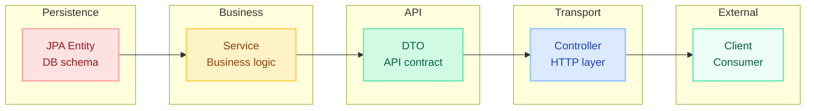
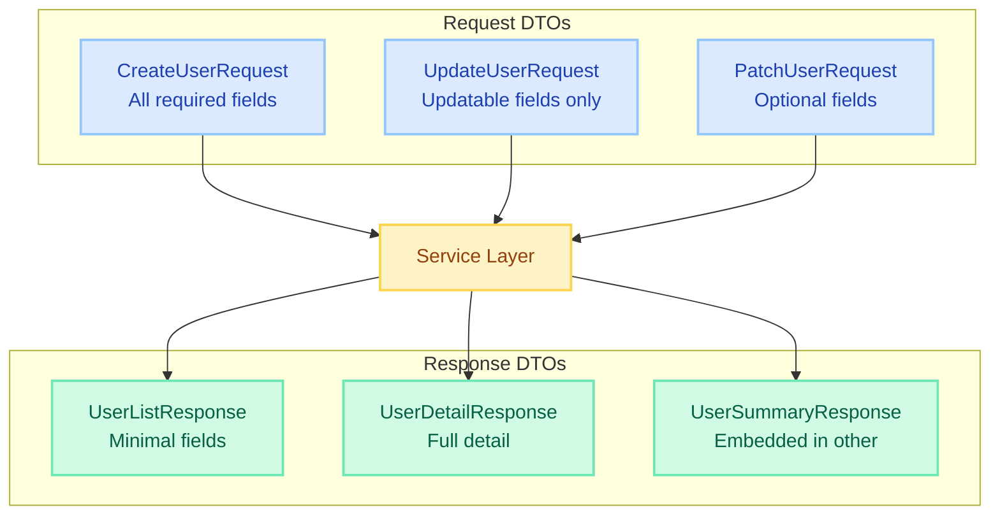
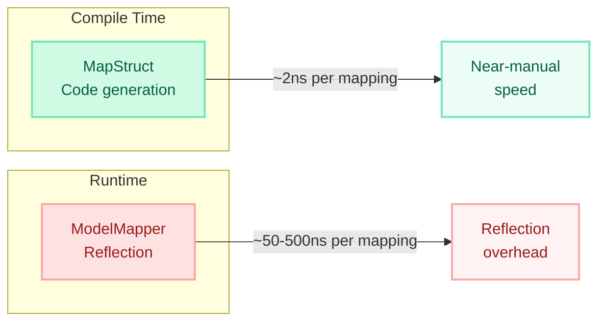

# Entity-to-DTO Mapping

> **Never expose JPA entities directly in your API. Use DTOs to decouple your persistence model from your API contract — preventing accidental data leaks, lazy-loading explosions, and tight coupling.**

---

!!! danger "What Happens Without DTOs"
    Exposing an entity directly in a REST response can **leak sensitive fields** (password hash, internal IDs, audit columns) and trigger **LazyInitializationException** when Jackson tries to serialize unloaded proxies outside a Hibernate session. One missing `@JsonIgnore` and your users' password hashes are in the response body.


---

## Why DTOs — Separation of Concerns



| Benefit | Explanation |
|---|---|
| **Security** | Sensitive fields (password, SSN) never reach the API layer |
| **Stability** | DB schema changes don't break API consumers |
| **Flexibility** | Different DTOs for create, update, list, detail views |
| **Performance** | Return only what the client needs; avoid N+1 via projections |
| **Validation** | Request DTOs carry validation annotations; entities stay clean |
| **Versioning** | Evolve API independently of the domain model |

---

## Manual Mapping vs MapStruct vs ModelMapper

| Criteria | Manual Mapping | MapStruct | ModelMapper |
|---|---|---|---|
| **Approach** | Hand-written code | Compile-time code gen | Runtime reflection |
| **Performance** | Fastest (direct calls) | Near-manual speed | 5-25x slower |
| **Type safety** | Full (compile errors) | Full (compile errors) | None (runtime failures) |
| **Boilerplate** | High | Low (interfaces only) | Low (convention-based) |
| **Debugging** | Easy (your code) | Easy (generated source) | Hard (reflection stack) |
| **Nested objects** | Manual recursion | Automatic | Automatic |
| **Custom logic** | Inline code | @AfterMapping / expression | Converters |
| **Build dependency** | None | Annotation processor | Runtime library |
| **Best for** | Simple mappings, 1-3 fields | Production applications | Prototyping |

---

## MapStruct Deep Dive

### Setup (Maven)

```xml
<dependency>
    <groupId>org.mapstruct</groupId>
    <artifactId>mapstruct</artifactId>
    <version>1.5.5.Final</version>
</dependency>

<plugin>
    <groupId>org.apache.maven.plugins</groupId>
    <artifactId>maven-compiler-plugin</artifactId>
    <configuration>
        <annotationProcessorPaths>
            <path>
                <groupId>org.mapstruct</groupId>
                <artifactId>mapstruct-processor</artifactId>
                <version>1.5.5.Final</version>
            </path>
            <!-- If using Lombok, add lombok-mapstruct-binding -->
            <path>
                <groupId>org.projectlombok</groupId>
                <artifactId>lombok-mapstruct-binding</artifactId>
                <version>0.2.0</version>
            </path>
        </annotationProcessorPaths>
    </configuration>
</plugin>
```

### Basic @Mapper

```java
@Mapper(componentModel = "spring")
public interface UserMapper {

    UserResponse toResponse(User entity);

    User toEntity(CreateUserRequest request);
}
```

With `componentModel = "spring"`, MapStruct generates a Spring `@Component`. Inject it anywhere:

```java
@Service
@RequiredArgsConstructor
public class UserService {
    private final UserMapper userMapper;
    private final UserRepository userRepository;

    public UserResponse createUser(CreateUserRequest request) {
        User entity = userMapper.toEntity(request);
        User saved = userRepository.save(entity);
        return userMapper.toResponse(saved);
    }
}
```

### @Mapping — Field Name Differences

```java
@Mapper(componentModel = "spring")
public interface OrderMapper {

    @Mapping(source = "customer.fullName", target = "customerName")
    @Mapping(source = "createdAt", target = "orderDate", dateFormat = "yyyy-MM-dd")
    @Mapping(target = "totalFormatted", expression = "java(\"$\" + order.getTotal())")
    @Mapping(target = "id", ignore = true)
    OrderResponse toResponse(Order order);
}
```

### Nested Object Mapping

MapStruct automatically uses another mapper method if one exists for the nested type:

```java
@Mapper(componentModel = "spring")
public interface OrderMapper {

    OrderResponse toResponse(Order order);

    OrderItemResponse toItemResponse(OrderItem item);

    // MapStruct auto-maps List<OrderItem> → List<OrderItemResponse>
    // by calling toItemResponse() for each element
}
```

### Collection Mapping

```java
@Mapper(componentModel = "spring")
public interface ProductMapper {

    ProductResponse toResponse(Product product);

    List<ProductResponse> toResponseList(List<Product> products);

    Set<TagResponse> toTagResponses(Set<Tag> tags);
}
```

### Custom Methods — @AfterMapping and @BeforeMapping

```java
@Mapper(componentModel = "spring")
public abstract class UserMapper {

    @Mapping(target = "displayName", ignore = true)
    @Mapping(target = "ageGroup", ignore = true)
    public abstract UserResponse toResponse(User user);

    @AfterMapping
    protected void enrichResponse(User user, @MappingTarget UserResponse response) {
        response.setDisplayName(user.getFirstName() + " " + user.getLastName());
        response.setAgeGroup(calculateAgeGroup(user.getDateOfBirth()));
    }

    @BeforeMapping
    protected void validate(User user) {
        if (user.getEmail() == null) {
            throw new IllegalArgumentException("User email must not be null");
        }
    }

    private String calculateAgeGroup(LocalDate dob) {
        int age = Period.between(dob, LocalDate.now()).getYears();
        if (age < 18) return "MINOR";
        if (age < 65) return "ADULT";
        return "SENIOR";
    }
}
```

### Expression-Based Mapping

```java
@Mapper(componentModel = "spring", imports = {UUID.class, Instant.class})
public interface AuditMapper {

    @Mapping(target = "id", expression = "java(UUID.randomUUID().toString())")
    @Mapping(target = "timestamp", expression = "java(Instant.now())")
    @Mapping(target = "fullAddress",
             expression = "java(entity.getStreet() + \", \" + entity.getCity())")
    AuditResponse toResponse(AuditEntity entity);
}
```

### Null Handling and Default Values

```java
@Mapper(componentModel = "spring",
        nullValuePropertyMappingStrategy = NullValuePropertyMappingStrategy.IGNORE,
        nullValueMappingStrategy = NullValueMappingStrategy.RETURN_DEFAULT)
public interface PatchMapper {

    @Mapping(target = "status", defaultValue = "ACTIVE")
    @Mapping(target = "priority", defaultExpression = "java(Priority.NORMAL)")
    @Mapping(target = "tags", nullValuePropertyMappingStrategy = NullValuePropertyMappingStrategy.SET_TO_DEFAULT)
    void updateEntity(PatchRequest request, @MappingTarget Task entity);
}
```

| Strategy | Behavior |
|---|---|
| `SET_TO_NULL` | If source is null, set target to null |
| `SET_TO_DEFAULT` | If source is null, set target to default (empty list, 0, etc.) |
| `IGNORE` | If source is null, leave target unchanged (great for PATCH) |

### Inheritance Mapping

```java
@Mapper(componentModel = "spring")
public interface VehicleMapper {

    @SubclassMapping(source = Car.class, target = CarResponse.class)
    @SubclassMapping(source = Truck.class, target = TruckResponse.class)
    VehicleResponse toResponse(Vehicle vehicle);

    CarResponse toCarResponse(Car car);
    TruckResponse toTruckResponse(Truck truck);
}
```

For shared mapping config across multiple mappers:

```java
@MapperConfig(
    componentModel = "spring",
    nullValuePropertyMappingStrategy = NullValuePropertyMappingStrategy.IGNORE
)
public interface CentralConfig {}

@Mapper(config = CentralConfig.class)
public interface UserMapper { /* ... */ }

@Mapper(config = CentralConfig.class)
public interface OrderMapper { /* ... */ }
```

---

## Records as DTOs (Java 16+)

Java records are ideal DTOs: immutable, compact, and serialization-friendly.

```java
// Response DTO — immutable, auto-generates equals/hashCode/toString
public record UserResponse(
    Long id,
    String username,
    String email,
    String displayName,
    LocalDate joinedAt
) {
    // Compact constructor for validation/transformation
    public UserResponse {
        Objects.requireNonNull(username, "username must not be null");
        email = email.toLowerCase();
    }

    // Factory method for mapping
    public static UserResponse from(User entity) {
        return new UserResponse(
            entity.getId(),
            entity.getUsername(),
            entity.getEmail(),
            entity.getFirstName() + " " + entity.getLastName(),
            entity.getCreatedAt().toLocalDate()
        );
    }
}
```

**Why records over classes for DTOs:**

| Feature | Record | Class (Lombok @Value) |
|---|---|---|
| Immutability | Enforced by language | Enforced by annotation |
| Boilerplate | Zero | Near-zero with Lombok |
| Serialization | Jackson supports natively | Jackson supports natively |
| Pattern matching | Yes (Java 21+) | No |
| Inheritance | No (final) | No (@Value is final) |
| Builder support | Manual or @Builder | @Builder via Lombok |

**MapStruct + Records** works out of the box since MapStruct 1.5:

```java
@Mapper(componentModel = "spring")
public interface UserMapper {
    UserResponse toResponse(User entity);  // MapStruct uses record constructor
}
```

---

## Request DTO vs Response DTO Pattern



```java
// Request: what the client sends (validated, minimal)
public record CreateUserRequest(
    @NotBlank @Size(min = 3, max = 30) String username,
    @NotBlank @Email String email,
    @NotBlank @Size(min = 8) String password,
    @NotNull LocalDate dateOfBirth
) {}

// Request: update (no password, no username change)
public record UpdateUserRequest(
    @NotBlank @Email String email,
    @Size(max = 100) String bio,
    @Valid AddressRequest address
) {}

// Response: what the client receives (no secrets, computed fields)
public record UserDetailResponse(
    Long id,
    String username,
    String email,
    String bio,
    String avatarUrl,
    LocalDate joinedAt,
    int postCount,        // computed
    String memberSince    // formatted
) {}

// Response: lightweight for lists
public record UserListResponse(
    Long id,
    String username,
    String avatarUrl
) {}
```

**Key principle:** Request DTOs define what you accept. Response DTOs define what you expose. They evolve independently.

---

## Validation on Request DTOs

Combine `@Valid` with JSR-380 annotations on request DTOs. The controller rejects invalid input before it reaches the service layer.

```java
@RestController
@RequestMapping("/api/orders")
@RequiredArgsConstructor
public class OrderController {

    private final OrderService orderService;

    @PostMapping
    public ResponseEntity<OrderResponse> createOrder(
            @Valid @RequestBody CreateOrderRequest request) {
        return ResponseEntity.status(HttpStatus.CREATED)
                .body(orderService.create(request));
    }
}

public record CreateOrderRequest(
    @NotNull Long customerId,

    @NotEmpty(message = "Order must have at least one item")
    @Size(max = 50, message = "Maximum 50 items per order")
    List<@Valid OrderItemRequest> items,

    @NotNull ShippingMethod shippingMethod,

    @Valid @NotNull AddressRequest shippingAddress
) {}

public record OrderItemRequest(
    @NotNull Long productId,
    @Positive int quantity,
    @Size(max = 200) String specialInstructions
) {}
```

Validation errors return a structured 400 response (see the Validation page for error handling patterns).

---

## Projection Interfaces (Spring Data JPA)

A lightweight alternative to DTOs for read-only queries. Spring Data generates the implementation at runtime.

### Closed Projections (interface-based)

```java
// Only these columns are fetched from DB — optimal SELECT
public interface UserSummaryProjection {
    Long getId();
    String getUsername();
    String getEmail();
}

public interface UserRepository extends JpaRepository<User, Long> {

    List<UserSummaryProjection> findByStatus(UserStatus status);

    @Query("SELECT u.id as id, u.username as username, u.email as email " +
           "FROM User u WHERE u.department = :dept")
    List<UserSummaryProjection> findSummariesByDepartment(@Param("dept") String dept);
}
```

### Open Projections (with SpEL)

```java
public interface UserDisplayProjection {
    String getFirstName();
    String getLastName();

    @Value("#{target.firstName + ' ' + target.lastName}")
    String getFullName();
}
```

### Class-Based Projections (DTO in query)

```java
public record UserStats(Long id, String username, long postCount) {}

public interface UserRepository extends JpaRepository<User, Long> {

    @Query("SELECT new com.example.dto.UserStats(u.id, u.username, COUNT(p)) " +
           "FROM User u LEFT JOIN u.posts p GROUP BY u.id, u.username")
    List<UserStats> findUserStats();
}
```

### When to Use Projections vs DTOs

| Use Case | Projections | DTOs + Mapper |
|---|---|---|
| Simple read-only views | Preferred | Overkill |
| Complex transformations | Limited (SpEL only) | Full control |
| Write operations | Not applicable | Required |
| Multiple data sources | Not supported | Supported |
| Caching | Awkward (proxy objects) | Natural (serializable) |
| Testing | Hard to mock | Easy to construct |

---

## Performance Comparison



| Metric | MapStruct | ModelMapper | Manual |
|---|---|---|---|
| **Mechanism** | Compile-time code generation | Runtime reflection + caching | Hand-written |
| **Startup cost** | None (already compiled) | High (builds mapping plans) | None |
| **Per-mapping cost** | ~2-5 ns | ~50-500 ns | ~1-3 ns |
| **Memory** | Minimal (plain method calls) | Higher (reflection metadata) | Minimal |
| **100K mappings** | ~0.5 ms | ~25-50 ms | ~0.3 ms |
| **Type safety** | Compile-time errors | Runtime ClassCastException | Compile-time errors |
| **GC pressure** | Low | Higher (reflection objects) | Low |

**Verdict:** For production applications handling significant traffic, MapStruct is the clear winner — it combines the performance of manual mapping with the convenience of automatic code generation.

---

## Quick Recall

| Concept | Key Point |
|---|---|
| Why DTOs | Decouple API from DB schema; prevent data leaks |
| MapStruct | Compile-time code gen, `@Mapper(componentModel = "spring")` |
| @Mapping | Map different names: `source → target` |
| @AfterMapping | Post-processing hook on the generated mapper |
| Null strategy | `IGNORE` for PATCH, `SET_TO_DEFAULT` for safe defaults |
| Records as DTOs | Immutable, compact, works with MapStruct 1.5+ |
| Request vs Response DTO | Accept minimal input, expose computed output |
| Projections | Interface-based, Spring generates impl, read-only |
| Performance | MapStruct ~2ns vs ModelMapper ~50-500ns per mapping |

---

## Interview Questions

??? question "1. Why should you never expose JPA entities directly in REST responses?"
    Three risks: (1) **Security** — sensitive fields (password hash, internal flags) leak to clients. (2) **LazyInitializationException** — Jackson serializes proxied collections outside an open session. (3) **Tight coupling** — any DB schema change (rename column, add audit field) breaks your API contract. DTOs provide a stable, intentional API surface.

??? question "2. How does MapStruct work internally?"
    MapStruct is a Java annotation processor that runs at compile time. It reads `@Mapper` interfaces, inspects source/target types via the Java compiler's type system, and generates plain Java implementation classes with direct getter/setter calls. No reflection, no runtime bytecode generation. The generated code is visible in `target/generated-sources`.

??? question "3. What is the difference between MapStruct and ModelMapper?"
    MapStruct generates code at compile time — type-safe, fast, debuggable. ModelMapper uses runtime reflection — flexible but slower (5-25x), harder to debug, and fails at runtime instead of compile time. MapStruct catches mapping errors during build; ModelMapper may silently map wrong fields due to naming conventions.

??? question "4. How do you handle PATCH updates with MapStruct?"
    Use `@MappingTarget` with `nullValuePropertyMappingStrategy = IGNORE`. MapStruct generates code that only sets fields when the source is non-null, leaving existing values intact for null fields in the request.
    ```java
    @Mapper(componentModel = "spring",
            nullValuePropertyMappingStrategy = NullValuePropertyMappingStrategy.IGNORE)
    public interface TaskMapper {
        void updateEntity(PatchTaskRequest request, @MappingTarget Task entity);
    }
    ```

??? question "5. How do you map between different field names?"
    Use `@Mapping(source = "fieldA", target = "fieldB")`. For nested fields: `@Mapping(source = "address.city", target = "cityName")`. For constants: `@Mapping(target = "type", constant = "USER")`. For expressions: `@Mapping(target = "fullName", expression = "java(first + \" \" + last)")`.

??? question "6. Explain the Request DTO vs Response DTO pattern."
    Request DTOs define what you accept — validated, minimal, no IDs for creation. Response DTOs define what you expose — computed fields, formatted values, no secrets. They evolve independently. A single entity might have `CreateRequest`, `UpdateRequest`, `PatchRequest`, `DetailResponse`, `ListResponse`, and `SummaryResponse` DTOs.

??? question "7. What are Spring Data JPA projections and when should you use them?"
    Interface-based projections let Spring generate implementations that only fetch declared fields from the DB. Use for simple read-only queries where a full DTO + mapper is overkill. Limitations: no complex transformations, no write support, harder to test/mock (proxy objects), and only work within the Spring Data repository layer.

??? question "8. How does MapStruct handle collections and nested objects?"
    If you define a mapping method for a type, MapStruct automatically uses it when that type appears in a collection or as a nested field. For `List<Order>` → `List<OrderResponse>`, define `OrderResponse toResponse(Order order)` and MapStruct generates the list iteration. No explicit list-mapping method needed (though you can add one for clarity).

??? question "9. How do you share mapping configuration across multiple mappers?"
    Use `@MapperConfig` to define shared settings (component model, null strategies, naming conventions). Apply via `@Mapper(config = SharedConfig.class)`. You can also define common mapping methods in abstract classes that concrete mappers extend.

??? question "10. When would you choose manual mapping over MapStruct?"
    When you have very few DTOs (1-3), extremely simple mappings, or when adding an annotation processor to the build is unacceptable (some minimal library projects). Also when mapping logic is highly dynamic or depends on runtime state that cannot be expressed in MapStruct's annotation model.
