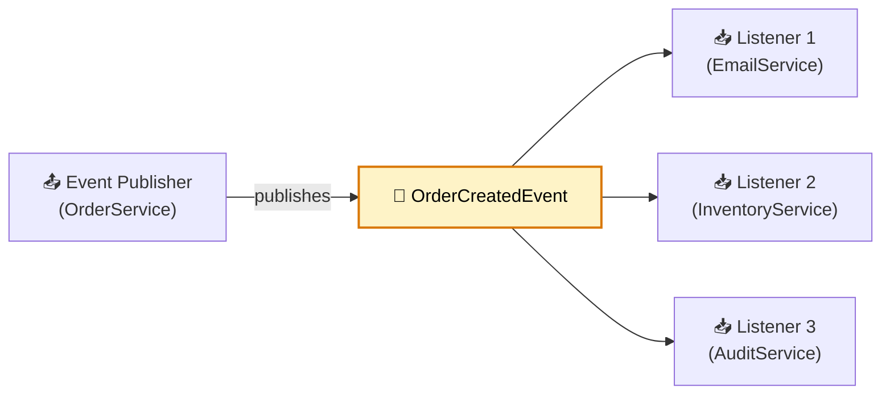
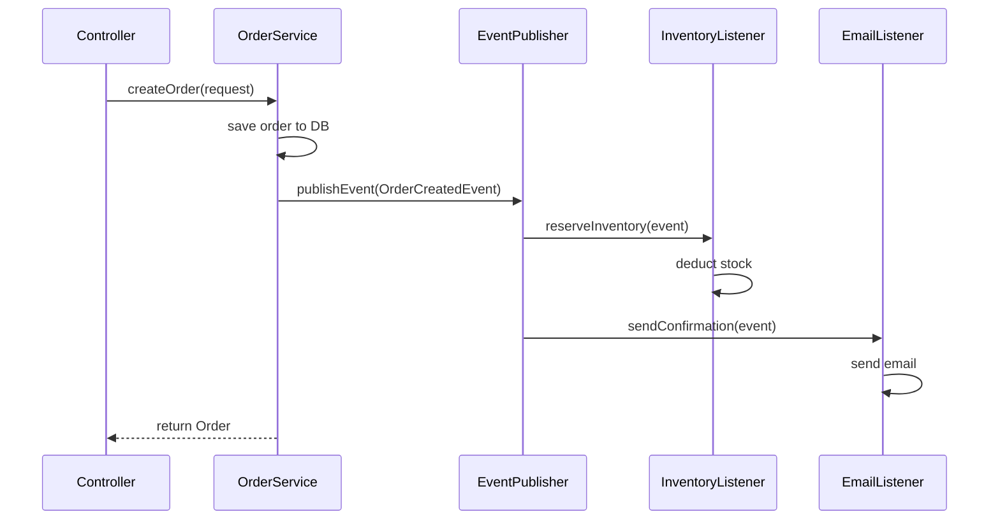
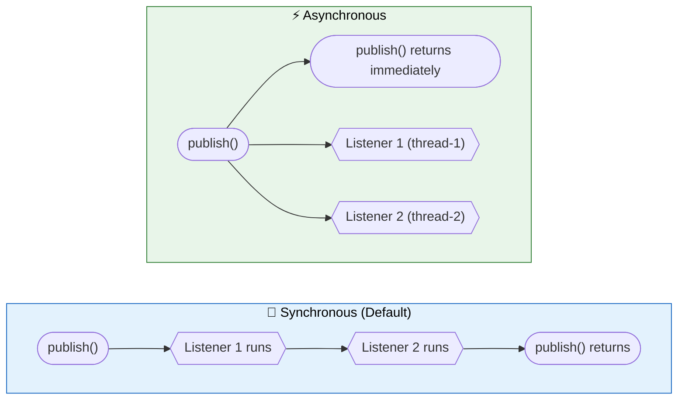

# Spring Events and Application Events

> Decouple components within a service using the publisher-subscriber pattern. No external broker required. Same JVM, zero network overhead.

---

!!! abstract "Real-World Analogy"
    A newspaper publisher prints once. Every subscriber gets their copy without the publisher knowing who they are. Spring Events work identically: a component publishes an event, any listener receives it, publisher never depends on listeners.



---

## Core Concepts

### ApplicationEvent

Base class for all application events (pre-Spring 4.2). Since Spring 4.2, events no longer need to extend `ApplicationEvent`. Any POJO works.

```java
// Legacy approach (still supported)
public class OrderCreatedEvent extends ApplicationEvent {
    private final String orderId;

    public OrderCreatedEvent(Object source, String orderId) {
        super(source);
        this.orderId = orderId;
    }

    public String getOrderId() { return orderId; }
}

// Modern approach — plain POJO (preferred)
public record OrderCreatedEvent(
    String orderId,
    String userId,
    BigDecimal totalAmount,
    List<String> itemIds,
    Instant createdAt
) {}
```

### ApplicationEventPublisher

Interface injected into any component that needs to fire events. Spring's `ApplicationContext` implements it.

```java
@Service
@RequiredArgsConstructor
public class OrderService {

    private final ApplicationEventPublisher eventPublisher;

    @Transactional
    public Order createOrder(CreateOrderRequest request) {
        Order order = orderRepository.save(Order.from(request));
        eventPublisher.publishEvent(new OrderCreatedEvent(
            order.getId(), order.getUserId(),
            order.getTotalAmount(), order.getItemIds(), Instant.now()
        ));
        return order;
    }
}
```

### @EventListener (Annotation-based)

Annotation on any Spring-managed bean method. Spring resolves the event type from the method parameter.

```java
@Component
@Slf4j
public class EmailListener {

    @EventListener
    public void sendConfirmation(OrderCreatedEvent event) {
        log.info("Sending email for order: {}", event.orderId());
        emailService.sendOrderConfirmation(event.userId(), event.orderId());
    }
}
```

### ApplicationListener Interface

Older approach. Implement the interface directly. Still valid for programmatic registration.

```java
@Component
public class InventoryListener implements ApplicationListener<OrderCreatedEvent> {

    @Override
    public void onApplicationEvent(OrderCreatedEvent event) {
        inventoryService.reserve(event.itemIds());
    }
}
```

---

## Complete Event-Driven Flow: Order Placed

A monolith handling order placement, inventory reservation, and email notification — fully decoupled via events.



```java
// 1. Event
public record OrderPlacedEvent(
    String orderId, String userId, List<String> itemIds, boolean success
) {}

// 2. Publisher
@Service
@RequiredArgsConstructor
public class OrderService {
    private final OrderRepository repo;
    private final ApplicationEventPublisher publisher;

    @Transactional
    public Order placeOrder(OrderRequest req) {
        Order order = repo.save(Order.from(req));
        publisher.publishEvent(new OrderPlacedEvent(
            order.getId(), order.getUserId(), order.getItemIds(), true));
        return order;
    }
}

// 3. Listener — Inventory
@Component
@RequiredArgsConstructor
@Slf4j
public class InventoryListener {

    private final InventoryService inventoryService;

    @Order(1)
    @TransactionalEventListener(phase = TransactionPhase.AFTER_COMMIT)
    public void reserveStock(OrderPlacedEvent event) {
        log.info("Reserving inventory for order {}", event.orderId());
        inventoryService.reserve(event.itemIds());
    }
}

// 4. Listener — Email
@Component
@RequiredArgsConstructor
@Slf4j
public class EmailListener {

    private final EmailService emailService;

    @Order(2)
    @Async("eventExecutor")
    @TransactionalEventListener(phase = TransactionPhase.AFTER_COMMIT)
    public void sendEmail(OrderPlacedEvent event) {
        log.info("Sending confirmation for order {}", event.orderId());
        emailService.sendOrderConfirmation(event.userId(), event.orderId());
    }
}
```

---

## Built-in Spring Boot Events

| Event | When It Fires |
|---|---|
| `ContextRefreshedEvent` | ApplicationContext initialized or refreshed |
| `ContextClosedEvent` | Context closed (JVM shutdown hook) |
| `ContextStartedEvent` | Context started via `start()` |
| `ContextStoppedEvent` | Context stopped via `stop()` |
| `ApplicationStartedEvent` | Context refreshed, but before runners called |
| `ApplicationReadyEvent` | After all runners executed. App fully ready. |
| `ApplicationFailedEvent` | Startup failed with exception |
| `ServletRequestHandledEvent` | HTTP request completed (web apps only) |

```java
@Component
@Slf4j
public class LifecycleListeners {

    @EventListener(ContextRefreshedEvent.class)
    public void onContextRefreshed() {
        log.info("Context refreshed — beans loaded");
    }

    @EventListener(ContextClosedEvent.class)
    public void onShutdown() {
        log.info("Shutting down — releasing resources");
    }

    @EventListener(ApplicationReadyEvent.class)
    public void onReady() {
        log.info("Application ready — warming caches");
        cacheWarmupService.warmAll();
    }

    @EventListener(ApplicationStartedEvent.class)
    public void onStarted() {
        log.info("Application started — before runners");
    }
}
```

---

## Synchronous vs Asynchronous Events

By default, Spring Events are **synchronous**. Publisher blocks until all listeners finish.



### Async Events: @Async + @EventListener

Requires `@EnableAsync` and a configured thread pool. Without a custom executor, Spring uses `SimpleAsyncTaskExecutor` (no thread reuse — dangerous in production).

```java
@Configuration
@EnableAsync
public class AsyncConfig {

    @Bean("eventExecutor")
    public Executor eventExecutor() {
        ThreadPoolTaskExecutor executor = new ThreadPoolTaskExecutor();
        executor.setCorePoolSize(5);
        executor.setMaxPoolSize(20);
        executor.setQueueCapacity(100);
        executor.setThreadNamePrefix("event-");
        executor.setRejectedExecutionHandler(new CallerRunsPolicy());
        executor.initialize();
        return executor;
    }
}

@Component
public class NotificationListener {

    @Async("eventExecutor")
    @EventListener
    public void handleOrderCreated(OrderCreatedEvent event) {
        // Runs in separate thread. Does not block publisher.
        notificationService.pushNotification(event.userId(), "Order confirmed!");
    }
}
```

**Thread pool considerations:**

- Set `queueCapacity` to bound memory. Unbounded queues cause OOM under load.
- `CallerRunsPolicy` applies backpressure when pool saturates.
- Async listeners lose the caller's transaction context. Do NOT annotate async listeners with `@Transactional` expecting the original TX.
- Exceptions in async listeners are swallowed by default. Configure `AsyncUncaughtExceptionHandler` to catch them.

---

## @TransactionalEventListener

Binds listener execution to the transaction lifecycle. Crucial for side effects that must only run after DB commit.

```java
@Component
public class TransactionalListeners {

    @TransactionalEventListener(phase = TransactionPhase.AFTER_COMMIT)
    public void afterOrderCommitted(OrderCreatedEvent event) {
        // Only runs if transaction commits successfully.
        // Safe to send emails, notifications, external API calls.
        emailService.sendOrderConfirmation(event.orderId());
    }

    @TransactionalEventListener(phase = TransactionPhase.AFTER_ROLLBACK)
    public void afterOrderRolledBack(OrderCreatedEvent event) {
        log.warn("Order creation failed: {}", event.orderId());
        alertService.notifyFailure(event.orderId());
    }

    @TransactionalEventListener(phase = TransactionPhase.BEFORE_COMMIT)
    public void beforeCommit(OrderCreatedEvent event) {
        // Runs inside the transaction, before commit.
        // Useful for validation that can still trigger rollback.
        auditLog.record(event);
    }

    @TransactionalEventListener(phase = TransactionPhase.AFTER_COMPLETION)
    public void afterCompletion(OrderCreatedEvent event) {
        // Runs after commit OR rollback. Always fires.
        metricsService.recordOrderAttempt(event.orderId());
    }
}
```

| Phase | When It Fires | Use Case |
|---|---|---|
| `BEFORE_COMMIT` | Inside TX, before commit | Validation, audit logging |
| `AFTER_COMMIT` | TX committed successfully | Emails, notifications, external calls |
| `AFTER_ROLLBACK` | TX rolled back | Alerting, compensation logic |
| `AFTER_COMPLETION` | After commit or rollback | Metrics, cleanup |

**Why AFTER_COMMIT is crucial:** If you use a plain `@EventListener` inside a transactional method, the listener fires immediately — even if the transaction later rolls back. This means emails get sent for orders that never persisted. `AFTER_COMMIT` guarantees the DB write succeeded before side effects execute.

---

## Event Ordering with @Order

Multiple listeners for the same event execute in undefined order by default. Use `@Order` to control sequence.

```java
@Component
public class OrderedListeners {

    @Order(1)  // Runs first
    @EventListener
    public void validateOrder(OrderCreatedEvent event) {
        validationService.validate(event);
    }

    @Order(2)  // Runs second
    @EventListener
    public void reserveInventory(OrderCreatedEvent event) {
        inventoryService.reserve(event.itemIds());
    }

    @Order(3)  // Runs third
    @EventListener
    public void sendEmail(OrderCreatedEvent event) {
        emailService.sendConfirmation(event.orderId());
    }
}
```

Lower values = higher priority. `@Order` has no effect on `@Async` listeners — they execute in parallel on separate threads.

---

## Generic Events with ResolvableTypeProvider

Spring uses type erasure. Generic event types like `EntityEvent<Order>` vs `EntityEvent<Product>` look identical at runtime. Implement `ResolvableTypeProvider` to fix this.

```java
public class EntityEvent<T> implements ResolvableTypeProvider {

    private final T entity;
    private final EventType type;

    public EntityEvent(T entity, EventType type) {
        this.entity = entity;
        this.type = type;
    }

    public T getEntity() { return entity; }
    public EventType getType() { return type; }

    @Override
    public ResolvableType getResolvableType() {
        return ResolvableType.forClassWithGenerics(
            getClass(), ResolvableType.forInstance(this.entity));
    }

    public enum EventType { CREATED, UPDATED, DELETED }
}
```

Now Spring correctly routes events to type-specific listeners:

```java
// Publishing
eventPublisher.publishEvent(new EntityEvent<>(order, EventType.CREATED));
eventPublisher.publishEvent(new EntityEvent<>(product, EventType.UPDATED));

// Listening — only receives EntityEvent<Order>
@EventListener
public void handleOrderEntity(EntityEvent<Order> event) {
    log.info("Order {} was {}", event.getEntity().getId(), event.getType());
}

// Listening — only receives EntityEvent<Product>
@EventListener
public void handleProductEntity(EntityEvent<Product> event) {
    log.info("Product {} was {}", event.getEntity().getId(), event.getType());
}
```

Without `ResolvableTypeProvider`, both listeners receive both events. Runtime type check fails silently or throws `ClassCastException`.

---

## Conditional Event Listening

Filter events at the listener level using SpEL expressions.

```java
@Component
public class ConditionalListeners {

    // Only fires for high-value orders
    @EventListener(condition = "#event.totalAmount > 1000")
    public void handleHighValueOrder(OrderCreatedEvent event) {
        fraudDetectionService.flag(event.orderId());
    }

    // Only fires for successful events
    @EventListener(condition = "#event.success")
    public void handleSuccess(OrderPlacedEvent event) {
        metricsService.incrementSuccessCount();
    }

    // Listen to multiple event types
    @EventListener({OrderCreatedEvent.class, OrderCancelledEvent.class})
    public void auditOrderChange(Object event) {
        auditService.log(event);
    }
}
```

The `condition` attribute uses SpEL. The event object is accessible as `#event` (or `#root.event`). Method parameter name also works: `#orderCreatedEvent`.

---

## Event Chaining: Returning Events from Listeners

A listener can return an event (or collection of events). Spring publishes them automatically.

```java
@EventListener
public OrderShippedEvent handlePaymentConfirmed(PaymentConfirmedEvent event) {
    shipmentService.ship(event.orderId());
    return new OrderShippedEvent(event.orderId()); // Published automatically
}

@EventListener
public Collection<Object> handleBulkOrder(BulkOrderEvent event) {
    return event.orders().stream()
        .map(order -> new OrderCreatedEvent(order.id(), order.userId(),
            order.amount(), order.items(), Instant.now()))
        .collect(Collectors.toList());
}
```

Return `null` to suppress chaining. Works with synchronous listeners only.

---

## Spring Events vs Message Brokers

| Aspect | Spring Events | Kafka / RabbitMQ |
|---|---|---|
| Scope | In-process (same JVM) | Cross-process, cross-service |
| Durability | None. Lost on restart. | Persisted to disk. Replayable. |
| Delivery guarantee | At-most-once | At-least-once / exactly-once |
| Performance | Near-zero overhead | Network latency, serialization |
| Ordering | Guaranteed (sync) | Partition-level (Kafka) |
| Scalability | Single instance | Distributed consumers |
| Use case | Intra-service decoupling | Inter-service communication |
| Transaction support | `@TransactionalEventListener` | Outbox pattern needed |

**Rule of thumb:** Use Spring Events for decoupling within a single deployable unit. Use a message broker when events cross service boundaries, need durability, or require guaranteed delivery.

---

## Gotchas and Pitfalls

| Gotcha | Detail |
|---|---|
| Default phase is AFTER_COMMIT | `@TransactionalEventListener` defaults to `AFTER_COMMIT`, not `AFTER_COMPLETION`. Many developers assume it always fires. |
| Event with no listener | Silently ignored. No error, no warning. Hard to debug. |
| Async exceptions swallowed | By default, exceptions in `@Async` event listeners vanish. Configure `AsyncUncaughtExceptionHandler`. |
| Sync listener exception kills publisher | If a sync listener throws, the exception propagates to the publisher. Wrap with try-catch or use `@Async`. |
| Transactional context lost in async | `@Async` listeners run on a different thread. No access to the original transaction. |
| Circular event publishing | Listener A publishes event B, listener B publishes event A. Infinite loop. Add guard conditions. |
| `@TransactionalEventListener` outside TX | If no active transaction exists when event is published, listener never fires (by default). Set `fallbackExecution = true` to override. |

```java
// Preventing silent failure when no transaction is active
@TransactionalEventListener(
    phase = TransactionPhase.AFTER_COMMIT,
    fallbackExecution = true  // Execute even without active TX
)
public void safeListener(OrderCreatedEvent event) {
    emailService.send(event.orderId());
}
```

---

## Interview Questions

??? question "1. What are Spring Application Events and when would you use them?"
    Spring Events implement the observer pattern within the ApplicationContext. A publisher fires an event; zero or more listeners react. Use them when one action triggers multiple side effects (email + cache invalidation + audit log), you want to add behaviors without modifying existing code (Open/Closed Principle), or you need transactional safety for side effects via `@TransactionalEventListener`.

??? question "2. What is the difference between @EventListener and ApplicationListener interface?"
    `@EventListener` is annotation-based, placed on any method of a Spring bean. `ApplicationListener<T>` is an interface requiring `onApplicationEvent(T)` implementation. `@EventListener` is preferred: less boilerplate, supports conditional expressions, can return events for chaining, and supports `@Order`. The interface approach is useful for programmatic registration via `ApplicationContext.addApplicationListener()`.

??? question "3. What is @TransactionalEventListener and why is AFTER_COMMIT crucial?"
    `@TransactionalEventListener` binds listener execution to transaction phases. `AFTER_COMMIT` ensures the listener runs only after the database write succeeds. Without it, a plain `@EventListener` fires immediately during the transaction — if the TX rolls back, you've already sent an email for a non-existent order. The default phase is `AFTER_COMMIT`.

??? question "4. Name the four phases of @TransactionalEventListener."
    `BEFORE_COMMIT` — inside the TX before commit, can still trigger rollback. `AFTER_COMMIT` — TX committed successfully, safe for external side effects. `AFTER_ROLLBACK` — TX rolled back, useful for alerting or compensation. `AFTER_COMPLETION` — fires regardless of commit or rollback, useful for cleanup and metrics.

??? question "5. How do you make event listeners asynchronous? What are the risks?"
    Add `@EnableAsync` to a configuration class. Annotate the listener with `@Async("executorBeanName")` plus `@EventListener`. Risks: exceptions are silently swallowed (configure `AsyncUncaughtExceptionHandler`), transaction context is lost, `@Order` is ignored, and without a bounded thread pool you risk OOM from unbounded task queuing.

??? question "6. How do Spring Events differ from Kafka or RabbitMQ?"
    Spring Events are in-process only (same JVM). They are synchronous by default, non-durable (lost on restart), and cannot communicate between services. Kafka/RabbitMQ provide cross-service communication, disk persistence, replay, guaranteed delivery, and horizontal scaling. Use Spring Events for intra-service decoupling. Use brokers for inter-service messaging.

??? question "7. What happens if an event is published but no listener exists?"
    Nothing. The event is silently discarded. No exception, no log warning. This is by design — the publisher should not know or care about listeners. However, it makes debugging harder. Consider adding a catch-all listener in development that logs unhandled events.

??? question "8. How do you control listener execution order?"
    Use `@Order(n)` on `@EventListener` methods. Lower values execute first. Without `@Order`, execution order is undefined. For async listeners, `@Order` has no effect — they run concurrently on separate threads.

??? question "9. What is ResolvableTypeProvider and when do you need it?"
    Java type erasure means `EntityEvent<Order>` and `EntityEvent<Product>` are indistinguishable at runtime. Implementing `ResolvableTypeProvider` on the event class lets Spring resolve the generic type at runtime. Without it, a listener for `EntityEvent<Order>` receives ALL `EntityEvent` instances regardless of type parameter.

??? question "10. Can a listener return an event? What happens?"
    Yes. If an `@EventListener` method returns a non-null object (or `Collection<Object>`), Spring publishes the returned value as a new event. This enables event chaining. Return `null` to suppress. Only works with synchronous listeners.

??? question "11. What does the `condition` attribute do on @EventListener?"
    It accepts a SpEL expression. The listener only fires if the expression evaluates to `true`. Example: `@EventListener(condition = "#event.success")` only handles events where the `success` field is true. The event is accessible as `#event` or by parameter name.

??? question "12. What happens when a @TransactionalEventListener is triggered outside a transaction?"
    By default, the listener never fires. The event is silently ignored because there is no transaction to bind to. Set `fallbackExecution = true` to make it execute even without an active transaction. This is a common source of bugs — developers publish events from non-transactional methods and wonder why listeners are not invoked.

??? question "13. How do you handle exceptions in async event listeners?"
    By default, they are swallowed. Implement `AsyncUncaughtExceptionHandler` and register it via `AsyncConfigurer.getAsyncUncaughtExceptionHandler()`. Alternatively, wrap listener logic in try-catch and log or publish a failure event. Never assume async failures will surface automatically.

??? question "14. Can you combine @Async with @TransactionalEventListener?"
    Yes. The listener waits for the transaction phase (e.g., AFTER_COMMIT), then executes asynchronously on a separate thread. This is the ideal pattern for non-blocking side effects that depend on successful DB commits — like sending emails after order persistence.
