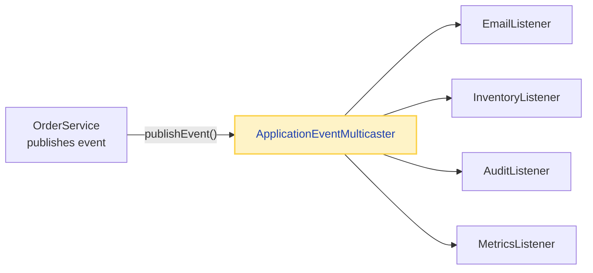
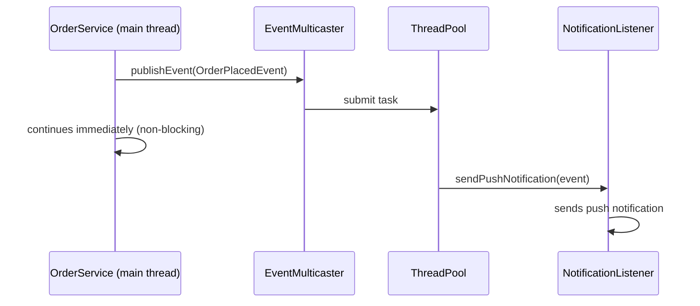
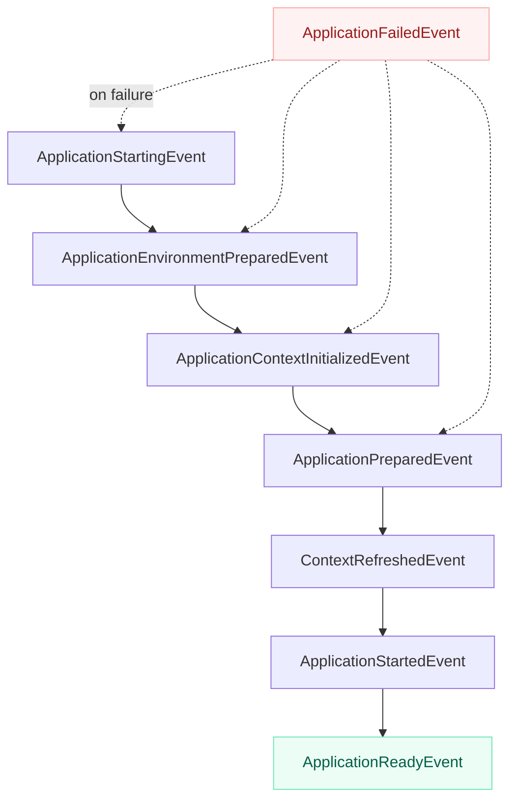
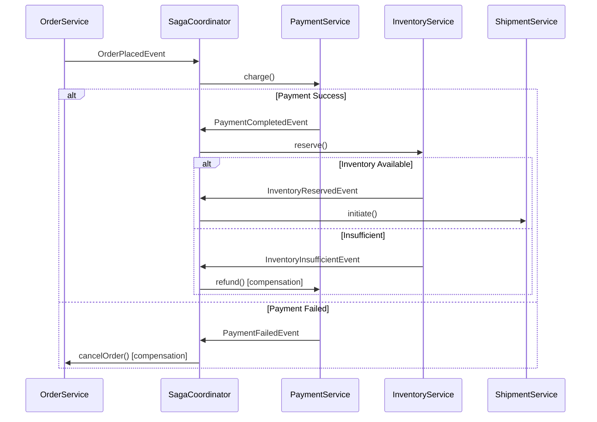
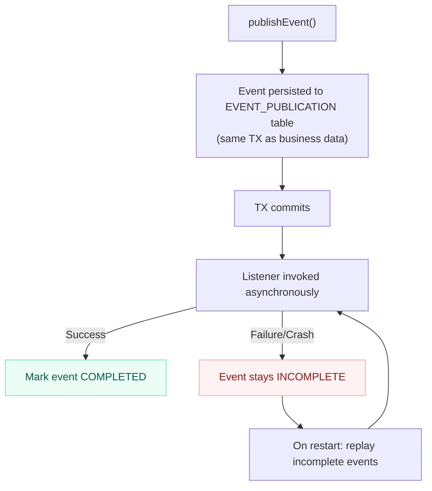
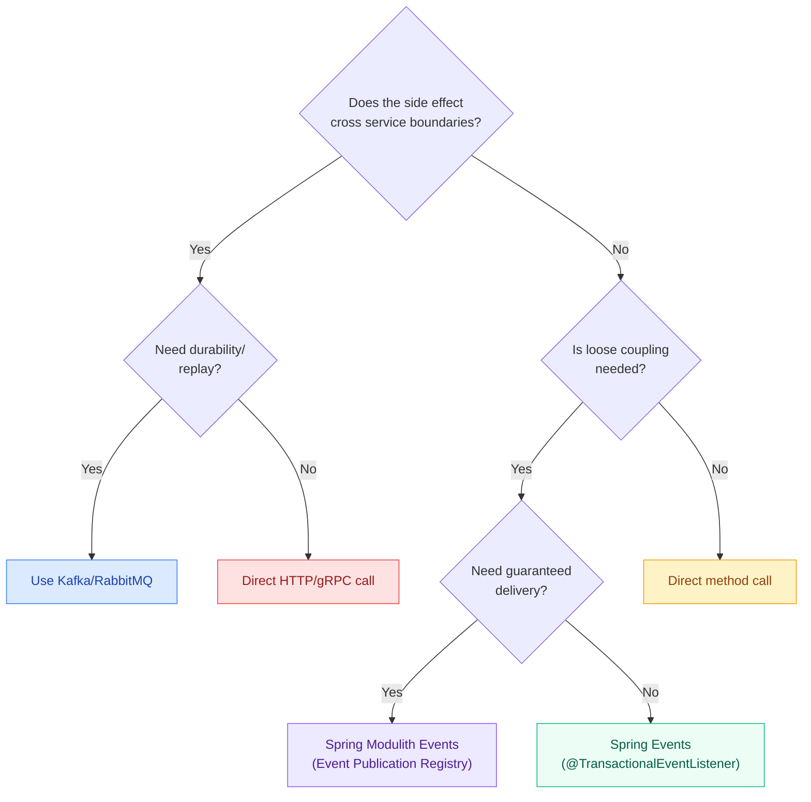

# Spring Boot Events — The Complete Guide

Spring Events are the most underused feature in Spring Boot. Engineers reach for Kafka when they need a simple in-process pub-sub. Events sit right in the middle — loose coupling within a single service, no external infrastructure needed. One service publishes "something happened," zero or more listeners react independently. The publisher never knows who is listening. That is the entire contract.

This page covers everything: internals, production patterns, transaction binding, async pitfalls, Spring Modulith integration, and the interview questions that actually get asked.

---

## 1. What Are Spring Events

!!! tip "One-liner for interviews"
    Spring Events implement the Observer pattern inside the ApplicationContext — in-process pub-sub that is synchronous by default, requires no external broker, and enables loose coupling between components within a single deployable unit.

**What it does:** Lets any Spring bean publish a message that any other Spring bean can listen to, without either side knowing about the other at compile time.

**Why it exists:** Without events, Service A calls Service B calls Service C directly. Tight coupling. Adding a new side effect (audit log, metrics, notification) means modifying the original service. Events flip this — the original service stays untouched; new listeners register themselves.

**When to use:** One action triggers multiple independent side effects. You want Open/Closed Principle. You need transactional safety for side effects.

**How it works internally:** `ApplicationEventMulticaster` holds a registry of listeners. When you call `publishEvent()`, the multicaster iterates listeners, matches by event type, and invokes them. Synchronous = same thread, sequential. Async = submitted to a configured `Executor`.



!!! danger "What breaks"
    Spring Events are **fire-and-forget within a single JVM**. If the application crashes mid-processing, the event is gone. No retry, no replay, no durability. If you need guaranteed delivery, you need a message broker or the Spring Modulith Event Publication Registry.

---

## 2. Core Components

### ApplicationEvent (Legacy Base Class)

Before Spring 4.2, all events had to extend `ApplicationEvent`. Since 4.2, any POJO works. You will still see legacy code using the base class.

=== "Modern (Recommended) — POJO / Record"

    ```java
    public record OrderPlacedEvent(
        String orderId,
        String userId,
        BigDecimal totalAmount,
        List<String> itemIds,
        Instant occurredAt
    ) {}
    ```

=== "Legacy — Extending ApplicationEvent"

    ```java
    public class OrderPlacedEvent extends ApplicationEvent {
        private final String orderId;
        private final String userId;

        public OrderPlacedEvent(Object source, String orderId, String userId) {
            super(source);
            this.orderId = orderId;
            this.userId = userId;
        }

        public String getOrderId() { return orderId; }
        public String getUserId() { return userId; }
    }
    ```

!!! example "Interview Tip"
    "Since Spring 4.2, events don't need to extend ApplicationEvent. A plain POJO or Java record is the idiomatic approach. The framework resolves the event type from the listener's method parameter."

### ApplicationEventPublisher

The interface you inject to fire events. `ApplicationContext` itself implements it, but always depend on the narrower `ApplicationEventPublisher` interface.

```java
@Service
@RequiredArgsConstructor
public class OrderService {

    private final OrderRepository orderRepository;
    private final ApplicationEventPublisher eventPublisher;

    @Transactional
    public Order placeOrder(CreateOrderRequest request) {
        Order order = orderRepository.save(Order.from(request));

        eventPublisher.publishEvent(new OrderPlacedEvent(
            order.getId(),
            order.getUserId(),
            order.getTotalAmount(),
            order.getItemIds(),
            Instant.now()
        ));

        return order;
    }
}
```

### @EventListener (Annotation-Based)

Place on any method of a Spring-managed bean. Spring resolves the event type from the method parameter at startup.

```java
@Component
@Slf4j
public class OrderEmailListener {

    private final EmailService emailService;

    @EventListener
    public void onOrderPlaced(OrderPlacedEvent event) {
        log.info("Sending confirmation for order {}", event.orderId());
        emailService.sendOrderConfirmation(event.userId(), event.orderId());
    }
}
```

### ApplicationListener Interface (Legacy)

Older approach. Still valid for programmatic registration or when you need to register listeners before the context fully starts.

```java
@Component
public class InventoryReservationListener implements ApplicationListener<OrderPlacedEvent> {

    @Override
    public void onApplicationEvent(OrderPlacedEvent event) {
        inventoryService.reserve(event.itemIds());
    }
}
```

!!! question "Counter-question: When would you use ApplicationListener over @EventListener?"
    Two scenarios: (1) You need to register a listener programmatically via `context.addApplicationListener()` — for example in a library that does not control component scanning. (2) You need to listen to very early lifecycle events (like `ApplicationEnvironmentPreparedEvent`) that fire before `@EventListener` annotation processing is active. For everything else, prefer `@EventListener`.

---

## 3. Publishing Events

### From Service Methods (Standard Pattern)

```java
@Service
@RequiredArgsConstructor
public class PaymentService {

    private final PaymentGateway gateway;
    private final PaymentRepository paymentRepository;
    private final ApplicationEventPublisher events;

    @Transactional
    public Payment processPayment(PaymentRequest request) {
        PaymentResult result = gateway.charge(request);
        Payment payment = paymentRepository.save(Payment.from(request, result));

        if (result.isSuccessful()) {
            events.publishEvent(new PaymentCompletedEvent(
                payment.getId(), payment.getOrderId(), payment.getAmount()));
        } else {
            events.publishEvent(new PaymentFailedEvent(
                payment.getId(), payment.getOrderId(), result.getFailureReason()));
        }

        return payment;
    }
}
```

### Domain Events with AbstractAggregateRoot (Spring Data)

Spring Data provides `AbstractAggregateRoot` for DDD-style domain events. Events are collected on the entity and published automatically when `save()` is called.

```java
@Entity
public class Order extends AbstractAggregateRoot<Order> {

    @Id
    private String id;
    private String userId;
    private OrderStatus status;
    private BigDecimal totalAmount;

    public Order place() {
        this.status = OrderStatus.PLACED;
        // Register event — published when repository.save(this) is called
        registerEvent(new OrderPlacedEvent(this.id, this.userId, this.totalAmount,
            this.getItemIds(), Instant.now()));
        return this;
    }

    public Order cancel(String reason) {
        this.status = OrderStatus.CANCELLED;
        registerEvent(new OrderCancelledEvent(this.id, reason, Instant.now()));
        return this;
    }
}
```

```java
@Service
@RequiredArgsConstructor
public class OrderService {

    private final OrderRepository repository;

    @Transactional
    public Order placeOrder(CreateOrderRequest request) {
        Order order = Order.from(request).place();
        return repository.save(order); // Events published here automatically
    }
}
```

!!! tip "One-liner for interviews"
    "`AbstractAggregateRoot.registerEvent()` collects domain events on the entity itself. Spring Data publishes them when `save()` is called on the repository — no need to inject `ApplicationEventPublisher` into domain objects."

!!! danger "What breaks"
    Events registered via `registerEvent()` are cleared after publication. If `save()` is called multiple times, only events registered since the last save are published. Also, if you call `registerEvent()` but never call `save()`, the events are never published — they silently disappear.

---

## 4. @EventListener Deep Dive

### Conditional Listening with SpEL

```java
@Component
public class FraudDetectionListener {

    // Only fires for orders above $500
    @EventListener(condition = "#event.totalAmount.compareTo(T(java.math.BigDecimal).valueOf(500)) > 0")
    public void flagHighValueOrder(OrderPlacedEvent event) {
        fraudService.analyze(event.orderId());
    }

    // Only fires for specific users
    @EventListener(condition = "#event.userId.startsWith('VIP-')")
    public void prioritizeVipOrder(OrderPlacedEvent event) {
        priorityQueue.escalate(event.orderId());
    }
}
```

The `condition` uses SpEL. The event is accessible as `#event`, `#root.event`, or by parameter name.

### Return Type Chaining

A listener can return an event (or `Collection<Object>`) — Spring automatically publishes the returned value as a new event.

```java
@Component
public class OrderWorkflowListener {

    @EventListener
    public InventoryReservedEvent onOrderPlaced(OrderPlacedEvent event) {
        inventoryService.reserve(event.itemIds());
        return new InventoryReservedEvent(event.orderId(), event.itemIds());
        // This return value is published as a new event
    }

    @EventListener
    public ShipmentInitiatedEvent onInventoryReserved(InventoryReservedEvent event) {
        shipmentService.initiate(event.orderId());
        return new ShipmentInitiatedEvent(event.orderId());
    }
}
```

Return `null` to suppress chaining. Only works with synchronous listeners.

### Ordering with @Order

```java
@Component
public class OrderProcessingListeners {

    @Order(1)  // Executes first — validate
    @EventListener
    public void validateOrder(OrderPlacedEvent event) {
        validationService.validate(event);
    }

    @Order(2)  // Executes second — reserve inventory
    @EventListener
    public void reserveInventory(OrderPlacedEvent event) {
        inventoryService.reserve(event.itemIds());
    }

    @Order(3)  // Executes third — send email
    @EventListener
    public void notifyCustomer(OrderPlacedEvent event) {
        emailService.sendConfirmation(event.userId(), event.orderId());
    }
}
```

Lower value = higher priority. **Critical:** `@Order` has zero effect on `@Async` listeners — they execute in parallel on separate threads regardless.

### Listening to Multiple Event Types

```java
@EventListener({OrderPlacedEvent.class, OrderCancelledEvent.class})
public void auditOrderLifecycle(Object event) {
    auditService.log(event);
}
```

---

## 5. @TransactionalEventListener

!!! tip "One-liner for interviews"
    "`@TransactionalEventListener` binds listener execution to a transaction phase. `AFTER_COMMIT` guarantees the listener only fires if the database write succeeded — preventing emails for orders that were rolled back."

**What it does:** Delays listener execution until a specific point in the transaction lifecycle.

**Why it exists:** A plain `@EventListener` fires immediately when `publishEvent()` is called — inside the transaction. If the transaction later rolls back, the side effect (email, notification, external API call) already happened. Irreversible damage.

**How it works internally:** The `TransactionalApplicationListenerMethodAdapter` registers a `TransactionSynchronization` with the current `TransactionSynchronizationManager`. The actual listener invocation is deferred to the corresponding callback (`beforeCommit`, `afterCommit`, `afterCompletion`).

### The Four Phases

```java
@Component
@Slf4j
public class OrderTransactionalListeners {

    @TransactionalEventListener(phase = TransactionPhase.BEFORE_COMMIT)
    public void beforeCommit(OrderPlacedEvent event) {
        // Runs INSIDE the transaction, before commit.
        // Can still throw and trigger rollback.
        auditLog.recordInTransaction(event);
    }

    @TransactionalEventListener(phase = TransactionPhase.AFTER_COMMIT)
    public void afterCommit(OrderPlacedEvent event) {
        // Transaction committed successfully. DB write is durable.
        // Safe for emails, notifications, external API calls.
        emailService.sendOrderConfirmation(event.orderId());
    }

    @TransactionalEventListener(phase = TransactionPhase.AFTER_ROLLBACK)
    public void afterRollback(OrderPlacedEvent event) {
        // Transaction was rolled back. Order does NOT exist in DB.
        log.warn("Order {} failed, notifying support", event.orderId());
        alertService.notifyOrderFailure(event.orderId());
    }

    @TransactionalEventListener(phase = TransactionPhase.AFTER_COMPLETION)
    public void afterCompletion(OrderPlacedEvent event) {
        // Fires regardless of commit or rollback. Always executes.
        metricsService.recordOrderAttempt(event.orderId());
    }
}
```

| Phase | When | Transaction State | Use Case |
|---|---|---|---|
| `BEFORE_COMMIT` | Inside TX, before commit | Active, can rollback | Validation, audit logging inside TX |
| `AFTER_COMMIT` | After successful commit | Committed, durable | Emails, notifications, external calls |
| `AFTER_ROLLBACK` | After rollback | Rolled back | Alerting, compensation |
| `AFTER_COMPLETION` | After commit OR rollback | Completed | Metrics, resource cleanup |

### fallbackExecution

```java
@TransactionalEventListener(
    phase = TransactionPhase.AFTER_COMMIT,
    fallbackExecution = true  // Execute even when no transaction is active
)
public void handleEvent(OrderPlacedEvent event) {
    emailService.send(event.orderId());
}
```

!!! warning "Production War Story"
    A team had `@TransactionalEventListener(AFTER_COMMIT)` on their email listener. Everything worked in integration tests. In production, a scheduler called the same service method without `@Transactional`. The listener silently never fired. Customers received no emails for 3 days. Fix: either add `fallbackExecution = true` or ensure every code path that publishes events runs within a transaction.

!!! danger "What breaks"
    If you publish an event from a method with no active transaction and `fallbackExecution` is `false` (the default), the listener **silently never fires**. No exception, no log, no warning. The event vanishes.

---

## 6. Async Events

### Setup: @Async + @EventListener

```java
@Configuration
@EnableAsync
public class AsyncEventConfig {

    @Bean("eventTaskExecutor")
    public Executor eventTaskExecutor() {
        ThreadPoolTaskExecutor executor = new ThreadPoolTaskExecutor();
        executor.setCorePoolSize(5);
        executor.setMaxPoolSize(20);
        executor.setQueueCapacity(200);
        executor.setThreadNamePrefix("event-async-");
        executor.setRejectedExecutionHandler(new ThreadPoolExecutor.CallerRunsPolicy());
        executor.setWaitForTasksToCompleteOnShutdown(true);
        executor.setAwaitTerminationSeconds(30);
        executor.initialize();
        return executor;
    }
}
```

```java
@Component
@Slf4j
public class NotificationListener {

    @Async("eventTaskExecutor")
    @EventListener
    public void sendPushNotification(OrderPlacedEvent event) {
        // Runs on a separate thread. Does NOT block the publisher.
        log.info("[{}] Sending push for order {}",
            Thread.currentThread().getName(), event.orderId());
        pushService.notify(event.userId(), "Order " + event.orderId() + " confirmed!");
    }
}
```



### No Transaction Context in Async Listeners

!!! danger "What breaks"
    Async listeners run on a different thread. The original transaction is gone. If your async listener calls a `@Transactional` method, it starts a **new** transaction — completely independent from the publisher's transaction. If you combine `@Async` with `@TransactionalEventListener(AFTER_COMMIT)`, the listener waits for the original TX to commit, then executes asynchronously.

### Error Handling for Async Listeners

By default, exceptions in async listeners are **silently swallowed**. Configure a handler:

```java
@Configuration
@EnableAsync
public class AsyncConfig implements AsyncConfigurer {

    @Override
    public AsyncUncaughtExceptionHandler getAsyncUncaughtExceptionHandler() {
        return (throwable, method, params) -> {
            log.error("Async event listener failed: method={}, event={}",
                method.getName(), params[0], throwable);
            // Optionally: publish a failure event, send alert, increment metric
            alertService.notifyAsyncFailure(method.getName(), throwable);
        };
    }
}
```

!!! warning "Production War Story"
    A payment notification listener was `@Async`. It threw `NullPointerException` for 2 weeks. Nobody noticed because exceptions in async listeners are swallowed by default. Customers complained they never received payment confirmations. The fix: implement `AsyncUncaughtExceptionHandler` + add monitoring for async task failures.

---

## 7. Spring Boot Built-in Events

Spring Boot fires events at each stage of the application lifecycle. These are invaluable for initialization, warmup, and graceful shutdown.



| Event | When It Fires | Typical Use |
|---|---|---|
| `ApplicationStartingEvent` | Immediately after `run()` is called, before anything | Logging initialization |
| `ApplicationEnvironmentPreparedEvent` | Environment ready, no context yet | Custom property source registration |
| `ApplicationContextInitializedEvent` | Context created, before bean definitions loaded | Early bean registration |
| `ApplicationPreparedEvent` | Bean definitions loaded, before refresh | Late configuration |
| `ContextRefreshedEvent` | Context fully refreshed, all beans created | Cache warmup, connection pool init |
| `ApplicationStartedEvent` | Context refreshed, before runners called | Pre-runner initialization |
| `ApplicationReadyEvent` | After all `CommandLineRunner`/`ApplicationRunner` execute | App fully ready for traffic |
| `ApplicationFailedEvent` | Startup failed with exception | Alerting, cleanup |
| `ContextClosedEvent` | JVM shutdown hook triggered | Resource release, deregistration |

```java
@Component
@Slf4j
public class ApplicationLifecycleListeners {

    @EventListener(ApplicationReadyEvent.class)
    public void onReady() {
        log.info("Application ready — warming caches and registering with service discovery");
        cacheWarmupService.warmAll();
        serviceRegistry.register();
    }

    @EventListener(ContextClosedEvent.class)
    public void onShutdown() {
        log.info("Shutting down — deregistering from service discovery");
        serviceRegistry.deregister();
    }

    @EventListener(ApplicationFailedEvent.class)
    public void onFailure(ApplicationFailedEvent event) {
        log.error("Startup failed", event.getException());
        alertService.notifyStartupFailure(event.getException());
    }
}
```

!!! question "Counter-question: Why can't I use @EventListener for ApplicationStartingEvent?"
    `@EventListener` requires annotation processing, which requires beans to be initialized. `ApplicationStartingEvent` fires before the context exists. To listen to very early events, register a listener in `META-INF/spring.factories` or via `SpringApplication.addListeners()`.

---

## 8. Event-Driven Patterns

### Pattern 1: Domain Events (Bounded Context Communication)

Events represent facts that happened in the domain. Other parts of the system react to these facts.

```java
// Domain Events
public record UserRegisteredEvent(String userId, String email, Instant registeredAt) {}
public record EmailVerifiedEvent(String userId, String email) {}
public record UserProfileCompletedEvent(String userId) {}

// Multiple listeners react to registration
@Component
public class WelcomeEmailListener {
    @TransactionalEventListener(phase = TransactionPhase.AFTER_COMMIT)
    public void sendWelcome(UserRegisteredEvent event) {
        emailService.sendWelcomeEmail(event.email());
    }
}

@Component
public class TrialActivationListener {
    @TransactionalEventListener(phase = TransactionPhase.AFTER_COMMIT)
    public void activateTrial(UserRegisteredEvent event) {
        subscriptionService.activateFreeTrial(event.userId());
    }
}

@Component
public class AnalyticsListener {
    @Async("eventTaskExecutor")
    @TransactionalEventListener(phase = TransactionPhase.AFTER_COMMIT)
    public void trackRegistration(UserRegisteredEvent event) {
        analytics.track("user_registered", Map.of(
            "user_id", event.userId(),
            "timestamp", event.registeredAt().toString()
        ));
    }
}
```

### Pattern 2: Event Sourcing Lite

Store events as the source of truth for aggregate state, but within a single service (not full CQRS infrastructure).

```java
@Entity
@Table(name = "domain_events")
public class StoredEvent {
    @Id @GeneratedValue
    private Long id;
    private String aggregateId;
    private String eventType;

    @Column(columnDefinition = "jsonb")
    private String payload;

    private Instant occurredAt;
    private boolean processed;
}

@Component
public class EventStore {

    private final StoredEventRepository repository;
    private final ObjectMapper objectMapper;

    @TransactionalEventListener(phase = TransactionPhase.BEFORE_COMMIT)
    public void persist(Object event) {
        if (event.getClass().isAnnotationPresent(DomainEvent.class)) {
            repository.save(StoredEvent.builder()
                .eventType(event.getClass().getSimpleName())
                .payload(objectMapper.writeValueAsString(event))
                .occurredAt(Instant.now())
                .processed(false)
                .build());
        }
    }
}
```

### Pattern 3: Saga Coordination (Orchestrated via Events)

```java
// Order Saga — coordinating payment, inventory, and shipping
public record OrderPlacedEvent(String orderId, String userId,
    List<String> itemIds, BigDecimal amount) {}
public record PaymentCompletedEvent(String orderId, String paymentId) {}
public record PaymentFailedEvent(String orderId, String reason) {}
public record InventoryReservedEvent(String orderId, List<String> itemIds) {}
public record InventoryInsufficientEvent(String orderId, List<String> failedItems) {}

@Component
@Slf4j
public class OrderSagaCoordinator {

    private final ApplicationEventPublisher events;

    @TransactionalEventListener(phase = TransactionPhase.AFTER_COMMIT)
    public void onOrderPlaced(OrderPlacedEvent event) {
        // Step 1: Initiate payment
        paymentService.charge(event.orderId(), event.amount());
    }

    @TransactionalEventListener(phase = TransactionPhase.AFTER_COMMIT)
    public void onPaymentCompleted(PaymentCompletedEvent event) {
        // Step 2: Reserve inventory
        inventoryService.reserve(event.orderId());
    }

    @TransactionalEventListener(phase = TransactionPhase.AFTER_COMMIT)
    public void onPaymentFailed(PaymentFailedEvent event) {
        // Compensation: Cancel the order
        log.warn("Payment failed for order {}: {}", event.orderId(), event.reason());
        orderService.cancelOrder(event.orderId(), "Payment failed: " + event.reason());
    }

    @TransactionalEventListener(phase = TransactionPhase.AFTER_COMMIT)
    public void onInventoryInsufficient(InventoryInsufficientEvent event) {
        // Compensation: Refund payment, cancel order
        paymentService.refund(event.orderId());
        orderService.cancelOrder(event.orderId(), "Inventory insufficient");
    }
}
```



### Pattern 4: CQRS Read Model Updates

```java
// Write side publishes events
@Service
public class ProductService {
    @Transactional
    public void updatePrice(String productId, BigDecimal newPrice) {
        Product product = productRepository.findById(productId).orElseThrow();
        product.setPrice(newPrice);
        productRepository.save(product);
        events.publishEvent(new ProductPriceChangedEvent(productId, newPrice));
    }
}

// Read side updates its denormalized view
@Component
public class ProductSearchProjection {

    @TransactionalEventListener(phase = TransactionPhase.AFTER_COMMIT)
    public void updateSearchIndex(ProductPriceChangedEvent event) {
        // Update Elasticsearch/Redis/denormalized table
        searchIndex.updatePrice(event.productId(), event.newPrice());
    }
}

@Component
public class ProductCatalogProjection {

    @TransactionalEventListener(phase = TransactionPhase.AFTER_COMMIT)
    public void updateCatalogCache(ProductPriceChangedEvent event) {
        catalogCache.invalidate(event.productId());
    }
}
```

---

## 9. Spring Modulith Events

Spring Modulith takes events to the next level with guaranteed delivery, externalization, and module boundaries.

!!! tip "One-liner for interviews"
    "Spring Modulith's Event Publication Registry persists events to a database table before delivery. If the app crashes mid-processing, events are replayed on next startup — giving you at-least-once delivery without Kafka."

### @ApplicationModuleListener

A shorthand combining `@Async` + `@TransactionalEventListener(AFTER_COMMIT)` + `@Transactional`:

```java
@Component
public class OrderNotificationModule {

    // This single annotation replaces three annotations
    @ApplicationModuleListener
    public void onOrderPlaced(OrderPlacedEvent event) {
        notificationService.sendOrderConfirmation(event.orderId(), event.userId());
    }
}
```

Equivalent to:

```java
@Async
@TransactionalEventListener(phase = TransactionPhase.AFTER_COMMIT)
@Transactional(propagation = Propagation.REQUIRES_NEW)
public void onOrderPlaced(OrderPlacedEvent event) { ... }
```

### Event Publication Registry

The registry stores events in a database table (`EVENT_PUBLICATION`). An event is marked "completed" only after the listener successfully processes it.

```java
// application.yml
spring:
  modulith:
    events:
      jdbc:
        schema-initialization:
          enabled: true
    republish-outstanding-events-on-restart: true
```

```java
// Dependencies
// spring-modulith-starter-jdbc (or spring-modulith-starter-jpa)
```

**How it works:**

1. Event is published inside a transaction
2. Registry persists event to `EVENT_PUBLICATION` table (same transaction)
3. Transaction commits — both business data and event are durable
4. Listener processes the event asynchronously
5. On success: event marked as completed in the registry
6. On failure/crash: incomplete events are retried on next startup



### Replaying Failed Events

```java
@Component
@RequiredArgsConstructor
public class EventReplayScheduler {

    private final IncompleteEventPublications incompleteEvents;

    @Scheduled(fixedDelay = 60_000) // Every minute
    public void resubmitIncompleteEvents() {
        incompleteEvents.resubmitIncompletePublicationsOlderThan(
            Duration.ofMinutes(5));
    }
}
```

### Event Externalization (to Kafka/RabbitMQ)

Spring Modulith can automatically externalize events to a message broker based on annotations:

```java
@Externalized("orders.placed::#{#this.orderId()}")  // Topic::routing key
public record OrderPlacedEvent(String orderId, String userId, BigDecimal amount) {}
```

```yaml
# application.yml
spring:
  modulith:
    events:
      externalization:
        enabled: true
```

!!! example "Interview Tip"
    "Spring Modulith bridges the gap between in-process events and external messaging. Events start as in-process, and when you need to cross service boundaries, you add `@Externalized` — same event class, no code change in publishers or listeners."

---

## 10. Events vs Direct Calls vs Kafka — Decision Tree



| Criterion | Direct Call | Spring Events | Modulith Events | Kafka/RabbitMQ |
|---|---|---|---|---|
| Coupling | Tight | Loose | Loose | Loose |
| Scope | Same class/service | Same JVM | Same JVM | Cross-service |
| Durability | N/A | None | DB-backed | Disk-persisted |
| Delivery | Guaranteed (sync) | At-most-once | At-least-once | At-least/exactly-once |
| Retry | Manual | Manual | Automatic | Built-in |
| Infrastructure | None | None | Database table | Broker cluster |
| Latency | Nanoseconds | Microseconds | Milliseconds | Milliseconds-seconds |
| Best for | Simple, single concern | Decoupling side effects | Reliable in-process messaging | Inter-service events |

!!! example "Interview Tip"
    "I use Spring Events when one action triggers multiple independent side effects within a single service — like sending an email, updating a cache, and recording an audit log after an order is placed. I switch to Kafka when events need to cross service boundaries or survive application restarts."

---

## 11. Production Patterns

### Pattern: Complete E-Commerce Order Flow

```java
// ===== Events =====
public record OrderPlacedEvent(String orderId, String userId,
    List<OrderItem> items, BigDecimal total, Instant placedAt) {}
public record PaymentCompletedEvent(String orderId, String paymentId,
    BigDecimal amount) {}
public record InventoryReservedEvent(String orderId, List<String> skus) {}
public record OrderReadyForShipmentEvent(String orderId, String warehouseId) {}
public record OrderShippedEvent(String orderId, String trackingNumber) {}

// ===== Publisher =====
@Service
@RequiredArgsConstructor
public class OrderService {

    private final OrderRepository orderRepo;
    private final ApplicationEventPublisher events;

    @Transactional
    public Order placeOrder(CreateOrderRequest request) {
        Order order = orderRepo.save(Order.create(request));
        events.publishEvent(new OrderPlacedEvent(
            order.getId(), order.getUserId(), order.getItems(),
            order.getTotal(), Instant.now()));
        return order;
    }
}

// ===== Listeners =====
@Component
@RequiredArgsConstructor
@Slf4j
public class PaymentListener {

    private final PaymentService paymentService;
    private final ApplicationEventPublisher events;

    @Order(1)
    @TransactionalEventListener(phase = TransactionPhase.AFTER_COMMIT)
    public void chargeCustomer(OrderPlacedEvent event) {
        log.info("Charging customer for order {}", event.orderId());
        PaymentResult result = paymentService.charge(event.userId(), event.total());
        events.publishEvent(new PaymentCompletedEvent(
            event.orderId(), result.getPaymentId(), event.total()));
    }
}

@Component
@RequiredArgsConstructor
@Slf4j
public class InventoryListener {

    private final InventoryService inventoryService;
    private final ApplicationEventPublisher events;

    @TransactionalEventListener(phase = TransactionPhase.AFTER_COMMIT)
    public void reserveStock(PaymentCompletedEvent event) {
        log.info("Reserving inventory for order {}", event.orderId());
        ReservationResult result = inventoryService.reserve(event.orderId());
        events.publishEvent(new InventoryReservedEvent(
            event.orderId(), result.getReservedSkus()));
    }
}

@Component
@RequiredArgsConstructor
public class ShipmentListener {

    @Async("eventTaskExecutor")
    @TransactionalEventListener(phase = TransactionPhase.AFTER_COMMIT)
    public void initiateShipment(InventoryReservedEvent event) {
        shipmentService.createShipment(event.orderId(), event.skus());
    }
}

@Component
@RequiredArgsConstructor
public class CustomerNotificationListener {

    @Async("eventTaskExecutor")
    @TransactionalEventListener(phase = TransactionPhase.AFTER_COMMIT)
    public void notifyOrderPlaced(OrderPlacedEvent event) {
        emailService.sendOrderConfirmation(event.userId(), event.orderId());
        smsService.sendOrderSMS(event.userId(), event.orderId());
    }

    @Async("eventTaskExecutor")
    @TransactionalEventListener(phase = TransactionPhase.AFTER_COMMIT)
    public void notifyOrderShipped(OrderShippedEvent event) {
        emailService.sendShipmentNotification(event.orderId(), event.trackingNumber());
    }
}
```

### Pattern: User Registration with Progressive Onboarding

```java
public record UserRegisteredEvent(String userId, String email, String name,
    String source, Instant registeredAt) {}

@Component
public class RegistrationListeners {

    @Order(1)
    @TransactionalEventListener(phase = TransactionPhase.AFTER_COMMIT)
    public void sendVerificationEmail(UserRegisteredEvent event) {
        String token = tokenService.generateVerificationToken(event.userId());
        emailService.sendVerification(event.email(), token);
    }

    @Order(2)
    @Async("eventTaskExecutor")
    @TransactionalEventListener(phase = TransactionPhase.AFTER_COMMIT)
    public void setupDefaultPreferences(UserRegisteredEvent event) {
        preferencesService.createDefaults(event.userId());
    }

    @Order(3)
    @Async("eventTaskExecutor")
    @TransactionalEventListener(phase = TransactionPhase.AFTER_COMMIT)
    public void trackInAnalytics(UserRegisteredEvent event) {
        analytics.identify(event.userId(), Map.of(
            "email", event.email(),
            "name", event.name(),
            "source", event.source(),
            "registered_at", event.registeredAt().toString()
        ));
        analytics.track("user_registered", Map.of("source", event.source()));
    }

    @Order(4)
    @Async("eventTaskExecutor")
    @TransactionalEventListener(phase = TransactionPhase.AFTER_COMMIT)
    public void notifySlack(UserRegisteredEvent event) {
        if ("enterprise".equals(event.source())) {
            slackService.notify("#sales", "New enterprise signup: " + event.email());
        }
    }
}
```

### Pattern: Retry with Dead Letter Events

```java
public record EventProcessingFailedEvent(
    Object originalEvent,
    String listenerName,
    String errorMessage,
    int attemptCount,
    Instant failedAt
) {}

@Component
@Slf4j
public class ResilientEmailListener {

    private static final int MAX_RETRIES = 3;
    private final ApplicationEventPublisher events;

    @TransactionalEventListener(phase = TransactionPhase.AFTER_COMMIT)
    public void sendEmail(OrderPlacedEvent event) {
        try {
            emailService.sendOrderConfirmation(event.orderId());
        } catch (EmailServiceException e) {
            log.error("Email failed for order {}", event.orderId(), e);
            events.publishEvent(new EventProcessingFailedEvent(
                event, "sendEmail", e.getMessage(), 1, Instant.now()));
        }
    }

    @Async("retryExecutor")
    @EventListener
    public void retryFailedEvents(EventProcessingFailedEvent failure) {
        if (failure.attemptCount() >= MAX_RETRIES) {
            log.error("Max retries exceeded for {}", failure.originalEvent());
            deadLetterStore.save(failure);
            return;
        }

        try {
            Thread.sleep(Duration.ofSeconds((long) Math.pow(2, failure.attemptCount())).toMillis());
            // Re-process original event
            processEvent(failure.originalEvent());
        } catch (Exception e) {
            events.publishEvent(new EventProcessingFailedEvent(
                failure.originalEvent(), failure.listenerName(),
                e.getMessage(), failure.attemptCount() + 1, Instant.now()));
        }
    }
}
```

---

## 12. Testing Events

### @RecordApplicationEvents (Spring Boot 3.x)

```java
@SpringBootTest
@RecordApplicationEvents  // Records all events published during the test
class OrderServiceTest {

    @Autowired
    private ApplicationEvents events;  // Inject recorded events

    @Autowired
    private OrderService orderService;

    @Test
    void placeOrder_shouldPublishOrderPlacedEvent() {
        // When
        Order order = orderService.placeOrder(createOrderRequest());

        // Then — verify event was published
        assertThat(events.stream(OrderPlacedEvent.class))
            .hasSize(1)
            .first()
            .satisfies(event -> {
                assertThat(event.orderId()).isEqualTo(order.getId());
                assertThat(event.userId()).isEqualTo("user-123");
                assertThat(event.totalAmount()).isEqualByComparingTo("99.99");
            });
    }

    @Test
    void placeOrder_shouldNotPublishEventOnFailure() {
        // When
        assertThrows(InsufficientFundsException.class,
            () -> orderService.placeOrder(invalidRequest()));

        // Then — no event published
        assertThat(events.stream(OrderPlacedEvent.class)).isEmpty();
    }
}
```

### Testing Listeners Directly

```java
@SpringBootTest
class EmailListenerTest {

    @Autowired
    private ApplicationEventPublisher publisher;

    @MockBean
    private EmailService emailService;

    @Test
    void shouldSendEmailOnOrderPlaced() {
        // Given
        OrderPlacedEvent event = new OrderPlacedEvent(
            "order-1", "user-1", BigDecimal.TEN, List.of("item-1"), Instant.now());

        // When
        publisher.publishEvent(event);

        // Then
        verify(emailService).sendOrderConfirmation("user-1", "order-1");
    }
}
```

### Testing @TransactionalEventListener

```java
@SpringBootTest
@Transactional  // Critical: @TransactionalEventListener needs an active TX
class TransactionalListenerTest {

    @Autowired
    private TestEntityManager entityManager;

    @Autowired
    private OrderService orderService;

    @MockBean
    private EmailService emailService;

    @Test
    void afterCommit_shouldFireAfterTransactionCommits() {
        // The test transaction doesn't commit by default.
        // Use TestTransaction to control commit explicitly.
        orderService.placeOrder(validRequest());

        TestTransaction.flagForCommit();
        TestTransaction.end();

        verify(emailService).sendOrderConfirmation(any(), any());
    }
}
```

!!! danger "What breaks"
    `@TransactionalEventListener(AFTER_COMMIT)` does NOT fire in tests annotated with `@Transactional` because the test transaction rolls back by default. Use `TestTransaction.flagForCommit()` + `TestTransaction.end()`, or use `@Commit` on the test, or test with `@SpringBootTest` without `@Transactional`.

### Testing Async Listeners

```java
@SpringBootTest
class AsyncListenerTest {

    @Autowired
    private ApplicationEventPublisher publisher;

    @MockBean
    private PushNotificationService pushService;

    @Test
    void asyncListener_shouldExecuteOnSeparateThread() {
        publisher.publishEvent(new OrderPlacedEvent(...));

        // Async — need to wait
        await().atMost(Duration.ofSeconds(5))
            .untilAsserted(() ->
                verify(pushService).notify(eq("user-1"), anyString()));
    }
}
```

---

## 13. Common Pitfalls

### Pitfall 1: Synchronous Default Surprises

```java
// PROBLEM: Publisher blocks for 30 seconds while email sends
@EventListener
public void sendEmail(OrderPlacedEvent event) {
    emailService.send(event); // Takes 30 seconds due to SMTP timeout
}

// FIX: Make it async
@Async("eventTaskExecutor")
@EventListener
public void sendEmail(OrderPlacedEvent event) {
    emailService.send(event);
}
```

### Pitfall 2: @TransactionalEventListener Not Firing

```java
// PROBLEM: No active transaction when event is published
@Service
public class ScheduledService {

    // Missing @Transactional!
    public void processScheduledOrders() {
        orders.forEach(order -> {
            events.publishEvent(new OrderProcessedEvent(order.getId()));
            // TransactionalEventListener NEVER fires — no active TX
        });
    }
}

// FIX 1: Add @Transactional
@Transactional
public void processScheduledOrders() { ... }

// FIX 2: Use fallbackExecution
@TransactionalEventListener(fallbackExecution = true)
public void onProcessed(OrderProcessedEvent event) { ... }
```

### Pitfall 3: Circular Event Publishing

```java
// PROBLEM: Infinite loop
@EventListener
public void onA(EventA a) {
    publisher.publishEvent(new EventB()); // B listener publishes A again!
}

@EventListener
public void onB(EventB b) {
    publisher.publishEvent(new EventA()); // Infinite recursion → StackOverflow
}

// FIX: Add guard conditions or use a processed-events set
@EventListener
public void onA(EventA a) {
    if (!processedEvents.contains(a.correlationId())) {
        processedEvents.add(a.correlationId());
        publisher.publishEvent(new EventB(a.correlationId()));
    }
}
```

### Pitfall 4: Exception in Sync Listener Rolls Back Publisher

```java
// PROBLEM: Listener exception propagates to publisher and rolls back transaction
@EventListener
public void onOrderPlaced(OrderPlacedEvent event) {
    externalApi.call(); // Throws RuntimeException
    // Publisher's transaction is ROLLED BACK because of this exception!
}

// FIX 1: Wrap in try-catch
@EventListener
public void onOrderPlaced(OrderPlacedEvent event) {
    try {
        externalApi.call();
    } catch (Exception e) {
        log.error("External call failed", e);
    }
}

// FIX 2: Use @TransactionalEventListener(AFTER_COMMIT)
// Listener runs after commit — exception doesn't affect the publisher's TX

// FIX 3: Use @Async — listener runs on separate thread
```

### Pitfall 5: Generic Type Erasure

```java
// PROBLEM: Both listeners receive ALL EntityEvent instances
@EventListener
public void onOrder(EntityEvent<Order> event) { ... }  // Gets Product events too!

@EventListener
public void onProduct(EntityEvent<Product> event) { ... }  // Gets Order events too!

// FIX: Implement ResolvableTypeProvider on EntityEvent
public class EntityEvent<T> implements ResolvableTypeProvider {
    private final T entity;

    @Override
    public ResolvableType getResolvableType() {
        return ResolvableType.forClassWithGenerics(
            getClass(), ResolvableType.forInstance(this.entity));
    }
}
```

### Pitfall 6: SimpleAsyncTaskExecutor in Production

```java
// PROBLEM: @EnableAsync without a custom executor uses SimpleAsyncTaskExecutor
// This creates a new thread for EVERY async event — no thread reuse, no bound, OOM risk

// FIX: Always define a bounded ThreadPoolTaskExecutor
@Bean("eventTaskExecutor")
public Executor eventTaskExecutor() {
    ThreadPoolTaskExecutor executor = new ThreadPoolTaskExecutor();
    executor.setCorePoolSize(5);
    executor.setMaxPoolSize(20);
    executor.setQueueCapacity(100);
    executor.setRejectedExecutionHandler(new CallerRunsPolicy());
    return executor;
}
```

!!! warning "Production War Story"
    A startup used `@EnableAsync` with the default executor. Under Black Friday load, each event spawned a new thread. The JVM hit 10,000 threads, ran out of native memory, and crashed. Thread pools exist for a reason.

---

## 14. Generic Events with ResolvableTypeProvider

Java type erasure means `EntityEvent<Order>` and `EntityEvent<Product>` are the same class at runtime. Spring cannot distinguish which listener to invoke without help.

```java
public class EntityChangedEvent<T> implements ResolvableTypeProvider {

    private final T entity;
    private final ChangeType changeType;

    public EntityChangedEvent(T entity, ChangeType changeType) {
        this.entity = entity;
        this.changeType = changeType;
    }

    public T getEntity() { return entity; }
    public ChangeType getChangeType() { return changeType; }

    @Override
    public ResolvableType getResolvableType() {
        return ResolvableType.forClassWithGenerics(
            getClass(), ResolvableType.forInstance(this.entity));
    }

    public enum ChangeType { CREATED, UPDATED, DELETED }
}
```

```java
// Publishing
events.publishEvent(new EntityChangedEvent<>(order, ChangeType.CREATED));
events.publishEvent(new EntityChangedEvent<>(product, ChangeType.UPDATED));

// Listening — correctly receives ONLY Order events
@EventListener
public void onOrderChange(EntityChangedEvent<Order> event) {
    log.info("Order {} was {}", event.getEntity().getId(), event.getChangeType());
}

// Listening — correctly receives ONLY Product events
@EventListener
public void onProductChange(EntityChangedEvent<Product> event) {
    searchIndex.reindex(event.getEntity());
}
```

---

## 15. Interview Questions

??? question "1. What are Spring Application Events? When would you use them over direct method calls?"
    Spring Events implement the Observer/Pub-Sub pattern within the ApplicationContext. A component publishes an event; zero or more listeners react without the publisher knowing about them. Use them when: (1) one action triggers multiple independent side effects, (2) you want to add new behaviors without modifying existing code (Open/Closed Principle), (3) you need to decouple modules within a monolith, (4) you need transactional safety — ensuring side effects only run after successful commit.

??? question "2. Are Spring Events synchronous or asynchronous by default? What are the implications?"
    **Synchronous by default.** The publisher's thread executes all listeners sequentially and blocks until they complete. Implications: (1) A slow listener delays the publisher's response. (2) An exception in a listener propagates to and potentially rolls back the publisher's transaction. (3) All listeners share the publisher's transaction context. To make them async, add `@EnableAsync` and `@Async("executorName")` on the listener.

??? question "3. Explain @TransactionalEventListener. Why is AFTER_COMMIT crucial?"
    `@TransactionalEventListener` binds listener execution to a transaction phase. With a plain `@EventListener`, if you publish an event inside a `@Transactional` method, the listener fires immediately — even if the transaction later rolls back. This means you might send an email for an order that was never persisted. `AFTER_COMMIT` guarantees the listener only runs if the DB write succeeded. The four phases are: `BEFORE_COMMIT`, `AFTER_COMMIT` (default), `AFTER_ROLLBACK`, `AFTER_COMPLETION`.

??? question "4. What happens when a @TransactionalEventListener is triggered outside a transaction?"
    The listener **silently never fires**. No exception, no log, no warning. The event is discarded. This is a common source of bugs — especially when schedulers or integration code publishes events without `@Transactional`. Fix: set `fallbackExecution = true` on the annotation, which makes it execute like a plain `@EventListener` when no transaction is active.

??? question "5. How do you handle errors in async event listeners?"
    By default, exceptions in `@Async` listeners are **silently swallowed**. They do not propagate to the publisher, do not cause rollbacks, and produce no visible errors unless you configure: (1) `AsyncUncaughtExceptionHandler` via `AsyncConfigurer`, (2) wrap listener logic in try-catch with explicit logging/alerting, or (3) publish a failure event that triggers compensation logic. Never assume async failures will surface automatically.

??? question "6. What is AbstractAggregateRoot and how does it relate to events?"
    `AbstractAggregateRoot` is a Spring Data base class for DDD aggregate roots. It provides `registerEvent(event)` which collects domain events on the entity. When `repository.save(entity)` is called, Spring Data publishes all registered events and clears the list. This keeps event publishing in the domain layer without injecting `ApplicationEventPublisher` into domain objects.

??? question "7. How does Spring Modulith improve on standard Spring Events?"
    Three key improvements: (1) **Event Publication Registry** — persists events to a DB table, giving at-least-once delivery. If the app crashes, incomplete events are replayed on restart. (2) **@ApplicationModuleListener** — a single annotation that combines `@Async` + `@TransactionalEventListener(AFTER_COMMIT)` + `@Transactional(REQUIRES_NEW)`. (3) **Event Externalization** — the `@Externalized` annotation on an event class causes it to be automatically published to Kafka/RabbitMQ without changing publisher/listener code.

??? question "8. When would you choose Spring Events vs Kafka vs direct method calls?"
    **Direct calls:** Single responsibility, tight coupling is acceptable, no side effects. **Spring Events:** Multiple independent side effects within the same JVM, loose coupling needed, no durability requirement. **Spring Modulith Events:** Same as Spring Events but need at-least-once delivery (retry, crash recovery). **Kafka/RabbitMQ:** Events cross service boundaries, need durability/replay, multiple consumer groups, event streaming.

??? question "9. What is ResolvableTypeProvider and why is it needed?"
    Java type erasure makes `EntityEvent<Order>` and `EntityEvent<Product>` indistinguishable at runtime — both are just `EntityEvent`. Without `ResolvableTypeProvider`, a listener for `EntityEvent<Order>` receives ALL `EntityEvent` instances. Implementing the interface tells Spring the actual generic type at runtime, enabling correct listener routing.

??? question "10. Can you combine @Async with @TransactionalEventListener? What is the execution order?"
    Yes. The execution order is: (1) Transaction commits (or rolls back). (2) The listener is matched to the transaction phase. (3) The listener is submitted to the async executor and runs on a separate thread. So the listener **waits** for the transaction phase, then executes **asynchronously**. This is ideal for non-blocking side effects that depend on successful DB commits.

??? question "11. How do you test @TransactionalEventListener in integration tests?"
    The main trap: tests annotated with `@Transactional` never commit — they roll back by default for test isolation. So `AFTER_COMMIT` listeners never fire. Solutions: (1) Use `TestTransaction.flagForCommit()` + `TestTransaction.end()` to force commit. (2) Use `@Commit` on the test method. (3) Don't annotate the test with `@Transactional` — let the service manage its own transaction. (4) Use `@RecordApplicationEvents` which captures events at publication time regardless of commit.

??? question "12. What is event chaining? What are its limitations?"
    If an `@EventListener` method returns a non-null value (or `Collection<Object>`), Spring automatically publishes the returned value as a new event. This enables workflows: OrderPlaced → listener returns PaymentCharged → listener returns InventoryReserved. Limitations: (1) Only works with synchronous listeners — `@Async` listeners' return values are `Future` objects, not new events. (2) `null` return suppresses chaining. (3) Can create hard-to-debug cascades if overused.

---

## Quick Reference

### Event Listener Annotation Comparison

| Annotation | Transaction Binding | Async | Error Behavior | Use Case |
|---|---|---|---|---|
| `@EventListener` | None (fires immediately) | No | Exception propagates to publisher | Simple reactions, validation |
| `@TransactionalEventListener` | Bound to TX phase | No | Exception after commit is isolated | Side effects needing TX safety |
| `@Async` + `@EventListener` | None | Yes | Exception swallowed | Non-blocking fire-and-forget |
| `@Async` + `@TransactionalEventListener` | Waits for TX phase, then async | Yes | Exception swallowed | Non-blocking + TX safety |
| `@ApplicationModuleListener` | AFTER_COMMIT + REQUIRES_NEW | Yes | Retried via Event Publication Registry | Production-grade side effects |

### Event Design Best Practices

| Practice | Why |
|---|---|
| Use immutable records for events | Thread safety, clear contracts |
| Include a timestamp (`occurredAt`) | Debugging, ordering, audit trails |
| Include a correlation/trace ID | Distributed tracing across listeners |
| Keep events small — IDs, not full objects | Prevents stale data, reduces memory |
| Name events in past tense (`OrderPlaced`, not `PlaceOrder`) | Events are facts that already happened |
| One event per significant domain action | Granular, composable reactions |

```java
// Well-designed event
public record OrderPlacedEvent(
    String eventId,          // Unique event ID for idempotency
    String orderId,          // Aggregate ID
    String userId,           // Who triggered it
    BigDecimal totalAmount,  // Key business data
    List<String> itemIds,    // References, not full objects
    String traceId,          // Distributed tracing
    Instant occurredAt       // When it happened
) {
    public OrderPlacedEvent {
        Objects.requireNonNull(eventId);
        Objects.requireNonNull(orderId);
        Objects.requireNonNull(occurredAt);
    }
}
```
