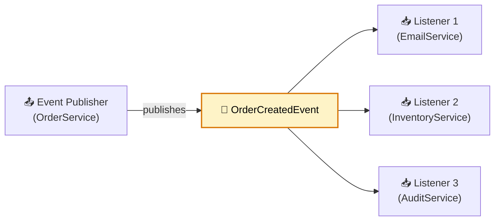
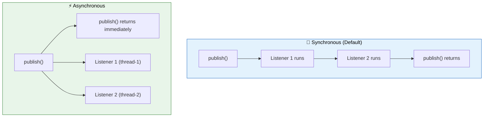

# 📡 Spring Events & Application Events

> **Decouple components within a service using the publisher-subscriber pattern — without tight coupling or external message brokers.**

---

!!! abstract "Real-World Analogy"
    Think of a **newspaper publisher**. When news breaks, the publisher prints it once — every subscriber gets their copy without the publisher knowing who they are. Spring Events work the same way: a component publishes an event, and any listener receives it, without the publisher depending on the listeners.



---

## 🏗️ Basic Event Flow

### 1. Define the Event

```java
public record OrderCreatedEvent(
    String orderId,
    String userId,
    BigDecimal totalAmount,
    List<String> itemIds,
    Instant createdAt
) {}
```

### 2. Publish the Event

```java
@Service
@RequiredArgsConstructor
public class OrderService {

    private final OrderRepository orderRepository;
    private final ApplicationEventPublisher eventPublisher;

    @Transactional
    public Order createOrder(CreateOrderRequest request) {
        Order order = orderRepository.save(Order.from(request));

        eventPublisher.publishEvent(new OrderCreatedEvent(
            order.getId(),
            order.getUserId(),
            order.getTotalAmount(),
            order.getItemIds(),
            Instant.now()
        ));

        return order;
    }
}
```

### 3. Listen to the Event

```java
@Component
@RequiredArgsConstructor
@Slf4j
public class OrderEventListeners {

    private final EmailService emailService;
    private final InventoryService inventoryService;

    @EventListener
    public void sendConfirmationEmail(OrderCreatedEvent event) {
        log.info("Sending confirmation for order: {}", event.orderId());
        emailService.sendOrderConfirmation(event.userId(), event.orderId());
    }

    @EventListener
    public void reserveInventory(OrderCreatedEvent event) {
        log.info("Reserving inventory for order: {}", event.orderId());
        inventoryService.reserve(event.itemIds());
    }
}
```

---

## 🔄 Synchronous vs Asynchronous Events

By default, Spring Events are **synchronous** — the publisher waits for all listeners to complete.



### Async Events

```java
@Configuration
@EnableAsync
public class AsyncConfig {

    @Bean("eventExecutor")
    public Executor eventExecutor() {
        ThreadPoolTaskExecutor executor = new ThreadPoolTaskExecutor();
        executor.setCorePoolSize(5);
        executor.setMaxPoolSize(20);
        executor.setQueueCapacity(100);
        executor.setThreadNamePrefix("event-");
        executor.initialize();
        return executor;
    }
}

@Component
public class NotificationListener {

    @Async("eventExecutor")
    @EventListener
    public void handleOrderCreated(OrderCreatedEvent event) {
        // Runs in separate thread — doesn't block publisher
        notificationService.pushNotification(event.userId(), "Order confirmed!");
    }
}
```

---

## 🔒 Transactional Event Listeners

Execute listener only when the current transaction succeeds (or fails):

```java
@Component
public class TransactionalListeners {

    @TransactionalEventListener(phase = TransactionPhase.AFTER_COMMIT)
    public void afterOrderCommitted(OrderCreatedEvent event) {
        // Only runs if the transaction commits successfully
        // Safe to send emails, notifications, etc.
        emailService.sendOrderConfirmation(event.orderId());
    }

    @TransactionalEventListener(phase = TransactionPhase.AFTER_ROLLBACK)
    public void afterOrderRolledBack(OrderCreatedEvent event) {
        // Runs only if transaction rolled back
        log.warn("Order creation failed for: {}", event.orderId());
        alertService.notifyFailure(event.orderId());
    }
}
```

| Phase | When it fires |
|---|---|
| `AFTER_COMMIT` | Transaction committed successfully |
| `AFTER_ROLLBACK` | Transaction rolled back |
| `AFTER_COMPLETION` | After commit or rollback (always) |
| `BEFORE_COMMIT` | Before transaction commits |

---

## 🎯 Conditional Event Listeners

```java
@Component
public class ConditionalListeners {

    // Only handle high-value orders
    @EventListener(condition = "#event.totalAmount > 1000")
    public void handleHighValueOrder(OrderCreatedEvent event) {
        fraudDetectionService.flag(event.orderId());
    }

    // Listen to multiple event types
    @EventListener({OrderCreatedEvent.class, OrderCancelledEvent.class})
    public void auditOrderChange(Object event) {
        auditService.log(event);
    }
}
```

---

## 🏗️ Generic Events with Generics

```java
// Generic wrapper for entity events
public record EntityEvent<T>(T entity, EventType type) {
    public enum EventType { CREATED, UPDATED, DELETED }
}

// Publishing
eventPublisher.publishEvent(new EntityEvent<>(order, EventType.CREATED));

// Listening with ResolvableTypeProvider for generic resolution
@Component
public class OrderEntityListener {

    @EventListener
    public void handleOrderEntity(EntityEvent<Order> event) {
        if (event.type() == EventType.CREATED) {
            // handle creation
        }
    }
}
```

---

## 📊 Built-in Spring Events

| Event | When it fires |
|---|---|
| `ContextRefreshedEvent` | ApplicationContext initialized or refreshed |
| `ContextStartedEvent` | Context started via `start()` |
| `ContextStoppedEvent` | Context stopped via `stop()` |
| `ContextClosedEvent` | Context closed (shutdown) |
| `ServletRequestHandledEvent` | HTTP request completed (Web apps) |

```java
@Component
public class AppStartupListener {

    @EventListener(ApplicationReadyEvent.class)
    public void onStartup() {
        log.info("Application started — initializing caches...");
        cacheWarmupService.warmAll();
    }
}
```

---

## 🔄 Event-Driven Patterns

### Returning Events from Listeners (Event Chaining)

```java
@EventListener
public OrderShippedEvent handlePaymentConfirmed(PaymentConfirmedEvent event) {
    shipmentService.ship(event.orderId());
    return new OrderShippedEvent(event.orderId()); // Published automatically
}
```

### Publishing Multiple Follow-up Events

```java
@EventListener
public Collection<Object> handleBulkOrder(BulkOrderEvent event) {
    return event.orders().stream()
        .map(order -> new OrderCreatedEvent(order.id(), order.userId(),
            order.amount(), order.items(), Instant.now()))
        .collect(Collectors.toList());
}
```

---

## ⚠️ Common Pitfalls

| Pitfall | Solution |
|---|---|
| Listener throws exception → publisher fails | Use `@Async` or wrap with try-catch |
| Event published in transaction, listener sends email even if TX rolls back | Use `@TransactionalEventListener(AFTER_COMMIT)` |
| Ordering of listeners matters | Use `@Order(1)`, `@Order(2)` on listeners |
| Circular event publishing (infinite loop) | Track processed events, add guard conditions |
| Async listener misses transaction context | Don't rely on `@Transactional` in async listeners |

---

## 🎯 Interview Questions

??? question "1. What are Spring Application Events and when would you use them?"
    Events enable loose coupling between components within a service. Publisher doesn't know about listeners. Use when: one action triggers multiple side effects (send email + update cache + audit log), you want to add new behaviors without modifying existing code, or you need transactional safety for side effects.

??? question "2. What is the difference between @EventListener and @TransactionalEventListener?"
    `@EventListener` executes immediately when the event is published (synchronously by default). `@TransactionalEventListener` waits until the current transaction reaches a specific phase (AFTER_COMMIT, AFTER_ROLLBACK). Use transactional listeners for side effects that should only happen if the DB write succeeds (emails, notifications).

??? question "3. How do you make event listeners asynchronous?"
    Add `@EnableAsync` to configuration, then annotate the listener method with both `@Async` and `@EventListener`. Configure a thread pool to control concurrency. Async listeners don't block the publisher and handle errors independently.

??? question "4. How do Spring Events differ from a message broker like Kafka?"
    Spring Events are in-process only (same JVM). They're synchronous by default, don't survive restarts, and can't communicate between services. Kafka provides durability, cross-service communication, replay capability, and guaranteed delivery. Use Spring Events for intra-service decoupling; use Kafka for inter-service communication.

??? question "5. Can a listener return an event? What happens?"
    Yes. If a `@EventListener` method returns a non-null object (or Collection of objects), Spring automatically publishes the returned object(s) as new events. This enables event chaining — one event triggers processing that produces follow-up events.

??? question "6. How do you control the execution order of multiple listeners?"
    Use the `@Order` annotation (or implement `Ordered` interface) on listener methods. Lower values execute first. Without `@Order`, execution order is undefined. For async listeners, ordering has no effect since they run in parallel threads.
